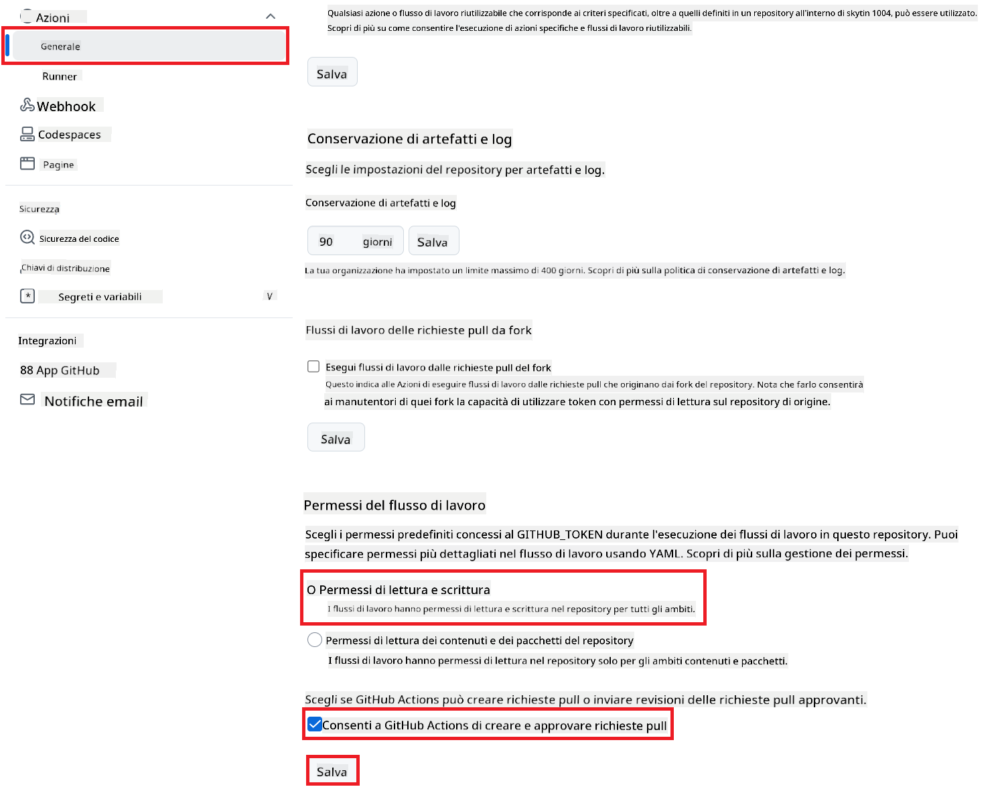

<!--
CO_OP_TRANSLATOR_METADATA:
{
  "original_hash": "a52587a512e667f70d92db853d3c61d5",
  "translation_date": "2025-06-12T19:27:36+00:00",
  "source_file": "getting_started/github-actions-guide/github-actions-guide-public.md",
  "language_code": "it"
}
-->
# Utilizzo della GitHub Action Co-op Translator (Configurazione Pubblica)

**Pubblico di riferimento:** Questa guida è pensata per utenti in repository pubblici o privati dove i permessi standard di GitHub Actions sono sufficienti. Utilizza il `GITHUB_TOKEN` integrato.

Automatizza facilmente la traduzione della documentazione del tuo repository usando la GitHub Action Co-op Translator. Questa guida ti accompagna nella configurazione dell’action per creare automaticamente pull request con traduzioni aggiornate ogni volta che cambiano i tuoi file Markdown di origine o le immagini.

> [!IMPORTANT]
>
> **Scegliere la guida giusta:**
>
> Questa guida illustra la **configurazione più semplice usando il `GITHUB_TOKEN` standard**. È il metodo consigliato per la maggior parte degli utenti perché non richiede la gestione di chiavi private sensibili di GitHub App.
>

## Prerequisiti

Prima di configurare la GitHub Action, assicurati di avere pronte le credenziali necessarie per il servizio AI.

**1. Obbligatorio: Credenziali per il modello di linguaggio AI**  
Ti servono le credenziali per almeno un modello di linguaggio supportato:

- **Azure OpenAI**: Richiede Endpoint, API Key, nomi Modello/Deployment, versione API.  
- **OpenAI**: Richiede API Key, (Opzionale: Org ID, Base URL, Model ID).  
- Consulta [Supported Models and Services](../../../../README.md) per i dettagli.

**2. Facoltativo: Credenziali AI Vision (per traduzione immagini)**

- Necessarie solo se devi tradurre testi all’interno di immagini.  
- **Azure AI Vision**: Richiede Endpoint e Subscription Key.  
- Se non fornite, l’action userà la [modalità solo Markdown](../markdown-only-mode.md).

## Configurazione e Setup

Segui questi passaggi per configurare la GitHub Action Co-op Translator nel tuo repository usando il `GITHUB_TOKEN` standard.

### Passo 1: Comprendere l’autenticazione (Usando `GITHUB_TOKEN`)

Questo workflow usa il `GITHUB_TOKEN` integrato fornito da GitHub Actions. Questo token concede automaticamente i permessi al workflow per interagire con il tuo repository in base alle impostazioni configurate nel **Passo 3**.

### Passo 2: Configurare i segreti del repository

Devi solo aggiungere le tue **credenziali del servizio AI** come segreti criptati nelle impostazioni del repository.

1.  Vai al repository GitHub di destinazione.  
2.  Accedi a **Settings** > **Secrets and variables** > **Actions**.  
3.  Sotto **Repository secrets**, clicca su **New repository secret** per ogni segreto AI richiesto elencato qui sotto.

     *(Riferimento immagine: mostra dove aggiungere i segreti)*

**Segreti del servizio AI richiesti (aggiungi TUTTI quelli che ti servono in base ai Prerequisiti):**

| Nome Segreto                      | Descrizione                                | Fonte del valore                 |
| :------------------------------- | :---------------------------------------- | :------------------------------ |
| `AZURE_SUBSCRIPTION_KEY`                 | Chiave per Azure AI Service (Computer Vision) | Il tuo Azure AI Foundry          |
| `AZURE_AI_SERVICE_ENDPOINT`                 | Endpoint per Azure AI Service (Computer Vision) | Il tuo Azure AI Foundry          |
| `AZURE_OPENAI_API_KEY`                 | Chiave per servizio Azure OpenAI           | Il tuo Azure AI Foundry          |
| `AZURE_OPENAI_ENDPOINT`                 | Endpoint per servizio Azure OpenAI          | Il tuo Azure AI Foundry          |
| `AZURE_OPENAI_MODEL_NAME`                 | Nome modello Azure OpenAI                   | Il tuo Azure AI Foundry          |
| `AZURE_OPENAI_CHAT_DEPLOYMENT_NAME`                | Nome deployment Azure OpenAI                | Il tuo Azure AI Foundry          |
| `AZURE_OPENAI_API_VERSION`                | Versione API per Azure OpenAI                | Il tuo Azure AI Foundry          |
| `OPENAI_API_KEY`                | API Key per OpenAI                           | La tua piattaforma OpenAI        |
| `OPENAI_ORG_ID`                | ID Organizzazione OpenAI (Opzionale)         | La tua piattaforma OpenAI        |
| `OPENAI_CHAT_MODEL_ID`                | ID modello OpenAI specifico (Opzionale)      | La tua piattaforma OpenAI        |
| `OPENAI_BASE_URL`                | URL base API OpenAI personalizzato (Opzionale) | La tua piattaforma OpenAI        |

### Passo 3: Configurare i permessi del workflow

La GitHub Action ha bisogno dei permessi concessi tramite il `GITHUB_TOKEN` per eseguire il checkout del codice e creare pull request.

1.  Nel repository, vai su **Settings** > **Actions** > **General**.  
2.  Scorri fino alla sezione **Workflow permissions**.  
3.  Seleziona **Read and write permissions**. Questo concede al `GITHUB_TOKEN` i permessi `contents: write` e `pull-requests: write` necessari per questo workflow.  
4.  Assicurati che la casella **Allow GitHub Actions to create and approve pull requests** sia **spuntata**.  
5.  Clicca su **Save**.



### Passo 4: Creare il file del workflow

Infine, crea il file YAML che definisce il workflow automatico usando `GITHUB_TOKEN`.

1.  Nella directory principale del repository, crea la cartella `.github/workflows/` se non esiste già.  
2.  All’interno di `.github/workflows/`, crea un file chiamato `co-op-translator.yml`.  
3.  Incolla il contenuto seguente in `co-op-translator.yml`.

```yaml
name: Co-op Translator

on:
  push:
    branches:
      - main

jobs:
  co-op-translator:
    runs-on: ubuntu-latest

    permissions:
      contents: write
      pull-requests: write

    steps:
      - name: Checkout repository
        uses: actions/checkout@v4
        with:
          fetch-depth: 0

      - name: Set up Python
        uses: actions/setup-python@v4
        with:
          python-version: '3.10'

      - name: Install Co-op Translator
        run: |
          python -m pip install --upgrade pip
          pip install co-op-translator

      - name: Run Co-op Translator
        env:
          PYTHONIOENCODING: utf-8
          # === AI Service Credentials ===
          AZURE_SUBSCRIPTION_KEY: ${{ secrets.AZURE_SUBSCRIPTION_KEY }}
          AZURE_AI_SERVICE_ENDPOINT: ${{ secrets.AZURE_AI_SERVICE_ENDPOINT }}
          AZURE_OPENAI_API_KEY: ${{ secrets.AZURE_OPENAI_API_KEY }}
          AZURE_OPENAI_ENDPOINT: ${{ secrets.AZURE_OPENAI_ENDPOINT }}
          AZURE_OPENAI_MODEL_NAME: ${{ secrets.AZURE_OPENAI_MODEL_NAME }}
          AZURE_OPENAI_CHAT_DEPLOYMENT_NAME: ${{ secrets.AZURE_OPENAI_CHAT_DEPLOYMENT_NAME }}
          AZURE_OPENAI_API_VERSION: ${{ secrets.AZURE_OPENAI_API_VERSION }}
          OPENAI_API_KEY: ${{ secrets.OPENAI_API_KEY }}
          OPENAI_ORG_ID: ${{ secrets.OPENAI_ORG_ID }}
          OPENAI_CHAT_MODEL_ID: ${{ secrets.OPENAI_CHAT_MODEL_ID }}
          OPENAI_BASE_URL: ${{ secrets.OPENAI_BASE_URL }}
        run: |
          # =====================================================================
          # IMPORTANT: Set your target languages here (REQUIRED CONFIGURATION)
          # =====================================================================
          # Example: Translate to Spanish, French, German. Add -y to auto-confirm.
          translate -l "es fr de" -y  # <--- MODIFY THIS LINE with your desired languages

      - name: Create Pull Request with translations
        uses: peter-evans/create-pull-request@v5
        with:
          token: ${{ secrets.GITHUB_TOKEN }}
          commit-message: "🌐 Update translations via Co-op Translator"
          title: "🌐 Update translations via Co-op Translator"
          body: |
            This PR updates translations for recent changes to the main branch.

            ### 📋 Changes included
            - Translated contents are available in the `translations/` directory
            - Translated images are available in the `translated_images/` directory

            ---
            🌐 Automatically generated by the [Co-op Translator](https://github.com/Azure/co-op-translator) GitHub Action.
          branch: update-translations
          base: main
          labels: translation, automated-pr
          delete-branch: true
          add-paths: |
            translations/
            translated_images/
```  
4.  **Personalizza il workflow:**  
  - **[!IMPORTANT] Lingue target:** Nel passaggio `Run Co-op Translator` step, you **MUST review and modify the list of language codes** within the `translate -l "..." -y` command to match your project's requirements. The example list (`ar de es...`) needs to be replaced or adjusted.
  - **Trigger (`on:`):** The current trigger runs on every push to `main`. For large repositories, consider adding a `paths:` filter (see commented example in the YAML) to run the workflow only when relevant files (e.g., source documentation) change, saving runner minutes.
  - **PR Details:** Customize the `commit-message`, `title`, `body`, `branch` name, and `labels` in the `Create Pull Request` se necessario.

**Disclaimer**:  
Questo documento è stato tradotto utilizzando il servizio di traduzione automatica [Co-op Translator](https://github.com/Azure/co-op-translator). Pur impegnandoci per garantire accuratezza, si prega di considerare che le traduzioni automatiche possono contenere errori o imprecisioni. Il documento originale nella sua lingua originale deve essere considerato la fonte autorevole. Per informazioni critiche, si raccomanda una traduzione professionale effettuata da un essere umano. Non siamo responsabili per eventuali incomprensioni o interpretazioni errate derivanti dall’uso di questa traduzione.