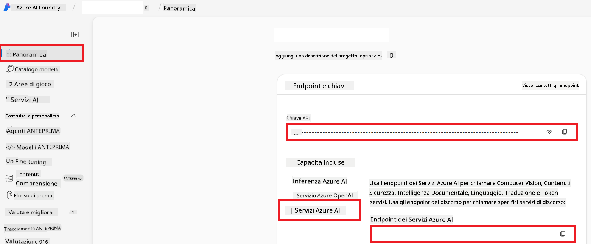

<!--
CO_OP_TRANSLATOR_METADATA:
{
  "original_hash": "b58d7c3cb4210697a073d20eb3064945",
  "translation_date": "2025-06-12T11:51:40+00:00",
  "source_file": "getting_started/set-up-azure-ai.md",
  "language_code": "it"
}
-->
# Configura Azure AI para Co-op Translator (Azure OpenAI y Azure AI Vision)

Esta guía te lleva paso a paso para configurar Azure OpenAI para traducción de idiomas y Azure Computer Vision para análisis de contenido de imágenes (que luego puede usarse para traducción basada en imágenes) dentro de Azure AI Foundry.

**Requisitos previos:**
- Una cuenta de Azure con una suscripción activa.
- Permisos suficientes para crear recursos y despliegues en tu suscripción de Azure.

## Crear un proyecto de Azure AI

Comenzarás creando un proyecto de Azure AI, que funciona como un lugar central para gestionar tus recursos de IA.

1. Navega a [https://ai.azure.com](https://ai.azure.com) e inicia sesión con tu cuenta de Azure.

1. Selecciona **+Create** para crear un nuevo proyecto.

1. Realiza las siguientes tareas:
   - Ingresa un **Nombre del proyecto** (por ejemplo, `CoopTranslator-Project`).
   - Selecciona el **AI hub** (por ejemplo, `CoopTranslator-Hub`) (crea uno nuevo si es necesario).

1. Haz clic en "**Review and Create**" para configurar tu proyecto. Serás dirigido a la página de resumen de tu proyecto.

## Configurar Azure OpenAI para traducción de idiomas

Dentro de tu proyecto, desplegarás un modelo de Azure OpenAI para que funcione como backend para la traducción de texto.

### Navegar a tu proyecto

Si aún no estás allí, abre tu proyecto recién creado (por ejemplo, `CoopTranslator-Project`) en Azure AI Foundry.

### Desplegar un modelo OpenAI

1. En el menú lateral izquierdo de tu proyecto, bajo "My assets", selecciona "**Models + endpoints**".

1. Selecciona **+ Deploy model**.

1. Selecciona **Deploy Base Model**.

1. Verás una lista de modelos disponibles. Filtra o busca un modelo GPT adecuado. Recomendamos `gpt-4o`.

1. Selecciona el modelo deseado y haz clic en **Confirm**.

1. Selecciona **Deploy**.

### Configuración de Azure OpenAI

Una vez desplegado, puedes seleccionar el despliegue desde la página "**Models + endpoints**" para encontrar su **REST endpoint URL**, **Key**, **Deployment name**, **Model name** y **API version**. Estos datos serán necesarios para integrar el modelo de traducción en tu aplicación.

> [!NOTE]
> Puedes seleccionar versiones de API desde la página de [API version deprecation](https://learn.microsoft.com/azure/ai-services/openai/api-version-deprecation) según tus necesidades. Ten en cuenta que la **versión de API** es diferente de la **versión del modelo** que aparece en la página **Models + endpoints** en Azure AI Foundry.

## Configurar Azure Computer Vision para traducción de imágenes

Para habilitar la traducción de texto dentro de imágenes, necesitas obtener la clave API y el endpoint del Azure AI Service.

1. Navega a tu proyecto de Azure AI (por ejemplo, `CoopTranslator-Project`). Asegúrate de estar en la página de resumen del proyecto.

### Configuración del servicio Azure AI

Encuentra la clave API y el endpoint en el Azure AI Service.

1. Navega a tu proyecto de Azure AI (por ejemplo, `CoopTranslator-Project`). Asegúrate de estar en la página de resumen del proyecto.

1. Encuentra la **API Key** y el **Endpoint** en la pestaña Azure AI Service.

    

Esta conexión hace que las capacidades del recurso vinculado de Azure AI Services (incluido el análisis de imágenes) estén disponibles para tu proyecto en AI Foundry. Luego puedes usar esta conexión en tus notebooks o aplicaciones para extraer texto de imágenes, que posteriormente puede enviarse al modelo Azure OpenAI para su traducción.

## Consolidando tus credenciales

Para este punto, deberías haber recopilado lo siguiente:

**Para Azure OpenAI (Traducción de texto):**
- Azure OpenAI Endpoint
- Azure OpenAI API Key
- Azure OpenAI Model Name (por ejemplo, `gpt-4o`)
- Azure OpenAI Deployment Name (por ejemplo, `cooptranslator-gpt4o`)
- Azure OpenAI API Version

**Para Azure AI Services (Extracción de texto de imágenes vía Vision):**
- Azure AI Service Endpoint
- Azure AI Service API Key

### Ejemplo: Configuración de variables de entorno (Vista previa)

Más adelante, al construir tu aplicación, probablemente la configurarás usando estas credenciales recopiladas. Por ejemplo, podrías establecerlas como variables de entorno de esta forma:

```bash
# Azure AI Service Credentials (Required for image translation)
AZURE_AI_SERVICE_API_KEY="your_azure_ai_service_api_key" # e.g., 21xasd...
AZURE_AI_SERVICE_ENDPOINT="https://your_azure_ai_service_endpoint.cognitiveservices.azure.com/"

# Azure OpenAI Credentials (Required for text translation)
AZURE_OPENAI_API_KEY="your_azure_openai_api_key" # e.g., 21xasd...
AZURE_OPENAI_ENDPOINT="https://your_azure_openai_endpoint.openai.azure.com/"
AZURE_OPENAI_MODEL_NAME="your_model_name" # e.g., gpt-4o
AZURE_OPENAI_CHAT_DEPLOYMENT_NAME="your_deployment_name" # e.g., cooptranslator-gpt4o
AZURE_OPENAI_API_VERSION="your_api_version" # e.g., 2024-12-01-preview
```

---

### Lecturas adicionales

- [Cómo crear un proyecto en Azure AI Foundry](https://learn.microsoft.com/azure/ai-foundry/how-to/create-projects?tabs=ai-studio)
- [Cómo crear recursos de Azure AI](https://learn.microsoft.com/azure/ai-foundry/how-to/create-azure-ai-resource?tabs=portal)
- [Cómo desplegar modelos OpenAI en Azure AI Foundry](https://learn.microsoft.com/en-us/azure/ai-foundry/how-to/deploy-models-openai)

**Disclaimer**:  
Questo documento è stato tradotto utilizzando il servizio di traduzione automatica [Co-op Translator](https://github.com/Azure/co-op-translator). Pur impegnandoci per garantire accuratezza, si prega di notare che le traduzioni automatiche possono contenere errori o inesattezze. Il documento originale nella sua lingua nativa deve essere considerato la fonte autorevole. Per informazioni critiche, si raccomanda una traduzione professionale effettuata da un umano. Non ci assumiamo responsabilità per eventuali malintesi o interpretazioni errate derivanti dall’uso di questa traduzione.