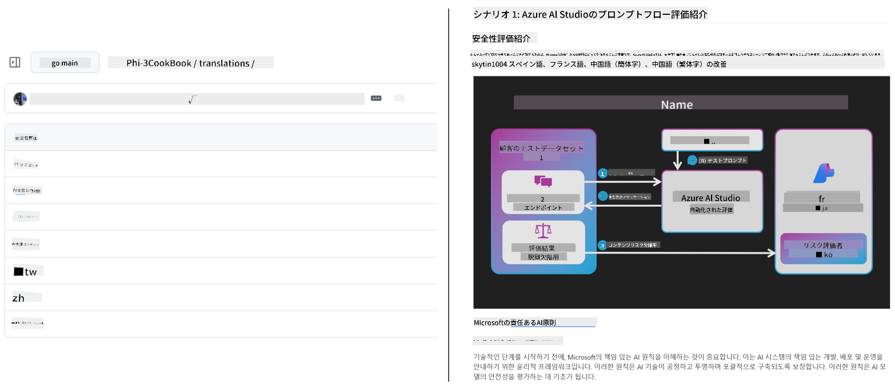

<!--
CO_OP_TRANSLATOR_METADATA:
{
  "original_hash": "dac6bc281667816537df51f724a0ff2c",
  "translation_date": "2025-11-30T10:24:16+00:00",
  "source_file": "README.md",
  "language_code": "ja"
}
-->
# Co-op Translator

_教育向けのGitHubコンテンツを複数言語に簡単に自動翻訳し、世界中の学習者に届けましょう。_

[](https://pypi.org/project/co-op-translator/)
[](https://github.com/azure/co-op-translator/blob/main/LICENSE)
[](https://pepy.tech/project/co-op-translator)
[](https://pepy.tech/project/co-op-translator)
[](https://github.com/azure/co-op-translator/pkgs/container/co-op-translator)
[](https://github.com/psf/black)

[](https://GitHub.com/azure/co-op-translator/graphs/contributors/)
[](https://GitHub.com/azure/co-op-translator/issues/)
[](https://GitHub.com/azure/co-op-translator/pulls/)
[](http://makeapullrequest.com)

### 🌐 多言語対応

#### [Co-op Translator](https://github.com/Azure/Co-op-Translator) による対応言語

<!-- CO-OP TRANSLATOR LANGUAGES TABLE START -->
[アラビア語](../ar/README.md) | [ベンガル語](../bn/README.md) | [ブルガリア語](../bg/README.md) | [ビルマ語（ミャンマー）](../my/README.md) | [中国語（簡体字）](../zh/README.md) | [中国語（繁体字、香港）](../hk/README.md) | [中国語（繁体字、マカオ）](../mo/README.md) | [中国語（繁体字、台湾）](../tw/README.md) | [クロアチア語](../hr/README.md) | [チェコ語](../cs/README.md) | [デンマーク語](../da/README.md) | [オランダ語](../nl/README.md) | [エストニア語](../et/README.md) | [フィンランド語](../fi/README.md) | [フランス語](../fr/README.md) | [ドイツ語](../de/README.md) | [ギリシャ語](../el/README.md) | [ヘブライ語](../he/README.md) | [ヒンディー語](../hi/README.md) | [ハンガリー語](../hu/README.md) | [インドネシア語](../id/README.md) | [イタリア語](../it/README.md) | [日本語](./README.md) | [カンナダ語](../kn/README.md) | [韓国語](../ko/README.md) | [リトアニア語](../lt/README.md) | [マレー語](../ms/README.md) | [マラヤーラム語](../ml/README.md) | [マラーティー語](../mr/README.md) | [ネパール語](../ne/README.md) | [ナイジェリア・ピジン語](../pcm/README.md) | [ノルウェー語](../no/README.md) | [ペルシア語（ファルシ）](../fa/README.md) | [ポーランド語](../pl/README.md) | [ポルトガル語（ブラジル）](../br/README.md) | [ポルトガル語（ポルトガル）](../pt/README.md) | [パンジャブ語（グルムキー）](../pa/README.md) | [ルーマニア語](../ro/README.md) | [ロシア語](../ru/README.md) | [セルビア語（キリル文字）](../sr/README.md) | [スロバキア語](../sk/README.md) | [スロベニア語](../sl/README.md) | [スペイン語](../es/README.md) | [スワヒリ語](../sw/README.md) | [スウェーデン語](../sv/README.md) | [タガログ語（フィリピン）](../tl/README.md) | [タミル語](../ta/README.md) | [テルグ語](../te/README.md) | [タイ語](../th/README.md) | [トルコ語](../tr/README.md) | [ウクライナ語](../uk/README.md) | [ウルドゥー語](../ur/README.md) | [ベトナム語](../vi/README.md)
<!-- CO-OP TRANSLATOR LANGUAGES TABLE END -->

[](https://GitHub.com/azure/co-op-translator/watchers/)
[](https://GitHub.com/azure/co-op-translator/network/)
[](https://GitHub.com/azure/co-op-translator/stargazers/)

[](https://discord.gg/nTYy5BXMWG)

[](https://codespaces.new/azure/co-op-translator)

## 概要

**Co-op Translator** は、教育用のGitHubコンテンツを複数言語に簡単にローカライズできるツールです。  
Markdownファイル、画像、ノートブックを更新すると、翻訳も自動的に同期され、世界中の学習者に正確で最新のコンテンツを提供できます。

翻訳されたコンテンツの整理例：



## クイックスタート

```bash
# 仮想環境を作成して有効化する（推奨）
python -m venv .venv
# Windows
.venv\Scripts\activate
# macOS/Linux
source .venv/bin/activate
# パッケージをインストールする
pip install co-op-translator
# 翻訳する
translate -l "ko ja fr" -md
```

Docker:

```bash
# GHCRからパブリックイメージを取得する
docker pull ghcr.io/azure/co-op-translator:latest
# 現在のフォルダをマウントし、.envを提供して実行する（Bash/Zsh）
docker run --rm -it --env-file .env -v "${PWD}:/work" ghcr.io/azure/co-op-translator:latest -l "ko ja fr" -md
```

## 最小限のセットアップ

1. テンプレート [.env.template](../../.env.template) を使って `.env` ファイルを作成
2. 1つのLLMプロバイダー（Azure OpenAIまたはOpenAI）を設定
3. （任意）画像翻訳（`-img`）用にAzure AI Visionを設定
4. （推奨）競合を避けるため、以前の翻訳をクリーンアップ（例：`translations/`）
5. （推奨）READMEに翻訳セクションを追加（[README languages template](./getting_started/README_languages_template.md)を参照）
6. 詳細は：[Azure AIのセットアップ](./getting_started/set-up-azure-ai.md) を参照

## 使い方

対応するすべてのタイプを翻訳：

```bash
translate -l "ko ja"
```

Markdownのみ：

```bash
translate -l "de" -md
```

Markdown＋画像：

```bash
translate -l "pt" -md -img
```

ノートブックのみ：

```bash
translate -l "zh" -nb
```

その他のオプション：[コマンドリファレンス](./getting_started/command-reference.md)

## 特徴

- Markdown、ノートブック、画像の自動翻訳
- ソースの変更に合わせて翻訳を同期
- ローカル（CLI）またはCI（GitHub Actions）で動作
- Azure OpenAIまたはOpenAIを使用、画像はAzure AI Visionも利用可能
- Markdownの書式や構造を保持

## ドキュメント

- [コマンドラインガイド](./getting_started/command-line-guide/command-line-guide.md)
- [GitHub Actionsガイド（公開リポジトリ＆標準シークレット）](./getting_started/github-actions-guide/github-actions-guide-public.md)
- [GitHub Actionsガイド（Microsoft組織リポジトリ＆組織レベル設定）](./getting_started/github-actions-guide/github-actions-guide-org.md)
- [README言語テンプレート](./getting_started/README_languages_template.md)
- [対応言語一覧](./getting_started/supported-languages.md)
- [コントリビューション](./CONTRIBUTING.md)
- [トラブルシューティング](./getting_started/troubleshooting.md)

### Microsoft向けガイド
> [!NOTE]
> Microsoftの「For Beginners」リポジトリのメンテナ向けのみ。

- [「その他のコース」リストの更新（MS Beginnersリポジトリ限定）](./getting_started/update-other-courses.md)

## 私たちを支援し、グローバルな学びを促進しましょう

教育コンテンツのグローバル共有のあり方を一緒に変革しましょう！  
[Co-op Translator](https://github.com/azure/co-op-translator) にGitHubで⭐をつけて、学習と言語の壁をなくすミッションを応援してください。  
皆さんの関心と貢献が大きな力になります！コードの貢献や機能提案も大歓迎です。

### Microsoftの教育コンテンツをあなたの言語で探検

- [AZD for Beginners](https://github.com/microsoft/AZD-for-beginners)
- [Edge AI for Beginners](https://github.com/microsoft/edgeai-for-beginners)
- [Model Context Protocol (MCP) For Beginners](https://github.com/microsoft/mcp-for-beginners)
- [AI Agents for Beginners](https://github.com/microsoft/ai-agents-for-beginners)
- [.NETで学ぶ生成AI](https://github.com/microsoft/Generative-AI-for-beginners-dotnet)
- [生成AI入門](https://github.com/microsoft/generative-ai-for-beginners)
- [Javaで学ぶ生成AI](https://github.com/microsoft/generative-ai-for-beginners-java)
- [ML for Beginners](https://aka.ms/ml-beginners)
- [Data Science for Beginners](https://aka.ms/datascience-beginners)
- [AI for Beginners](https://aka.ms/ai-beginners)
- [Cybersecurity for Beginners](https://github.com/microsoft/Security-101)
- [Web Dev for Beginners](https://aka.ms/webdev-beginners)
- [IoT for Beginners](https://aka.ms/iot-beginners)
- [PhiCookBook](https://github.com/microsoft/PhiCookBook)

## ビデオプレゼンテーション

👉 下の画像をクリックしてYouTubeで視聴できます。

- **Open at Microsoft**：Co-op Translatorの簡単な18分間の紹介と使い方ガイド。

  [](https://www.youtube.com/watch?v=jX_swfH_KNU)

## コントリビューション

このプロジェクトは貢献や提案を歓迎しています。Azure Co-op Translatorへの参加に興味がある方は、[CONTRIBUTING.md](./CONTRIBUTING.md) をご覧ください。より多くの人に使いやすくするためのガイドラインを掲載しています。

## コントリビューター

[](https://github.com/Azure/co-op-translator/graphs/contributors)

## 行動規範

本プロジェクトは[Microsoft Open Source Code of Conduct](https://opensource.microsoft.com/codeofconduct/)を採用しています。  
詳細は[行動規範FAQ](https://opensource.microsoft.com/codeofconduct/faq/)をご覧いただくか、質問やコメントは[opencode@microsoft.com](mailto:opencode@microsoft.com)までご連絡ください。

## 責任あるAI

Microsoftは、お客様がAI製品を責任を持って利用できるよう支援し、学びを共有し、透明性ノートや影響評価などのツールを通じて信頼に基づくパートナーシップを築くことに取り組んでいます。これらのリソースは[https://aka.ms/RAI](https://aka.ms/RAI)でご覧いただけます。  
Microsoftの責任あるAIへのアプローチは、公平性、信頼性と安全性、プライバシーとセキュリティ、包括性、透明性、説明責任というAI原則に基づいています。

このサンプルで使用されているような大規模な自然言語、画像、音声モデルは、不公平、不信頼、攻撃的な振る舞いをする可能性があり、それが害を引き起こすことがあります。リスクや制限については、[Azure OpenAIサービスの透明性ノート](https://learn.microsoft.com/legal/cognitive-services/openai/transparency-note?tabs=text)をご参照ください。
これらのリスクを軽減するための推奨アプローチは、有害な行動を検出し防止できる安全システムをアーキテクチャに組み込むことです。[Azure AI Content Safety](https://learn.microsoft.com/azure/ai-services/content-safety/overview) は独立した保護層を提供し、アプリケーションやサービス内のユーザー生成およびAI生成の有害コンテンツを検出できます。Azure AI Content Safety には、有害な素材を検出できるテキストおよび画像のAPIが含まれています。また、インタラクティブなContent Safety Studioもあり、異なるモダリティにわたる有害コンテンツの検出用サンプルコードを閲覧、探索、試すことができます。以下の[クイックスタートドキュメント](https://learn.microsoft.com/azure/ai-services/content-safety/quickstart-text?tabs=visual-studio%2Clinux&pivots=programming-language-rest)では、サービスへのリクエスト方法を案内しています。

もう一つ考慮すべき点は、アプリケーション全体のパフォーマンスです。マルチモーダルかつマルチモデルのアプリケーションでは、パフォーマンスとはシステムがユーザーや開発者の期待通りに動作し、有害な出力を生成しないことを意味します。全体のアプリケーションのパフォーマンスを評価するには、[生成品質およびリスク・安全性の指標](https://learn.microsoft.com/azure/ai-studio/concepts/evaluation-metrics-built-in)を用いることが重要です。

開発環境でAIアプリケーションを評価するには、[prompt flow SDK](https://microsoft.github.io/promptflow/index.html)を使用できます。テストデータセットやターゲットを指定すると、生成AIアプリケーションの生成物を組み込みの評価器やカスタム評価器で定量的に測定できます。prompt flow SDKを使ってシステムを評価するには、[クイックスタートガイド](https://learn.microsoft.com/azure/ai-studio/how-to/develop/flow-evaluate-sdk)に従ってください。評価実行後は、[Azure AI Studioで結果を可視化](https://learn.microsoft.com/azure/ai-studio/how-to/evaluate-flow-results)できます。

## 商標について

このプロジェクトには、プロジェクト、製品、サービスの商標やロゴが含まれている場合があります。Microsoftの商標やロゴの使用は、[Microsoftの商標およびブランドガイドライン](https://www.microsoft.com/en-us/legal/intellectualproperty/trademarks/usage/general)に従う必要があります。Microsoftの商標やロゴを改変したバージョンで使用する場合、混乱を招いたりMicrosoftの後援を示唆したりしてはなりません。第三者の商標やロゴの使用は、それら第三者のポリシーに従います。

## サポートについて

AIアプリの構築で行き詰まったり質問がある場合は、以下に参加してください：

[](https://discord.gg/nTYy5BXMWG)

製品のフィードバックや構築中のエラーについては、以下をご利用ください：

[](https://aka.ms/foundry/forum)

---

<!-- CO-OP TRANSLATOR DISCLAIMER START -->
**免責事項**：  
本書類はAI翻訳サービス「Co-op Translator」（https://github.com/Azure/co-op-translator）を使用して翻訳されました。正確性の向上に努めておりますが、自動翻訳には誤りや不正確な部分が含まれる可能性があります。原文の言語による文書が正式な情報源とみなされるべきです。重要な情報については、専門の人間による翻訳を推奨します。本翻訳の利用により生じたいかなる誤解や誤訳についても、当方は一切責任を負いかねます。
<!-- CO-OP TRANSLATOR DISCLAIMER END -->