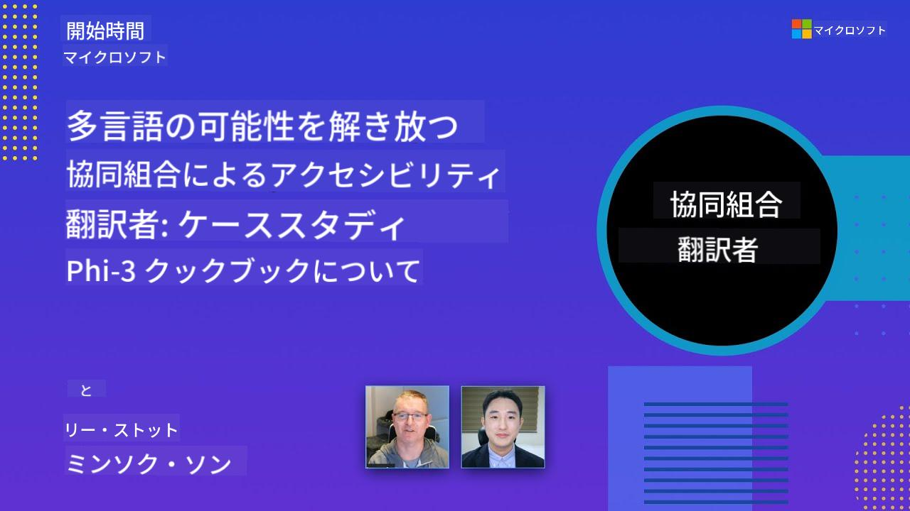

<!--
CO_OP_TRANSLATOR_METADATA:
{
  "original_hash": "044724537b57868117aadae8e7728c7c",
  "translation_date": "2025-07-04T08:10:30+00:00",
  "source_file": "README.md",
  "language_code": "ja"
}
-->


# Co-op Translator: 教育用ドキュメントの翻訳を自動化

_ドキュメントを複数の言語に簡単に自動翻訳し、グローバルなオーディエンスに届けましょう。_

### Co-op Translatorによる言語サポート

> [!NOTE]
> これらは、このリポジトリのコンテンツの現在の翻訳です。Co-op Translatorがサポートする言語の完全なリストについては、[言語サポート](../..)セクションをご覧ください。

## 概要: 教育コンテンツの翻訳を効率化

言語の壁は、世界中の学習者や開発者にとって貴重な教育リソースや技術知識へのアクセスを大きく妨げています。これにより、参加が制限され、グローバルなイノベーションと学習のペースが遅くなります。

**Co-op Translator**は、Microsoftの大規模な教育シリーズ（「For Beginners」ガイドなど）の非効率な手動翻訳プロセスに対処する必要性から生まれました。これは、誰にでもこの壁を打破するために設計された使いやすく強力なツールに進化しました。CLIとGitHub Actionsを通じて高品質な自動翻訳を提供することで、Co-op Translatorは教育者、学生、研究者、開発者が言語の制約なく知識を共有しアクセスできるようにします。

Co-op Translatorが翻訳された教育コンテンツをどのように整理するかをご覧ください。

Markdownファイルと画像のテキストは自動的に翻訳され、言語別のフォルダにきちんと整理されます。

**今日からCo-op Translatorで教育コンテンツのグローバルアクセスを解放しましょう！**

## Microsoftの学習リソースのグローバルアクセスをサポート

Co-op Translatorは、グローバルな開発者コミュニティにサービスを提供するリポジトリの翻訳プロセスを自動化し、Microsoftの主要な教育イニシアチブの言語の壁を埋めるのに役立ちます。現在Co-op Translatorを使用している例には以下があります。

## 主な機能

- **自動翻訳**: テキストを複数の言語に簡単に翻訳します。
- **GitHub Actions統合**: CI/CDパイプラインの一部として翻訳を自動化します。
- **Markdownの保持**: 翻訳中に正しいMarkdown構文を維持します。
- **画像テキストの翻訳**: 画像内のテキストを抽出して翻訳します。
- **高度なLLM技術**: 高品質な翻訳のために最先端の言語モデルを使用します。
- **簡単な統合**: 既存のプロジェクト設定にシームレスに統合します。
- **ローカリゼーションの簡素化**: プロジェクトを国際市場向けにローカライズするプロセスを効率化します。

## 仕組み

Co-op Translatorは、プロジェクトフォルダからMarkdownファイルと画像を取り出し、以下のように処理します。

1. **テキスト抽出**: Markdownファイルからテキストを抽出し、設定されている場合（例: Azure AI Visionを使用）、画像内に埋め込まれたテキストも抽出します。
1. **AI翻訳**: 抽出されたテキストを設定されたLLM（Azure OpenAI、OpenAIなど）に送信して翻訳します。
1. **結果の保存**: 翻訳されたMarkdownファイルと画像（翻訳されたテキスト付き）を言語別フォルダに保存し、元のフォーマットを保持します。

## はじめに

CLIを使用してすぐに始めるか、GitHub Actionsを使用して完全な自動化を設定します。ワークフローに最適なアプローチを選択してください。

1. **コマンドライン (CLI)** - 一度限りの翻訳や手動制御に
2. **GitHub Actions** - プッシュごとに自動翻訳

### 言語サポート

Co-op Translatorは、グローバルなオーディエンスにリーチするために幅広い言語をサポートしています。知っておくべきことは次のとおりです。

#### クイックリファレンス

| 言語 | コード | 言語 | コード | 言語 | コード |
|----------|------|----------|------|----------|------|
| アラビア語 | ar | ベンガル語 | bn | ブルガリア語 | bg |
| ビルマ語 (ミャンマー) | my | 中国語 (簡体字) | zh | 中国語 (繁体字, 香港) | hk |
| 中国語 (繁体字, マカオ) | mo | 中国語 (繁体字, 台湾) | tw | クロアチア語 | hr |
| チェコ語 | cs | デンマーク語 | da | オランダ語 | nl |
| フィンランド語 | fi | フランス語 | fr | ドイツ語 | de |
| ギリシャ語 | el | ヘブライ語 | he | ヒンディー語 | hi |
| ハンガリー語 | hu | インドネシア語 | id | イタリア語 | it |
| 日本語 | ja | 韓国語 | ko | マレー語 | ms |
| マラーティー語 | mr | ネパール語 | ne | ノルウェー語 | no |
| ペルシャ語 (ファルシ) | fa | ポーランド語 | pl | ポルトガル語 (ブラジル) | br |
| ポルトガル語 (ポルトガル) | pt | パンジャブ語 (グルムキー) | pa | ルーマニア語 | ro |
| ロシア語 | ru | セルビア語 (キリル) | sr | スロバキア語 | sk |
| スロベニア語 | sl | スペイン語 | es | スワヒリ語 | sw |
| スウェーデン語 | sv | タガログ語 (フィリピン) | tl | タイ語 | th |
| トルコ語 | tr | ウクライナ語 | uk | ウルドゥー語 | ur |
| ベトナム語 | vi | — | — | — | — |

#### 言語サポート

Co-op Translatorを使用する際には、言語をコードで指定する必要があります。例えば：

```bash
# Translate to French, Spanish, and German
translate -l "fr es de"

# Translate to Chinese (Simplified) and Japanese
translate -l "zh ja"
```
> [!NOTE]
> 言語サポートに関する詳細な技術情報については、以下を含めてご覧ください：
>
> - 各言語のフォント仕様
> - 既知の問題
> - 新しい言語の追加方法
>
> [サポートされている言語のドキュメント](./getting_started/supported-languages.md)をご覧ください。
### 対応モデルとサービス

| 種類                  | 名前                           |
|-----------------------|--------------------------------|
| 言語モデル        |   |
| AIビジョン       |  |

> [!NOTE]
> AIビジョンサービスが利用できない場合、共同翻訳者は[Markdownのみモード](./getting_started/markdown-only-mode.md)に切り替わります。

### 初期設定

始める前に、以下のリソースを設定する必要があります：

1. 言語モデルリソース（必須）:
   - Azure OpenAI（推奨） - 企業レベルの信頼性で高品質な翻訳を提供
   - OpenAI - Azureアクセスがない場合の代替オプション
   - 対応モデルの詳細情報については、[対応モデルとサービス](../..)を参照してください

1. AIビジョンリソース（オプション）:
   - Azure AI Vision - 画像内のテキストの翻訳を可能にします
   - 設定されていない場合、翻訳者は自動的に[Markdownのみモード](./getting_started/markdown-only-mode.md)を使用します
   - テキストを含む画像の翻訳が必要なプロジェクトに推奨

1. 設定手順:
   - 詳細な手順については、[Azure AI設定ガイド](./getting_started/set-up-azure-ai.md)を参照してください
   - APIキーとエンドポイントを含む`.env`ファイルを作成してください（[クイックスタート](../..)セクションを参照）
   - 選択したサービスに必要な権限とクォータを確保してください

### 翻訳前のプロジェクト設定

翻訳プロセスを開始する前に、以下の手順に従ってプロジェクトを準備してください：

1. READMEの準備:
   - 翻訳版へのリンクを追加するためにREADME.mdに翻訳テーブルを追加してください
   - 例のフォーマット:

     ```markdown

     ### 🌐 Multi-Language Support
     
     [French](../fr/README.md) | [Spanish](../es/README.md) | [German](../de/README.md) | [Russian](../ru/README.md) | [Arabic](../ar/README.md) | [Persian (Farsi)](../fa/README.md) | [Urdu](../ur/README.md) | [Chinese (Simplified)](../zh/README.md) | [Chinese (Traditional, Macau)](../mo/README.md) | [Chinese (Traditional, Hong Kong)](../hk/README.md) | [Chinese (Traditional, Taiwan)](../tw/README.md) | [Japanese](./README.md) | [Korean](../ko/README.md) | [Hindi](../hi/README.md) | [Bengali](../bn/README.md) | [Marathi](../mr/README.md) | [Nepali](../ne/README.md) | [Punjabi (Gurmukhi)](../pa/README.md) | [Portuguese (Portugal)](../pt/README.md) | [Portuguese (Brazil)](../br/README.md) | [Italian](../it/README.md) | [Polish](../pl/README.md) | [Turkish](../tr/README.md) | [Greek](../el/README.md) | [Thai](../th/README.md) | [Swedish](../sv/README.md) | [Danish](../da/README.md) | [Norwegian](../no/README.md) | [Finnish](../fi/README.md) | [Dutch](../nl/README.md) | [Hebrew](../he/README.md) | [Vietnamese](../vi/README.md) | [Indonesian](../id/README.md) | [Malay](../ms/README.md) | [Tagalog (Filipino)](../tl/README.md) | [Swahili](../sw/README.md) | [Hungarian](../hu/README.md) | [Czech](../cs/README.md) | [Slovak](../sk/README.md) | [Romanian](../ro/README.md) | [Bulgarian](../bg/README.md) | [Serbian (Cyrillic)](../sr/README.md) | [Croatian](../hr/README.md) | [Slovenian](../sl/README.md) | [Ukrainian](../uk/README.md) | [Burmese (Myanmar)](../my/README.md) 
    
     ```

1. 既存の翻訳のクリーンアップ（必要な場合）:
   - 既存の翻訳フォルダ（例：`translations/`）を削除してください
   - 古い翻訳ファイルを削除して新しい翻訳プロセスを開始してください
   - これにより、新しい翻訳プロセスとの競合が防止されます

### クイックスタート: コマンドライン

コマンドラインを使用した迅速な開始方法：

1. 仮想環境を作成:

    ```bash
    python -m venv .venv
    ```

1. 仮想環境を有効化:

    - Windowsの場合:

    ```bash
    .venv\scripts\activate
    ```

    - Linux/macOSの場合:

    ```bash
    source .venv/bin/activate
    ```

1. パッケージをインストール:

    ```bash
    pip install co-op-translator
    ```

1. 資格情報の設定:

    - プロジェクトのルートディレクトリに`.env`ファイルを作成してください。
    - [.env.template](../../.env.template)ファイルの内容を新しい`.env`ファイルにコピーしてください。
    - 必要なAPIキーとエンドポイント情報を`.env`ファイルに記入してください。

1. 翻訳を実行:
    - ターミナルでプロジェクトのルートディレクトリに移動してください。
    - `-l`フラグでターゲット言語を指定して翻訳コマンドを実行してください:

    ```bash
    translate -l "ko ja fr"
    ```

    _(`"ko ja fr"` を希望するスペース区切りの言語コードに置き換えてください)_

### 詳細な使用ガイド

ワークフローに最適なアプローチを選択してください：

#### 1. コマンドライン（CLI）を使用

- 最適な用途: 一度限りの翻訳、手動制御、またはカスタムスクリプトへの統合。
- 必要条件: Pythonと`co-op-translator`パッケージのローカルインストール。
- ガイド: [コマンドラインガイド](./getting_started/command-line-guide/command-line-guide.md)

#### 2. GitHub Actions（自動化）を使用

- 最適な用途: リポジトリに変更がプッシュされるたびにコンテンツを自動的に翻訳。翻訳を常に最新に保つ。
- 必要条件: リポジトリにワークフローファイル（`.github/workflows`）を設定。ローカルインストールは不要。
- ガイド:
  - [GitHub Actionsガイド（公開リポジトリと標準の秘密）](./getting_started/github-actions-guide/github-actions-guide-public.md) - 標準のリポジトリ秘密に依存するほとんどの公開または個人リポジトリに使用します。
  - [GitHub Actionsガイド（Microsoft組織リポジトリと組織レベルの設定）](./getting_started/github-actions-guide/github-actions-guide-org.md) - Microsoft GitHub組織内で作業している場合や組織レベルの秘密やランナーを活用する必要がある場合にこのガイドを使用します。

### トラブルシューティングとヒント

- [トラブルシューティングガイド](./getting_started/troubleshooting.md)

### 追加リソース

- [コマンドリファレンス](./getting_started/command-reference.md): 利用可能なすべてのコマンドとオプションの詳細ガイド。
- [対応言語](./getting_started/supported-languages.md): 対応言語のリストと新しい言語を追加するための手順を確認してください。
- [Markdownのみモード](./getting_started/markdown-only-mode.md): 画像翻訳なしでテキストのみを翻訳する方法。

## ビデオプレゼンテーション

共同翻訳者についての詳細をプレゼンテーションで学びましょう _(以下の画像をクリックしてYouTubeで視聴してください。)_:

- **Open at Microsoft**: 共同翻訳者の使用方法についての簡単な18分の紹介とガイド。

  [](https://www.youtube.com/watch?v=jX_swfH_KNU)

## 私たちを支援し、グローバルな学習を促進しましょう

教育コンテンツの共有方法をグローバルに革命化するために参加してください！GitHubで[Co-op Translator](https://github.com/azure/co-op-translator)に⭐を付け、学習と技術の言語の壁を打破する私たちの使命を支援してください。あなたの関心と貢献が大きな影響を与えます！コードの貢献と機能の提案は常に歓迎されます。

## 貢献

このプロジェクトは貢献と提案を歓迎します。Azure Co-op Translatorへの貢献に興味がありますか？共同翻訳者をよりアクセスしやすくするためのガイドラインについては、[CONTRIBUTING.md](./CONTRIBUTING.md)を参照してください。

## 貢献者

[](https://github.com/Azure/co-op-translator/graphs/contributors)

## 行動規範

このプロジェクトは[Microsoft Open Source Code of Conduct](https://opensource.microsoft.com/codeofconduct/)を採用しています。
詳細については、[Code of Conduct FAQ](https://opensource.microsoft.com/codeofconduct/faq/)を参照するか、
追加の質問やコメントがある場合は[opencode@microsoft.com](mailto:opencode@microsoft.com)にお問い合わせください。

## 責任あるAI

Microsoftは、AI製品を責任を持って使用するための支援、学びの共有、透明性ノートや影響評価などのツールを通じた信頼に基づくパートナーシップの構築に取り組んでいます。これらのリソースの多くは[https://aka.ms/RAI](https://aka.ms/RAI)で見つけることができます。
Microsoftの責任あるAIへのアプローチは、公平性、信頼性と安全性、プライバシーとセキュリティ、包括性、透明性、責任のAI原則に基づいています。

このサンプルで使用されているような大規模な自然言語、画像、音声モデルは、不公平、不信頼、または攻撃的な方法で動作する可能性があり、結果として害を引き起こす可能性があります。リスクと制限について知るために、[Azure OpenAIサービスの透明性ノート](https://learn.microsoft.com/legal/cognitive-services/openai/transparency-note?tabs=text)を参照してください。

これらのリスクを軽減するための推奨アプローチは、有害な行動を検出し防止する安全システムをアーキテクチャに含めることです。[Azure AI Content Safety](https://learn.microsoft.com/azure/ai-services/content-safety/overview)は、アプリケーションやサービスで生成された有害なユーザー生成コンテンツやAI生成コンテンツを検出できる独立した保護層を提供します。Azure AI Content Safetyには、有害な素材を検出するためのテキストと画像APIが含まれています。また、異なるモダリティで有害なコンテンツを検出するためのサンプルコードを表示、探索、試すことができるインタラクティブなContent Safety Studioもあります。サービスへのリクエストを行う方法については、次の[クイックスタートドキュメント](https://learn.microsoft.com/azure/ai-services/content-safety/quickstart-text?tabs=visual-studio%2Clinux&pivots=programming-language-rest)を参照してください。

考慮すべきもう一つの側面は、全体的なアプリケーションのパフォーマンスです。マルチモーダルおよびマルチモデルのアプリケーションでは、パフォーマンスとは、システムがユーザーの期待通りに動作し、有害な出力を生成しないことを意味します。全体的なアプリケーションのパフォーマンスを評価するためには、[生成品質とリスクと安全性の指標](https://learn.microsoft.com/azure/ai-studio/concepts/evaluation-metrics-built-in)を使用することが重要です。

開発環境でAIアプリケーションを評価するには、[prompt flow SDK](https://microsoft.github.io/promptflow/index.html)を使用できます。テストデータセットまたはターゲットを指定すると、生成AIアプリケーションの生成が組み込みの評価者または選択したカスタム評価者で定量的に測定されます。システムを評価するためのprompt flow SDKの使用を開始するには、[クイックスタートガイド](https://learn.microsoft.com/azure/ai-studio/how-to/develop/flow-evaluate-sdk)を参照してください。評価実行を実行すると、[Azure AI Studioで結果を視覚化](https://learn.microsoft.com/azure/ai-studio/how-to/evaluate-flow-results)できます。

## 商標

このプロジェクトには、プロジェクト、製品、またはサービスの商標やロゴが含まれている場合があります。Microsoftの商標やロゴの許可された使用は、[Microsoftの商標とブランドガイドライン](https://www.microsoft.com/en-us/legal/intellectualproperty/trademarks/usage/general)に従う必要があります。
このプロジェクトの修正バージョンでMicrosoftの商標やロゴを使用する場合、混乱を招いたりMicrosoftのスポンサーシップを示唆したりしてはなりません。
第三者の商標やロゴの使用は、第三者のポリシーに従う必要があります。

**免責事項**:
この文書はAI翻訳サービス[Co-op Translator](https://github.com/Azure/co-op-translator)を使用して翻訳されています。正確性を追求していますが、自動翻訳には誤りや不正確さが含まれる可能性があることにご注意ください。元の言語での文書が権威ある情報源と見なされるべきです。重要な情報については、専門の人間による翻訳をお勧めします。この翻訳の使用に起因する誤解や誤解について、当社は責任を負いません。
