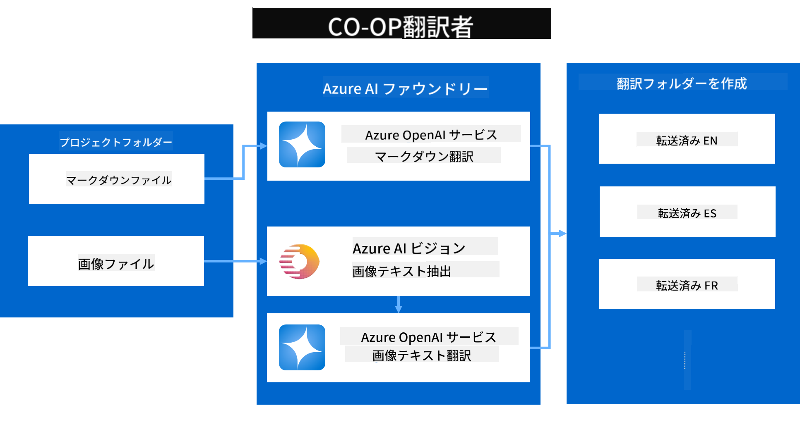
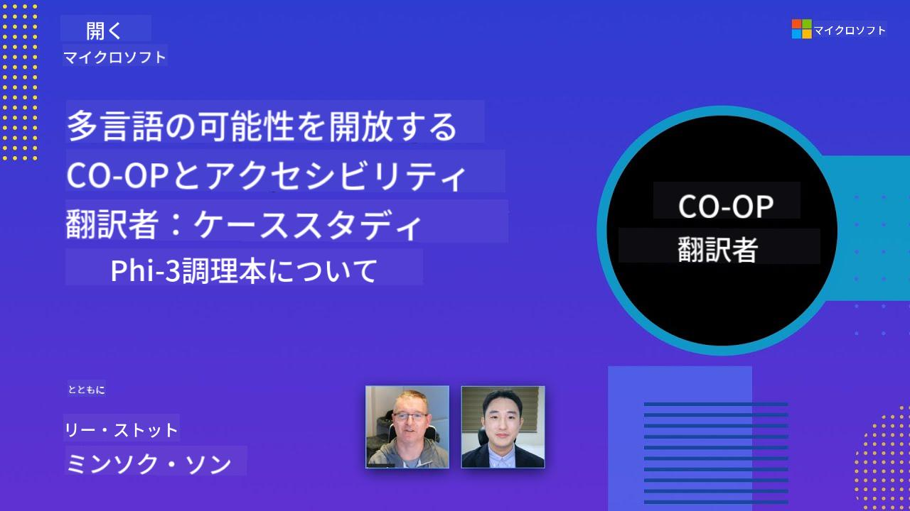

<!--
CO_OP_TRANSLATOR_METADATA:
{
  "original_hash": "044724537b57868117aadae8e7728c7c",
  "translation_date": "2025-06-12T10:05:59+00:00",
  "source_file": "README.md",
  "language_code": "ja"
}
-->


# Co-op Translator: 教育ドキュメントの翻訳を手軽に自動化

_ドキュメントの翻訳を簡単に自動化し、世界中の読者に届けましょう。_

[](https://pypi.org/project/co-op-translator/)
[](https://github.com/azure/co-op-translator/blob/main/LICENSE)
[](https://pepy.tech/project/co-op-translator)
[](https://pepy.tech/project/co-op-translator)
[](https://github.com/psf/black)

[](https://GitHub.com/azure/co-op-translator/graphs/contributors/)
[](https://GitHub.com/azure/co-op-translator/issues/)
[](https://GitHub.com/azure/co-op-translator/pulls/)
[](http://makeapullrequest.com)

### Co-op Translatorによる言語サポート
[フランス語](../fr/README.md) | [スペイン語](../es/README.md) | [ドイツ語](../de/README.md) | [ロシア語](../ru/README.md) | [アラビア語](../ar/README.md) | [ペルシャ語 (ファルシ)](../fa/README.md) | [ウルドゥー語](../ur/README.md) | [中国語 (簡体字)](../zh/README.md) | [中国語 (繁体字、マカオ)](../mo/README.md) | [中国語 (繁体字、香港)](../hk/README.md) | [中国語 (繁体字、台湾)](../tw/README.md) | [日本語](./README.md) | [韓国語](../ko/README.md) | [ヒンディー語](../hi/README.md) | [ベンガル語](../bn/README.md) | [マラーティー語](../mr/README.md) | [ネパール語](../ne/README.md) | [パンジャブ語 (グルムキー)](../pa/README.md) | [ポルトガル語 (ポルトガル)](../pt/README.md) | [ポルトガル語 (ブラジル)](../br/README.md) | [イタリア語](../it/README.md) | [ポーランド語](../pl/README.md) | [トルコ語](../tr/README.md) | [ギリシャ語](../el/README.md) | [タイ語](../th/README.md) | [スウェーデン語](../sv/README.md) | [デンマーク語](../da/README.md) | [ノルウェー語](../no/README.md) | [フィンランド語](../fi/README.md) | [オランダ語](../nl/README.md) | [ヘブライ語](../he/README.md) | [ベトナム語](../vi/README.md) | [インドネシア語](../id/README.md) | [マレー語](../ms/README.md) | [タガログ語 (フィリピン語)](../tl/README.md) | [スワヒリ語](../sw/README.md) | [ハンガリー語](../hu/README.md) | [チェコ語](../cs/README.md) | [スロバキア語](../sk/README.md) | [ルーマニア語](../ro/README.md) | [ブルガリア語](../bg/README.md) | [セルビア語 (キリル)](../sr/README.md) | [クロアチア語](../hr/README.md) | [スロベニア語](../sl/README.md) | [ウクライナ語](../uk/README.md) | [ビルマ語 (ミャンマー)](../my/README.md)
> [!NOTE]
> これはこのリポジトリの現在の翻訳状況です。Co-op Translatorが対応している全言語の一覧は[Language Support](../..)セクションをご覧ください。

[](https://GitHub.com/azure/co-op-translator/watchers/)
[](https://GitHub.com/azure/co-op-translator/network/)
[](https://GitHub.com/azure/co-op-translator/stargazers/)

[](https://discord.com/invite/ByRwuEEgH4)

[](https://codespaces.new/azure/co-op-translator)
[](https://vscode.dev/redirect?url=vscode://ms-vscode-remote.remote-containers/cloneInVolume?url=https://github.com/azure/co-op-translator)

## 概要：教育コンテンツの翻訳を効率化する

言語の壁は、世界中の学習者や開発者が貴重な教育リソースや技術知識にアクセスするのを大きく妨げています。これにより参加が制限され、グローバルなイノベーションや学習の進展が遅くなっています。

**Co-op Translator** は、Microsoft自身の大規模な教育シリーズ（「For Beginners」ガイドなど）の非効率な手動翻訳プロセスを解決する必要から生まれました。現在では誰もが使いやすく強力なツールへと進化し、これらの壁を打ち破ることを目指しています。CLIやGitHub Actionsを通じて高品質な自動翻訳を提供し、教育者、学生、研究者、開発者が言語の制約なく知識を共有・利用できるよう支援します。

Co-op Translatorが翻訳済みの教育コンテンツをどのように整理するかご覧ください：


Markdownファイルや画像内のテキストは自動で翻訳され、言語ごとのフォルダーにきれいに整理されます。

**今すぐCo-op Translatorで教育コンテンツのグローバルアクセスを実現しましょう！**

## Microsoftの学習リソースのグローバルアクセスを支援

Co-op Translatorは、世界中の開発者コミュニティに向けた主要なMicrosoft教育プロジェクトの言語の壁を橋渡しし、翻訳プロセスを自動化します。現在Co-op Translatorを利用している例は以下の通りです：

[](https://github.com/microsoft/Generative-AI-for-beginners)
[](https://github.com/microsoft/ML-For-Beginners)
[](https://github.com/microsoft/AI-For-Beginners)
[](https://github.com/microsoft/ai-agents-for-beginners)
[](https://github.com/microsoft/PhiCookBook)
[](https://github.com/microsoft/Generative-AI-for-beginners-dotnet)

## 主な特徴

- **自動翻訳**：複数言語への翻訳を簡単に実行
- **GitHub Actions連携**：CI/CDパイプラインの一環として翻訳を自動化
- **Markdown形式を保持**：翻訳中も正しいMarkdown構文を維持
- **画像内テキストの翻訳**：画像に含まれるテキストを抽出して翻訳
- **高度なLLM技術**：最先端の言語モデルを利用し高品質な翻訳を実現
- **簡単な統合**：既存のプロジェクト環境にスムーズに組み込み可能
- **ローカライズの簡素化**：国際市場向けのプロジェクトローカライズを効率化

## 仕組み



Co-op Translatorは、プロジェクトフォルダー内のMarkdownファイルや画像を以下のように処理します：

1. **テキスト抽出**：Markdownファイルからテキストを抽出し、設定によっては（例：Azure AI Vision）画像内のテキストも抽出
1. **AI翻訳**：抽出したテキストを設定されたLLM（Azure OpenAI、OpenAIなど）に送信して翻訳
1. **結果保存**：翻訳済みのMarkdownファイルや画像（翻訳済みテキスト入り）を言語別フォルダーに保存し、元のフォーマットを保持

## はじめに

CLIを使ってすぐに始めるか、GitHub Actionsで完全自動化するか、ご自身のワークフローに合った方法を選べます：

1. **コマンドライン（CLI）** - 一回限りの翻訳や手動操作に最適
2. **GitHub Actions** - プッシュのたびに自動翻訳を実行

> [!NOTE]
> このチュートリアルはAzureリソースを中心に説明していますが、対応する任意の言語モデルを使用できます。

### 対応言語

Co-op Translatorは幅広い言語に対応し、グローバルなユーザーにリーチできます。以下をご確認ください：

#### クイックリファレンス

| 言語 | コード | 言語 | コード | 言語 | コード |
|----------|------|----------|------|----------|------|
| アラビア語 | ar | ベンガル語 | bn | ブルガリア語 | bg |
| ビルマ語（ミャンマー） | my | 中国語（簡体字） | zh | 中国語（繁体字、香港） | hk |
| 中国語（繁体字、マカオ） | mo | 中国語（繁体字、台湾） | tw | クロアチア語 | hr |
| チェコ語 | cs | デンマーク語 | da | オランダ語 | nl |
| フィンランド語 | fi | フランス語 | fr | ドイツ語 | de |
| ギリシャ語 | el | ヘブライ語 | he | ヒンディー語 | hi |
| ハンガリー語 | hu | インドネシア語 | id | イタリア語 | it |
| 日本語 | ja | 韓国語 | ko | マレー語 | ms |
| マラーティー語 | mr | ネパール語 | ne | ノルウェー語 | no |
| ペルシャ語（ファルシ） | fa | ポーランド語 | pl | ポルトガル語（ブラジル） | br |
| ポルトガル語（ポルトガル） | pt | パンジャブ語（グルムキー） | pa | ルーマニア語 | ro |
| ロシア語 | ru | セルビア語（キリル文字） | sr | スロバキア語 | sk |
| スロベニア語 | sl | スペイン語 | es | スワヒリ語 | sw |
| スウェーデン語 | sv | タガログ語（フィリピン語） | tl | タイ語 | th |
| トルコ語 | tr | ウクライナ語 | uk | ウルドゥー語 | ur |
| ベトナム語 | vi | — | — | — | — |

#### 言語コードの使い方

Co-op Translatorを使う際は、言語をコードで指定します。例：

```bash
# Translate to French, Spanish, and German
translate -l "fr es de"

# Translate to Chinese (Simplified) and Japanese
translate -l "zh ja"
```

> [!NOTE]
> 言語サポートに関する詳細な技術情報（フォント仕様、既知の問題、新しい言語の追加方法など）は、[Supported Languages Documentation](./getting_started/supported-languages.md)をご覧ください。

### 対応モデルとサービス

| 種類                  | 名称                           |
|-----------------------|--------------------------------|
| 言語モデル            |   |
| AIビジョン            |  |

> [!NOTE]
> AIビジョンサービスが利用できない場合、Co-op Translatorは[Markdown-only mode](./getting_started/markdown-only-mode.md)に切り替わります。

### 初期設定

始める前に以下のリソースを用意してください：

1. 言語モデルリソース（必須）：
   - Azure OpenAI（推奨）— エンタープライズレベルの信頼性と高品質な翻訳を提供
   - OpenAI — Azureアクセスがない場合の代替
   - 対応モデルの詳細は[Supported Models and Services](../..)を参照

1. AIビジョンリソース（任意）：
   - Azure AI Vision — 画像内テキストの翻訳を可能にする
   - 未設定の場合は自動的に[Markdown-only mode](./getting_started/markdown-only-mode.md)が使われる
   - 画像内のテキスト翻訳が必要なプロジェクトに推奨

1. 設定手順：
   - 詳細は[Azure AIセットアップガイド](./getting_started/set-up-azure-ai.md)を参照
   - APIキーやエンドポイントを記載した`.env`ファイルを作成（[Quick Start](../..)参照）
   - サービス利用に必要な権限やクォータを確保すること

### 翻訳前のプロジェクト準備

翻訳を始める前に、以下の手順でプロジェクトを整えましょう：

1. READMEの準備：
   - README.mdに翻訳版へのリンクを貼るための翻訳テーブルを追加
   - 例：

     ```markdown

     ### 🌐 Multi-Language Support
     
     [French](../fr/README.md) | [Spanish](../es/README.md) | [German](../de/README.md) | [Russian](../ru/README.md) | [Arabic](../ar/README.md) | [Persian (Farsi)](../fa/README.md) | [Urdu](../ur/README.md) | [Chinese (Simplified)](../zh/README.md) | [Chinese (Traditional, Macau)](../mo/README.md) | [Chinese (Traditional, Hong Kong)](../hk/README.md) | [Chinese (Traditional, Taiwan)](../tw/README.md) | [Japanese](./README.md) | [Korean](../ko/README.md) | [Hindi](../hi/README.md) | [Bengali](../bn/README.md) | [Marathi](../mr/README.md) | [Nepali](../ne/README.md) | [Punjabi (Gurmukhi)](../pa/README.md) | [Portuguese (Portugal)](../pt/README.md) | [Portuguese (Brazil)](../br/README.md) | [Italian](../it/README.md) | [Polish](../pl/README.md) | [Turkish](../tr/README.md) | [Greek](../el/README.md) | [Thai](../th/README.md) | [Swedish](../sv/README.md) | [Danish](../da/README.md) | [Norwegian](../no/README.md) | [Finnish](../fi/README.md) | [Dutch](../nl/README.md) | [Hebrew](../he/README.md) | [Vietnamese](../vi/README.md) | [Indonesian](../id/README.md) | [Malay](../ms/README.md) | [Tagalog (Filipino)](../tl/README.md) | [Swahili](../sw/README.md) | [Hungarian](../hu/README.md) | [Czech](../cs/README.md) | [Slovak](../sk/README.md) | [Romanian](../ro/README.md) | [Bulgarian](../bg/README.md) | [Serbian (Cyrillic)](../sr/README.md) | [Croatian](../hr/README.md) | [Slovenian](../sl/README.md) | [Ukrainian](../uk/README.md) | [Burmese (Myanmar)](../my/README.md) 
    
     ```

1. 既存の翻訳の整理（必要に応じて）：
   - 既存の翻訳フォルダー（例：`translations/`）を削除
   - 古い翻訳ファイルを削除してクリーンな状態にする
   - 新しい翻訳プロセスと競合しないようにするため

### クイックスタート：コマンドライン

コマンドラインで素早く始めるには：

1. 仮想環境を作成：

    ```bash
    python -m venv .venv
    ```

1. 仮想環境を有効化：

    - Windowsの場合：

    ```bash
    .venv\scripts\activate
    ```

    - Linux/macOSの場合：

    ```bash
    source .venv/bin/activate
    ```

1. パッケージをインストール：

    ```bash
    pip install co-op-translator
    ```

1. 資格情報を設定：

    - プロジェクトのルート ディレクトリにある `.env` ファイル。
    - [.env.template](../../.env.template) ファイルの内容を新しい `.env` ファイルにコピーします。
    - `.env` ファイルに必要な API キーとエンドポイント情報を入力します。

1. 翻訳を実行する:
    - Navigate to your project's root directory in your terminal.
    - Execute the translate command, specifying target languages with the `-l` flag:

    ```bash
    translate -l "ko ja fr"
    ```

    _(リポジトリ内の `"ko ja fr"` with your desired space-separated language codes)_

### Detailed Usage Guides

Choose the approach that best fits your workflow:

#### 1. Using the Command Line (CLI)

- Best for: One-time translations, manual control, or integration into custom scripts.
- Requires: Local installation of Python and the `co-op-translator` package.
- Guide: [Command Line Guide](./getting_started/command-line-guide/command-line-guide.md)

#### 2. Using GitHub Actions (Automation)

- Best for: Automatically translating content whenever changes are pushed to your repository. Keeps translations consistently up-to-date.
- Requires: Setting up a workflow file (`.github/workflows` を置き換えてください。ローカルインストールは不要です。)_

- ガイド：
  - [GitHub Actions Guide (Public Repositories & Standard Secrets)](./getting_started/github-actions-guide/github-actions-guide-public.md) - 一般のパブリックまたは個人リポジトリで標準リポジトリシークレットを使う場合はこちら。
  - [GitHub Actions Guide (Microsoft Organization Repos & Org-Level Setups)](./getting_started/github-actions-guide/github-actions-guide-org.md) - MicrosoftのGitHub組織内で作業する場合や組織レベルのシークレット・ランナーを使う場合はこちら。

### トラブルシューティングとヒント

- [トラブルシューティングガイド](./getting_started/troubleshooting.md)

### 追加リソース

- [コマンドリファレンス](./getting_started/command-reference.md)：利用可能なコマンドとオプションの詳細ガイド
- [対応言語](./getting_started/supported-languages.md)：対応言語一覧と新規追加手順
- [Markdown-Only Mode](./getting_started/markdown-only-mode.md)：画像翻訳なしでテキストのみ翻訳する方法

## ビデオプレゼンテーション

Co-op Translatorについてのプレゼンテーションをこちらでご覧いただけます（画像をクリックするとYouTubeで視聴可能）：

- **Open at Microsoft**：18分の簡単な紹介と使い方ガイド。
[](https://www.youtube.com/watch?v=jX_swfH_KNU)

## 私たちを支援し、グローバルな学びを促進しましょう

教育コンテンツの世界的な共有方法を一緒に革新しましょう！GitHubで[Co-op Translator](https://github.com/azure/co-op-translator)に⭐をつけて、学習や技術における言語の壁を取り除く私たちのミッションを応援してください。皆さんの関心と貢献が大きな影響をもたらします！コードの貢献や機能提案はいつでも歓迎します。

## 貢献について

このプロジェクトは貢献や提案を歓迎しています。Azure Co-op Translatorへの貢献に興味がある方は、Co-op Translatorをより使いやすくするためのガイドラインについて、[CONTRIBUTING.md](./CONTRIBUTING.md)をご覧ください。

## 貢献者

[](https://github.com/Azure/co-op-translator/graphs/contributors)

## 行動規範

このプロジェクトは[Microsoft Open Source Code of Conduct](https://opensource.microsoft.com/codeofconduct/)を採用しています。
詳細は[Code of Conduct FAQ](https://opensource.microsoft.com/codeofconduct/faq/)をご覧いただくか、
ご質問やご意見があれば[opencode@microsoft.com](mailto:opencode@microsoft.com)までお問い合わせください。

## 責任あるAI

Microsoftは、お客様がAI製品を責任を持って利用できるよう支援し、学びを共有し、Transparency NotesやImpact Assessmentsなどのツールを通じて信頼に基づくパートナーシップを築くことに取り組んでいます。これらのリソースの多くは[https://aka.ms/RAI](https://aka.ms/RAI)でご覧いただけます。
Microsoftの責任あるAIへのアプローチは、公平性、信頼性と安全性、プライバシーとセキュリティ、包摂性、透明性、説明責任というAI原則に基づいています。

このサンプルで使用されているような大規模な自然言語、画像、音声モデルは、不公平、不信頼、攻撃的な振る舞いをする可能性があり、それが害を引き起こすことがあります。リスクや制限については、[Azure OpenAI service Transparency note](https://learn.microsoft.com/legal/cognitive-services/openai/transparency-note?tabs=text)をご確認ください。

これらのリスクを軽減する推奨される方法は、有害な行動を検知・防止できる安全システムをアーキテクチャに組み込むことです。[Azure AI Content Safety](https://learn.microsoft.com/azure/ai-services/content-safety/overview)は、アプリケーションやサービス内のユーザー生成およびAI生成コンテンツの有害性を検出できる独立した保護レイヤーを提供します。Azure AI Content Safetyには、有害なテキストや画像を検出するAPIが含まれています。また、異なるモダリティの有害コンテンツ検出のサンプルコードを閲覧・試用できるインタラクティブなContent Safety Studioも用意しています。以下の[クイックスタートドキュメント](https://learn.microsoft.com/azure/ai-services/content-safety/quickstart-text?tabs=visual-studio%2Clinux&pivots=programming-language-rest)では、サービスへのリクエスト方法を案内しています。

もう一つ考慮すべき点は、全体のアプリケーションパフォーマンスです。マルチモーダルかつマルチモデルのアプリケーションでは、システムがユーザーの期待通りに動作し、有害な出力を生成しないことがパフォーマンスの意味となります。全体のアプリケーションパフォーマンスを評価するには、[生成品質およびリスク・安全性の指標](https://learn.microsoft.com/azure/ai-studio/concepts/evaluation-metrics-built-in)を用いることが重要です。

開発環境でAIアプリケーションを評価するには、[prompt flow SDK](https://microsoft.github.io/promptflow/index.html)を使用できます。テストデータセットや目標を指定すると、生成AIアプリケーションの出力を組み込み評価器やカスタム評価器で定量的に測定できます。prompt flow SDKを使った評価の開始方法は、[クイックスタートガイド](https://learn.microsoft.com/azure/ai-studio/how-to/develop/flow-evaluate-sdk)をご覧ください。評価を実行した後は、[Azure AI Studioで結果を可視化](https://learn.microsoft.com/azure/ai-studio/how-to/evaluate-flow-results)できます。

## 商標

このプロジェクトには、プロジェクト、製品、サービスの商標やロゴが含まれる場合があります。Microsoftの商標やロゴの正当な使用は、[Microsoftの商標およびブランドガイドライン](https://www.microsoft.com/en-us/legal/intellectualproperty/trademarks/usage/general)に従う必要があります。
このプロジェクトの改変版でMicrosoftの商標やロゴを使用する場合、混乱を招いたりMicrosoftの後援を示唆したりしてはなりません。
第三者の商標やロゴの使用は、それら第三者のポリシーに従います。

**免責事項**:  
本書類はAI翻訳サービス[Co-op Translator](https://github.com/Azure/co-op-translator)を使用して翻訳されました。正確性には努めておりますが、自動翻訳には誤りや不正確な部分が含まれる可能性があります。正式な情報源としては、原文の原語版を参照してください。重要な情報については、専門の人間による翻訳を推奨します。本翻訳の使用により生じたいかなる誤解や誤訳についても、当方は責任を負いかねます。
