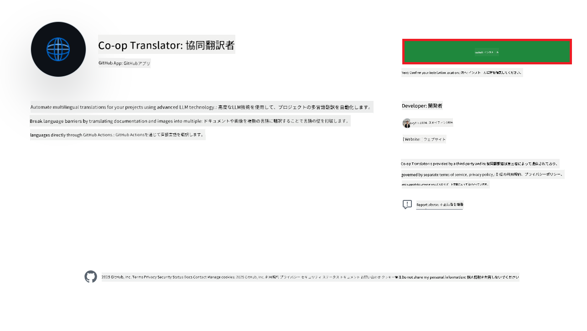
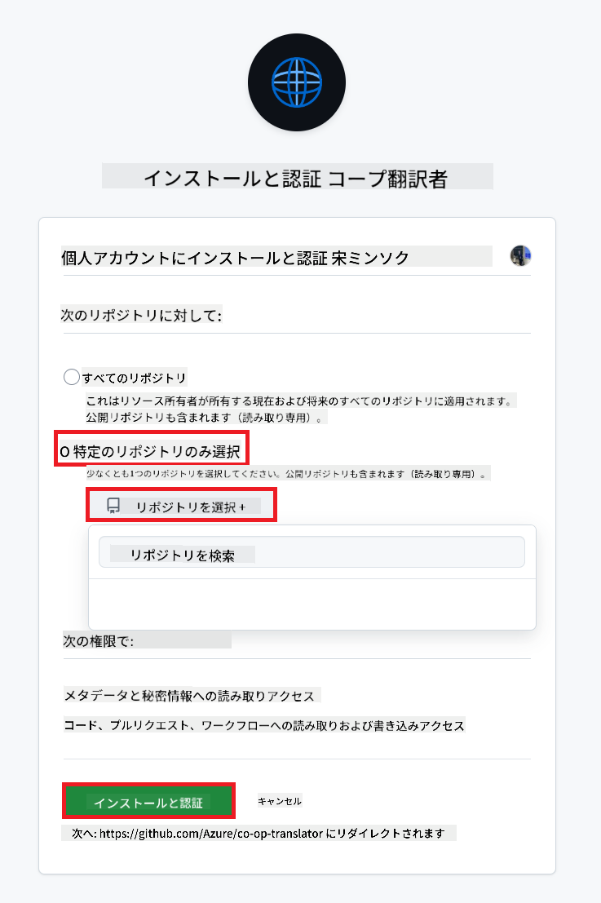
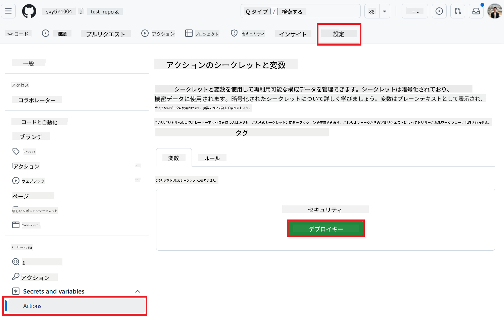
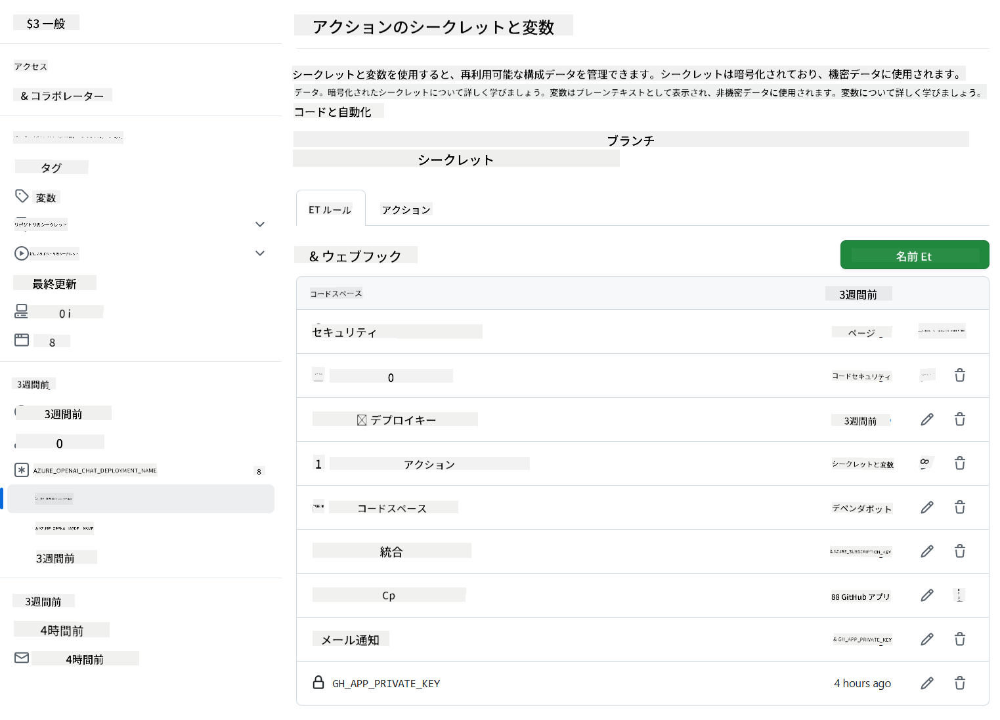

<!--
CO_OP_TRANSLATOR_METADATA:
{
  "original_hash": "c437820027c197f25fb2cbee95bae28c",
  "translation_date": "2025-07-04T08:13:49+00:00",
  "source_file": "getting_started/github-actions-guide/github-actions-guide-org.md",
  "language_code": "ja"
}
-->
# Co-op Translator GitHub Actionの使用方法（組織向けガイド）

**対象読者:** このガイドは、**Microsoft内部ユーザー**または**事前に構築されたCo-op Translator GitHub Appの必要な資格情報にアクセスできるチーム**、もしくは独自のカスタムGitHub Appを作成できるチームを対象としています。

Co-op Translator GitHub Actionを使用して、リポジトリのドキュメントの翻訳を自動化します。このガイドでは、ソースのMarkdownファイルや画像が変更されたときに、更新された翻訳を含むプルリクエストを自動的に作成するようにアクションを設定する手順を説明します。

> [!IMPORTANT]
> 
> **適切なガイドの選択:**
>
> このガイドは、**GitHub App IDとプライベートキー**を使用したセットアップを詳述しています。通常、次のような場合にこの「組織向けガイド」メソッドが必要です: **`GITHUB_TOKEN`の権限が制限されている場合:** 組織またはリポジトリの設定で、標準の`GITHUB_TOKEN`に付与されるデフォルトの権限が制限されている場合。特に、`GITHUB_TOKEN`が必要な`write`権限（例: `contents: write`や`pull-requests: write`）を許可されていない場合、[Public Setup Guide](./github-actions-guide-public.md)のワークフローは権限不足のため失敗します。明示的に付与された権限を持つ専用のGitHub Appを使用することで、この制限を回避できます。
>
> **上記が該当しない場合:**
>
> 標準の`GITHUB_TOKEN`がリポジトリで十分な権限を持っている場合（つまり、組織の制限によってブロックされていない場合）、**[GITHUB_TOKENを使用したPublic Setup Guide](./github-actions-guide-public.md)**を使用してください。公開ガイドでは、App IDやプライベートキーの取得や管理を必要とせず、標準の`GITHUB_TOKEN`とリポジトリの権限にのみ依存します。

## 前提条件

GitHub Actionを設定する前に、必要なAIサービスの資格情報を準備してください。

**1. 必須: AI言語モデルの資格情報**
少なくとも1つのサポートされている言語モデルの資格情報が必要です:

- **Azure OpenAI**: エンドポイント、APIキー、モデル/デプロイメント名、APIバージョンが必要です。
- **OpenAI**: APIキーが必要です。（オプション: 組織ID、ベースURL、モデルID）
- 詳細は[サポートされているモデルとサービス](../../../../README.md)を参照してください。
- セットアップガイド: [Azure OpenAIのセットアップ](../set-up-resources/set-up-azure-openai.md)。

**2. オプション: コンピュータビジョンの資格情報（画像翻訳用）**

- 画像内のテキストを翻訳する必要がある場合にのみ必要です。
- **Azure Computer Vision**: エンドポイントとサブスクリプションキーが必要です。
- 提供されない場合、アクションは[Markdown-onlyモード](../markdown-only-mode.md)にデフォルト設定されます。
- セットアップガイド: [Azure Computer Visionのセットアップ](../set-up-resources/set-up-azure-computer-vision.md)。

## セットアップと構成

リポジトリでCo-op Translator GitHub Actionを設定する手順に従ってください。

### ステップ1: GitHub App認証のインストールと構成

ワークフローは、GitHub App認証を使用して、リポジトリと安全にやり取りします（例: プルリクエストの作成）。次のオプションから選択してください:

#### **オプションA: 事前構築されたCo-op Translator GitHub Appのインストール（Microsoft内部使用向け）**

1. [Co-op Translator GitHub App](https://github.com/apps/co-op-translator)ページに移動します。

1. **インストール**を選択し、ターゲットリポジトリが存在するアカウントまたは組織を選択します。

    

1. **特定のリポジトリのみを選択**し、ターゲットリポジトリ（例: `PhiCookBook`）を選択します。**インストール**をクリックします。認証を求められる場合があります。

    

1. **アプリの資格情報を取得（内部プロセスが必要）:** ワークフローがアプリとして認証できるようにするために、Co-op Translatorチームから提供される2つの情報が必要です:
  - **App ID:** Co-op Translatorアプリの一意の識別子。App IDは: `1164076`です。
  - **プライベートキー:** メンテナ連絡先から`.pem`プライベートキーファイルの**全内容**を取得する必要があります。このキーはパスワードのように扱い、安全に保管してください。

1. ステップ2に進みます。

#### **オプションB: 独自のカスタムGitHub Appを使用**

- 希望する場合は、独自のGitHub Appを作成して構成できます。ContentsとPull requestsへの読み取りと書き込みアクセスがあることを確認してください。App IDと生成されたプライベートキーが必要です。

### ステップ2: リポジトリシークレットの構成

GitHub Appの資格情報とAIサービスの資格情報を、リポジトリ設定の暗号化されたシークレットとして追加する必要があります。

1. ターゲットGitHubリポジトリ（例: `PhiCookBook`）に移動します。

1. **設定** > **シークレットと変数** > **アクション**に移動します。

1. **リポジトリシークレット**の下で、以下の各シークレットに対して**新しいリポジトリシークレット**をクリックします。

   

**必須シークレット（GitHub App認証用）:**

| シークレット名          | 説明                                      | 値のソース                                     |
| :------------------- | :----------------------------------------------- | :----------------------------------------------- |
| `GH_APP_ID`          | GitHub AppのApp ID（ステップ1から）。      | GitHub App設定                              |
| `GH_APP_PRIVATE_KEY` | ダウンロードした`.pem`ファイルの**全内容**。 | `.pem`ファイル（ステップ1から）                      |

**AIサービスシークレット（前提条件に基づいて該当するすべてを追加）:**

| シークレット名                         | 説明                               | 値のソース                     |
| :---------------------------------- | :---------------------------------------- | :------------------------------- |
| `AZURE_SUBSCRIPTION_KEY`            | Azure AIサービス（コンピュータビジョン）のキー  | Azure AI Foundry                    |
| `AZURE_AI_SERVICE_ENDPOINT`         | Azure AIサービス（コンピュータビジョン）のエンドポイント | Azure AI Foundry                     |
| `AZURE_OPENAI_API_KEY`              | Azure OpenAIサービスのキー              | Azure AI Foundry                     |
| `AZURE_OPENAI_ENDPOINT`             | Azure OpenAIサービスのエンドポイント         | Azure AI Foundry                     |
| `AZURE_OPENAI_MODEL_NAME`           | Azure OpenAIモデル名              | Azure AI Foundry                     |
| `AZURE_OPENAI_CHAT_DEPLOYMENT_NAME` | Azure OpenAIデプロイメント名         | Azure AI Foundry                     |
| `AZURE_OPENAI_API_VERSION`          | Azure OpenAIのAPIバージョン              | Azure AI Foundry                     |
| `OPENAI_API_KEY`                    | OpenAIのAPIキー                        | OpenAI Platform                  |
| `OPENAI_ORG_ID`                     | OpenAIの組織ID                    | OpenAI Platform                  |
| `OPENAI_CHAT_MODEL_ID`              | 特定のOpenAIモデルID                  | OpenAI Platform                    |
| `OPENAI_BASE_URL`                   | カスタムOpenAI APIベースURL                | OpenAI Platform                    |



### ステップ3: ワークフローファイルの作成

最後に、自動化されたワークフローを定義するYAMLファイルを作成します。

1. リポジトリのルートディレクトリに、`.github/workflows/`ディレクトリが存在しない場合は作成します。

1. `.github/workflows/`内に、`co-op-translator.yml`という名前のファイルを作成します。

1. 以下の内容をco-op-translator.ymlに貼り付けます。

```
name: Co-op Translator

on:
  push:
    branches:
      - main

jobs:
  co-op-translator:
    runs-on: ubuntu-latest

    permissions:
      contents: write
      pull-requests: write

    steps:
      - name: Checkout repository
        uses: actions/checkout@v4
        with:
          fetch-depth: 0

      - name: Set up Python
        uses: actions/setup-python@v4
        with:
          python-version: '3.10'

      - name: Install Co-op Translator
        run: |
          python -m pip install --upgrade pip
          pip install co-op-translator

      - name: Run Co-op Translator
        env:
          PYTHONIOENCODING: utf-8
          # Azure AI Service Credentials
          AZURE_SUBSCRIPTION_KEY: ${{ secrets.AZURE_SUBSCRIPTION_KEY }}
          AZURE_AI_SERVICE_ENDPOINT: ${{ secrets.AZURE_AI_SERVICE_ENDPOINT }}

          # Azure OpenAI Credentials
          AZURE_OPENAI_API_KEY: ${{ secrets.AZURE_OPENAI_API_KEY }}
          AZURE_OPENAI_ENDPOINT: ${{ secrets.AZURE_OPENAI_ENDPOINT }}
          AZURE_OPENAI_MODEL_NAME: ${{ secrets.AZURE_OPENAI_MODEL_NAME }}
          AZURE_OPENAI_CHAT_DEPLOYMENT_NAME: ${{ secrets.AZURE_OPENAI_CHAT_DEPLOYMENT_NAME }}
          AZURE_OPENAI_API_VERSION: ${{ secrets.AZURE_OPENAI_API_VERSION }}

          # OpenAI Credentials
          OPENAI_API_KEY: ${{ secrets.OPENAI_API_KEY }}
          OPENAI_ORG_ID: ${{ secrets.OPENAI_ORG_ID }}
          OPENAI_CHAT_MODEL_ID: ${{ secrets.OPENAI_CHAT_MODEL_ID }}
          OPENAI_BASE_URL: ${{ secrets.OPENAI_BASE_URL }}
        run: |
          # =====================================================================
          # IMPORTANT: Set your target languages here (REQUIRED CONFIGURATION)
          # =====================================================================
          # Example: Translate to Spanish, French, German. Add -y to auto-confirm.
          translate -l "es fr de" -y  # <--- MODIFY THIS LINE with your desired languages

      - name: Authenticate GitHub App
        id: generate_token
        uses: tibdex/github-app-token@v1
        with:
          app_id: ${{ secrets.GH_APP_ID }}
          private_key: ${{ secrets.GH_APP_PRIVATE_KEY }}

      - name: Create Pull Request with translations
        uses: peter-evans/create-pull-request@v5
        with:
          token: ${{ steps.generate_token.outputs.token }}
          commit-message: "🌐 Update translations via Co-op Translator"
          title: "🌐 Update translations via Co-op Translator"
          body: |
            This PR updates translations for recent changes to the main branch.

            ### 📋 Changes included
            - Translated contents are available in the `translations/` directory
            - Translated images are available in the `translated_images/` directory

            ---
            🌐 Automatically generated by the [Co-op Translator](https://github.com/Azure/co-op-translator) GitHub Action.
          branch: update-translations
          base: main
          labels: translation, automated-pr
          delete-branch: true
          add-paths: |
            translations/
            translated_images/

```

4.  **ワークフローのカスタマイズ:**
  - **[!IMPORTANT] 対象言語:** `Run Co-op Translator`ステップで、`translate -l "..." -y`コマンド内の言語コードのリストを**必ず確認し、プロジェクトの要件に合わせて修正してください**。例として示されているリスト（`ar de es...`）は、置き換えるか調整する必要があります。
  - **トリガー（`on:`）:** 現在のトリガーは`main`へのプッシュごとに実行されます。大規模なリポジトリの場合、`paths:`フィルターを追加して（YAML内のコメント例を参照）、関連するファイル（例: ソースドキュメント）が変更されたときにのみワークフローを実行し、ランナーミニッツを節約することを検討してください。
  - **PRの詳細:** 必要に応じて、`Create Pull Request`ステップで`commit-message`、`title`、`body`、`branch`名、`labels`をカスタマイズしてください。

## 資格情報の管理と更新

- **セキュリティ:** 機密性の高い資格情報（APIキー、プライベートキー）は常にGitHub Actionsのシークレットとして保存してください。ワークフローファイルやリポジトリコードに公開しないでください。
- **[!IMPORTANT] キーの更新（Microsoft内部ユーザー向け）:** Microsoft内で使用されるAzure OpenAIキーには、必須の更新ポリシー（例: 5か月ごと）がある場合があります。ワークフローの失敗を防ぐために、対応するGitHubシークレット（`AZURE_OPENAI_...`キー）を**期限切れ前に**更新してください。

## ワークフローの実行

`co-op-translator.yml`ファイルがメインブランチ（または`on:`トリガーで指定されたブランチ）にマージされると、そのブランチに変更がプッシュされるたびに（`paths`フィルターが設定されている場合はそれに一致する場合）、ワークフローが自動的に実行されます。

翻訳が生成または更新されると、アクションは変更を含むプルリクエストを自動的に作成し、レビューとマージの準備が整います。

**免責事項**:
この文書はAI翻訳サービス[Co-op Translator](https://github.com/Azure/co-op-translator)を使用して翻訳されています。正確性を追求していますが、自動翻訳には誤りや不正確さが含まれる可能性があることをご了承ください。元の言語での文書が権威ある情報源と見なされるべきです。重要な情報については、専門の人間による翻訳をお勧めします。この翻訳の使用に起因する誤解や誤解について、当社は責任を負いません。