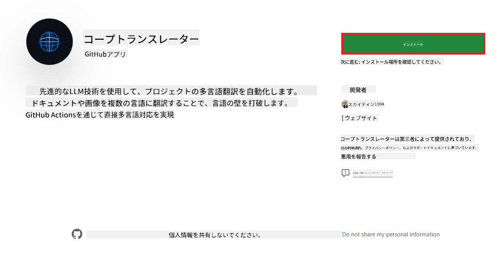
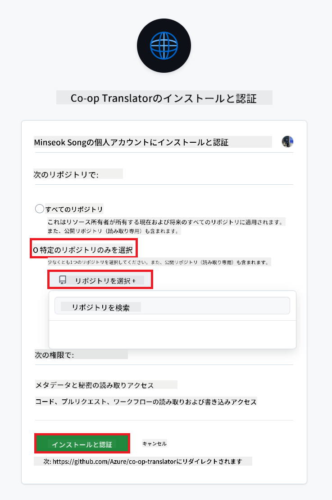
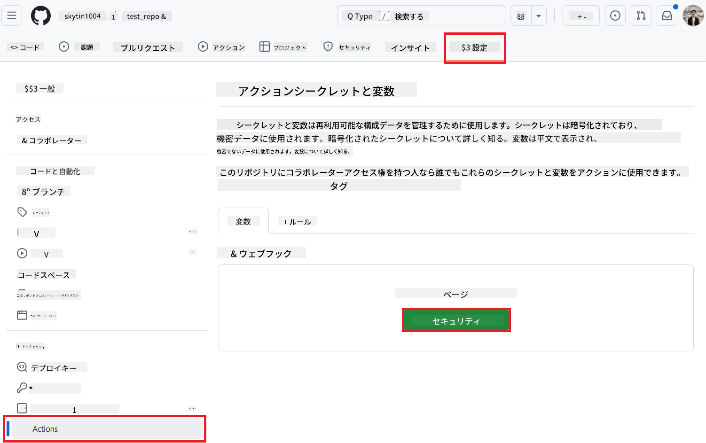
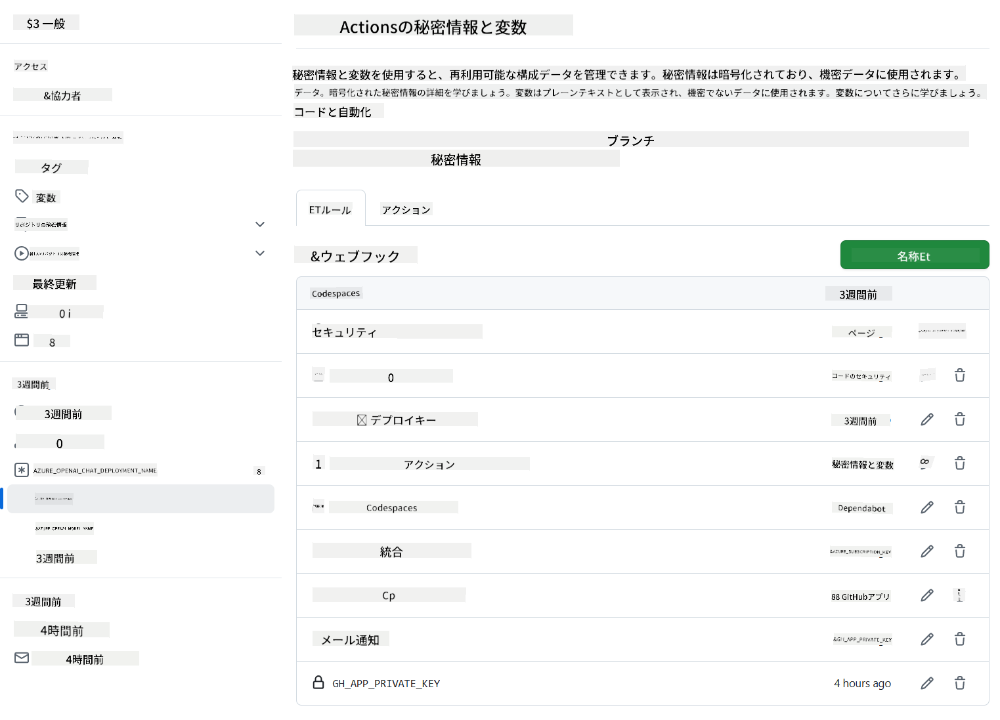

<!--
CO_OP_TRANSLATOR_METADATA:
{
  "original_hash": "c437820027c197f25fb2cbee95bae28c",
  "translation_date": "2025-06-12T19:04:30+00:00",
  "source_file": "getting_started/github-actions-guide/github-actions-guide-org.md",
  "language_code": "ja"
}
-->
# Co-op Translator GitHub Actionの使用方法（組織向けガイド）

**対象読者:** 本ガイドは、**Microsoft社内ユーザー**または**事前構築済みのCo-op Translator GitHub Appの必要な認証情報にアクセスできるチーム**、あるいは独自のカスタムGitHub Appを作成可能なチームを対象としています。

Co-op Translator GitHub Actionを使って、リポジトリのドキュメント翻訳を自動化しましょう。このガイドでは、ソースのMarkdownファイルや画像が変更されるたびに、更新された翻訳を含むプルリクエストを自動作成するための設定方法を説明します。

> [!IMPORTANT]
>
> **適切なガイドの選択について:**
>
> 本ガイドは、**GitHub App IDとプライベートキーを使った設定方法**を詳述しています。以下のような場合は、この「組織向けガイド」の手順が必要です。  
> **`GITHUB_TOKEN`の権限が制限されている場合:** 組織やリポジトリの設定で、標準の`GITHUB_TOKEN`に付与されるデフォルトの権限が制限されている場合、特に`GITHUB_TOKEN`に必要な`write`権限（`contents: write`や`pull-requests: write`など）が付与されていないと、[Public Setup Guide](./github-actions-guide-public.md)のワークフローは権限不足で失敗します。専用のGitHub Appを明示的に権限付与して使うことで、この制限を回避できます。
>
> **上記に該当しない場合:**
>
> 標準の`GITHUB_TOKEN`がリポジトリで十分な権限を持っている（組織の制限でブロックされていない）場合は、**[GITHUB_TOKENを使った公開セットアップガイド](./github-actions-guide-public.md)** をご利用ください。公開ガイドはApp IDやプライベートキーの取得・管理を必要とせず、標準の`GITHUB_TOKEN`とリポジトリ権限のみで動作します。

## 前提条件

GitHub Actionを設定する前に、必要なAIサービスの認証情報を準備してください。

**1. 必須: AI言語モデルの認証情報**  
少なくとも1つの対応言語モデルの認証情報が必要です。

- **Azure OpenAI**: エンドポイント、APIキー、モデル/デプロイ名、APIバージョンが必要です。  
- **OpenAI**: APIキー、（任意で組織ID、ベースURL、モデルID）  
- 詳細は[対応モデルとサービス](../../../../README.md)を参照してください。  
- 設定手順: [Azure OpenAIのセットアップ](../set-up-resources/set-up-azure-openai.md)。

**2. 任意: コンピュータビジョン認証情報（画像翻訳用）**  

- 画像内テキストの翻訳が必要な場合のみ。  
- **Azure Computer Vision**: エンドポイントとサブスクリプションキーが必要です。  
- 未提供の場合は、アクションは[Markdownのみモード](../markdown-only-mode.md)で動作します。  
- 設定手順: [Azure Computer Visionのセットアップ](../set-up-resources/set-up-azure-computer-vision.md)。

## セットアップと設定

リポジトリでCo-op Translator GitHub Actionを設定するには、以下の手順に従ってください。

### ステップ1: GitHub App認証のインストールと設定

ワークフローはGitHub App認証を利用して、リポジトリへの安全な操作（例: プルリクエストの作成）を行います。以下のいずれかを選択してください。

#### **オプションA: 事前構築済みCo-op Translator GitHub Appのインストール（Microsoft社内利用向け）**

1. [Co-op Translator GitHub App](https://github.com/apps/co-op-translator)のページにアクセスします。

1. **Install**を選択し、対象リポジトリが所属するアカウントまたは組織を選びます。

    

1. **Only select repositories**を選択し、対象リポジトリ（例: `PhiCookBook`）を指定して**Install**をクリック。認証を求められる場合があります。

    

1. **アプリ認証情報の取得（社内プロセスが必要）:** ワークフローがアプリとして認証できるように、Co-op Translatorチームから以下の2つの情報を取得してください。  
  - **App ID:** Co-op Translatorアプリの一意の識別子。App IDは`1164076`です。  
  - **Private Key:** `.pem`のプライベートキーファイルの**全内容**をメンテナ担当者から入手してください。**このキーはパスワード同様に厳重に管理してください。**

1. ステップ2へ進みます。

#### **オプションB: 独自のカスタムGitHub Appを使用する**

- 必要に応じて、自分でGitHub Appを作成し設定できます。ContentsおよびPull requestsに対する読み書き権限が必要です。App IDと生成したプライベートキーが必要になります。

### ステップ2: リポジトリのシークレット設定

GitHub App認証情報とAIサービスの認証情報を、リポジトリの暗号化されたシークレットとして登録します。

1. 対象のGitHubリポジトリ（例: `PhiCookBook`）にアクセスします。

1. **Settings** > **Secrets and variables** > **Actions** に移動します。

1. **Repository secrets**の下で、以下のシークレットをそれぞれ**New repository secret**で追加します。

   

**必須シークレット（GitHub App認証用）:**

| シークレット名          | 説明                                      | 値の出所                                     |
| :------------------- | :--------------------------------------- | :------------------------------------------- |
| `GH_APP_ID`          | GitHub AppのApp ID（ステップ1で取得）      | GitHub App設定画面                           |
| `GH_APP_PRIVATE_KEY` | ダウンロードした`.pem`ファイルの**全内容** | `.pem`ファイル（ステップ1で入手） |

**AIサービス用シークレット（前提条件に応じてすべて追加）:**

| シークレット名                         | 説明                               | 値の出所                     |
| :---------------------------------- | :-------------------------------- | :--------------------------- |
| `AZURE_SUBSCRIPTION_KEY`            | Azure AIサービス（Computer Vision）のキー  | Azure AI Foundry              |
| `AZURE_AI_SERVICE_ENDPOINT`         | Azure AIサービス（Computer Vision）のエンドポイント | Azure AI Foundry              |
| `AZURE_OPENAI_API_KEY`              | Azure OpenAIサービスのキー              | Azure AI Foundry              |
| `AZURE_OPENAI_ENDPOINT`             | Azure OpenAIサービスのエンドポイント     | Azure AI Foundry              |
| `AZURE_OPENAI_MODEL_NAME`           | Azure OpenAIのモデル名                  | Azure AI Foundry              |
| `AZURE_OPENAI_CHAT_DEPLOYMENT_NAME` | Azure OpenAIのデプロイ名                 | Azure AI Foundry              |
| `AZURE_OPENAI_API_VERSION`          | Azure OpenAIのAPIバージョン              | Azure AI Foundry              |
| `OPENAI_API_KEY`                    | OpenAIのAPIキー                        | OpenAI Platform              |
| `OPENAI_ORG_ID`                     | OpenAIの組織ID                        | OpenAI Platform              |
| `OPENAI_CHAT_MODEL_ID`              | OpenAIの特定モデルID                    | OpenAI Platform              |
| `OPENAI_BASE_URL`                   | OpenAIのカスタムAPIベースURL            | OpenAI Platform              |



### ステップ3: ワークフローファイルの作成

最後に、自動化ワークフローを定義するYAMLファイルを作成します。

1. リポジトリのルートディレクトリに`.github/workflows/`フォルダーがなければ作成します。

1. `.github/workflows/`内に`co-op-translator.yml`という名前のファイルを作成します。

1. 以下の内容をco-op-translator.ymlに貼り付けます。

```
name: Co-op Translator

on:
  push:
    branches:
      - main

jobs:
  co-op-translator:
    runs-on: ubuntu-latest

    permissions:
      contents: write
      pull-requests: write

    steps:
      - name: Checkout repository
        uses: actions/checkout@v4
        with:
          fetch-depth: 0

      - name: Set up Python
        uses: actions/setup-python@v4
        with:
          python-version: '3.10'

      - name: Install Co-op Translator
        run: |
          python -m pip install --upgrade pip
          pip install co-op-translator

      - name: Run Co-op Translator
        env:
          PYTHONIOENCODING: utf-8
          # Azure AI Service Credentials
          AZURE_SUBSCRIPTION_KEY: ${{ secrets.AZURE_SUBSCRIPTION_KEY }}
          AZURE_AI_SERVICE_ENDPOINT: ${{ secrets.AZURE_AI_SERVICE_ENDPOINT }}

          # Azure OpenAI Credentials
          AZURE_OPENAI_API_KEY: ${{ secrets.AZURE_OPENAI_API_KEY }}
          AZURE_OPENAI_ENDPOINT: ${{ secrets.AZURE_OPENAI_ENDPOINT }}
          AZURE_OPENAI_MODEL_NAME: ${{ secrets.AZURE_OPENAI_MODEL_NAME }}
          AZURE_OPENAI_CHAT_DEPLOYMENT_NAME: ${{ secrets.AZURE_OPENAI_CHAT_DEPLOYMENT_NAME }}
          AZURE_OPENAI_API_VERSION: ${{ secrets.AZURE_OPENAI_API_VERSION }}

          # OpenAI Credentials
          OPENAI_API_KEY: ${{ secrets.OPENAI_API_KEY }}
          OPENAI_ORG_ID: ${{ secrets.OPENAI_ORG_ID }}
          OPENAI_CHAT_MODEL_ID: ${{ secrets.OPENAI_CHAT_MODEL_ID }}
          OPENAI_BASE_URL: ${{ secrets.OPENAI_BASE_URL }}
        run: |
          # =====================================================================
          # IMPORTANT: Set your target languages here (REQUIRED CONFIGURATION)
          # =====================================================================
          # Example: Translate to Spanish, French, German. Add -y to auto-confirm.
          translate -l "es fr de" -y  # <--- MODIFY THIS LINE with your desired languages

      - name: Authenticate GitHub App
        id: generate_token
        uses: tibdex/github-app-token@v1
        with:
          app_id: ${{ secrets.GH_APP_ID }}
          private_key: ${{ secrets.GH_APP_PRIVATE_KEY }}

      - name: Create Pull Request with translations
        uses: peter-evans/create-pull-request@v5
        with:
          token: ${{ steps.generate_token.outputs.token }}
          commit-message: "🌐 Update translations via Co-op Translator"
          title: "🌐 Update translations via Co-op Translator"
          body: |
            This PR updates translations for recent changes to the main branch.

            ### 📋 Changes included
            - Translated contents are available in the `translations/` directory
            - Translated images are available in the `translated_images/` directory

            ---
            🌐 Automatically generated by the [Co-op Translator](https://github.com/Azure/co-op-translator) GitHub Action.
          branch: update-translations
          base: main
          labels: translation, automated-pr
          delete-branch: true
          add-paths: |
            translations/
            translated_images/

```

4.  **ワークフローのカスタマイズ:**  
  - **[!IMPORTANT] 対象言語:** `Run Co-op Translator` step, you **MUST review and modify the list of language codes** within the `translate -l "..." -y` command to match your project's requirements. The example list (`ar de es...`) needs to be replaced or adjusted.
  - **Trigger (`on:`):** The current trigger runs on every push to `main`. For large repositories, consider adding a `paths:` filter (see commented example in the YAML) to run the workflow only when relevant files (e.g., source documentation) change, saving runner minutes.
  - **PR Details:** Customize the `commit-message`, `title`, `body`, `branch` name, and `labels` in the `Create Pull Request` step if needed.

## Credential Management and Renewal

- **Security:** Always store sensitive credentials (API keys, private keys) as GitHub Actions secrets. Never expose them in your workflow file or repository code.
- **[!IMPORTANT] Key Renewal (Internal Microsoft Users):** Be aware that Azure OpenAI key used within Microsoft might have a mandatory renewal policy (e.g., every 5 months). Ensure you update the corresponding GitHub secrets (`AZURE_OPENAI_...` のキーで指定します。  
  - **期限切れ前に更新してください**。期限切れになるとワークフローが失敗します。

## ワークフローの実行

`co-op-translator.yml`ファイルがmainブランチ（または`on:` trigger), the workflow will automatically run whenever changes are pushed to that branch (and match the `paths`フィルターで指定したブランチ）にマージされると、

翻訳が生成または更新された場合、アクションは変更内容を含むプルリクエストを自動作成します。レビューとマージの準備が整います。

**免責事項**：  
本書類はAI翻訳サービス「[Co-op Translator](https://github.com/Azure/co-op-translator)」を使用して翻訳されました。正確性には努めておりますが、自動翻訳には誤りや不正確な箇所が含まれる可能性があることをご了承ください。原文の言語による文書が正式な情報源とみなされます。重要な情報については、専門の人間による翻訳を推奨します。本翻訳の使用により生じたいかなる誤解や誤訳についても、当方は責任を負いかねます。