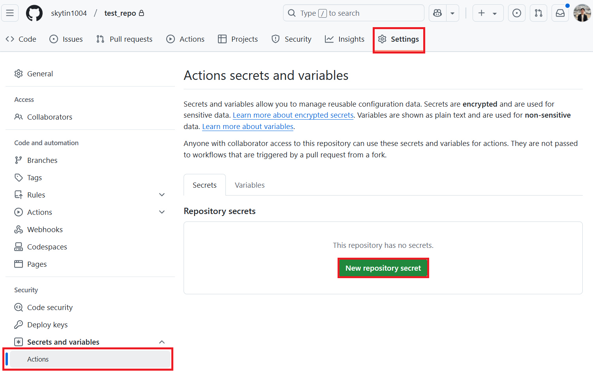

<!--
CO_OP_TRANSLATOR_METADATA:
{
  "original_hash": "c437820027c197f25fb2cbee95bae28c",
  "translation_date": "2025-05-06T18:02:27+00:00",
  "source_file": "getting_started/github-actions-guide/github-actions-guide-org.md",
  "language_code": "ja"
}
-->
# Co-op Translator GitHub Action の使い方（組織向けガイド）

**対象読者:** 本ガイドは、**Microsoft 内部ユーザー**または**事前構築された Co-op Translator GitHub App の必要な認証情報にアクセスできるチーム**、もしくは独自のカスタム GitHub App を作成できるチーム向けです。

Co-op Translator GitHub Action を使って、リポジトリのドキュメント翻訳を自動化しましょう。このガイドでは、ソースの Markdown ファイルや画像が変更されるたびに翻訳を更新したプルリクエストを自動作成する設定手順を説明します。

> [!IMPORTANT]
> 
> **適切なガイドの選択について：**
>
> 本ガイドは **GitHub App ID とプライベートキーを使ったセットアップ**の方法を説明しています。通常、以下のような場合に「組織向けガイド」の方法が必要です。  
> **`GITHUB_TOKEN` の権限が制限されている場合:** 組織やリポジトリの設定で標準の `GITHUB_TOKEN` に付与される権限が制限されている場合です。特に、`GITHUB_TOKEN` に必要な `write` 権限（例：`contents: write` や `pull-requests: write`）が許可されていない場合は、[Public Setup Guide](./github-actions-guide-public.md) のワークフローは権限不足で失敗します。専用の GitHub App を使い明示的に権限を付与することで、この制限を回避できます。
>
> **上記に該当しない場合：**
>
> 標準の `GITHUB_TOKEN` がリポジトリで十分な権限を持っている場合（組織の制限に阻まれていない場合）は、**[GITHUB_TOKEN を使った公開セットアップガイド](./github-actions-guide-public.md)** をご利用ください。公開ガイドは App ID やプライベートキーの取得・管理を必要とせず、標準の `GITHUB_TOKEN` とリポジトリ権限だけで動作します。

## 前提条件

GitHub Action の設定を始める前に、必要な AI サービスの認証情報を用意してください。

**1. 必須：AI 言語モデルの認証情報**  
サポートされている言語モデルのうち少なくとも1つの認証情報が必要です。

- **Azure OpenAI**：エンドポイント、API キー、モデル／デプロイメント名、API バージョンが必要。
- **OpenAI**：API キー、（任意で組織ID、ベースURL、モデルID）。
- 詳細は [Supported Models and Services](../../../../README.md) を参照。
- セットアップ手順：[Azure OpenAI のセットアップ](../set-up-resources/set-up-azure-openai.md)。

**2. 任意：コンピュータービジョン認証情報（画像翻訳用）**

- 画像内テキストの翻訳が必要な場合のみ。
- **Azure Computer Vision**：エンドポイントとサブスクリプションキーが必要。
- 提供しない場合は [Markdown のみモード](../markdown-only-mode.md) が使われます。
- セットアップ手順：[Azure Computer Vision のセットアップ](../set-up-resources/set-up-azure-computer-vision.md)。

## セットアップと設定

リポジトリで Co-op Translator GitHub Action を設定する手順は以下の通りです。

### ステップ 1: GitHub App 認証のインストールと設定

ワークフローは GitHub App 認証を使い、安全にリポジトリ操作（例：プルリクエスト作成）を行います。以下のいずれかの方法を選択してください。

#### **オプション A: 事前構築済み Co-op Translator GitHub App をインストール（Microsoft 内部向け）**

1. [Co-op Translator GitHub App](https://github.com/apps/co-op-translator) のページへ移動。

1. **Install** を選び、対象のアカウントまたは組織を選択。

    

1. **Only select repositories** を選択し、対象リポジトリ（例：`PhiCookBook`）を選択して **Install**。認証を求められる場合があります。

    

1. **アプリ認証情報の取得（内部プロセスが必要）:**  
   ワークフローがアプリとして認証するために、Co-op Translator チームから以下2点を入手してください。  
   - **App ID:** Co-op Translator アプリの一意の識別子。App ID は `1164076` です。  
   - **Private Key:** `.pem` のプライベートキーファイルの**全内容**をメンテナ連絡先から入手してください。**パスワード同様に厳重に管理してください。**

1. ステップ 2 に進みます。

#### **オプション B: 独自のカスタム GitHub App を使用**

- ご自身で GitHub App を作成し、Contents と Pull requests の読み書き権限を付与してください。App ID と生成したプライベートキーが必要です。

### ステップ 2: リポジトリシークレットの設定

GitHub App 認証情報と AI サービス認証情報をリポジトリの暗号化シークレットとして登録します。

1. 対象の GitHub リポジトリ（例：`PhiCookBook`）へ移動。

1. **Settings** > **Secrets and variables** > **Actions** に進む。

1. **Repository secrets** で以下のシークレットをそれぞれ **New repository secret** から追加。

   

**必須シークレット（GitHub App 認証用）**

| シークレット名         | 説明                              | 値の出所                          |
| :--------------------- | :-------------------------------- | :-------------------------------- |
| `GH_APP_ID`             | GitHub App の App ID（ステップ1で取得） | GitHub App 設定画面               |
| `GH_APP_PRIVATE_KEY`        | ダウンロードした `.pem` ファイルの**全内容** | `.pem` ファイル（ステップ1で入手） |

**AI サービス用シークレット（前提条件に応じて全て追加）**

| シークレット名                   | 説明                               | 値の出所                         |
| :------------------------------ | :-------------------------------- | :------------------------------- |
| `AZURE_SUBSCRIPTION_KEY`          | Azure AI サービス（Computer Vision）用キー | Azure AI Foundry                  |
| `AZURE_AI_SERVICE_ENDPOINT`          | Azure AI サービス（Computer Vision）用エンドポイント | Azure AI Foundry                  |
| `AZURE_OPENAI_API_KEY`          | Azure OpenAI サービス用キー           | Azure AI Foundry                  |
| `AZURE_OPENAI_ENDPOINT`          | Azure OpenAI サービス用エンドポイント   | Azure AI Foundry                  |
| `AZURE_OPENAI_MODEL_NAME`          | Azure OpenAI モデル名                 | Azure AI Foundry                  |
| `AZURE_OPENAI_CHAT_DEPLOYMENT_NAME`          | Azure OpenAI デプロイメント名          | Azure AI Foundry                  |
| `AZURE_OPENAI_API_VERSION`          | Azure OpenAI API バージョン             | Azure AI Foundry                  |
| `OPENAI_API_KEY`          | OpenAI API キー                      | OpenAI Platform                  |
| `OPENAI_ORG_ID`          | OpenAI 組織 ID                      | OpenAI Platform                  |
| `OPENAI_CHAT_MODEL_ID`          | 特定の OpenAI モデル ID               | OpenAI Platform                  |
| `OPENAI_BASE_URL`          | カスタム OpenAI API ベース URL          | OpenAI Platform                  |


### ステップ 3: ワークフローファイルの作成

最後に、自動化ワークフローを定義する YAML ファイルを作成します。

1. リポジトリのルートディレクトリに `.github/workflows/` フォルダーがなければ作成。

1. `.github/workflows/` 内に `co-op-translator.yml` というファイルを作成。

1. 以下の内容を co-op-translator.yml に貼り付け。

```
name: Co-op Translator

on:
  push:
    branches:
      - main

jobs:
  co-op-translator:
    runs-on: ubuntu-latest

    permissions:
      contents: write
      pull-requests: write

    steps:
      - name: Checkout repository
        uses: actions/checkout@v4
        with:
          fetch-depth: 0

      - name: Set up Python
        uses: actions/setup-python@v4
        with:
          python-version: '3.10'

      - name: Install Co-op Translator
        run: |
          python -m pip install --upgrade pip
          pip install co-op-translator

      - name: Run Co-op Translator
        env:
          PYTHONIOENCODING: utf-8
          # Azure AI Service Credentials
          AZURE_SUBSCRIPTION_KEY: ${{ secrets.AZURE_SUBSCRIPTION_KEY }}
          AZURE_AI_SERVICE_ENDPOINT: ${{ secrets.AZURE_AI_SERVICE_ENDPOINT }}

          # Azure OpenAI Credentials
          AZURE_OPENAI_API_KEY: ${{ secrets.AZURE_OPENAI_API_KEY }}
          AZURE_OPENAI_ENDPOINT: ${{ secrets.AZURE_OPENAI_ENDPOINT }}
          AZURE_OPENAI_MODEL_NAME: ${{ secrets.AZURE_OPENAI_MODEL_NAME }}
          AZURE_OPENAI_CHAT_DEPLOYMENT_NAME: ${{ secrets.AZURE_OPENAI_CHAT_DEPLOYMENT_NAME }}
          AZURE_OPENAI_API_VERSION: ${{ secrets.AZURE_OPENAI_API_VERSION }}

          # OpenAI Credentials
          OPENAI_API_KEY: ${{ secrets.OPENAI_API_KEY }}
          OPENAI_ORG_ID: ${{ secrets.OPENAI_ORG_ID }}
          OPENAI_CHAT_MODEL_ID: ${{ secrets.OPENAI_CHAT_MODEL_ID }}
          OPENAI_BASE_URL: ${{ secrets.OPENAI_BASE_URL }}
        run: |
          # =====================================================================
          # IMPORTANT: Set your target languages here (REQUIRED CONFIGURATION)
          # =====================================================================
          # Example: Translate to Spanish, French, German. Add -y to auto-confirm.
          translate -l "es fr de" -y  # <--- MODIFY THIS LINE with your desired languages

      - name: Authenticate GitHub App
        id: generate_token
        uses: tibdex/github-app-token@v1
        with:
          app_id: ${{ secrets.GH_APP_ID }}
          private_key: ${{ secrets.GH_APP_PRIVATE_KEY }}

      - name: Create Pull Request with translations
        uses: peter-evans/create-pull-request@v5
        with:
          token: ${{ steps.generate_token.outputs.token }}
          commit-message: "🌐 Update translations via Co-op Translator"
          title: "🌐 Update translations via Co-op Translator"
          body: |
            This PR updates translations for recent changes to the main branch.

            ### 📋 Changes included
            - Translated contents are available in the `translations/` directory
            - Translated images are available in the `translated_images/` directory

            ---
            🌐 Automatically generated by the [Co-op Translator](https://github.com/Azure/co-op-translator) GitHub Action.
          branch: update-translations
          base: main
          labels: translation, automated-pr
          delete-branch: true
          add-paths: |
            translations/
            translated_images/

```

4. **ワークフローのカスタマイズ:**  
  - **[!IMPORTANT] 対象言語:** `Run Co-op Translator` step, you **MUST review and modify the list of language codes** within the `translate -l "..." -y` command to match your project's requirements. The example list (`ar de es...`) needs to be replaced or adjusted.
  - **Trigger (`on:`):** The current trigger runs on every push to `main`. For large repositories, consider adding a `paths:` filter (see commented example in the YAML) to run the workflow only when relevant files (e.g., source documentation) change, saving runner minutes.
  - **PR Details:** Customize the `commit-message`, `title`, `body`, `branch` name, and `labels` in the `Create Pull Request` step if needed.

## Credential Management and Renewal

- **Security:** Always store sensitive credentials (API keys, private keys) as GitHub Actions secrets. Never expose them in your workflow file or repository code.
- **[!IMPORTANT] Key Renewal (Internal Microsoft Users):** Be aware that Azure OpenAI key used within Microsoft might have a mandatory renewal policy (e.g., every 5 months). Ensure you update the corresponding GitHub secrets (`AZURE_OPENAI_...` などのキーで指定してください。  
  - これらは**期限切れになる前に**更新し、ワークフローの失敗を防いでください。

## ワークフローの実行

`co-op-translator.yml` ファイルが main ブランチ（または `on:` trigger), the workflow will automatically run whenever changes are pushed to that branch (and match the `paths` フィルターで指定したブランチ）にマージされると、

翻訳が生成または更新された場合、自動で変更内容を含むプルリクエストが作成されます。レビューとマージの準備が整います。

**免責事項**：  
本書類はAI翻訳サービス「Co-op Translator」（https://github.com/Azure/co-op-translator）を使用して翻訳されています。正確性には努めておりますが、自動翻訳には誤りや不正確な部分が含まれる可能性があることをご了承ください。原文はその言語における正式な資料としてご参照ください。重要な情報については、専門の人間翻訳をご利用いただくことを推奨します。本翻訳の利用により生じたいかなる誤解や解釈の相違についても、当方は責任を負いかねます。