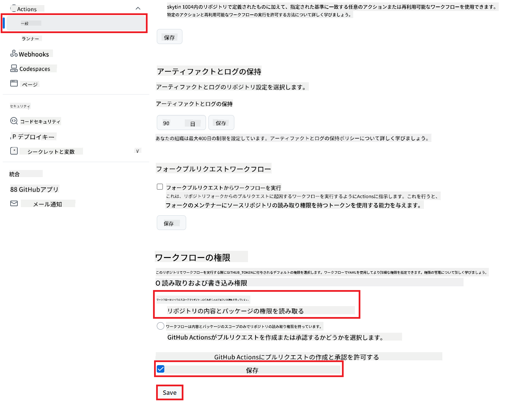

<!--
CO_OP_TRANSLATOR_METADATA:
{
  "original_hash": "a52587a512e667f70d92db853d3c61d5",
  "translation_date": "2025-07-04T08:14:27+00:00",
  "source_file": "getting_started/github-actions-guide/github-actions-guide-public.md",
  "language_code": "ja"
}
-->
# Co-op Translator GitHub Actionの使用 (パブリックセットアップ)

**対象読者:** このガイドは、標準のGitHub Actionsの権限が十分なほとんどのパブリックまたはプライベートリポジトリのユーザーを対象としています。組み込みの`GITHUB_TOKEN`を利用します。

Co-op Translator GitHub Actionを使用して、リポジトリのドキュメントの翻訳を自動化します。このガイドでは、ソースのMarkdownファイルや画像が変更されたときに、更新された翻訳を含むプルリクエストを自動的に作成するためのアクションの設定方法を説明します。

> [!IMPORTANT]
>
> **適切なガイドの選択:**
>
> このガイドは、**標準の`GITHUB_TOKEN`を使用した簡単なセットアップ**を詳述しています。これは、機密性の高いGitHub App Private Keysを管理する必要がないため、ほとんどのユーザーに推奨される方法です。
>

## 前提条件

GitHub Actionを設定する前に、必要なAIサービスの資格情報を用意してください。

**1. 必須: AI言語モデルの資格情報**
少なくとも1つのサポートされている言語モデルの資格情報が必要です:

- **Azure OpenAI**: エンドポイント、APIキー、モデル/デプロイメント名、APIバージョンが必要です。
- **OpenAI**: APIキーが必要です。（オプション: 組織ID、ベースURL、モデルID）
- 詳細は[サポートされているモデルとサービス](../../../../README.md)を参照してください。

**2. オプション: AIビジョンの資格情報（画像翻訳用）**

- 画像内のテキストを翻訳する必要がある場合のみ必要です。
- **Azure AI Vision**: エンドポイントとサブスクリプションキーが必要です。
- 提供されない場合、アクションは[Markdownのみモード](../markdown-only-mode.md)にデフォルトします。

## セットアップと設定

標準の`GITHUB_TOKEN`を使用して、リポジトリにCo-op Translator GitHub Actionを設定する手順に従ってください。

### ステップ1: 認証の理解 (`GITHUB_TOKEN`の使用)

このワークフローは、GitHub Actionsによって提供される組み込みの`GITHUB_TOKEN`を使用します。このトークンは、**ステップ3**で設定された設定に基づいて、リポジトリと対話するための権限をワークフローに自動的に付与します。

### ステップ2: リポジトリのシークレットを設定する

**AIサービスの資格情報**をリポジトリ設定の暗号化されたシークレットとして追加するだけです。

1.  対象のGitHubリポジトリに移動します。
2.  **Settings** > **Secrets and variables** > **Actions**に進みます。
3.  **Repository secrets**の下で、以下にリストされた各必要なAIサービスシークレットのために**New repository secret**をクリックします。

     *(画像参照: シークレットを追加する場所を示しています)*

**必要なAIサービスシークレット（前提条件に基づいて該当するすべてを追加）:**

| シークレット名                         | 説明                               | 値のソース                     |
| :---------------------------------- | :---------------------------------------- | :------------------------------- |
| `AZURE_SUBSCRIPTION_KEY`            | Azure AIサービス（コンピュータビジョン）のキー  | あなたのAzure AI Foundry               |
| `AZURE_AI_SERVICE_ENDPOINT`         | Azure AIサービス（コンピュータビジョン）のエンドポイント | あなたのAzure AI Foundry               |
| `AZURE_OPENAI_API_KEY`              | Azure OpenAIサービスのキー              | あなたのAzure AI Foundry               |
| `AZURE_OPENAI_ENDPOINT`             | Azure OpenAIサービスのエンドポイント         | あなたのAzure AI Foundry               |
| `AZURE_OPENAI_MODEL_NAME`           | あなたのAzure OpenAIモデル名              | あなたのAzure AI Foundry               |
| `AZURE_OPENAI_CHAT_DEPLOYMENT_NAME` | あなたのAzure OpenAIデプロイメント名         | あなたのAzure AI Foundry               |
| `AZURE_OPENAI_API_VERSION`          | Azure OpenAIのAPIバージョン              | あなたのAzure AI Foundry               |
| `OPENAI_API_KEY`                    | OpenAIのAPIキー                        | あなたのOpenAIプラットフォーム              |
| `OPENAI_ORG_ID`                     | OpenAI組織ID（オプション）         | あなたのOpenAIプラットフォーム              |
| `OPENAI_CHAT_MODEL_ID`              | 特定のOpenAIモデルID（オプション）       | あなたのOpenAIプラットフォーム              |
| `OPENAI_BASE_URL`                   | カスタムOpenAI APIベースURL（オプション）     | あなたのOpenAIプラットフォーム              |

### ステップ3: ワークフローの権限を設定する

GitHub Actionは、コードをチェックアウトし、プルリクエストを作成するために`GITHUB_TOKEN`を介して付与された権限を必要とします。

1.  リポジトリで、**Settings** > **Actions** > **General**に進みます。
2.  **Workflow permissions**セクションまでスクロールします。
3.  **Read and write permissions**を選択します。これにより、このワークフローに必要な`contents: write`と`pull-requests: write`の権限が`GITHUB_TOKEN`に付与されます。
4.  **Allow GitHub Actions to create and approve pull requests**のチェックボックスが**チェックされている**ことを確認します。
5.  **Save**を選択します。



### ステップ4: ワークフローファイルを作成する

最後に、`GITHUB_TOKEN`を使用して自動化されたワークフローを定義するYAMLファイルを作成します。

1.  リポジトリのルートディレクトリに、`.github/workflows/`ディレクトリが存在しない場合は作成します。
2.  `.github/workflows/`内に`co-op-translator.yml`という名前のファイルを作成します。
3.  以下の内容を`co-op-translator.yml`に貼り付けます。

```yaml
name: Co-op Translator

on:
  push:
    branches:
      - main

jobs:
  co-op-translator:
    runs-on: ubuntu-latest

    permissions:
      contents: write
      pull-requests: write

    steps:
      - name: Checkout repository
        uses: actions/checkout@v4
        with:
          fetch-depth: 0

      - name: Set up Python
        uses: actions/setup-python@v4
        with:
          python-version: '3.10'

      - name: Install Co-op Translator
        run: |
          python -m pip install --upgrade pip
          pip install co-op-translator

      - name: Run Co-op Translator
        env:
          PYTHONIOENCODING: utf-8
          # === AI Service Credentials ===
          AZURE_SUBSCRIPTION_KEY: ${{ secrets.AZURE_SUBSCRIPTION_KEY }}
          AZURE_AI_SERVICE_ENDPOINT: ${{ secrets.AZURE_AI_SERVICE_ENDPOINT }}
          AZURE_OPENAI_API_KEY: ${{ secrets.AZURE_OPENAI_API_KEY }}
          AZURE_OPENAI_ENDPOINT: ${{ secrets.AZURE_OPENAI_ENDPOINT }}
          AZURE_OPENAI_MODEL_NAME: ${{ secrets.AZURE_OPENAI_MODEL_NAME }}
          AZURE_OPENAI_CHAT_DEPLOYMENT_NAME: ${{ secrets.AZURE_OPENAI_CHAT_DEPLOYMENT_NAME }}
          AZURE_OPENAI_API_VERSION: ${{ secrets.AZURE_OPENAI_API_VERSION }}
          OPENAI_API_KEY: ${{ secrets.OPENAI_API_KEY }}
          OPENAI_ORG_ID: ${{ secrets.OPENAI_ORG_ID }}
          OPENAI_CHAT_MODEL_ID: ${{ secrets.OPENAI_CHAT_MODEL_ID }}
          OPENAI_BASE_URL: ${{ secrets.OPENAI_BASE_URL }}
        run: |
          # =====================================================================
          # IMPORTANT: Set your target languages here (REQUIRED CONFIGURATION)
          # =====================================================================
          # Example: Translate to Spanish, French, German. Add -y to auto-confirm.
          translate -l "es fr de" -y  # <--- MODIFY THIS LINE with your desired languages

      - name: Create Pull Request with translations
        uses: peter-evans/create-pull-request@v5
        with:
          token: ${{ secrets.GITHUB_TOKEN }}
          commit-message: "🌐 Update translations via Co-op Translator"
          title: "🌐 Update translations via Co-op Translator"
          body: |
            This PR updates translations for recent changes to the main branch.

            ### 📋 Changes included
            - Translated contents are available in the `translations/` directory
            - Translated images are available in the `translated_images/` directory

            ---
            🌐 Automatically generated by the [Co-op Translator](https://github.com/Azure/co-op-translator) GitHub Action.
          branch: update-translations
          base: main
          labels: translation, automated-pr
          delete-branch: true
          add-paths: |
            translations/
            translated_images/
```
4.  **ワークフローのカスタマイズ:**
  - **[!IMPORTANT] 対象言語:** `Run Co-op Translator`ステップで、プロジェクトの要件に合わせて`translate -l "..." -y`コマンド内の言語コードのリストを**必ず確認し、修正**してください。例のリスト（`ar de es...`）は置き換えるか調整する必要があります。
  - **トリガー (`on:`):** 現在のトリガーは`main`へのプッシュごとに実行されます。大規模なリポジトリの場合、関連するファイル（例: ソースドキュメント）が変更されたときにのみワークフローを実行するために`paths:`フィルターを追加することを検討してください（YAMLのコメント例を参照）、ランナーミニッツを節約します。
  - **PRの詳細:** 必要に応じて、`Create Pull Request`ステップで`commit-message`、`title`、`body`、`branch`名、`labels`をカスタマイズしてください。

**免責事項**:
この文書はAI翻訳サービス[Co-op Translator](https://github.com/Azure/co-op-translator)を使用して翻訳されています。正確性を追求していますが、自動翻訳には誤りや不正確さが含まれる可能性があることにご注意ください。元の言語での文書が権威ある情報源と見なされるべきです。重要な情報については、専門の人間による翻訳をお勧めします。この翻訳の使用に起因する誤解や誤解について、当社は責任を負いません。