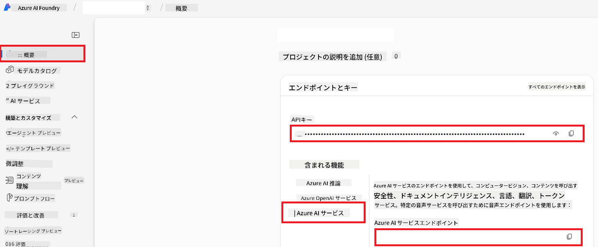

<!--
CO_OP_TRANSLATOR_METADATA:
{
  "original_hash": "b58d7c3cb4210697a073d20eb3064945",
  "translation_date": "2025-07-04T08:12:00+00:00",
  "source_file": "getting_started/set-up-azure-ai.md",
  "language_code": "ja"
}
-->
# Azure AI のセットアップ方法 (Azure OpenAI & Azure AI Vision)

このガイドでは、Azure AI Foundry 内で言語翻訳のための Azure OpenAI と、画像コンテンツ分析（画像ベースの翻訳に使用可能）のための Azure Computer Vision のセットアップ方法を説明します。

**前提条件:**
- 有効なサブスクリプションを持つ Azure アカウント。
- Azure サブスクリプションでリソースとデプロイメントを作成するための十分な権限。

## Azure AI プロジェクトの作成

まず、AI リソースを管理するための中心的な場所として機能する Azure AI プロジェクトを作成します。

1. [https://ai.azure.com](https://ai.azure.com) にアクセスし、Azure アカウントでサインインします。

1. **+Create** を選択して新しいプロジェクトを作成します。

1. 次のタスクを実行します:
   - **Project name** を入力します（例: `CoopTranslator-Project`）。
   - **AI hub** を選択します（例: `CoopTranslator-Hub`）（必要に応じて新しいものを作成します）。

1. "**Review and Create**" をクリックしてプロジェクトを設定します。プロジェクトの概要ページに移動します。

## 言語翻訳のための Azure OpenAI のセットアップ

プロジェクト内で、テキスト翻訳のバックエンドとして機能する Azure OpenAI モデルをデプロイします。

### プロジェクトに移動

まだ移動していない場合は、新しく作成したプロジェクト（例: `CoopTranslator-Project`）を Azure AI Foundry で開きます。

### OpenAI モデルのデプロイ

1. プロジェクトの左側のメニューから "My assets" の下にある "**Models + endpoints**" を選択します。

1. **+ Deploy model** を選択します。

1. **Deploy Base Model** を選択します。

1. 利用可能なモデルのリストが表示されます。適切な GPT モデルをフィルタリングまたは検索します。`gpt-4o` をお勧めします。

1. 希望するモデルを選択し、**Confirm** をクリックします。

1. **Deploy** を選択します。

### Azure OpenAI の設定

デプロイが完了すると、"**Models + endpoints**" ページからデプロイメントの **REST endpoint URL**、**Key**、**Deployment name**、**Model name**、**API version** を確認できます。これらは翻訳モデルをアプリケーションに統合する際に必要です。

> [!NOTE]
> 要件に基づいて [API version deprecation](https://learn.microsoft.com/azure/ai-services/openai/api-version-deprecation) ページから API バージョンを選択できます。**API version** は Azure AI Foundry の **Models + endpoints** ページに表示される **Model version** とは異なることに注意してください。

## 画像翻訳のための Azure Computer Vision のセットアップ

画像内のテキストを翻訳できるようにするには、Azure AI Service API Key と Endpoint を見つける必要があります。

1. Azure AI プロジェクト（例: `CoopTranslator-Project`）に移動します。プロジェクトの概要ページにいることを確認してください。

### Azure AI Service の設定

Azure AI Service から API Key と Endpoint を見つけます。

1. Azure AI プロジェクト（例: `CoopTranslator-Project`）に移動します。プロジェクトの概要ページにいることを確認してください。

1. Azure AI Service タブから **API Key** と **Endpoint** を見つけます。

    

この接続により、リンクされた Azure AI Services リソースの機能（画像分析を含む）が AI Foundry プロジェクトで利用可能になります。この接続を使用して、ノートブックやアプリケーションで画像からテキストを抽出し、その後 Azure OpenAI モデルに送信して翻訳することができます。

## 資格情報の統合

ここまでで、次の情報を収集しているはずです:

**Azure OpenAI (テキスト翻訳) の場合:**
- Azure OpenAI Endpoint
- Azure OpenAI API Key
- Azure OpenAI Model Name (例: `gpt-4o`)
- Azure OpenAI Deployment Name (例: `cooptranslator-gpt4o`)
- Azure OpenAI API Version

**Azure AI Services (Vision を介した画像テキスト抽出) の場合:**
- Azure AI Service Endpoint
- Azure AI Service API Key

### 例: 環境変数の設定 (プレビュー)

後でアプリケーションを構築する際に、これらの収集した資格情報を使用して設定することが多いでしょう。例えば、次のように環境変数として設定することができます:

```bash
# Azure AI Service Credentials (Required for image translation)
AZURE_AI_SERVICE_API_KEY="your_azure_ai_service_api_key" # e.g., 21xasd...
AZURE_AI_SERVICE_ENDPOINT="https://your_azure_ai_service_endpoint.cognitiveservices.azure.com/"

# Azure OpenAI Credentials (Required for text translation)
AZURE_OPENAI_API_KEY="your_azure_openai_api_key" # e.g., 21xasd...
AZURE_OPENAI_ENDPOINT="https://your_azure_openai_endpoint.openai.azure.com/"
AZURE_OPENAI_MODEL_NAME="your_model_name" # e.g., gpt-4o
AZURE_OPENAI_CHAT_DEPLOYMENT_NAME="your_deployment_name" # e.g., cooptranslator-gpt4o
AZURE_OPENAI_API_VERSION="your_api_version" # e.g., 2024-12-01-preview
```

---

### さらなる学習

- [Azure AI Foundry でプロジェクトを作成する方法](https://learn.microsoft.com/azure/ai-foundry/how-to/create-projects?tabs=ai-studio)
- [Azure AI リソースを作成する方法](https://learn.microsoft.com/azure/ai-foundry/how-to/create-azure-ai-resource?tabs=portal)
- [Azure AI Foundry で OpenAI モデルをデプロイする方法](https://learn.microsoft.com/en-us/azure/ai-foundry/how-to/deploy-models-openai)

**免責事項**:
この文書はAI翻訳サービス[Co-op Translator](https://github.com/Azure/co-op-translator)を使用して翻訳されています。正確性を追求していますが、自動翻訳には誤りや不正確さが含まれる可能性があることにご注意ください。元の文書はその言語での権威ある情報源とみなされるべきです。重要な情報については、専門の人間による翻訳をお勧めします。この翻訳の使用に起因する誤解や誤解について、当社は責任を負いません。