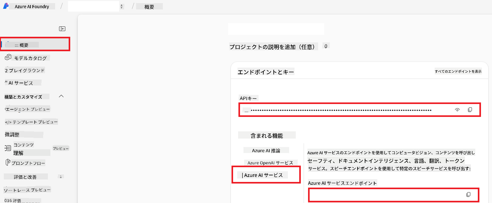

<!--
CO_OP_TRANSLATOR_METADATA:
{
  "original_hash": "b58d7c3cb4210697a073d20eb3064945",
  "translation_date": "2025-06-12T11:48:51+00:00",
  "source_file": "getting_started/set-up-azure-ai.md",
  "language_code": "ja"
}
-->
# Set Up Azure AI for Co-op Translator (Azure OpneAI & Azure AI Vision)

このガイドでは、Azure AI Foundry内で言語翻訳用のAzure OpenAIと、画像ベースの翻訳に使える画像コンテンツ解析用のAzure Computer Visionの設定方法を説明します。

**前提条件:**
- 有効なサブスクリプションを持つAzureアカウント。
- Azureサブスクリプション内でリソースとデプロイメントを作成する十分な権限。

## Azure AIプロジェクトの作成

まず、AIリソースを管理するための中心的な場所となるAzure AIプロジェクトを作成します。

1. [https://ai.azure.com](https://ai.azure.com) にアクセスし、Azureアカウントでサインインします。

1. **+Create** を選択して新しいプロジェクトを作成します。

1. 以下の操作を行います:
   - **Project name** を入力します（例: `CoopTranslator-Project`）。
   - **AI hub** を選択します（例: `CoopTranslator-Hub`）（必要に応じて新規作成）。

1. 「**Review and Create**」をクリックしてプロジェクトを設定します。プロジェクトの概要ページに移動します。

## 言語翻訳用Azure OpenAIの設定

プロジェクト内で、テキスト翻訳のバックエンドとしてAzure OpenAIモデルをデプロイします。

### プロジェクトに移動

まだの場合は、Azure AI Foundryで作成したプロジェクト（例: `CoopTranslator-Project`）を開きます。

### OpenAIモデルのデプロイ

1. プロジェクトの左メニューの「My assets」から「**Models + endpoints**」を選択します。

1. **+ Deploy model** を選択します。

1. **Deploy Base Model** を選択します。

1. 利用可能なモデルのリストが表示されます。適切なGPTモデルを検索またはフィルタリングしてください。おすすめは `gpt-4o` です。

1. 希望のモデルを選択し、**Confirm** をクリックします。

1. **Deploy** を選択します。

### Azure OpenAIの設定

デプロイ後、「**Models + endpoints**」ページからデプロイメントを選択すると、**REST endpoint URL**、**Key**、**Deployment name**、**Model name**、**API version** を確認できます。これらは翻訳モデルをアプリケーションに統合する際に必要です。

> [!NOTE]
> APIバージョンは、[API version deprecation](https://learn.microsoft.com/azure/ai-services/openai/api-version-deprecation) ページからニーズに応じて選択可能です。**API version** はAzure AI Foundryの「Models + endpoints」ページに表示される**Model version**とは異なることに注意してください。

## 画像翻訳用Azure Computer Visionの設定

画像内のテキストを翻訳可能にするため、Azure AI ServiceのAPIキーとエンドポイントを取得します。

1. Azure AIプロジェクト（例: `CoopTranslator-Project`）に移動し、プロジェクトの概要ページにいることを確認します。

### Azure AI Serviceの設定

Azure AI ServiceからAPIキーとエンドポイントを取得します。

1. Azure AIプロジェクト（例: `CoopTranslator-Project`）に移動し、プロジェクトの概要ページにいることを確認します。

1. Azure AI Serviceタブから**API Key**と**Endpoint**を確認します。

    

この接続により、リンクされたAzure AI Servicesリソースの機能（画像解析を含む）がAI Foundryプロジェクトで利用可能になります。これを使ってノートブックやアプリケーションで画像からテキストを抽出し、その後Azure OpenAIモデルに翻訳を依頼できます。

## 資格情報のまとめ

ここまでで、以下の情報が揃っているはずです：

**Azure OpenAI（テキスト翻訳）用:**
- Azure OpenAI Endpoint
- Azure OpenAI API Key
- Azure OpenAI Model Name（例: `gpt-4o`）
- Azure OpenAI Deployment Name（例: `cooptranslator-gpt4o`）
- Azure OpenAI API Version

**Azure AI Services（Visionによる画像テキスト抽出）用:**
- Azure AI Service Endpoint
- Azure AI Service API Key

### 例: 環境変数設定（プレビュー）

後でアプリケーションを構築する際、これらの資格情報を環境変数などで設定することが多いでしょう。例として以下のように設定します：

```bash
# Azure AI Service Credentials (Required for image translation)
AZURE_AI_SERVICE_API_KEY="your_azure_ai_service_api_key" # e.g., 21xasd...
AZURE_AI_SERVICE_ENDPOINT="https://your_azure_ai_service_endpoint.cognitiveservices.azure.com/"

# Azure OpenAI Credentials (Required for text translation)
AZURE_OPENAI_API_KEY="your_azure_openai_api_key" # e.g., 21xasd...
AZURE_OPENAI_ENDPOINT="https://your_azure_openai_endpoint.openai.azure.com/"
AZURE_OPENAI_MODEL_NAME="your_model_name" # e.g., gpt-4o
AZURE_OPENAI_CHAT_DEPLOYMENT_NAME="your_deployment_name" # e.g., cooptranslator-gpt4o
AZURE_OPENAI_API_VERSION="your_api_version" # e.g., 2024-12-01-preview
```

---

### 参考リンク

- [Azure AI Foundryでのプロジェクト作成方法](https://learn.microsoft.com/azure/ai-foundry/how-to/create-projects?tabs=ai-studio)
- [Azure AIリソースの作成方法](https://learn.microsoft.com/azure/ai-foundry/how-to/create-azure-ai-resource?tabs=portal)
- [Azure AI FoundryでのOpenAIモデルのデプロイ方法](https://learn.microsoft.com/en-us/azure/ai-foundry/how-to/deploy-models-openai)

**免責事項**:  
本書類はAI翻訳サービス[Co-op Translator](https://github.com/Azure/co-op-translator)を使用して翻訳されています。正確性の向上に努めておりますが、自動翻訳には誤りや不正確な箇所が含まれる可能性があることをご理解ください。原文の言語によるオリジナル文書が正式な情報源とみなされます。重要な情報については、専門の人間による翻訳を推奨します。本翻訳の利用により生じたいかなる誤解や誤訳についても、当方は責任を負いかねます。