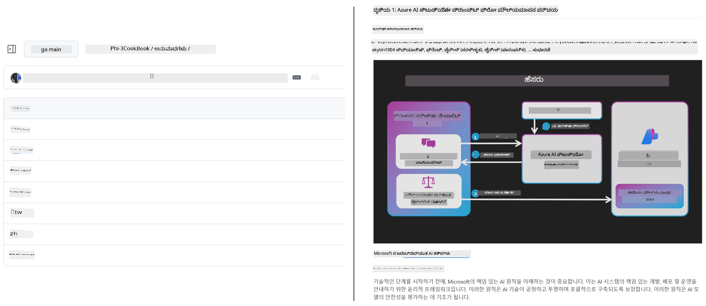
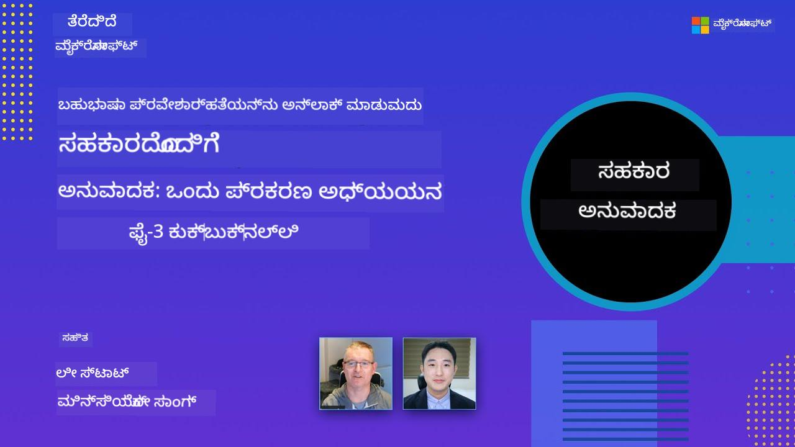

<!--
CO_OP_TRANSLATOR_METADATA:
{
  "original_hash": "dac6bc281667816537df51f724a0ff2c",
  "translation_date": "2025-11-30T13:19:39+00:00",
  "source_file": "README.md",
  "language_code": "kn"
}
-->
# ಸಹಕಾರ ಅನುವಾದಕ

_ನಿಮ್ಮ ಶೈಕ್ಷಣಿಕ GitHub ವಿಷಯವನ್ನು ಬಹುಭಾಷೆಗಳಲ್ಲಿ ಸುಲಭವಾಗಿ ಅನುವಾದಿಸಿ, ಜಾಗತಿಕ ಪ್ರೇಕ್ಷಕರಿಗೆ ತಲುಪಿಸಿ._

[](https://pypi.org/project/co-op-translator/)
[](https://github.com/azure/co-op-translator/blob/main/LICENSE)
[](https://pepy.tech/project/co-op-translator)
[](https://pepy.tech/project/co-op-translator)
[](https://github.com/azure/co-op-translator/pkgs/container/co-op-translator)
[](https://github.com/psf/black)

[](https://GitHub.com/azure/co-op-translator/graphs/contributors/)
[](https://GitHub.com/azure/co-op-translator/issues/)
[](https://GitHub.com/azure/co-op-translator/pulls/)
[](http://makeapullrequest.com)

### 🌐 ಬಹುಭಾಷಾ ಬೆಂಬಲ

#### [Co-op Translator](https://github.com/Azure/Co-op-Translator) ಮೂಲಕ ಬೆಂಬಲಿತ

<!-- CO-OP TRANSLATOR LANGUAGES TABLE START -->
[ಅರೇಬಿಕ್](../ar/README.md) | [ಬಂಗಾಳಿ](../bn/README.md) | [ಬಲ್ಗೇರಿಯನ್](../bg/README.md) | [ಬರ್ಮೀಸ್ (ಮಯನ್ಮಾರ್)](../my/README.md) | [ಚೈನೀಸ್ (ಸರಳೀಕೃತ)](../zh/README.md) | [ಚೈನೀಸ್ (ಪಾರಂಪರಿಕ, ಹಾಂಗ್ ಕಾಂಗ್)](../hk/README.md) | [ಚೈನೀಸ್ (ಪಾರಂಪರಿಕ, ಮಕಾವು)](../mo/README.md) | [ಚೈನೀಸ್ (ಪಾರಂಪರಿಕ, ತೈವಾನ್)](../tw/README.md) | [ಕ್ರೊಯೇಷಿಯನ್](../hr/README.md) | [ಚೆಕ್](../cs/README.md) | [ಡ್ಯಾನಿಷ್](../da/README.md) | [ಡಚ್](../nl/README.md) | [ಎಸ್ಟೋನಿಯನ್](../et/README.md) | [ಫಿನ್ನಿಷ್](../fi/README.md) | [ಫ್ರೆಂಚ್](../fr/README.md) | [ಜರ್ಮನ್](../de/README.md) | [ಗ್ರೀಕ್](../el/README.md) | [ಹೆಬ್ರೂ](../he/README.md) | [ಹಿಂದಿ](../hi/README.md) | [ಹಂಗೇರಿಯನ್](../hu/README.md) | [ಇಂಡೋನೇಶಿಯನ್](../id/README.md) | [ಇಟಾಲಿಯನ್](../it/README.md) | [ಜಪಾನೀಸ್](../ja/README.md) | [ಕನ್ನಡ](./README.md) | [ಕೊರಿಯನ್](../ko/README.md) | [ಲಿಥುವೇನಿಯನ್](../lt/README.md) | [ಮಲಯ್](../ms/README.md) | [ಮಲಯಾಳಂ](../ml/README.md) | [ಮರಾಠಿ](../mr/README.md) | [ನೇಪಾಳಿ](../ne/README.md) | [ನೈಜೀರಿಯನ್ ಪಿಡ್ಗಿನ್](../pcm/README.md) | [ನಾರ್ವೇಜಿಯನ್](../no/README.md) | [ಪರ್ಶಿಯನ್ (ಫಾರ್ಸಿ)](../fa/README.md) | [ಪೋಲಿಷ್](../pl/README.md) | [ಪೋರ್ಚುಗೀಸ್ (ಬ್ರೆಜಿಲ್)](../br/README.md) | [ಪೋರ್ಚುಗೀಸ್ (ಪೋರ್ಚುಗಲ್)](../pt/README.md) | [ಪಂಜಾಬಿ (ಗುರ್ಮುಖಿ)](../pa/README.md) | [ರೋಮೇನಿಯನ್](../ro/README.md) | [ರಷ್ಯನ್](../ru/README.md) | [ಸರ್ಬಿಯನ್ (ಸಿರಿಲಿಕ್)](../sr/README.md) | [ಸ್ಲೋವಾಕ್](../sk/README.md) | [ಸ್ಲೋವೇನಿಯನ್](../sl/README.md) | [ಸ್ಪ್ಯಾನಿಷ್](../es/README.md) | [ಸ್ವಾಹಿಲಿ](../sw/README.md) | [ಸ್ವೀಡಿಷ್](../sv/README.md) | [ಟಾಗಾಲೋಗ್ (ಫಿಲಿಪಿನೋ)](../tl/README.md) | [ತಮಿಳು](../ta/README.md) | [ತೆಲುಗು](../te/README.md) | [ಥಾಯ್](../th/README.md) | [ಟರ್ಕಿಷ್](../tr/README.md) | [ಉಕ್ರೇನಿಯನ್](../uk/README.md) | [ಉರ್ದು](../ur/README.md) | [ವಿಯೆಟ್ನಾಮೀಸ್](../vi/README.md)
<!-- CO-OP TRANSLATOR LANGUAGES TABLE END -->

[](https://GitHub.com/azure/co-op-translator/watchers/)
[](https://GitHub.com/azure/co-op-translator/network/)
[](https://GitHub.com/azure/co-op-translator/stargazers/)

[](https://discord.gg/nTYy5BXMWG)

[](https://codespaces.new/azure/co-op-translator)

## ಅವಲೋಕನ

**Co-op Translator** ನಿಮ್ಮ ಶೈಕ್ಷಣಿಕ GitHub ವಿಷಯವನ್ನು ಬಹುಭಾಷೆಗಳಲ್ಲಿ ಸುಲಭವಾಗಿ ಸ್ಥಳೀಯಗೊಳಿಸಲು ಸಹಾಯ ಮಾಡುತ್ತದೆ. ನೀವು ನಿಮ್ಮ Markdown ಫೈಲ್‌ಗಳು, ಚಿತ್ರಗಳು ಅಥವಾ ನೋಟ್ಬುಕ್‌ಗಳನ್ನು ನವೀಕರಿಸಿದಾಗ, ಅನುವಾದಗಳು ಸ್ವಯಂಚಾಲಿತವಾಗಿ ಸಮನ್ವಯಗೊಳ್ಳುತ್ತವೆ, ಇದರಿಂದ ನಿಮ್ಮ ವಿಷಯವು ಜಾಗತಿಕವಾಗಿ ಕಲಿಯುವವರಿಗೆ ನಿಖರ ಮತ್ತು ನವೀಕರಿಸಿದ ಸ್ಥಿತಿಯಲ್ಲಿ ಇರುತ್ತದೆ.

ಅನುವಾದಿತ ವಿಷಯವನ್ನು ಹೇಗೆ ಸಂಘಟಿಸಲಾಗುತ್ತದೆ ಎಂಬ ಉದಾಹರಣೆ:



## ತ್ವರಿತ ಪ್ರಾರಂಭ

```bash
# ವರ್ಚುವಲ್ ಪರಿಸರವನ್ನು ರಚಿಸಿ ಮತ್ತು ಸಕ್ರಿಯಗೊಳಿಸಿ (ಶಿಫಾರಸು ಮಾಡಲಾಗಿದೆ)
python -m venv .venv
# ವಿಂಡೋಸ್
.venv\Scripts\activate
# ಮ್ಯಾಕ್‌ಒಎಸ್/ಲಿನಕ್ಸ್ನಲ್ಲಿ
source .venv/bin/activate
# ಪ್ಯಾಕೇಜ್ ಅನ್ನು ಸ್ಥಾಪಿಸಿ
pip install co-op-translator
# ಅನುವಾದಿಸಿ
translate -l "ko ja fr" -md
```

ಡೋಕರ್:

```bash
# GHCR ನಿಂದ ಸಾರ್ವಜನಿಕ ಚಿತ್ರವನ್ನು ಎಳೆಯಿರಿ
docker pull ghcr.io/azure/co-op-translator:latest
# ಪ್ರಸ್ತುತ ಫೋಲ್ಡರ್ ಅನ್ನು ಮೌಂಟ್ ಮಾಡಿ ಮತ್ತು .env ಅನ್ನು ಒದಗಿಸಿ (Bash/Zsh)
docker run --rm -it --env-file .env -v "${PWD}:/work" ghcr.io/azure/co-op-translator:latest -l "ko ja fr" -md
```

## ಕನಿಷ್ಠ ಸೆಟಪ್

1. ಟೆಂಪ್ಲೇಟ್ನಿಂದ `.env` ಫೈಲ್ ರಚಿಸಿ: [.env.template](../../.env.template)
2. ಒಂದು LLM ಪೂರೈಕೆದಾರರನ್ನು ಸಂರಚಿಸಿ (Azure OpenAI ಅಥವಾ OpenAI)
3. (ಐಚ್ಛಿಕ) ಚಿತ್ರ ಅನುವಾದಕ್ಕಾಗಿ (`-img`), Azure AI Vision ಅನ್ನು ಸಂರಚಿಸಿ
4. (ಶಿಫಾರಸು) ಯಾವುದೇ ಹಳೆಯ ಅನುವಾದಗಳನ್ನು Conflict ತಪ್ಪಿಸಲು ತೆರವುಗೊಳಿಸಿ (ಉದಾ: `translations/`)
5. (ಶಿಫಾರಸು) ನಿಮ್ಮ README ಗೆ ಅನುವಾದ ವಿಭಾಗವನ್ನು ಸೇರಿಸಿ [README languages template](./getting_started/README_languages_template.md) ಬಳಸಿ
6. ನೋಡಿ: [Azure AI ಸೆಟಪ್](./getting_started/set-up-azure-ai.md)

## ಬಳಕೆ

ಎಲ್ಲಾ ಬೆಂಬಲಿತ ಪ್ರಕಾರಗಳನ್ನು ಅನುವಾದಿಸಿ:

```bash
translate -l "ko ja"
```

Markdown ಮಾತ್ರ:

```bash
translate -l "de" -md
```

Markdown + ಚಿತ್ರಗಳು:

```bash
translate -l "pt" -md -img
```

ನೋಟ್ಬುಕ್‌ಗಳು ಮಾತ್ರ:

```bash
translate -l "zh" -nb
```

ಹೆಚ್ಚಿನ ಫ್ಲಾಗ್‌ಗಳು: [ಕಮಾಂಡ್ ರೆಫರೆನ್ಸ್](./getting_started/command-reference.md)

## ವೈಶಿಷ್ಟ್ಯಗಳು

- Markdown, ನೋಟ್ಬುಕ್‌ಗಳು ಮತ್ತು ಚಿತ್ರಗಳ ಸ್ವಯಂಚಾಲಿತ ಅನುವಾದ
- ಮೂಲ ಬದಲಾವಣೆಗಳೊಂದಿಗೆ ಅನುವಾದಗಳನ್ನು ಸಮನ್ವಯಗೊಳಿಸುತ್ತದೆ
- ಸ್ಥಳೀಯ (CLI) ಅಥವಾ CI (GitHub Actions) ನಲ್ಲಿ ಕಾರ್ಯನಿರ್ವಹಿಸುತ್ತದೆ
- Azure OpenAI ಅಥವಾ OpenAI ಬಳಕೆ; ಚಿತ್ರಗಳಿಗೆ ಐಚ್ಛಿಕವಾಗಿ Azure AI Vision
- Markdown ಫಾರ್ಮ್ಯಾಟಿಂಗ್ ಮತ್ತು ರಚನೆಯನ್ನು ಉಳಿಸುತ್ತದೆ

## ಡಾಕ್ಯುಮೆಂಟೇಶನ್

- [ಕಮಾಂಡ್-ಲೈನ್ ಮಾರ್ಗದರ್ಶಿ](./getting_started/command-line-guide/command-line-guide.md)
- [GitHub Actions ಮಾರ್ಗದರ್ಶಿ (ಸಾರ್ವಜನಿಕ ರೆಪೊಗಳು ಮತ್ತು ಸ್ಟ್ಯಾಂಡರ್ಡ್ ಸೀಕ್ರೆಟ್ಸ್)](./getting_started/github-actions-guide/github-actions-guide-public.md)
- [GitHub Actions ಮಾರ್ಗದರ್ಶಿ (Microsoft ಸಂಸ್ಥೆಯ ರೆಪೊಗಳು ಮತ್ತು ಸಂಸ್ಥಾ ಮಟ್ಟದ ಸೆಟಪ್‌ಗಳು)](./getting_started/github-actions-guide/github-actions-guide-org.md)
- [README ಭಾಷೆಗಳ ಟೆಂಪ್ಲೇಟು](./getting_started/README_languages_template.md)
- [ಬೆಂಬಲಿತ ಭಾಷೆಗಳು](./getting_started/supported-languages.md)
- [ಸಹಾಯ](./CONTRIBUTING.md)
- [ಸಮಸ್ಯೆ ಪರಿಹಾರ](./getting_started/troubleshooting.md)

### Microsoft-ನ ವಿಶೇಷ ಮಾರ್ಗದರ್ಶಿ
> [!NOTE]
> Microsoft “For Beginners” ರೆಪೊಗಳ ನಿರ್ವಹಕರಿಗಾಗಿ ಮಾತ್ರ.

- [“ಇತರೆ ಕೋರ್ಸುಗಳು” ಪಟ್ಟಿಯನ್ನು ನವೀಕರಿಸುವುದು (MS Beginners ರೆಪೊಗಳಿಗೆ ಮಾತ್ರ)](./getting_started/update-other-courses.md)

## ನಮಗೆ ಬೆಂಬಲ ನೀಡಿ ಮತ್ತು ಜಾಗತಿಕ ಕಲಿಕೆಯನ್ನು ಉತ್ತೇಜಿಸಿ

ಶೈಕ್ಷಣಿಕ ವಿಷಯವನ್ನು ಜಾಗತಿಕವಾಗಿ ಹಂಚುವ ವಿಧಾನವನ್ನು ಕ್ರಾಂತಿಕಾರಿಯಾಗಿ ಬದಲಾಯಿಸಲು ನಮ್ಮೊಂದಿಗೆ ಸೇರಿ! [Co-op Translator](https://github.com/azure/co-op-translator) ಗೆ GitHub ನಲ್ಲಿ ⭐ ನೀಡಿ ಮತ್ತು ಕಲಿಕೆ ಮತ್ತು ತಂತ್ರಜ್ಞಾನದಲ್ಲಿ ಭಾಷಾ ಅಡ್ಡಿ ಮುರಿಯುವ ನಮ್ಮ ಗುರಿಯನ್ನು ಬೆಂಬಲಿಸಿ. ನಿಮ್ಮ ಆಸಕ್ತಿ ಮತ್ತು ಕೊಡುಗೆಗಳು ಮಹತ್ವದ ಪರಿಣಾಮ ಬೀರುತ್ತವೆ! ಕೋಡ್ ಕೊಡುಗೆಗಳು ಮತ್ತು ವೈಶಿಷ್ಟ್ಯ ಸಲಹೆಗಳು ಯಾವಾಗಲೂ ಸ್ವಾಗತಾರ್ಹ.

### ನಿಮ್ಮ ಭಾಷೆಯಲ್ಲಿ Microsoft ಶೈಕ್ಷಣಿಕ ವಿಷಯವನ್ನು ಅನ್ವೇಷಿಸಿ

- [AZD for Beginners](https://github.com/microsoft/AZD-for-beginners)
- [Edge AI for Beginners](https://github.com/microsoft/edgeai-for-beginners)
- [Model Context Protocol (MCP) For Beginners](https://github.com/microsoft/mcp-for-beginners)
- [AI Agents for Beginners](https://github.com/microsoft/ai-agents-for-beginners)
- [.NET ಬಳಸಿ Generative AI for Beginners](https://github.com/microsoft/Generative-AI-for-beginners-dotnet)
- [Generative AI for Beginners](https://github.com/microsoft/generative-ai-for-beginners)
- [Java ಬಳಸಿ Generative AI for Beginners](https://github.com/microsoft/generative-ai-for-beginners-java)
- [ML for Beginners](https://aka.ms/ml-beginners)
- [Data Science for Beginners](https://aka.ms/datascience-beginners)
- [AI for Beginners](https://aka.ms/ai-beginners)
- [Cybersecurity for Beginners](https://github.com/microsoft/Security-101)
- [Web Dev for Beginners](https://aka.ms/webdev-beginners)
- [IoT for Beginners](https://aka.ms/iot-beginners)
- [PhiCookBook](https://github.com/microsoft/PhiCookBook)

## ವೀಡಿಯೊ ಪ್ರಸ್ತುತಿಗಳು

👉 YouTube ನಲ್ಲಿ ವೀಕ್ಷಿಸಲು ಕೆಳಗಿನ ಚಿತ್ರವನ್ನು ಕ್ಲಿಕ್ ಮಾಡಿ.

- **Microsoft ನಲ್ಲಿ ಓಪನ್**: Co-op Translator ಅನ್ನು ಹೇಗೆ ಬಳಸುವುದು ಎಂಬ 18 ನಿಮಿಷಗಳ ಸಂಕ್ಷಿಪ್ತ ಪರಿಚಯ ಮತ್ತು ತ್ವರಿತ ಮಾರ್ಗದರ್ಶಿ.

  [](https://www.youtube.com/watch?v=jX_swfH_KNU)

## ಕೊಡುಗೆ ನೀಡುವುದು

ಈ ಯೋಜನೆಗೆ ಕೊಡುಗೆಗಳು ಮತ್ತು ಸಲಹೆಗಳು ಸ್ವಾಗತಾರ್ಹ. Azure Co-op Translator ಗೆ ಕೊಡುಗೆ ನೀಡಲು ಆಸಕ್ತಿ ಇದ್ದರೆ, ದಯವಿಟ್ಟು ನಮ್ಮ [CONTRIBUTING.md](./CONTRIBUTING.md) ನೋಡಿ, Co-op Translator ಅನ್ನು ಇನ್ನಷ್ಟು ಸುಲಭವಾಗಿ ಬಳಸಲು ನೀವು ಹೇಗೆ ಸಹಾಯ ಮಾಡಬಹುದು ಎಂಬ ಮಾರ್ಗದರ್ಶನಕ್ಕಾಗಿ.

## ಕೊಡುಗೆದಾರರು

[](https://github.com/Azure/co-op-translator/graphs/contributors)

## ನಡವಳಿಕೆ ನಿಯಮಾವಳಿ

ಈ ಯೋಜನೆ [Microsoft Open Source Code of Conduct](https://opensource.microsoft.com/codeofconduct/) ಅನ್ನು ಅನುಸರಿಸುತ್ತದೆ.
ಹೆಚ್ಚಿನ ಮಾಹಿತಿಗಾಗಿ [Code of Conduct FAQ](https://opensource.microsoft.com/codeofconduct/faq/) ನೋಡಿ ಅಥವಾ ಯಾವುದೇ ಪ್ರಶ್ನೆಗಳು ಅಥವಾ ಟಿಪ್ಪಣಿಗಳಿಗಾಗಿ [opencode@microsoft.com](mailto:opencode@microsoft.com) ಗೆ ಸಂಪರ್ಕಿಸಿ.

## ಜವಾಬ್ದಾರಿಯುತ AI

Microsoft ನಮ್ಮ ಗ್ರಾಹಕರು ನಮ್ಮ AI ಉತ್ಪನ್ನಗಳನ್ನು ಜವಾಬ್ದಾರಿಯುತವಾಗಿ ಬಳಸಲು ಸಹಾಯ ಮಾಡುವುದಕ್ಕೆ ಬದ್ಧವಾಗಿದೆ, ನಮ್ಮ ಕಲಿತ ಪಾಠಗಳನ್ನು ಹಂಚಿಕೊಳ್ಳುತ್ತದೆ ಮತ್ತು Transparency Notes ಮತ್ತು Impact Assessments ಮುಂತಾದ ಸಾಧನಗಳ ಮೂಲಕ ನಂಬಿಕೆ ಆಧಾರಿತ ಸಹಕಾರಗಳನ್ನು ನಿರ್ಮಿಸುತ್ತದೆ. ಈ ಸಂಪನ್ಮೂಲಗಳ ಬಹುತೇಕವನ್ನು [https://aka.ms/RAI](https://aka.ms/RAI) ನಲ್ಲಿ ಕಾಣಬಹುದು.
Microsoft ನ ಜವಾಬ್ದಾರಿಯುತ AI ದೃಷ್ಟಿಕೋನವು ನ್ಯಾಯ, ನಂಬಿಕೆ ಮತ್ತು ಸುರಕ್ಷತೆ, ಗೌಪ್ಯತೆ ಮತ್ತು ಭದ್ರತೆ, ಒಳಗೊಂಡಿಕೆ, ಪಾರದರ್ಶಕತೆ ಮತ್ತು ಹೊಣೆಗಾರಿಕೆ ಎಂಬ AI ತತ್ವಗಳ ಮೇಲೆ ಆಧಾರಿತವಾಗಿದೆ.

ಈ ಉದಾಹರಣೆಯಲ್ಲಿ ಬಳಸಲಾದ ದೊಡ್ಡ ಪ್ರಮಾಣದ ನೈಸರ್ಗಿಕ ಭಾಷೆ, ಚಿತ್ರ ಮತ್ತು ಧ್ವನಿ ಮಾದರಿಗಳು ಅನ್ಯಾಯಕರ, ನಂಬಲಾರದ ಅಥವಾ ಅಪಮಾನಕಾರಿಯಾದ ವರ್ತನೆಗಳನ್ನು ತೋರಿಸಬಹುದು, ಇದರಿಂದ ಹಾನಿ ಸಂಭವಿಸಬಹುದು. ದಯವಿಟ್ಟು ಅಪಾಯಗಳು ಮತ್ತು ಮಿತಿಗಳನ್ನು ತಿಳಿದುಕೊಳ್ಳಲು [Azure OpenAI ಸೇವೆಯ Transparency note](https://learn.microsoft.com/legal/cognitive-services/openai/transparency-note?tabs=text) ಅನ್ನು ಪರಿಶೀಲಿಸಿ.
ಈ ಅಪಾಯಗಳನ್ನು ತಗ್ಗಿಸುವ ಶಿಫಾರಸು ಮಾಡಲಾದ ವಿಧಾನವೆಂದರೆ ನಿಮ್ಮ ವಾಸ್ತುಶಿಲ್ಪದಲ್ಲಿ ಹಾನಿಕಾರಕ ವರ್ತನೆಯನ್ನು ಪತ್ತೆಹಚ್ಚಿ ತಡೆಯುವ ಸುರಕ್ಷತಾ ವ್ಯವಸ್ಥೆಯನ್ನು ಸೇರಿಸುವುದು. [Azure AI Content Safety](https://learn.microsoft.com/azure/ai-services/content-safety/overview) ಸ್ವತಂತ್ರ ರಕ್ಷಣಾ ಪದರವನ್ನು ಒದಗಿಸುತ್ತದೆ, ಇದು ಅಪ್ಲಿಕೇಶನ್‌ಗಳು ಮತ್ತು ಸೇವೆಗಳಲ್ಲಿ ಹಾನಿಕಾರಕ ಬಳಕೆದಾರ-ಉತ್ಪನ್ನ ಮತ್ತು AI-ಉತ್ಪನ್ನ ವಿಷಯವನ್ನು ಪತ್ತೆಹಚ್ಚಲು ಸಾಧ್ಯವಾಗುತ್ತದೆ. Azure AI Content Safety ನಲ್ಲಿ ಪಠ್ಯ ಮತ್ತು ಚಿತ್ರ API ಗಳು ಸೇರಿವೆ, ಅವು ಹಾನಿಕಾರಕ ವಿಷಯವನ್ನು ಪತ್ತೆಹಚ್ಚಲು ಸಹಾಯ ಮಾಡುತ್ತವೆ. ನಾವು ಹಾನಿಕಾರಕ ವಿಷಯವನ್ನು ವಿವಿಧ ಮಾದರಿಗಳಲ್ಲಿ ಪತ್ತೆಹಚ್ಚಲು ಮಾದರಿ ಕೋಡ್ ಅನ್ನು ವೀಕ್ಷಿಸಲು, ಅನ್ವೇಷಿಸಲು ಮತ್ತು ಪ್ರಯತ್ನಿಸಲು ಅನುಮತಿಸುವ ಇಂಟರಾಕ್ಟಿವ್ Content Safety Studio ಕೂಡ ಹೊಂದಿದ್ದೇವೆ. ಕೆಳಗಿನ [ತ್ವರಿತ ಪ್ರಾರಂಭ ಡಾಕ್ಯುಮೆಂಟೇಶನ್](https://learn.microsoft.com/azure/ai-services/content-safety/quickstart-text?tabs=visual-studio%2Clinux&pivots=programming-language-rest) ಸೇವೆಗೆ ವಿನಂತಿಗಳನ್ನು ಮಾಡುವುದನ್ನು ನಿಮಗೆ ಮಾರ್ಗದರ್ಶನ ಮಾಡುತ್ತದೆ.

ಮತ್ತೊಂದು ಪರಿಗಣಿಸಬೇಕಾದ ಅಂಶವೆಂದರೆ ಒಟ್ಟು ಅಪ್ಲಿಕೇಶನ್ ಕಾರ್ಯಕ್ಷಮತೆ. ಬಹು-ಮಾದರಿ ಮತ್ತು ಬಹು-ಮಾದರಿಯ ಅಪ್ಲಿಕೇಶನ್‌ಗಳೊಂದಿಗೆ, ಕಾರ್ಯಕ್ಷಮತೆ ಎಂದರೆ ನೀವು ಮತ್ತು ನಿಮ್ಮ ಬಳಕೆದಾರರು ನಿರೀಕ್ಷಿಸುವಂತೆ ವ್ಯವಸ್ಥೆ ಕಾರ್ಯನಿರ್ವಹಿಸುವುದು, ಹಾನಿಕಾರಕ ಔಟ್‌ಪುಟ್‌ಗಳನ್ನು ಉತ್ಪಾದಿಸದಿರುವುದೂ ಸೇರಿದೆ. ನಿಮ್ಮ ಒಟ್ಟು ಅಪ್ಲಿಕೇಶನ್ ಕಾರ್ಯಕ್ಷಮತೆಯನ್ನು [ಉತ್ಪಾದನಾ ಗುಣಮಟ್ಟ ಮತ್ತು ಅಪಾಯ ಮತ್ತು ಸುರಕ್ಷತಾ ಮೌಲ್ಯಮಾಪನಗಳು](https://learn.microsoft.com/azure/ai-studio/concepts/evaluation-metrics-built-in) ಬಳಸಿ ಅಳೆಯುವುದು ಮುಖ್ಯ.

ನೀವು ನಿಮ್ಮ AI ಅಪ್ಲಿಕೇಶನ್ ಅನ್ನು ನಿಮ್ಮ ಅಭಿವೃದ್ಧಿ ಪರಿಸರದಲ್ಲಿ [prompt flow SDK](https://microsoft.github.io/promptflow/index.html) ಬಳಸಿ ಮೌಲ್ಯಮಾಪನ ಮಾಡಬಹುದು. ಪರೀಕ್ಷಾ ಡೇಟಾಸೆಟ್ ಅಥವಾ ಗುರಿಯನ್ನು ನೀಡಿದರೆ, ನಿಮ್ಮ ಜನರೇಟಿವ್ AI ಅಪ್ಲಿಕೇಶನ್ ಉತ್ಪಾದನೆಗಳನ್ನು ಒಳಗೊಂಡ ಮೌಲ್ಯಮಾಪಕಗಳು ಅಥವಾ ನಿಮ್ಮ ಆಯ್ಕೆಯ ಕಸ್ಟಮ್ ಮೌಲ್ಯಮಾಪಕಗಳೊಂದಿಗೆ ಪ್ರಮಾಣಾತ್ಮಕವಾಗಿ ಅಳೆಯಲಾಗುತ್ತದೆ. ನಿಮ್ಮ ವ್ಯವಸ್ಥೆಯನ್ನು ಮೌಲ್ಯಮಾಪನ ಮಾಡಲು prompt flow sdk ನೊಂದಿಗೆ ಪ್ರಾರಂಭಿಸಲು, ನೀವು [ತ್ವರಿತ ಪ್ರಾರಂಭ ಮಾರ್ಗದರ್ಶಿಯನ್ನು](https://learn.microsoft.com/azure/ai-studio/how-to/develop/flow-evaluate-sdk) ಅನುಸರಿಸಬಹುದು. ಮೌಲ್ಯಮಾಪನ ರನ್ ಅನ್ನು ನಿರ್ವಹಿಸಿದ ನಂತರ, ನೀವು [Azure AI Studio ನಲ್ಲಿ ಫಲಿತಾಂಶಗಳನ್ನು ದೃಶ್ಯೀಕರಿಸಬಹುದು](https://learn.microsoft.com/azure/ai-studio/how-to/evaluate-flow-results).

## ಟ್ರೇಡ್‌ಮಾರ್ಕ್‌ಗಳು

ಈ ಯೋಜನೆಯಲ್ಲಿ ಯೋಜನೆಗಳು, ಉತ್ಪನ್ನಗಳು ಅಥವಾ ಸೇವೆಗಳ ಟ್ರೇಡ್‌ಮಾರ್ಕ್‌ಗಳು ಅಥವಾ ಲೋಗೋಗಳು ಇರಬಹುದು. Microsoft ಟ್ರೇಡ್‌ಮಾರ್ಕ್‌ಗಳು ಅಥವಾ ಲೋಗೋಗಳ ಅಧಿಕೃತ ಬಳಕೆ [Microsoft ಟ್ರೇಡ್‌ಮಾರ್ಕ್ ಮತ್ತು ಬ್ರ್ಯಾಂಡ್ ಮಾರ್ಗಸೂಚಿಗಳು](https://www.microsoft.com/en-us/legal/intellectualproperty/trademarks/usage/general) ಅನುಸರಿಸಬೇಕು. ಈ ಯೋಜನೆಯ ತಿದ್ದುಪಡಿ ಆವೃತ್ತಿಗಳಲ್ಲಿ Microsoft ಟ್ರೇಡ್‌ಮಾರ್ಕ್‌ಗಳು ಅಥವಾ ಲೋಗೋಗಳ ಬಳಕೆ Microsoft ಪ್ರಾಯೋಜಕತ್ವವನ್ನು ಗೊಂದಲಕ್ಕೆ ಅಥವಾ ಸೂಚಿಸಲು ಬಿಡಬಾರದು. ಮೂರನೇ ಪಕ್ಷದ ಟ್ರೇಡ್‌ಮಾರ್ಕ್‌ಗಳು ಅಥವಾ ಲೋಗೋಗಳ ಯಾವುದೇ ಬಳಕೆ ಆ ಮೂರನೇ ಪಕ್ಷದ ನೀತಿಗಳ ಅಧೀನದಲ್ಲಿದೆ.

## ಸಹಾಯ ಪಡೆಯುವುದು

ನೀವು ಅಡಚಣೆಗೆ ಸಿಲುಕಿದರೆ ಅಥವಾ AI ಅಪ್ಲಿಕೇಶನ್‌ಗಳನ್ನು ನಿರ್ಮಿಸುವ ಬಗ್ಗೆ ಯಾವುದೇ ಪ್ರಶ್ನೆಗಳಿದ್ದರೆ, ಸೇರಿ:

[](https://discord.gg/nTYy5BXMWG)

ನೀವು ಉತ್ಪನ್ನ ಪ್ರತಿಕ್ರಿಯೆ ಅಥವಾ ದೋಷಗಳನ್ನು ಹೊಂದಿದ್ದರೆ, ಭೇಟಿ ನೀಡಿ:

[](https://aka.ms/foundry/forum)

---

<!-- CO-OP TRANSLATOR DISCLAIMER START -->
**ಅಸ್ವೀಕಾರ**:  
ಈ ದಸ್ತಾವೇಜು AI ಅನುವಾದ ಸೇವೆ [Co-op Translator](https://github.com/Azure/co-op-translator) ಬಳಸಿ ಅನುವಾದಿಸಲಾಗಿದೆ. ನಾವು ನಿಖರತೆಯಿಗಾಗಿ ಪ್ರಯತ್ನಿಸುತ್ತಿದ್ದರೂ, ಸ್ವಯಂಚಾಲಿತ ಅನುವಾದಗಳಲ್ಲಿ ತಪ್ಪುಗಳು ಅಥವಾ ಅಸತ್ಯತೆಗಳು ಇರಬಹುದು ಎಂದು ದಯವಿಟ್ಟು ಗಮನಿಸಿ. ಮೂಲ ಭಾಷೆಯಲ್ಲಿರುವ ಮೂಲ ದಸ್ತಾವೇಜನ್ನು ಅಧಿಕೃತ ಮೂಲವೆಂದು ಪರಿಗಣಿಸಬೇಕು. ಪ್ರಮುಖ ಮಾಹಿತಿಗಾಗಿ, ವೃತ್ತಿಪರ ಮಾನವ ಅನುವಾದವನ್ನು ಶಿಫಾರಸು ಮಾಡಲಾಗುತ್ತದೆ. ಈ ಅನುವಾದ ಬಳಕೆಯಿಂದ ಉಂಟಾಗುವ ಯಾವುದೇ ತಪ್ಪು ಅರ್ಥಮಾಡಿಕೊಳ್ಳುವಿಕೆ ಅಥವಾ ತಪ್ಪು ವಿವರಣೆಗಳಿಗೆ ನಾವು ಹೊಣೆಗಾರರಾಗುವುದಿಲ್ಲ.
<!-- CO-OP TRANSLATOR DISCLAIMER END -->