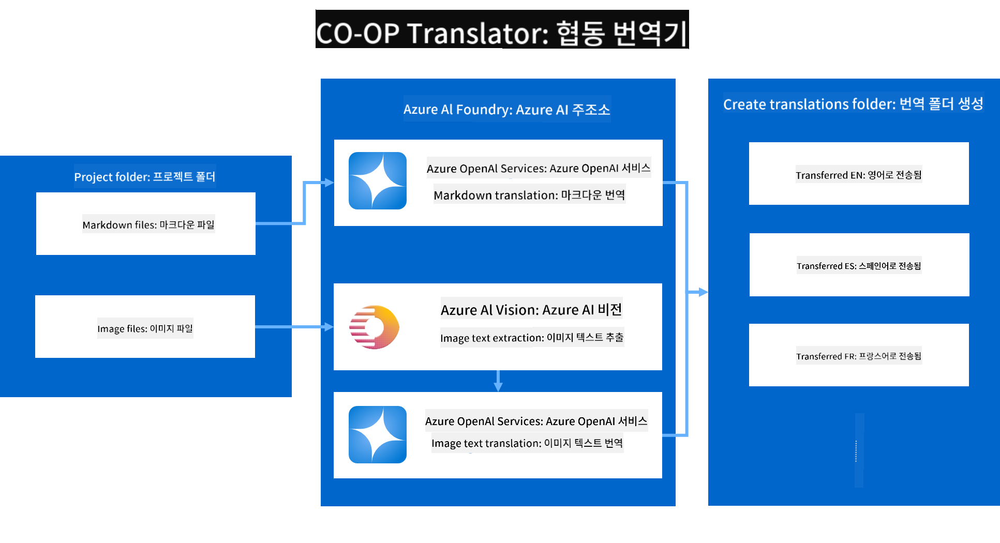

<!--
CO_OP_TRANSLATOR_METADATA:
{
  "original_hash": "044724537b57868117aadae8e7728c7c",
  "translation_date": "2025-07-04T06:48:18+00:00",
  "source_file": "README.md",
  "language_code": "ko"
}
-->


# Co-op Translator: 교육 문서 번역 자동화

_문서를 여러 언어로 쉽게 번역하여 전 세계의 독자에게 다가가세요._

### Co-op Translator가 지원하는 언어

[프랑스어](../fr/README.md) | [스페인어](../es/README.md) | [독일어](../de/README.md) | [러시아어](../ru/README.md) | [아랍어](../ar/README.md) | [페르시아어 (파르시)](../fa/README.md) | [우르두어](../ur/README.md) | [중국어 (간체)](../zh/README.md) | [중국어 (번체, 마카오)](../mo/README.md) | [중국어 (번체, 홍콩)](../hk/README.md) | [중국어 (번체, 대만)](../tw/README.md) | [일본어](../ja/README.md) | [한국어](./README.md) | [힌디어](../hi/README.md) | [벵골어](../bn/README.md) | [마라티어](../mr/README.md) | [네팔어](../ne/README.md) | [펀자브어 (구르무키)](../pa/README.md) | [포르투갈어 (포르투갈)](../pt/README.md) | [포르투갈어 (브라질)](../br/README.md) | [이탈리아어](../it/README.md) | [폴란드어](../pl/README.md) | [터키어](../tr/README.md) | [그리스어](../el/README.md) | [태국어](../th/README.md) | [스웨덴어](../sv/README.md) | [덴마크어](../da/README.md) | [노르웨이어](../no/README.md) | [핀란드어](../fi/README.md) | [네덜란드어](../nl/README.md) | [히브리어](../he/README.md) | [베트남어](../vi/README.md) | [인도네시아어](../id/README.md) | [말레이어](../ms/README.md) | [타갈로그어 (필리핀어)](../tl/README.md) | [스와힐리어](../sw/README.md) | [헝가리어](../hu/README.md) | [체코어](../cs/README.md) | [슬로바키아어](../sk/README.md) | [루마니아어](../ro/README.md) | [불가리아어](../bg/README.md) | [세르비아어 (키릴)](../sr/README.md) | [크로아티아어](../hr/README.md) | [슬로베니아어](../sl/README.md) | [우크라이나어](../uk/README.md) | [버마어 (미얀마어)](../my/README.md)

> [!NOTE]
> 이 저장소의 콘텐츠에 대한 현재 번역입니다. Co-op Translator가 지원하는 전체 언어 목록은 [언어 지원](../..) 섹션을 참조하세요.

## 개요: 교육 콘텐츠 번역 간소화

언어 장벽은 전 세계 학습자와 개발자가 귀중한 교육 자료와 기술 지식에 접근하는 데 큰 장애물이 됩니다. 이는 참여를 제한하고 글로벌 혁신과 학습의 속도를 늦춥니다.

**Co-op Translator**는 Microsoft의 대규모 교육 시리즈(예: "For Beginners" 가이드)에 대한 비효율적인 수동 번역 프로세스를 해결하기 위한 필요성에서 탄생했습니다. 이 도구는 모든 사람을 위한 장벽을 허물기 위해 설계된 사용하기 쉽고 강력한 도구로 발전했습니다. CLI 및 GitHub Actions를 통해 고품질 자동 번역을 제공함으로써 Co-op Translator는 교육자, 학생, 연구자 및 개발자가 언어 제약 없이 지식을 공유하고 접근할 수 있도록 지원합니다.

Co-op Translator가 번역된 교육 콘텐츠를 어떻게 조직하는지 확인하세요:


Markdown 파일과 이미지 텍스트는 자동으로 번역되어 언어별 폴더에 깔끔하게 정리됩니다.

**오늘 Co-op Translator로 교육 콘텐츠의 글로벌 접근성을 열어보세요!**

## Microsoft의 학습 리소스에 대한 글로벌 접근성 지원

Co-op Translator는 글로벌 개발자 커뮤니티에 서비스를 제공하는 저장소의 번역 프로세스를 자동화하여 Microsoft의 주요 교육 이니셔티브에 대한 언어 격차를 해소하는 데 도움을 줍니다. 현재 Co-op Translator를 사용하는 예는 다음과 같습니다:

## 주요 기능

- **자동 번역**: 여러 언어로 텍스트를 쉽게 번역합니다.
- **GitHub Actions 통합**: CI/CD 파이프라인의 일부로 번역을 자동화합니다.
- **Markdown 보존**: 번역 중 올바른 Markdown 구문을 유지합니다.
- **이미지 텍스트 번역**: 이미지 내 텍스트를 추출하고 번역합니다.
- **고급 LLM 기술**: 최첨단 언어 모델을 사용하여 고품질 번역을 제공합니다.
- **쉬운 통합**: 기존 프로젝트 설정과 원활하게 통합합니다.
- **현지화 간소화**: 국제 시장을 위한 프로젝트 현지화 프로세스를 간소화합니다.

## 작동 방식



Co-op Translator는 프로젝트 폴더의 Markdown 파일과 이미지를 다음과 같이 처리합니다:

1. **텍스트 추출**: Markdown 파일과 이미지에 포함된 텍스트(예: Azure AI Vision으로 구성된 경우)를 추출합니다.
1. **AI 번역**: 추출된 텍스트를 구성된 LLM(Azure OpenAI, OpenAI 등)에 보내 번역합니다.
1. **결과 저장**: 번역된 Markdown 파일과 이미지(번역된 텍스트 포함)를 언어별 폴더에 저장하여 원본 형식을 유지합니다.

## 시작하기

CLI를 사용하여 빠르게 시작하거나 GitHub Actions를 통해 전체 자동화를 설정하세요. 워크플로에 가장 적합한 접근 방식을 선택하세요:

1. **명령줄 (CLI)** - 일회성 번역 또는 수동 제어를 위해
2. **GitHub Actions** - 푸시할 때마다 자동 번역을 위해

> [!NOTE]
> 이 튜토리얼은 Azure 리소스에 중점을 두지만 지원되는 모든 언어 모델을 사용할 수 있습니다.

### 언어 지원

Co-op Translator는 전 세계의 독자에게 다가갈 수 있도록 다양한 언어를 지원합니다. 알아야 할 사항은 다음과 같습니다:

#### 빠른 참조

| 언어 | 코드 | 언어 | 코드 | 언어 | 코드 |
|----------|------|----------|------|----------|------|
| 아랍어 | ar | 벵골어 | bn | 불가리아어 | bg |
| 버마어 (미얀마어) | my | 중국어 (간체) | zh | 중국어 (번체, HK) | hk |
| 중국어 (번체, 마카오) | mo | 중국어 (번체, TW) | tw | 크로아티아어 | hr |
| 체코어 | cs | 덴마크어 | da | 네덜란드어 | nl |
| 핀란드어 | fi | 프랑스어 | fr | 독일어 | de |
| 그리스어 | el | 히브리어 | he | 힌디어 | hi |
| 헝가리어 | hu | 인도네시아어 | id | 이탈리아어 | it |
| 일본어 | ja | 한국어 | ko | 말레이어 | ms |
| 마라티어 | mr | 네팔어 | ne | 노르웨이어 | no |
| 페르시아어 (파르시) | fa | 폴란드어 | pl | 포르투갈어 (브라질) | br |
| 포르투갈어 (포르투갈) | pt | 펀자브어 (구르무키) | pa | 루마니아어 | ro |
| 러시아어 | ru | 세르비아어 (키릴) | sr | 슬로바키아어 | sk |
| 슬로베니아어 | sl | 스페인어 | es | 스와힐리어 | sw |
| 스웨덴어 | sv | 타갈로그어 (필리핀어) | tl | 태국어 | th |
| 터키어 | tr | 우크라이나어 | uk | 우르두어 | ur |
| 베트남어 | vi | — | — | — | — |

#### 언어 코드 사용

Co-op Translator를 사용할 때는 코드로 언어를 지정해야 합니다. 예를 들어:

```bash
# Translate to French, Spanish, and German
translate -l "fr es de"

# Translate to Chinese (Simplified) and Japanese
translate -l "zh ja"
```
> [!NOTE]
> 언어 지원에 대한 자세한 기술 정보를 보려면 다음을 포함합니다:
>
> - 각 언어에 대한 글꼴 사양
> - 알려진 문제
> - 새로운 언어를 추가하는 방법
>
> [지원 언어 문서](./getting_started/supported-languages.md)를 참조하세요.
### 지원되는 모델 및 서비스

| 유형                  | 이름                           |
|-----------------------|--------------------------------|
| 언어 모델        |   |
| AI 비전       |  |

> [!NOTE]
> AI 비전 서비스가 사용 불가능한 경우, 협업 번역기는 [Markdown 전용 모드](./getting_started/markdown-only-mode.md)로 전환됩니다.

### 초기 설정

시작하기 전에 다음 리소스를 설정해야 합니다:

1. 언어 모델 리소스 (필수):
   - Azure OpenAI (권장) - 기업 수준의 신뢰성을 갖춘 고품질 번역 제공
   - OpenAI - Azure 접근이 없는 경우 대안 옵션
   - 지원되는 모델에 대한 자세한 정보는 [지원되는 모델 및 서비스](../..)를 참조하세요.

1. AI 비전 리소스 (선택 사항):
   - Azure AI Vision - 이미지 내 텍스트 번역 가능
   - 설정되지 않은 경우, 번역기는 자동으로 [Markdown 전용 모드](./getting_started/markdown-only-mode.md)를 사용합니다.
   - 번역이 필요한 텍스트가 포함된 이미지가 있는 프로젝트에 권장

1. 구성 단계:
   - 자세한 지침은 [Azure AI 설정 가이드](./getting_started/set-up-azure-ai.md)를 따르세요.
   - API 키와 엔드포인트를 포함한 `.env` 파일을 생성하세요 (자세한 내용은 [빠른 시작](../..) 섹션 참조).
   - 선택한 서비스에 필요한 권한과 할당량이 있는지 확인하세요.

### 번역 전 프로젝트 설정

번역 프로세스를 시작하기 전에 다음 단계를 따라 프로젝트를 준비하세요:

1. README 준비:
   - 번역된 버전으로 연결되는 번역 테이블을 README.md에 추가하세요.
   - 예시 형식:

     ```markdown

     ### 🌐 Multi-Language Support
     
     [French](../fr/README.md) | [Spanish](../es/README.md) | [German](../de/README.md) | [Russian](../ru/README.md) | [Arabic](../ar/README.md) | [Persian (Farsi)](../fa/README.md) | [Urdu](../ur/README.md) | [Chinese (Simplified)](../zh/README.md) | [Chinese (Traditional, Macau)](../mo/README.md) | [Chinese (Traditional, Hong Kong)](../hk/README.md) | [Chinese (Traditional, Taiwan)](../tw/README.md) | [Japanese](../ja/README.md) | [Korean](./README.md) | [Hindi](../hi/README.md) | [Bengali](../bn/README.md) | [Marathi](../mr/README.md) | [Nepali](../ne/README.md) | [Punjabi (Gurmukhi)](../pa/README.md) | [Portuguese (Portugal)](../pt/README.md) | [Portuguese (Brazil)](../br/README.md) | [Italian](../it/README.md) | [Polish](../pl/README.md) | [Turkish](../tr/README.md) | [Greek](../el/README.md) | [Thai](../th/README.md) | [Swedish](../sv/README.md) | [Danish](../da/README.md) | [Norwegian](../no/README.md) | [Finnish](../fi/README.md) | [Dutch](../nl/README.md) | [Hebrew](../he/README.md) | [Vietnamese](../vi/README.md) | [Indonesian](../id/README.md) | [Malay](../ms/README.md) | [Tagalog (Filipino)](../tl/README.md) | [Swahili](../sw/README.md) | [Hungarian](../hu/README.md) | [Czech](../cs/README.md) | [Slovak](../sk/README.md) | [Romanian](../ro/README.md) | [Bulgarian](../bg/README.md) | [Serbian (Cyrillic)](../sr/README.md) | [Croatian](../hr/README.md) | [Slovenian](../sl/README.md) | [Ukrainian](../uk/README.md) | [Burmese (Myanmar)](../my/README.md) 
    
     ```

1. 기존 번역 정리 (필요한 경우):
   - 기존 번역 폴더 (예: `translations/`)를 제거하세요.
   - 새 번역 프로세스와 충돌하지 않도록 이전 번역 파일을 삭제하세요.

### 빠른 시작: 명령줄

명령줄을 사용한 빠른 시작:

1. 가상 환경 생성:

    ```bash
    python -m venv .venv
    ```

1. 가상 환경 활성화:

    - Windows에서:

    ```bash
    .venv\scripts\activate
    ```

    - Linux/macOS에서:

    ```bash
    source .venv/bin/activate
    ```

1. 패키지 설치:

    ```bash
    pip install co-op-translator
    ```

1. 자격 증명 구성:

    - 프로젝트의 루트 디렉토리에 `.env` 파일을 생성하세요.
    - [.env.template](../../.env.template) 파일의 내용을 새 `.env` 파일에 복사하세요.
    - 필요한 API 키와 엔드포인트 정보를 `.env` 파일에 입력하세요.

1. 번역 실행:
    - 터미널에서 프로젝트의 루트 디렉토리로 이동하세요.
    - `-l` 플래그로 대상 언어를 지정하여 번역 명령을 실행하세요:

    ```bash
    translate -l "ko ja fr"
    ```

    _(원하는 언어 코드를 `"ko ja fr"` 대신 입력하세요)_

### 상세 사용 가이드

작업 흐름에 가장 적합한 접근 방식을 선택하세요:

#### 1. 명령줄 (CLI) 사용

- 적합한 경우: 일회성 번역, 수동 제어, 맞춤 스크립트 통합.
- 필요 사항: Python 및 `co-op-translator` 패키지의 로컬 설치.
- 가이드: [명령줄 가이드](./getting_started/command-line-guide/command-line-guide.md)

#### 2. GitHub Actions 사용 (자동화)

- 적합한 경우: 저장소에 변경 사항이 푸시될 때마다 자동으로 콘텐츠 번역. 번역을 일관되게 최신 상태로 유지.
- 필요 사항: 저장소에 워크플로 파일 (`.github/workflows`) 설정. 로컬 설치 불필요.
- 가이드:
  - [GitHub Actions 가이드 (공개 저장소 및 표준 비밀)](./getting_started/github-actions-guide/github-actions-guide-public.md) - 대부분의 공개 또는 개인 저장소에서 표준 저장소 비밀을 사용하는 경우.
  - [GitHub Actions 가이드 (Microsoft 조직 저장소 및 조직 수준 설정)](./getting_started/github-actions-guide/github-actions-guide-org.md) - Microsoft GitHub 조직 내에서 작업하거나 조직 수준의 비밀 또는 실행자를 활용해야 하는 경우.

### 문제 해결 및 팁

- [문제 해결 가이드](./getting_started/troubleshooting.md)

### 추가 자료

- [명령어 참조](./getting_started/command-reference.md): 사용 가능한 모든 명령어와 옵션에 대한 자세한 가이드.
- [지원 언어](./getting_started/supported-languages.md): 지원되는 언어 목록과 새 언어 추가 방법 확인.
- [Markdown 전용 모드](./getting_started/markdown-only-mode.md): 이미지 번역 없이 텍스트만 번역하는 방법.

## 비디오 프레젠테이션

협업 번역기에 대한 자세한 내용을 프레젠테이션을 통해 알아보세요 _(아래 이미지를 클릭하여 YouTube에서 시청하세요.)_:

- **Microsoft에서 열기**: 협업 번역기 사용 방법에 대한 18분 간의 간단한 소개 및 빠른 가이드.

  [](https://www.youtube.com/watch?v=jX_swfH_KNU)

## 우리를 지원하고 글로벌 학습을 촉진하세요

교육 콘텐츠가 전 세계적으로 공유되는 방식을 혁신하는 데 동참하세요! GitHub에서 [협업 번역기](https://github.com/azure/co-op-translator)에 ⭐를 주고 학습과 기술의 언어 장벽을 허무는 우리의 사명을 지원하세요. 여러분의 관심과 기여는 큰 영향을 미칩니다! 코드 기여와 기능 제안은 언제나 환영합니다.

## 기여

이 프로젝트는 기여와 제안을 환영합니다. Azure 협업 번역기에 기여하고 싶으신가요? [CONTRIBUTING.md](./CONTRIBUTING.md)를 참조하여 협업 번역기를 더 접근 가능하게 만드는 방법에 대한 지침을 확인하세요.

## 기여자

[](https://github.com/Azure/co-op-translator/graphs/contributors)

## 행동 강령

이 프로젝트는 [Microsoft 오픈 소스 행동 강령](https://opensource.microsoft.com/codeofconduct/)을 채택했습니다.
자세한 정보는 [행동 강령 FAQ](https://opensource.microsoft.com/codeofconduct/faq/)를 참조하거나
추가 질문이나 의견이 있는 경우 [opencode@microsoft.com](mailto:opencode@microsoft.com)으로 문의하세요.

## 책임 있는 AI

Microsoft는 고객이 AI 제품을 책임감 있게 사용할 수 있도록 돕고, 학습을 공유하며, 투명성 노트와 영향 평가와 같은 도구를 통해 신뢰 기반의 파트너십을 구축하는 데 전념하고 있습니다. 이러한 리소스 중 많은 부분은 [https://aka.ms/RAI](https://aka.ms/RAI)에서 찾을 수 있습니다.
Microsoft의 책임 있는 AI 접근 방식은 공정성, 신뢰성 및 안전성, 프라이버시 및 보안, 포용성, 투명성, 책임성이라는 AI 원칙에 기반을 두고 있습니다.

이 샘플에서 사용된 대규모 자연어, 이미지 및 음성 모델은 불공정하거나 신뢰할 수 없거나 공격적인 방식으로 작동할 수 있으며, 그로 인해 피해를 초래할 수 있습니다. 위험과 제한 사항에 대한 정보를 얻으려면 [Azure OpenAI 서비스 투명성 노트](https://learn.microsoft.com/legal/cognitive-services/openai/transparency-note?tabs=text)를 참조하세요.

이러한 위험을 완화하는 데 권장되는 접근 방식은 유해한 행동을 감지하고 방지할 수 있는 안전 시스템을 아키텍처에 포함하는 것입니다. [Azure AI 콘텐츠 안전](https://learn.microsoft.com/azure/ai-services/content-safety/overview)은 애플리케이션 및 서비스에서 사용자 생성 및 AI 생성 콘텐츠의 유해성을 감지할 수 있는 독립적인 보호 계층을 제공합니다. Azure AI 콘텐츠 안전에는 유해한 자료를 감지할 수 있는 텍스트 및 이미지 API가 포함되어 있습니다. 또한 다양한 모달리티에서 유해한 콘텐츠를 감지하기 위한 샘플 코드를 보고, 탐색하고, 시도해 볼 수 있는 인터랙티브 콘텐츠 안전 스튜디오도 제공합니다. 다음 [빠른 시작 문서](https://learn.microsoft.com/azure/ai-services/content-safety/quickstart-text?tabs=visual-studio%2Clinux&pivots=programming-language-rest)는 서비스에 요청을 보내는 방법을 안내합니다.

또한 고려해야 할 또 다른 측면은 전체 애플리케이션 성능입니다. 다중 모달 및 다중 모델 애플리케이션의 경우, 성능은 시스템이 사용자와 사용자가 기대하는 대로 작동하며 유해한 출력을 생성하지 않는 것을 의미합니다. [생성 품질 및 위험 및 안전성 메트릭](https://learn.microsoft.com/azure/ai-studio/concepts/evaluation-metrics-built-in)을 사용하여 전체 애플리케이션의 성능을 평가하는 것이 중요합니다.

개발 환경에서 [프롬프트 흐름 SDK](https://microsoft.github.io/promptflow/index.html)를 사용하여 AI 애플리케이션을 평가할 수 있습니다. 테스트 데이터 세트 또는 목표를 제공하면 생성 AI 애플리케이션의 생성물이 내장 평가자 또는 선택한 사용자 정의 평가자를 통해 정량적으로 측정됩니다. 시스템을 평가하기 위해 프롬프트 흐름 SDK를 시작하려면 [빠른 시작 가이드](https://learn.microsoft.com/azure/ai-studio/how-to/develop/flow-evaluate-sdk)를 따르세요. 평가 실행을 수행한 후에는 [Azure AI 스튜디오에서 결과를 시각화할 수 있습니다](https://learn.microsoft.com/azure/ai-studio/how-to/evaluate-flow-results).

## 상표

이 프로젝트에는 프로젝트, 제품 또는 서비스의 상표 또는 로고가 포함될 수 있습니다. Microsoft 상표 또는 로고의 허가된 사용은 [Microsoft의 상표 및 브랜드 가이드라인](https://www.microsoft.com/en-us/legal/intellectualproperty/trademarks/usage/general)을 따라야 합니다.
이 프로젝트의 수정된 버전에서 Microsoft 상표 또는 로고를 사용하는 경우 혼동을 일으키거나 Microsoft의 후원을 암시해서는 안 됩니다.
제3자 상표 또는 로고의 사용은 해당 제3자의 정책을 따릅니다.

**면책 조항**:  
이 문서는 AI 번역 서비스 [Co-op Translator](https://github.com/Azure/co-op-translator)를 사용하여 번역되었습니다. 우리는 정확성을 위해 노력하지만, 자동 번역에는 오류나 부정확성이 있을 수 있음을 유의하시기 바랍니다. 원본 문서는 해당 언어로 작성된 것이 권위 있는 출처로 간주되어야 합니다. 중요한 정보의 경우, 전문적인 인간 번역을 권장합니다. 이 번역 사용으로 인해 발생하는 오해나 잘못된 해석에 대해 책임을 지지 않습니다.