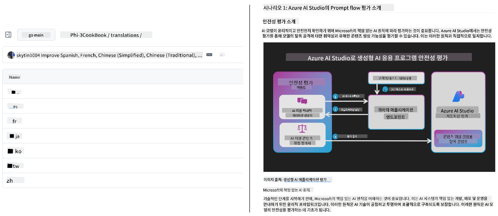
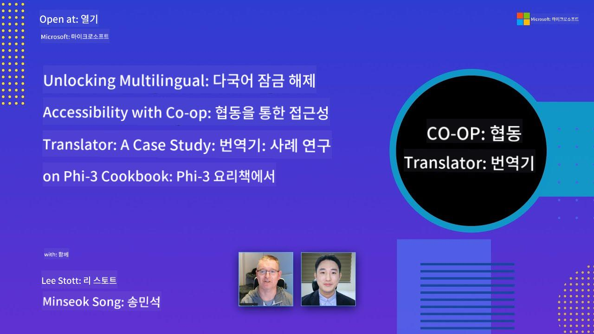

<!--
CO_OP_TRANSLATOR_METADATA:
{
  "original_hash": "8f776df01855a3a659c8eb6f16a5de74",
  "translation_date": "2025-10-15T02:40:25+00:00",
  "source_file": "README.md",
  "language_code": "ko"
}
-->
# Co-op Translator

_교육용 GitHub 콘텐츠를 여러 언어로 자동 번역하여 전 세계 사용자에게 쉽게 다가가세요._

### 🌐 다국어 지원

#### [Co-op Translator](https://github.com/Azure/Co-op-Translator)에서 지원하는 언어

<!-- CO-OP TRANSLATOR LANGUAGES TABLE START -->
[Arabic](../ar/README.md) | [Bengali](../bn/README.md) | [Bulgarian](../bg/README.md) | [Burmese (Myanmar)](../my/README.md) | [Chinese (Simplified)](../zh/README.md) | [Chinese (Traditional, Hong Kong)](../hk/README.md) | [Chinese (Traditional, Macau)](../mo/README.md) | [Chinese (Traditional, Taiwan)](../tw/README.md) | [Croatian](../hr/README.md) | [Czech](../cs/README.md) | [Danish](../da/README.md) | [Dutch](../nl/README.md) | [Estonian](../et/README.md) | [Finnish](../fi/README.md) | [French](../fr/README.md) | [German](../de/README.md) | [Greek](../el/README.md) | [Hebrew](../he/README.md) | [Hindi](../hi/README.md) | [Hungarian](../hu/README.md) | [Indonesian](../id/README.md) | [Italian](../it/README.md) | [Japanese](../ja/README.md) | [Korean](./README.md) | [Lithuanian](../lt/README.md) | [Malay](../ms/README.md) | [Marathi](../mr/README.md) | [Nepali](../ne/README.md) | [Norwegian](../no/README.md) | [Persian (Farsi)](../fa/README.md) | [Polish](../pl/README.md) | [Portuguese (Brazil)](../br/README.md) | [Portuguese (Portugal)](../pt/README.md) | [Punjabi (Gurmukhi)](../pa/README.md) | [Romanian](../ro/README.md) | [Russian](../ru/README.md) | [Serbian (Cyrillic)](../sr/README.md) | [Slovak](../sk/README.md) | [Slovenian](../sl/README.md) | [Spanish](../es/README.md) | [Swahili](../sw/README.md) | [Swedish](../sv/README.md) | [Tagalog (Filipino)](../tl/README.md) | [Tamil](../ta/README.md) | [Thai](../th/README.md) | [Turkish](../tr/README.md) | [Ukrainian](../uk/README.md) | [Urdu](../ur/README.md) | [Vietnamese](../vi/README.md)
<!-- CO-OP TRANSLATOR LANGUAGES TABLE END -->

## 개요

**Co-op Translator**를 사용하면 교육용 GitHub 콘텐츠를 여러 언어로 빠르게 번역하여 전 세계 사용자에게 손쉽게 전달할 수 있습니다. Markdown 파일, 이미지, Jupyter 노트북을 업데이트하면 번역본도 자동으로 동기화되어, 국제 사용자에게 항상 최신의 교육 콘텐츠를 제공할 수 있습니다.

Co-op Translator가 번역된 교육용 GitHub 콘텐츠를 어떻게 구성하는지 확인해보세요:



## 빠른 시작

```bash
# Create and activate a virtual environment (recommended)
python -m venv .venv
# Windows
.venv\Scripts\activate
# macOS/Linux
source .venv/bin/activate
# Install the package
pip install co-op-translator
# Translate
translate -l "ko ja fr" -md
```

Docker:

```bash
# Pull the public image from GHCR
docker pull ghcr.io/azure/co-op-translator:latest
# Run with current folder mounted and .env provided (Bash/Zsh)
docker run --rm -it --env-file .env -v "${PWD}:/work" ghcr.io/azure/co-op-translator:latest -l "ko ja fr" -md
```

## 최소 설정

- `.env` 파일을 템플릿을 참고해 생성하세요: [.env.template](../../.env.template)
- LLM 공급자(Azure OpenAI 또는 OpenAI) 중 하나를 설정하세요
- 이미지 번역(`-img`)을 하려면 Azure AI Vision도 설정해야 합니다
- 권장: 다른 도구로 생성된 번역본이 있다면 먼저 정리해서 충돌을 방지하세요 (예: `translations/` 폴더)
- 권장: [README 언어 템플릿](./README_languages_template.md)을 참고해 README에 번역 섹션을 추가하세요
- 참고: [Azure AI 설정 방법](./getting_started/set-up-azure-ai.md)

## 사용법

모든 지원 타입 번역:

```bash
translate -l "ko ja"
```

Markdown만 번역:

```bash
translate -l "de" -md
```

Markdown + 이미지 번역:

```bash
translate -l "pt" -md -img
```

노트북만 번역:

```bash
translate -l "zh" -nb
```

더 많은 옵션: [명령어 참고](./getting_started/command-reference.md)

## 주요 기능

- Markdown, 노트북, 이미지 자동 번역
- 원본 변경 시 번역본 자동 동기화
- 로컬(CLI) 또는 CI(GitHub Actions)에서 사용 가능
- Azure OpenAI 또는 OpenAI 사용, 이미지 번역은 Azure AI Vision 선택 가능
- Markdown 형식과 구조 보존

## 문서

- [명령줄 가이드](./getting_started/command-line-guide/command-line-guide.md)
- [GitHub Actions 가이드 (공개 저장소 & 표준 시크릿)](./getting_started/github-actions-guide/github-actions-guide-public.md)
- [GitHub Actions 가이드 (Microsoft 조직 저장소 & 조직 단위 설정)](./getting_started/github-actions-guide/github-actions-guide-org.md)
- [지원 언어 목록](./getting_started/supported-languages.md)
- [문제 해결](./getting_started/troubleshooting.md)

## 글로벌 학습을 위한 후원과 참여

교육 콘텐츠의 글로벌 공유 혁신에 함께하세요! [Co-op Translator](https://github.com/azure/co-op-translator)에 ⭐를 남기고, 학습과 기술의 언어 장벽을 허무는 우리의 미션을 응원해주세요. 여러분의 관심과 기여가 큰 변화를 만듭니다! 코드 기여와 기능 제안도 언제든 환영합니다.

### Microsoft 교육 콘텐츠를 내 언어로 만나보세요

- [AZD for Beginners](https://github.com/microsoft/AZD-for-beginners)
- [Edge AI for Beginners](https://github.com/microsoft/edgeai-for-beginners)
- [Model Context Protocol (MCP) For Beginners](https://github.com/microsoft/mcp-for-beginners)
- [AI Agents for Beginners](https://github.com/microsoft/ai-agents-for-beginners)
- [Generative AI for Beginners using .NET](https://github.com/microsoft/Generative-AI-for-beginners-dotnet)
- [Generative AI for Beginners](https://github.com/microsoft/generative-ai-for-beginners)
- [Generative AI for Beginners using Java](https://github.com/microsoft/generative-ai-for-beginners-java)
- [ML for Beginners](https://aka.ms/ml-beginners)
- [Data Science for Beginners](https://aka.ms/datascience-beginners)
- [AI for Beginners](https://aka.ms/ai-beginners)
- [Cybersecurity for Beginners](https://github.com/microsoft/Security-101)
- [Web Dev for Beginners](https://aka.ms/webdev-beginners)
- [IoT for Beginners](https://aka.ms/iot-beginners)
- [PhiCookBook](https://github.com/microsoft/PhiCookBook)

## 영상 발표

Co-op Translator에 대해 더 알고 싶다면 아래 발표 영상을 참고하세요 _(아래 이미지를 클릭하면 YouTube에서 시청할 수 있습니다.)_:

- **Open at Microsoft**: Co-op Translator 사용법을 18분간 간단히 소개합니다.

  [](https://www.youtube.com/watch?v=jX_swfH_KNU)

## 기여하기

이 프로젝트는 다양한 기여와 제안을 환영합니다. Azure Co-op Translator에 기여하고 싶으신가요? [CONTRIBUTING.md](./CONTRIBUTING.md)에서 기여 방법을 확인해 주세요.

## 기여자

[](https://github.com/Azure/co-op-translator/graphs/contributors)

## 행동 강령

이 프로젝트는 [Microsoft 오픈 소스 행동 강령](https://opensource.microsoft.com/codeofconduct/)을 따릅니다.
자세한 내용은 [행동 강령 FAQ](https://opensource.microsoft.com/codeofconduct/faq/)를 참고하거나,
추가 질문이나 의견은 [opencode@microsoft.com](mailto:opencode@microsoft.com)으로 문의해 주세요.

## 책임 있는 AI

Microsoft는 고객이 AI 제품을 책임감 있게 사용할 수 있도록 돕고, 우리의 경험을 공유하며, 투명성 노트와 영향 평가 같은 도구를 통해 신뢰 기반의 파트너십을 구축하고 있습니다. 관련 자료는 [https://aka.ms/RAI](https://aka.ms/RAI)에서 확인할 수 있습니다.
Microsoft의 책임 있는 AI 접근 방식은 공정성, 신뢰성 및 안전성, 개인정보 보호 및 보안, 포용성, 투명성, 책임이라는 AI 원칙에 기반합니다.

이 샘플에서 사용되는 대규모 자연어, 이미지, 음성 모델은 때때로 불공정하거나 신뢰할 수 없거나 불쾌감을 줄 수 있는 방식으로 동작할 수 있으며, 그로 인해 피해가 발생할 수 있습니다. 위험과 한계에 대해 알고 싶다면 [Azure OpenAI 서비스 투명성 노트](https://learn.microsoft.com/legal/cognitive-services/openai/transparency-note?tabs=text)를 참고하세요.

이러한 위험을 완화하는 권장 방법은 해로운 행동을 감지하고 방지할 수 있는 안전 시스템을 아키텍처에 포함하는 것입니다. [Azure AI Content Safety](https://learn.microsoft.com/azure/ai-services/content-safety/overview)는 독립적인 보호 계층을 제공하며, 애플리케이션과 서비스에서 사용자 생성 및 AI 생성 콘텐츠의 유해성을 감지할 수 있습니다. Azure AI Content Safety는 텍스트와 이미지 API를 통해 유해한 자료를 감지할 수 있습니다. 또한 다양한 방식의 유해 콘텐츠 감지 샘플 코드를 직접 확인하고 실험할 수 있는 Content Safety Studio도 제공합니다. [빠른 시작 문서](https://learn.microsoft.com/azure/ai-services/content-safety/quickstart-text?tabs=visual-studio%2Clinux&pivots=programming-language-rest)를 참고해 서비스 요청 방법을 알아보세요.
또 하나 고려해야 할 점은 전체 애플리케이션의 성능입니다. 멀티모달 및 멀티모델 애플리케이션에서는 성능이란 시스템이 여러분과 사용자들이 기대하는 대로 동작하는 것, 그리고 해로운 결과를 생성하지 않는 것을 의미합니다. 전체 애플리케이션의 성능을 평가할 때는 [생성 품질, 위험 및 안전성 지표](https://learn.microsoft.com/azure/ai-studio/concepts/evaluation-metrics-built-in)를 활용하는 것이 중요합니다.

개발 환경에서 [prompt flow SDK](https://microsoft.github.io/promptflow/index.html)를 사용해 AI 애플리케이션을 평가할 수 있습니다. 테스트 데이터셋이나 목표를 제공하면, 생성형 AI 애플리케이션의 결과를 내장 평가 도구나 원하는 커스텀 평가 도구로 정량적으로 측정할 수 있습니다. 시스템 평가를 위해 prompt flow sdk를 시작하려면 [빠른 시작 가이드](https://learn.microsoft.com/azure/ai-studio/how-to/develop/flow-evaluate-sdk)를 참고하세요. 평가를 실행한 후에는 [Azure AI Studio에서 결과를 시각화](https://learn.microsoft.com/azure/ai-studio/how-to/evaluate-flow-results)할 수 있습니다.

## 상표

이 프로젝트에는 프로젝트, 제품 또는 서비스의 상표나 로고가 포함되어 있을 수 있습니다. Microsoft 상표 또는 로고의 허가된 사용은 [Microsoft 상표 및 브랜드 가이드라인](https://www.microsoft.com/en-us/legal/intellectualproperty/trademarks/usage/general)을 따라야 하며, 반드시 준수해야 합니다.
이 프로젝트의 수정된 버전에서 Microsoft 상표나 로고를 사용할 때는 혼동을 주거나 Microsoft가 후원하는 것처럼 보이게 해서는 안 됩니다.
타사 상표나 로고의 사용은 해당 타사의 정책을 따라야 합니다.

## 도움 받기

AI 앱 개발 중 막히거나 궁금한 점이 있다면 다음에 참여하세요:

[](https://aka.ms/foundry/discord)

제품 피드백이나 개발 중 오류가 있다면 다음을 방문하세요:

[](https://aka.ms/foundry/forum)

---

**면책 조항**:
이 문서는 AI 번역 서비스 [Co-op Translator](https://github.com/Azure/co-op-translator)를 사용하여 번역되었습니다. 정확성을 위해 최선을 다하고 있지만, 자동 번역에는 오류나 부정확성이 포함될 수 있음을 유의하시기 바랍니다. 원본 문서의 해당 언어 버전이 공식적인 기준이 되어야 합니다. 중요한 정보의 경우, 전문적인 인간 번역을 권장합니다. 본 번역 사용으로 인해 발생하는 오해나 잘못된 해석에 대해 당사는 책임을 지지 않습니다.