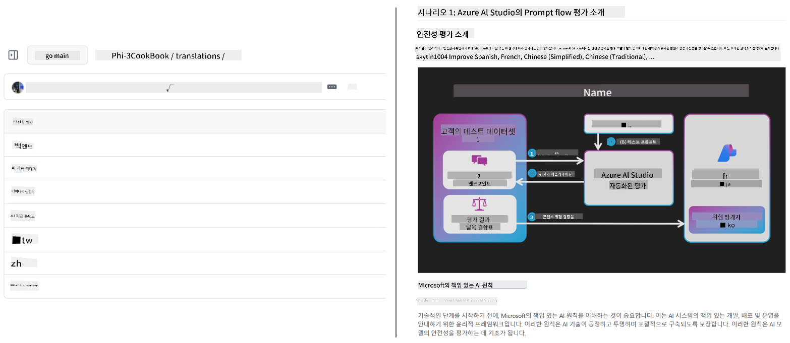

<!--
CO_OP_TRANSLATOR_METADATA:
{
  "original_hash": "044724537b57868117aadae8e7728c7c",
  "translation_date": "2025-06-12T10:08:01+00:00",
  "source_file": "README.md",
  "language_code": "ko"
}
-->


# Co-op Translator: 교육 문서 번역을 손쉽게 자동화하세요

_문서를 여러 언어로 자동 번역하여 전 세계 사용자에게 쉽게 다가가세요._

[](https://pypi.org/project/co-op-translator/)
[](https://github.com/azure/co-op-translator/blob/main/LICENSE)
[](https://pepy.tech/project/co-op-translator)
[](https://pepy.tech/project/co-op-translator)
[](https://github.com/psf/black)

[](https://GitHub.com/azure/co-op-translator/graphs/contributors/)
[](https://GitHub.com/azure/co-op-translator/issues/)
[](https://GitHub.com/azure/co-op-translator/pulls/)
[](http://makeapullrequest.com)

### Co-op Translator가 지원하는 언어
[프랑스어](../fr/README.md) | [스페인어](../es/README.md) | [독일어](../de/README.md) | [러시아어](../ru/README.md) | [아랍어](../ar/README.md) | [페르시아어 (파르시)](../fa/README.md) | [우르두어](../ur/README.md) | [중국어 (간체)](../zh/README.md) | [중국어 (번체, 마카오)](../mo/README.md) | [중국어 (번체, 홍콩)](../hk/README.md) | [중국어 (번체, 대만)](../tw/README.md) | [일본어](../ja/README.md) | [한국어](./README.md) | [힌디어](../hi/README.md) | [벵골어](../bn/README.md) | [마라티어](../mr/README.md) | [네팔어](../ne/README.md) | [펀자브어 (구르무키)](../pa/README.md) | [포르투갈어 (포르투갈)](../pt/README.md) | [포르투갈어 (브라질)](../br/README.md) | [이탈리아어](../it/README.md) | [폴란드어](../pl/README.md) | [터키어](../tr/README.md) | [그리스어](../el/README.md) | [태국어](../th/README.md) | [스웨덴어](../sv/README.md) | [덴마크어](../da/README.md) | [노르웨이어](../no/README.md) | [핀란드어](../fi/README.md) | [네덜란드어](../nl/README.md) | [히브리어](../he/README.md) | [베트남어](../vi/README.md) | [인도네시아어](../id/README.md) | [말레이어](../ms/README.md) | [타갈로그어 (필리핀어)](../tl/README.md) | [스와힐리어](../sw/README.md) | [헝가리어](../hu/README.md) | [체코어](../cs/README.md) | [슬로바키아어](../sk/README.md) | [루마니아어](../ro/README.md) | [불가리아어](../bg/README.md) | [세르비아어 (키릴문자)](../sr/README.md) | [크로아티아어](../hr/README.md) | [슬로베니아어](../sl/README.md) | [우크라이나어](../uk/README.md) | [버마어 (미얀마)](../my/README.md)
> [!NOTE]
> 이 저장소 콘텐츠의 현재 번역본입니다. Co-op Translator가 지원하는 전체 언어 목록은 [Language Support](../..) 섹션을 참조하세요.

[](https://GitHub.com/azure/co-op-translator/watchers/)
[](https://GitHub.com/azure/co-op-translator/network/)
[](https://GitHub.com/azure/co-op-translator/stargazers/)

[](https://discord.com/invite/ByRwuEEgH4)

[](https://codespaces.new/azure/co-op-translator)
[](https://vscode.dev/redirect?url=vscode://ms-vscode-remote.remote-containers/cloneInVolume?url=https://github.com/azure/co-op-translator)

## 개요: 교육 콘텐츠 번역을 간소화하세요

언어 장벽은 전 세계 학습자와 개발자가 소중한 교육 자료와 기술 지식에 접근하는 데 큰 장애물이 됩니다. 이는 참여를 제한하고 글로벌 혁신과 학습 속도를 늦춥니다.

**Co-op Translator**는 Microsoft의 대규모 교육 시리즈(예: "For Beginners" 가이드)에서 비효율적인 수동 번역 과정을 해결할 필요성에서 탄생했습니다. 누구나 쉽게 사용할 수 있는 강력한 도구로 발전하여, 언어 장벽을 허물고 있습니다. CLI와 GitHub Actions를 통한 고품질 자동 번역을 제공함으로써, 전 세계 교육자, 학생, 연구원, 개발자가 언어 제약 없이 지식을 공유하고 접근할 수 있도록 지원합니다.

Co-op Translator가 번역된 교육 콘텐츠를 어떻게 구성하는지 확인해 보세요:



Markdown 파일과 이미지 내 텍스트가 자동으로 번역되어 언어별 폴더에 깔끔하게 정리됩니다.

**지금 바로 Co-op Translator로 교육 콘텐츠의 글로벌 접근성을 열어보세요!**

## Microsoft 학습 자료의 글로벌 접근성 지원

Co-op Translator는 전 세계 개발자 커뮤니티를 위한 주요 Microsoft 교육 프로젝트의 언어 장벽을 해소하고, 리포지토리 번역 과정을 자동화합니다. 현재 Co-op Translator를 사용하는 대표적인 프로젝트는 다음과 같습니다:

[](https://github.com/microsoft/Generative-AI-for-beginners)
[](https://github.com/microsoft/ML-For-Beginners)
[](https://github.com/microsoft/AI-For-Beginners)
[](https://github.com/microsoft/ai-agents-for-beginners)
[](https://github.com/microsoft/PhiCookBook)
[](https://github.com/microsoft/Generative-AI-for-beginners-dotnet)

## 주요 기능

- **자동 번역**: 여러 언어로 손쉽게 텍스트를 번역합니다.
- **GitHub Actions 연동**: CI/CD 파이프라인에 번역 자동화를 통합합니다.
- **Markdown 형식 유지**: 번역 중에도 Markdown 문법을 정확히 보존합니다.
- **이미지 내 텍스트 번역**: 이미지 안의 텍스트를 추출해 번역합니다.
- **최신 LLM 기술 적용**: 최첨단 언어 모델을 사용해 고품질 번역을 제공합니다.
- **간편한 통합**: 기존 프로젝트 환경에 무리 없이 통합할 수 있습니다.
- **현지화 간소화**: 국제 시장을 위한 프로젝트 현지화 과정을 단순화합니다.

## 작동 방식


Co-op Translator는 프로젝트 폴더 내 Markdown 파일과 이미지를 다음과 같이 처리합니다:

1. **텍스트 추출**: Markdown 파일에서 텍스트를 추출하며, 설정된 경우(예: Azure AI Vision) 이미지 내 텍스트도 함께 추출합니다.
1. **AI 번역**: 추출된 텍스트를 설정된 LLM(Azure OpenAI, OpenAI 등)에 보내 번역합니다.
1. **결과 저장**: 번역된 Markdown 파일과 이미지(번역된 텍스트 포함)를 언어별 폴더에 저장하며 원본 형식을 유지합니다.

## 시작하기

CLI를 이용해 빠르게 시작하거나 GitHub Actions로 완전 자동화를 설정하세요. 워크플로우에 맞는 방식을 선택할 수 있습니다:

1. **명령줄(CLI)** - 일회성 번역이나 수동 제어용
2. **GitHub Actions** - 푸시할 때마다 자동 번역 실행

> [!NOTE]
> 이 튜토리얼은 Azure 리소스에 초점을 맞추고 있지만, 지원되는 다른 언어 모델도 사용할 수 있습니다.

### 언어 지원

Co-op Translator는 다양한 언어를 지원하여 글로벌 사용자에게 도달할 수 있도록 돕습니다. 주요 내용은 다음과 같습니다:

#### 빠른 참고

| 언어 | 코드 | 언어 | 코드 | 언어 | 코드 |
|------|------|------|------|------|------|
| Arabic | ar | Bengali | bn | Bulgarian | bg |
| Burmese (Myanmar) | my | Chinese (Simplified) | zh | Chinese (Traditional, HK) | hk |
| Chinese (Traditional, Macau) | mo | Chinese (Traditional, TW) | tw | Croatian | hr |
| Czech | cs | Danish | da | Dutch | nl |
| Finnish | fi | French | fr | German | de |
| Greek | el | Hebrew | he | Hindi | hi |
| Hungarian | hu | Indonesian | id | Italian | it |
| Japanese | ja | Korean | ko | Malay | ms |
| Marathi | mr | Nepali | ne | Norwegian | no |
| Persian (Farsi) | fa | Polish | pl | Portuguese (Brazil) | br |
| Portuguese (Portugal) | pt | Punjabi (Gurmukhi) | pa | Romanian | ro |
| Russian | ru | Serbian (Cyrillic) | sr | Slovak | sk |
| Slovenian | sl | Spanish | es | Swahili | sw |
| Swedish | sv | Tagalog (Filipino) | tl | Thai | th |
| Turkish | tr | Ukrainian | uk | Urdu | ur |
| Vietnamese | vi | — | — | — | — |

#### 언어 코드 사용법

Co-op Translator 사용 시 언어 코드를 지정해야 합니다. 예를 들어:

```bash
# Translate to French, Spanish, and German
translate -l "fr es de"

# Translate to Chinese (Simplified) and Japanese
translate -l "zh ja"
```

> [!NOTE]
> 언어 지원 관련 상세 기술 정보(글꼴 사양, 알려진 문제, 새 언어 추가 방법 등)는 [Supported Languages Documentation](./getting_started/supported-languages.md)을 참조하세요.

### 지원 모델 및 서비스

| 유형                  | 이름                           |
|-----------------------|--------------------------------|
| Language Model        |   |
| AI Vision       |  |

> [!NOTE]
> AI Vision 서비스가 없으면 co-op translator는 자동으로 [Markdown-only mode](./getting_started/markdown-only-mode.md)로 전환됩니다.

### 초기 설정

시작 전에 다음 리소스를 준비하세요:

1. 언어 모델 리소스 (필수):
   - Azure OpenAI (권장) - 엔터프라이즈급 안정성과 고품질 번역 제공
   - OpenAI - Azure 접근 권한이 없을 때 대안으로 사용 가능
   - 지원 모델 상세 내용은 [Supported Models and Services](../..) 참고

1. AI Vision 리소스 (선택):
   - Azure AI Vision - 이미지 내 텍스트 번역 지원
   - 미설정 시 번역기는 자동으로 [Markdown-only mode](./getting_started/markdown-only-mode.md) 사용
   - 이미지에 텍스트가 포함된 프로젝트에 권장

1. 구성 단계:
   - 자세한 안내는 [Azure AI 설정 가이드](./getting_started/set-up-azure-ai.md) 참조
   - API 키와 엔드포인트 정보를 담은 `.env` 파일 생성 (자세한 내용은 [Quick Start](../..) 섹션)
   - 필요한 권한과 할당량 확보

### 번역 전 프로젝트 준비

번역 작업을 시작하기 전에 다음을 준비하세요:

1. README 준비:
   - 번역본 링크를 위한 번역 테이블 추가
   - 예시 형식:

     ```markdown

     ### 🌐 Multi-Language Support
     
     [French](../fr/README.md) | [Spanish](../es/README.md) | [German](../de/README.md) | [Russian](../ru/README.md) | [Arabic](../ar/README.md) | [Persian (Farsi)](../fa/README.md) | [Urdu](../ur/README.md) | [Chinese (Simplified)](../zh/README.md) | [Chinese (Traditional, Macau)](../mo/README.md) | [Chinese (Traditional, Hong Kong)](../hk/README.md) | [Chinese (Traditional, Taiwan)](../tw/README.md) | [Japanese](../ja/README.md) | [Korean](./README.md) | [Hindi](../hi/README.md) | [Bengali](../bn/README.md) | [Marathi](../mr/README.md) | [Nepali](../ne/README.md) | [Punjabi (Gurmukhi)](../pa/README.md) | [Portuguese (Portugal)](../pt/README.md) | [Portuguese (Brazil)](../br/README.md) | [Italian](../it/README.md) | [Polish](../pl/README.md) | [Turkish](../tr/README.md) | [Greek](../el/README.md) | [Thai](../th/README.md) | [Swedish](../sv/README.md) | [Danish](../da/README.md) | [Norwegian](../no/README.md) | [Finnish](../fi/README.md) | [Dutch](../nl/README.md) | [Hebrew](../he/README.md) | [Vietnamese](../vi/README.md) | [Indonesian](../id/README.md) | [Malay](../ms/README.md) | [Tagalog (Filipino)](../tl/README.md) | [Swahili](../sw/README.md) | [Hungarian](../hu/README.md) | [Czech](../cs/README.md) | [Slovak](../sk/README.md) | [Romanian](../ro/README.md) | [Bulgarian](../bg/README.md) | [Serbian (Cyrillic)](../sr/README.md) | [Croatian](../hr/README.md) | [Slovenian](../sl/README.md) | [Ukrainian](../uk/README.md) | [Burmese (Myanmar)](../my/README.md) 
    
     ```

1. 기존 번역물 정리 (필요 시):
   - 기존 번역 폴더(예: `translations/`) 삭제
   - 이전 번역 파일 모두 제거
   - 새 번역 과정과 충돌 방지

### 빠른 시작: 명령줄

명령줄을 이용해 빠르게 시작하는 방법:

1. 가상 환경 생성:

    ```bash
    python -m venv .venv
    ```

1. 가상 환경 활성화:

    - Windows:

    ```bash
    .venv\scripts\activate
    ```

    - Linux/macOS:

    ```bash
    source .venv/bin/activate
    ```

1. 패키지 설치:

    ```bash
    pip install co-op-translator
    ```

1. 자격 증명 구성:

    - `.env` file in your project's root directory.
    - Copy the contents from the [.env.template](../../.env.template) file into your new `.env` file.
    - Fill in the required API keys and endpoint information in your `.env` file.

1. Run Translation:
    - Navigate to your project's root directory in your terminal.
    - Execute the translate command, specifying target languages with the `-l` 플래그 생성:

    ```bash
    translate -l "ko ja fr"
    ```

    _(예시) `"ko ja fr"` with your desired space-separated language codes)_

### Detailed Usage Guides

Choose the approach that best fits your workflow:

#### 1. Using the Command Line (CLI)

- Best for: One-time translations, manual control, or integration into custom scripts.
- Requires: Local installation of Python and the `co-op-translator` package.
- Guide: [Command Line Guide](./getting_started/command-line-guide/command-line-guide.md)

#### 2. Using GitHub Actions (Automation)

- Best for: Automatically translating content whenever changes are pushed to your repository. Keeps translations consistently up-to-date.
- Requires: Setting up a workflow file (`.github/workflows`) 리포지토리 내에 위치. 로컬 설치 불필요.
- 가이드:
  - [GitHub Actions 가이드 (공개 리포지토리 및 표준 시크릿)](./getting_started/github-actions-guide/github-actions-guide-public.md) - 대부분 공개 또는 개인 리포지토리에 권장.
  - [GitHub Actions 가이드 (Microsoft 조직 리포지토리 및 조직 단위 설정)](./getting_started/github-actions-guide/github-actions-guide-org.md) - Microsoft GitHub 조직 내 작업 또는 조직 단위 시크릿/러너 활용 시 사용.

### 문제 해결 및 팁

- [문제 해결 가이드](./getting_started/troubleshooting.md)

### 추가 자료

- [명령어 참조](./getting_started/command-reference.md): 모든 명령어와 옵션 상세 설명.
- [지원 언어](./getting_started/supported-languages.md): 지원 언어 목록과 추가 방법 안내.
- [Markdown-Only 모드](./getting_started/markdown-only-mode.md): 이미지 번역 없이 텍스트만 번역하는 방법.

## 동영상 발표

Co-op Translator에 대해 더 알고 싶다면 발표 영상을 확인하세요 _(아래 이미지를 클릭하면 YouTube에서 시청 가능합니다.)_:

- **Open at Microsoft**: 18분 분량의 간단한 소개와 Co-op Translator 사용법 빠른 안내.
[](https://www.youtube.com/watch?v=jX_swfH_KNU)

## 저희를 지원하고 글로벌 학습을 촉진하세요

교육 콘텐츠가 전 세계적으로 공유되는 방식을 혁신하는 데 동참해 주세요! [Co-op Translator](https://github.com/azure/co-op-translator)에 GitHub에서 ⭐를 눌러 주시고, 학습과 기술의 언어 장벽을 허무는 우리의 사명을 응원해 주세요. 여러분의 관심과 기여가 큰 변화를 만듭니다! 코드 기여와 기능 제안은 언제나 환영합니다.

## 기여하기

이 프로젝트는 기여와 제안을 환영합니다. Azure Co-op Translator에 기여하고 싶으신가요? Co-op Translator를 더 쉽게 사용할 수 있도록 돕는 방법은 [CONTRIBUTING.md](./CONTRIBUTING.md)를 참고해 주세요.

## 기여자

[](https://github.com/Azure/co-op-translator/graphs/contributors)

## 행동 강령

이 프로젝트는 [Microsoft Open Source Code of Conduct](https://opensource.microsoft.com/codeofconduct/)를 채택하고 있습니다.  
자세한 내용은 [Code of Conduct FAQ](https://opensource.microsoft.com/codeofconduct/faq/)를 참고하시거나,  
추가 질문이나 의견이 있으시면 [opencode@microsoft.com](mailto:opencode@microsoft.com)으로 연락해 주세요.

## 책임 있는 AI

Microsoft는 고객이 AI 제품을 책임감 있게 사용할 수 있도록 지원하며, 학습 내용을 공유하고 투명성 노트와 영향 평가 같은 도구를 통해 신뢰 기반의 파트너십을 구축하는 데 힘쓰고 있습니다. 이러한 자료는 [https://aka.ms/RAI](https://aka.ms/RAI)에서 확인할 수 있습니다.  
Microsoft의 책임 있는 AI 접근법은 공정성, 신뢰성 및 안전성, 프라이버시 및 보안, 포용성, 투명성, 책임성을 AI 원칙으로 삼고 있습니다.

이 샘플에 사용된 것과 같은 대규모 자연어, 이미지, 음성 모델은 때때로 불공정하거나 신뢰할 수 없거나 불쾌감을 줄 수 있는 방식으로 작동할 수 있어 피해를 초래할 수 있습니다. 위험과 한계에 대해 자세히 알고 싶다면 [Azure OpenAI 서비스 투명성 노트](https://learn.microsoft.com/legal/cognitive-services/openai/transparency-note?tabs=text)를 참고하세요.

이러한 위험을 완화하기 위한 권장 방법은 아키텍처에 해로운 행동을 탐지하고 차단할 수 있는 안전 시스템을 포함하는 것입니다. [Azure AI Content Safety](https://learn.microsoft.com/azure/ai-services/content-safety/overview)는 독립적인 보호 계층을 제공하여 애플리케이션과 서비스 내에서 사용자 생성 및 AI 생성 유해 콘텐츠를 탐지할 수 있습니다. Azure AI Content Safety에는 유해한 텍스트와 이미지를 감지할 수 있는 API가 포함되어 있습니다. 또한 다양한 형태의 유해 콘텐츠를 탐지하는 샘플 코드를 보고, 탐색하고, 직접 사용해 볼 수 있는 인터랙티브한 Content Safety Studio도 제공합니다. 다음 [빠른 시작 문서](https://learn.microsoft.com/azure/ai-services/content-safety/quickstart-text?tabs=visual-studio%2Clinux&pivots=programming-language-rest)는 서비스에 요청을 보내는 방법을 안내합니다.

또한 전체 애플리케이션 성능을 고려하는 것도 중요합니다. 다중 모달 및 다중 모델 애플리케이션에서는 시스템이 사용자가 기대하는 대로 작동하고, 유해한 출력을 생성하지 않는 것을 성능의 기준으로 봅니다. 전체 애플리케이션 성능을 평가할 때는 [생성 품질 및 위험과 안전 지표](https://learn.microsoft.com/azure/ai-studio/concepts/evaluation-metrics-built-in)를 활용하는 것이 중요합니다.

개발 환경에서 AI 애플리케이션을 평가하려면 [prompt flow SDK](https://microsoft.github.io/promptflow/index.html)를 사용할 수 있습니다. 테스트 데이터셋이나 목표값을 바탕으로, 생성형 AI 애플리케이션의 결과물을 내장 평가자 또는 사용자가 선택한 맞춤 평가자로 정량적으로 측정할 수 있습니다. prompt flow sdk를 활용해 시스템을 평가하는 방법은 [빠른 시작 가이드](https://learn.microsoft.com/azure/ai-studio/how-to/develop/flow-evaluate-sdk)를 참고하세요. 평가 실행 후에는 [Azure AI Studio에서 결과를 시각화](https://learn.microsoft.com/azure/ai-studio/how-to/evaluate-flow-results)할 수 있습니다.

## 상표

이 프로젝트에는 프로젝트, 제품 또는 서비스의 상표나 로고가 포함될 수 있습니다. Microsoft 상표 또는 로고의 권한 있는 사용은 [Microsoft의 상표 및 브랜드 가이드라인](https://www.microsoft.com/en-us/legal/intellectualproperty/trademarks/usage/general)을 준수해야 합니다.  
이 프로젝트의 수정된 버전에서 Microsoft 상표 또는 로고를 사용할 경우 혼동을 일으키거나 Microsoft의 후원을 암시해서는 안 됩니다.  
서드파티 상표나 로고의 사용은 해당 서드파티의 정책을 따릅니다.

**면책 조항**:  
이 문서는 AI 번역 서비스 [Co-op Translator](https://github.com/Azure/co-op-translator)를 사용하여 번역되었습니다. 정확성을 위해 최선을 다하고 있으나, 자동 번역은 오류나 부정확한 부분이 있을 수 있음을 유의하시기 바랍니다. 원본 문서의 원어가 권위 있는 출처로 간주되어야 합니다. 중요한 정보의 경우, 전문적인 인간 번역을 권장합니다. 본 번역 사용으로 인한 오해나 잘못된 해석에 대해 당사는 책임을 지지 않습니다.