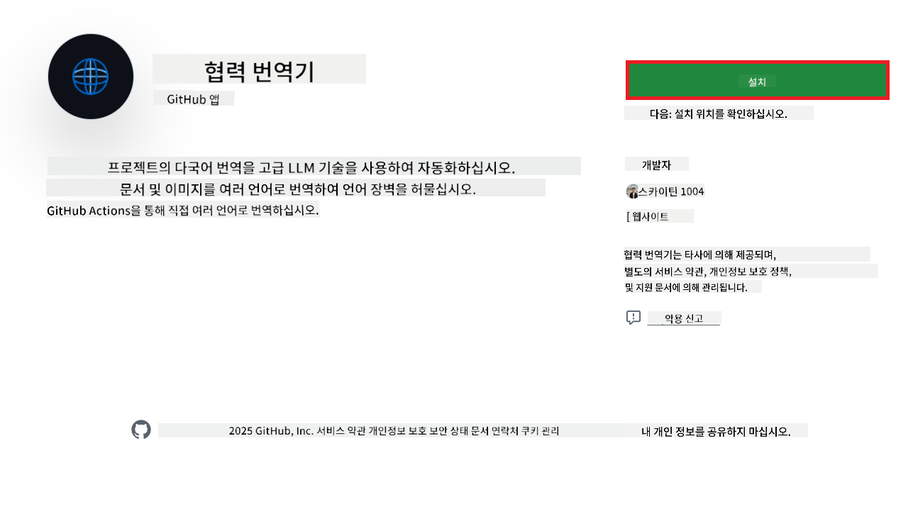
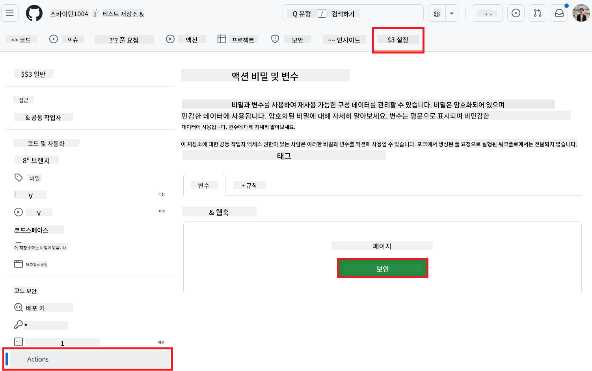
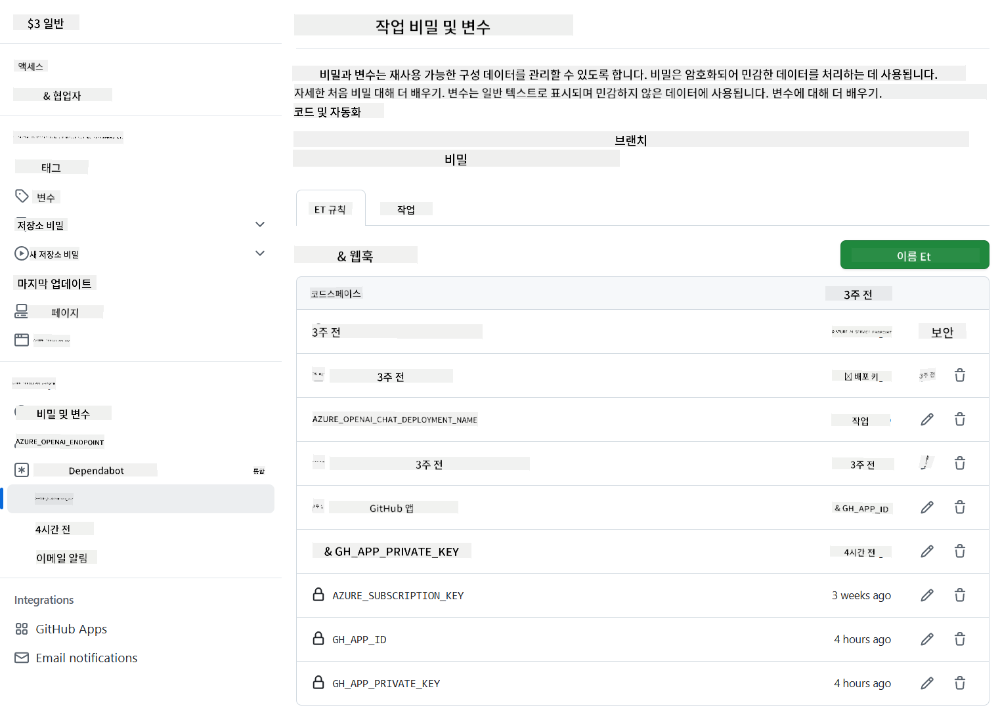

<!--
CO_OP_TRANSLATOR_METADATA:
{
  "original_hash": "c437820027c197f25fb2cbee95bae28c",
  "translation_date": "2025-06-12T19:05:13+00:00",
  "source_file": "getting_started/github-actions-guide/github-actions-guide-org.md",
  "language_code": "ko"
}
-->
# Co-op Translator GitHub Action 사용법 (조직 가이드)

**대상:** 이 가이드는 **Microsoft 내부 사용자** 또는 **사전 구성된 Co-op Translator GitHub App에 필요한 자격 증명에 접근 권한이 있거나 직접 맞춤형 GitHub App을 만들 수 있는 팀**을 위한 것입니다.

Co-op Translator GitHub Action을 사용하여 저장소 문서 번역을 손쉽게 자동화하세요. 이 가이드는 원본 Markdown 파일이나 이미지가 변경될 때마다 자동으로 번역이 업데이트된 풀 리퀘스트를 생성하도록 액션을 설정하는 방법을 안내합니다.

> [!IMPORTANT]
> 
> **적합한 가이드 선택하기:**
>
> 이 가이드는 **GitHub App ID와 개인 키**를 사용하는 설정 방법을 설명합니다. 보통 다음과 같은 경우에 이 "조직 가이드" 방식을 사용해야 합니다: **`GITHUB_TOKEN` 권한이 제한된 경우:** 조직 또는 저장소 설정이 기본 `GITHUB_TOKEN`에 부여된 권한을 제한하는 경우입니다. 특히 `GITHUB_TOKEN`가 필요한 `write` 권한(예: `contents: write` 또는 `pull-requests: write`)을 허용하지 않으면, [공개 설정 가이드](./github-actions-guide-public.md)의 워크플로가 권한 부족으로 실패합니다. 명시적으로 권한이 부여된 전용 GitHub App을 사용하면 이 제한을 우회할 수 있습니다.
>
> **위 조건에 해당하지 않는 경우:**
>
> 표준 `GITHUB_TOKEN`가 저장소에서 충분한 권한을 가지고 있다면(즉, 조직 제한에 막히지 않는다면), **[GITHUB_TOKEN을 사용하는 공개 설정 가이드](./github-actions-guide-public.md)**를 사용하세요. 공개 가이드는 App ID나 개인 키를 얻거나 관리할 필요 없이 표준 `GITHUB_TOKEN`와 저장소 권한만으로 작동합니다.

## 사전 준비 사항

GitHub Action을 설정하기 전에 필요한 AI 서비스 자격 증명을 준비하세요.

**1. 필수: AI 언어 모델 자격 증명**  
지원되는 언어 모델 중 최소 하나의 자격 증명이 필요합니다:

- **Azure OpenAI**: Endpoint, API Key, 모델/배포 이름, API 버전 필요  
- **OpenAI**: API Key, (선택 사항: 조직 ID, 기본 URL, 모델 ID)  
- 자세한 내용은 [지원 모델 및 서비스](../../../../README.md) 참고  
- 설정 가이드: [Azure OpenAI 설정](../set-up-resources/set-up-azure-openai.md)

**2. 선택 사항: 컴퓨터 비전 자격 증명 (이미지 번역용)**

- 이미지 내 텍스트 번역이 필요할 때만  
- **Azure Computer Vision**: Endpoint와 구독 키 필요  
- 제공하지 않으면 액션은 [Markdown 전용 모드](../markdown-only-mode.md)로 동작  
- 설정 가이드: [Azure Computer Vision 설정](../set-up-resources/set-up-azure-computer-vision.md)

## 설정 및 구성

저장소에서 Co-op Translator GitHub Action을 설정하려면 다음 단계를 따르세요:

### 1단계: GitHub App 인증 설치 및 구성

워크플로는 GitHub App 인증을 사용하여 저장소와 안전하게 상호작용합니다(예: 풀 리퀘스트 생성). 아래 옵션 중 하나를 선택하세요:

#### **옵션 A: 사전 구축된 Co-op Translator GitHub App 설치 (Microsoft 내부용)**

1. [Co-op Translator GitHub App](https://github.com/apps/co-op-translator) 페이지로 이동하세요.

1. **설치**를 선택하고 대상 저장소가 속한 계정 또는 조직을 선택하세요.

    

1. **저장소만 선택**을 선택하고 대상 저장소(예: `PhiCookBook`)를 선택한 후 **설치**를 클릭하세요. 인증을 요구할 수 있습니다.

    

1. **앱 자격 증명 확보 (내부 절차 필요):** 워크플로가 앱으로 인증하려면 Co-op Translator 팀에서 제공하는 두 가지 정보가 필요합니다:  
  - **앱 ID:** Co-op Translator 앱의 고유 식별자. 앱 ID는 `1164076`입니다.  
  - **개인 키:** 유지 관리자 연락처로부터 `.pem` 개인 키 파일의 **전체 내용**을 받아야 합니다. **이 키는 비밀번호처럼 안전하게 보관하세요.**

1. 2단계로 진행하세요.

#### **옵션 B: 자체 맞춤형 GitHub App 사용**

- 원한다면 직접 GitHub App을 만들어 구성할 수 있습니다. Contents 및 Pull requests에 대한 읽기/쓰기 권한이 있어야 하며, 앱 ID와 생성된 개인 키가 필요합니다.

### 2단계: 저장소 시크릿 구성

GitHub App 자격 증명과 AI 서비스 자격 증명을 저장소 설정의 암호화된 시크릿으로 추가해야 합니다.

1. 대상 GitHub 저장소(예: `PhiCookBook`)로 이동하세요.

1. **Settings** > **Secrets and variables** > **Actions**로 이동하세요.

1. **Repository secrets** 아래에서 아래 나열된 각 시크릿에 대해 **New repository secret**을 클릭하세요.

   

**필수 시크릿 (GitHub App 인증용):**

| 시크릿 이름          | 설명                                       | 값 출처                                |
| :------------------- | :----------------------------------------- | :------------------------------------ |
| `GH_APP_ID`          | GitHub App의 앱 ID (1단계에서 확인)          | GitHub App 설정                       |
| `GH_APP_PRIVATE_KEY` | 다운로드한 `.pem` 파일의 **전체 내용** | `.pem` 파일 (1단계에서)   |

**AI 서비스 시크릿 (사전 준비 사항에 따라 모두 추가):**

| 시크릿 이름                         | 설명                                 | 값 출처                           |
| :---------------------------------- | :----------------------------------- | :------------------------------- |
| `AZURE_SUBSCRIPTION_KEY`            | Azure AI 서비스 (컴퓨터 비전) 키          | Azure AI Foundry                 |
| `AZURE_AI_SERVICE_ENDPOINT`         | Azure AI 서비스 (컴퓨터 비전) 엔드포인트    | Azure AI Foundry                 |
| `AZURE_OPENAI_API_KEY`              | Azure OpenAI 서비스 키                  | Azure AI Foundry                 |
| `AZURE_OPENAI_ENDPOINT`             | Azure OpenAI 서비스 엔드포인트            | Azure AI Foundry                 |
| `AZURE_OPENAI_MODEL_NAME`           | Azure OpenAI 모델 이름                   | Azure AI Foundry                 |
| `AZURE_OPENAI_CHAT_DEPLOYMENT_NAME` | Azure OpenAI 배포 이름                   | Azure AI Foundry                 |
| `AZURE_OPENAI_API_VERSION`          | Azure OpenAI API 버전                    | Azure AI Foundry                 |
| `OPENAI_API_KEY`                    | OpenAI API 키                          | OpenAI Platform                 |
| `OPENAI_ORG_ID`                     | OpenAI 조직 ID                        | OpenAI Platform                 |
| `OPENAI_CHAT_MODEL_ID`              | 특정 OpenAI 모델 ID                    | OpenAI Platform                 |
| `OPENAI_BASE_URL`                   | 맞춤형 OpenAI API 기본 URL             | OpenAI Platform                 |



### 3단계: 워크플로 파일 생성

마지막으로 자동화 워크플로를 정의하는 YAML 파일을 만듭니다.

1. 저장소 루트 디렉터리에 `.github/workflows/` 폴더가 없으면 생성하세요.

1. `.github/workflows/` 안에 `co-op-translator.yml` 파일을 만드세요.

1. 다음 내용을 co-op-translator.yml에 붙여넣으세요.

```
name: Co-op Translator

on:
  push:
    branches:
      - main

jobs:
  co-op-translator:
    runs-on: ubuntu-latest

    permissions:
      contents: write
      pull-requests: write

    steps:
      - name: Checkout repository
        uses: actions/checkout@v4
        with:
          fetch-depth: 0

      - name: Set up Python
        uses: actions/setup-python@v4
        with:
          python-version: '3.10'

      - name: Install Co-op Translator
        run: |
          python -m pip install --upgrade pip
          pip install co-op-translator

      - name: Run Co-op Translator
        env:
          PYTHONIOENCODING: utf-8
          # Azure AI Service Credentials
          AZURE_SUBSCRIPTION_KEY: ${{ secrets.AZURE_SUBSCRIPTION_KEY }}
          AZURE_AI_SERVICE_ENDPOINT: ${{ secrets.AZURE_AI_SERVICE_ENDPOINT }}

          # Azure OpenAI Credentials
          AZURE_OPENAI_API_KEY: ${{ secrets.AZURE_OPENAI_API_KEY }}
          AZURE_OPENAI_ENDPOINT: ${{ secrets.AZURE_OPENAI_ENDPOINT }}
          AZURE_OPENAI_MODEL_NAME: ${{ secrets.AZURE_OPENAI_MODEL_NAME }}
          AZURE_OPENAI_CHAT_DEPLOYMENT_NAME: ${{ secrets.AZURE_OPENAI_CHAT_DEPLOYMENT_NAME }}
          AZURE_OPENAI_API_VERSION: ${{ secrets.AZURE_OPENAI_API_VERSION }}

          # OpenAI Credentials
          OPENAI_API_KEY: ${{ secrets.OPENAI_API_KEY }}
          OPENAI_ORG_ID: ${{ secrets.OPENAI_ORG_ID }}
          OPENAI_CHAT_MODEL_ID: ${{ secrets.OPENAI_CHAT_MODEL_ID }}
          OPENAI_BASE_URL: ${{ secrets.OPENAI_BASE_URL }}
        run: |
          # =====================================================================
          # IMPORTANT: Set your target languages here (REQUIRED CONFIGURATION)
          # =====================================================================
          # Example: Translate to Spanish, French, German. Add -y to auto-confirm.
          translate -l "es fr de" -y  # <--- MODIFY THIS LINE with your desired languages

      - name: Authenticate GitHub App
        id: generate_token
        uses: tibdex/github-app-token@v1
        with:
          app_id: ${{ secrets.GH_APP_ID }}
          private_key: ${{ secrets.GH_APP_PRIVATE_KEY }}

      - name: Create Pull Request with translations
        uses: peter-evans/create-pull-request@v5
        with:
          token: ${{ steps.generate_token.outputs.token }}
          commit-message: "🌐 Update translations via Co-op Translator"
          title: "🌐 Update translations via Co-op Translator"
          body: |
            This PR updates translations for recent changes to the main branch.

            ### 📋 Changes included
            - Translated contents are available in the `translations/` directory
            - Translated images are available in the `translated_images/` directory

            ---
            🌐 Automatically generated by the [Co-op Translator](https://github.com/Azure/co-op-translator) GitHub Action.
          branch: update-translations
          base: main
          labels: translation, automated-pr
          delete-branch: true
          add-paths: |
            translations/
            translated_images/

```

4. **워크플로 맞춤화:**  
  - **[!IMPORTANT] 대상 언어:** `Run Co-op Translator` step, you **MUST review and modify the list of language codes** within the `translate -l "..." -y` command to match your project's requirements. The example list (`ar de es...`) needs to be replaced or adjusted.
  - **Trigger (`on:`):** The current trigger runs on every push to `main`. For large repositories, consider adding a `paths:` filter (see commented example in the YAML) to run the workflow only when relevant files (e.g., source documentation) change, saving runner minutes.
  - **PR Details:** Customize the `commit-message`, `title`, `body`, `branch` name, and `labels` in the `Create Pull Request` step if needed.

## Credential Management and Renewal

- **Security:** Always store sensitive credentials (API keys, private keys) as GitHub Actions secrets. Never expose them in your workflow file or repository code.
- **[!IMPORTANT] Key Renewal (Internal Microsoft Users):** Be aware that Azure OpenAI key used within Microsoft might have a mandatory renewal policy (e.g., every 5 months). Ensure you update the corresponding GitHub secrets (`AZURE_OPENAI_...` 키에서 **만료 전에** 대상 언어 목록을 조정하여 워크플로 오류를 방지하세요.

## 워크플로 실행

`co-op-translator.yml` 파일이 메인 브랜치(또는 `on:` trigger), the workflow will automatically run whenever changes are pushed to that branch (and match the `paths` 필터에 지정된 브랜치)에 병합되면,

번역이 생성되거나 업데이트될 때마다 액션이 자동으로 변경 사항을 포함한 풀 리퀘스트를 만들어 검토 및 병합할 수 있도록 준비합니다.

**면책 조항**:  
이 문서는 AI 번역 서비스 [Co-op Translator](https://github.com/Azure/co-op-translator)를 사용하여 번역되었습니다. 정확성을 위해 노력하고 있으나, 자동 번역에는 오류나 부정확성이 포함될 수 있음을 유의하시기 바랍니다. 원본 문서의 원어 버전이 권위 있는 출처로 간주되어야 합니다. 중요한 정보의 경우, 전문적인 인간 번역을 권장합니다. 본 번역 사용으로 인해 발생하는 오해나 잘못된 해석에 대해 당사는 책임을 지지 않습니다.