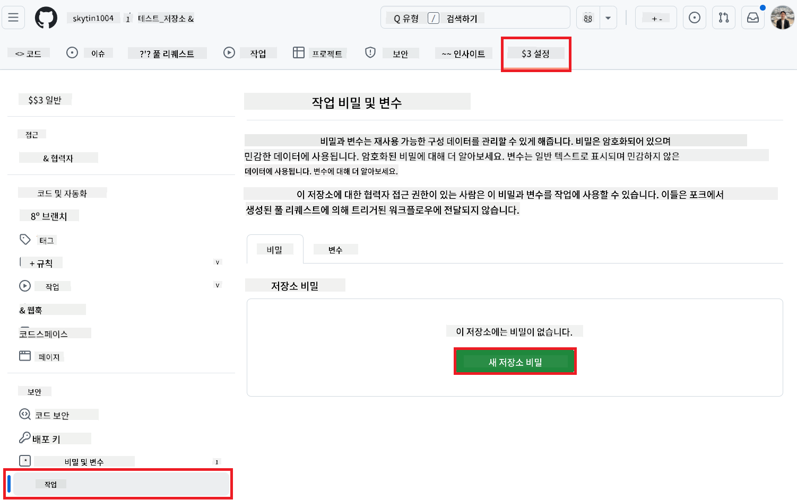

<!--
CO_OP_TRANSLATOR_METADATA:
{
  "original_hash": "c437820027c197f25fb2cbee95bae28c",
  "translation_date": "2025-07-03T07:12:36+00:00",
  "source_file": "getting_started/github-actions-guide/github-actions-guide-org.md",
  "language_code": "ko"
}
-->
# Co-op Translator GitHub Action 사용하기 (조직 가이드)

**대상 독자:** 이 가이드는 **Microsoft 내부 사용자** 또는 **사전 구축된 Co-op Translator GitHub App에 필요한 자격 증명에 접근할 수 있는 팀** 또는 자체 GitHub App을 생성할 수 있는 팀을 대상으로 합니다.

Co-op Translator GitHub Action을 사용하여 저장소의 문서 번역을 자동화하세요. 이 가이드는 소스 Markdown 파일이나 이미지가 변경될 때마다 업데이트된 번역으로 자동으로 풀 리퀘스트를 생성하는 액션 설정 방법을 안내합니다.

> [!IMPORTANT]
> 
> **올바른 가이드 선택:**
>
> 이 가이드는 **GitHub App ID와 개인 키**를 사용한 설정을 설명합니다. 다음과 같은 경우 "조직 가이드" 방법이 필요합니다: **`GITHUB_TOKEN` 권한이 제한된 경우:** 조직 또는 저장소 설정이 표준 `GITHUB_TOKEN`에 부여된 기본 권한을 제한하는 경우. 특히, `GITHUB_TOKEN`이 필요한 `write` 권한(예: `contents: write` 또는 `pull-requests: write`)을 허용하지 않는 경우, [공개 설정 가이드](./github-actions-guide-public.md)의 워크플로우는 권한 부족으로 실패합니다. 명시적으로 부여된 권한을 가진 전용 GitHub App을 사용하면 이 제한을 우회할 수 있습니다.
>
> **위의 사항이 해당되지 않는 경우:**
>
> 표준 `GITHUB_TOKEN`이 저장소에서 충분한 권한을 가지고 있는 경우(즉, 조직 제한에 의해 차단되지 않는 경우), **[GITHUB_TOKEN을 사용하는 공개 설정 가이드](./github-actions-guide-public.md)**를 사용하세요. 공개 가이드는 App ID나 개인 키를 얻거나 관리할 필요가 없으며, 표준 `GITHUB_TOKEN`과 저장소 권한만을 사용합니다.

## 사전 준비

GitHub Action을 구성하기 전에 필요한 AI 서비스 자격 증명을 준비하세요.

**1. 필수: AI 언어 모델 자격 증명**
지원되는 언어 모델에 대한 자격 증명이 필요합니다:

- **Azure OpenAI**: Endpoint, API Key, 모델/배포 이름, API 버전이 필요합니다.
- **OpenAI**: API Key가 필요합니다. (선택 사항: Org ID, Base URL, 모델 ID)
- 자세한 내용은 [지원되는 모델 및 서비스](../../../../README.md)를 참조하세요.
- 설정 가이드: [Azure OpenAI 설정](../set-up-resources/set-up-azure-openai.md).

**2. 선택 사항: 컴퓨터 비전 자격 증명 (이미지 번역용)**

- 이미지 내 텍스트를 번역해야 하는 경우에만 필요합니다.
- **Azure Computer Vision**: Endpoint와 Subscription Key가 필요합니다.
- 제공되지 않으면, 액션은 [Markdown 전용 모드](../markdown-only-mode.md)로 기본 설정됩니다.
- 설정 가이드: [Azure Computer Vision 설정](../set-up-resources/set-up-azure-computer-vision.md).

## 설정 및 구성

저장소에서 Co-op Translator GitHub Action을 구성하려면 다음 단계를 따르세요:

### 1단계: GitHub App 인증 설치 및 구성

워크플로우는 GitHub App 인증을 사용하여 저장소와 안전하게 상호작용합니다(예: 풀 리퀘스트 생성). 다음 옵션 중 하나를 선택하세요:

#### **옵션 A: 사전 구축된 Co-op Translator GitHub App 설치 (Microsoft 내부 사용)**

1. [Co-op Translator GitHub App](https://github.com/apps/co-op-translator) 페이지로 이동합니다.

1. **설치**를 선택하고 대상 저장소가 있는 계정 또는 조직을 선택합니다.

    

1. **선택한 저장소만**을 선택하고 대상 저장소(예: `PhiCookBook`)를 선택합니다. **설치**를 클릭합니다. 인증을 요청받을 수 있습니다.

    

1. **앱 자격 증명 획득 (내부 프로세스 필요):** 워크플로우가 앱으로 인증할 수 있도록 Co-op Translator 팀에서 제공하는 두 가지 정보를 얻어야 합니다:
  - **App ID:** Co-op Translator 앱의 고유 식별자입니다. App ID는: `1164076`입니다.
  - **개인 키:** 유지보수 담당자에게서 `.pem` 개인 키 파일의 **전체 내용**을 얻어야 합니다. **이 키를 비밀번호처럼 취급하고 안전하게 보관하세요.**

1. 2단계로 진행합니다.

#### **옵션 B: 자체 GitHub App 사용**

- 원한다면, 자체 GitHub App을 생성하고 구성할 수 있습니다. 콘텐츠 및 풀 리퀘스트에 대한 읽기 및 쓰기 권한이 있어야 합니다. App ID와 생성된 개인 키가 필요합니다.

### 2단계: 저장소 비밀 구성

GitHub App 자격 증명과 AI 서비스 자격 증명을 저장소 설정에서 암호화된 비밀로 추가해야 합니다.

1. 대상 GitHub 저장소(예: `PhiCookBook`)로 이동합니다.

1. **설정** > **비밀 및 변수** > **액션**으로 이동합니다.

1. **저장소 비밀** 아래에서 아래 나열된 각 비밀에 대해 **새 저장소 비밀**을 클릭합니다.

   

**필수 비밀 (GitHub App 인증용):**

| 비밀 이름          | 설명                                      | 값 출처                                     |
| :------------------- | :----------------------------------------------- | :----------------------------------------------- |
| `GH_APP_ID`          | GitHub App의 App ID (1단계에서).      | GitHub App 설정                              |
| `GH_APP_PRIVATE_KEY` | 다운로드한 `.pem` 파일의 **전체 내용**. | `.pem` 파일 (1단계에서)                      |

**AI 서비스 비밀 (사전 준비에 따라 적용되는 모든 항목 추가):**

| 비밀 이름                         | 설명                               | 값 출처                     |
| :---------------------------------- | :---------------------------------------- | :------------------------------- |
| `AZURE_SUBSCRIPTION_KEY`            | Azure AI 서비스 (컴퓨터 비전) 키  | Azure AI Foundry                    |
| `AZURE_AI_SERVICE_ENDPOINT`         | Azure AI 서비스 (컴퓨터 비전) 엔드포인트 | Azure AI Foundry                     |
| `AZURE_OPENAI_API_KEY`              | Azure OpenAI 서비스 키              | Azure AI Foundry                     |
| `AZURE_OPENAI_ENDPOINT`             | Azure OpenAI 서비스 엔드포인트         | Azure AI Foundry                     |
| `AZURE_OPENAI_MODEL_NAME`           | Azure OpenAI 모델 이름              | Azure AI Foundry                     |
| `AZURE_OPENAI_CHAT_DEPLOYMENT_NAME` | Azure OpenAI 배포 이름         | Azure AI Foundry                     |
| `AZURE_OPENAI_API_VERSION`          | Azure OpenAI API 버전              | Azure AI Foundry                     |
| `OPENAI_API_KEY`                    | OpenAI API 키                        | OpenAI Platform                  |
| `OPENAI_ORG_ID`                     | OpenAI 조직 ID                    | OpenAI Platform                  |
| `OPENAI_CHAT_MODEL_ID`              | 특정 OpenAI 모델 ID                  | OpenAI Platform                    |
| `OPENAI_BASE_URL`                   | 사용자 정의 OpenAI API 기본 URL                | OpenAI Platform                    |


### 3단계: 워크플로우 파일 생성

마지막으로, 자동화된 워크플로우를 정의하는 YAML 파일을 생성합니다.

1. 저장소의 루트 디렉토리에 `.github/workflows/` 디렉토리를 생성합니다(존재하지 않는 경우).

1. `.github/workflows/` 안에 `co-op-translator.yml`이라는 파일을 생성합니다.

1. 다음 내용을 co-op-translator.yml에 붙여넣습니다.

```
name: Co-op Translator

on:
  push:
    branches:
      - main

jobs:
  co-op-translator:
    runs-on: ubuntu-latest

    permissions:
      contents: write
      pull-requests: write

    steps:
      - name: Checkout repository
        uses: actions/checkout@v4
        with:
          fetch-depth: 0

      - name: Set up Python
        uses: actions/setup-python@v4
        with:
          python-version: '3.10'

      - name: Install Co-op Translator
        run: |
          python -m pip install --upgrade pip
          pip install co-op-translator

      - name: Run Co-op Translator
        env:
          PYTHONIOENCODING: utf-8
          # Azure AI Service Credentials
          AZURE_SUBSCRIPTION_KEY: ${{ secrets.AZURE_SUBSCRIPTION_KEY }}
          AZURE_AI_SERVICE_ENDPOINT: ${{ secrets.AZURE_AI_SERVICE_ENDPOINT }}

          # Azure OpenAI Credentials
          AZURE_OPENAI_API_KEY: ${{ secrets.AZURE_OPENAI_API_KEY }}
          AZURE_OPENAI_ENDPOINT: ${{ secrets.AZURE_OPENAI_ENDPOINT }}
          AZURE_OPENAI_MODEL_NAME: ${{ secrets.AZURE_OPENAI_MODEL_NAME }}
          AZURE_OPENAI_CHAT_DEPLOYMENT_NAME: ${{ secrets.AZURE_OPENAI_CHAT_DEPLOYMENT_NAME }}
          AZURE_OPENAI_API_VERSION: ${{ secrets.AZURE_OPENAI_API_VERSION }}

          # OpenAI Credentials
          OPENAI_API_KEY: ${{ secrets.OPENAI_API_KEY }}
          OPENAI_ORG_ID: ${{ secrets.OPENAI_ORG_ID }}
          OPENAI_CHAT_MODEL_ID: ${{ secrets.OPENAI_CHAT_MODEL_ID }}
          OPENAI_BASE_URL: ${{ secrets.OPENAI_BASE_URL }}
        run: |
          # =====================================================================
          # IMPORTANT: Set your target languages here (REQUIRED CONFIGURATION)
          # =====================================================================
          # Example: Translate to Spanish, French, German. Add -y to auto-confirm.
          translate -l "es fr de" -y  # <--- MODIFY THIS LINE with your desired languages

      - name: Authenticate GitHub App
        id: generate_token
        uses: tibdex/github-app-token@v1
        with:
          app_id: ${{ secrets.GH_APP_ID }}
          private_key: ${{ secrets.GH_APP_PRIVATE_KEY }}

      - name: Create Pull Request with translations
        uses: peter-evans/create-pull-request@v5
        with:
          token: ${{ steps.generate_token.outputs.token }}
          commit-message: "🌐 Update translations via Co-op Translator"
          title: "🌐 Update translations via Co-op Translator"
          body: |
            This PR updates translations for recent changes to the main branch.

            ### 📋 Changes included
            - Translated contents are available in the `translations/` directory
            - Translated images are available in the `translated_images/` directory

            ---
            🌐 Automatically generated by the [Co-op Translator](https://github.com/Azure/co-op-translator) GitHub Action.
          branch: update-translations
          base: main
          labels: translation, automated-pr
          delete-branch: true
          add-paths: |
            translations/
            translated_images/

```

4.  **워크플로우 사용자 정의:**
  - **[!IMPORTANT] 대상 언어:** `Run Co-op Translator` 단계에서 `translate -l "..." -y` 명령어 내의 언어 코드 목록을 **반드시 검토하고 프로젝트 요구 사항에 맞게 수정**해야 합니다. 예제 목록(`ar de es...`)을 교체하거나 조정해야 합니다.
  - **트리거 (`on:`):** 현재 트리거는 `main`에 대한 모든 푸시에서 실행됩니다. 대규모 저장소의 경우, `paths:` 필터를 추가하여 워크플로우가 관련 파일(예: 소스 문서)이 변경될 때만 실행되도록 고려하세요. 이는 실행 시간을 절약할 수 있습니다.
  - **PR 세부사항:** 필요에 따라 `Create Pull Request` 단계에서 `commit-message`, `title`, `body`, `branch` 이름 및 `labels`를 사용자 정의하세요.

## 자격 증명 관리 및 갱신

- **보안:** 민감한 자격 증명(API 키, 개인 키)은 항상 GitHub Actions 비밀로 저장하세요. 워크플로우 파일이나 저장소 코드에 노출하지 마세요.
- **[!IMPORTANT] 키 갱신 (Microsoft 내부 사용자):** Microsoft 내에서 사용되는 Azure OpenAI 키는 필수 갱신 정책(예: 매 5개월)이 있을 수 있습니다. 워크플로우 실패를 방지하기 위해 만료되기 전에 해당 GitHub 비밀(`AZURE_OPENAI_...` 키)을 업데이트하세요.

## 워크플로우 실행

`co-op-translator.yml` 파일이 메인 브랜치(또는 `on:` 트리거에 지정된 브랜치)에 병합되면, 해당 브랜치에 변경 사항이 푸시될 때마다(구성된 경우 `paths` 필터와 일치하는 경우) 워크플로우가 자동으로 실행됩니다.

번역이 생성되거나 업데이트되면, 액션은 변경 사항을 포함한 풀 리퀘스트를 자동으로 생성하여 검토 및 병합을 준비합니다.

**면책 조항**:  
이 문서는 AI 번역 서비스 [Co-op Translator](https://github.com/Azure/co-op-translator)를 사용하여 번역되었습니다. 우리는 정확성을 위해 노력하지만, 자동 번역에는 오류나 부정확성이 있을 수 있음을 유의하시기 바랍니다. 원본 문서는 해당 언어로 작성된 것이 권위 있는 자료로 간주되어야 합니다. 중요한 정보에 대해서는 전문적인 인간 번역을 권장합니다. 이 번역을 사용함으로써 발생하는 오해나 잘못된 해석에 대해 우리는 책임을 지지 않습니다.