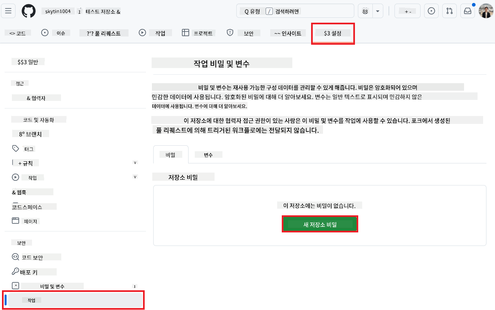
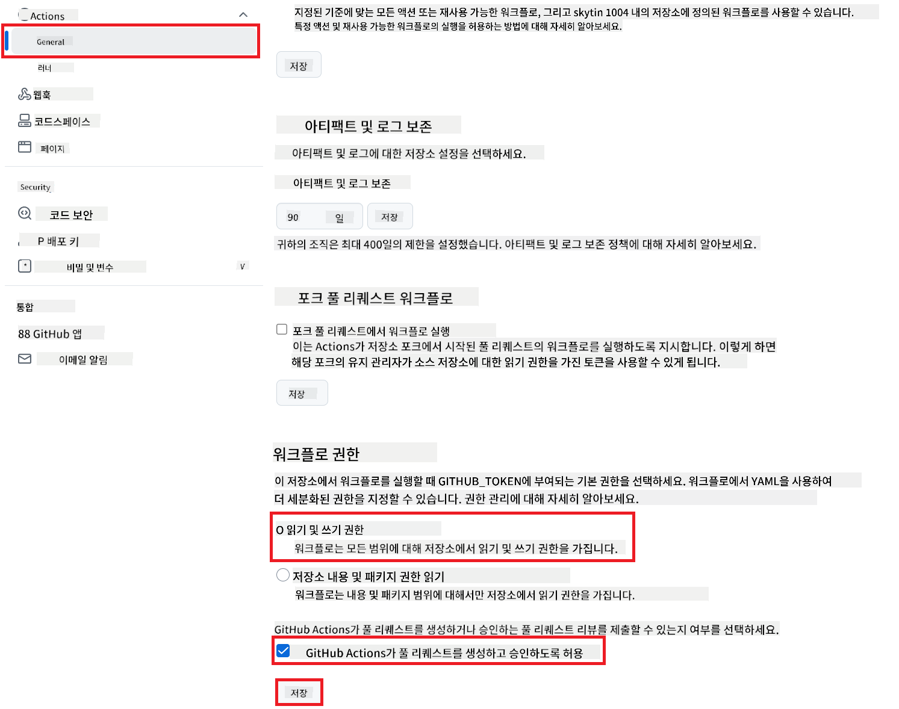

<!--
CO_OP_TRANSLATOR_METADATA:
{
  "original_hash": "527ca4d0a8d3f51087ec3317279e36ee",
  "translation_date": "2025-10-15T02:42:21+00:00",
  "source_file": "getting_started/github-actions-guide/github-actions-guide-public.md",
  "language_code": "ko"
}
-->
# Co-op Translator GitHub Action 사용하기 (공개 설정)

**대상 독자:** 이 가이드는 대부분의 공개 또는 비공개 저장소에서 표준 GitHub Actions 권한으로 충분한 사용자를 위한 것입니다. 내장된 `GITHUB_TOKEN`을 사용합니다.

Co-op Translator GitHub Action을 사용하면 저장소의 문서 번역을 자동화할 수 있습니다. 이 가이드는 소스 마크다운 파일이나 이미지가 변경될 때마다 번역이 업데이트된 풀 리퀘스트를 자동으로 생성하도록 액션을 설정하는 방법을 안내합니다.

> [!IMPORTANT]
>
> **올바른 가이드 선택하기:**
>
> 이 가이드는 **표준 `GITHUB_TOKEN`을 사용하는 더 간단한 설정 방법**을 설명합니다. 대부분의 사용자에게 권장되는 방법으로, 민감한 GitHub App Private Key를 관리할 필요가 없습니다.
>

## 사전 준비

GitHub Action을 설정하기 전에 필요한 AI 서비스 자격 증명을 준비하세요.

**1. 필수: AI 언어 모델 자격 증명**
지원되는 언어 모델 중 하나 이상의 자격 증명이 필요합니다:

- **Azure OpenAI**: Endpoint, API Key, Model/Deployment Name, API Version 필요
- **OpenAI**: API Key 필요, (선택: Org ID, Base URL, Model ID)
- 자세한 내용은 [지원 모델 및 서비스](../../../../README.md) 참고

**2. 선택: AI Vision 자격 증명 (이미지 번역용)**

- 이미지 내 텍스트 번역이 필요한 경우에만 필요합니다.
- **Azure AI Vision**: Endpoint와 Subscription Key 필요
- 제공하지 않으면 액션은 [마크다운 전용 모드](../markdown-only-mode.md)로 동작합니다.

## 설정 및 구성

표준 `GITHUB_TOKEN`을 사용하여 저장소에서 Co-op Translator GitHub Action을 설정하려면 아래 단계를 따라주세요.

### 1단계: 인증 방식 이해하기 (`GITHUB_TOKEN` 사용)

이 워크플로우는 GitHub Actions에서 제공하는 내장 `GITHUB_TOKEN`을 사용합니다. 이 토큰은 **3단계**에서 설정한 권한에 따라 저장소와 상호작용할 수 있도록 자동으로 권한을 부여합니다.

### 2단계: 저장소 시크릿 설정

**AI 서비스 자격 증명**만 저장소 설정의 암호화된 시크릿으로 추가하면 됩니다.

1.  대상 GitHub 저장소로 이동합니다.
2.  **Settings** > **Secrets and variables** > **Actions**로 이동합니다.
3.  **Repository secrets**에서 아래에 나열된 각 AI 서비스 시크릿마다 **New repository secret**을 클릭합니다.

     *(이미지 참고: 시크릿 추가 위치)*

**필수 AI 서비스 시크릿 (사전 준비에 따라 모두 추가):**

| 시크릿 이름                         | 설명                                   | 값 출처                     |
| :---------------------------------- | :------------------------------------- | :-------------------------- |
| `AZURE_AI_SERVICE_API_KEY`            | Azure AI Service (Computer Vision) 키    | Azure AI Foundry            |
| `AZURE_AI_SERVICE_ENDPOINT`         | Azure AI Service (Computer Vision) 엔드포인트 | Azure AI Foundry            |
| `AZURE_OPENAI_API_KEY`              | Azure OpenAI 서비스 키                  | Azure AI Foundry            |
| `AZURE_OPENAI_ENDPOINT`             | Azure OpenAI 서비스 엔드포인트          | Azure AI Foundry            |
| `AZURE_OPENAI_MODEL_NAME`           | Azure OpenAI 모델 이름                  | Azure AI Foundry            |
| `AZURE_OPENAI_CHAT_DEPLOYMENT_NAME` | Azure OpenAI 배포 이름                  | Azure AI Foundry            |
| `AZURE_OPENAI_API_VERSION`          | Azure OpenAI API 버전                   | Azure AI Foundry            |
| `OPENAI_API_KEY`                    | OpenAI API 키                           | OpenAI Platform             |
| `OPENAI_ORG_ID`                     | OpenAI 조직 ID (선택)                   | OpenAI Platform             |
| `OPENAI_CHAT_MODEL_ID`              | 특정 OpenAI 모델 ID (선택)              | OpenAI Platform             |
| `OPENAI_BASE_URL`                   | 커스텀 OpenAI API Base URL (선택)       | OpenAI Platform             |

### 3단계: 워크플로우 권한 설정

GitHub Action이 코드 체크아웃 및 풀 리퀘스트 생성을 위해 `GITHUB_TOKEN` 권한이 필요합니다.

1.  저장소에서 **Settings** > **Actions** > **General**로 이동합니다.
2.  **Workflow permissions** 섹션까지 스크롤합니다.
3.  **Read and write permissions**를 선택합니다. 이로써 워크플로우에 필요한 `contents: write` 및 `pull-requests: write` 권한이 부여됩니다.
4.  **Allow GitHub Actions to create and approve pull requests** 체크박스가 **체크**되어 있는지 확인합니다.
5.  **Save**를 선택합니다.



### 4단계: 워크플로우 파일 생성

마지막으로, `GITHUB_TOKEN`을 사용하는 자동화 워크플로우를 정의하는 YAML 파일을 만듭니다.

1.  저장소 루트 디렉터리에 `.github/workflows/` 디렉터리가 없다면 생성합니다.
2.  `.github/workflows/` 안에 `co-op-translator.yml` 파일을 만듭니다.
3.  아래 내용을 `co-op-translator.yml`에 붙여넣습니다.

```yaml
name: Co-op Translator

on:
  push:
    branches:
      - main

jobs:
  co-op-translator:
    runs-on: ubuntu-latest

    permissions:
      contents: write
      pull-requests: write

    steps:
      - name: Checkout repository
        uses: actions/checkout@v4
        with:
          fetch-depth: 0

      - name: Set up Python
        uses: actions/setup-python@v4
        with:
          python-version: '3.10'

      - name: Install Co-op Translator
        run: |
          python -m pip install --upgrade pip
          pip install co-op-translator

      - name: Run Co-op Translator
        env:
          PYTHONIOENCODING: utf-8
          # === AI Service Credentials ===
          AZURE_AI_SERVICE_API_KEY: ${{ secrets.AZURE_AI_SERVICE_API_KEY }}
          AZURE_AI_SERVICE_ENDPOINT: ${{ secrets.AZURE_AI_SERVICE_ENDPOINT }}
          AZURE_OPENAI_API_KEY: ${{ secrets.AZURE_OPENAI_API_KEY }}
          AZURE_OPENAI_ENDPOINT: ${{ secrets.AZURE_OPENAI_ENDPOINT }}
          AZURE_OPENAI_MODEL_NAME: ${{ secrets.AZURE_OPENAI_MODEL_NAME }}
          AZURE_OPENAI_CHAT_DEPLOYMENT_NAME: ${{ secrets.AZURE_OPENAI_CHAT_DEPLOYMENT_NAME }}
          AZURE_OPENAI_API_VERSION: ${{ secrets.AZURE_OPENAI_API_VERSION }}
          OPENAI_API_KEY: ${{ secrets.OPENAI_API_KEY }}
          OPENAI_ORG_ID: ${{ secrets.OPENAI_ORG_ID }}
          OPENAI_CHAT_MODEL_ID: ${{ secrets.OPENAI_CHAT_MODEL_ID }}
          OPENAI_BASE_URL: ${{ secrets.OPENAI_BASE_URL }}
        run: |
          # =====================================================================
          # IMPORTANT: Set your target languages here (REQUIRED CONFIGURATION)
          # =====================================================================
          # Example: Translate to Spanish, French, German. Add -y to auto-confirm.
          translate -l "es fr de" -y  # <--- MODIFY THIS LINE with your desired languages

      - name: Create Pull Request with translations
        uses: peter-evans/create-pull-request@v5
        with:
          token: ${{ secrets.GITHUB_TOKEN }}
          commit-message: "🌐 Update translations via Co-op Translator"
          title: "🌐 Update translations via Co-op Translator"
          body: |
            This PR updates translations for recent changes to the main branch.

            ### 📋 Changes included
            - Translated contents are available in the `translations/` directory
            - Translated images are available in the `translated_images/` directory

            ---
            🌐 Automatically generated by the [Co-op Translator](https://github.com/Azure/co-op-translator) GitHub Action.
          branch: update-translations
          base: main
          labels: translation, automated-pr
          delete-branch: true
          add-paths: |
            translations/
            translated_images/
```
4.  **워크플로우 커스터마이즈:**
  - **[!IMPORTANT] 대상 언어:** `Run Co-op Translator` 단계에서 `translate -l "..." -y` 명령어의 언어 코드 목록을 반드시 검토하고 프로젝트에 맞게 수정해야 합니다. 예시 목록(`ar de es...`)은 교체 또는 조정이 필요합니다.
  - **트리거(`on:`):** 현재 트리거는 `main` 브랜치에 푸시될 때마다 실행됩니다. 대형 저장소의 경우, 워크플로우가 관련 파일(예: 소스 문서) 변경 시에만 실행되도록 `paths:` 필터(주석 예시 참고)를 추가하면 러너 사용 시간을 절약할 수 있습니다.
  - **PR 세부 정보:** 필요에 따라 `commit-message`, `title`, `body`, `branch` 이름, `labels`를 `Create Pull Request` 단계에서 커스터마이즈하세요.

## 워크플로우 실행

> [!WARNING]  
> **GitHub 호스팅 러너 시간 제한:**  
> `ubuntu-latest`와 같은 GitHub 호스팅 러너는 **최대 실행 시간 6시간** 제한이 있습니다.  
> 대형 문서 저장소의 경우 번역 과정이 6시간을 초과하면 워크플로우가 자동으로 종료됩니다.  
> 이를 방지하려면:  
> - **셀프 호스팅 러너** 사용(시간 제한 없음)  
> - 실행당 대상 언어 수를 줄이세요

`co-op-translator.yml` 파일이 메인 브랜치(또는 `on:` 트리거에 지정된 브랜치)에 병합되면, 해당 브랜치에 변경 사항이 푸시될 때마다(필요시 `paths` 필터에 맞는 경우) 워크플로우가 자동으로 실행됩니다.

---

**면책 조항**:
이 문서는 AI 번역 서비스 [Co-op Translator](https://github.com/Azure/co-op-translator)를 사용하여 번역되었습니다. 정확성을 위해 최선을 다하고 있지만, 자동 번역에는 오류나 부정확성이 포함될 수 있습니다. 원본 문서(원어)가 권위 있는 자료로 간주되어야 합니다. 중요한 정보의 경우 전문적인 인간 번역을 권장합니다. 본 번역의 사용으로 인해 발생하는 오해나 오역에 대해 당사는 책임을 지지 않습니다.