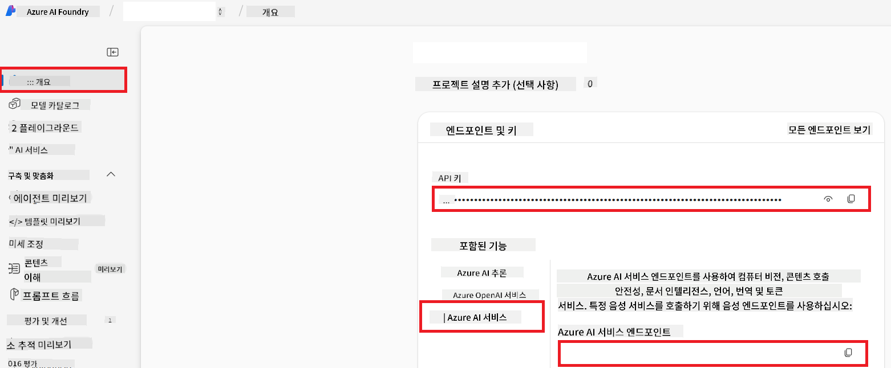

<!--
CO_OP_TRANSLATOR_METADATA:
{
  "original_hash": "b58d7c3cb4210697a073d20eb3064945",
  "translation_date": "2025-07-04T06:49:51+00:00",
  "source_file": "getting_started/set-up-azure-ai.md",
  "language_code": "ko"
}
-->
# Azure AI 설정하기: 협업 번역기 (Azure OpenAI & Azure AI Vision)

이 가이드는 Azure AI Foundry 내에서 언어 번역을 위한 Azure OpenAI와 이미지 콘텐츠 분석을 위한 Azure Computer Vision을 설정하는 방법을 안내합니다. 이미지 기반 번역에 사용할 수 있습니다.

**사전 요구 사항:**
- 활성 구독이 있는 Azure 계정.
- Azure 구독에서 리소스와 배포를 생성할 수 있는 충분한 권한.

## Azure AI 프로젝트 생성

AI 리소스를 관리할 중앙 장소로서 Azure AI 프로젝트를 생성합니다.

1. [https://ai.azure.com](https://ai.azure.com)로 이동하여 Azure 계정으로 로그인합니다.

1. **+Create**를 선택하여 새 프로젝트를 생성합니다.

1. 다음 작업을 수행합니다:
   - **프로젝트 이름** 입력 (예: `CoopTranslator-Project`).
   - **AI 허브** 선택 (예: `CoopTranslator-Hub`) (필요한 경우 새로 생성).

1. "**Review and Create**"를 클릭하여 프로젝트를 설정합니다. 프로젝트 개요 페이지로 이동합니다.

## 언어 번역을 위한 Azure OpenAI 설정

프로젝트 내에서 텍스트 번역의 백엔드 역할을 할 Azure OpenAI 모델을 배포합니다.

### 프로젝트로 이동

이미 이동하지 않았다면, 새로 생성한 프로젝트 (예: `CoopTranslator-Project`)를 Azure AI Foundry에서 엽니다.

### OpenAI 모델 배포

1. 프로젝트의 왼쪽 메뉴에서 "My assets" 아래 "**Models + endpoints**"를 선택합니다.

1. **+ Deploy model**을 선택합니다.

1. **Deploy Base Model**을 선택합니다.

1. 사용 가능한 모델 목록이 표시됩니다. 적합한 GPT 모델을 필터링하거나 검색합니다. `gpt-4o`를 추천합니다.

1. 원하는 모델을 선택하고 **Confirm**을 클릭합니다.

1. **Deploy**를 선택합니다.

### Azure OpenAI 구성

배포 후, "**Models + endpoints**" 페이지에서 배포를 선택하여 **REST endpoint URL**, **Key**, **Deployment name**, **Model name** 및 **API version**을 찾을 수 있습니다. 이는 번역 모델을 애플리케이션에 통합하는 데 필요합니다.

> [!NOTE]
> 요구 사항에 따라 [API 버전 폐기](https://learn.microsoft.com/azure/ai-services/openai/api-version-deprecation) 페이지에서 API 버전을 선택할 수 있습니다. **API 버전**은 Azure AI Foundry의 **Models + endpoints** 페이지에 표시된 **Model version**과 다릅니다.

## 이미지 번역을 위한 Azure Computer Vision 설정

이미지 내 텍스트 번역을 활성화하려면 Azure AI 서비스 API Key와 Endpoint를 찾아야 합니다.

1. Azure AI 프로젝트 (예: `CoopTranslator-Project`)로 이동합니다. 프로젝트 개요 페이지에 있는지 확인합니다.

### Azure AI 서비스 구성

Azure AI 서비스에서 API Key와 Endpoint를 찾습니다.

1. Azure AI 프로젝트 (예: `CoopTranslator-Project`)로 이동합니다. 프로젝트 개요 페이지에 있는지 확인합니다.

1. Azure AI 서비스 탭에서 **API Key**와 **Endpoint**를 찾습니다.

    

이 연결은 연결된 Azure AI 서비스 리소스의 기능(이미지 분석 포함)을 AI Foundry 프로젝트에 사용할 수 있게 합니다. 이 연결을 사용하여 노트북이나 애플리케이션에서 이미지를 추출한 텍스트를 Azure OpenAI 모델로 번역할 수 있습니다.

## 자격 증명 통합

이제 다음을 수집했어야 합니다:

**Azure OpenAI (텍스트 번역)용:**
- Azure OpenAI Endpoint
- Azure OpenAI API Key
- Azure OpenAI Model Name (예: `gpt-4o`)
- Azure OpenAI Deployment Name (예: `cooptranslator-gpt4o`)
- Azure OpenAI API Version

**Azure AI 서비스 (Vision을 통한 이미지 텍스트 추출)용:**
- Azure AI Service Endpoint
- Azure AI Service API Key

### 예시: 환경 변수 구성 (미리보기)

나중에 애플리케이션을 구축할 때, 수집한 자격 증명을 사용하여 환경 변수를 설정할 수 있습니다. 예를 들어 다음과 같이 설정할 수 있습니다:

```bash
# Azure AI Service Credentials (Required for image translation)
AZURE_AI_SERVICE_API_KEY="your_azure_ai_service_api_key" # e.g., 21xasd...
AZURE_AI_SERVICE_ENDPOINT="https://your_azure_ai_service_endpoint.cognitiveservices.azure.com/"

# Azure OpenAI Credentials (Required for text translation)
AZURE_OPENAI_API_KEY="your_azure_openai_api_key" # e.g., 21xasd...
AZURE_OPENAI_ENDPOINT="https://your_azure_openai_endpoint.openai.azure.com/"
AZURE_OPENAI_MODEL_NAME="your_model_name" # e.g., gpt-4o
AZURE_OPENAI_CHAT_DEPLOYMENT_NAME="your_deployment_name" # e.g., cooptranslator-gpt4o
AZURE_OPENAI_API_VERSION="your_api_version" # e.g., 2024-12-01-preview
```

---

### 추가 읽기

- [Azure AI Foundry에서 프로젝트 생성 방법](https://learn.microsoft.com/azure/ai-foundry/how-to/create-projects?tabs=ai-studio)
- [Azure AI 리소스 생성 방법](https://learn.microsoft.com/azure/ai-foundry/how-to/create-azure-ai-resource?tabs=portal)
- [Azure AI Foundry에서 OpenAI 모델 배포 방법](https://learn.microsoft.com/en-us/azure/ai-foundry/how-to/deploy-models-openai)

**면책 조항**:  
이 문서는 AI 번역 서비스 [Co-op Translator](https://github.com/Azure/co-op-translator)를 사용하여 번역되었습니다. 우리는 정확성을 위해 노력하지만, 자동 번역에는 오류나 부정확성이 있을 수 있음을 유의하시기 바랍니다. 원본 문서는 해당 언어로 작성된 것이 권위 있는 출처로 간주되어야 합니다. 중요한 정보에 대해서는 전문적인 인간 번역을 권장합니다. 이 번역 사용으로 인해 발생하는 오해나 잘못된 해석에 대해 책임을 지지 않습니다.