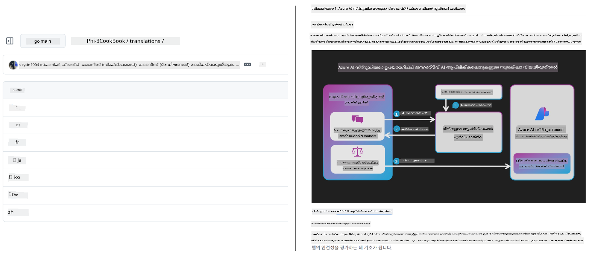
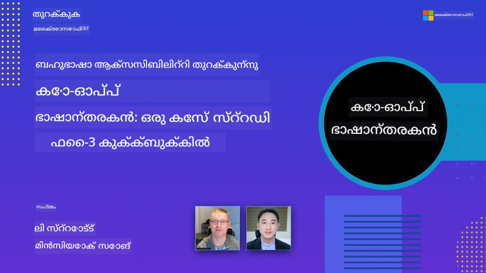

<!--
CO_OP_TRANSLATOR_METADATA:
{
  "original_hash": "dac6bc281667816537df51f724a0ff2c",
  "translation_date": "2025-11-30T13:15:09+00:00",
  "source_file": "README.md",
  "language_code": "ml"
}
-->
# കോ-ഓപ്പ് ട്രാൻസ്ലേറ്റർ

_നിങ്ങളുടെ വിദ്യാഭ്യാസ GitHub ഉള്ളടക്കം എളുപ്പത്തിൽ പല ഭാഷകളിലേക്കും തർജ്ജമ ചെയ്ത് ആഗോള പ്രേക്ഷകരെ എത്തിക്കുക._

[](https://pypi.org/project/co-op-translator/)
[](https://github.com/azure/co-op-translator/blob/main/LICENSE)
[](https://pepy.tech/project/co-op-translator)
[](https://pepy.tech/project/co-op-translator)
[](https://github.com/azure/co-op-translator/pkgs/container/co-op-translator)
[](https://github.com/psf/black)

[](https://GitHub.com/azure/co-op-translator/graphs/contributors/)
[](https://GitHub.com/azure/co-op-translator/issues/)
[](https://GitHub.com/azure/co-op-translator/pulls/)
[](http://makeapullrequest.com)

### 🌐 ബഹുഭാഷാ പിന്തുണ

#### [Co-op Translator](https://github.com/Azure/Co-op-Translator) പിന്തുണയോടെ

<!-- CO-OP TRANSLATOR LANGUAGES TABLE START -->
[അറബിക്](../ar/README.md) | [ബംഗാളി](../bn/README.md) | [ബൾഗേറിയൻ](../bg/README.md) | [ബർമീസ് (മ്യാന്മാർ)](../my/README.md) | [ചൈനീസ് (സിംപ്ലിഫൈഡ്)](../zh/README.md) | [ചൈനീസ് (പരമ്പരാഗതം, ഹോങ്കോങ്)](../hk/README.md) | [ചൈനീസ് (പരമ്പരാഗതം, മക്കാവ്)](../mo/README.md) | [ചൈനീസ് (പരമ്പരാഗതം, തായ്‌വാൻ)](../tw/README.md) | [ക്രൊയേഷ്യൻ](../hr/README.md) | [ചെക്ക്](../cs/README.md) | [ഡാനിഷ്](../da/README.md) | [ഡച്ച്](../nl/README.md) | [എസ്റ്റോണിയൻ](../et/README.md) | [ഫിന്നിഷ്](../fi/README.md) | [ഫ്രഞ്ച്](../fr/README.md) | [ജർമ്മൻ](../de/README.md) | [ഗ്രീക്ക്](../el/README.md) | [ഹീബ്രു](../he/README.md) | [ഹിന്ദി](../hi/README.md) | [ഹംഗേറിയൻ](../hu/README.md) | [ഇന്തോനേഷ്യൻ](../id/README.md) | [ഇറ്റാലിയൻ](../it/README.md) | [ജാപ്പനീസ്](../ja/README.md) | [കന്നഡ](../kn/README.md) | [കൊറിയൻ](../ko/README.md) | [ലിത്വാനിയൻ](../lt/README.md) | [മലായ്](../ms/README.md) | [മലയാളം](./README.md) | [മറാത്തി](../mr/README.md) | [നെപ്പാളി](../ne/README.md) | [നൈജീരിയൻ പിഡ്ജിൻ](../pcm/README.md) | [നോർവീജിയൻ](../no/README.md) | [പേർഷ്യൻ (ഫാർസി)](../fa/README.md) | [പോളിഷ്](../pl/README.md) | [പോർച്ചുഗീസ് (ബ്രസീൽ)](../br/README.md) | [പോർച്ചുഗീസ് (പോർച്ചുഗൽ)](../pt/README.md) | [പഞ്ചാബി (ഗുരുമുഖി)](../pa/README.md) | [റോമാനിയൻ](../ro/README.md) | [റഷ്യൻ](../ru/README.md) | [സെർബിയൻ (സിറിലിക്)](../sr/README.md) | [സ്ലോവാക്](../sk/README.md) | [സ്ലോവേനിയൻ](../sl/README.md) | [സ്പാനിഷ്](../es/README.md) | [സ്വാഹിലി](../sw/README.md) | [സ്വീഡിഷ്](../sv/README.md) | [ടാഗലോഗ് (ഫിലിപ്പിനോ)](../tl/README.md) | [തമിഴ്](../ta/README.md) | [തെലുങ്ക്](../te/README.md) | [തായ്](../th/README.md) | [ടർക്കിഷ്](../tr/README.md) | [ഉക്രെയ്‌നിയൻ](../uk/README.md) | [ഉർദു](../ur/README.md) | [വിയറ്റ്നാമീസ്](../vi/README.md)
<!-- CO-OP TRANSLATOR LANGUAGES TABLE END -->

[](https://GitHub.com/azure/co-op-translator/watchers/)
[](https://GitHub.com/azure/co-op-translator/network/)
[](https://GitHub.com/azure/co-op-translator/stargazers/)

[](https://discord.gg/nTYy5BXMWG)

[](https://codespaces.new/azure/co-op-translator)

## അവലോകനം

**കോ-ഓപ്പ് ട്രാൻസ്ലേറ്റർ** നിങ്ങളുടെ വിദ്യാഭ്യാസ GitHub ഉള്ളടക്കം എളുപ്പത്തിൽ പല ഭാഷകളിലേക്കും ലൊക്കലൈസ് ചെയ്യാൻ സഹായിക്കുന്നു.  
നിങ്ങൾ Markdown ഫയലുകൾ, ചിത്രങ്ങൾ, അല്ലെങ്കിൽ നോട്ട്‌ബുക്കുകൾ അപ്ഡേറ്റ് ചെയ്തപ്പോൾ, തർജ്ജമകൾ സ്വയം സമന്വയിപ്പിച്ച് learners-ന് ഉള്ളടക്കം ശരിയായും പുതുക്കിയതുമായിരിക്കുമെന്ന് ഉറപ്പാക്കുന്നു.

തർജ്ജമ ചെയ്ത ഉള്ളടക്കം എങ്ങനെ ക്രമീകരിച്ചിരിക്കുന്നതിന്റെ ഉദാഹരണം:



## വേഗത്തിലുള്ള ആരംഭം

```bash
# ഒരു വെർച്വൽ എൻവയോൺമെന്റ് സൃഷ്ടിച്ച് സജീവമാക്കുക (ശുപാർശ ചെയ്യുന്നു)
python -m venv .venv
# വിൻഡോസ്
.venv\Scripts\activate
# മാക്‌ഒഎസ്/ലിനക്സ്
source .venv/bin/activate
# പാക്കേജ് ഇൻസ്റ്റാൾ ചെയ്യുക
pip install co-op-translator
# വിവർത്തനം ചെയ്യുക
translate -l "ko ja fr" -md
```
  
Docker:

```bash
# GHCR-ൽ നിന്ന് പബ്ലിക് ഇമേജ് പുൾ ചെയ്യുക
docker pull ghcr.io/azure/co-op-translator:latest
# നിലവിലെ ഫോൾഡർ മൗണ്ടുചെയ്ത് .env ഫയൽ നൽകിയുള്ള റൺ (Bash/Zsh)
docker run --rm -it --env-file .env -v "${PWD}:/work" ghcr.io/azure/co-op-translator:latest -l "ko ja fr" -md
```
  
## കുറഞ്ഞ സജ്ജീകരണം

1. [.env.template](../../.env.template) ഉപയോഗിച്ച് `.env` ഫയൽ സൃഷ്ടിക്കുക  
2. ഒരു LLM പ്രൊവൈഡർ (Azure OpenAI അല്ലെങ്കിൽ OpenAI) ക്രമീകരിക്കുക  
3. (ഐച്ഛികം) ചിത്രം തർജ്ജമയ്ക്കായി (`-img`) Azure AI Vision ക്രമീകരിക്കുക  
4. (ശുപാർശ ചെയ്യുന്നു) മുൻ തർജ്ജമകൾ നീക്കം ചെയ്ത് സംഘർഷങ്ങൾ ഒഴിവാക്കുക (ഉദാ: `translations/`)  
5. (ശുപാർശ ചെയ്യുന്നു) README-യിൽ തർജ്ജമ വിഭാഗം ചേർക്കുക [README languages template](./getting_started/README_languages_template.md) ഉപയോഗിച്ച്  
6. കാണുക: [Azure AI ക്രമീകരിക്കൽ](./getting_started/set-up-azure-ai.md)

## ഉപയോഗം

സഹായിക്കുന്ന എല്ലാ തരങ്ങളും തർജ്ജമ ചെയ്യുക:

```bash
translate -l "ko ja"
```
  
Markdown മാത്രം:

```bash
translate -l "de" -md
```
  
Markdown + ചിത്രങ്ങൾ:

```bash
translate -l "pt" -md -img
```
  
നോട്ട്‌ബുക്കുകൾ മാത്രം:

```bash
translate -l "zh" -nb
```
  
കൂടുതൽ ഫ്ലാഗുകൾ: [കമാൻഡ് റഫറൻസ്](./getting_started/command-reference.md)

## സവിശേഷതകൾ

- Markdown, നോട്ട്‌ബുക്കുകൾ, ചിത്രങ്ങൾ എന്നിവയ്ക്ക് സ്വയം പ്രവർത്തിക്കുന്ന തർജ്ജമ  
- ഉറപ്പാക്കുന്നു തർജ്ജമകൾ ഉറവിട മാറ്റങ്ങളുമായി സമന്വയിപ്പിച്ചിരിക്കുന്നു  
- ലോക്കലായി (CLI) അല്ലെങ്കിൽ CI (GitHub Actions) ൽ പ്രവർത്തിക്കുന്നു  
- Azure OpenAI അല്ലെങ്കിൽ OpenAI ഉപയോഗിക്കുന്നു; ചിത്രങ്ങൾക്ക് ഐച്ഛികമായി Azure AI Vision  
- Markdown ഫോർമാറ്റിംഗ്, ഘടന സംരക്ഷിക്കുന്നു

## ഡോക്യുമെന്റേഷൻ

- [കമാൻഡ്-ലൈൻ ഗൈഡ്](./getting_started/command-line-guide/command-line-guide.md)  
- [GitHub Actions ഗൈഡ് (പബ്ലിക് റിപോസിറ്ററികൾ & സ്റ്റാൻഡേർഡ് സീക്രെറ്റ്സ്)](./getting_started/github-actions-guide/github-actions-guide-public.md)  
- [GitHub Actions ഗൈഡ് (Microsoft ഓർഗനൈസേഷൻ റിപോസിറ്ററികൾ & ഓർഗ്-ലെവൽ ക്രമീകരണങ്ങൾ)](./getting_started/github-actions-guide/github-actions-guide-org.md)  
- [README ഭാഷാ ടെംപ്ലേറ്റ്](./getting_started/README_languages_template.md)  
- [പിന്തുണയുള്ള ഭാഷകൾ](./getting_started/supported-languages.md)  
- [സംഭാവനകൾ](./CONTRIBUTING.md)  
- [പ്രശ്നപരിഹാരം](./getting_started/troubleshooting.md)

### Microsoft-നു പ്രത്യേക ഗൈഡ്
> [!NOTE]  
> Microsoft “For Beginners” റിപോസിറ്ററികളുടെ പരിപാലകർക്ക് മാത്രം.

- [“മറ്റു കോഴ്സുകൾ” പട്ടിക അപ്ഡേറ്റ് ചെയ്യൽ (MS Beginners റിപോസിറ്ററികൾക്ക് മാത്രം)](./getting_started/update-other-courses.md)

## ഞങ്ങളെ പിന്തുണച്ച് ആഗോള പഠനം പ്രോത്സാഹിപ്പിക്കുക

വിദ്യാഭ്യാസ ഉള്ളടക്കം ആഗോളമായി പങ്കുവെക്കുന്നതിന്റെ രീതിയിൽ വിപ്ലവം സൃഷ്ടിക്കാൻ ഞങ്ങളോടൊപ്പം ചേരൂ! [Co-op Translator](https://github.com/azure/co-op-translator) GitHub-ൽ ⭐ നൽകുകയും പഠനത്തിലും സാങ്കേതികവിദ്യയിലും ഭാഷാ തടസ്സങ്ങൾ തകർക്കാനുള്ള ഞങ്ങളുടെ ദൗത്യം പിന്തുണയ്ക്കുകയും ചെയ്യൂ. നിങ്ങളുടെ താൽപര്യവും സംഭാവനകളും വലിയ സ്വാധീനം ചെലുത്തുന്നു! കോഡ് സംഭാവനകളും സവിശേഷത നിർദ്ദേശങ്ങളും എപ്പോഴും സ്വാഗതം ചെയ്യപ്പെടുന്നു.

### Microsoft വിദ്യാഭ്യാസ ഉള്ളടക്കം നിങ്ങളുടെ ഭാഷയിൽ അന്വേഷിക്കുക

- [AZD for Beginners](https://github.com/microsoft/AZD-for-beginners)  
- [Edge AI for Beginners](https://github.com/microsoft/edgeai-for-beginners)  
- [Model Context Protocol (MCP) For Beginners](https://github.com/microsoft/mcp-for-beginners)  
- [AI Agents for Beginners](https://github.com/microsoft/ai-agents-for-beginners)  
- [.NET ഉപയോഗിച്ച് Generative AI for Beginners](https://github.com/microsoft/Generative-AI-for-beginners-dotnet)  
- [Generative AI for Beginners](https://github.com/microsoft/generative-ai-for-beginners)  
- [Java ഉപയോഗിച്ച് Generative AI for Beginners](https://github.com/microsoft/generative-ai-for-beginners-java)  
- [ML for Beginners](https://aka.ms/ml-beginners)  
- [Data Science for Beginners](https://aka.ms/datascience-beginners)  
- [AI for Beginners](https://aka.ms/ai-beginners)  
- [Cybersecurity for Beginners](https://github.com/microsoft/Security-101)  
- [Web Dev for Beginners](https://aka.ms/webdev-beginners)  
- [IoT for Beginners](https://aka.ms/iot-beginners)  
- [PhiCookBook](https://github.com/microsoft/PhiCookBook)

## വീഡിയോ അവതരണങ്ങൾ

👉 YouTube-ൽ കാണാൻ താഴെയുള്ള ചിത്രം ക്ലിക്ക് ചെയ്യുക.

- **Open at Microsoft**: കോ-ഓപ്പ് ട്രാൻസ്ലേറ്റർ എങ്ങനെ ഉപയോഗിക്കാമെന്ന് 18 മിനിറ്റ് ദൈർഘ്യമുള്ള ഒരു സംക്ഷിപ്ത പരിചയവും വേഗഗൈഡും.

  [](https://www.youtube.com/watch?v=jX_swfH_KNU)

## സംഭാവനകൾ

ഈ പ്രോജക്റ്റ് സംഭാവനകളും നിർദ്ദേശങ്ങളും സ്വാഗതം ചെയ്യുന്നു. Azure Co-op Translator-ലേക്ക് സംഭാവന ചെയ്യാൻ താൽപര്യമുണ്ടോ? ദയവായി ഞങ്ങളുടെ [CONTRIBUTING.md](./CONTRIBUTING.md) കാണുക, കോ-ഓപ്പ് ട്രാൻസ്ലേറ്റർ കൂടുതൽ ആക്‌സസിബിൾ ആക്കാൻ നിങ്ങൾ എങ്ങനെ സഹായിക്കാമെന്ന്.

## സംഭാവനക്കാർ

[](https://github.com/Azure/co-op-translator/graphs/contributors)

## പെരുമാറ്റ നയം

ഈ പ്രോജക്റ്റ് [Microsoft Open Source Code of Conduct](https://opensource.microsoft.com/codeofconduct/) സ്വീകരിച്ചിട്ടുണ്ട്.  
കൂടുതൽ വിവരങ്ങൾക്ക് [Code of Conduct FAQ](https://opensource.microsoft.com/codeofconduct/faq/) കാണുക അല്ലെങ്കിൽ  
ഏതെങ്കിലും ചോദ്യങ്ങൾക്കോ അഭിപ്രായങ്ങൾക്കോ [opencode@microsoft.com](mailto:opencode@microsoft.com) എന്ന വിലാസത്തിൽ ബന്ധപ്പെടുക.

## ഉത്തരവാദിത്വമുള്ള AI

Microsoft, ഉപഭോക്താക്കൾക്ക് നമ്മുടെ AI ഉൽപ്പന്നങ്ങൾ ഉത്തരവാദിത്വത്തോടെ ഉപയോഗിക്കാൻ സഹായിക്കുന്നതിൽ പ്രതിജ്ഞാബദ്ധമാണ്, പഠനങ്ങൾ പങ്കുവെക്കുകയും Transparency Notes, Impact Assessments പോലുള്ള ഉപകരണങ്ങളിലൂടെ വിശ്വാസം അടിസ്ഥാനമാക്കിയ പങ്കാളിത്തങ്ങൾ നിർമ്മിക്കുകയും ചെയ്യുന്നു. ഈ വിഭവങ്ങളുടെ പലതും [https://aka.ms/RAI](https://aka.ms/RAI) ൽ ലഭ്യമാണ്.  
Microsoft-ന്റെ ഉത്തരവാദിത്വമുള്ള AI സമീപനം നീതിമാന്മ, വിശ്വസനീയതയും സുരക്ഷയും, സ്വകാര്യതയും സുരക്ഷയും, ഉൾക്കൊള്ളലും, പാരദർശിത്വവും, ഉത്തരവാദിത്വവും എന്ന AI സിദ്ധാന്തങ്ങളിൽ ആധാരിതമാണ്.

ഈ സാമ്പിളിൽ ഉപയോഗിച്ച വലിയ തോതിലുള്ള സ്വാഭാവിക ഭാഷ, ചിത്രം, ശബ്ദ മോഡലുകൾ അനീതിമാന്മായ, വിശ്വസനീയമല്ലാത്ത, അല്ലെങ്കിൽ അപമാനകരമായ രീതിയിൽ പെരുമാറാൻ സാധ്യതയുണ്ട്, ഇത് ഹാനികരമായ ഫലങ്ങൾ ഉണ്ടാക്കാം. ദയവായി [Azure OpenAI service Transparency note](https://learn.microsoft.com/legal/cognitive-services/openai/transparency-note?tabs=text) പരിശോധിച്ച് അപകടങ്ങളും പരിധികളും അറിയുക.
ഈ അപകടങ്ങൾ കുറയ്ക്കാൻ ശുപാർശ ചെയ്യുന്ന സമീപനം നിങ്ങളുടെ ആർക്കിടെക്ചറിൽ ഒരു സുരക്ഷാ സംവിധാനം ഉൾപ്പെടുത്തുകയാണ്, ഇത് ഹാനികരമായ പെരുമാറ്റം കണ്ടെത്തുകയും തടയുകയും ചെയ്യാൻ കഴിയും. [Azure AI Content Safety](https://learn.microsoft.com/azure/ai-services/content-safety/overview) സ്വതന്ത്രമായ ഒരു സംരക്ഷണ പാളി നൽകുന്നു, ഇത് ആപ്ലിക്കേഷനുകളിലും സേവനങ്ങളിലും ഹാനികരമായ ഉപയോക്തൃ സൃഷ്ടിയും AI സൃഷ്ടിയും ഉള്ള ഉള്ളടക്കം കണ്ടെത്താൻ കഴിയും. Azure AI Content Safety ടെക്സ്റ്റ്, ഇമേജ് APIകൾ ഉൾക്കൊള്ളുന്നു, ഇത് ഹാനികരമായ ഉള്ളടക്കം കണ്ടെത്താൻ സഹായിക്കുന്നു. കൂടാതെ, വിവിധ മോഡാലിറ്റികളിൽ ഹാനികരമായ ഉള്ളടക്കം കണ്ടെത്തുന്നതിനുള്ള സാമ്പിൾ കോഡ് കാണാനും പരീക്ഷിക്കാനും സഹായിക്കുന്ന ഒരു ഇന്ററാക്ടീവ് Content Safety Studio ഉണ്ട്. സേവനത്തിലേക്ക് അഭ്യർത്ഥനകൾ അയയ്ക്കുന്നതിന് താഴെ കൊടുത്തിരിക്കുന്ന [ക്വിക്‌സ്റ്റാർട്ട് ഡോക്യുമെന്റേഷൻ](https://learn.microsoft.com/azure/ai-services/content-safety/quickstart-text?tabs=visual-studio%2Clinux&pivots=programming-language-rest) നിങ്ങളെ മാർഗനിർദ്ദേശം ചെയ്യുന്നു.

മറ്റൊരു പരിഗണിക്കേണ്ട കാര്യം ആപ്ലിക്കേഷൻ മൊത്തത്തിലുള്ള പ്രകടനമാണ്. മൾട്ടി-മോഡൽ, മൾട്ടി-മോഡൽ ആപ്ലിക്കേഷനുകളിൽ, പ്രകടനം എന്നത് നിങ്ങൾക്കും നിങ്ങളുടെ ഉപയോക്താക്കൾക്കും പ്രതീക്ഷിക്കുന്നതുപോലെ സിസ്റ്റം പ്രവർത്തിക്കുന്നതായും, ഹാനികരമായ ഔട്ട്പുട്ടുകൾ സൃഷ്ടിക്കാതിരിക്കുകയുമാണ്. നിങ്ങളുടെ ആപ്ലിക്കേഷന്റെ മൊത്തത്തിലുള്ള പ്രകടനം [ജനറേഷൻ ഗുണമേന്മയും അപകടം, സുരക്ഷാ മെട്രിക്കുകളും](https://learn.microsoft.com/azure/ai-studio/concepts/evaluation-metrics-built-in) ഉപയോഗിച്ച് വിലയിരുത്തുന്നത് പ്രധാനമാണ്.

നിങ്ങളുടെ AI ആപ്ലിക്കേഷൻ വികസന പരിസരത്ത് [prompt flow SDK](https://microsoft.github.io/promptflow/index.html) ഉപയോഗിച്ച് വിലയിരുത്താം. ഒരു ടെസ്റ്റ് ഡാറ്റാസെറ്റ് അല്ലെങ്കിൽ ലക്ഷ്യം നൽകിയാൽ, നിങ്ങളുടെ ജനറേറ്റീവ് AI ആപ്ലിക്കേഷന്റെ ജനറേഷനുകൾ ഉൾപ്പെടുത്തിയ മൂല്യനിർണയകരാൽ അല്ലെങ്കിൽ നിങ്ങളുടെ ഇഷ്ടാനുസൃത മൂല്യനിർണയകരാൽ കണക്കുകൂട്ടപ്പെടും. നിങ്ങളുടെ സിസ്റ്റം വിലയിരുത്താൻ prompt flow SDK ഉപയോഗിച്ച് തുടങ്ങാൻ, [ക്വിക്‌സ്റ്റാർട്ട് ഗൈഡ്](https://learn.microsoft.com/azure/ai-studio/how-to/develop/flow-evaluate-sdk) പിന്തുടരാം. ഒരു മൂല്യനിർണയ റൺ നടത്തുമ്പോൾ, [Azure AI Studioയിൽ ഫലങ്ങൾ ദൃശ്യവൽക്കരിക്കാം](https://learn.microsoft.com/azure/ai-studio/how-to/evaluate-flow-results).

## ട്രേഡ്മാർക്കുകൾ

ഈ പ്രോജക്ടിൽ പ്രോജക്ടുകൾ, ഉൽപ്പന്നങ്ങൾ, സേവനങ്ങൾ എന്നിവയ്ക്ക് ട്രേഡ്മാർക്കുകൾ അല്ലെങ്കിൽ ലോഗോകൾ ഉൾക്കൊള്ളാം. Microsoft ട്രേഡ്മാർക്കുകൾ അല്ലെങ്കിൽ ലോഗോകളുടെ അനുമതിയുള്ള ഉപയോഗം [Microsoftയുടെ ട്രേഡ്മാർക്ക് & ബ്രാൻഡ് മാർഗനിർദ്ദേശങ്ങൾ](https://www.microsoft.com/en-us/legal/intellectualproperty/trademarks/usage/general) അനുസരിക്കണം. ഈ പ്രോജക്ടിന്റെ മാറ്റം വരുത്തിയ പതിപ്പുകളിൽ Microsoft ട്രേഡ്മാർക്കുകൾ അല്ലെങ്കിൽ ലോഗോകൾ ഉപയോഗിക്കുന്നത് ആശയക്കുഴപ്പം സൃഷ്ടിക്കരുത് അല്ലെങ്കിൽ Microsoft സ്പോൺസർഷിപ്പ് സൂചിപ്പിക്കരുത്. മൂന്നാം കക്ഷി ട്രേഡ്മാർക്കുകൾ അല്ലെങ്കിൽ ലോഗോകൾ ഉപയോഗിക്കുന്നത് ആ മൂന്നാം കക്ഷികളുടെ നയങ്ങൾക്കു വിധേയമാണ്.

## സഹായം ലഭിക്കുക

AI ആപ്ലിക്കേഷനുകൾ നിർമ്മിക്കുന്നതിൽ നിങ്ങൾക്ക് തടസ്സം നേരിടുകയാണെങ്കിൽ അല്ലെങ്കിൽ ചോദ്യങ്ങളുണ്ടെങ്കിൽ, ചേരുക:

[](https://discord.gg/nTYy5BXMWG)

ഉൽപ്പന്ന പ്രതികരണങ്ങൾ അല്ലെങ്കിൽ പിഴവുകൾ ഉണ്ടെങ്കിൽ സന്ദർശിക്കുക:

[](https://aka.ms/foundry/forum)

---

<!-- CO-OP TRANSLATOR DISCLAIMER START -->
**അസൂയാ**:  
ഈ രേഖ AI വിവർത്തന സേവനം [Co-op Translator](https://github.com/Azure/co-op-translator) ഉപയോഗിച്ച് വിവർത്തനം ചെയ്തതാണ്. നാം കൃത്യതയ്ക്ക് ശ്രമിച്ചെങ്കിലും, സ്വയം പ്രവർത്തിക്കുന്ന വിവർത്തനങ്ങളിൽ പിശകുകൾ അല്ലെങ്കിൽ തെറ്റുകൾ ഉണ്ടാകാമെന്ന് ദയവായി ശ്രദ്ധിക്കുക. അതിന്റെ മാതൃഭാഷയിലുള്ള യഥാർത്ഥ രേഖയാണ് പ്രാമാണികമായ ഉറവിടം എന്ന് പരിഗണിക്കേണ്ടതാണ്. നിർണായകമായ വിവരങ്ങൾക്ക്, പ്രൊഫഷണൽ മനുഷ്യ വിവർത്തനം ശുപാർശ ചെയ്യപ്പെടുന്നു. ഈ വിവർത്തനം ഉപയോഗിക്കുന്നതിൽ നിന്നുണ്ടാകുന്ന ഏതെങ്കിലും തെറ്റിദ്ധാരണകൾക്കോ വ്യാഖ്യാനക്കേടുകൾക്കോ ഞങ്ങൾ ഉത്തരവാദികളല്ല.
<!-- CO-OP TRANSLATOR DISCLAIMER END -->