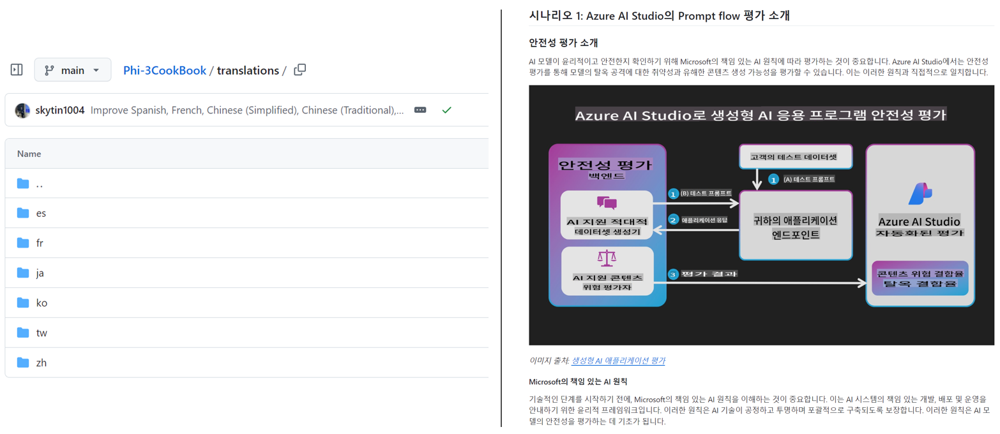

<!--
CO_OP_TRANSLATOR_METADATA:
{
  "original_hash": "dac6bc281667816537df51f724a0ff2c",
  "translation_date": "2025-11-30T10:12:51+00:00",
  "source_file": "README.md",
  "language_code": "mo"
}
-->
# Co-op 翻譯器

_輕鬆自動化將您的教育 GitHub 內容翻譯成多種語言，觸及全球受眾。_

[](https://pypi.org/project/co-op-translator/)
[](https://github.com/azure/co-op-translator/blob/main/LICENSE)
[](https://pepy.tech/project/co-op-translator)
[](https://pepy.tech/project/co-op-translator)
[](https://github.com/azure/co-op-translator/pkgs/container/co-op-translator)
[](https://github.com/psf/black)

[](https://GitHub.com/azure/co-op-translator/graphs/contributors/)
[](https://GitHub.com/azure/co-op-translator/issues/)
[](https://GitHub.com/azure/co-op-translator/pulls/)
[](http://makeapullrequest.com)

### 🌐 多語言支援

#### 由 [Co-op Translator](https://github.com/Azure/Co-op-Translator) 支援

<!-- CO-OP TRANSLATOR LANGUAGES TABLE START -->
[阿拉伯語](../ar/README.md) | [孟加拉語](../bn/README.md) | [保加利亞語](../bg/README.md) | [緬甸語](../my/README.md) | [中文（簡體）](../zh/README.md) | [中文（繁體，香港）](../hk/README.md) | [中文（繁體，澳門）](./README.md) | [中文（繁體，台灣）](../tw/README.md) | [克羅地亞語](../hr/README.md) | [捷克語](../cs/README.md) | [丹麥語](../da/README.md) | [荷蘭語](../nl/README.md) | [愛沙尼亞語](../et/README.md) | [芬蘭語](../fi/README.md) | [法語](../fr/README.md) | [德語](../de/README.md) | [希臘語](../el/README.md) | [希伯來語](../he/README.md) | [印地語](../hi/README.md) | [匈牙利語](../hu/README.md) | [印尼語](../id/README.md) | [意大利語](../it/README.md) | [日語](../ja/README.md) | [坎納達語](../kn/README.md) | [韓語](../ko/README.md) | [立陶宛語](../lt/README.md) | [馬來語](../ms/README.md) | [馬拉雅拉姆語](../ml/README.md) | [馬拉地語](../mr/README.md) | [尼泊爾語](../ne/README.md) | [奈及利亞皮欽語](../pcm/README.md) | [挪威語](../no/README.md) | [波斯語（法爾西語）](../fa/README.md) | [波蘭語](../pl/README.md) | [葡萄牙語（巴西）](../br/README.md) | [葡萄牙語（葡萄牙）](../pt/README.md) | [旁遮普語（古魯穆奇）](../pa/README.md) | [羅馬尼亞語](../ro/README.md) | [俄語](../ru/README.md) | [塞爾維亞語（西里爾字母）](../sr/README.md) | [斯洛伐克語](../sk/README.md) | [斯洛文尼亞語](../sl/README.md) | [西班牙語](../es/README.md) | [斯瓦希里語](../sw/README.md) | [瑞典語](../sv/README.md) | [他加祿語（菲律賓語）](../tl/README.md) | [泰米爾語](../ta/README.md) | [泰盧固語](../te/README.md) | [泰語](../th/README.md) | [土耳其語](../tr/README.md) | [烏克蘭語](../uk/README.md) | [烏爾都語](../ur/README.md) | [越南語](../vi/README.md)
<!-- CO-OP TRANSLATOR LANGUAGES TABLE END -->

[](https://GitHub.com/azure/co-op-translator/watchers/)
[](https://GitHub.com/azure/co-op-translator/network/)
[](https://GitHub.com/azure/co-op-translator/stargazers/)

[](https://discord.gg/nTYy5BXMWG)

[](https://codespaces.new/azure/co-op-translator)

## 概覽

**Co-op 翻譯器** 幫助您輕鬆將教育用的 GitHub 內容本地化成多種語言。
當您更新 Markdown 檔案、圖片或筆記本時，翻譯會自動同步，確保您的內容對全球學習者保持準確且最新。

翻譯內容的組織範例：



## 快速開始

```bash
# 建立並啟動虛擬環境（建議）
python -m venv .venv
# Windows 作業系統
.venv\Scripts\activate
# macOS/Linux 作業系統
source .venv/bin/activate
# 安裝套件
pip install co-op-translator
# 翻譯
translate -l "ko ja fr" -md
```

Docker：

```bash
# 從 GHCR 拉取公共映像
docker pull ghcr.io/azure/co-op-translator:latest
# 以掛載當前資料夾及提供 .env 方式運行（Bash/Zsh）
docker run --rm -it --env-file .env -v "${PWD}:/work" ghcr.io/azure/co-op-translator:latest -l "ko ja fr" -md
```

## 最簡設定

1. 使用範本建立 `.env` 檔案：[.env.template](../../.env.template)
2. 設定一個大型語言模型提供者（Azure OpenAI 或 OpenAI）
3. （可選）若要翻譯圖片（`-img`），設定 Azure AI Vision
4. （建議）清理先前的翻譯以避免衝突（例如 `translations/`）
5. （建議）在 README 加入翻譯語言區段，使用 [README 語言範本](./getting_started/README_languages_template.md)
6. 參考：[設定 Azure AI](./getting_started/set-up-azure-ai.md)

## 使用方法

翻譯所有支援的類型：

```bash
translate -l "ko ja"
```

只翻譯 Markdown：

```bash
translate -l "de" -md
```

Markdown + 圖片：

```bash
translate -l "pt" -md -img
```

只翻譯筆記本：

```bash
translate -l "zh" -nb
```

更多參數：[指令參考](./getting_started/command-reference.md)

## 功能

- 自動翻譯 Markdown、筆記本和圖片
- 翻譯與原始內容變更保持同步
- 可本地執行（CLI）或在 CI（GitHub Actions）中使用
- 使用 Azure OpenAI 或 OpenAI；圖片翻譯可選用 Azure AI Vision
- 保留 Markdown 格式與結構

## 文件

- [命令列指南](./getting_started/command-line-guide/command-line-guide.md)
- [GitHub Actions 指南（公開倉庫與標準密鑰）](./getting_started/github-actions-guide/github-actions-guide-public.md)
- [GitHub Actions 指南（Microsoft 組織倉庫與組織層級設定）](./getting_started/github-actions-guide/github-actions-guide-org.md)
- [README 語言範本](./getting_started/README_languages_template.md)
- [支援語言](./getting_started/supported-languages.md)
- [貢獻指南](./CONTRIBUTING.md)
- [疑難排解](./getting_started/troubleshooting.md)

### Microsoft 專屬指南
> [!NOTE]
> 僅供 Microsoft “For Beginners” 倉庫維護者使用。

- [更新「其他課程」清單（僅限 MS Beginners 倉庫）](./getting_started/update-other-courses.md)

## 支持我們，促進全球學習

加入我們，一起革新教育內容的全球分享方式！在 GitHub 上為 [Co-op Translator](https://github.com/azure/co-op-translator) 點⭐，支持我們打破學習與科技的語言障礙。您的關注與貢獻將帶來重大影響！歡迎提交程式碼貢獻與功能建議。

### 以您的語言探索 Microsoft 教育內容

- [AZD for Beginners](https://github.com/microsoft/AZD-for-beginners)
- [Edge AI for Beginners](https://github.com/microsoft/edgeai-for-beginners)
- [Model Context Protocol (MCP) For Beginners](https://github.com/microsoft/mcp-for-beginners)
- [AI Agents for Beginners](https://github.com/microsoft/ai-agents-for-beginners)
- [Generative AI for Beginners using .NET](https://github.com/microsoft/Generative-AI-for-beginners-dotnet)
- [Generative AI for Beginners](https://github.com/microsoft/generative-ai-for-beginners)
- [Generative AI for Beginners using Java](https://github.com/microsoft/generative-ai-for-beginners-java)
- [ML for Beginners](https://aka.ms/ml-beginners)
- [Data Science for Beginners](https://aka.ms/datascience-beginners)
- [AI for Beginners](https://aka.ms/ai-beginners)
- [Cybersecurity for Beginners](https://github.com/microsoft/Security-101)
- [Web Dev for Beginners](https://aka.ms/webdev-beginners)
- [IoT for Beginners](https://aka.ms/iot-beginners)
- [PhiCookBook](https://github.com/microsoft/PhiCookBook)

## 影片簡介

👉 點擊下方圖片於 YouTube 觀看。

- **Open at Microsoft**：18 分鐘簡短介紹與快速使用 Co-op Translator 指南。

  [](https://www.youtube.com/watch?v=jX_swfH_KNU)

## 貢獻

本專案歡迎貢獻與建議。想為 Azure Co-op Translator 貢獻嗎？請參閱我們的 [CONTRIBUTING.md](./CONTRIBUTING.md) 了解如何協助讓 Co-op Translator 更加普及。

## 貢獻者

[](https://github.com/Azure/co-op-translator/graphs/contributors)

## 行為準則

本專案採用 [Microsoft 開源行為準則](https://opensource.microsoft.com/codeofconduct/)。
更多資訊請參閱 [行為準則常見問題](https://opensource.microsoft.com/codeofconduct/faq/) 或
聯絡 [opencode@microsoft.com](mailto:opencode@microsoft.com) 提出任何問題或意見。

## 負責任的 AI

Microsoft 致力協助客戶負責任地使用我們的 AI 產品，分享經驗，並透過透明度說明與影響評估等工具建立信任夥伴關係。許多資源可在 [https://aka.ms/RAI](https://aka.ms/RAI) 找到。
Microsoft 的負責任 AI 方法基於公平性、可靠性與安全性、隱私與安全、包容性、透明度及問責制等 AI 原則。

大型自然語言、影像與語音模型——如本範例所用——可能會出現不公平、不可靠或冒犯性的行為，進而造成傷害。請參閱 [Azure OpenAI 服務透明度說明](https://learn.microsoft.com/legal/cognitive-services/openai/transparency-note?tabs=text) 以了解風險與限制。
建議的風險緩解方法是在您的架構中加入一個安全系統，能夠偵測並防止有害行為。[Azure AI 內容安全](https://learn.microsoft.com/azure/ai-services/content-safety/overview) 提供獨立的保護層，能夠偵測應用程式和服務中用戶生成及 AI 生成的有害內容。Azure AI 內容安全包含文字和影像 API，讓您能偵測有害的素材。我們也提供一個互動式的內容安全工作室，讓您可以查看、探索並試用跨不同模態偵測有害內容的範例程式碼。以下的[快速入門文件](https://learn.microsoft.com/azure/ai-services/content-safety/quickstart-text?tabs=visual-studio%2Clinux&pivots=programming-language-rest)會引導您如何向服務發出請求。

另一個需要考慮的面向是整體應用程式的效能。對於多模態和多模型的應用程式，我們認為效能是指系統能如您和使用者所期望地運作，包括不產生有害輸出。評估整體應用程式的效能時，重要的是使用[生成品質及風險與安全指標](https://learn.microsoft.com/azure/ai-studio/concepts/evaluation-metrics-built-in)。

您可以在開發環境中使用[prompt flow SDK](https://microsoft.github.io/promptflow/index.html)來評估您的 AI 應用程式。無論是使用測試資料集或目標，您的生成式 AI 應用程式的生成結果都會透過內建評估器或您選擇的自訂評估器進行量化測量。若要開始使用 prompt flow SDK 評估您的系統，您可以參考[快速入門指南](https://learn.microsoft.com/azure/ai-studio/how-to/develop/flow-evaluate-sdk)。執行評估後，您可以在[Azure AI Studio 中視覺化結果](https://learn.microsoft.com/azure/ai-studio/how-to/evaluate-flow-results)。

## 商標

本專案可能包含專案、產品或服務的商標或標誌。微軟商標或標誌的授權使用須遵守並依循[微軟商標與品牌指南](https://www.microsoft.com/en-us/legal/intellectualproperty/trademarks/usage/general)。在本專案的修改版本中使用微軟商標或標誌，不得造成混淆或暗示微軟的贊助。任何第三方商標或標誌的使用均須遵守該第三方的政策。

## 尋求協助

如果您遇到困難或對建立 AI 應用程式有任何疑問，歡迎加入：

[](https://discord.gg/nTYy5BXMWG)

如果您在開發過程中有產品回饋或錯誤，請造訪：

[](https://aka.ms/foundry/forum)

---

<!-- CO-OP TRANSLATOR DISCLAIMER START -->
**免責聲明**：  
本文件係使用人工智能翻譯服務 [Co-op Translator](https://github.com/Azure/co-op-translator) 進行翻譯。雖然我們致力於確保準確性，但請注意，自動翻譯可能包含錯誤或不準確之處。原始文件之母語版本應視為權威來源。對於重要資訊，建議採用專業人工翻譯。我們不對因使用本翻譯而引致之任何誤解或誤釋承擔責任。
<!-- CO-OP TRANSLATOR DISCLAIMER END -->