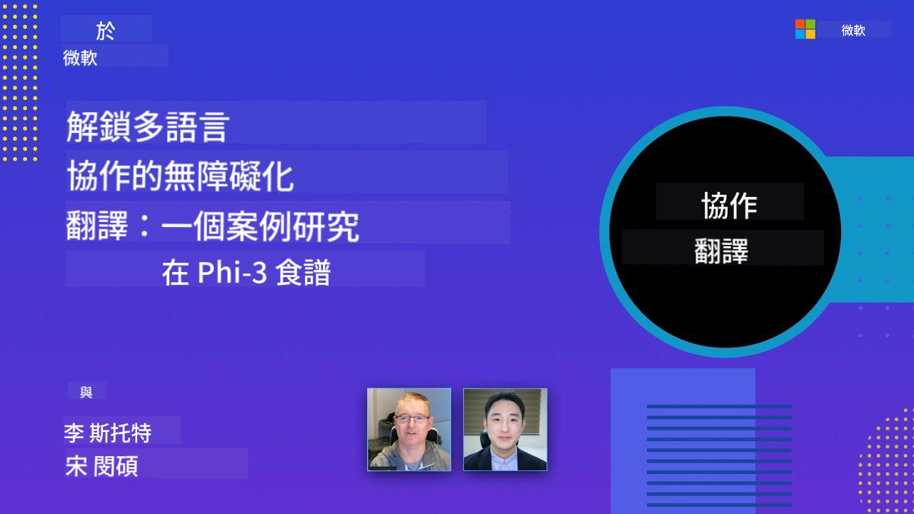

<!--
CO_OP_TRANSLATOR_METADATA:
{
  "original_hash": "044724537b57868117aadae8e7728c7c",
  "translation_date": "2025-06-12T10:01:19+00:00",
  "source_file": "README.md",
  "language_code": "mo"
}
-->


# Co-op Translator: Automatiza la Traducción de Documentación Educativa sin Esfuerzo

_Automatiza fácilmente la traducción de tu documentación a múltiples idiomas para alcanzar una audiencia global._

[](https://pypi.org/project/co-op-translator/)
[](https://github.com/azure/co-op-translator/blob/main/LICENSE)
[](https://pepy.tech/project/co-op-translator)
[](https://pepy.tech/project/co-op-translator)
[](https://github.com/psf/black)

[](https://GitHub.com/azure/co-op-translator/graphs/contributors/)
[](https://GitHub.com/azure/co-op-translator/issues/)
[](https://GitHub.com/azure/co-op-translator/pulls/)
[](http://makeapullrequest.com)

### Soporte de Idiomas Potenciado por Co-op Translator
[French](../fr/README.md) | [Spanish](../es/README.md) | [German](../de/README.md) | [Russian](../ru/README.md) | [Arabic](../ar/README.md) | [Persian (Farsi)](../fa/README.md) | [Urdu](../ur/README.md) | [Chinese (Simplified)](../zh/README.md) | [Chinese (Traditional, Macau)](./README.md) | [Chinese (Traditional, Hong Kong)](../hk/README.md) | [Chinese (Traditional, Taiwan)](../tw/README.md) | [Japanese](../ja/README.md) | [Korean](../ko/README.md) | [Hindi](../hi/README.md) | [Bengali](../bn/README.md) | [Marathi](../mr/README.md) | [Nepali](../ne/README.md) | [Punjabi (Gurmukhi)](../pa/README.md) | [Portuguese (Portugal)](../pt/README.md) | [Portuguese (Brazil)](../br/README.md) | [Italian](../it/README.md) | [Polish](../pl/README.md) | [Turkish](../tr/README.md) | [Greek](../el/README.md) | [Thai](../th/README.md) | [Swedish](../sv/README.md) | [Danish](../da/README.md) | [Norwegian](../no/README.md) | [Finnish](../fi/README.md) | [Dutch](../nl/README.md) | [Hebrew](../he/README.md) | [Vietnamese](../vi/README.md) | [Indonesian](../id/README.md) | [Malay](../ms/README.md) | [Tagalog (Filipino)](../tl/README.md) | [Swahili](../sw/README.md) | [Hungarian](../hu/README.md) | [Czech](../cs/README.md) | [Slovak](../sk/README.md) | [Romanian](../ro/README.md) | [Bulgarian](../bg/README.md) | [Serbian (Cyrillic)](../sr/README.md) | [Croatian](../hr/README.md) | [Slovenian](../sl/README.md) | [Ukrainian](../uk/README.md) | [Burmese (Myanmar)](../my/README.md)Please write the output from left to right.
> [!NOTE]
> हे या रिपॉझिटरीच्या सध्याच्या भाषांतर आहेत. Co-op Translator द्वारे समर्थित भाषांची पूर्ण यादी पाहण्यासाठी, कृपया [Language Support](../..) विभाग पहा.

[](https://GitHub.com/azure/co-op-translator/watchers/)
[](https://GitHub.com/azure/co-op-translator/network/)
[](https://GitHub.com/azure/co-op-translator/stargazers/)

[](https://discord.com/invite/ByRwuEEgH4)

[](https://codespaces.new/azure/co-op-translator)
[](https://vscode.dev/redirect?url=vscode://ms-vscode-remote.remote-containers/cloneInVolume?url=https://github.com/azure/co-op-translator)

## आढावा: तुमच्या शैक्षणिक सामग्रीच्या भाषांतरासाठी सुलभता

भाषेच्या अडथळ्यांमुळे संपूर्ण जगभरातील शिकणारे आणि विकसकांसाठी मौल्यवान शैक्षणिक स्रोत आणि तांत्रिक ज्ञान प्राप्त करणे कठीण होते. यामुळे सहभागी होण्याची संधी कमी होते आणि जागतिक नवकल्पना आणि शिक्षणाचा गती मंदावते.

**Co-op Translator** हे Microsoft च्या मोठ्या शैक्षणिक मालिकांसाठी (जसे की "For Beginners" मार्गदर्शक) मनुष्यमध्ये होणाऱ्या अकार्यक्षम भाषांतर प्रक्रियेला उत्तर देण्यासाठी तयार झाले. ते एक सोपे आणि सामर्थ्यशाली साधन म्हणून विकसित झाले आहे जे सर्वांसाठी या अडथळ्यांना तोडण्यासाठी डिझाइन केले आहे. CLI आणि GitHub Actions द्वारे उच्च दर्जाचे स्वयंचलित भाषांतर उपलब्ध करून देऊन, Co-op Translator शिक्षक, विद्यार्थी, संशोधक आणि विकसक यांना भाषा अडथळ्यांशिवाय ज्ञान सामायिक करण्यास आणि प्रवेश करण्यास सक्षम करतो.

Co-op Translator कसे भाषांतरित शैक्षणिक सामग्री व्यवस्थित करते ते पहा:


Markdown फाइल्स आणि प्रतिमेतील मजकूर स्वयंचलितपणे भाषांतरित होतात आणि भाषानुसार वेगळ्या फोल्डरमध्ये नीटनेटके ठेवले जातात.

**आजच Co-op Translator सह तुमच्या शैक्षणिक सामग्रीला जागतिक प्रवेश द्या!**

## Microsoft च्या शिक्षण संसाधनांसाठी जागतिक प्रवेशाला पाठिंबा

Co-op Translator महत्त्वाच्या Microsoft शैक्षणिक उपक्रमांसाठी भाषेचा अंतर कमी करण्यात मदत करतो, जे जागतिक विकसक समुदायासाठी रिपॉझिटरीजचे भाषांतर स्वयंचलित करतो. सध्या Co-op Translator वापरले जाणारे काही उदाहरणे:

[](https://github.com/microsoft/Generative-AI-for-beginners)
[](https://github.com/microsoft/ML-For-Beginners)
[](https://github.com/microsoft/AI-For-Beginners)
[](https://github.com/microsoft/ai-agents-for-beginners)
[](https://github.com/microsoft/PhiCookBook)
[](https://github.com/microsoft/Generative-AI-for-beginners-dotnet)

## मुख्य वैशिष्ट्ये

- **स्वयंचलित भाषांतर**: सहजपणे अनेक भाषांमध्ये मजकूर भाषांतर करा.
- **GitHub Actions एकत्रीकरण**: तुमच्या CI/CD पाईपलाइनमध्ये भाषांतर स्वयंचलित करा.
- **Markdown संरक्षक**: भाषांतरादरम्यान Markdown योग्य स्वरूप राखा.
- **प्रतिमा मजकूर भाषांतर**: प्रतिमांतील मजकूर ओळखा आणि भाषांतर करा.
- **आधुनिक LLM तंत्रज्ञान**: उच्च दर्जाचे भाषांतर करण्यासाठी अत्याधुनिक भाषा मॉडेल वापरा.
- **सुलभ एकत्रीकरण**: तुमच्या विद्यमान प्रकल्पात सहजपणे समाकलित करा.
- **लोकलायझेशन सुलभ करा**: आंतरराष्ट्रीय बाजारांसाठी प्रकल्प स्थानिकीकरण सुलभ करा.

## ते कसे काम करते


Co-op Translator तुमच्या प्रकल्पाच्या फोल्डरमधील Markdown फाइल्स आणि प्रतिमा घेऊन खालीलप्रमाणे प्रक्रिया करतो:

1. **मजकूर काढणे**: Markdown फाइल्समधून आणि (जर कॉन्फिगर केले असेल तर, उदा. Azure AI Vision सह) प्रतिमांमधील एम्बेडेड मजकूर काढतो.
1. **AI भाषांतर**: काढलेला मजकूर कॉन्फिगर केलेल्या LLM (Azure OpenAI, OpenAI, इ.) कडे भाषांतरासाठी पाठवतो.
1. **परिणाम जतन करणे**: भाषांतरित Markdown फाइल्स आणि प्रतिमा (भाषांतरित मजकूरासह) भाषानुसार वेगळ्या फोल्डरमध्ये जतन करतो, मूळ स्वरूप राखून.

## सुरुवात कशी करावी

CLI वापरून त्वरीत सुरुवात करा किंवा GitHub Actions सह पूर्ण स्वयंचलित सेटअप करा. तुमच्या कार्यप्रवाहासाठी योग्य पद्धत निवडा:

1. **Command Line (CLI)** - एकदाच भाषांतरासाठी किंवा मॅन्युअल नियंत्रणासाठी
2. **GitHub Actions** - प्रत्येक पुशवर स्वयंचलित भाषांतरासाठी

> [!NOTE]
> या ट्युटोरियलमध्ये Azure संसाधने मुख्य आहेत, पण तुम्ही कोणतेही समर्थित भाषा मॉडेल वापरू शकता.

### भाषा समर्थन

Co-op Translator अनेक भाषांचा समावेश करतो जेणेकरून तुम्ही जागतिक प्रेक्षकांपर्यंत पोहोचू शकता. माहिती पुढीलप्रमाणे:

#### जलद संदर्भ

| Language | Code | Language | Code | Language | Code |
|----------|------|----------|------|----------|------|
| Arabic | ar | Bengali | bn | Bulgarian | bg |
| Burmese (Myanmar) | my | Chinese (Simplified) | zh | Chinese (Traditional, HK) | hk |
| Chinese (Traditional, Macau) | mo | Chinese (Traditional, TW) | tw | Croatian | hr |
| Czech | cs | Danish | da | Dutch | nl |
| Finnish | fi | French | fr | German | de |
| Greek | el | Hebrew | he | Hindi | hi |
| Hungarian | hu | Indonesian | id | Italian | it |
| Japanese | ja | Korean | ko | Malay | ms |
| Marathi | mr | Nepali | ne | Norwegian | no |
| Persian (Farsi) | fa | Polish | pl | Portuguese (Brazil) | br |
| Portuguese (Portugal) | pt | Punjabi (Gurmukhi) | pa | Romanian | ro |
| Russian | ru | Serbian (Cyrillic) | sr | Slovak | sk |
| Slovenian | sl | Spanish | es | Swahili | sw |
| Swedish | sv | Tagalog (Filipino) | tl | Thai | th |
| Turkish | tr | Ukrainian | uk | Urdu | ur |
| Vietnamese | vi | — | — | — | — |

#### भाषा कोड वापरणे

Co-op Translator वापरताना, तुम्हाला भाषा कोड वापरावे लागतात. उदाहरणार्थ:

```bash
# Translate to French, Spanish, and German
translate -l "fr es de"

# Translate to Chinese (Simplified) and Japanese
translate -l "zh ja"
```

> [!NOTE]
> भाषांतर समर्थनाविषयी तांत्रिक तपशीलांसाठी, ज्यात:
>
> - प्रत्येक भाषेसाठी फॉन्ट तपशील
> - ज्ञात समस्या
> - नवीन भाषा कशी जोडायची
>
> आमचे [Supported Languages Documentation](./getting_started/supported-languages.md) पहा.

### समर्थित मॉडेल आणि सेवा

| प्रकार                  | नाव                           |
|-----------------------|--------------------------------|
| Language Model        |   |
| AI Vision       |  |

> [!NOTE]
> जर AI Vision सेवा उपलब्ध नसेल, तर co-op translator [Markdown-only mode](./getting_started/markdown-only-mode.md) मध्ये स्विच करेल.

### प्राथमिक सेटअप

सुरू करण्यापूर्वी खालील संसाधने तयार करा:

1. भाषा मॉडेल संसाधन (आवश्यक):
   - Azure OpenAI (शिफारस केलेले) - एंटरप्राइझ दर्जाचे विश्वासार्ह उच्च दर्जाचे भाषांतर प्रदान करते
   - OpenAI - Azure प्रवेश नसल्यास पर्यायी पर्याय
   - समर्थित मॉडेल्स विषयी तपशीलासाठी [Supported Models and Services](../..) पहा

1. AI Vision संसाधन (पर्यायी):
   - Azure AI Vision - प्रतिमांमधील मजकूर भाषांतर करण्यासाठी
   - कॉन्फिगर न केल्यास, ट्रान्सलेटर आपोआप [Markdown-only mode](./getting_started/markdown-only-mode.md) वापरेल
   - प्रतिमांमध्ये मजकूर असल्यास शिफारस केले जाते

1. कॉन्फिगरेशन चरण:
   - आमच्या [Azure AI सेटअप मार्गदर्शक](./getting_started/set-up-azure-ai.md) मधील तपशीलवार सूचना पाळा
   - API की आणि एंडपॉइंटसह `.env` फाइल तयार करा (पहा [Quick Start](../..) विभाग)
   - निवडलेल्या सेवांसाठी आवश्यक परवानग्या आणि कोटा सुनिश्चित करा

### भाषांतरापूर्वी प्रकल्प सेटअप

भाषांतर सुरू करण्यापूर्वी, प्रकल्प तयार करण्यासाठी खालील पावले उचलाः

1. तुमचा README तयार करा:
   - README.md मध्ये भाषांतरित आवृत्त्यांसाठी लिंक असलेली टेबल जोडा
   - उदाहरण स्वरूप:

     ```markdown

     ### 🌐 Multi-Language Support
     
     [French](../fr/README.md) | [Spanish](../es/README.md) | [German](../de/README.md) | [Russian](../ru/README.md) | [Arabic](../ar/README.md) | [Persian (Farsi)](../fa/README.md) | [Urdu](../ur/README.md) | [Chinese (Simplified)](../zh/README.md) | [Chinese (Traditional, Macau)](./README.md) | [Chinese (Traditional, Hong Kong)](../hk/README.md) | [Chinese (Traditional, Taiwan)](../tw/README.md) | [Japanese](../ja/README.md) | [Korean](../ko/README.md) | [Hindi](../hi/README.md) | [Bengali](../bn/README.md) | [Marathi](../mr/README.md) | [Nepali](../ne/README.md) | [Punjabi (Gurmukhi)](../pa/README.md) | [Portuguese (Portugal)](../pt/README.md) | [Portuguese (Brazil)](../br/README.md) | [Italian](../it/README.md) | [Polish](../pl/README.md) | [Turkish](../tr/README.md) | [Greek](../el/README.md) | [Thai](../th/README.md) | [Swedish](../sv/README.md) | [Danish](../da/README.md) | [Norwegian](../no/README.md) | [Finnish](../fi/README.md) | [Dutch](../nl/README.md) | [Hebrew](../he/README.md) | [Vietnamese](../vi/README.md) | [Indonesian](../id/README.md) | [Malay](../ms/README.md) | [Tagalog (Filipino)](../tl/README.md) | [Swahili](../sw/README.md) | [Hungarian](../hu/README.md) | [Czech](../cs/README.md) | [Slovak](../sk/README.md) | [Romanian](../ro/README.md) | [Bulgarian](../bg/README.md) | [Serbian (Cyrillic)](../sr/README.md) | [Croatian](../hr/README.md) | [Slovenian](../sl/README.md) | [Ukrainian](../uk/README.md) | [Burmese (Myanmar)](../my/README.md) 
    
     ```

1. विद्यमान भाषांतर साफ करा (आवश्यक असल्यास):
   - विद्यमान भाषांतर फोल्डर (उदा. `translations/`) काढून टाका
   - जुनी भाषांतर फाइल्स हटवा जेणेकरून नवीन प्रक्रियेत कोणताही संघर्ष होणार नाही

### जलद सुरुवात: कमांड लाइन

कमांड लाइन वापरून लवकर सुरुवात करण्यासाठी:

1. व्हर्च्युअल एन्व्हायर्नमेंट तयार करा:

    ```bash
    python -m venv .venv
    ```

1. व्हर्च्युअल एन्व्हायर्नमेंट सक्रिय करा:

    - Windows वर:

    ```bash
    .venv\scripts\activate
    ```

    - Linux/macOS वर:

    ```bash
    source .venv/bin/activate
    ```

1. पॅकेज इन्स्टॉल करा:

    ```bash
    pip install co-op-translator
    ```

1. क्रेडेन्शियल्स कॉन्फिगर करा:

    - `.env` file in your project's root directory.
    - Copy the contents from the [.env.template](../../.env.template) file into your new `.env` file.
    - Fill in the required API keys and endpoint information in your `.env` file.

1. Run Translation:
    - Navigate to your project's root directory in your terminal.
    - Execute the translate command, specifying target languages with the `-l` फ्लॅग तयार करा:

    ```bash
    translate -l "ko ja fr"
    ```

_(Replace `"ko ja fr"` with your desired space-separated language codes)_

### Detailed Usage Guides

Choose the approach that best fits your workflow:

#### 1. Using the Command Line (CLI)

- Best for: One-time translations, manual control, or integration into custom scripts.
- Requires: Local installation of Python and the `co-op-translator` package.
- Guide: [Command Line Guide](./getting_started/command-line-guide/command-line-guide.md)

#### 2. Using GitHub Actions (Automation)

- Best for: Automatically translating content whenever changes are pushed to your repository. Keeps translations consistently up-to-date.
- Requires: Setting up a workflow file (`.github/workflows`) तुमच्या रिपॉझिटरीमध्ये. स्थानिक इन्स्टॉलेशनची गरज नाही.
- मार्गदर्शक:
  - [GitHub Actions Guide (Public Repositories & Standard Secrets)](./getting_started/github-actions-guide/github-actions-guide-public.md) - बहुतेक सार्वजनिक किंवा वैयक्तिक रिपॉझिटरीजसाठी वापरा जे स्टँडर्ड रिपॉझिटरी सिक्रेट्सवर अवलंबून आहेत.
  - [GitHub Actions Guide (Microsoft Organization Repos & Org-Level Setups)](./getting_started/github-actions-guide/github-actions-guide-org.md) - Microsoft GitHub संस्थेत काम करत असल्यास किंवा संघटनात्मक स्तरावरील सिक्रेट्स किंवा रनर्स वापरण्याची गरज असल्यास हा मार्गदर्शक वापरा.

### समस्या निवारण आणि टिपा

- [Troubleshooting Guide](./getting_started/troubleshooting.md)

### अतिरिक्त संसाधने

- [Command Reference](./getting_started/command-reference.md): सर्व उपलब्ध कमांड्स आणि पर्यायांसाठी सविस्तर मार्गदर्शक.
- [Supported Languages](./getting_started/supported-languages.md): समर्थित भाषांची यादी आणि नवीन भाषा जोडण्याच्या सूचना.
- [Markdown-Only Mode](./getting_started/markdown-only-mode.md): फक्त मजकूर भाषांतर कसे करायचे, प्रतिमा भाषांतराशिवाय.

## व्हिडिओ सादरीकरणे

Co-op Translator बद्दल अधिक जाणून घ्या आमच्या सादरीकरणांद्वारे _(खालील प्रतिमा क्लिक करून YouTube वर पाहा.)_:

- **Open at Microsoft**: Co-op Translator कसा वापरायचा यावर 18 मिनिटांचे संक्षिप्त परिचय आणि जलद मार्गदर्शक.
[](https://www.youtube.com/watch?v=jX_swfH_KNU)

## Support Us and Foster Global Learning

Join us in transforming how educational content is shared worldwide! Give [Co-op Translator](https://github.com/azure/co-op-translator) a ⭐ on GitHub and help us break down language barriers in learning and technology. Your interest and contributions make a real difference! Code contributions and feature ideas are always appreciated.

## Contributing

This project welcomes contributions and suggestions. Interested in helping with Azure Co-op Translator? Please check our [CONTRIBUTING.md](./CONTRIBUTING.md) for guidelines on how you can help make Co-op Translator more accessible.

## Contributors

[](https://github.com/Azure/co-op-translator/graphs/contributors)

## Code of Conduct

This project follows the [Microsoft Open Source Code of Conduct](https://opensource.microsoft.com/codeofconduct/).  
For more details, see the [Code of Conduct FAQ](https://opensource.microsoft.com/codeofconduct/faq/) or  
contact [opencode@microsoft.com](mailto:opencode@microsoft.com) with any questions or feedback.

## Responsible AI

Microsoft is dedicated to helping our customers use AI responsibly, sharing insights, and building trust through tools like Transparency Notes and Impact Assessments. Many resources are available at [https://aka.ms/RAI](https://aka.ms/RAI).  
Microsoft’s approach to responsible AI is based on principles of fairness, reliability and safety, privacy and security, inclusiveness, transparency, and accountability.

Large-scale natural language, image, and speech models—like those used in this sample—can sometimes behave in ways that are unfair, unreliable, or offensive, potentially causing harm. Please refer to the [Azure OpenAI service Transparency note](https://learn.microsoft.com/legal/cognitive-services/openai/transparency-note?tabs=text) to learn about risks and limitations.

To reduce these risks, it’s recommended to include a safety system in your architecture that detects and prevents harmful behavior. [Azure AI Content Safety](https://learn.microsoft.com/azure/ai-services/content-safety/overview) offers an independent protection layer that can identify harmful user-generated and AI-generated content in apps and services. Azure AI Content Safety includes text and image APIs to help detect harmful material. We also provide an interactive Content Safety Studio where you can view, explore, and try sample code for detecting harmful content across different formats. The following [quickstart documentation](https://learn.microsoft.com/azure/ai-services/content-safety/quickstart-text?tabs=visual-studio%2Clinux&pivots=programming-language-rest) guides you through making requests to the service.

Another important factor is overall application performance. In multi-modal and multi-model applications, performance means the system behaves as you and your users expect, including avoiding harmful outputs. It’s important to evaluate your application’s performance using [generation quality and risk and safety metrics](https://learn.microsoft.com/azure/ai-studio/concepts/evaluation-metrics-built-in).

You can assess your AI application in your development environment using the [prompt flow SDK](https://microsoft.github.io/promptflow/index.html). Whether using a test dataset or a target, your generative AI outputs are quantitatively measured with built-in or custom evaluators. To get started with the prompt flow SDK for evaluation, follow the [quickstart guide](https://learn.microsoft.com/azure/ai-studio/how-to/develop/flow-evaluate-sdk). After running an evaluation, you can [visualize the results in Azure AI Studio](https://learn.microsoft.com/azure/ai-studio/how-to/evaluate-flow-results).

## Trademarks

This project may include trademarks or logos for projects, products, or services. Authorized use of Microsoft trademarks or logos must comply with  
[Microsoft's Trademark & Brand Guidelines](https://www.microsoft.com/en-us/legal/intellectualproperty/trademarks/usage/general).  
Using Microsoft trademarks or logos in modified versions of this project must not cause confusion or suggest Microsoft sponsorship.  
Use of third-party trademarks or logos is subject to the policies of those third parties.

**Disclaimer**:  
This document has been translated using AI translation service [Co-op Translator](https://github.com/Azure/co-op-translator). While we strive for accuracy, please be aware that automated translations may contain errors or inaccuracies. The original document in its native language should be considered the authoritative source. For critical information, professional human translation is recommended. We are not liable for any misunderstandings or misinterpretations arising from the use of this translation.