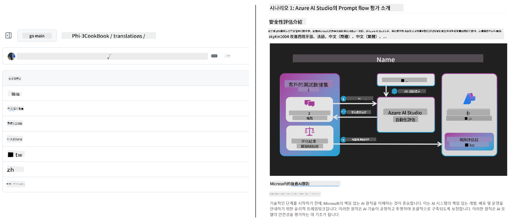

<!--
CO_OP_TRANSLATOR_METADATA:
{
  "original_hash": "044724537b57868117aadae8e7728c7c",
  "translation_date": "2025-06-14T12:47:56+00:00",
  "source_file": "README.md",
  "language_code": "mo"
}
-->

# Co-op Translator：輕鬆自動化教育文件翻譯

_輕鬆自動化將您的文件翻譯成多種語言，以觸及全球受眾。_

### 語言支援由 Co-op Translator 提供
[法文](../fr/README.md) | [西班牙文](../es/README.md) | [德文](../de/README.md) | [俄文](../ru/README.md) | [阿拉伯文](../ar/README.md) | [波斯文（法爾西語）](../fa/README.md) | [烏爾都文](../ur/README.md) | [中文（簡體）](../zh/README.md) | [中文（繁體，澳門）](./README.md) | [中文（繁體，香港）](../hk/README.md) | [中文（繁體，台灣）](../tw/README.md) | [日文](../ja/README.md) | [韓文](../ko/README.md) | [印地文](../hi/README.md) | [孟加拉文](../bn/README.md) | [馬拉地文](../mr/README.md) | [尼泊爾文](../ne/README.md) | [旁遮普文（古爾穆基文）](../pa/README.md) | [葡萄牙文（葡萄牙）](../pt/README.md) | [葡萄牙文（巴西）](../br/README.md) | [意大利文](../it/README.md) | [波蘭文](../pl/README.md) | [土耳其文](../tr/README.md) | [希臘文](../el/README.md) | [泰文](../th/README.md) | [瑞典文](../sv/README.md) | [丹麥文](../da/README.md) | [挪威文](../no/README.md) | [芬蘭文](../fi/README.md) | [荷蘭文](../nl/README.md) | [希伯來文](../he/README.md) | [越南文](../vi/README.md) | [印尼文](../id/README.md) | [馬來文](../ms/README.md) | [塔加洛語（菲律賓語）](../tl/README.md) | [斯瓦希里文](../sw/README.md) | [匈牙利文](../hu/README.md) | [捷克文](../cs/README.md) | [斯洛伐克文](../sk/README.md) | [羅馬尼亞文](../ro/README.md) | [保加利亞文](../bg/README.md) | [塞爾維亞文（西里爾字母）](../sr/README.md) | [克羅地亞文](../hr/README.md) | [斯洛文尼亞文](../sl/README.md) | [烏克蘭文](../uk/README.md) | [緬甸文（緬甸）](../my/README.md)
> [!NOTE]
> 這些是目前此資料庫內容的翻譯。欲查看 Co-op Translator 支援的完整語言列表，請參閱 [語言支援](../..) 部分。

## 概述：簡化您的教育內容翻譯

語言障礙嚴重影響全球學習者和開發者獲取有價值的教育資源和技術知識的能力。這限制了參與並減緩全球創新和學習的步伐。

**Co-op Translator** 源自於解決微軟自家大型教育系列（如「給初學者的指南」）的低效手動翻譯流程的需求。它已演變成一個易於使用且功能強大的工具，旨在為每個人打破這些障礙。透過 CLI 和 GitHub Actions 提供高品質的自動翻譯，Co-op Translator 使教育工作者、學生、研究人員和開發者能夠在全球範圍內分享和獲取知識，無需受限於語言。

查看 Co-op Translator 如何組織翻譯的教育內容：

Markdown 文件和圖片文本會自動翻譯並整齊地組織到語言特定的文件夾中。

**立即使用 Co-op Translator 解鎖您的教育內容的全球訪問！**

## 支援微軟學習資源的全球訪問

Co-op Translator 幫助微軟的主要教育計劃跨越語言障礙，為服務全球開發者社區的資料庫自動化翻譯流程。目前使用 Co-op Translator 的例子包括：

## 主要功能

- **自動翻譯**：輕鬆將文本翻譯成多種語言。
- **GitHub Actions 整合**：將翻譯自動化為 CI/CD 管道的一部分。
- **Markdown 保留**：在翻譯過程中維持正確的 Markdown 語法。
- **圖片文本翻譯**：提取並翻譯圖片中的文本。
- **先進的 LLM 技術**：使用尖端的語言模型進行高品質翻譯。
- **輕鬆整合**：無縫整合到您的現有專案設置中。
- **簡化本地化**：簡化將您的專案本地化到國際市場的過程。

## 工作原理

Co-op Translator 從您的專案文件夾中提取 Markdown 文件和圖片並進行如下處理：

1. **文本提取**：從 Markdown 文件中提取文本，並在配置時（例如使用 Azure AI Vision）提取嵌入圖片中的文本。
2. **AI 翻譯**：將提取的文本發送到配置的 LLM（Azure OpenAI、OpenAI 等）進行翻譯。
3. **結果保存**：將翻譯後的 Markdown 文件和圖片（包含翻譯文本）保存到語言特定的文件夾中，保留原始格式。

## 快速入門

快速入門 CLI 或設置完整自動化 GitHub Actions。選擇最適合您工作流程的方法：

1. **命令行（CLI）** - 用於一次性翻譯或手動控制
2. **GitHub Actions** - 用於每次推送時自動翻譯

> [!NOTE]
> 雖然此教程專注於 Azure 資源，您可以使用任何支援的語言模型。

### 語言支援

Co-op Translator 支援多種語言，幫助您觸達全球觀眾。以下是您需要知道的：

#### 快速參考

| 語言 | 代碼 | 語言 | 代碼 | 語言 | 代碼 |
|------|------|------|------|------|------|
| 阿拉伯語 | ar | 孟加拉語 | bn | 保加利亞語 | bg |
| 緬甸語（緬甸） | my | 中文（簡體） | zh | 中文（繁體，香港） | hk |
| 中文（繁體，澳門） | mo | 中文（繁體，台灣） | tw | 克羅埃西亞語 | hr |
| 捷克語 | cs | 丹麥語 | da | 荷蘭語 | nl |
| 芬蘭語 | fi | 法語 | fr | 德語 | de |
| 希臘語 | el | 希伯來語 | he | 印地語 | hi |
| 匈牙利語 | hu | 印尼語 | id | 意大利語 | it |
| 日語 | ja | 韓語 | ko | 馬來語 | ms |
| 馬拉地語 | mr | 尼泊爾語 | ne | 挪威語 | no |
| 波斯語（法西語） | fa | 波蘭語 | pl | 葡萄牙語（巴西） | br |
| 葡萄牙語（葡萄牙） | pt | 旁遮普語（古魯穆基語） | pa | 羅馬尼亞語 | ro |
| 俄語 | ru | 塞爾維亞語（西里爾字母） | sr | 斯洛伐克語 | sk |
| 斯洛文尼亞語 | sl | 西班牙語 | es | 斯瓦希里語 | sw |
| 瑞典語 | sv | 塔加洛語（菲律賓語） | tl | 泰語 | th |
| 土耳其語 | tr | 烏克蘭語 | uk | 烏爾都語 | ur |
| 越南語 | vi | — | — | — | — |

#### 使用語言代碼

使用 Co-op Translator 時，您需要使用代碼指定語言。例如：

> [!NOTE]
> 有關語言支援的詳細技術信息，包括：
>
> - 每種語言的字體規格
> - 已知問題
> - 如何添加新語言
>
> 請參閱我們的 [支援語言文檔](./getting_started/supported-languages.md)。

### 支援的模型和服務

| 類型                  | 名稱                           |
|-----------------------|--------------------------------|
| 語言模型              |   |
| AI Vision       |  |

> [!NOTE]
> 如果 AI vision 服務不可用，co-op translator 將切換到 [僅 Markdown 模式](./getting_started/markdown-only-mode.md)。

### 初始設置

在開始之前，您需要設置以下資源：

1. 語言模型資源（必需）：
   - Azure OpenAI（推薦） - 提供高品質翻譯，具有企業級可靠性
   - OpenAI - 如果您沒有 Azure 訪問權限，則為替代選項
   - 有關支援模型的詳細信息，請參閱 [支援的模型和服務](../..)

2. AI Vision 資源（可選）：
   - Azure AI Vision - 使圖片中的文本翻譯成可能
   - 如果未配置，翻譯器將自動使用 [僅 Markdown 模式](./getting_started/markdown-only-mode.md)
   - 對於需要翻譯的圖片包含文本的專案，推薦使用

3. 配置步驟：
   - 遵循我們的 [Azure AI 設置指南](./getting_started/set-up-azure-ai.md) 獲得詳細指導
   - 創建 `.env` 文件，包含您的 API 密鑰和端點（請參閱 [快速開始](../..) 部分）
   - 確保您擁有所選服務的必要權限和配額

### 翻譯前的專案設置

在開始翻譯過程之前，請遵循以下步驟準備您的專案：

1. 準備您的 README：
   - 在 README.md 中添加翻譯表以鏈接到翻譯版本
   - 範例格式：

1. 清理現有翻譯（如果需要）：
   - 移除任何現有的翻譯文件夾（例如 `translations/`）
   - 刪除任何舊的翻譯文件以開始新的一輪
   - 這確保與新翻譯過程不會發生衝突

### 快速開始：命令行

使用命令行快速開始：

1. 創建虛擬環境：

1. 激活虛擬環境：

    - 在 Windows 上：

    - 在 Linux/macOS 上：

1. 安裝包：

1. 配置憑證：

    - 創建 `.env` file in your project's root directory.
    - Copy the contents from the [.env.template](../../.env.template) file into your new `.env` file.
    - Fill in the required API keys and endpoint information in your `.env` file.

1. Run Translation:
    - Navigate to your project's root directory in your terminal.
    - Execute the translate command, specifying target languages with the `-l` 標誌：

    _(替換 `"ko ja fr"` with your desired space-separated language codes)_

### Detailed Usage Guides

Choose the approach that best fits your workflow:

#### 1. Using the Command Line (CLI)

- Best for: One-time translations, manual control, or integration into custom scripts.
- Requires: Local installation of Python and the `co-op-translator` package.
- Guide: [Command Line Guide](./getting_started/command-line-guide/command-line-guide.md)

#### 2. Using GitHub Actions (Automation)

- Best for: Automatically translating content whenever changes are pushed to your repository. Keeps translations consistently up-to-date.
- Requires: Setting up a workflow file (`.github/workflows`) 在您的資料庫中。無需本地安裝。
- 指南：
  - [GitHub Actions 指南（公共資料庫和標準機密）](./getting_started/github-actions-guide/github-actions-guide-public.md) - 用於依賴標準資料庫機密的大多數公共或個人資料庫。
  - [GitHub Actions 指南（微軟組織資料庫和組織級設置）](./getting_started/github-actions-guide/github-actions-guide-org.md) - 如果您在微軟 GitHub 組織內工作或需要利用組織級機密或運行器，請使用此指南。

### 故障排除和提示

- [故障排除指南](./getting_started/troubleshooting.md)

### 其他資源

- [命令參考](./getting_started/command-reference.md)：所有可用命令和選項的詳細指南。
- [支援語言](./getting_started/supported-languages.md)：查看支援語言列表以及添加新語言的說明。
- [僅 Markdown 模式](./getting_started/markdown-only-mode.md)：如何僅翻譯文本，而不翻譯圖片。

## 視頻演示

通過我們的演示了解更多關於 Co-op Translator 的信息 _(點擊下方圖片觀看 YouTube。)_：

- **在微軟開放**：簡短的 18 分鐘介紹和使用 Co-op Translator 的快速指南。

## 支持我們並促進全球學習

加入我們，共同革命性地改變全球教育內容的分享方式！在GitHub上給予[Co-op Translator](https://github.com/azure/co-op-translator)一顆⭐，支持我們打破語言障礙的使命，促進學習和技術。您的興趣和貢獻將產生重大影響！歡迎提供程式碼貢獻和功能建議。

## 貢獻

此專案歡迎貢獻和建議。對Azure Co-op Translator感興趣並想要貢獻嗎？請參閱我們的[CONTRIBUTING.md](./CONTRIBUTING.md)了解如何幫助使Co-op Translator更易於使用。

## 貢獻者

## 行為準則

此專案採用了[Microsoft開源行為準則](https://opensource.microsoft.com/codeofconduct/)。欲了解更多信息，請參閱[行為準則常見問題](https://opensource.microsoft.com/codeofconduct/faq/)或聯繫[opencode@microsoft.com](mailto:opencode@microsoft.com)以提出其他問題或意見。

## 負責任的人工智能

Microsoft致力於幫助客戶負責任地使用我們的AI產品，分享我們的學習成果，並通過工具如透明度說明和影響評估建立基於信任的合作夥伴關係。許多這些資源可以在[https://aka.ms/RAI](https://aka.ms/RAI)找到。Microsoft對負責任AI的方式是基於我們的AI原則：公平性、可靠性和安全性、隱私和安全性、包容性、透明度和問責制。

大型自然語言、圖像和語音模型——如本範例中使用的模型——可能會以不公平、不可靠或冒犯的方式行為，從而造成傷害。請參閱[Azure OpenAI服務透明度說明](https://learn.microsoft.com/legal/cognitive-services/openai/transparency-note?tabs=text)以了解風險和限制。

減輕這些風險的建議方法是在您的架構中包含一個安全系統，以檢測和防止有害行為。[Azure AI內容安全](https://learn.microsoft.com/azure/ai-services/content-safety/overview)提供了一個獨立的保護層，能夠在應用程式和服務中檢測有害的用戶生成和AI生成內容。Azure AI內容安全包括文本和圖像API，允許您檢測有害材料。我們還有一個互動式內容安全工作室，允許您查看、探索和嘗試檢測不同模式下有害內容的範例代碼。以下[快速入門文檔](https://learn.microsoft.com/azure/ai-services/content-safety/quickstart-text?tabs=visual-studio%2Clinux&pivots=programming-language-rest)指導您如何向服務發出請求。

另一個需要考慮的方面是整體應用程式性能。在多模態和多模型應用程式中，我們認為性能是指系統如您和您的用戶所期望的那樣運行，包括不生成有害輸出。重要的是使用[生成質量和風險與安全性指標](https://learn.microsoft.com/azure/ai-studio/concepts/evaluation-metrics-built-in)來評估整體應用程式的性能。

您可以在開發環境中使用[prompt flow SDK](https://microsoft.github.io/promptflow/index.html)評估您的AI應用程式。給定測試數據集或目標，您的生成AI應用程式生成會通過內置評估器或您選擇的自定義評估器進行定量測量。要開始使用prompt flow SDK評估您的系統，您可以遵循[快速入門指南](https://learn.microsoft.com/azure/ai-studio/how-to/develop/flow-evaluate-sdk)。執行評估後，您可以在[Azure AI Studio中可視化結果](https://learn.microsoft.com/azure/ai-studio/how-to/evaluate-flow-results)。

## 商標

此專案可能包含專案、產品或服務的商標或標誌。Microsoft商標或標誌的授權使用需遵循[Microsoft商標及品牌指南](https://www.microsoft.com/en-us/legal/intellectualproperty/trademarks/usage/general)。在此專案的修改版本中使用Microsoft商標或標誌不得引起混淆或暗示Microsoft的贊助。任何第三方商標或標誌的使用需遵循該第三方的政策。

**免責聲明**：  
本文檔是使用AI翻譯服務[Co-op Translator](https://github.com/Azure/co-op-translator)翻譯的。我們力求準確，但請注意，自動翻譯可能包含錯誤或不準確之處。應將原始語言的文件視為權威來源。對於關鍵信息，建議使用專業人工翻譯。對於因使用此翻譯而引起的任何誤解或誤釋，我們概不負責。