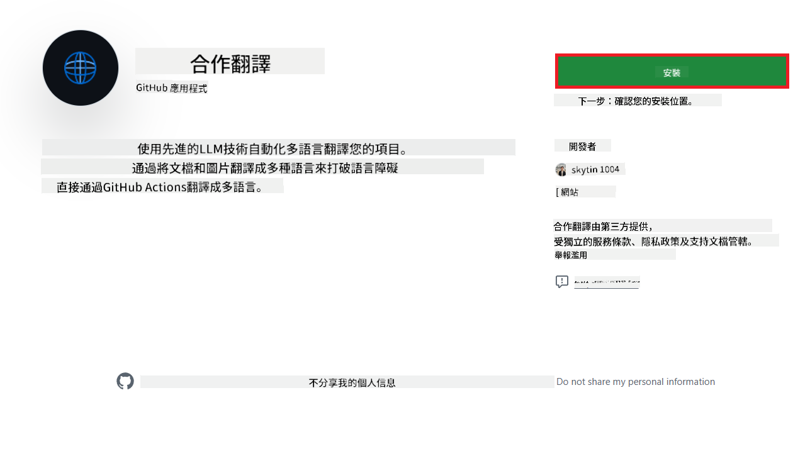
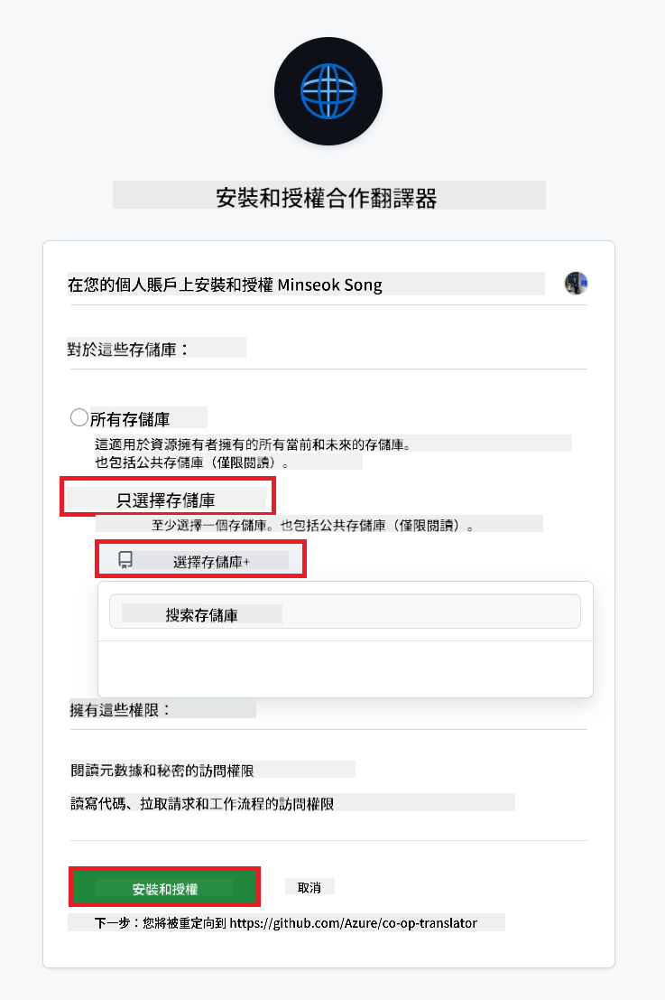
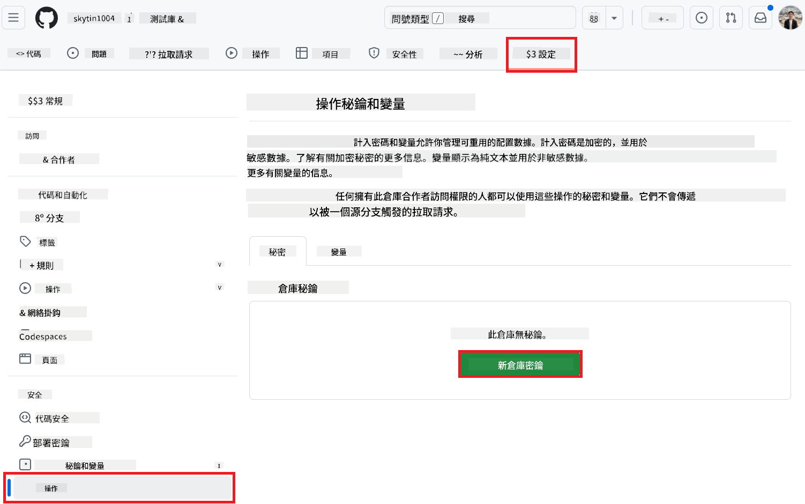
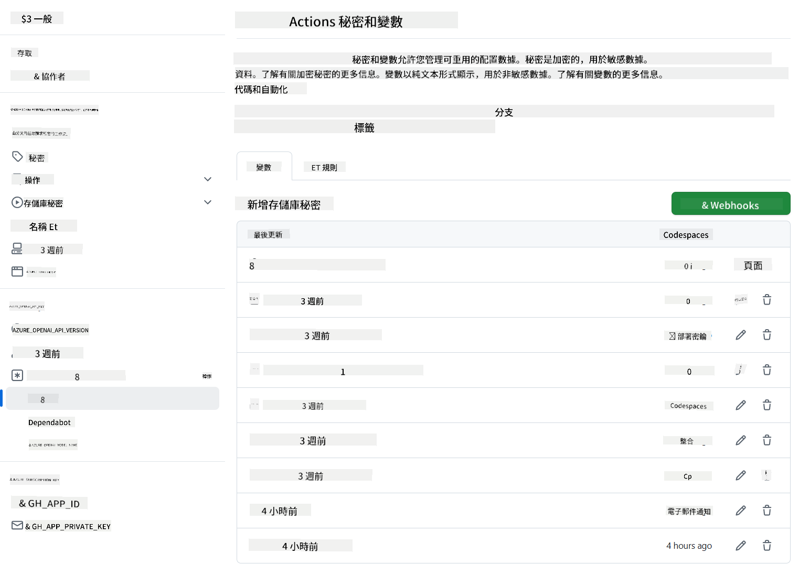

<!--
CO_OP_TRANSLATOR_METADATA:
{
  "original_hash": "c437820027c197f25fb2cbee95bae28c",
  "translation_date": "2025-06-14T12:50:53+00:00",
  "source_file": "getting_started/github-actions-guide/github-actions-guide-org.md",
  "language_code": "mo"
}
-->
# 使用 Co-op Translator GitHub Action（組織指南）

**目標讀者：** 本指南適用於 **Microsoft 內部用戶** 或 **擁有預建 Co-op Translator GitHub App 所需憑證的團隊**，或者能夠創建自己的自定義 GitHub App。

使用 Co-op Translator GitHub Action 自動化翻譯您的存儲庫文檔。此指南將引導您設置該操作，以便在您的源 Markdown 文件或圖片更改時，自動創建包含更新翻譯的拉取請求。

> **選擇合適的指南：**
>
> 本指南詳細介紹使用 **GitHub App ID 和私鑰** 的設置。如果您通常需要此「組織指南」方法，原因如下：**`GITHUB_TOKEN` 權限受限：** 您的組織或存儲庫設置限制了授予標準 `GITHUB_TOKEN` 的默認權限。具體來說，如果 `GITHUB_TOKEN` 不允許必要的 `write` 權限（例如 `contents: write` 或 `pull-requests: write`），則 [公共設置指南](./github-actions-guide-public.md) 中的工作流程將因權限不足而失敗。使用具有明確授予權限的專用 GitHub App 可以繞過此限制。
>
> **如果上述情況不適用於您：**
>
> 如果標準 `GITHUB_TOKEN` 在您的存儲庫中擁有足夠的權限（即您未被組織限制阻止），請使用 **[公共設置指南使用 GITHUB_TOKEN](./github-actions-guide-public.md)**。公共指南不需要獲取或管理 App ID 或私鑰，僅依賴於標準 `GITHUB_TOKEN` 和存儲庫權限。

## 先決條件

在配置 GitHub Action 之前，請確保您已準備好必要的 AI 服務憑證。

**1. 必需：AI 語言模型憑證**
您需要至少一個支持的語言模型的憑證：

- **Azure OpenAI**：需要端點、API 密鑰、模型/部署名稱、API 版本。
- **OpenAI**：需要 API 密鑰，（可選：組織 ID、基礎 URL、模型 ID）。
- 詳情請參閱 [支持的模型和服務](../../../../README.md)。
- 設置指南：[設置 Azure OpenAI](../set-up-resources/set-up-azure-openai.md)。

**2. 可選：計算機視覺憑證（用於圖片翻譯）**

- 僅在需要翻譯圖片中的文本時才需要。
- **Azure Computer Vision**：需要端點和訂閱密鑰。
- 如果未提供，操作默認為 [Markdown-only 模式](../markdown-only-mode.md)。
- 設置指南：[設置 Azure Computer Vision](../set-up-resources/set-up-azure-computer-vision.md)。

## 設置和配置

按照以下步驟在您的存儲庫中配置 Co-op Translator GitHub Action：

### 步驟 1：安裝和配置 GitHub App 認證

工作流程使用 GitHub App 認證安全地與您的存儲庫交互（例如，創建拉取請求）。選擇一個選項：

#### **選項 A：安裝預建的 Co-op Translator GitHub App（僅限 Microsoft 內部使用）**

1. 前往 [Co-op Translator GitHub App](https://github.com/apps/co-op-translator) 頁面。

1. 選擇 **安裝** 並選擇您的目標存儲庫所在的帳戶或組織。

    

1. 選擇 **僅選擇存儲庫** 並選擇您的目標存儲庫（例如 `PhiCookBook`）。點擊 **安裝**。您可能需要進行身份驗證。

    

1. **獲取應用憑證（需要內部流程）：** 為了使工作流程以應用身份進行身份驗證，您需要由 Co-op Translator 團隊提供的兩條信息：
  - **App ID：** Co-op Translator 應用的唯一標識符。App ID 是：`1164076`。
  - **私鑰：** 您必須從維護者聯繫人處獲得 `.pem` 私鑰文件的 **完整內容**。**像密碼一樣對待此密鑰並保持其安全。**

1. 進入步驟 2。

#### **選項 B：使用您自己的自定義 GitHub App**

- 如果您願意，您可以創建並配置自己的 GitHub App。確保它具有對內容和拉取請求的讀寫訪問權限。您將需要其 App ID 和生成的私鑰。

### 步驟 2：配置存儲庫秘密

您需要將 GitHub App 憑證和您的 AI 服務憑證添加為加密的秘密到您的存儲庫設置中。

1. 前往您的目標 GitHub 存儲庫（例如 `PhiCookBook`）。

1. 進入 **設置** > **秘密和變量** > **操作**。

1. 在 **存儲庫秘密** 下，為以下列出的每個秘密點擊 **新建存儲庫秘密**。

   

**必需的秘密（用於 GitHub App 認證）：**

| 秘密名稱          | 描述                                      | 值來源                                     |
| :------------------- | :----------------------------------------------- | :----------------------------------------------- |
| `GH_APP_ID`          | GitHub App 的 App ID（來自步驟 1）。      | GitHub App 設置                              |
| `GH_APP_PRIVATE_KEY` | 下載的 `.pem` 文件的 **完整內容**。 | `.pem` 文件（來自步驟 1）                      |

**AI 服務秘密（根據您的先決條件添加所有適用的）：**

| 秘密名稱                         | 描述                               | 值來源                     |
| :---------------------------------- | :---------------------------------------- | :------------------------------- |
| `AZURE_SUBSCRIPTION_KEY`            | Azure AI 服務（計算機視覺）的密鑰  | Azure AI Foundry                    |
| `AZURE_AI_SERVICE_ENDPOINT`         | Azure AI 服務（計算機視覺）的端點 | Azure AI Foundry                     |
| `AZURE_OPENAI_API_KEY`              | Azure OpenAI 服務的密鑰              | Azure AI Foundry                     |
| `AZURE_OPENAI_ENDPOINT`             | Azure OpenAI 服務的端點         | Azure AI Foundry                     |
| `AZURE_OPENAI_MODEL_NAME`           | 您的 Azure OpenAI 模型名稱              | Azure AI Foundry                     |
| `AZURE_OPENAI_CHAT_DEPLOYMENT_NAME` | 您的 Azure OpenAI 部署名稱         | Azure AI Foundry                     |
| `AZURE_OPENAI_API_VERSION`          | Azure OpenAI 的 API 版本              | Azure AI Foundry                     |
| `OPENAI_API_KEY`                    | OpenAI 的 API 密鑰                        | OpenAI 平台                  |
| `OPENAI_ORG_ID`                     | OpenAI 組織 ID                    | OpenAI 平台                  |
| `OPENAI_CHAT_MODEL_ID`              | 特定 OpenAI 模型 ID                  | OpenAI 平台                    |
| `OPENAI_BASE_URL`                   | 自定義 OpenAI API 基礎 URL                | OpenAI 平台                    |



### 步驟 3：創建工作流程文件

最後，創建定義自動化工作流程的 YAML 文件。

1. 在您的存儲庫根目錄中，如果不存在，請創建 `.github/workflows/` 目錄。

1. 在 `.github/workflows/` 中創建名為 `co-op-translator.yml` 的文件。

1. 將以下內容粘貼到 co-op-translator.yml 中。

```
name: Co-op Translator

on:
  push:
    branches:
      - main

jobs:
  co-op-translator:
    runs-on: ubuntu-latest

    permissions:
      contents: write
      pull-requests: write

    steps:
      - name: Checkout repository
        uses: actions/checkout@v4
        with:
          fetch-depth: 0

      - name: Set up Python
        uses: actions/setup-python@v4
        with:
          python-version: '3.10'

      - name: Install Co-op Translator
        run: |
          python -m pip install --upgrade pip
          pip install co-op-translator

      - name: Run Co-op Translator
        env:
          PYTHONIOENCODING: utf-8
          # Azure AI Service Credentials
          AZURE_SUBSCRIPTION_KEY: ${{ secrets.AZURE_SUBSCRIPTION_KEY }}
          AZURE_AI_SERVICE_ENDPOINT: ${{ secrets.AZURE_AI_SERVICE_ENDPOINT }}

          # Azure OpenAI Credentials
          AZURE_OPENAI_API_KEY: ${{ secrets.AZURE_OPENAI_API_KEY }}
          AZURE_OPENAI_ENDPOINT: ${{ secrets.AZURE_OPENAI_ENDPOINT }}
          AZURE_OPENAI_MODEL_NAME: ${{ secrets.AZURE_OPENAI_MODEL_NAME }}
          AZURE_OPENAI_CHAT_DEPLOYMENT_NAME: ${{ secrets.AZURE_OPENAI_CHAT_DEPLOYMENT_NAME }}
          AZURE_OPENAI_API_VERSION: ${{ secrets.AZURE_OPENAI_API_VERSION }}

          # OpenAI Credentials
          OPENAI_API_KEY: ${{ secrets.OPENAI_API_KEY }}
          OPENAI_ORG_ID: ${{ secrets.OPENAI_ORG_ID }}
          OPENAI_CHAT_MODEL_ID: ${{ secrets.OPENAI_CHAT_MODEL_ID }}
          OPENAI_BASE_URL: ${{ secrets.OPENAI_BASE_URL }}
        run: |
          # =====================================================================
          # IMPORTANT: Set your target languages here (REQUIRED CONFIGURATION)
          # =====================================================================
          # Example: Translate to Spanish, French, German. Add -y to auto-confirm.
          translate -l "es fr de" -y  # <--- MODIFY THIS LINE with your desired languages

      - name: Authenticate GitHub App
        id: generate_token
        uses: tibdex/github-app-token@v1
        with:
          app_id: ${{ secrets.GH_APP_ID }}
          private_key: ${{ secrets.GH_APP_PRIVATE_KEY }}

      - name: Create Pull Request with translations
        uses: peter-evans/create-pull-request@v5
        with:
          token: ${{ steps.generate_token.outputs.token }}
          commit-message: "🌐 Update translations via Co-op Translator"
          title: "🌐 Update translations via Co-op Translator"
          body: |
            This PR updates translations for recent changes to the main branch.

            ### 📋 Changes included
            - Translated contents are available in the `translations/` directory
            - Translated images are available in the `translated_images/` directory

            ---
            🌐 Automatically generated by the [Co-op Translator](https://github.com/Azure/co-op-translator) GitHub Action.
          branch: update-translations
          base: main
          labels: translation, automated-pr
          delete-branch: true
          add-paths: |
            translations/
            translated_images/

```

4.  **自定義工作流程：**
  - **[!IMPORTANT] 目標語言：** 在 `Run Co-op Translator` step, you **MUST review and modify the list of language codes** within the `translate -l "..." -y` command to match your project's requirements. The example list (`ar de es...`) needs to be replaced or adjusted.
  - **Trigger (`on:`):** The current trigger runs on every push to `main`. For large repositories, consider adding a `paths:` filter (see commented example in the YAML) to run the workflow only when relevant files (e.g., source documentation) change, saving runner minutes.
  - **PR Details:** Customize the `commit-message`, `title`, `body`, `branch` name, and `labels` in the `Create Pull Request` step if needed.

## Credential Management and Renewal

- **Security:** Always store sensitive credentials (API keys, private keys) as GitHub Actions secrets. Never expose them in your workflow file or repository code.
- **[!IMPORTANT] Key Renewal (Internal Microsoft Users):** Be aware that Azure OpenAI key used within Microsoft might have a mandatory renewal policy (e.g., every 5 months). Ensure you update the corresponding GitHub secrets (`AZURE_OPENAI_...` 鍵）**在它們過期之前**，以防止工作流程失敗。

## 運行工作流程

一旦 `co-op-translator.yml` 文件合併到您的主分支（或配置的 `on:` trigger), the workflow will automatically run whenever changes are pushed to that branch (and match the `paths` 過濾器中指定的分支）。

如果生成或更新了翻譯，該操作將自動創建一個包含更改的拉取請求，等待您的審查和合併。

**免責聲明**：
本文件已使用AI翻譯服務[Co-op Translator](https://github.com/Azure/co-op-translator)進行翻譯。我們努力確保準確性，但請注意，自動翻譯可能包含錯誤或不準確之處。應將原始語言的文件視為權威來源。對於關鍵信息，建議尋求專業人工翻譯。我們對因使用此翻譯而產生的任何誤解或誤釋不承擔責任。