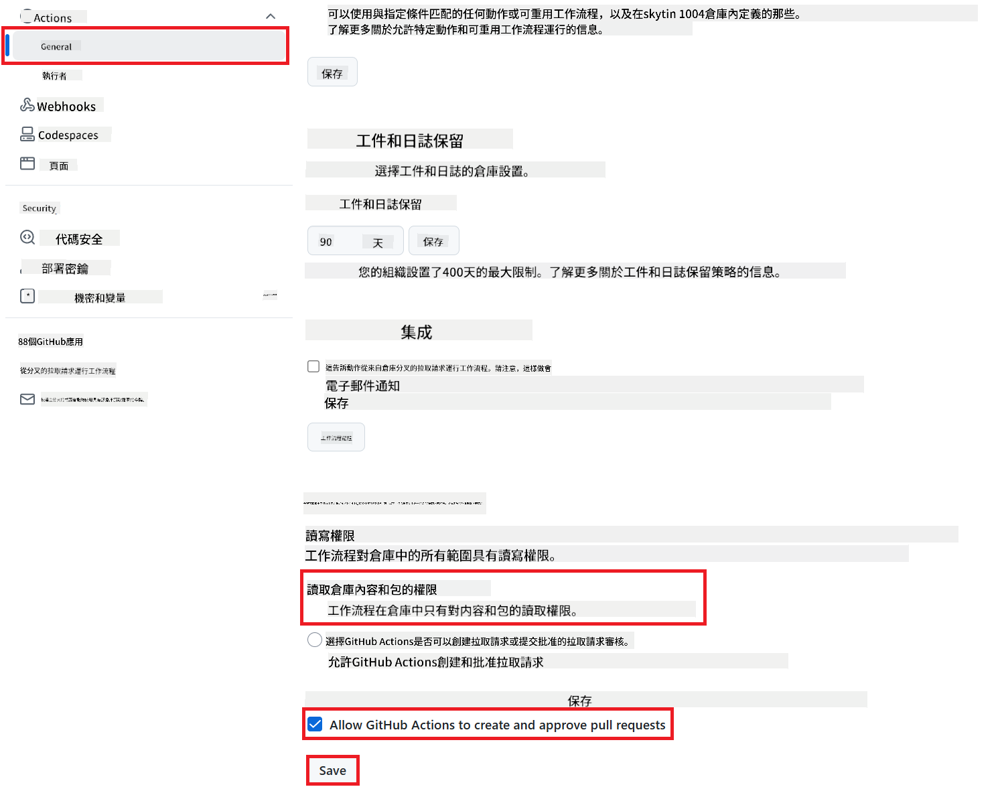

<!--
CO_OP_TRANSLATOR_METADATA:
{
  "original_hash": "a52587a512e667f70d92db853d3c61d5",
  "translation_date": "2025-06-14T12:51:15+00:00",
  "source_file": "getting_started/github-actions-guide/github-actions-guide-public.md",
  "language_code": "mo"
}
-->
# 使用 Co-op Translator GitHub Action (公開設定)

**目標受眾：** 本指南適用於大多數公共或私人存儲庫的用戶，標準 GitHub Actions 權限已足夠。它使用內建的 `GITHUB_TOKEN`。

使用 Co-op Translator GitHub Action 自動化翻譯您的存儲庫文檔。此指南將引導您設置操作，以便在源 Markdown 文件或圖像更改時自動創建更新翻譯的拉取請求。

> [!IMPORTANT]
>
> **選擇合適的指南：**
>
> 本指南詳細介紹了**使用標準 `GITHUB_TOKEN` 的簡單設置**。這是大多數用戶的推薦方法，因為它不需要管理敏感的 GitHub App 私鑰。
>

## 先決條件

在配置 GitHub Action 之前，請確保您已準備好必要的 AI 服務憑證。

**1. 必需：AI 語言模型憑證**
您需要至少一個支持的語言模型憑證：

- **Azure OpenAI**：需要端點、API 密鑰、模型/部署名稱、API 版本。
- **OpenAI**：需要 API 密鑰，（可選：組織 ID、基礎 URL、模型 ID）。
- 詳情請參見 [支持的模型和服務](../../../../README.md)。

**2. 可選：AI 視覺憑證（用於圖像翻譯）**

- 僅在需要翻譯圖像內的文本時需要。
- **Azure AI Vision**：需要端點和訂閱密鑰。
- 如果未提供，操作默認為 [僅 Markdown 模式](../markdown-only-mode.md)。

## 設置和配置

按照以下步驟在您的存儲庫中使用標準 `GITHUB_TOKEN` 配置 Co-op Translator GitHub Action。

### 步驟 1：了解身份驗證（使用 `GITHUB_TOKEN`）

此工作流程使用 GitHub Actions 提供的內建 `GITHUB_TOKEN`。此令牌根據 **步驟 3** 中配置的設置自動授予工作流程與您的存儲庫交互的權限。

### 步驟 2：配置存儲庫密碼

您只需要在存儲庫設置中添加您的 **AI 服務憑證** 作為加密密碼。

1.  進入目標 GitHub 存儲庫。
2.  前往 **Settings** > **Secrets and variables** > **Actions**。
3.  在 **Repository secrets** 下，點擊 **New repository secret**，為下列每個所需的 AI 服務密碼添加。

     *(圖片參考：顯示添加密碼的位置)*

**所需 AI 服務密碼（根據您的先決條件添加所有適用的）：**

| 密碼名稱                         | 描述                               | 值來源                     |
| :---------------------------------- | :---------------------------------------- | :------------------------------- |
| `AZURE_SUBSCRIPTION_KEY`            | Azure AI Service（計算機視覺）的密鑰  | 您的 Azure AI Foundry               |
| `AZURE_AI_SERVICE_ENDPOINT`         | Azure AI Service（計算機視覺）的端點 | 您的 Azure AI Foundry               |
| `AZURE_OPENAI_API_KEY`              | Azure OpenAI 服務的密鑰              | 您的 Azure AI Foundry               |
| `AZURE_OPENAI_ENDPOINT`             | Azure OpenAI 服務的端點         | 您的 Azure AI Foundry               |
| `AZURE_OPENAI_MODEL_NAME`           | 您的 Azure OpenAI 模型名稱              | 您的 Azure AI Foundry               |
| `AZURE_OPENAI_CHAT_DEPLOYMENT_NAME` | 您的 Azure OpenAI 部署名稱         | 您的 Azure AI Foundry               |
| `AZURE_OPENAI_API_VERSION`          | Azure OpenAI 的 API 版本              | 您的 Azure AI Foundry               |
| `OPENAI_API_KEY`                    | OpenAI 的 API 密鑰                        | 您的 OpenAI Platform              |
| `OPENAI_ORG_ID`                     | OpenAI 組織 ID（可選）         | 您的 OpenAI Platform              |
| `OPENAI_CHAT_MODEL_ID`              | 特定 OpenAI 模型 ID（可選）       | 您的 OpenAI Platform              |
| `OPENAI_BASE_URL`                   | 自定義 OpenAI API 基礎 URL（可選）     | 您的 OpenAI Platform              |

### 步驟 3：配置工作流程權限

GitHub Action 需要通過 `GITHUB_TOKEN` 授予的權限來檢出代碼並創建拉取請求。

1.  在您的存儲庫中，前往 **Settings** > **Actions** > **General**。
2.  滾動到 **Workflow permissions** 部分。
3.  選擇 **Read and write permissions**。這授予 `GITHUB_TOKEN` 這個工作流程所需的 `contents: write` 和 `pull-requests: write` 權限。
4.  確保 **Allow GitHub Actions to create and approve pull requests** 的選框已 **勾選**。
5.  選擇 **Save**。



### 步驟 4：創建工作流程文件

最後，使用 `GITHUB_TOKEN` 創建定義自動化工作流程的 YAML 文件。

1.  在您的存儲庫根目錄中，如果不存在，請創建 `.github/workflows/` 目錄。
2.  在 `.github/workflows/` 中，創建名為 `co-op-translator.yml` 的文件。
3.  將以下內容粘貼到 `co-op-translator.yml` 中。

```yaml
name: Co-op Translator

on:
  push:
    branches:
      - main

jobs:
  co-op-translator:
    runs-on: ubuntu-latest

    permissions:
      contents: write
      pull-requests: write

    steps:
      - name: Checkout repository
        uses: actions/checkout@v4
        with:
          fetch-depth: 0

      - name: Set up Python
        uses: actions/setup-python@v4
        with:
          python-version: '3.10'

      - name: Install Co-op Translator
        run: |
          python -m pip install --upgrade pip
          pip install co-op-translator

      - name: Run Co-op Translator
        env:
          PYTHONIOENCODING: utf-8
          # === AI Service Credentials ===
          AZURE_SUBSCRIPTION_KEY: ${{ secrets.AZURE_SUBSCRIPTION_KEY }}
          AZURE_AI_SERVICE_ENDPOINT: ${{ secrets.AZURE_AI_SERVICE_ENDPOINT }}
          AZURE_OPENAI_API_KEY: ${{ secrets.AZURE_OPENAI_API_KEY }}
          AZURE_OPENAI_ENDPOINT: ${{ secrets.AZURE_OPENAI_ENDPOINT }}
          AZURE_OPENAI_MODEL_NAME: ${{ secrets.AZURE_OPENAI_MODEL_NAME }}
          AZURE_OPENAI_CHAT_DEPLOYMENT_NAME: ${{ secrets.AZURE_OPENAI_CHAT_DEPLOYMENT_NAME }}
          AZURE_OPENAI_API_VERSION: ${{ secrets.AZURE_OPENAI_API_VERSION }}
          OPENAI_API_KEY: ${{ secrets.OPENAI_API_KEY }}
          OPENAI_ORG_ID: ${{ secrets.OPENAI_ORG_ID }}
          OPENAI_CHAT_MODEL_ID: ${{ secrets.OPENAI_CHAT_MODEL_ID }}
          OPENAI_BASE_URL: ${{ secrets.OPENAI_BASE_URL }}
        run: |
          # =====================================================================
          # IMPORTANT: Set your target languages here (REQUIRED CONFIGURATION)
          # =====================================================================
          # Example: Translate to Spanish, French, German. Add -y to auto-confirm.
          translate -l "es fr de" -y  # <--- MODIFY THIS LINE with your desired languages

      - name: Create Pull Request with translations
        uses: peter-evans/create-pull-request@v5
        with:
          token: ${{ secrets.GITHUB_TOKEN }}
          commit-message: "🌐 Update translations via Co-op Translator"
          title: "🌐 Update translations via Co-op Translator"
          body: |
            This PR updates translations for recent changes to the main branch.

            ### 📋 Changes included
            - Translated contents are available in the `translations/` directory
            - Translated images are available in the `translated_images/` directory

            ---
            🌐 Automatically generated by the [Co-op Translator](https://github.com/Azure/co-op-translator) GitHub Action.
          branch: update-translations
          base: main
          labels: translation, automated-pr
          delete-branch: true
          add-paths: |
            translations/
            translated_images/
```
4.  **自定義工作流程：**
  - **[!IMPORTANT] 目標語言：** 如有需要，在 `Run Co-op Translator` step, you **MUST review and modify the list of language codes** within the `translate -l "..." -y` command to match your project's requirements. The example list (`ar de es...`) needs to be replaced or adjusted.
  - **Trigger (`on:`):** The current trigger runs on every push to `main`. For large repositories, consider adding a `paths:` filter (see commented example in the YAML) to run the workflow only when relevant files (e.g., source documentation) change, saving runner minutes.
  - **PR Details:** Customize the `commit-message`, `title`, `body`, `branch` name, and `labels` in the `Create Pull Request` 步驟中進行修改。

**免責聲明**：
本文件是使用 AI 翻譯服務 [Co-op Translator](https://github.com/Azure/co-op-translator) 翻譯的。儘管我們力求準確，但請注意，自動翻譯可能包含錯誤或不準確之處。應將原語言的原始文件視為權威來源。對於關鍵信息，建議尋求專業人工翻譯。我們對使用此翻譯所產生的任何誤解或誤釋不承擔責任。