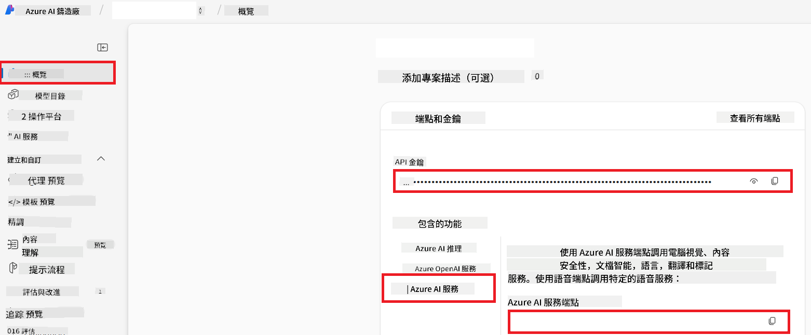

<!--
CO_OP_TRANSLATOR_METADATA:
{
  "original_hash": "b58d7c3cb4210697a073d20eb3064945",
  "translation_date": "2025-06-14T12:49:27+00:00",
  "source_file": "getting_started/set-up-azure-ai.md",
  "language_code": "mo"
}
-->
# 設置 Azure AI 以協作翻譯（Azure OpenAI 和 Azure AI Vision）

本指南將引導您設置 Azure OpenAI 用於語言翻譯，以及 Azure Computer Vision 用於圖像內容分析（可用於基於圖像的翻譯），在 Azure AI Foundry 中使用。

**先決條件：**
- 擁有一個有效訂閱的 Azure 帳戶。
- 有足夠的權限在您的 Azure 訂閱中創建資源和部署。

## 創建 Azure AI 項目

您將首先創建一個 Azure AI 項目，作為管理您的 AI 資源的中心。

1. 前往 [https://ai.azure.com](https://ai.azure.com) 並使用您的 Azure 帳戶登錄。

1. 選擇 **+Create** 來創建一個新項目。

1. 執行以下任務：
   - 輸入一個 **項目名稱**（例如，`CoopTranslator-Project`）。
   - 選擇 **AI hub**（例如，`CoopTranslator-Hub`）（如有需要，創建一個新的）。

1. 點擊 "**Review and Create**" 來設置您的項目。您將被帶到項目的概覽頁面。

## 設置 Azure OpenAI 用於語言翻譯

在您的項目中，您將部署一個 Azure OpenAI 模型作為文本翻譯的後端。

### 瀏覽您的項目

如果尚未打開，請在 Azure AI Foundry 中打開您新創建的項目（例如，`CoopTranslator-Project`）。

### 部署 OpenAI 模型

1. 從項目的左側菜單中，在 "My assets" 下，選擇 "**Models + endpoints**"。

1. 選擇 **+ Deploy model**。

1. 選擇 **Deploy Base Model**。

1. 系統將顯示可用模型的列表。篩選或搜索合適的 GPT 模型。我們推薦 `gpt-4o`。

1. 選擇您想要的模型並點擊 **Confirm**。

1. 選擇 **Deploy**。

### Azure OpenAI 配置

部署完成後，您可以從 "**Models + endpoints**" 頁面選擇該部署，以找到其 **REST endpoint URL**、**Key**、**Deployment name**、**Model name** 和 **API version**。這些將需要集成翻譯模型到您的應用程序中。

> [!NOTE]
> 您可以根據需要從 [API 版本棄用](https://learn.microsoft.com/azure/ai-services/openai/api-version-deprecation) 頁面選擇 API 版本。請注意，**API 版本** 與 Azure AI Foundry 中 **Models + endpoints** 頁面上顯示的 **Model version** 不同。

## 設置 Azure Computer Vision 用於圖像翻譯

為了啟用圖像內文本的翻譯，您需要找到 Azure AI 服務的 API Key 和 Endpoint。

1. 瀏覽到您的 Azure AI 項目（例如，`CoopTranslator-Project`）。確保您在項目概覽頁面。

### Azure AI 服務配置

從 Azure AI 服務中找到 API Key 和 Endpoint。

1. 瀏覽到您的 Azure AI 項目（例如，`CoopTranslator-Project`）。確保您在項目概覽頁面。

1. 從 Azure AI 服務選項卡中找到 **API Key** 和 **Endpoint**。

    

此連接使得鏈接的 Azure AI 服務資源的功能（包括圖像分析）可用於您的 AI Foundry 項目。然後，您可以在筆記本或應用程序中使用此連接從圖像中提取文本，然後將其發送到 Azure OpenAI 模型進行翻譯。

## 整合您的憑據

到現在為止，您應該已經收集到以下內容：

**對於 Azure OpenAI（文本翻譯）：**
- Azure OpenAI Endpoint
- Azure OpenAI API Key
- Azure OpenAI Model Name（例如，`gpt-4o`）
- Azure OpenAI Deployment Name（例如，`cooptranslator-gpt4o`）
- Azure OpenAI API Version

**對於 Azure AI 服務（通過 Vision 提取圖像文本）：**
- Azure AI Service Endpoint
- Azure AI Service API Key

### 示例：環境變量配置（預覽）

稍後，當構建您的應用程序時，您可能會使用這些收集到的憑據來配置它。例如，您可能會將它們設置為環境變量，如下所示：

```bash
# Azure AI Service Credentials (Required for image translation)
AZURE_AI_SERVICE_API_KEY="your_azure_ai_service_api_key" # e.g., 21xasd...
AZURE_AI_SERVICE_ENDPOINT="https://your_azure_ai_service_endpoint.cognitiveservices.azure.com/"

# Azure OpenAI Credentials (Required for text translation)
AZURE_OPENAI_API_KEY="your_azure_openai_api_key" # e.g., 21xasd...
AZURE_OPENAI_ENDPOINT="https://your_azure_openai_endpoint.openai.azure.com/"
AZURE_OPENAI_MODEL_NAME="your_model_name" # e.g., gpt-4o
AZURE_OPENAI_CHAT_DEPLOYMENT_NAME="your_deployment_name" # e.g., cooptranslator-gpt4o
AZURE_OPENAI_API_VERSION="your_api_version" # e.g., 2024-12-01-preview
```

---

### 延伸閱讀

- [如何在 Azure AI Foundry 中創建項目](https://learn.microsoft.com/azure/ai-foundry/how-to/create-projects?tabs=ai-studio)
- [如何創建 Azure AI 資源](https://learn.microsoft.com/azure/ai-foundry/how-to/create-azure-ai-resource?tabs=portal)
- [如何在 Azure AI Foundry 中部署 OpenAI 模型](https://learn.microsoft.com/en-us/azure/ai-foundry/how-to/deploy-models-openai)

**免責聲明**：
本文檔是使用AI翻譯服務[Co-op Translator](https://github.com/Azure/co-op-translator)翻譯的。儘管我們努力確保準確性，但請注意，自動翻譯可能包含錯誤或不準確之處。應將原始語言的文檔視為權威來源。對於關鍵信息，建議使用專業人工翻譯。我們對因使用此翻譯而引起的任何誤解或誤釋不承擔責任。