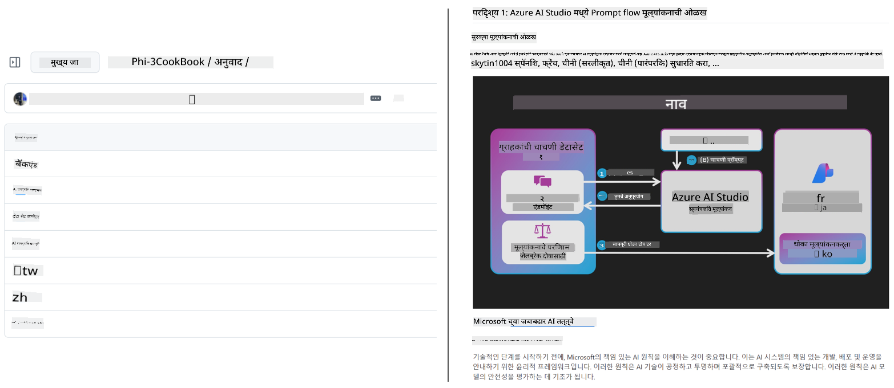
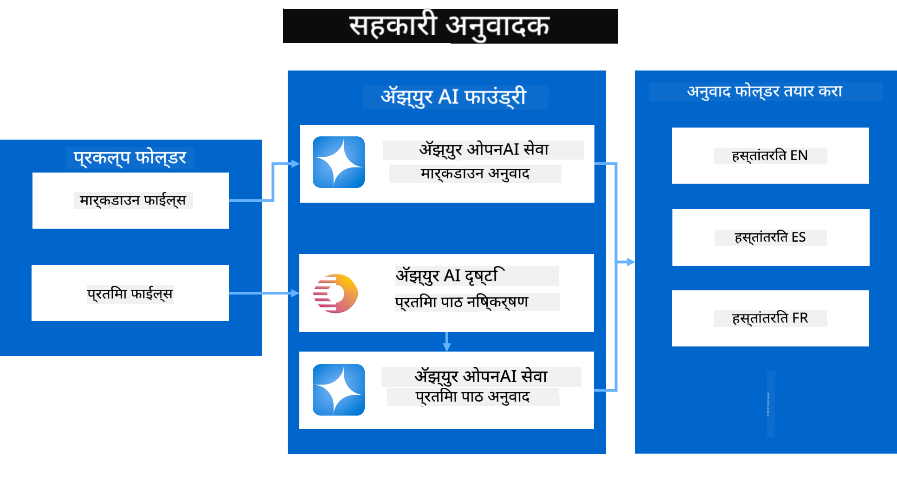

<!--
CO_OP_TRANSLATOR_METADATA:
{
  "original_hash": "044724537b57868117aadae8e7728c7c",
  "translation_date": "2025-06-12T10:12:34+00:00",
  "source_file": "README.md",
  "language_code": "mr"
}
-->


# Co-op Translator: शैक्षणिक दस्तऐवजांचे अनुवाद सहजपणे स्वयंचलित करा

_तुमच्या दस्तऐवजांचा अनुवाद अनेक भाषांमध्ये सहजपणे स्वयंचलित करा आणि जागतिक प्रेक्षकांपर्यंत पोहोचा._

[](https://pypi.org/project/co-op-translator/)
[](https://github.com/azure/co-op-translator/blob/main/LICENSE)
[](https://pepy.tech/project/co-op-translator)
[](https://pepy.tech/project/co-op-translator)
[](https://github.com/psf/black)

[](https://GitHub.com/azure/co-op-translator/graphs/contributors/)
[](https://GitHub.com/azure/co-op-translator/issues/)
[](https://GitHub.com/azure/co-op-translator/pulls/)
[](http://makeapullrequest.com)

### भाषा समर्थन Co-op Translator द्वारे समर्थित
[फ्रेंच](../fr/README.md) | [स्पॅनिश](../es/README.md) | [जर्मन](../de/README.md) | [रशियन](../ru/README.md) | [अरबी](../ar/README.md) | [फारसी (पर्शियन)](../fa/README.md) | [उर्दू](../ur/README.md) | [चिनी (सोप्या)](../zh/README.md) | [चिनी (परंपरागत, मकाऊ)](../mo/README.md) | [चिनी (परंपरागत, हॉंगकांग)](../hk/README.md) | [चिनी (परंपरागत, तैवान)](../tw/README.md) | [जपानी](../ja/README.md) | [कोरियन](../ko/README.md) | [हिंदी](../hi/README.md) | [बंगाली](../bn/README.md) | [मराठी](./README.md) | [नेपाली](../ne/README.md) | [पंजाबी (गुरमुखी)](../pa/README.md) | [पोर्तुगीज (पोर्तुगाल)](../pt/README.md) | [पोर्तुगीज (ब्राझील)](../br/README.md) | [इटालियन](../it/README.md) | [पोलिश](../pl/README.md) | [तुर्की](../tr/README.md) | [ग्रीक](../el/README.md) | [थाई](../th/README.md) | [स्वीडिश](../sv/README.md) | [डॅनिश](../da/README.md) | [नॉर्वेजियन](../no/README.md) | [फिनिश](../fi/README.md) | [डच](../nl/README.md) | [हिब्रू](../he/README.md) | [व्हिएतनामी](../vi/README.md) | [इंडोनेशियन](../id/README.md) | [मलय](../ms/README.md) | [टॅगालॉग (फिलिपिनो)](../tl/README.md) | [स्वाहिली](../sw/README.md) | [हंगेरीयन](../hu/README.md) | [चेक](../cs/README.md) | [स्लोव्हाक](../sk/README.md) | [रोमानियन](../ro/README.md) | [बुल्गेरियन](../bg/README.md) | [सर्बियन (सिरिलिक)](../sr/README.md) | [क्रोएशियन](../hr/README.md) | [स्लोव्हेनियन](../sl/README.md) | [युक्रेनियन](../uk/README.md) | [बर्मी (म्यानमार)](../my/README.md)
> [!NOTE]
> हे या रेपॉजिटरीच्या सध्याच्या भाषांतर आहेत. Co-op Translator द्वारे समर्थित भाषांची पूर्ण यादी पाहण्यासाठी कृपया [Language Support](../..) विभाग पहा.

[](https://GitHub.com/azure/co-op-translator/watchers/)
[](https://GitHub.com/azure/co-op-translator/network/)
[](https://GitHub.com/azure/co-op-translator/stargazers/)

[](https://discord.com/invite/ByRwuEEgH4)

[](https://codespaces.new/azure/co-op-translator)
[](https://vscode.dev/redirect?url=vscode://ms-vscode-remote.remote-containers/cloneInVolume?url=https://github.com/azure/co-op-translator)

## आढावा: तुमच्या शैक्षणिक सामग्रीच्या भाषांतरासाठी सुलभता

भाषेच्या अडथळ्यांमुळे जगभरातील शिकणाऱ्या आणि विकसकांसाठी मौल्यवान शैक्षणिक स्रोत आणि तांत्रिक ज्ञान प्राप्त करणे कठीण होते. यामुळे सहभागी होण्याची संधी कमी होते आणि जागतिक नवकल्पना व शिक्षणाची गती मंदावते.

**Co-op Translator** हा Microsoft च्या मोठ्या शैक्षणिक मालिकांसाठी (जसे की "For Beginners" मार्गदर्शक) असलेल्या अप्रभावी मॅन्युअल भाषांतर प्रक्रियेला सोडवण्यासाठी तयार करण्यात आला. आता तो एक सोपा, प्रभावी साधन बनला आहे जो प्रत्येकासाठी या अडथळ्यांना दूर करतो. CLI आणि GitHub Actions द्वारे उच्च दर्जाचे स्वयंचलित भाषांतर प्रदान करून, Co-op Translator शिक्षक, विद्यार्थी, संशोधक आणि विकसकांना जागतिक स्तरावर भाषेच्या अडथळ्यांशिवाय ज्ञान शेअर आणि प्रवेश करण्यास सक्षम करतो.

Co-op Translator कसा भाषांतरित शैक्षणिक सामग्री व्यवस्थित करतो ते पाहा:



Markdown फाइल्स आणि प्रतिमांमधील मजकूर स्वयंचलितपणे भाषांतरित होतो आणि भाषा-विशिष्ट फोल्डर्समध्ये नीटनेटकं ठेवला जातो.

**Co-op Translator सोबत आजच तुमच्या शैक्षणिक सामग्रीसाठी जागतिक प्रवेश उघडा!**

## Microsoft च्या शिक्षण संसाधनांसाठी जागतिक प्रवेशाला पाठिंबा

Co-op Translator Microsoft च्या महत्त्वाच्या शैक्षणिक उपक्रमांसाठी भाषेचा अंतर कमी करण्यात मदत करतो, जागतिक विकसक समुदायासाठी सेवा देणाऱ्या रेपॉजिटरीजचे भाषांतर स्वयंचलित करतो. सध्या Co-op Translator वापरणाऱ्या उदाहरणांमध्ये हे समाविष्ट आहे:

[](https://github.com/microsoft/Generative-AI-for-beginners)
[](https://github.com/microsoft/ML-For-Beginners)
[](https://github.com/microsoft/AI-For-Beginners)
[](https://github.com/microsoft/ai-agents-for-beginners)
[](https://github.com/microsoft/PhiCookBook)
[](https://github.com/microsoft/Generative-AI-for-beginners-dotnet)

## मुख्य वैशिष्ट्ये

- **स्वयंचलित भाषांतर**: मजकूर सहजपणे अनेक भाषांमध्ये भाषांतर करा.
- **GitHub Actions एकत्रीकरण**: तुमच्या CI/CD पाइपलाइनमध्ये भाषांतर स्वयंचलित करा.
- **Markdown संरक्षित करणे**: भाषांतर करताना Markdown चे योग्य स्वरूप राखा.
- **प्रतिमा मजकूर भाषांतर**: प्रतिमांमधील मजकूर काढा आणि भाषांतर करा.
- **आधुनिक LLM तंत्रज्ञान**: उच्च दर्जाचे भाषांतर करण्यासाठी अत्याधुनिक भाषा मॉडेल वापरा.
- **सुलभ एकत्रीकरण**: तुमच्या विद्यमान प्रोजेक्ट सेटअपमध्ये सहजपणे समाकलित करा.
- **स्थानिकीकरण सुलभ करा**: आंतरराष्ट्रीय बाजारासाठी प्रोजेक्टचे स्थानिकीकरण सोपे करा.

## ते कसे कार्य करते



Co-op Translator तुमच्या प्रोजेक्ट फोल्डरमधील Markdown फाइल्स आणि प्रतिमा घेतो आणि खालीलप्रमाणे प्रक्रिया करतो:

1. **मजकूर काढणे**: Markdown फाइल्समधून आणि (जर Azure AI Vision सारखे कॉन्फिगर केले असेल तर) प्रतिमांमधील एम्बेड केलेला मजकूर काढतो.
1. **AI भाषांतर**: काढलेला मजकूर कॉन्फिगर केलेल्या LLM (Azure OpenAI, OpenAI इ.) कडे भाषांतरासाठी पाठवतो.
1. **परिणाम जतन करणे**: भाषांतरित Markdown फाइल्स आणि (भाषांतरित मजकूरासह) प्रतिमा भाषा-विशिष्ट फोल्डर्समध्ये जतन करतो, मूळ फॉर्मॅटिंग राखून.

## सुरूवात कशी करावी

CLI वापरून लवकर सुरू करा किंवा GitHub Actions सह पूर्ण स्वयंचलन सेट करा. तुमच्या कार्यप्रवाहाला सर्वात योग्य पर्याय निवडा:

1. **कमांड लाइन (CLI)** - एकदाच भाषांतरासाठी किंवा मॅन्युअल नियंत्रणासाठी
2. **GitHub Actions** - प्रत्येक पुशवर स्वयंचलित भाषांतरासाठी

> [!NOTE]
> हा ट्यूटोरियल Azure संसाधनांवर लक्ष केंद्रित करतो, पण तुम्ही कोणतेही समर्थित भाषा मॉडेल वापरू शकता.

### भाषा समर्थन

Co-op Translator जगभरातील प्रेक्षकांपर्यंत पोहोचण्यासाठी विविध भाषा समर्थित करतो. येथे तुम्हाला काय माहित असणे आवश्यक आहे:

#### जलद संदर्भ

| भाषा | कोड | भाषा | कोड | भाषा | कोड |
|----------|------|----------|------|----------|------|
| Arabic | ar | Bengali | bn | Bulgarian | bg |
| Burmese (Myanmar) | my | Chinese (Simplified) | zh | Chinese (Traditional, HK) | hk |
| Chinese (Traditional, Macau) | mo | Chinese (Traditional, TW) | tw | Croatian | hr |
| Czech | cs | Danish | da | Dutch | nl |
| Finnish | fi | French | fr | German | de |
| Greek | el | Hebrew | he | Hindi | hi |
| Hungarian | hu | Indonesian | id | Italian | it |
| Japanese | ja | Korean | ko | Malay | ms |
| Marathi | mr | Nepali | ne | Norwegian | no |
| Persian (Farsi) | fa | Polish | pl | Portuguese (Brazil) | br |
| Portuguese (Portugal) | pt | Punjabi (Gurmukhi) | pa | Romanian | ro |
| Russian | ru | Serbian (Cyrillic) | sr | Slovak | sk |
| Slovenian | sl | Spanish | es | Swahili | sw |
| Swedish | sv | Tagalog (Filipino) | tl | Thai | th |
| Turkish | tr | Ukrainian | uk | Urdu | ur |
| Vietnamese | vi | — | — | — | — |

#### भाषा कोड वापरणे

Co-op Translator वापरताना तुम्हाला भाषांचा कोड वापरावा लागेल. उदाहरणार्थ:

```bash
# Translate to French, Spanish, and German
translate -l "fr es de"

# Translate to Chinese (Simplified) and Japanese
translate -l "zh ja"
```

> [!NOTE]
> भाषासंबंधी तांत्रिक माहिती, ज्यात:
>
> - प्रत्येक भाषेसाठी फॉन्ट स्पेसिफिकेशन्स
> - ज्ञात समस्या
> - नवीन भाषा कशा जोडायच्या
>
> यासाठी आमच्या [Supported Languages Documentation](./getting_started/supported-languages.md) पहा.

### समर्थित मॉडेल्स आणि सेवा

| प्रकार                  | नाव                           |
|-----------------------|--------------------------------|
| Language Model        |   |
| AI Vision       |  |

> [!NOTE]
> जर AI Vision सेवा उपलब्ध नसेल, तर co-op translator [Markdown-only mode](./getting_started/markdown-only-mode.md) मध्ये स्विच होईल.

### प्रारंभिक सेटअप

सुरू करण्यापूर्वी खालील संसाधने तयार करा:

1. Language Model Resource (आवश्यक):
   - Azure OpenAI (शिफारस केलेले) - उच्च दर्जाचे भाषांतर आणि विश्वसनीयता
   - OpenAI - Azure उपलब्ध नसल्यास पर्याय
   - समर्थित मॉडेल्सबद्दल सविस्तर माहिती साठी [Supported Models and Services](../..) पहा

1. AI Vision Resource (ऐच्छिक):
   - Azure AI Vision - प्रतिमांमधील मजकूराचे भाषांतर सक्षम करते
   - नसेल तर, स्वयंचलितपणे [Markdown-only mode](./getting_started/markdown-only-mode.md) वापरले जाईल
   - प्रतिमांमध्ये मजकूर असल्यास शिफारस केलेले

1. कॉन्फिगरेशन पावले:
   - आमच्या [Azure AI सेटअप मार्गदर्शक](./getting_started/set-up-azure-ai.md) चे पालन करा
   - API की आणि एंडपॉइंटसह `.env` फाइल तयार करा (बघा [Quick Start](../..) विभाग)
   - निवडलेल्या सेवांसाठी आवश्यक परवानग्या आणि कोटा सुनिश्चित करा

### भाषांतरापूर्वी प्रोजेक्ट सेटअप

भाषांतर सुरू करण्यापूर्वी प्रोजेक्ट तयार करण्यासाठी:

1. तुमचा README तयार करा:
   - README.md मध्ये भाषांतरांची तक्ता जोडा ज्याद्वारे भाषांतरित आवृत्त्यांना लिंक करता येईल
   - उदाहरण स्वरूप:

     ```markdown

     ### 🌐 Multi-Language Support
     
     [French](../fr/README.md) | [Spanish](../es/README.md) | [German](../de/README.md) | [Russian](../ru/README.md) | [Arabic](../ar/README.md) | [Persian (Farsi)](../fa/README.md) | [Urdu](../ur/README.md) | [Chinese (Simplified)](../zh/README.md) | [Chinese (Traditional, Macau)](../mo/README.md) | [Chinese (Traditional, Hong Kong)](../hk/README.md) | [Chinese (Traditional, Taiwan)](../tw/README.md) | [Japanese](../ja/README.md) | [Korean](../ko/README.md) | [Hindi](../hi/README.md) | [Bengali](../bn/README.md) | [Marathi](./README.md) | [Nepali](../ne/README.md) | [Punjabi (Gurmukhi)](../pa/README.md) | [Portuguese (Portugal)](../pt/README.md) | [Portuguese (Brazil)](../br/README.md) | [Italian](../it/README.md) | [Polish](../pl/README.md) | [Turkish](../tr/README.md) | [Greek](../el/README.md) | [Thai](../th/README.md) | [Swedish](../sv/README.md) | [Danish](../da/README.md) | [Norwegian](../no/README.md) | [Finnish](../fi/README.md) | [Dutch](../nl/README.md) | [Hebrew](../he/README.md) | [Vietnamese](../vi/README.md) | [Indonesian](../id/README.md) | [Malay](../ms/README.md) | [Tagalog (Filipino)](../tl/README.md) | [Swahili](../sw/README.md) | [Hungarian](../hu/README.md) | [Czech](../cs/README.md) | [Slovak](../sk/README.md) | [Romanian](../ro/README.md) | [Bulgarian](../bg/README.md) | [Serbian (Cyrillic)](../sr/README.md) | [Croatian](../hr/README.md) | [Slovenian](../sl/README.md) | [Ukrainian](../uk/README.md) | [Burmese (Myanmar)](../my/README.md) 
    
     ```

1. विद्यमान भाषांतर साफ करा (आवश्यक असल्यास):
   - कोणतेही विद्यमान भाषांतर फोल्डर्स (उदा. `translations/`) काढा
   - जुन्या भाषांतर फाइल्स हटवा
   - यामुळे नवीन भाषांतर प्रक्रियेत कोणताही संघर्ष होणार नाही

### जलद सुरूवात: कमांड लाइन

कमांड लाइन वापरून जलद सुरू करण्यासाठी:

1. व्हर्च्युअल एन्व्हायर्नमेंट तयार करा:

    ```bash
    python -m venv .venv
    ```

1. व्हर्च्युअल एन्व्हायर्नमेंट सक्रिय करा:

    - Windows वर:

    ```bash
    .venv\scripts\activate
    ```

    - Linux/macOS वर:

    ```bash
    source .venv/bin/activate
    ```

1. पॅकेज इन्स्टॉल करा:

    ```bash
    pip install co-op-translator
    ```

1. क्रेडेन्शियल्स कॉन्फिगर करा:

    - `.env` file in your project's root directory.
    - Copy the contents from the [.env.template](../../.env.template) file into your new `.env` file.
    - Fill in the required API keys and endpoint information in your `.env` file.

1. Run Translation:
    - Navigate to your project's root directory in your terminal.
    - Execute the translate command, specifying target languages with the `-l` फ्लॅग वापरा:

    ```bash
    translate -l "ko ja fr"
    ```

_(रिपॉजिटरीतील `"ko ja fr"` with your desired space-separated language codes)_

### Detailed Usage Guides

Choose the approach that best fits your workflow:

#### 1. Using the Command Line (CLI)

- Best for: One-time translations, manual control, or integration into custom scripts.
- Requires: Local installation of Python and the `co-op-translator` package.
- Guide: [Command Line Guide](./getting_started/command-line-guide/command-line-guide.md)

#### 2. Using GitHub Actions (Automation)

- Best for: Automatically translating content whenever changes are pushed to your repository. Keeps translations consistently up-to-date.
- Requires: Setting up a workflow file (`.github/workflows` मध्ये बदला.) स्थानिक इन्स्टॉलेशनची गरज नाही.
- मार्गदर्शक:
  - [GitHub Actions Guide (Public Repositories & Standard Secrets)](./getting_started/github-actions-guide/github-actions-guide-public.md) - बहुतेक सार्वजनिक किंवा वैयक्तिक रेपॉजिटरीजसाठी जे सामान्य रेपॉजिटरी सीक्रेट्सवर अवलंबून असतात.
  - [GitHub Actions Guide (Microsoft Organization Repos & Org-Level Setups)](./getting_started/github-actions-guide/github-actions-guide-org.md) - Microsoft GitHub संघटनेतील रेपॉजिटरीजसाठी किंवा संघटना-स्तरीय सीक्रेट्स/रनर्स वापरण्यासाठी.

### समस्या निवारण आणि टिपा

- [Troubleshooting Guide](./getting_started/troubleshooting.md)

### अतिरिक्त संसाधने

- [Command Reference](./getting_started/command-reference.md): उपलब्ध सर्व कमांड्स आणि पर्यायांची सविस्तर माहिती.
- [Supported Languages](./getting_started/supported-languages.md): समर्थित भाषांची यादी आणि नवीन भाषा जोडण्याच्या सूचना.
- [Markdown-Only Mode](./getting_started/markdown-only-mode.md): केवळ मजकूराचे भाषांतर कसे करायचे, प्रतिमांशिवाय.

## व्हिडिओ सादरीकरणे

Co-op Translator बद्दल अधिक जाणून घ्या आमच्या सादरीकरणांद्वारे _(खालील प्रतिमेवर क्लिक करून YouTube वर पहा.)_:

- **Open at Microsoft**: Co-op Translator कसा वापरायचा याबाबत १८ मिनिटांचे संक्षिप्त परिचय आणि जलद मार्गदर्शक.
[](https://www.youtube.com/watch?v=jX_swfH_KNU)

## आमच्या पाठिंबा द्या आणि जागतिक शिक्षणाला प्रोत्साहन द्या

शैक्षणिक सामग्री जगभर कशी शेअर केली जाते यामध्ये क्रांती घडवून आणण्यास आमच्यासोबत सामील व्हा! GitHub वर [Co-op Translator](https://github.com/azure/co-op-translator) ला ⭐ द्या आणि शिकण्यातील व तंत्रज्ञानातील भाषा अडथळे तोडण्याच्या आमच्या मिशनला पाठिंबा द्या. तुमची आवड आणि योगदान मोठा फरक घडवून आणतात! कोड योगदान आणि फीचर सुचवण्या नेहमी स्वागतार्ह आहेत.

## योगदान देणे

हा प्रकल्प योगदान आणि सूचना स्वीकारतो. Azure Co-op Translator मध्ये योगदान देण्यास इच्छुक आहात? कृपया आमच्या [CONTRIBUTING.md](./CONTRIBUTING.md) मध्ये पाहा, जिथे तुम्हाला Co-op Translator अधिक सुलभ बनवण्यासाठी कसे मदत करू शकता याबाबत मार्गदर्शन मिळेल.

## योगदानकर्ते

[](https://github.com/Azure/co-op-translator/graphs/contributors)

## आचारसंहिता

या प्रकल्पाने [Microsoft Open Source Code of Conduct](https://opensource.microsoft.com/codeofconduct/) स्वीकारली आहे.
अधिक माहितीसाठी [Code of Conduct FAQ](https://opensource.microsoft.com/codeofconduct/faq/) पहा किंवा कोणत्याही अतिरिक्त प्रश्नांसाठी किंवा टिप्पण्या करण्यासाठी [opencode@microsoft.com](mailto:opencode@microsoft.com) यांच्याशी संपर्क करा.

## जबाबदार AI

Microsoft आमच्या ग्राहकांना आमची AI उत्पादने जबाबदारीने वापरण्यास मदत करण्यासाठी, आमच्या अनुभवांना शेअर करण्यासाठी आणि Transparency Notes आणि Impact Assessments सारख्या साधनांद्वारे विश्वासावर आधारित भागीदारी तयार करण्यासाठी कटिबद्ध आहे. या संसाधनांपैकी अनेक तुम्हाला [https://aka.ms/RAI](https://aka.ms/RAI) येथे सापडतील.
Microsoft चा जबाबदार AI चा दृष्टिकोन न्याय, विश्वासार्हता आणि सुरक्षितता, गोपनीयता आणि सुरक्षा, समावेशकता, पारदर्शकता आणि जबाबदारी या AI तत्त्वांवर आधारित आहे.

मोठ्या प्रमाणावर नैसर्गिक भाषा, प्रतिमा आणि भाषण मॉडेल्स - जसे की या नमुन्यात वापरलेले - कधीकधी अन्यायकारक, अविश्वसनीय किंवा अपमानजनक वर्तन करू शकतात, ज्यामुळे हानी होऊ शकते. कृपया धोके आणि मर्यादा जाणून घेण्यासाठी [Azure OpenAI service Transparency note](https://learn.microsoft.com/legal/cognitive-services/openai/transparency-note?tabs=text) पहा.

या धोके कमी करण्याचा शिफारस केलेला मार्ग म्हणजे तुमच्या आर्किटेक्चरमध्ये एक सुरक्षा प्रणाली समाविष्ट करणे जी हानिकारक वर्तन ओळखू आणि प्रतिबंध करू शकेल. [Azure AI Content Safety](https://learn.microsoft.com/azure/ai-services/content-safety/overview) स्वतंत्र संरक्षणाचा स्तर प्रदान करते, जो अनुप्रयोग आणि सेवांमधील वापरकर्त्यांनी आणि AI ने निर्माण केलेल्या हानिकारक सामग्रीचा शोध घेऊ शकतो. Azure AI Content Safety मध्ये टेक्स्ट आणि प्रतिमा API आहेत जे तुम्हाला हानिकारक सामग्री ओळखण्याची परवानगी देतात. आमच्याकडे एक इंटरएक्टिव Content Safety Studio देखील आहे जे तुम्हाला वेगवेगळ्या प्रकारच्या हानिकारक सामग्रीचा शोध घेण्यासाठी नमुना कोड पाहण्याची, तपासण्याची आणि वापरून पाहण्याची संधी देते. खालील [quickstart documentation](https://learn.microsoft.com/azure/ai-services/content-safety/quickstart-text?tabs=visual-studio%2Clinux&pivots=programming-language-rest) तुम्हाला सेवा वापरून विनंत्या कशा करायच्या यासाठी मार्गदर्शन करते.

दुसरी बाब लक्षात घेण्यासारखी म्हणजे संपूर्ण अनुप्रयोगाची कार्यक्षमता. मल्टी-मोडल आणि मल्टी-मॉडेल अनुप्रयोगांमध्ये, कार्यक्षमता म्हणजे तुमचा आणि तुमच्या वापरकर्त्यांचा अपेक्षेनुसार प्रणाली कार्य करते, ज्यामध्ये हानिकारक आउटपुट निर्माण होणार नाही. तुमच्या संपूर्ण अनुप्रयोगाची कार्यक्षमता [generation quality आणि risk and safety metrics](https://learn.microsoft.com/azure/ai-studio/concepts/evaluation-metrics-built-in) वापरून मोजणे महत्त्वाचे आहे.

तुम्ही तुमच्या विकास वातावरणात तुमचा AI अनुप्रयोग [prompt flow SDK](https://microsoft.github.io/promptflow/index.html) वापरून मूल्यांकन करू शकता. चाचणी डेटासेट किंवा लक्ष्य दिल्यास, तुमच्या जनरेटिव AI अनुप्रयोगाच्या जनरेशनची मोजमाप अंगभूत किंवा तुमच्या पसंतीनुसार कस्टम मूल्यांकनकर्त्यांनी केली जाते. prompt flow sdk वापरून तुमची प्रणाली कशी मूल्यांकन करायची यासाठी, तुम्ही [quickstart guide](https://learn.microsoft.com/azure/ai-studio/how-to/develop/flow-evaluate-sdk) अनुसरू शकता. एकदा तुम्ही मूल्यांकन चालवल्यानंतर, तुम्ही [Azure AI Studio मध्ये निकाल पाहू शकता](https://learn.microsoft.com/azure/ai-studio/how-to/evaluate-flow-results).

## ट्रेडमार्क

या प्रकल्पात प्रकल्प, उत्पादने किंवा सेवांसाठी ट्रेडमार्क किंवा लोगो असू शकतात. Microsoft ट्रेडमार्क किंवा लोगोचा अधिकृत वापर [Microsoft's Trademark & Brand Guidelines](https://www.microsoft.com/en-us/legal/intellectualproperty/trademarks/usage/general) चे पालन करणे आवश्यक आहे.
Microsoft ट्रेडमार्क किंवा लोगोचा या प्रकल्पाच्या बदललेल्या आवृत्त्यांमध्ये वापरामुळे गोंधळ होऊ नये किंवा Microsoft च्या प्रायोजकत्वाचा भास होऊ नये.
तृतीय पक्षांच्या ट्रेडमार्क किंवा लोगोचा वापर त्या तृतीय पक्षांच्या धोरणांनुसार होतो.

**अस्वीकरण**:  
हा दस्तऐवज AI भाषांतर सेवा [Co-op Translator](https://github.com/Azure/co-op-translator) वापरून भाषांतरित केला आहे. आम्ही अचूकतेसाठी प्रयत्नशील आहोत, तरी कृपया लक्षात ठेवा की स्वयंचलित भाषांतरांमध्ये चुका किंवा अचूकतेच्या त्रुटी असू शकतात. मूळ दस्तऐवज त्याच्या स्थानिक भाषेत अधिकृत स्रोत मानला जावा. महत्त्वाच्या माहितीकरिता व्यावसायिक मानवी भाषांतर करण्याचा सल्ला दिला जातो. या भाषांतराच्या वापरामुळे उद्भवलेल्या कोणत्याही गैरसमजुतीसाठी किंवा चुकीच्या अर्थ लावणीसाठी आम्ही जबाबदार नाही.