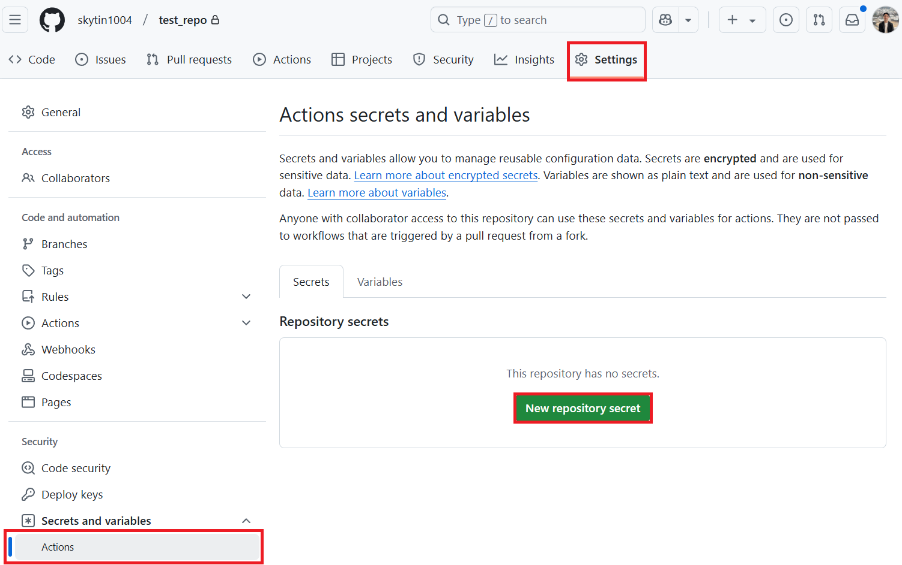

<!--
CO_OP_TRANSLATOR_METADATA:
{
  "original_hash": "9fac847815936ef6e6c8bfde6d191571",
  "translation_date": "2025-10-15T02:51:24+00:00",
  "source_file": "getting_started/github-actions-guide/github-actions-guide-org.md",
  "language_code": "mr"
}
-->
# Co-op Translator GitHub Action वापरण्याची मार्गदर्शिका (संस्था मार्गदर्शक)

**लक्ष्यित वाचक:** ही मार्गदर्शिका **Microsoft अंतर्गत वापरकर्ते** किंवा **ज्यांना Co-op Translator GitHub App साठी आवश्यक credentials मिळवता येतात** किंवा स्वतःचा GitHub App तयार करू शकतात, अशा टीम्ससाठी आहे.

तुमच्या repository मधील दस्तऐवजांचे भाषांतर Co-op Translator GitHub Action वापरून सहजपणे automate करा. ही मार्गदर्शिका तुम्हाला action सेटअप करण्याची प्रक्रिया समजावते, जेणेकरून तुमचे source Markdown फाइल्स किंवा images बदलल्यावर updated भाषांतरांसह pull requests आपोआप तयार होतील.

> [!IMPORTANT]
> 
> **योग्य मार्गदर्शिका निवडा:**
>
> ही मार्गदर्शिका **GitHub App ID आणि Private Key** वापरून सेटअप करण्याची माहिती देते. तुम्हाला हा "Organization Guide" पद्धत वापरावी लागेल, जर: **`GITHUB_TOKEN` ची Permissions मर्यादित आहेत:** तुमच्या संस्थेच्या किंवा repository च्या सेटिंग्समुळे standard `GITHUB_TOKEN` ला default permissions मिळत नाहीत. विशेषतः, जर `GITHUB_TOKEN` ला आवश्यक `write` permissions (जसे `contents: write` किंवा `pull-requests: write`) मिळत नसतील, तर [Public Setup Guide](./github-actions-guide-public.md) मधील workflow अपुरी permissions असल्यामुळे fail होईल. Dedicated GitHub App वापरल्यास आणि explicit permissions दिल्यास ही अडचण टाळता येते.
>
> **वरील गोष्टी तुमच्यावर लागू होत नसतील:**
>
> जर तुमच्या repository मध्ये standard `GITHUB_TOKEN` ला पुरेशी permissions मिळत असतील (म्हणजे तुम्ही organizational restrictions मुळे अडथळा येत नाही), तर कृपया **[Public Setup Guide using GITHUB_TOKEN](./github-actions-guide-public.md)** वापरा. या public guide मध्ये App IDs किंवा Private Keys मिळवण्याची किंवा सांभाळण्याची गरज नाही, आणि फक्त standard `GITHUB_TOKEN` आणि repository permissions वर अवलंबून आहे.

## पूर्वतयारी

GitHub Action configure करण्यापूर्वी, आवश्यक AI सेवा credentials तयार ठेवा.

**1. आवश्यक: AI Language Model Credentials**
किमान एक supported Language Model साठी credentials लागतील:

- **Azure OpenAI**: Endpoint, API Key, Model/Deployment Names, API Version लागेल.
- **OpenAI**: API Key लागेल, (Optional: Org ID, Base URL, Model ID).
- तपशीलांसाठी [Supported Models and Services](../../../../README.md) पहा.
- Setup Guide: [Set up Azure OpenAI](../set-up-resources/set-up-azure-openai.md).

**2. पर्यायी: Computer Vision Credentials (Image Translation साठी)**

- फक्त images मधील मजकूर translate करायचा असल्यास लागेल.
- **Azure Computer Vision**: Endpoint आणि Subscription Key लागेल.
- जर दिले नाही, तर action [Markdown-only mode](../markdown-only-mode.md) वापरेल.
- Setup Guide: [Set up Azure Computer Vision](../set-up-resources/set-up-azure-computer-vision.md).

## सेटअप आणि कॉन्फिगरेशन

तुमच्या repository मध्ये Co-op Translator GitHub Action configure करण्यासाठी खालील स्टेप्स फॉलो करा:

### Step 1: GitHub App Authentication Install आणि Configure करा

Workflow तुमच्या repository सोबत सुरक्षितपणे काम करण्यासाठी (उदा. pull requests तयार करणे) GitHub App authentication वापरते. एक पर्याय निवडा:

#### **Option A: Pre-built Co-op Translator GitHub App Install करा (Microsoft Internal Use साठी)**

1. [Co-op Translator GitHub App](https://github.com/apps/co-op-translator) पेजवर जा.

1. **Install** निवडा आणि तुमच्या target repository असलेल्या account किंवा organization निवडा.

    

1. **Only select repositories** निवडा आणि तुमचा target repository (उदा. `PhiCookBook`) निवडा. **Install** क्लिक करा. Authentication विचारले जाऊ शकते.

    

1. **App Credentials मिळवा (Internal Process Required):** Workflow ला app म्हणून authenticate करण्यासाठी Co-op Translator टीमकडून दोन गोष्टी मिळवाव्या लागतील:
  - **App ID:** Co-op Translator app साठी unique identifier. App ID आहे: `1164076`.
  - **Private Key:** Maintainer contact कडून **पूर्ण `.pem` private key फाइलचे content** मिळवा. **ही key पासवर्डसारखी सुरक्षित ठेवा.**

1. Step 2 कडे जा.

#### **Option B: स्वतःचा Custom GitHub App वापरा**

- हवे असल्यास, स्वतःचा GitHub App तयार व configure करू शकता. त्याला Contents आणि Pull requests साठी Read & write access द्या. App ID आणि Private Key लागेल.

### Step 2: Repository Secrets Configure करा

GitHub App credentials आणि AI सेवा credentials encrypted secrets म्हणून repository settings मध्ये add करा.

1. तुमच्या target GitHub repository (उदा. `PhiCookBook`) मध्ये जा.

1. **Settings** > **Secrets and variables** > **Actions** मध्ये जा.

1. **Repository secrets** खाली, प्रत्येक secret साठी **New repository secret** क्लिक करा.

   

**Required Secrets (GitHub App Authentication साठी):**

| Secret Name          | Description                                      | Value Source                                     |
| :------------------- | :----------------------------------------------- | :----------------------------------------------- |
| `GH_APP_ID`          | GitHub App चा App ID (Step 1 मधून).              | GitHub App Settings                              |
| `GH_APP_PRIVATE_KEY` | डाउनलोड केलेल्या `.pem` फाइलचे **पूर्ण content**. | `.pem` फाइल (Step 1 मधून)                      |

**AI Service Secrets (तुमच्या पूर्वतयारीनुसार लागू असलेले सर्व जोडा):**

| Secret Name                         | Description                               | Value Source                     |
| :---------------------------------- | :---------------------------------------- | :------------------------------- |
| `AZURE_AI_SERVICE_API_KEY`            | Azure AI Service साठी Key (Computer Vision)  | Azure AI Foundry                    |
| `AZURE_AI_SERVICE_ENDPOINT`         | Azure AI Service साठी Endpoint (Computer Vision) | Azure AI Foundry                     |
| `AZURE_OPENAI_API_KEY`              | Azure OpenAI service साठी Key              | Azure AI Foundry                     |
| `AZURE_OPENAI_ENDPOINT`             | Azure OpenAI service साठी Endpoint         | Azure AI Foundry                     |
| `AZURE_OPENAI_MODEL_NAME`           | तुमचा Azure OpenAI Model Name              | Azure AI Foundry                     |
| `AZURE_OPENAI_CHAT_DEPLOYMENT_NAME` | तुमचा Azure OpenAI Deployment Name         | Azure AI Foundry                     |
| `AZURE_OPENAI_API_VERSION`          | Azure OpenAI साठी API Version              | Azure AI Foundry                     |
| `OPENAI_API_KEY`                    | OpenAI साठी API Key                        | OpenAI Platform                  |
| `OPENAI_ORG_ID`                     | OpenAI Organization ID                    | OpenAI Platform                  |
| `OPENAI_CHAT_MODEL_ID`              | Specific OpenAI model ID                  | OpenAI Platform                    |
| `OPENAI_BASE_URL`                   | Custom OpenAI API Base URL                | OpenAI Platform                    |


### Step 3: Workflow File तयार करा

आता automated workflow define करणारे YAML फाइल तयार करा.

1. तुमच्या repository च्या root directory मध्ये `.github/workflows/` directory नसेल तर तयार करा.

1. `.github/workflows/` मध्ये `co-op-translator.yml` नावाचे फाइल तयार करा.

1. खालील content co-op-translator.yml मध्ये paste करा.

```
name: Co-op Translator

on:
  push:
    branches:
      - main

jobs:
  co-op-translator:
    runs-on: ubuntu-latest

    permissions:
      contents: write
      pull-requests: write

    steps:
      - name: Checkout repository
        uses: actions/checkout@v4
        with:
          fetch-depth: 0

      - name: Set up Python
        uses: actions/setup-python@v4
        with:
          python-version: '3.10'

      - name: Install Co-op Translator
        run: |
          python -m pip install --upgrade pip
          pip install co-op-translator

      - name: Run Co-op Translator
        env:
          PYTHONIOENCODING: utf-8
          # Azure AI Service Credentials
          AZURE_AI_SERVICE_API_KEY: ${{ secrets.AZURE_AI_SERVICE_API_KEY }}
          AZURE_AI_SERVICE_ENDPOINT: ${{ secrets.AZURE_AI_SERVICE_ENDPOINT }}

          # Azure OpenAI Credentials
          AZURE_OPENAI_API_KEY: ${{ secrets.AZURE_OPENAI_API_KEY }}
          AZURE_OPENAI_ENDPOINT: ${{ secrets.AZURE_OPENAI_ENDPOINT }}
          AZURE_OPENAI_MODEL_NAME: ${{ secrets.AZURE_OPENAI_MODEL_NAME }}
          AZURE_OPENAI_CHAT_DEPLOYMENT_NAME: ${{ secrets.AZURE_OPENAI_CHAT_DEPLOYMENT_NAME }}
          AZURE_OPENAI_API_VERSION: ${{ secrets.AZURE_OPENAI_API_VERSION }}

          # OpenAI Credentials
          OPENAI_API_KEY: ${{ secrets.OPENAI_API_KEY }}
          OPENAI_ORG_ID: ${{ secrets.OPENAI_ORG_ID }}
          OPENAI_CHAT_MODEL_ID: ${{ secrets.OPENAI_CHAT_MODEL_ID }}
          OPENAI_BASE_URL: ${{ secrets.OPENAI_BASE_URL }}
        run: |
          # =====================================================================
          # IMPORTANT: Set your target languages here (REQUIRED CONFIGURATION)
          # =====================================================================
          # Example: Translate to Spanish, French, German. Add -y to auto-confirm.
          translate -l "es fr de" -y  # <--- MODIFY THIS LINE with your desired languages

      - name: Authenticate GitHub App
        id: generate_token
        uses: tibdex/github-app-token@v1
        with:
          app_id: ${{ secrets.GH_APP_ID }}
          private_key: ${{ secrets.GH_APP_PRIVATE_KEY }}

      - name: Create Pull Request with translations
        uses: peter-evans/create-pull-request@v5
        with:
          token: ${{ steps.generate_token.outputs.token }}
          commit-message: "🌐 Update translations via Co-op Translator"
          title: "🌐 Update translations via Co-op Translator"
          body: |
            This PR updates translations for recent changes to the main branch.

            ### 📋 Changes included
            - Translated contents are available in the `translations/` directory
            - Translated images are available in the `translated_images/` directory

            ---
            🌐 Automatically generated by the [Co-op Translator](https://github.com/Azure/co-op-translator) GitHub Action.
          branch: update-translations
          base: main
          labels: translation, automated-pr
          delete-branch: true
          add-paths: |
            translations/
            translated_images/

```

4.  **Workflow कस्टमाइझ करा:**
  - **[!IMPORTANT] Target Languages:** `Run Co-op Translator` स्टेपमध्ये, `translate -l "..." -y` command मधील language codes ची यादी **तुमच्या प्रोजेक्टच्या गरजेनुसार बदलणे आवश्यक आहे**. उदाहरणातील यादी (`ar de es...`) बदलावी किंवा adjust करावी लागेल.
  - **Trigger (`on:`):** सध्या trigger प्रत्येक push वर `main` ला चालतो. मोठ्या repositories साठी, `paths:` filter (YAML मधील comment केलेला example पहा) वापरून workflow फक्त relevant files बदलल्यावर चालवा, जेणेकरून runner minutes वाचतील.
  - **PR Details:** `Create Pull Request` स्टेपमधील `commit-message`, `title`, `body`, `branch` नाव, आणि `labels` कस्टमाइझ करा, गरज असल्यास.

## Credential Management आणि Renewal

- **Security:** Sensitive credentials (API keys, private keys) नेहमी GitHub Actions secrets म्हणून स्टोअर करा. Workflow फाइल किंवा repository code मध्ये कधीही expose करू नका.
- **[!IMPORTANT] Key Renewal (Internal Microsoft Users):** लक्षात ठेवा, Microsoft मध्ये वापरलेली Azure OpenAI key ला अनिवार्य renewal policy असू शकते (उदा. प्रत्येक ५ महिन्यांनी). Workflow failure टाळण्यासाठी GitHub secrets (`AZURE_OPENAI_...` keys) **expire होण्यापूर्वी** update करा.

## Workflow चालवा

> [!WARNING]  
> **GitHub-hosted Runner Time Limit:**  
> GitHub-hosted runners जसे `ubuntu-latest` ला **maximum execution time limit 6 तास** आहे.  
> मोठ्या documentation repositories साठी, जर translation process 6 तासांपेक्षा जास्त चालली, तर workflow आपोआप बंद होईल.  
> हे टाळण्यासाठी:  
> - **self-hosted runner** वापरा (कोणताही time limit नाही)  
> - प्रत्येक run मध्ये target languages ची संख्या कमी करा

`co-op-translator.yml` फाइल main branch (किंवा `on:` trigger मध्ये specify केलेल्या branch) मध्ये merge झाल्यावर, त्या branch वर changes push केल्यावर (आणि `paths` filter लागू असेल तर त्यानुसार) workflow आपोआप चालेल.

जर भाषांतर तयार झाले किंवा update झाले, तर action आपोआप Pull Request तयार करेल, ज्यात बदल असतील आणि review व merge साठी तयार असेल.

---

**अस्वीकरण**:
हे दस्तऐवज AI भाषांतर सेवा [Co-op Translator](https://github.com/Azure/co-op-translator) वापरून अनुवादित केले आहे. आम्ही अचूकतेसाठी प्रयत्नशील असलो तरी, कृपया लक्षात घ्या की स्वयंचलित भाषांतरांमध्ये चुका किंवा अचूकतेचा अभाव असू शकतो. मूळ भाषेतील मूळ दस्तऐवज हा अधिकृत स्रोत मानावा. अत्यावश्यक माहितीसाठी, व्यावसायिक मानवी भाषांतराची शिफारस केली जाते. या भाषांतराचा वापर करून झालेल्या कोणत्याही गैरसमज किंवा चुकीच्या अर्थासाठी आम्ही जबाबदार राहणार नाही.