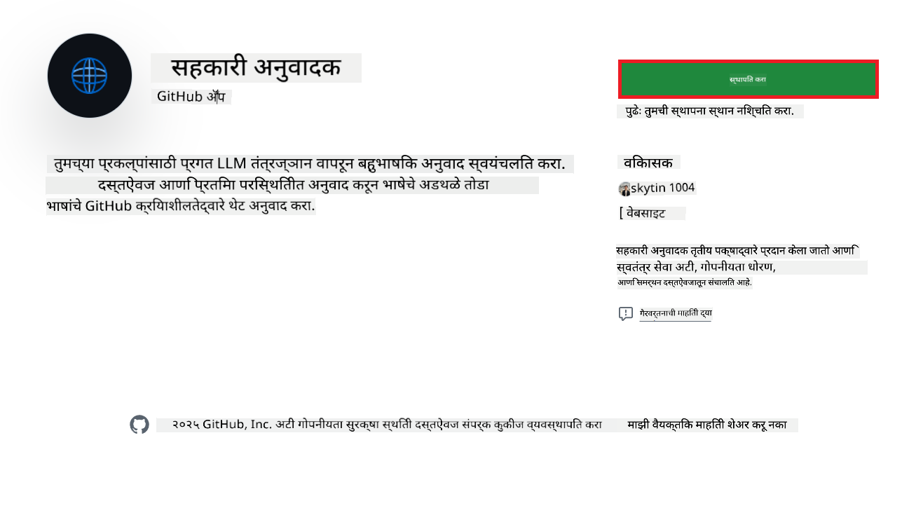
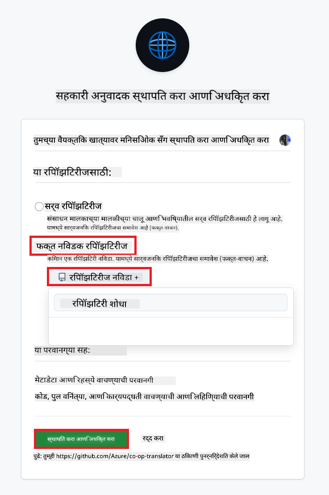
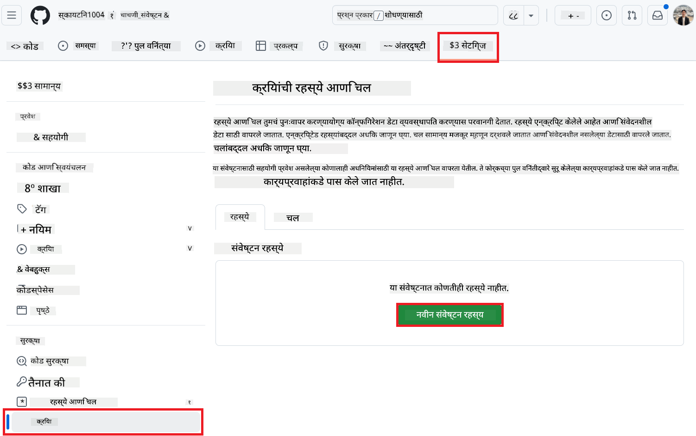
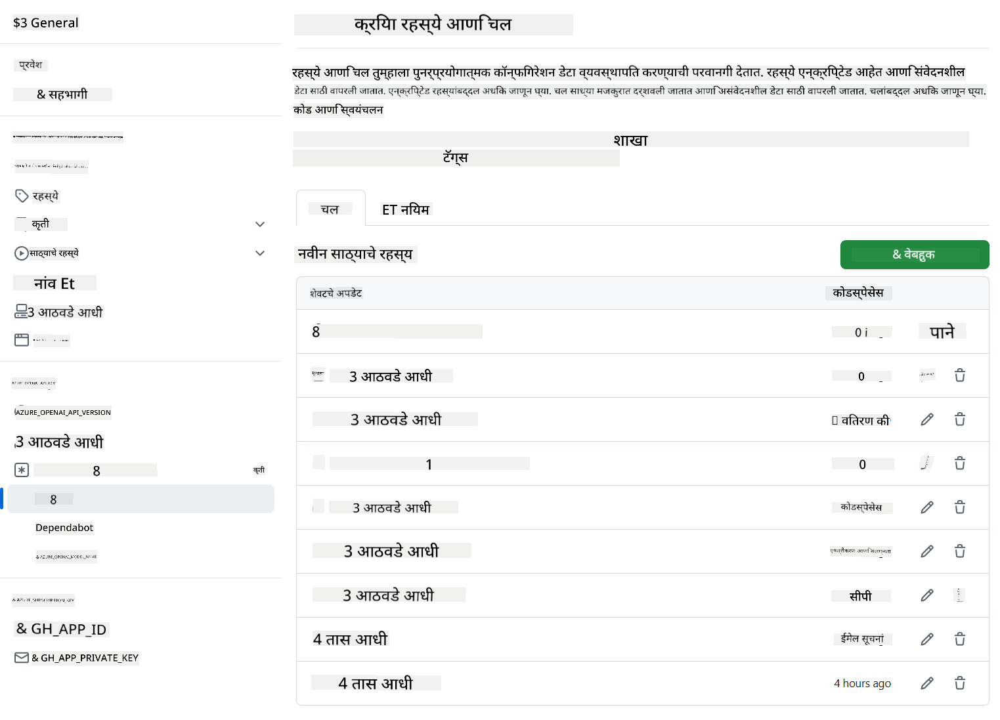

<!--
CO_OP_TRANSLATOR_METADATA:
{
  "original_hash": "c437820027c197f25fb2cbee95bae28c",
  "translation_date": "2025-06-12T19:06:27+00:00",
  "source_file": "getting_started/github-actions-guide/github-actions-guide-org.md",
  "language_code": "mr"
}
-->
# Co-op Translator GitHub Action वापरणे (संस्था मार्गदर्शक)

**लक्ष्यित प्रेक्षक:** हा मार्गदर्शक **Microsoft अंतर्गत वापरकर्त्यांसाठी** किंवा **ज्यांना पूर्वनिर्मित Co-op Translator GitHub App साठी आवश्यक प्रमाणपत्रे मिळवण्याचा अधिकार आहे अशा संघांसाठी** किंवा ज्यांना स्वतःचा कस्टम GitHub App तयार करता येतो अशा संघांसाठी आहे.

तुमच्या रिपॉझिटरीच्या दस्तऐवजीकरणाचे भाषांतर सहजपणे स्वयंचलित करा Co-op Translator GitHub Action वापरून. हा मार्गदर्शक तुम्हाला दाखवतो की कसे सेटअप करावे जेणेकरून जेव्हा तुमच्या स्त्रोत Markdown फाइल्स किंवा प्रतिमा बदलतील तेव्हा अपडेटेड भाषांतरांसह आपोआप Pull Requests तयार होतील.

> [!IMPORTANT]
> 
> **योग्य मार्गदर्शक निवडणे:**
>
> हा मार्गदर्शक **GitHub App ID आणि Private Key** वापरून सेटअप कसे करायचे हे स्पष्ट करतो. तुम्हाला सामान्यतः हा "संस्था मार्गदर्शक" पद्धत वापरावी लागते जर: **`GITHUB_TOKEN` परवानग्या मर्यादित असतील:** तुमच्या संस्थेच्या किंवा रिपॉझिटरीच्या सेटिंग्जमध्ये मानक `GITHUB_TOKEN` ला दिलेल्या परवानग्यांवर मर्यादा असतील. विशेषतः, जर `GITHUB_TOKEN` ला आवश्यक `write` परवानग्या (जसे की `contents: write` किंवा `pull-requests: write`) दिल्या नसतील, तर [Public Setup Guide](./github-actions-guide-public.md) मध्ये workflow अपयशी ठरेल कारण परवानग्या अपुरी आहेत. निर्दिष्ट परवानग्यांसह समर्पित GitHub App वापरल्याने ही मर्यादा टाळता येते.
>
> **वरील तुमच्यावर लागू न झाल्यास:**
>
> जर तुमच्या रिपॉझिटरीमध्ये मानक `GITHUB_TOKEN` कडे पुरेशा परवानग्या असतील (म्हणजे तुम्हाला संस्थात्मक मर्यादा लागू नाहीत), तर कृपया **[GITHUB_TOKEN वापरून Public Setup Guide](./github-actions-guide-public.md)** वापरा. सार्वजनिक मार्गदर्शकासाठी App IDs किंवा Private Keys मिळवण्याची किंवा व्यवस्थापित करण्याची गरज नाही आणि ते फक्त मानक `GITHUB_TOKEN` आणि रिपॉझिटरी परवानग्यांवर अवलंबून आहे.

## पूर्वतयारी

GitHub Action कॉन्फिगर करण्यापूर्वी, तुमच्याकडे आवश्यक AI सेवा प्रमाणपत्रे असणे आवश्यक आहे.

**1. आवश्यक: AI भाषा मॉडेल प्रमाणपत्रे**  
तुमच्याकडे किमान एक समर्थित भाषा मॉडेलसाठी प्रमाणपत्रे असावीत:

- **Azure OpenAI**: Endpoint, API Key, Model/Deployment नावे, API आवृत्ती आवश्यक.
- **OpenAI**: API Key आवश्यक, (पर्यायी: Org ID, Base URL, Model ID).
- तपशीलांसाठी पहा [Supported Models and Services](../../../../README.md).
- सेटअप मार्गदर्शक: [Azure OpenAI सेटअप करा](../set-up-resources/set-up-azure-openai.md).

**2. पर्यायी: संगणक दृष्टी प्रमाणपत्रे (प्रतिमा भाषांतरासाठी)**

- फक्त प्रतिमांमधील मजकूर भाषांतर करण्यासाठी आवश्यक.
- **Azure Computer Vision**: Endpoint आणि Subscription Key आवश्यक.
- जर दिले नाही तर, Action [Markdown-only mode](../markdown-only-mode.md) मध्ये चालेल.
- सेटअप मार्गदर्शक: [Azure Computer Vision सेटअप करा](../set-up-resources/set-up-azure-computer-vision.md).

## सेटअप आणि कॉन्फिगरेशन

तुमच्या रिपॉझिटरीमध्ये Co-op Translator GitHub Action कॉन्फिगर करण्यासाठी खालील टप्पे फॉलो करा:

### टप्पा 1: GitHub App Authentication इंस्टॉल आणि कॉन्फिगर करा

Workflow तुमच्या रिपॉझिटरीशी सुरक्षितपणे संवाद साधण्यासाठी GitHub App प्रमाणीकरण वापरतो (उदा. pull requests तयार करण्यासाठी). खालीलपैकी एक पर्याय निवडा:

#### **पर्याय A: पूर्वनिर्मित Co-op Translator GitHub App इंस्टॉल करा (Microsoft अंतर्गत वापरासाठी)**

1. [Co-op Translator GitHub App](https://github.com/apps/co-op-translator) पृष्ठावर जा.

1. **Install** निवडा आणि तुमच्या लक्षित रिपॉझिटरी असलेल्या खात्याचे किंवा संस्थेचे नाव निवडा.

    

1. **Only select repositories** निवडा आणि तुमची लक्षित रिपॉझिटरी (उदा. `PhiCookBook`) निवडा. **Install** क्लिक करा. तुम्हाला प्रमाणीकरणासाठी विचारले जाऊ शकते.

    

1. **App Credentials मिळवा (आतील प्रक्रिया आवश्यक):** Workflow ला app प्रमाणे प्रमाणीकरण करण्यासाठी Co-op Translator टीमकडून दोन माहिती आवश्यक आहे:
  - **App ID:** Co-op Translator app ची अनन्य ओळख. App ID आहे: `1164076`.
  - **Private Key:** तुम्हाला `.pem` नावाच्या खाजगी की फाईलचा **पूर्ण मजकूर** मिळवावा लागेल. **ही की पासवर्डसारखी सांभाळा आणि सुरक्षित ठेवा.**

1. पुढील टप्पा 2 कडे जा.

#### **पर्याय B: तुमचा स्वतःचा कस्टम GitHub App वापरा**

- तुम्हाला हवे असल्यास, स्वतःचा GitHub App तयार करू शकता आणि कॉन्फिगर करू शकता. याला Contents आणि Pull requests वाचन व लेखन परवानगी द्यावी लागेल. त्यासाठी App ID आणि Private Key आवश्यक आहे.

### टप्पा 2: रिपॉझिटरी सीक्रेट्स कॉन्फिगर करा

GitHub App प्रमाणपत्रे आणि तुमची AI सेवा प्रमाणपत्रे एन्क्रिप्टेड सीक्रेट्स म्हणून तुमच्या रिपॉझिटरी सेटिंग्जमध्ये जोडा.

1. तुमच्या लक्षित GitHub रिपॉझिटरीवर जा (उदा. `PhiCookBook`).

1. **Settings** > **Secrets and variables** > **Actions** मध्ये जा.

1. **Repository secrets** अंतर्गत, खालील प्रत्येक सीक्रेटसाठी **New repository secret** क्लिक करा.

   

**आवश्यक सीक्रेट्स (GitHub App Authentication साठी):**

| सीक्रेट नाव            | वर्णन                                            | मूल्य स्रोत                                      |
| :------------------- | :------------------------------------------------ | :------------------------------------------------ |
| `GH_APP_ID`          | GitHub App चे App ID (टप्पा 1 मधून).                 | GitHub App सेटिंग्ज                               |
| `GH_APP_PRIVATE_KEY` | डाउनलोड केलेल्या `.pem` फाईलचा **पूर्ण मजकूर**. | `.pem` फाईल (टप्पा 1 मधून)               |

**AI सेवा सीक्रेट्स (तुमच्या पूर्वतयारीनुसार लागणारे सर्व जोडा):**

| सीक्रेट नाव                         | वर्णन                                       | मूल्य स्रोत                      |
| :---------------------------------- | :------------------------------------------ | :------------------------------ |
| `AZURE_SUBSCRIPTION_KEY`            | Azure AI सेवा (Computer Vision) साठी Key       | Azure AI Foundry                 |
| `AZURE_AI_SERVICE_ENDPOINT`         | Azure AI सेवा (Computer Vision) साठी Endpoint   | Azure AI Foundry                 |
| `AZURE_OPENAI_API_KEY`              | Azure OpenAI सेवा साठी Key                      | Azure AI Foundry                 |
| `AZURE_OPENAI_ENDPOINT`             | Azure OpenAI सेवा साठी Endpoint                  | Azure AI Foundry                 |
| `AZURE_OPENAI_MODEL_NAME`           | तुमचा Azure OpenAI मॉडेल नाव                     | Azure AI Foundry                 |
| `AZURE_OPENAI_CHAT_DEPLOYMENT_NAME` | तुमचा Azure OpenAI Deployment नाव                  | Azure AI Foundry                 |
| `AZURE_OPENAI_API_VERSION`          | Azure OpenAI साठी API आवृत्ती                      | Azure AI Foundry                 |
| `OPENAI_API_KEY`                    | OpenAI साठी API Key                             | OpenAI Platform                 |
| `OPENAI_ORG_ID`                     | OpenAI संस्था ID                                | OpenAI Platform                 |
| `OPENAI_CHAT_MODEL_ID`              | विशिष्ट OpenAI मॉडेल ID                         | OpenAI Platform                 |
| `OPENAI_BASE_URL`                   | सानुकूल OpenAI API बेस URL                      | OpenAI Platform                 |



### टप्पा 3: Workflow फाईल तयार करा

शेवटी, स्वयंचलित workflow परिभाषित करणारी YAML फाईल तयार करा.

1. तुमच्या रिपॉझिटरीच्या मूळ निर्देशिकेत `.github/workflows/` नावाची फोल्डर तयार करा (जर अस्तित्वात नसेल तर).

1. `.github/workflows/` मध्ये `co-op-translator.yml` नावाची फाईल तयार करा.

1. खालील सामग्री co-op-translator.yml मध्ये पेस्ट करा.

```
name: Co-op Translator

on:
  push:
    branches:
      - main

jobs:
  co-op-translator:
    runs-on: ubuntu-latest

    permissions:
      contents: write
      pull-requests: write

    steps:
      - name: Checkout repository
        uses: actions/checkout@v4
        with:
          fetch-depth: 0

      - name: Set up Python
        uses: actions/setup-python@v4
        with:
          python-version: '3.10'

      - name: Install Co-op Translator
        run: |
          python -m pip install --upgrade pip
          pip install co-op-translator

      - name: Run Co-op Translator
        env:
          PYTHONIOENCODING: utf-8
          # Azure AI Service Credentials
          AZURE_SUBSCRIPTION_KEY: ${{ secrets.AZURE_SUBSCRIPTION_KEY }}
          AZURE_AI_SERVICE_ENDPOINT: ${{ secrets.AZURE_AI_SERVICE_ENDPOINT }}

          # Azure OpenAI Credentials
          AZURE_OPENAI_API_KEY: ${{ secrets.AZURE_OPENAI_API_KEY }}
          AZURE_OPENAI_ENDPOINT: ${{ secrets.AZURE_OPENAI_ENDPOINT }}
          AZURE_OPENAI_MODEL_NAME: ${{ secrets.AZURE_OPENAI_MODEL_NAME }}
          AZURE_OPENAI_CHAT_DEPLOYMENT_NAME: ${{ secrets.AZURE_OPENAI_CHAT_DEPLOYMENT_NAME }}
          AZURE_OPENAI_API_VERSION: ${{ secrets.AZURE_OPENAI_API_VERSION }}

          # OpenAI Credentials
          OPENAI_API_KEY: ${{ secrets.OPENAI_API_KEY }}
          OPENAI_ORG_ID: ${{ secrets.OPENAI_ORG_ID }}
          OPENAI_CHAT_MODEL_ID: ${{ secrets.OPENAI_CHAT_MODEL_ID }}
          OPENAI_BASE_URL: ${{ secrets.OPENAI_BASE_URL }}
        run: |
          # =====================================================================
          # IMPORTANT: Set your target languages here (REQUIRED CONFIGURATION)
          # =====================================================================
          # Example: Translate to Spanish, French, German. Add -y to auto-confirm.
          translate -l "es fr de" -y  # <--- MODIFY THIS LINE with your desired languages

      - name: Authenticate GitHub App
        id: generate_token
        uses: tibdex/github-app-token@v1
        with:
          app_id: ${{ secrets.GH_APP_ID }}
          private_key: ${{ secrets.GH_APP_PRIVATE_KEY }}

      - name: Create Pull Request with translations
        uses: peter-evans/create-pull-request@v5
        with:
          token: ${{ steps.generate_token.outputs.token }}
          commit-message: "🌐 Update translations via Co-op Translator"
          title: "🌐 Update translations via Co-op Translator"
          body: |
            This PR updates translations for recent changes to the main branch.

            ### 📋 Changes included
            - Translated contents are available in the `translations/` directory
            - Translated images are available in the `translated_images/` directory

            ---
            🌐 Automatically generated by the [Co-op Translator](https://github.com/Azure/co-op-translator) GitHub Action.
          branch: update-translations
          base: main
          labels: translation, automated-pr
          delete-branch: true
          add-paths: |
            translations/
            translated_images/

```

4.  **Workflow सानुकूल करा:**
  - **[!IMPORTANT] लक्ष्य भाषा:** `Run Co-op Translator` step, you **MUST review and modify the list of language codes** within the `translate -l "..." -y` command to match your project's requirements. The example list (`ar de es...`) needs to be replaced or adjusted.
  - **Trigger (`on:`):** The current trigger runs on every push to `main`. For large repositories, consider adding a `paths:` filter (see commented example in the YAML) to run the workflow only when relevant files (e.g., source documentation) change, saving runner minutes.
  - **PR Details:** Customize the `commit-message`, `title`, `body`, `branch` name, and `labels` in the `Create Pull Request` step if needed.

## Credential Management and Renewal

- **Security:** Always store sensitive credentials (API keys, private keys) as GitHub Actions secrets. Never expose them in your workflow file or repository code.
- **[!IMPORTANT] Key Renewal (Internal Microsoft Users):** Be aware that Azure OpenAI key used within Microsoft might have a mandatory renewal policy (e.g., every 5 months). Ensure you update the corresponding GitHub secrets (`AZURE_OPENAI_...` कीजमध्ये) **त्यांच्या कालबाह्य होण्यापूर्वी** अद्ययावत करा, जेणेकरून workflow अयशस्वी होणार नाही.

## Workflow चालविणे

एकदा `co-op-translator.yml` फाईल तुमच्या main शाखेत (किंवा `on:` trigger), the workflow will automatically run whenever changes are pushed to that branch (and match the `paths` फिल्टरमध्ये नमूद केलेल्या शाखेत, जर कॉन्फिगर केले असेल) मर्ज केली गेली की,

जर भाषांतर तयार किंवा अपडेट झाले, तर हा action आपोआप बदलांसह Pull Request तयार करेल, ज्याची तुम्ही तपासणी करून मर्ज करू शकता.

**अस्वीकरण**:  
हा दस्तऐवज AI भाषांतर सेवा [Co-op Translator](https://github.com/Azure/co-op-translator) वापरून भाषांतरित केला आहे. आम्ही अचूकतेसाठी प्रयत्न करतो, परंतु कृपया लक्षात घ्या की स्वयंचलित भाषांतरांमध्ये चुका किंवा अचूकतेच्या त्रुटी असू शकतात. मूळ दस्तऐवज त्याच्या स्थानिक भाषेत अधिकृत स्रोत मानला जावा. महत्त्वाच्या माहितीसाठी व्यावसायिक मानवी भाषांतर शिफारस केली जाते. या भाषांतराच्या वापरामुळे उद्भवलेल्या कोणत्याही गैरसमजुती किंवा चुकीच्या अर्थलागी आम्ही जबाबदार नाही.