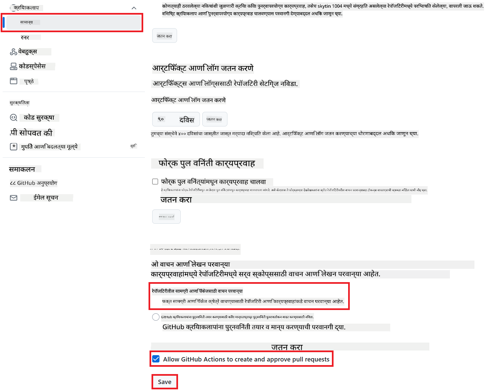

<!--
CO_OP_TRANSLATOR_METADATA:
{
  "original_hash": "a52587a512e667f70d92db853d3c61d5",
  "translation_date": "2025-06-12T19:25:48+00:00",
  "source_file": "getting_started/github-actions-guide/github-actions-guide-public.md",
  "language_code": "mr"
}
-->
# Co-op Translator GitHub Action वापरणे (सार्वजनिक सेटअप)

**लक्ष्य प्रेक्षक:** हा मार्गदर्शक सार्वजनिक किंवा खाजगी बहुतांश रिपॉझिटरीजसाठी आहे जिथे मानक GitHub Actions परवानग्या पुरेश्या असतात. यात अंगभूत `GITHUB_TOKEN` वापरले जाते.

तुमच्या रिपॉझिटरीच्या दस्तऐवजांचे भाषांतर सहजपणे स्वयंचलित करण्यासाठी Co-op Translator GitHub Action वापरा. या मार्गदर्शकात तुम्हाला क्रियाशीलता सेट करण्याची पद्धत समजेल ज्यामुळे जेव्हा तुमच्या स्रोत Markdown फाइल्स किंवा प्रतिमा बदलतील तेव्हा अद्ययावत भाषांतरांसह स्वयंचलितपणे पुल रिक्वेस्ट तयार होईल.

> [!IMPORTANT]
>
> **योग्य मार्गदर्शक निवडणे:**
>
> हा मार्गदर्शक **साधा सेटअप ज्यामध्ये मानक `GITHUB_TOKEN` वापरला जातो** याचे तपशीलवार वर्णन करतो. बहुतांश वापरकर्त्यांसाठी हा शिफारस केलेला मार्ग आहे कारण यात संवेदनशील GitHub App प्रायव्हेट कीज व्यवस्थापित करण्याची गरज नाही.
>

## पूर्वतयारी

GitHub Action कॉन्फिगर करण्यापूर्वी, आवश्यक AI सेवा क्रेडेन्शियल्स तयार आहेत याची खात्री करा.

**1. आवश्यक: AI भाषा मॉडेल क्रेडेन्शियल्स**  
तुम्हाला किमान एका समर्थित भाषा मॉडेलसाठी क्रेडेन्शियल्स आवश्यक आहेत:

- **Azure OpenAI**: Endpoint, API Key, Model/Deployment नावे, API आवृत्ती आवश्यक आहे.  
- **OpenAI**: API Key आवश्यक आहे, (पर्यायी: Org ID, Base URL, Model ID).  
- तपशीलांसाठी [Supported Models and Services](../../../../README.md) पहा.

**2. पर्यायी: AI Vision क्रेडेन्शियल्स (प्रतिमा भाषांतरासाठी)**

- फक्त प्रतिमांमधील मजकूर भाषांतर करायचा असल्यास आवश्यक.  
- **Azure AI Vision**: Endpoint आणि Subscription Key आवश्यक.  
- न दिल्यास, क्रिया [Markdown-only mode](../markdown-only-mode.md) मध्ये चालेल.

## सेटअप आणि कॉन्फिगरेशन

तुमच्या रिपॉझिटरीमध्ये मानक `GITHUB_TOKEN` वापरून Co-op Translator GitHub Action कसे सेट करायचे ते खालीलप्रमाणे आहे.

### पाऊल 1: प्रमाणीकरण समजून घ्या (`GITHUB_TOKEN` वापरून)

हा वर्कफ्लो GitHub Actions कडून दिलेला अंगभूत `GITHUB_TOKEN` वापरतो. या टोकनमुळे वर्कफ्लोला तुमच्या रिपॉझिटरीशी संवाद साधण्यासाठी **पाऊल 3** मध्ये सेट केलेल्या परवानग्यांनुसार स्वयंचलित परवानगी मिळते.

### पाऊल 2: रिपॉझिटरी सीक्रेट्स कॉन्फिगर करा

तुम्हाला फक्त तुमच्या **AI सेवा क्रेडेन्शियल्स** रिपॉझिटरी सेटिंग्जमध्ये एन्क्रिप्टेड सीक्रेट्स म्हणून जोडायचे आहेत.

1. तुमच्या लक्ष्य GitHub रिपॉझिटरीवर जा.  
2. **Settings** > **Secrets and variables** > **Actions** या विभागात जा.  
3. **Repository secrets** अंतर्गत प्रत्येक आवश्यक AI सेवा सीक्रेटसाठी **New repository secret** क्लिक करा.

     *(प्रतिमा संदर्भ: सीक्रेट्स कुठे जोडायचे ते दाखवते)*

**आवश्यक AI सेवा सीक्रेट्स (तुमच्या पूर्वतयारीनुसार लागणारे सर्व जोडा):**

| Secret Name                         | वर्णन                                    | मूल्य स्रोत                        |
| :---------------------------------- | :---------------------------------------- | :------------------------------- |
| `AZURE_SUBSCRIPTION_KEY`            | Azure AI सेवा (Computer Vision) साठी Key       | तुमचा Azure AI Foundry             |
| `AZURE_AI_SERVICE_ENDPOINT`         | Azure AI सेवा (Computer Vision) साठी Endpoint  | तुमचा Azure AI Foundry             |
| `AZURE_OPENAI_API_KEY`              | Azure OpenAI सेवेसाठी Key                     | तुमचा Azure AI Foundry             |
| `AZURE_OPENAI_ENDPOINT`             | Azure OpenAI सेवेसाठी Endpoint                | तुमचा Azure AI Foundry             |
| `AZURE_OPENAI_MODEL_NAME`           | तुमचा Azure OpenAI मॉडेल नाव                  | तुमचा Azure AI Foundry             |
| `AZURE_OPENAI_CHAT_DEPLOYMENT_NAME` | तुमचा Azure OpenAI Deployment नाव               | तुमचा Azure AI Foundry             |
| `AZURE_OPENAI_API_VERSION`          | Azure OpenAI साठी API आवृत्ती                   | तुमचा Azure AI Foundry             |
| `OPENAI_API_KEY`                    | OpenAI साठी API Key                           | तुमचा OpenAI Platform              |
| `OPENAI_ORG_ID`                     | OpenAI संस्था आयडी (पर्यायी)                   | तुमचा OpenAI Platform              |
| `OPENAI_CHAT_MODEL_ID`              | विशिष्ट OpenAI मॉडेल आयडी (पर्यायी)            | तुमचा OpenAI Platform              |
| `OPENAI_BASE_URL`                   | सानुकूल OpenAI API बेस URL (पर्यायी)           | तुमचा OpenAI Platform              |

### पाऊल 3: वर्कफ्लो परवानग्या कॉन्फिगर करा

GitHub Action ला कोड चेकआउट करण्यासाठी आणि पुल रिक्वेस्ट तयार करण्यासाठी `GITHUB_TOKEN` मार्फत परवानग्या दिल्या पाहिजेत.

1. तुमच्या रिपॉझिटरीमध्ये **Settings** > **Actions** > **General** येथे जा.  
2. **Workflow permissions** विभागाकडे स्क्रोल करा.  
3. **Read and write permissions** निवडा. त्यामुळे `GITHUB_TOKEN` ला या वर्कफ्लोसाठी आवश्यक `contents: write` आणि `pull-requests: write` परवानग्या मिळतील.  
4. **Allow GitHub Actions to create and approve pull requests** या पर्यायावर टिक मार्क असणे आवश्यक आहे.  
5. **Save** करा.



### पाऊल 4: वर्कफ्लो फाइल तयार करा

शेवटी, अंगभूत `GITHUB_TOKEN` वापरून स्वयंचलित वर्कफ्लो परिभाषित करणारी YAML फाइल तयार करा.

1. तुमच्या रिपॉझिटरीच्या मूळ निर्देशिकेत `.github/workflows/` नावाचा फोल्डर नसल्यास तयार करा.  
2. `.github/workflows/` मध्ये `co-op-translator.yml` नावाची फाइल तयार करा.  
3. खालील कंटेंट `co-op-translator.yml` मध्ये पेस्ट करा.

```yaml
name: Co-op Translator

on:
  push:
    branches:
      - main

jobs:
  co-op-translator:
    runs-on: ubuntu-latest

    permissions:
      contents: write
      pull-requests: write

    steps:
      - name: Checkout repository
        uses: actions/checkout@v4
        with:
          fetch-depth: 0

      - name: Set up Python
        uses: actions/setup-python@v4
        with:
          python-version: '3.10'

      - name: Install Co-op Translator
        run: |
          python -m pip install --upgrade pip
          pip install co-op-translator

      - name: Run Co-op Translator
        env:
          PYTHONIOENCODING: utf-8
          # === AI Service Credentials ===
          AZURE_SUBSCRIPTION_KEY: ${{ secrets.AZURE_SUBSCRIPTION_KEY }}
          AZURE_AI_SERVICE_ENDPOINT: ${{ secrets.AZURE_AI_SERVICE_ENDPOINT }}
          AZURE_OPENAI_API_KEY: ${{ secrets.AZURE_OPENAI_API_KEY }}
          AZURE_OPENAI_ENDPOINT: ${{ secrets.AZURE_OPENAI_ENDPOINT }}
          AZURE_OPENAI_MODEL_NAME: ${{ secrets.AZURE_OPENAI_MODEL_NAME }}
          AZURE_OPENAI_CHAT_DEPLOYMENT_NAME: ${{ secrets.AZURE_OPENAI_CHAT_DEPLOYMENT_NAME }}
          AZURE_OPENAI_API_VERSION: ${{ secrets.AZURE_OPENAI_API_VERSION }}
          OPENAI_API_KEY: ${{ secrets.OPENAI_API_KEY }}
          OPENAI_ORG_ID: ${{ secrets.OPENAI_ORG_ID }}
          OPENAI_CHAT_MODEL_ID: ${{ secrets.OPENAI_CHAT_MODEL_ID }}
          OPENAI_BASE_URL: ${{ secrets.OPENAI_BASE_URL }}
        run: |
          # =====================================================================
          # IMPORTANT: Set your target languages here (REQUIRED CONFIGURATION)
          # =====================================================================
          # Example: Translate to Spanish, French, German. Add -y to auto-confirm.
          translate -l "es fr de" -y  # <--- MODIFY THIS LINE with your desired languages

      - name: Create Pull Request with translations
        uses: peter-evans/create-pull-request@v5
        with:
          token: ${{ secrets.GITHUB_TOKEN }}
          commit-message: "🌐 Update translations via Co-op Translator"
          title: "🌐 Update translations via Co-op Translator"
          body: |
            This PR updates translations for recent changes to the main branch.

            ### 📋 Changes included
            - Translated contents are available in the `translations/` directory
            - Translated images are available in the `translated_images/` directory

            ---
            🌐 Automatically generated by the [Co-op Translator](https://github.com/Azure/co-op-translator) GitHub Action.
          branch: update-translations
          base: main
          labels: translation, automated-pr
          delete-branch: true
          add-paths: |
            translations/
            translated_images/
```  
4. **वर्कफ्लो सानुकूल करा:**  
  - **[!IMPORTANT] लक्ष्य भाषा:** `Run Co-op Translator` step, you **MUST review and modify the list of language codes** within the `translate -l "..." -y` command to match your project's requirements. The example list (`ar de es...`) needs to be replaced or adjusted.
  - **Trigger (`on:`):** The current trigger runs on every push to `main`. For large repositories, consider adding a `paths:` filter (see commented example in the YAML) to run the workflow only when relevant files (e.g., source documentation) change, saving runner minutes.
  - **PR Details:** Customize the `commit-message`, `title`, `body`, `branch` name, and `labels` in the `Create Pull Request` या टप्प्यात आवश्यकतेनुसार बदल करा.

**अस्वीकरण**:  
हा दस्तऐवज AI अनुवाद सेवा [Co-op Translator](https://github.com/Azure/co-op-translator) वापरून अनुवादित केला आहे. आम्ही अचूकतेसाठी प्रयत्नशील असलो तरी, कृपया लक्षात घ्या की स्वयंचलित अनुवादांमध्ये चुका किंवा अचूकतेत कमतरता असू शकते. मूळ दस्तऐवज त्याच्या स्थानिक भाषेत अधिकृत स्रोत मानला जावा. महत्त्वाच्या माहितीसाठी व्यावसायिक मानवी अनुवादाची शिफारस केली जाते. या अनुवादाच्या वापरामुळे उद्भवलेल्या कोणत्याही गैरसमजुती किंवा चुकीच्या अर्थलागीसाठी आम्ही जबाबदार नाही.