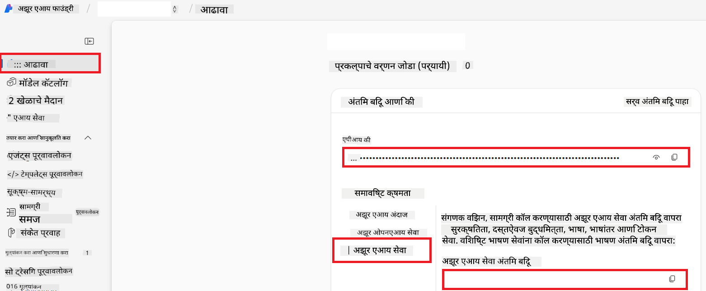

<!--
CO_OP_TRANSLATOR_METADATA:
{
  "original_hash": "b58d7c3cb4210697a073d20eb3064945",
  "translation_date": "2025-06-12T11:50:00+00:00",
  "source_file": "getting_started/set-up-azure-ai.md",
  "language_code": "mr"
}
-->
# Azure AI सह को-ऑप ट्रान्सलेटरसाठी सेट अप करा (Azure OpenAI & Azure AI Vision)

हा मार्गदर्शक तुम्हाला Azure AI Foundry मध्ये भाषा अनुवादासाठी Azure OpenAI आणि प्रतिमा सामग्री विश्लेषणासाठी Azure Computer Vision (जे नंतर प्रतिमा-आधारित अनुवादासाठी वापरले जाऊ शकते) सेटअप कसा करायचा ते दाखवतो.

**पूर्वतयारी:**
- सक्रिय सदस्यत्व असलेले Azure खाते.
- तुमच्या Azure सदस्यत्वात संसाधने आणि डिप्लॉयमेंट तयार करण्यासाठी पुरेशी परवानग्या.

## Azure AI प्रोजेक्ट तयार करा

तुम्ही Azure AI प्रोजेक्ट तयार करून सुरू कराल, जे तुमच्या AI संसाधनांचे व्यवस्थापन करण्यासाठी एक केंद्रबिंदू म्हणून कार्य करते.

1. [https://ai.azure.com](https://ai.azure.com) वर जा आणि तुमच्या Azure खात्याने साइन इन करा.

1. नवीन प्रोजेक्ट तयार करण्यासाठी **+Create** निवडा.

1. पुढील कार्य करा:
   - **Project name** भरा (उदा., `CoopTranslator-Project`).
   - **AI hub** निवडा (उदा., `CoopTranslator-Hub`) (गरज असल्यास नवीन तयार करा).

1. "**Review and Create**" क्लिक करा आणि तुमचा प्रोजेक्ट तयार करा. तुम्हाला प्रोजेक्टच्या आढावा पृष्ठावर नेले जाईल.

## भाषा अनुवादासाठी Azure OpenAI सेट अप करा

तुमच्या प्रोजेक्टमध्ये, तुम्ही मजकूर अनुवादासाठी बॅकएंड म्हणून काम करणारा Azure OpenAI मॉडेल डिप्लॉय कराल.

### तुमच्या प्रोजेक्टकडे जा

जर आधीच नसल्यास, Azure AI Foundry मध्ये तुमचा नव्याने तयार केलेला प्रोजेक्ट (उदा., `CoopTranslator-Project`) उघडा.

### OpenAI मॉडेल डिप्लॉय करा

1. प्रोजेक्टच्या डाव्या मेनूमध्ये, "My assets" अंतर्गत "**Models + endpoints**" निवडा.

1. **+ Deploy model** क्लिक करा.

1. **Deploy Base Model** निवडा.

1. उपलब्ध मॉडेल्सची यादी दिसेल. योग्य GPT मॉडेल शोधा किंवा फिल्टर करा. आम्ही `gpt-4o` शिफारस करतो.

1. तुमचे इच्छित मॉडेल निवडा आणि **Confirm** क्लिक करा.

1. **Deploy** निवडा.

### Azure OpenAI कॉन्फिगरेशन

डिप्लॉय झाल्यावर, तुम्ही "**Models + endpoints**" पृष्ठावरून डिप्लॉयमेंट निवडून त्याचा **REST endpoint URL**, **Key**, **Deployment name**, **Model name** आणि **API version** पाहू शकता. हे अनुवाद मॉडेल तुमच्या अॅप्लिकेशनमध्ये समाकलित करण्यासाठी आवश्यक असतील.

> [!NOTE]
> तुमच्या गरजेनुसार [API version deprecation](https://learn.microsoft.com/azure/ai-services/openai/api-version-deprecation) पृष्ठावरून API आवृत्ती निवडू शकता. लक्षात ठेवा की **API version** आणि Azure AI Foundry मधील "**Models + endpoints**" पृष्ठावर दिसणारी **Model version** वेगळी असते.

## प्रतिमा अनुवादासाठी Azure Computer Vision सेट अप करा

प्रतिमांमधील मजकूराचा अनुवाद सक्षम करण्यासाठी, तुम्हाला Azure AI Service API Key आणि Endpoint शोधावे लागतील.

1. तुमच्या Azure AI प्रोजेक्टकडे जा (उदा., `CoopTranslator-Project`). प्रोजेक्टच्या आढावा पृष्ठावर असल्याची खात्री करा.

### Azure AI Service कॉन्फिगरेशन

Azure AI Service मधून API Key आणि Endpoint शोधा.

1. तुमच्या Azure AI प्रोजेक्टकडे जा (उदा., `CoopTranslator-Project`). प्रोजेक्टच्या आढावा पृष्ठावर असल्याची खात्री करा.

1. Azure AI Service टॅबमधून **API Key** आणि **Endpoint** शोधा.

    

ही कनेक्शन लिंक केलेल्या Azure AI Services संसाधनाच्या क्षमतांना (प्रतिमा विश्लेषणासह) तुमच्या AI Foundry प्रोजेक्टमध्ये उपलब्ध करून देते. तुम्ही नंतर हे कनेक्शन तुमच्या नोटबुक्स किंवा अॅप्लिकेशन्समध्ये वापरून प्रतिमांमधून मजकूर काढू शकता, जो नंतर Azure OpenAI मॉडेलकडे अनुवादासाठी पाठवला जाऊ शकतो.

## तुमची क्रेडेन्शियल्स एकत्र करा

आता, तुम्ही खालील गोष्टी जमा केल्या असाव्यात:

**Azure OpenAI साठी (मजकूर अनुवाद):**
- Azure OpenAI Endpoint
- Azure OpenAI API Key
- Azure OpenAI Model Name (उदा., `gpt-4o`)
- Azure OpenAI Deployment Name (उदा., `cooptranslator-gpt4o`)
- Azure OpenAI API Version

**Azure AI Services साठी (दृष्टीद्वारे प्रतिमा मजकूर काढणे):**
- Azure AI Service Endpoint
- Azure AI Service API Key

### उदाहरण: पर्यावरण चल कॉन्फिगरेशन (पूर्वावलोकन)

नंतर, जेव्हा तुम्ही तुमचे अॅप्लिकेशन तयार कराल, तेव्हा तुम्ही कदाचित हे जमा केलेले क्रेडेन्शियल्स पर्यावरण चल म्हणून सेट कराल, जसे की:

```bash
# Azure AI Service Credentials (Required for image translation)
AZURE_AI_SERVICE_API_KEY="your_azure_ai_service_api_key" # e.g., 21xasd...
AZURE_AI_SERVICE_ENDPOINT="https://your_azure_ai_service_endpoint.cognitiveservices.azure.com/"

# Azure OpenAI Credentials (Required for text translation)
AZURE_OPENAI_API_KEY="your_azure_openai_api_key" # e.g., 21xasd...
AZURE_OPENAI_ENDPOINT="https://your_azure_openai_endpoint.openai.azure.com/"
AZURE_OPENAI_MODEL_NAME="your_model_name" # e.g., gpt-4o
AZURE_OPENAI_CHAT_DEPLOYMENT_NAME="your_deployment_name" # e.g., cooptranslator-gpt4o
AZURE_OPENAI_API_VERSION="your_api_version" # e.g., 2024-12-01-preview
```

---

### पुढील वाचन

- [Azure AI Foundry मध्ये प्रोजेक्ट कसा तयार करावा](https://learn.microsoft.com/azure/ai-foundry/how-to/create-projects?tabs=ai-studio)
- [Azure AI संसाधने कशी तयार करायची](https://learn.microsoft.com/azure/ai-foundry/how-to/create-azure-ai-resource?tabs=portal)
- [Azure AI Foundry मध्ये OpenAI मॉडेल कसे डिप्लॉय करायचे](https://learn.microsoft.com/en-us/azure/ai-foundry/how-to/deploy-models-openai)

**अस्वीकरण**:  
हा दस्तऐवज AI भाषांतर सेवा [Co-op Translator](https://github.com/Azure/co-op-translator) वापरून भाषांतरित केला आहे. आम्ही अचूकतेसाठी प्रयत्न करतो, तरी कृपया लक्षात घ्या की स्वयंचलित भाषांतरांमध्ये चुका किंवा अचूकतेत फरक असू शकतो. मूळ दस्तऐवज त्याच्या स्थानिक भाषेत अधिकृत स्रोत मानला जावा. महत्त्वाच्या माहितीसाठी व्यावसायिक मानवी भाषांतर शिफारसीय आहे. या भाषांतराच्या वापरामुळे उद्भवणाऱ्या कोणत्याही गैरसमजुती किंवा चुकीसाठी आम्ही जबाबदार नाही.