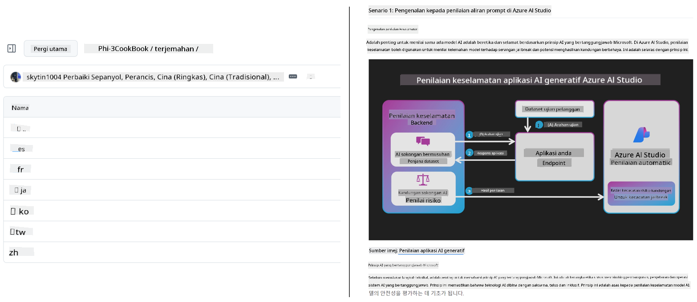
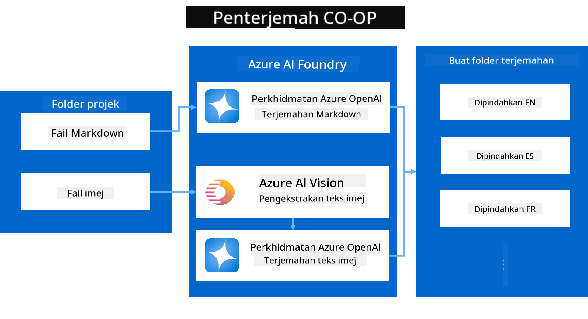
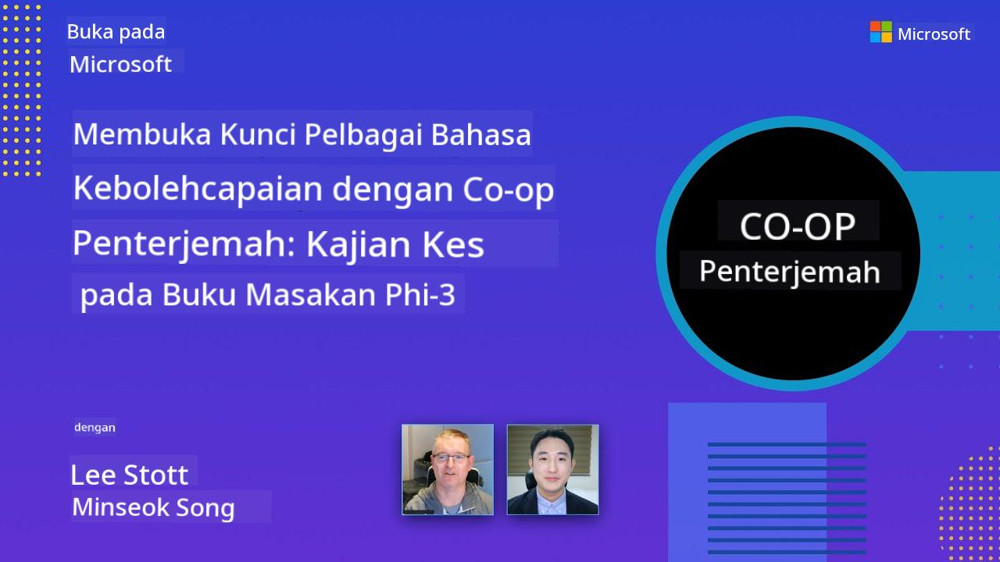

<!--
CO_OP_TRANSLATOR_METADATA:
{
  "original_hash": "044724537b57868117aadae8e7728c7c",
  "translation_date": "2025-06-12T10:42:44+00:00",
  "source_file": "README.md",
  "language_code": "ms"
}
-->


# مترجم Co-op: أتمتة ترجمة الوثائق التعليمية بسهولة

_قم بأتمتة ترجمة وثائقك إلى عدة لغات بسهولة للوصول إلى جمهور عالمي._

[](https://pypi.org/project/co-op-translator/)
[](https://github.com/azure/co-op-translator/blob/main/LICENSE)
[](https://pepy.tech/project/co-op-translator)
[](https://pepy.tech/project/co-op-translator)
[](https://github.com/psf/black)

[](https://GitHub.com/azure/co-op-translator/graphs/contributors/)
[](https://GitHub.com/azure/co-op-translator/issues/)
[](https://GitHub.com/azure/co-op-translator/pulls/)
[](http://makeapullrequest.com)

### دعم اللغات مدعوم من Co-op Translator
[Perancis](../fr/README.md) | [Sepanyol](../es/README.md) | [Jerman](../de/README.md) | [Rusia](../ru/README.md) | [Arab](../ar/README.md) | [Parsi (Farsi)](../fa/README.md) | [Urdu](../ur/README.md) | [Cina (Ringkas)](../zh/README.md) | [Cina (Tradisional, Macau)](../mo/README.md) | [Cina (Tradisional, Hong Kong)](../hk/README.md) | [Cina (Tradisional, Taiwan)](../tw/README.md) | [Jepun](../ja/README.md) | [Korea](../ko/README.md) | [Hindi](../hi/README.md) | [Bengali](../bn/README.md) | [Marathi](../mr/README.md) | [Nepali](../ne/README.md) | [Punjabi (Gurmukhi)](../pa/README.md) | [Portugis (Portugal)](../pt/README.md) | [Portugis (Brazil)](../br/README.md) | [Itali](../it/README.md) | [Poland](../pl/README.md) | [Turki](../tr/README.md) | [Greek](../el/README.md) | [Thai](../th/README.md) | [Sweden](../sv/README.md) | [Denmark](../da/README.md) | [Norway](../no/README.md) | [Finland](../fi/README.md) | [Belanda](../nl/README.md) | [Ibrani](../he/README.md) | [Vietnam](../vi/README.md) | [Indonesia](../id/README.md) | [Melayu](./README.md) | [Tagalog (Filipino)](../tl/README.md) | [Swahili](../sw/README.md) | [Hungary](../hu/README.md) | [Czech](../cs/README.md) | [Slovak](../sk/README.md) | [Romania](../ro/README.md) | [Bulgaria](../bg/README.md) | [Serbia (Cyrillic)](../sr/README.md) | [Croatia](../hr/README.md) | [Slovenia](../sl/README.md) | [Ukraine](../uk/README.md) | [Burma (Myanmar)](../my/README.md)
> [!NOTE]
> هذه هي الترجمات الحالية لمحتوى هذا المستودع. للحصول على قائمة كاملة باللغات المدعومة من Co-op Translator، يرجى الاطلاع على قسم [Language Support](../..).

[](https://GitHub.com/azure/co-op-translator/watchers/)
[](https://GitHub.com/azure/co-op-translator/network/)
[](https://GitHub.com/azure/co-op-translator/stargazers/)

[](https://discord.com/invite/ByRwuEEgH4)

[](https://codespaces.new/azure/co-op-translator)
[](https://vscode.dev/redirect?url=vscode://ms-vscode-remote.remote-containers/cloneInVolume?url=https://github.com/azure/co-op-translator)

## نظرة عامة: تبسيط ترجمة المحتوى التعليمي الخاص بك

تشكل حواجز اللغة عائقًا كبيرًا أمام وصول المتعلمين والمطورين حول العالم إلى الموارد التعليمية القيمة والمعرفة التقنية. هذا يحد من المشاركة ويبطئ وتيرة الابتكار والتعلم على الصعيد العالمي.

تم إنشاء **Co-op Translator** استجابةً للحاجة إلى تحسين عملية الترجمة اليدوية غير الفعالة لسلسلة مايكروسوفت التعليمية واسعة النطاق (مثل أدلة "للمبتدئين"). وقد تطور ليصبح أداة سهلة الاستخدام وقوية تهدف إلى إزالة هذه الحواجز للجميع. من خلال توفير ترجمات آلية عالية الجودة عبر واجهة الأوامر وGitHub Actions، يمكن لـ Co-op Translator تمكين المعلمين والطلاب والباحثين والمطورين حول العالم من مشاركة المعرفة والوصول إليها بدون قيود لغوية.

شاهد كيف ينظم Co-op Translator المحتوى التعليمي المترجم:



يتم ترجمة ملفات Markdown ونصوص الصور تلقائيًا وتنظيمها بشكل مرتب داخل مجلدات مخصصة لكل لغة.

**افتح الوصول العالمي لمحتواك التعليمي مع Co-op Translator اليوم!**

## دعم الوصول العالمي لموارد التعلم من مايكروسوفت

يساعد Co-op Translator في سد فجوة اللغة للمبادرات التعليمية الرئيسية لمايكروسوفت، حيث يقوم بأتمتة عملية الترجمة للمستودعات التي تخدم مجتمع المطورين العالمي. من الأمثلة التي تستخدم Co-op Translator حاليًا:

[](https://github.com/microsoft/Generative-AI-for-beginners)
[](https://github.com/microsoft/ML-For-Beginners)
[](https://github.com/microsoft/AI-For-Beginners)
[](https://github.com/microsoft/ai-agents-for-beginners)
[](https://github.com/microsoft/PhiCookBook)
[](https://github.com/microsoft/Generative-AI-for-beginners-dotnet)

## الميزات الرئيسية

- **ترجمات آلية**: ترجم النصوص إلى عدة لغات بسهولة.
- **تكامل مع GitHub Actions**: أتمتة الترجمة كجزء من خط CI/CD الخاص بك.
- **الحفاظ على تنسيق Markdown**: الحفاظ على بناء جملة Markdown الصحيح أثناء الترجمة.
- **ترجمة نص الصور**: استخراج وترجمة النصوص داخل الصور.
- **تقنية LLM متقدمة**: استخدام نماذج لغوية متطورة لترجمات عالية الجودة.
- **تكامل سهل**: دمج سلس مع إعداد مشروعك الحالي.
- **تبسيط التعريب**: تبسيط عملية تعريب مشروعك للأسواق الدولية.

## كيف يعمل



يأخذ Co-op Translator ملفات Markdown والصور من مجلد مشروعك ويعالجها كما يلي:

1. **استخراج النصوص**: استخراج النص من ملفات Markdown، وإذا تم التكوين (مثل استخدام Azure AI Vision)، النصوص المضمنة داخل الصور.
1. **الترجمة بالذكاء الاصطناعي**: إرسال النصوص المستخرجة إلى نموذج اللغة المحدد (Azure OpenAI، OpenAI، إلخ) للترجمة.
1. **حفظ النتائج**: حفظ ملفات Markdown المترجمة والصور (مع النصوص المترجمة) داخل مجلدات مخصصة لكل لغة مع الحفاظ على التنسيق الأصلي.

## البدء

ابدأ بسرعة باستخدام واجهة الأوامر (CLI) أو قم بإعداد الأتمتة الكاملة مع GitHub Actions. اختر الطريقة التي تناسب سير عملك:

1. **سطر الأوامر (CLI)** - لترجمات لمرة واحدة أو تحكم يدوي
2. **GitHub Actions** - لترجمات آلية عند كل عملية دفع (push)

> [!NOTE]
> رغم أن هذا الدليل يركز على موارد Azure، يمكنك استخدام أي نموذج لغة مدعوم.

### دعم اللغات

يدعم Co-op Translator مجموعة واسعة من اللغات لمساعدتك على الوصول إلى جمهور عالمي. إليك ما تحتاج معرفته:

#### مرجع سريع

| اللغة | الرمز | اللغة | الرمز | اللغة | الرمز |
|----------|------|----------|------|----------|------|
| Arabic | ar | Bengali | bn | Bulgarian | bg |
| Burmese (Myanmar) | my | Chinese (Simplified) | zh | Chinese (Traditional, HK) | hk |
| Chinese (Traditional, Macau) | mo | Chinese (Traditional, TW) | tw | Croatian | hr |
| Czech | cs | Danish | da | Dutch | nl |
| Finnish | fi | French | fr | German | de |
| Greek | el | Hebrew | he | Hindi | hi |
| Hungarian | hu | Indonesian | id | Italian | it |
| Japanese | ja | Korean | ko | Malay | ms |
| Marathi | mr | Nepali | ne | Norwegian | no |
| Persian (Farsi) | fa | Polish | pl | Portuguese (Brazil) | br |
| Portuguese (Portugal) | pt | Punjabi (Gurmukhi) | pa | Romanian | ro |
| Russian | ru | Serbian (Cyrillic) | sr | Slovak | sk |
| Slovenian | sl | Spanish | es | Swahili | sw |
| Swedish | sv | Tagalog (Filipino) | tl | Thai | th |
| Turkish | tr | Ukrainian | uk | Urdu | ur |
| Vietnamese | vi | — | — | — | — |

#### استخدام رموز اللغات

عند استخدام Co-op Translator، ستحتاج إلى تحديد اللغات باستخدام رموزها. على سبيل المثال:

```bash
# Translate to French, Spanish, and German
translate -l "fr es de"

# Translate to Chinese (Simplified) and Japanese
translate -l "zh ja"
```

> [!NOTE]
> لمعلومات تقنية مفصلة حول دعم اللغات، بما في ذلك:
>
> - مواصفات الخطوط لكل لغة
> - المشاكل المعروفة
> - كيفية إضافة لغات جديدة
>
> راجع [Supported Languages Documentation](./getting_started/supported-languages.md).

### النماذج والخدمات المدعومة

| النوع                  | الاسم                           |
|-----------------------|--------------------------------|
| نموذج اللغة        |   |
| AI Vision       |  |

> [!NOTE]
> إذا لم تتوفر خدمة AI Vision، سينتقل co-op translator تلقائيًا إلى [وضع Markdown فقط](./getting_started/markdown-only-mode.md).

### الإعداد الأولي

قبل البدء، ستحتاج إلى إعداد الموارد التالية:

1. مورد نموذج اللغة (مطلوب):
   - Azure OpenAI (موصى به) - يوفر ترجمات عالية الجودة مع موثوقية على مستوى المؤسسات
   - OpenAI - خيار بديل إذا لم يكن لديك وصول إلى Azure
   - للمزيد من التفاصيل حول النماذج المدعومة، راجع [Supported Models and Services](../..)

1. مورد AI Vision (اختياري):
   - Azure AI Vision - يمكّن ترجمة النص داخل الصور
   - إذا لم يتم التكوين، سيستخدم المترجم تلقائيًا [وضع Markdown فقط](./getting_started/markdown-only-mode.md)
   - يُنصح به للمشاريع التي تحتوي على صور بها نص يحتاج إلى ترجمة

1. خطوات التكوين:
   - اتبع دليلنا لإعداد Azure AI [Azure AI setup guide](./getting_started/set-up-azure-ai.md) للحصول على تعليمات مفصلة
   - أنشئ ملف `.env` يحتوي على مفاتيح API ونقاط النهاية الخاصة بك (راجع قسم [Quick Start](../..))
   - تأكد من أن لديك الأذونات والحصص اللازمة للخدمات التي اخترتها

### إعداد المشروع قبل الترجمة

قبل بدء عملية الترجمة، اتبع هذه الخطوات لتحضير مشروعك:

1. إعداد README الخاص بك:
   - أضف جدول الترجمات إلى README.md لربط النسخ المترجمة
   - نموذج التنسيق:

     ```markdown

     ### 🌐 Multi-Language Support
     
     [French](../fr/README.md) | [Spanish](../es/README.md) | [German](../de/README.md) | [Russian](../ru/README.md) | [Arabic](../ar/README.md) | [Persian (Farsi)](../fa/README.md) | [Urdu](../ur/README.md) | [Chinese (Simplified)](../zh/README.md) | [Chinese (Traditional, Macau)](../mo/README.md) | [Chinese (Traditional, Hong Kong)](../hk/README.md) | [Chinese (Traditional, Taiwan)](../tw/README.md) | [Japanese](../ja/README.md) | [Korean](../ko/README.md) | [Hindi](../hi/README.md) | [Bengali](../bn/README.md) | [Marathi](../mr/README.md) | [Nepali](../ne/README.md) | [Punjabi (Gurmukhi)](../pa/README.md) | [Portuguese (Portugal)](../pt/README.md) | [Portuguese (Brazil)](../br/README.md) | [Italian](../it/README.md) | [Polish](../pl/README.md) | [Turkish](../tr/README.md) | [Greek](../el/README.md) | [Thai](../th/README.md) | [Swedish](../sv/README.md) | [Danish](../da/README.md) | [Norwegian](../no/README.md) | [Finnish](../fi/README.md) | [Dutch](../nl/README.md) | [Hebrew](../he/README.md) | [Vietnamese](../vi/README.md) | [Indonesian](../id/README.md) | [Malay](./README.md) | [Tagalog (Filipino)](../tl/README.md) | [Swahili](../sw/README.md) | [Hungarian](../hu/README.md) | [Czech](../cs/README.md) | [Slovak](../sk/README.md) | [Romanian](../ro/README.md) | [Bulgarian](../bg/README.md) | [Serbian (Cyrillic)](../sr/README.md) | [Croatian](../hr/README.md) | [Slovenian](../sl/README.md) | [Ukrainian](../uk/README.md) | [Burmese (Myanmar)](../my/README.md) 
    
     ```

1. تنظيف الترجمات الحالية (إذا لزم الأمر):
   - احذف أي مجلدات ترجمة موجودة (مثل `translations/`)
   - احذف أي ملفات ترجمة قديمة للبدء من جديد
   - هذا يضمن عدم وجود تعارضات مع عملية الترجمة الجديدة

### بدء سريع: سطر الأوامر

للبدء السريع باستخدام سطر الأوامر:

1. أنشئ بيئة افتراضية:

    ```bash
    python -m venv .venv
    ```

1. فعّل البيئة الافتراضية:

    - على ويندوز:

    ```bash
    .venv\scripts\activate
    ```

    - على لينكس/ماك:

    ```bash
    source .venv/bin/activate
    ```

1. ثبّت الحزمة:

    ```bash
    pip install co-op-translator
    ```

1. إعداد بيانات الاعتماد:

    - أنشئ ملف `.env` file in your project's root directory.
    - Copy the contents from the [.env.template](../../.env.template) file into your new `.env` file.
    - Fill in the required API keys and endpoint information in your `.env` file.

1. Run Translation:
    - Navigate to your project's root directory in your terminal.
    - Execute the translate command, specifying target languages with the `-l` مع العلم:

    ```bash
    translate -l "ko ja fr"
    ```

    _(استبدل `"ko ja fr"` with your desired space-separated language codes)_

### Detailed Usage Guides

Choose the approach that best fits your workflow:

#### 1. Using the Command Line (CLI)

- Best for: One-time translations, manual control, or integration into custom scripts.
- Requires: Local installation of Python and the `co-op-translator` package.
- Guide: [Command Line Guide](./getting_started/command-line-guide/command-line-guide.md)

#### 2. Using GitHub Actions (Automation)

- Best for: Automatically translating content whenever changes are pushed to your repository. Keeps translations consistently up-to-date.
- Requires: Setting up a workflow file (`.github/workflows`) في مستودعك. لا حاجة لتثبيت محلي.
- الأدلة:
  - [GitHub Actions Guide (Public Repositories & Standard Secrets)](./getting_started/github-actions-guide/github-actions-guide-public.md) - استخدم هذا لمعظم المستودعات العامة أو الشخصية التي تعتمد على أسرار المستودع القياسية.
  - [GitHub Actions Guide (Microsoft Organization Repos & Org-Level Setups)](./getting_started/github-actions-guide/github-actions-guide-org.md) - استخدم هذا الدليل إذا كنت تعمل ضمن منظمة مايكروسوفت على GitHub أو تحتاج لاستخدام أسرار المنظمة أو مشغلاتها.

### استكشاف الأخطاء والنصائح

- [دليل استكشاف الأخطاء](./getting_started/troubleshooting.md)

### موارد إضافية

- [مرجع الأوامر](./getting_started/command-reference.md): دليل مفصل لجميع الأوامر والخيارات المتاحة.
- [اللغات المدعومة](./getting_started/supported-languages.md): تحقق من قائمة اللغات المدعومة وتعليمات إضافة لغات جديدة.
- [وضع Markdown فقط](./getting_started/markdown-only-mode.md): كيفية ترجمة النص فقط، بدون ترجمة الصور.

## عروض فيديو

تعرف أكثر على Co-op Translator من خلال عروضنا التقديمية _(انقر على الصورة أدناه للمشاهدة على يوتيوب)_:

- **Open at Microsoft**: مقدمة مختصرة مدتها 18 دقيقة ودليل سريع حول كيفية استخدام Co-op Translator.
[](https://www.youtube.com/watch?v=jX_swfH_KNU)

## Support Us and Foster Global Learning

Join us in transforming how educational content is shared worldwide! Give [Co-op Translator](https://github.com/azure/co-op-translator) a ⭐ on GitHub and help us break down language barriers in learning and technology. Your interest and contributions make a real difference! Code contributions and feature suggestions are always welcome.

## Contributing

This project welcomes contributions and suggestions. Interested in helping with Azure Co-op Translator? Please see our [CONTRIBUTING.md](./CONTRIBUTING.md) for guidelines on how you can help make Co-op Translator more accessible.

## Contributors

[](https://github.com/Azure/co-op-translator/graphs/contributors)

## Code of Conduct

This project follows the [Microsoft Open Source Code of Conduct](https://opensource.microsoft.com/codeofconduct/).
For more details, see the [Code of Conduct FAQ](https://opensource.microsoft.com/codeofconduct/faq/) or
contact [opencode@microsoft.com](mailto:opencode@microsoft.com) with any questions or comments.

## Responsible AI

Microsoft is dedicated to helping customers use our AI products responsibly, sharing insights, and building trust through tools like Transparency Notes and Impact Assessments. Many of these resources are available at [https://aka.ms/RAI](https://aka.ms/RAI).  
Microsoft’s approach to responsible AI is based on principles of fairness, reliability and safety, privacy and security, inclusiveness, transparency, and accountability.

Large-scale natural language, image, and speech models—like those used in this sample—may sometimes behave unfairly, unreliably, or offensively, potentially causing harm. Please review the [Azure OpenAI service Transparency note](https://learn.microsoft.com/legal/cognitive-services/openai/transparency-note?tabs=text) to understand the risks and limitations.

The recommended way to reduce these risks is to include a safety system in your architecture that can detect and block harmful behavior. [Azure AI Content Safety](https://learn.microsoft.com/azure/ai-services/content-safety/overview) offers an independent protection layer that detects harmful user-generated and AI-generated content in apps and services. Azure AI Content Safety includes text and image APIs to identify harmful material. There’s also an interactive Content Safety Studio where you can explore and test sample code for detecting harmful content across different types. The following [quickstart documentation](https://learn.microsoft.com/azure/ai-services/content-safety/quickstart-text?tabs=visual-studio%2Clinux&pivots=programming-language-rest) guides you through making requests to the service.

Another important factor is overall application performance. For multi-modal and multi-model applications, performance means the system behaves as expected by you and your users, including avoiding harmful outputs. It’s important to evaluate your application’s performance using [generation quality and risk and safety metrics](https://learn.microsoft.com/azure/ai-studio/concepts/evaluation-metrics-built-in).

You can test your AI application in your development environment with the [prompt flow SDK](https://microsoft.github.io/promptflow/index.html). Using a test dataset or target, your generative AI outputs are quantitatively measured with built-in or custom evaluators. To get started with the prompt flow SDK for evaluation, follow the [quickstart guide](https://learn.microsoft.com/azure/ai-studio/how-to/develop/flow-evaluate-sdk). After running an evaluation, you can [visualize the results in Azure AI Studio](https://learn.microsoft.com/azure/ai-studio/how-to/evaluate-flow-results).

## Trademarks

This project may include trademarks or logos for projects, products, or services. Authorized use of Microsoft trademarks or logos must comply with [Microsoft's Trademark & Brand Guidelines](https://www.microsoft.com/en-us/legal/intellectualproperty/trademarks/usage/general).  
Using Microsoft trademarks or logos in modified versions of this project must not cause confusion or imply Microsoft sponsorship.  
Any use of third-party trademarks or logos is subject to the policies of those third parties.

**Penafian**:  
Dokumen ini telah diterjemahkan menggunakan perkhidmatan terjemahan AI [Co-op Translator](https://github.com/Azure/co-op-translator). Walaupun kami berusaha untuk ketepatan, sila ambil perhatian bahawa terjemahan automatik mungkin mengandungi kesilapan atau ketidaktepatan. Dokumen asal dalam bahasa asalnya harus dianggap sebagai sumber yang sahih. Untuk maklumat penting, terjemahan profesional oleh manusia adalah disyorkan. Kami tidak bertanggungjawab atas sebarang salah faham atau salah tafsir yang timbul daripada penggunaan terjemahan ini.