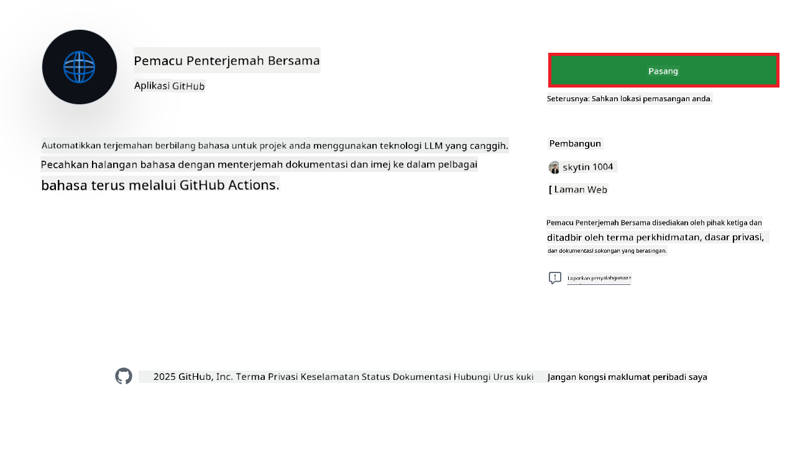
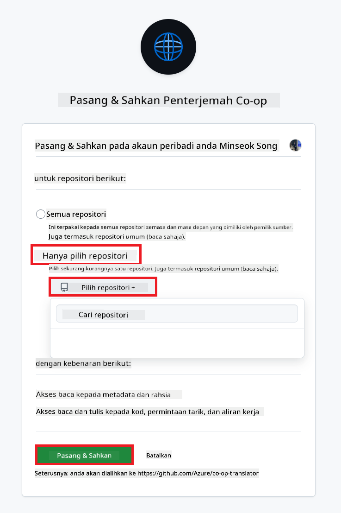
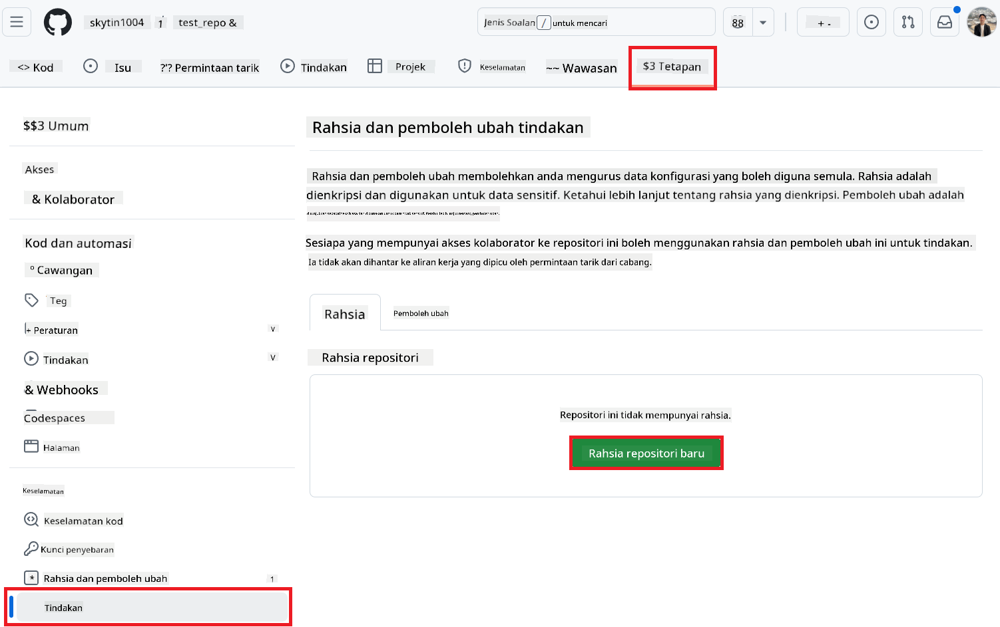
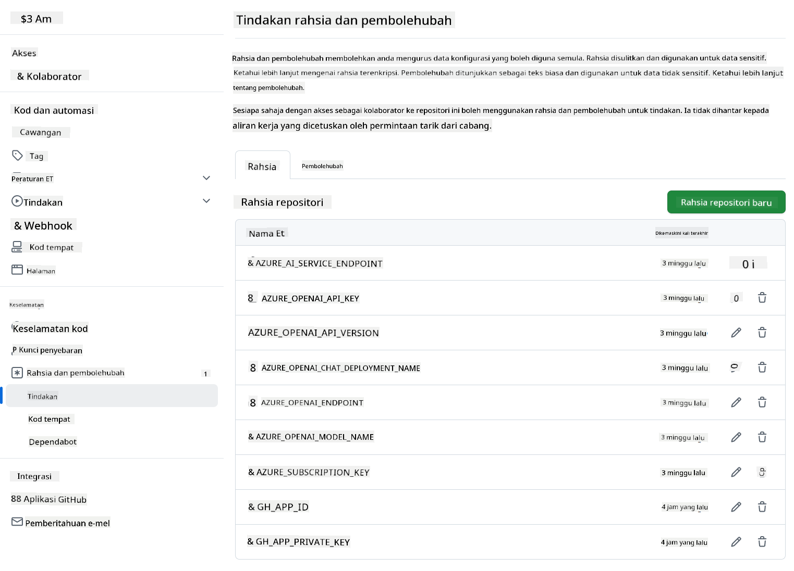

<!--
CO_OP_TRANSLATOR_METADATA:
{
  "original_hash": "c437820027c197f25fb2cbee95bae28c",
  "translation_date": "2025-06-12T19:14:35+00:00",
  "source_file": "getting_started/github-actions-guide/github-actions-guide-org.md",
  "language_code": "ms"
}
-->
# Menggunakan Co-op Translator GitHub Action (Panduan Organisasi)

**Sasaran Pembaca:** Panduan ini ditujukan untuk **pengguna dalaman Microsoft** atau **pasukan yang mempunyai akses kepada kelayakan yang diperlukan untuk GitHub App Co-op Translator yang telah dibina sebelumnya** atau boleh mencipta GitHub App tersuai mereka sendiri.

Automatikkan terjemahan dokumentasi repositori anda dengan mudah menggunakan Co-op Translator GitHub Action. Panduan ini membimbing anda untuk menyediakan tindakan tersebut supaya secara automatik mencipta pull request dengan terjemahan terkini setiap kali fail Markdown sumber atau imej anda berubah.

> [!IMPORTANT]
> 
> **Memilih Panduan Yang Sesuai:**
>
> Panduan ini menerangkan cara penyediaan menggunakan **GitHub App ID dan Kunci Peribadi**. Anda biasanya memerlukan kaedah "Panduan Organisasi" ini jika: **`GITHUB_TOKEN` Kebenaran Terhad:** Tetapan organisasi atau repositori anda mengehadkan kebenaran lalai yang diberikan kepada `GITHUB_TOKEN` standard. Terutamanya, jika `GITHUB_TOKEN` tidak dibenarkan kebenaran `write` yang diperlukan (seperti `contents: write` atau `pull-requests: write`), aliran kerja dalam [Panduan Penyediaan Awam](./github-actions-guide-public.md) akan gagal kerana kekurangan kebenaran. Menggunakan GitHub App khusus dengan kebenaran yang diberikan secara eksplisit mengatasi had ini.
>
> **Jika perkara di atas tidak terpakai kepada anda:**
>
> Jika `GITHUB_TOKEN` standard mempunyai kebenaran yang mencukupi dalam repositori anda (iaitu, anda tidak dihalang oleh sekatan organisasi), sila gunakan **[Panduan Penyediaan Awam menggunakan GITHUB_TOKEN](./github-actions-guide-public.md)**. Panduan awam tidak memerlukan anda mendapatkan atau menguruskan App ID atau Kunci Peribadi dan bergantung sepenuhnya pada `GITHUB_TOKEN` standard dan kebenaran repositori.

## Prasyarat

Sebelum mengkonfigurasi GitHub Action, pastikan anda mempunyai kelayakan perkhidmatan AI yang diperlukan.

**1. Diperlukan: Kelayakan Model Bahasa AI**  
Anda memerlukan kelayakan untuk sekurang-kurangnya satu Model Bahasa yang disokong:

- **Azure OpenAI**: Memerlukan Endpoint, Kunci API, Nama Model/Pelaksanaan, Versi API.  
- **OpenAI**: Memerlukan Kunci API, (Pilihan: ID Organisasi, URL Asas, ID Model).  
- Lihat [Model dan Perkhidmatan yang Disokong](../../../../README.md) untuk maklumat lanjut.  
- Panduan Penyediaan: [Sediakan Azure OpenAI](../set-up-resources/set-up-azure-openai.md).

**2. Pilihan: Kelayakan Computer Vision (untuk Terjemahan Imej)**

- Diperlukan hanya jika anda perlu menterjemah teks dalam imej.  
- **Azure Computer Vision**: Memerlukan Endpoint dan Kunci Langganan.  
- Jika tidak disediakan, tindakan akan menggunakan [mod Markdown sahaja](../markdown-only-mode.md).  
- Panduan Penyediaan: [Sediakan Azure Computer Vision](../set-up-resources/set-up-azure-computer-vision.md).

## Penyediaan dan Konfigurasi

Ikuti langkah-langkah berikut untuk mengkonfigurasi Co-op Translator GitHub Action dalam repositori anda:

### Langkah 1: Pasang dan Konfigurasikan Pengesahan GitHub App

Aliran kerja menggunakan pengesahan GitHub App untuk berinteraksi dengan selamat dengan repositori anda (contohnya, mencipta pull request) bagi pihak anda. Pilih satu pilihan:

#### **Pilihan A: Pasang GitHub App Co-op Translator yang Telah Dibina (untuk Penggunaan Dalaman Microsoft)**

1. Lawati halaman [Co-op Translator GitHub App](https://github.com/apps/co-op-translator).

1. Pilih **Install** dan pilih akaun atau organisasi di mana repositori sasaran anda berada.

    

1. Pilih **Only select repositories** dan pilih repositori sasaran anda (contohnya, `PhiCookBook`). Klik **Install**. Anda mungkin diminta untuk mengesahkan.

    

1. **Dapatkan Kelayakan App (Proses Dalaman Diperlukan):** Untuk membolehkan aliran kerja mengesahkan sebagai app, anda memerlukan dua maklumat yang disediakan oleh pasukan Co-op Translator:  
  - **App ID:** Pengenal unik untuk app Co-op Translator. App ID ialah: `1164076`.  
  - **Kunci Peribadi:** Anda mesti mendapatkan **keseluruhan kandungan** fail kunci peribadi `.pem` daripada penyelia yang bertanggungjawab. **Anggap kunci ini seperti kata laluan dan simpan dengan selamat.**

1. Teruskan ke Langkah 2.

#### **Pilihan B: Gunakan GitHub App Tersuai Anda Sendiri**

- Jika anda mahu, anda boleh mencipta dan mengkonfigurasi GitHub App tersuai anda sendiri. Pastikan ia mempunyai akses Baca & Tulis ke Kandungan dan Pull requests. Anda akan memerlukan App ID dan Kunci Peribadi yang dijana.

### Langkah 2: Konfigurasikan Secrets Repositori

Anda perlu menambah kelayakan GitHub App dan kelayakan perkhidmatan AI anda sebagai secrets yang disulitkan dalam tetapan repositori anda.

1. Pergi ke repositori GitHub sasaran anda (contohnya, `PhiCookBook`).

1. Pergi ke **Settings** > **Secrets and variables** > **Actions**.

1. Di bawah **Repository secrets**, klik **New repository secret** untuk setiap secret yang disenaraikan di bawah.

   

**Secrets Diperlukan (untuk Pengesahan GitHub App):**

| Nama Secret          | Penerangan                                      | Sumber Nilai                                     |
| :------------------- | :----------------------------------------------- | :----------------------------------------------- |
| `GH_APP_ID`          | App ID GitHub App (dari Langkah 1).               | Tetapan GitHub App                              |
| `GH_APP_PRIVATE_KEY` | **Keseluruhan kandungan** fail `.pem` yang dimuat turun. | Fail `.pem` (dari Langkah 1)                      |

**Secrets Perkhidmatan AI (Tambah SEMUA yang berkaitan berdasarkan Prasyarat anda):**

| Nama Secret                         | Penerangan                               | Sumber Nilai                     |
| :---------------------------------- | :---------------------------------------- | :------------------------------- |
| `AZURE_SUBSCRIPTION_KEY`            | Kunci untuk Perkhidmatan AI Azure (Computer Vision)  | Azure AI Foundry                    |
| `AZURE_AI_SERVICE_ENDPOINT`         | Endpoint untuk Perkhidmatan AI Azure (Computer Vision) | Azure AI Foundry                     |
| `AZURE_OPENAI_API_KEY`              | Kunci untuk perkhidmatan Azure OpenAI              | Azure AI Foundry                     |
| `AZURE_OPENAI_ENDPOINT`             | Endpoint untuk perkhidmatan Azure OpenAI         | Azure AI Foundry                     |
| `AZURE_OPENAI_MODEL_NAME`           | Nama Model Azure OpenAI anda              | Azure AI Foundry                     |
| `AZURE_OPENAI_CHAT_DEPLOYMENT_NAME` | Nama Pelaksanaan Azure OpenAI anda         | Azure AI Foundry                     |
| `AZURE_OPENAI_API_VERSION`          | Versi API untuk Azure OpenAI              | Azure AI Foundry                     |
| `OPENAI_API_KEY`                    | Kunci API untuk OpenAI                        | OpenAI Platform                  |
| `OPENAI_ORG_ID`                     | ID Organisasi OpenAI                    | OpenAI Platform                  |
| `OPENAI_CHAT_MODEL_ID`              | ID model OpenAI khusus                  | OpenAI Platform                    |
| `OPENAI_BASE_URL`                   | URL Asas API OpenAI Tersuai                | OpenAI Platform                    |



### Langkah 3: Cipta Fail Aliran Kerja

Akhir sekali, cipta fail YAML yang mentakrifkan aliran kerja automatik.

1. Dalam direktori root repositori anda, cipta direktori `.github/workflows/` jika belum ada.

1. Di dalam `.github/workflows/`, cipta fail bernama `co-op-translator.yml`.

1. Tampal kandungan berikut ke dalam co-op-translator.yml.

```
name: Co-op Translator

on:
  push:
    branches:
      - main

jobs:
  co-op-translator:
    runs-on: ubuntu-latest

    permissions:
      contents: write
      pull-requests: write

    steps:
      - name: Checkout repository
        uses: actions/checkout@v4
        with:
          fetch-depth: 0

      - name: Set up Python
        uses: actions/setup-python@v4
        with:
          python-version: '3.10'

      - name: Install Co-op Translator
        run: |
          python -m pip install --upgrade pip
          pip install co-op-translator

      - name: Run Co-op Translator
        env:
          PYTHONIOENCODING: utf-8
          # Azure AI Service Credentials
          AZURE_SUBSCRIPTION_KEY: ${{ secrets.AZURE_SUBSCRIPTION_KEY }}
          AZURE_AI_SERVICE_ENDPOINT: ${{ secrets.AZURE_AI_SERVICE_ENDPOINT }}

          # Azure OpenAI Credentials
          AZURE_OPENAI_API_KEY: ${{ secrets.AZURE_OPENAI_API_KEY }}
          AZURE_OPENAI_ENDPOINT: ${{ secrets.AZURE_OPENAI_ENDPOINT }}
          AZURE_OPENAI_MODEL_NAME: ${{ secrets.AZURE_OPENAI_MODEL_NAME }}
          AZURE_OPENAI_CHAT_DEPLOYMENT_NAME: ${{ secrets.AZURE_OPENAI_CHAT_DEPLOYMENT_NAME }}
          AZURE_OPENAI_API_VERSION: ${{ secrets.AZURE_OPENAI_API_VERSION }}

          # OpenAI Credentials
          OPENAI_API_KEY: ${{ secrets.OPENAI_API_KEY }}
          OPENAI_ORG_ID: ${{ secrets.OPENAI_ORG_ID }}
          OPENAI_CHAT_MODEL_ID: ${{ secrets.OPENAI_CHAT_MODEL_ID }}
          OPENAI_BASE_URL: ${{ secrets.OPENAI_BASE_URL }}
        run: |
          # =====================================================================
          # IMPORTANT: Set your target languages here (REQUIRED CONFIGURATION)
          # =====================================================================
          # Example: Translate to Spanish, French, German. Add -y to auto-confirm.
          translate -l "es fr de" -y  # <--- MODIFY THIS LINE with your desired languages

      - name: Authenticate GitHub App
        id: generate_token
        uses: tibdex/github-app-token@v1
        with:
          app_id: ${{ secrets.GH_APP_ID }}
          private_key: ${{ secrets.GH_APP_PRIVATE_KEY }}

      - name: Create Pull Request with translations
        uses: peter-evans/create-pull-request@v5
        with:
          token: ${{ steps.generate_token.outputs.token }}
          commit-message: "🌐 Update translations via Co-op Translator"
          title: "🌐 Update translations via Co-op Translator"
          body: |
            This PR updates translations for recent changes to the main branch.

            ### 📋 Changes included
            - Translated contents are available in the `translations/` directory
            - Translated images are available in the `translated_images/` directory

            ---
            🌐 Automatically generated by the [Co-op Translator](https://github.com/Azure/co-op-translator) GitHub Action.
          branch: update-translations
          base: main
          labels: translation, automated-pr
          delete-branch: true
          add-paths: |
            translations/
            translated_images/

```

4.  **Sesuaikan Aliran Kerja:**  
  - **[!IMPORTANT] Bahasa Sasaran:** Dalam `Run Co-op Translator` step, you **MUST review and modify the list of language codes** within the `translate -l "..." -y` command to match your project's requirements. The example list (`ar de es...`) needs to be replaced or adjusted.
  - **Trigger (`on:`):** The current trigger runs on every push to `main`. For large repositories, consider adding a `paths:` filter (see commented example in the YAML) to run the workflow only when relevant files (e.g., source documentation) change, saving runner minutes.
  - **PR Details:** Customize the `commit-message`, `title`, `body`, `branch` name, and `labels` in the `Create Pull Request` step if needed.

## Credential Management and Renewal

- **Security:** Always store sensitive credentials (API keys, private keys) as GitHub Actions secrets. Never expose them in your workflow file or repository code.
- **[!IMPORTANT] Key Renewal (Internal Microsoft Users):** Be aware that Azure OpenAI key used within Microsoft might have a mandatory renewal policy (e.g., every 5 months). Ensure you update the corresponding GitHub secrets (`AZURE_OPENAI_...` kunci) **sebelum ia tamat tempoh** untuk mengelakkan kegagalan aliran kerja.

## Menjalankan Aliran Kerja

Setelah fail `co-op-translator.yml` digabungkan ke dalam cawangan utama anda (atau cawangan yang ditetapkan dalam penapis `on:` trigger), the workflow will automatically run whenever changes are pushed to that branch (and match the `paths`, jika dikonfigurasi).

Jika terjemahan dihasilkan atau dikemas kini, tindakan akan secara automatik mencipta Pull Request yang mengandungi perubahan tersebut, sedia untuk anda semak dan gabungkan.

**Penafian**:  
Dokumen ini telah diterjemahkan menggunakan perkhidmatan terjemahan AI [Co-op Translator](https://github.com/Azure/co-op-translator). Walaupun kami berusaha untuk ketepatan, sila maklum bahawa terjemahan automatik mungkin mengandungi kesilapan atau ketidaktepatan. Dokumen asal dalam bahasa asalnya harus dianggap sebagai sumber yang sahih. Untuk maklumat penting, terjemahan profesional oleh manusia adalah disyorkan. Kami tidak bertanggungjawab atas sebarang salah faham atau salah tafsir yang timbul daripada penggunaan terjemahan ini.