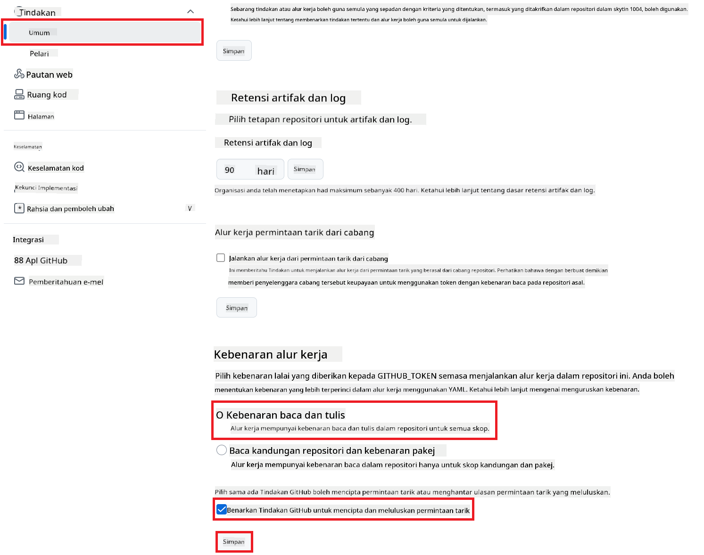

<!--
CO_OP_TRANSLATOR_METADATA:
{
  "original_hash": "a52587a512e667f70d92db853d3c61d5",
  "translation_date": "2025-06-12T19:32:20+00:00",
  "source_file": "getting_started/github-actions-guide/github-actions-guide-public.md",
  "language_code": "ms"
}
-->
# Menggunakan Co-op Translator GitHub Action (Tetapan Awam)

**Sasaran Pembaca:** Panduan ini ditujukan kepada pengguna dalam kebanyakan repositori awam atau persendirian di mana kebenaran GitHub Actions standard adalah mencukupi. Ia menggunakan `GITHUB_TOKEN` terbina dalam.

Automatikkan terjemahan dokumentasi repositori anda dengan mudah menggunakan Co-op Translator GitHub Action. Panduan ini membimbing anda cara menyediakan action ini untuk secara automatik mencipta pull request dengan terjemahan terkini setiap kali fail Markdown sumber atau imej anda berubah.

> [!IMPORTANT]
>
> **Memilih Panduan Yang Betul:**
>
> Panduan ini menerangkan **penyediaan yang lebih mudah menggunakan `GITHUB_TOKEN` standard**. Ini adalah kaedah yang disyorkan untuk kebanyakan pengguna kerana ia tidak memerlukan pengurusan Kunci Peribadi GitHub App yang sensitif.
>

## Prasyarat

Sebelum mengkonfigurasi GitHub Action, pastikan anda mempunyai kelayakan perkhidmatan AI yang diperlukan.

**1. Diperlukan: Kelayakan Model Bahasa AI**  
Anda perlu kelayakan untuk sekurang-kurangnya satu Model Bahasa yang disokong:

- **Azure OpenAI**: Memerlukan Endpoint, Kunci API, Nama Model/Penerapan, Versi API.  
- **OpenAI**: Memerlukan Kunci API, (Pilihan: ID Organisasi, URL Asas, ID Model).  
- Lihat [Supported Models and Services](../../../../README.md) untuk maklumat lanjut.

**2. Pilihan: Kelayakan AI Vision (untuk Terjemahan Imej)**

- Diperlukan hanya jika anda ingin menterjemah teks dalam imej.  
- **Azure AI Vision**: Memerlukan Endpoint dan Kunci Langganan.  
- Jika tidak disediakan, action akan menggunakan [mod Markdown sahaja](../markdown-only-mode.md).

## Persediaan dan Konfigurasi

Ikuti langkah-langkah ini untuk mengkonfigurasi Co-op Translator GitHub Action dalam repositori anda menggunakan `GITHUB_TOKEN` standard.

### Langkah 1: Fahami Pengesahan (Menggunakan `GITHUB_TOKEN`)

Aliran kerja ini menggunakan `GITHUB_TOKEN` terbina dalam yang disediakan oleh GitHub Actions. Token ini secara automatik memberi kebenaran kepada aliran kerja untuk berinteraksi dengan repositori anda berdasarkan tetapan yang dikonfigurasi dalam **Langkah 3**.

### Langkah 2: Konfigurasikan Rahsia Repositori

Anda hanya perlu menambah **kelayakan perkhidmatan AI** sebagai rahsia tersulit dalam tetapan repositori anda.

1.  Pergi ke repositori sasaran GitHub anda.  
2.  Pilih **Settings** > **Secrets and variables** > **Actions**.  
3.  Di bawah **Repository secrets**, klik **New repository secret** untuk setiap rahsia perkhidmatan AI yang diperlukan seperti disenaraikan di bawah.

     *(Rujukan Imej: Menunjukkan lokasi menambah rahsia)*

**Rahsia Perkhidmatan AI Diperlukan (Tambah SEMUA yang berkenaan mengikut Prasyarat anda):**

| Nama Rahsia                         | Penerangan                                | Sumber Nilai                    |
| :---------------------------------- | :---------------------------------------- | :------------------------------ |
| `AZURE_SUBSCRIPTION_KEY`            | Kunci untuk Perkhidmatan Azure AI (Computer Vision)  | Azure AI Foundry anda            |
| `AZURE_AI_SERVICE_ENDPOINT`         | Endpoint untuk Perkhidmatan Azure AI (Computer Vision) | Azure AI Foundry anda            |
| `AZURE_OPENAI_API_KEY`              | Kunci untuk perkhidmatan Azure OpenAI              | Azure AI Foundry anda            |
| `AZURE_OPENAI_ENDPOINT`             | Endpoint untuk perkhidmatan Azure OpenAI         | Azure AI Foundry anda            |
| `AZURE_OPENAI_MODEL_NAME`           | Nama Model Azure OpenAI anda              | Azure AI Foundry anda            |
| `AZURE_OPENAI_CHAT_DEPLOYMENT_NAME` | Nama Penerapan Azure OpenAI anda         | Azure AI Foundry anda            |
| `AZURE_OPENAI_API_VERSION`          | Versi API untuk Azure OpenAI              | Azure AI Foundry anda            |
| `OPENAI_API_KEY`                    | Kunci API untuk OpenAI                        | Platform OpenAI anda             |
| `OPENAI_ORG_ID`                     | ID Organisasi OpenAI (Pilihan)         | Platform OpenAI anda             |
| `OPENAI_CHAT_MODEL_ID`              | ID model OpenAI khusus (Pilihan)       | Platform OpenAI anda             |
| `OPENAI_BASE_URL`                   | URL Asas API OpenAI tersuai (Pilihan)     | Platform OpenAI anda             |

### Langkah 3: Konfigurasikan Kebenaran Aliran Kerja

GitHub Action memerlukan kebenaran yang diberikan melalui `GITHUB_TOKEN` untuk memeriksa kod dan mencipta pull request.

1.  Dalam repositori anda, pergi ke **Settings** > **Actions** > **General**.  
2.  Skrol ke bawah ke bahagian **Workflow permissions**.  
3.  Pilih **Read and write permissions**. Ini memberikan `GITHUB_TOKEN` kebenaran `contents: write` dan `pull-requests: write` yang diperlukan untuk aliran kerja ini.  
4.  Pastikan kotak pilihan untuk **Allow GitHub Actions to create and approve pull requests** ditanda.  
5.  Klik **Save**.



### Langkah 4: Cipta Fail Aliran Kerja

Akhir sekali, cipta fail YAML yang mentakrifkan aliran kerja automatik menggunakan `GITHUB_TOKEN`.

1.  Di direktori akar repositori anda, cipta direktori `.github/workflows/` jika belum ada.  
2.  Dalam `.github/workflows/`, cipta fail bernama `co-op-translator.yml`.  
3.  Tampal kandungan berikut ke dalam `co-op-translator.yml`.

```yaml
name: Co-op Translator

on:
  push:
    branches:
      - main

jobs:
  co-op-translator:
    runs-on: ubuntu-latest

    permissions:
      contents: write
      pull-requests: write

    steps:
      - name: Checkout repository
        uses: actions/checkout@v4
        with:
          fetch-depth: 0

      - name: Set up Python
        uses: actions/setup-python@v4
        with:
          python-version: '3.10'

      - name: Install Co-op Translator
        run: |
          python -m pip install --upgrade pip
          pip install co-op-translator

      - name: Run Co-op Translator
        env:
          PYTHONIOENCODING: utf-8
          # === AI Service Credentials ===
          AZURE_SUBSCRIPTION_KEY: ${{ secrets.AZURE_SUBSCRIPTION_KEY }}
          AZURE_AI_SERVICE_ENDPOINT: ${{ secrets.AZURE_AI_SERVICE_ENDPOINT }}
          AZURE_OPENAI_API_KEY: ${{ secrets.AZURE_OPENAI_API_KEY }}
          AZURE_OPENAI_ENDPOINT: ${{ secrets.AZURE_OPENAI_ENDPOINT }}
          AZURE_OPENAI_MODEL_NAME: ${{ secrets.AZURE_OPENAI_MODEL_NAME }}
          AZURE_OPENAI_CHAT_DEPLOYMENT_NAME: ${{ secrets.AZURE_OPENAI_CHAT_DEPLOYMENT_NAME }}
          AZURE_OPENAI_API_VERSION: ${{ secrets.AZURE_OPENAI_API_VERSION }}
          OPENAI_API_KEY: ${{ secrets.OPENAI_API_KEY }}
          OPENAI_ORG_ID: ${{ secrets.OPENAI_ORG_ID }}
          OPENAI_CHAT_MODEL_ID: ${{ secrets.OPENAI_CHAT_MODEL_ID }}
          OPENAI_BASE_URL: ${{ secrets.OPENAI_BASE_URL }}
        run: |
          # =====================================================================
          # IMPORTANT: Set your target languages here (REQUIRED CONFIGURATION)
          # =====================================================================
          # Example: Translate to Spanish, French, German. Add -y to auto-confirm.
          translate -l "es fr de" -y  # <--- MODIFY THIS LINE with your desired languages

      - name: Create Pull Request with translations
        uses: peter-evans/create-pull-request@v5
        with:
          token: ${{ secrets.GITHUB_TOKEN }}
          commit-message: "🌐 Update translations via Co-op Translator"
          title: "🌐 Update translations via Co-op Translator"
          body: |
            This PR updates translations for recent changes to the main branch.

            ### 📋 Changes included
            - Translated contents are available in the `translations/` directory
            - Translated images are available in the `translated_images/` directory

            ---
            🌐 Automatically generated by the [Co-op Translator](https://github.com/Azure/co-op-translator) GitHub Action.
          branch: update-translations
          base: main
          labels: translation, automated-pr
          delete-branch: true
          add-paths: |
            translations/
            translated_images/
```  
4.  **Sesuaikan Aliran Kerja:**  
  - **[!IMPORTANT] Bahasa Sasaran:** Dalam langkah `Run Co-op Translator` step, you **MUST review and modify the list of language codes** within the `translate -l "..." -y` command to match your project's requirements. The example list (`ar de es...`) needs to be replaced or adjusted.
  - **Trigger (`on:`):** The current trigger runs on every push to `main`. For large repositories, consider adding a `paths:` filter (see commented example in the YAML) to run the workflow only when relevant files (e.g., source documentation) change, saving runner minutes.
  - **PR Details:** Customize the `commit-message`, `title`, `body`, `branch` name, and `labels` in the `Create Pull Request` jika perlu.

**Penafian**:  
Dokumen ini telah diterjemahkan menggunakan perkhidmatan terjemahan AI [Co-op Translator](https://github.com/Azure/co-op-translator). Walaupun kami berusaha untuk ketepatan, sila ambil maklum bahawa terjemahan automatik mungkin mengandungi kesilapan atau ketidaktepatan. Dokumen asal dalam bahasa asalnya hendaklah dianggap sebagai sumber yang sahih. Untuk maklumat penting, terjemahan profesional oleh manusia adalah disyorkan. Kami tidak bertanggungjawab atas sebarang salah faham atau salah tafsir yang timbul daripada penggunaan terjemahan ini.