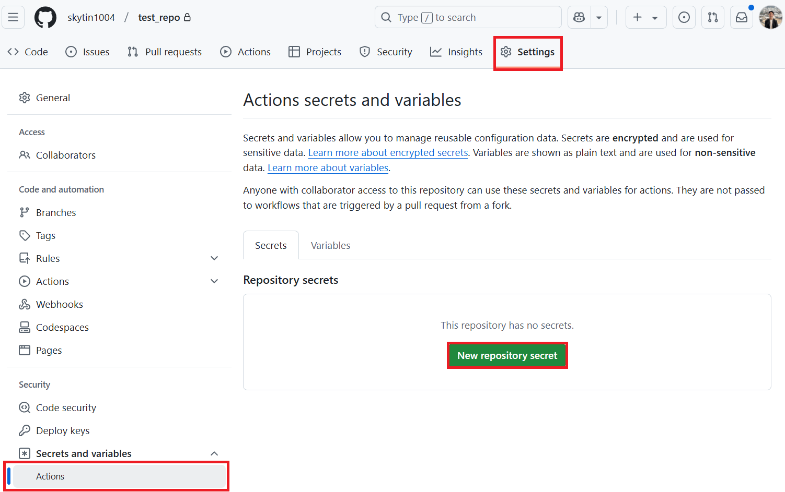

<!--
CO_OP_TRANSLATOR_METADATA:
{
  "original_hash": "527ca4d0a8d3f51087ec3317279e36ee",
  "translation_date": "2025-10-15T03:41:37+00:00",
  "source_file": "getting_started/github-actions-guide/github-actions-guide-public.md",
  "language_code": "ms"
}
-->
# Menggunakan Co-op Translator GitHub Action (Tetapan Awam)

**Sasaran Pengguna:** Panduan ini ditujukan untuk pengguna di kebanyakan repositori awam atau peribadi di mana kebenaran GitHub Actions standard sudah mencukupi. Ia menggunakan `GITHUB_TOKEN` terbina dalam.

Automasi terjemahan dokumentasi repositori anda dengan mudah menggunakan Co-op Translator GitHub Action. Panduan ini menerangkan cara menyediakan action supaya ia secara automatik mencipta pull request dengan terjemahan terkini setiap kali fail Markdown sumber atau imej anda berubah.

> [!IMPORTANT]
>
> **Memilih Panduan Yang Betul:**
>
> Panduan ini menerangkan **tetapan mudah menggunakan `GITHUB_TOKEN` standard**. Kaedah ini disyorkan untuk kebanyakan pengguna kerana anda tidak perlu mengurus Kunci Peribadi GitHub App yang sensitif.
>

## Prasyarat

Sebelum mengkonfigurasi GitHub Action, pastikan anda sudah mempunyai kelayakan perkhidmatan AI yang diperlukan.

**1. Wajib: Kelayakan Model Bahasa AI**
Anda perlu kelayakan untuk sekurang-kurangnya satu Model Bahasa yang disokong:

- **Azure OpenAI**: Memerlukan Endpoint, API Key, Nama Model/Deployment, Versi API.
- **OpenAI**: Memerlukan API Key, (Pilihan: Org ID, Base URL, Model ID).
- Lihat [Model dan Perkhidmatan yang Disokong](../../../../README.md) untuk maklumat lanjut.

**2. Pilihan: Kelayakan AI Vision (untuk Terjemahan Imej)**

- Hanya diperlukan jika anda ingin menterjemah teks dalam imej.
- **Azure AI Vision**: Memerlukan Endpoint dan Subscription Key.
- Jika tidak disediakan, action akan menggunakan [mod Markdown sahaja](../markdown-only-mode.md).

## Tetapan dan Konfigurasi

Ikuti langkah-langkah berikut untuk mengkonfigurasi Co-op Translator GitHub Action dalam repositori anda menggunakan `GITHUB_TOKEN` standard.

### Langkah 1: Fahami Pengesahan (Menggunakan `GITHUB_TOKEN`)

Workflow ini menggunakan `GITHUB_TOKEN` terbina dalam yang disediakan oleh GitHub Actions. Token ini secara automatik memberikan kebenaran kepada workflow untuk berinteraksi dengan repositori anda berdasarkan tetapan yang dikonfigurasi dalam **Langkah 3**.

### Langkah 2: Konfigurasi Secrets Repositori

Anda hanya perlu menambah **kelayakan perkhidmatan AI** anda sebagai secrets yang dienkripsi dalam tetapan repositori.

1.  Pergi ke repositori GitHub yang anda ingin gunakan.
2.  Pergi ke **Settings** > **Secrets and variables** > **Actions**.
3.  Di bawah **Repository secrets**, klik **New repository secret** untuk setiap secret perkhidmatan AI yang diperlukan seperti di bawah.

     *(Rujukan Imej: Menunjukkan lokasi untuk menambah secrets)*

**Secrets Perkhidmatan AI Wajib (Tambah SEMUA yang berkaitan mengikut Prasyarat):**

| Nama Secret                         | Penerangan                               | Sumber Nilai                     |
| :---------------------------------- | :---------------------------------------- | :------------------------------- |
| `AZURE_AI_SERVICE_API_KEY`            | Kunci untuk Azure AI Service (Computer Vision)  | Azure AI Foundry anda               |
| `AZURE_AI_SERVICE_ENDPOINT`         | Endpoint untuk Azure AI Service (Computer Vision) | Azure AI Foundry anda               |
| `AZURE_OPENAI_API_KEY`              | Kunci untuk perkhidmatan Azure OpenAI              | Azure AI Foundry anda               |
| `AZURE_OPENAI_ENDPOINT`             | Endpoint untuk perkhidmatan Azure OpenAI         | Azure AI Foundry anda               |
| `AZURE_OPENAI_MODEL_NAME`           | Nama Model Azure OpenAI anda              | Azure AI Foundry anda               |
| `AZURE_OPENAI_CHAT_DEPLOYMENT_NAME` | Nama Deployment Azure OpenAI anda         | Azure AI Foundry anda               |
| `AZURE_OPENAI_API_VERSION`          | Versi API untuk Azure OpenAI              | Azure AI Foundry anda               |
| `OPENAI_API_KEY`                    | API Key untuk OpenAI                        | Platform OpenAI anda              |
| `OPENAI_ORG_ID`                     | OpenAI Organization ID (Pilihan)         | Platform OpenAI anda              |
| `OPENAI_CHAT_MODEL_ID`              | ID model OpenAI tertentu (Pilihan)       | Platform OpenAI anda              |
| `OPENAI_BASE_URL`                   | Base URL API OpenAI tersuai (Pilihan)     | Platform OpenAI anda              |

### Langkah 3: Konfigurasi Kebenaran Workflow

GitHub Action memerlukan kebenaran melalui `GITHUB_TOKEN` untuk checkout kod dan mencipta pull request.

1.  Dalam repositori anda, pergi ke **Settings** > **Actions** > **General**.
2.  Skrol ke bahagian **Workflow permissions**.
3.  Pilih **Read and write permissions**. Ini memberikan `GITHUB_TOKEN` kebenaran `contents: write` dan `pull-requests: write` yang diperlukan untuk workflow ini.
4.  Pastikan kotak **Allow GitHub Actions to create and approve pull requests** **ditandakan**.
5.  Klik **Save**.


### Langkah 4: Cipta Fail Workflow

Akhir sekali, cipta fail YAML yang mentakrifkan workflow automatik menggunakan `GITHUB_TOKEN`.

1.  Dalam direktori root repositori anda, cipta direktori `.github/workflows/` jika belum wujud.
2.  Di dalam `.github/workflows/`, cipta fail bernama `co-op-translator.yml`.
3.  Tampal kandungan berikut ke dalam `co-op-translator.yml`.

```yaml
name: Co-op Translator

on:
  push:
    branches:
      - main

jobs:
  co-op-translator:
    runs-on: ubuntu-latest

    permissions:
      contents: write
      pull-requests: write

    steps:
      - name: Checkout repository
        uses: actions/checkout@v4
        with:
          fetch-depth: 0

      - name: Set up Python
        uses: actions/setup-python@v4
        with:
          python-version: '3.10'

      - name: Install Co-op Translator
        run: |
          python -m pip install --upgrade pip
          pip install co-op-translator

      - name: Run Co-op Translator
        env:
          PYTHONIOENCODING: utf-8
          # === AI Service Credentials ===
          AZURE_AI_SERVICE_API_KEY: ${{ secrets.AZURE_AI_SERVICE_API_KEY }}
          AZURE_AI_SERVICE_ENDPOINT: ${{ secrets.AZURE_AI_SERVICE_ENDPOINT }}
          AZURE_OPENAI_API_KEY: ${{ secrets.AZURE_OPENAI_API_KEY }}
          AZURE_OPENAI_ENDPOINT: ${{ secrets.AZURE_OPENAI_ENDPOINT }}
          AZURE_OPENAI_MODEL_NAME: ${{ secrets.AZURE_OPENAI_MODEL_NAME }}
          AZURE_OPENAI_CHAT_DEPLOYMENT_NAME: ${{ secrets.AZURE_OPENAI_CHAT_DEPLOYMENT_NAME }}
          AZURE_OPENAI_API_VERSION: ${{ secrets.AZURE_OPENAI_API_VERSION }}
          OPENAI_API_KEY: ${{ secrets.OPENAI_API_KEY }}
          OPENAI_ORG_ID: ${{ secrets.OPENAI_ORG_ID }}
          OPENAI_CHAT_MODEL_ID: ${{ secrets.OPENAI_CHAT_MODEL_ID }}
          OPENAI_BASE_URL: ${{ secrets.OPENAI_BASE_URL }}
        run: |
          # =====================================================================
          # IMPORTANT: Set your target languages here (REQUIRED CONFIGURATION)
          # =====================================================================
          # Example: Translate to Spanish, French, German. Add -y to auto-confirm.
          translate -l "es fr de" -y  # <--- MODIFY THIS LINE with your desired languages

      - name: Create Pull Request with translations
        uses: peter-evans/create-pull-request@v5
        with:
          token: ${{ secrets.GITHUB_TOKEN }}
          commit-message: "🌐 Update translations via Co-op Translator"
          title: "🌐 Update translations via Co-op Translator"
          body: |
            This PR updates translations for recent changes to the main branch.

            ### 📋 Changes included
            - Translated contents are available in the `translations/` directory
            - Translated images are available in the `translated_images/` directory

            ---
            🌐 Automatically generated by the [Co-op Translator](https://github.com/Azure/co-op-translator) GitHub Action.
          branch: update-translations
          base: main
          labels: translation, automated-pr
          delete-branch: true
          add-paths: |
            translations/
            translated_images/
```
4.  **Ubahsuai Workflow:**
  - **[!IMPORTANT] Bahasa Sasaran:** Dalam langkah `Run Co-op Translator`, anda **MESTI semak dan ubah senarai kod bahasa** dalam arahan `translate -l "..." -y` supaya sesuai dengan keperluan projek anda. Senarai contoh (`ar de es...`) perlu diganti atau disesuaikan.
  - **Trigger (`on:`):** Trigger semasa akan berjalan setiap kali push ke `main`. Untuk repositori besar, pertimbangkan untuk menambah penapis `paths:` (lihat contoh komen dalam YAML) supaya workflow hanya berjalan apabila fail berkaitan (contohnya dokumentasi sumber) berubah, menjimatkan masa runner.
  - **Butiran PR:** Ubahsuai `commit-message`, `title`, `body`, nama `branch`, dan `labels` dalam langkah `Create Pull Request` jika perlu.

## Menjalankan Workflow

> [!WARNING]  
> **Had Masa Runner GitHub-hosted:**  
> Runner yang dihoskan GitHub seperti `ubuntu-latest` mempunyai **had masa maksimum 6 jam**.  
> Untuk repositori dokumentasi yang besar, jika proses terjemahan melebihi 6 jam, workflow akan ditamatkan secara automatik.  
> Untuk mengelakkan perkara ini, pertimbangkan:  
> - Menggunakan **runner self-hosted** (tiada had masa)  
> - Mengurangkan bilangan bahasa sasaran setiap kali run

Selepas fail `co-op-translator.yml` digabungkan ke dalam branch utama anda (atau branch yang ditetapkan dalam trigger `on:`), workflow akan berjalan secara automatik setiap kali perubahan ditolak ke branch tersebut (dan sepadan dengan penapis `paths`, jika dikonfigurasi).

---

**Penafian**:
Dokumen ini telah diterjemahkan menggunakan perkhidmatan terjemahan AI [Co-op Translator](https://github.com/Azure/co-op-translator). Walaupun kami berusaha untuk ketepatan, sila ambil maklum bahawa terjemahan automatik mungkin mengandungi kesilapan atau ketidaktepatan. Dokumen asal dalam bahasa asalnya harus dianggap sebagai sumber yang berwibawa. Untuk maklumat kritikal, terjemahan manusia profesional adalah disyorkan. Kami tidak bertanggungjawab atas sebarang salah faham atau salah tafsir yang timbul daripada penggunaan terjemahan ini.