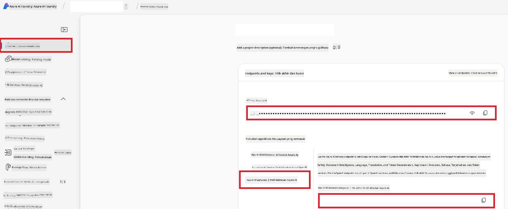

<!--
CO_OP_TRANSLATOR_METADATA:
{
  "original_hash": "b58d7c3cb4210697a073d20eb3064945",
  "translation_date": "2025-06-12T11:56:25+00:00",
  "source_file": "getting_started/set-up-azure-ai.md",
  "language_code": "ms"
}
-->
# Set Up Azure AI for Co-op Translator (Azure OpneAI & Azure AI Vision)

This guide will help you set up Azure OpenAI for language translation and Azure Computer Vision for analyzing image content (which can then be used for image-based translation) within Azure AI Foundry.

**Prerequisites:**
- An Azure account with an active subscription.
- The necessary permissions to create resources and deployments in your Azure subscription.

## Create an Azure AI Project

Start by creating an Azure AI Project, which serves as a central hub for managing your AI resources.

1. Go to [https://ai.azure.com](https://ai.azure.com) and sign in with your Azure account.

1. Click **+Create** to start a new project.

1. Complete the following steps:
   - Enter a **Project name** (e.g., `CoopTranslator-Project`).
   - Choose the **AI hub** (e.g., `CoopTranslator-Hub`) (create a new one if needed).

1. Click "**Review and Create**" to finalize your project. You will be directed to your project's overview page.

## Set up Azure OpenAI for Language Translation

Within your project, you will deploy an Azure OpenAI model that will act as the backend for text translation.

### Navigate to Your Project

If you aren’t already there, open your newly created project (e.g., `CoopTranslator-Project`) in Azure AI Foundry.

### Deploy an OpenAI Model

1. From the left-hand menu under "My assets", select "**Models + endpoints**".

1. Click **+ Deploy model**.

1. Choose **Deploy Base Model**.

1. You will see a list of available models. Filter or search for a suitable GPT model. We recommend `gpt-4o`.

1. Select the model you want and click **Confirm**.

1. Click **Deploy**.

### Azure OpenAI configuration

After deployment, select the deployment from the "**Models + endpoints**" page to find its **REST endpoint URL**, **Key**, **Deployment name**, **Model name**, and **API version**. You will need these details to integrate the translation model into your application.

> [!NOTE]
> You can choose API versions from the [API version deprecation](https://learn.microsoft.com/azure/ai-services/openai/api-version-deprecation) page based on your needs. Keep in mind that the **API version** differs from the **Model version** shown on the **Models + endpoints** page in Azure AI Foundry.

## Set up Azure Computer Vision for Image Translation

To translate text within images, you need to locate the Azure AI Service API Key and Endpoint.

1. Go to your Azure AI Project (e.g., `CoopTranslator-Project`). Make sure you are on the project overview page.

### Azure AI Service configuration

Locate the API Key and Endpoint for the Azure AI Service.

1. Navigate to your Azure AI Project (e.g., `CoopTranslator-Project`). Confirm you are on the project overview page.

1. Find the **API Key** and **Endpoint** under the Azure AI Service tab.

    

This connection enables the features of the linked Azure AI Services resource (including image analysis) for your AI Foundry project. You can then use this connection in your notebooks or applications to extract text from images, which can be sent to the Azure OpenAI model for translation.

## Consolidating Your Credentials

By this point, you should have gathered the following:

**For Azure OpenAI (Text Translation):**
- Azure OpenAI Endpoint
- Azure OpenAI API Key
- Azure OpenAI Model Name (e.g., `gpt-4o`)
- Azure OpenAI Deployment Name (e.g., `cooptranslator-gpt4o`)
- Azure OpenAI API Version

**For Azure AI Services (Image Text Extraction via Vision):**
- Azure AI Service Endpoint
- Azure AI Service API Key

### Example: Environment Variable Configuration (Preview)

When you build your application, you’ll likely configure it using these credentials. For example, you might set them as environment variables like this:

```bash
# Azure AI Service Credentials (Required for image translation)
AZURE_AI_SERVICE_API_KEY="your_azure_ai_service_api_key" # e.g., 21xasd...
AZURE_AI_SERVICE_ENDPOINT="https://your_azure_ai_service_endpoint.cognitiveservices.azure.com/"

# Azure OpenAI Credentials (Required for text translation)
AZURE_OPENAI_API_KEY="your_azure_openai_api_key" # e.g., 21xasd...
AZURE_OPENAI_ENDPOINT="https://your_azure_openai_endpoint.openai.azure.com/"
AZURE_OPENAI_MODEL_NAME="your_model_name" # e.g., gpt-4o
AZURE_OPENAI_CHAT_DEPLOYMENT_NAME="your_deployment_name" # e.g., cooptranslator-gpt4o
AZURE_OPENAI_API_VERSION="your_api_version" # e.g., 2024-12-01-preview
```

---

### Further Reading

- [How to Create a project in Azure AI Foundry](https://learn.microsoft.com/azure/ai-foundry/how-to/create-projects?tabs=ai-studio)
- [How to Create Azure AI resources](https://learn.microsoft.com/azure/ai-foundry/how-to/create-azure-ai-resource?tabs=portal)
- [How to Deploy OpenAI models in Azure AI Foundry](https://learn.microsoft.com/en-us/azure/ai-foundry/how-to/deploy-models-openai)

**Penafian**:  
Dokumen ini telah diterjemahkan menggunakan perkhidmatan terjemahan AI [Co-op Translator](https://github.com/Azure/co-op-translator). Walaupun kami berusaha untuk ketepatan, sila maklum bahawa terjemahan automatik mungkin mengandungi kesilapan atau ketidaktepatan. Dokumen asal dalam bahasa asalnya harus dianggap sebagai sumber yang sahih. Untuk maklumat penting, terjemahan profesional oleh manusia adalah disyorkan. Kami tidak bertanggungjawab atas sebarang salah faham atau salah tafsir yang timbul daripada penggunaan terjemahan ini.