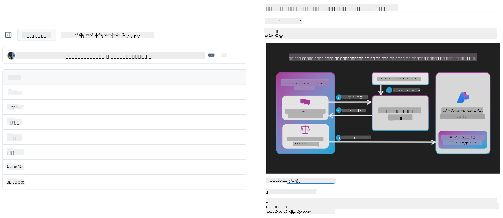
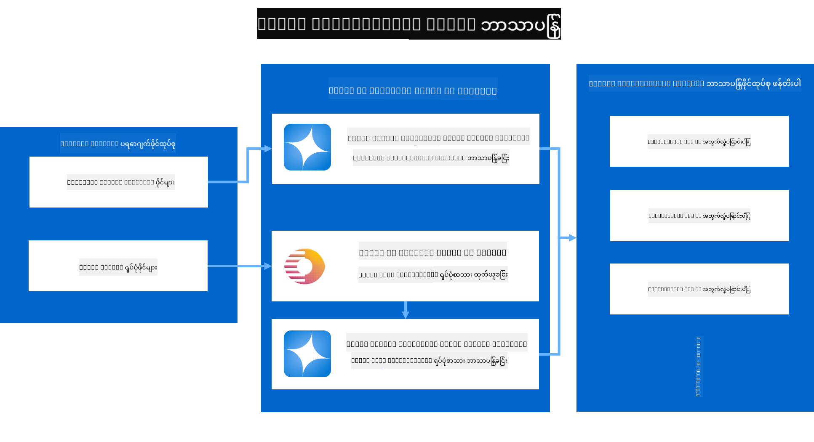
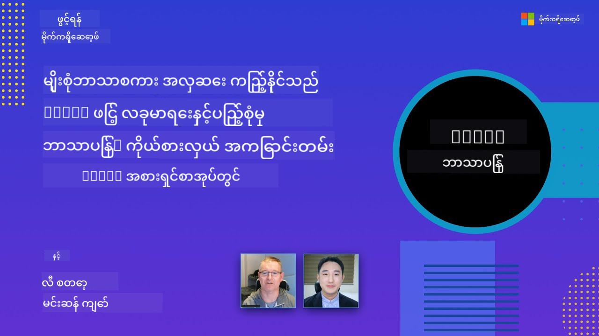

<!--
CO_OP_TRANSLATOR_METADATA:
{
  "original_hash": "044724537b57868117aadae8e7728c7c",
  "translation_date": "2025-06-12T18:21:53+00:00",
  "source_file": "README.md",
  "language_code": "my"
}
-->


# Co-op Translator: ပညာရေးစာတမ်းများကို အလွယ်တကူ ဘာသာပြန်ခြင်းကို အလိုအလျောက်ပြုလုပ်ပါ

_သင့်စာတမ်းများကို ဘာသာစကားအမျိုးမျိုးသို့ အလွယ်တကူ အလိုအလျောက် ဘာသာပြန်ပြီး ကမ္ဘာလုံးဆိုင်ရာ ဖတ်ရှုသူများထံ ရောက်ရှိစေပါ။_

[](https://pypi.org/project/co-op-translator/)
[](https://github.com/azure/co-op-translator/blob/main/LICENSE)
[](https://pepy.tech/project/co-op-translator)
[](https://pepy.tech/project/co-op-translator)
[](https://github.com/psf/black)

[](https://GitHub.com/azure/co-op-translator/graphs/contributors/)
[](https://GitHub.com/azure/co-op-translator/issues/)
[](https://GitHub.com/azure/co-op-translator/pulls/)
[](http://makeapullrequest.com)

### Co-op Translator ဖြင့် အားပေးထားသော ဘာသာစကားများ
[ပြင်သစ်](../fr/README.md) | [စပိန်](../es/README.md) | [ဂျာမန်](../de/README.md) | [ရုရှား](../ru/README.md) | [အာရဗီ](../ar/README.md) | [ပါရှန် (ဖာစီ)](../fa/README.md) | [ဥာရ်ဒူး](../ur/README.md) | [တရုတ် (ရိုးရှင်း)](../zh/README.md) | [တရုတ် (ရိုးရာ, မာကာအို)](../mo/README.md) | [တရုတ် (ရိုးရာ, ဟောင်ကောင်)](../hk/README.md) | [တရုတ် (ရိုးရာ, တိုင်ဝမ်)](../tw/README.md) | [ဂျပန်](../ja/README.md) | [ကိုရီးယား](../ko/README.md) | [ဟိန္ဒီ](../hi/README.md) | [ဘင်္ဂါလီ](../bn/README.md) | [မာရသီ](../mr/README.md) | [နီပေါ](../ne/README.md) | [ပန်ဂျာဘီ (ဂူမူခီ)](../pa/README.md) | [ပေါ်တူဂီ (ပေါ်တူဂီ)](../pt/README.md) | [ပေါ်တူဂီ (ဘရာဇီး)](../br/README.md) | [အီတလီ](../it/README.md) | [ပိုလန်](../pl/README.md) | [တူရကီ](../tr/README.md) | [ဂရိ](../el/README.md) | [ထိုင်း](../th/README.md) | [ဆွီဒင်](../sv/README.md) | [ဒိန်းမတ်](../da/README.md) | [နော်ဝေ](../no/README.md) | [ဖင်လန်](../fi/README.md) | [ဒတ်ချ်](../nl/README.md) | [ဟီဘရူး](../he/README.md) | [ဗီယက်နမ်](../vi/README.md) | [အင်ဒိုနီးရှား](../id/README.md) | [မလေး](../ms/README.md) | [တာဂလို (ဖိလစ်ပိုင်)](../tl/README.md) | [ဆွာဟီလီ](../sw/README.md) | [ဟန်ဂေရီ](../hu/README.md) | [ချက်](../cs/README.md) | [စလိုဗက်](../sk/README.md) | [ရိုမေးနီးယား](../ro/README.md) | [ဘူဂေးရီးယား](../bg/README.md) | [ဆားဘီးယား (ဆီရလစ်)](../sr/README.md) | [ခရိုအေးရှား](../hr/README.md) | [စလိုဗေးနီးယား](../sl/README.md) | [ယူကရိန်း](../uk/README.md) | [မြန်မာ](./README.md)
> [!NOTE]
> ဒီမှာပါတဲ့ဘာသာပြန်ချက်တွေက ဒီ repository ရဲ့ အကြောင်းအရာတွေကို လက်ရှိမှာ ဘာသာပြန်ထားတာတွေ ဖြစ်ပါတယ်။ Co-op Translator က ပံ့ပိုးပေးတဲ့ ဘာသာစကားတွေ စုစုပေါင်းစာရင်းအတွက်တော့ [Language Support](../..) အပိုင်းကို ကြည့်ပါ။

[](https://GitHub.com/azure/co-op-translator/watchers/)
[](https://GitHub.com/azure/co-op-translator/network/)
[](https://GitHub.com/azure/co-op-translator/stargazers/)

[](https://discord.com/invite/ByRwuEEgH4)

[](https://codespaces.new/azure/co-op-translator)
[](https://vscode.dev/redirect?url=vscode://ms-vscode-remote.remote-containers/cloneInVolume?url=https://github.com/azure/co-op-translator)

## အနှစ်ချုပ် - သင်ယူရေးအကြောင်းအရာ ဘာသာပြန်မှုကို ပိုမိုလွယ်ကူစေခြင်း

ဘာသာစကားကန့်သတ်ချက်တွေကြောင့် ကမ္ဘာတစ်ဝှမ်းရှိ သင်ယူသူများနဲ့ ဖန်တီးသူများအတွက် အဖိုးတန်သော သင်ကြားရေးအရင်းအမြစ်များနဲ့ နည်းပညာဆိုင်ရာ အသိပညာများကို ရရှိရခက်ခဲနေသည်။ ဒါဟာ ပါဝင်ဆောင်ရွက်မှုကို ကန့်သတ်ပြီး ကမ္ဘာလုံးဆိုင်ရာ နည်းပညာတိုးတက်မှုနဲ့ သင်ယူမှု၏ လျင်မြန်မှုကို နည်းပါးစေသည်။

**Co-op Translator** ကို Microsoft ရဲ့ များပြားသော သင်ကြားရေးအစီအစဉ်များ (ဥပမာ - "For Beginners" လမ်းညွှန်များ) အတွက် လက်ဖြင့်ဘာသာပြန်ခြင်း အစဉ်အလာမရှိမဖြစ်ဖြေရှင်းရန်လိုအပ်ချက်မှ စတင်ဖန်တီးခဲ့ပြီး၊ အသုံးပြုရလွယ်ကူပြီး အင်အားပြင်းသော ကိရိယာတစ်ခုအဖြစ် တိုးတက်လာခဲ့သည်။ CLI နဲ့ GitHub Actions မှတဆင့် အရည်အသွေးမြင့် အလိုအလျောက်ဘာသာပြန်မှုများကို ပံ့ပိုးပေးခြင်းဖြင့် Co-op Translator သည် ကမ္ဘာတစ်ဝှမ်းရှိ ဆရာ၊ ကျောင်းသား၊ သုတေသနဆိုင်ရာသူများနဲ့ ဖန်တီးသူများအား ဘာသာစကားကန့်သတ်ချက်မရှိဘဲ အသိပညာမျှဝေရန်နှင့် ရရှိနိုင်ရန် အားပေးပို့ဆောင်ပေးသည်။

Co-op Translator က ဘာသာပြန်ထားသော သင်ကြားရေးအကြောင်းအရာများကို ဘယ်လို စီစဉ်ထားသည်ကို ကြည့်ပါ-



Markdown ဖိုင်များနဲ့ ပုံရိပ်အတွင်းစာသားများကို အလိုအလျောက်ဘာသာပြန်ပြီး ဘာသာစကားအလိုက် ဖိုလ်ဒါများထဲသို့ သေချာစွာ စီစဉ်ထားသည်။

**Co-op Translator ဖြင့် သင်၏ သင်ကြားရေးအကြောင်းအရာများကို ကမ္ဘာတစ်ဝှမ်း လွတ်လပ်စွာ ဝင်ရောက်အသုံးပြုနိုင်စေပါ။**

## Microsoft ရဲ့ သင်ယူရေး အရင်းအမြစ်များအတွက် ကမ္ဘာလုံးဆိုင်ရာ ဝင်ရောက်မှု ပံ့ပိုးခြင်း

Co-op Translator သည် ကမ္ဘာတစ်ဝှမ်းရှိ ဖန်တီးသူများ အသိုက်အဝန်းကို ဝန်ဆောင်မှုပေးသော repository များအတွက် ဘာသာပြန်မှုလုပ်ငန်းစဉ်ကို အလိုအလျောက် ပြုလုပ်ပေးခြင်းဖြင့် Microsoft ရဲ့ အရေးကြီး သင်ကြားရေးအစီအစဉ်များအတွက် ဘာသာစကားကွာဟမှုကို ဖြေရှင်းပေးသည်။ လက်ရှိ Co-op Translator ကို အသုံးပြုနေသော နမူနာများမှာ-

[](https://github.com/microsoft/Generative-AI-for-beginners)
[](https://github.com/microsoft/ML-For-Beginners)
[](https://github.com/microsoft/AI-For-Beginners)
[](https://github.com/microsoft/ai-agents-for-beginners)
[](https://github.com/microsoft/PhiCookBook)
[](https://github.com/microsoft/Generative-AI-for-beginners-dotnet)

## အဓိက လုပ်ဆောင်ချက်များ

- **အလိုအလျောက် ဘာသာပြန်ခြင်း**: စာသားများကို ဘာသာစကားအမျိုးမျိုးသို့ လွယ်ကူစွာ ဘာသာပြန်နိုင်သည်။
- **GitHub Actions ပေါင်းစည်းမှု**: CI/CD pipeline အတွင်း ဘာသာပြန်မှုကို အလိုအလျောက်လုပ်ဆောင်နိုင်သည်။
- **Markdown ပုံစံ ထိန်းသိမ်းမှု**: ဘာသာပြန်မှုအတွင်း Markdown စနစ်မှန်ကန်စွာ ထိန်းသိမ်းထားသည်။
- **ပုံရိပ်အတွင်း စာသား ဘာသာပြန်ခြင်း**: ပုံရိပ်အတွင်းရှိ စာသားများကို ထုတ်ယူပြီး ဘာသာပြန်ပေးသည်။
- **တိုးတက်သော LLM နည်းပညာ**: အရည်အသွေးမြင့် ဘာသာပြန်မှုအတွက် နောက်ဆုံးပေါ် ဘာသာစကားမော်ဒယ်များကို အသုံးပြုသည်။
- **လွယ်ကူသော ပေါင်းစည်းမှု**: သင့်ရဲ့ လက်ရှိ ပရောဂျက်နှင့် အဆင်ပြေစွာ ပေါင်းစည်းနိုင်သည်။
- **တစ်နိုင်ငံလုံးအတွက် လိုကယ်လိုက်မှု လွယ်ကူစေခြင်း**: နိုင်ငံတကာ စျေးကွက်များအတွက် သင့်ပရောဂျက်ကို လိုကယ်လိုက်လုပ်ငန်းစဉ်ကို ပိုမိုလွယ်ကူစေသည်။

## လုပ်ငန်းစဉ်



Co-op Translator သည် သင့်ပရောဂျက်ဖိုလ်ဒါမှ Markdown ဖိုင်များနဲ့ ပုံရိပ်များကို ယခုအတိုင်း ဆောင်ရွက်သည်-

1. **စာသား ထုတ်ယူခြင်း**: Markdown ဖိုင်များမှ စာသားများကို ထုတ်ယူပြီး (Azure AI Vision ကဲ့သို့ တပ်ဆင်ထားလျှင်) ပုံရိပ်အတွင်းပါသော စာသားများကိုလည်း ထုတ်ယူသည်။
1. **AI ဘာသာပြန်ခြင်း**: ထုတ်ယူထားသော စာသားများကို သတ်မှတ်ထားသော LLM (Azure OpenAI, OpenAI စသည်) သို့ ပို့ပြီး ဘာသာပြန်သည်။
1. **ရလဒ် သိမ်းဆည်းခြင်း**: ဘာသာပြန်ပြီး Markdown ဖိုင်များနဲ့ ပုံရိပ်များ (ဘာသာပြန်ထားသော စာသားအပါအဝင်) ကို ဘာသာစကားအလိုက် ဖိုလ်ဒါများထဲသို့ သိမ်းဆည်းပြီး မူရင်း ပုံစံကို ထိန်းသိမ်းထားသည်။

## စတင်အသုံးပြုခြင်း

CLI ဖြင့် အလျင်အမြန် စတင်ပါ၊ သို့မဟုတ် GitHub Actions ဖြင့် အလိုအလျောက်လုပ်ဆောင်မှု ပြုလုပ်ပါ။ သင့်လုပ်ငန်းစဉ်နှင့် ကိုက်ညီသော နည်းလမ်းကို ရွေးချယ်ပါ-

1. **Command Line (CLI)** - တစ်ကြိမ်တည်း ဘာသာပြန်ခြင်း သို့မဟုတ် လက်ဖြင့် ထိန်းချုပ်ရန်
2. **GitHub Actions** - တစ်ကြိမ်တိုင်း push လုပ်သောအခါ အလိုအလျောက် ဘာသာပြန်ရန်

> [!NOTE]
> ဒီသင်ခန်းစာမှာ Azure အရင်းအမြစ်တွေကို အခြေခံထားပေမယ့် သင့်လိုအပ်ချက်အရ မည်သည့် ပံ့ပိုးသော ဘာသာစကားမော်ဒယ်ကိုမဆို အသုံးပြုနိုင်ပါသည်။

### ဘာသာစကား ပံ့ပိုးမှု

Co-op Translator သည် ကမ္ဘာလုံးဆိုင်ရာ ဖောက်သည်များထံ ရောက်ရှိနိုင်ရန် အမျိုးမျိုးသော ဘာသာစကားများကို ပံ့ပိုးပေးသည်။ သိထားသင့်တာတွေမှာ-

#### အမြန်အညွှန်း

| ဘာသာစကား | ကုဒ် | ဘာသာစကား | ကုဒ် | ဘာသာစကား | ကုဒ် |
|----------|------|----------|------|----------|------|
| Arabic | ar | Bengali | bn | Bulgarian | bg |
| Burmese (Myanmar) | my | Chinese (Simplified) | zh | Chinese (Traditional, HK) | hk |
| Chinese (Traditional, Macau) | mo | Chinese (Traditional, TW) | tw | Croatian | hr |
| Czech | cs | Danish | da | Dutch | nl |
| Finnish | fi | French | fr | German | de |
| Greek | el | Hebrew | he | Hindi | hi |
| Hungarian | hu | Indonesian | id | Italian | it |
| Japanese | ja | Korean | ko | Malay | ms |
| Marathi | mr | Nepali | ne | Norwegian | no |
| Persian (Farsi) | fa | Polish | pl | Portuguese (Brazil) | br |
| Portuguese (Portugal) | pt | Punjabi (Gurmukhi) | pa | Romanian | ro |
| Russian | ru | Serbian (Cyrillic) | sr | Slovak | sk |
| Slovenian | sl | Spanish | es | Swahili | sw |
| Swedish | sv | Tagalog (Filipino) | tl | Thai | th |
| Turkish | tr | Ukrainian | uk | Urdu | ur |
| Vietnamese | vi | — | — | — | — |

#### ဘာသာစကားကုဒ်များ အသုံးပြုခြင်း

Co-op Translator ကို အသုံးပြုရာတွင် ဘာသာစကားများကို ၎င်းတို့ကုဒ်များဖြင့် ဖော်ပြရမည်။ ဥပမာ-

```bash
# Translate to French, Spanish, and German
translate -l "fr es de"

# Translate to Chinese (Simplified) and Japanese
translate -l "zh ja"
```

> [!NOTE]
> ဘာသာစကားပံ့ပိုးမှုနှင့် ပတ်သက်သော နည်းပညာပိုင်းအသေးစိတ်အချက်အလက်များအတွက်-
>
> - ဘာသာစကားတိုင်းအတွက် ဖောင့် သတ်မှတ်ချက်များ
> - ရှိနေသော ပြဿနာများ
> - ဘာသာစကားအသစ်များ ထည့်သွင်းပုံ
>
> ကျွန်ုပ်တို့ရဲ့ [Supported Languages Documentation](./getting_started/supported-languages.md) ကို ကြည့်ပါ။

### ပံ့ပိုးသော မော်ဒယ်များနှင့် ဝန်ဆောင်မှုများ

| အမျိုးအစား               | အမည်                           |
|-----------------------|--------------------------------|
| Language Model        |   |
| AI Vision       |  |

> [!NOTE]
> AI vision ဝန်ဆောင်မှု မရရှိနိုင်ပါက co-op translator သည် [Markdown-only mode](./getting_started/markdown-only-mode.md) သို့ ပြောင်းလဲသွားမည်ဖြစ်သည်။

### စတင်ပြင်ဆင်ခြင်း

စတင်ရန်အတွက် အောက်ပါ အရင်းအမြစ်များကို ပြင်ဆင်ထားရမည်-

1. Language Model အရင်းအမြစ် (လိုအပ်သည်):
   - Azure OpenAI (အကြံပြု) - စီးပွားရေးအဆင့် စွမ်းဆောင်ရည်မြင့် အရည်အသွေးမြင့် ဘာသာပြန်မှု ပေးသည်
   - OpenAI - Azure ဝင်ရောက်ခွင့်မရှိသူများအတွက် အခြားရွေးချယ်စရာ
   - ပံ့ပိုးသော မော်ဒယ်များအကြောင်း အသေးစိတ်အတွက် [Supported Models and Services](../..) ကို ကြည့်ပါ

1. AI Vision အရင်းအမြစ် (စိတ်ကြိုက်):
   - Azure AI Vision - ပုံရိပ်အတွင်း စာသားများ ဘာသာပြန်နိုင်စေသည်
   - မတပ်ဆင်ပါက translator သည် အလိုအလျောက် [Markdown-only mode](./getting_started/markdown-only-mode.md) ကို အသုံးပြုမည်
   - စာသားပါသော ပုံရိပ်များပါဝင်သည့် ပရောဂျက်များအတွက် အကြံပြုသည်

1. ပြင်ဆင်မှု အဆင့်များ:
   - ကျွန်ုပ်တို့ရဲ့ [Azure AI setup guide](./getting_started/set-up-azure-ai.md) ကို လိုက်နာပါ
   - API key များနဲ့ endpoint များပါဝင်သည့် `.env` ဖိုင် တည်ဆောက်ပါ ( [Quick Start](../..) အပိုင်းကို ကြည့်ပါ)
   - သင့်ရွေးချယ်ထားသော ဝန်ဆောင်မှုများအတွက် လိုအပ်သော ခွင့်ပြုချက်များနဲ့ ကွတ်တာများ ရှိမရှိ စစ်ဆေးပါ

### ဘာသာပြန်မှုမပြုမီ ပရောဂျက် ပြင်ဆင်ခြင်း

ဘာသာပြန်မှုစတင်ရန်မတိုင်မီ ပရောဂျက်ကို အောက်ပါအတိုင်း ပြင်ဆင်ပါ-

1. README ကို ပြင်ဆင်ပါ-
   - ဘာသာပြန်ထားသော ဗားရှင်းများကို ချိတ်ဆက်ရန် translations အမည်စာရင်းကို README.md ထဲ ထည့်ပါ
   - နမူနာပုံစံ-

     ```markdown

     ### 🌐 Multi-Language Support
     
     [French](../fr/README.md) | [Spanish](../es/README.md) | [German](../de/README.md) | [Russian](../ru/README.md) | [Arabic](../ar/README.md) | [Persian (Farsi)](../fa/README.md) | [Urdu](../ur/README.md) | [Chinese (Simplified)](../zh/README.md) | [Chinese (Traditional, Macau)](../mo/README.md) | [Chinese (Traditional, Hong Kong)](../hk/README.md) | [Chinese (Traditional, Taiwan)](../tw/README.md) | [Japanese](../ja/README.md) | [Korean](../ko/README.md) | [Hindi](../hi/README.md) | [Bengali](../bn/README.md) | [Marathi](../mr/README.md) | [Nepali](../ne/README.md) | [Punjabi (Gurmukhi)](../pa/README.md) | [Portuguese (Portugal)](../pt/README.md) | [Portuguese (Brazil)](../br/README.md) | [Italian](../it/README.md) | [Polish](../pl/README.md) | [Turkish](../tr/README.md) | [Greek](../el/README.md) | [Thai](../th/README.md) | [Swedish](../sv/README.md) | [Danish](../da/README.md) | [Norwegian](../no/README.md) | [Finnish](../fi/README.md) | [Dutch](../nl/README.md) | [Hebrew](../he/README.md) | [Vietnamese](../vi/README.md) | [Indonesian](../id/README.md) | [Malay](../ms/README.md) | [Tagalog (Filipino)](../tl/README.md) | [Swahili](../sw/README.md) | [Hungarian](../hu/README.md) | [Czech](../cs/README.md) | [Slovak](../sk/README.md) | [Romanian](../ro/README.md) | [Bulgarian](../bg/README.md) | [Serbian (Cyrillic)](../sr/README.md) | [Croatian](../hr/README.md) | [Slovenian](../sl/README.md) | [Ukrainian](../uk/README.md) | [Burmese (Myanmar)](./README.md) 
    
     ```

1. ရှိပြီးသား ဘာသာပြန်ဖိုင်များကို သန့်ရှင်းပါ (လိုအပ်လျှင်)-
   - ရှိပြီးသား ဘာသာပြန်ဖိုလ်ဒါများ (ဥပမာ - `translations/`) ကို ဖျက်ပစ်ပါ
   - ရှိပြီးသား ဘာသာပြန်ဖိုင်များကို ဖျက်ပစ်၍ အသစ်စတင်ပါ
   - ဤအတိုင်း ပြုလုပ်ခြင်းဖြင့် အသစ် ဘာသာပြန်မှုလုပ်ငန်းစဉ်နှင့် အနှောင့်အယှက် မဖြစ်ပေါ်စေရန် ဖြစ်သည်

### အလျင်အမြန် စတင်ခြင်း - Command Line

Command line ဖြင့် အလျင်အမြန် စတင်ရန်-

1. virtual environment တည်ဆောက်ပါ-

    ```bash
    python -m venv .venv
    ```

1. virtual environment ကို ဖွင့်ပါ-

    - Windows တွင်-

   
[](https://www.youtube.com/watch?v=jX_swfH_KNU)

## ကျွန်ုပ်တို့အား ထောက်ခံပြီး ကမ္ဘာလုံးဆိုင်ရာ သင်ယူမှုကို တိုးတက်စေပါ

ပညာရေးအကြောင်းအရာများကို ကမ္ဘာတစ်ဝှမ်း မျှဝေမှုကို ပြောင်းလဲဖို့ ကျွန်ုပ်တို့နှင့် ပူးပေါင်းပါ! [Co-op Translator](https://github.com/azure/co-op-translator) ကို GitHub တွင် ⭐ ပေးပြီး သင်ယူမှုနှင့် နည်းပညာကွဲပြားမှုများကို ကျော်လွှားရန် ကျွန်ုပ်တို့၏ မစ်ရှင်ကို ထောက်ခံပါ။ သင့်စိတ်ဝင်စားမှုနှင့် ပံ့ပိုးမှုများသည် အရေးကြီးသော သက်ရောက်မှုများ ဖြစ်စေပါသည်။ ကုဒ်ထည့်သွင်းခြင်းနှင့် လုပ်ဆောင်ချက် အကြံပြုချက်များကို အမြဲကြိုဆိုပါသည်။

## ပံ့ပိုးဆောင်ရွက်ခြင်း

ဤပရောဂျက်သည် ပံ့ပိုးမှုများနှင့် အကြံပြုချက်များကို ကြိုဆိုပါသည်။ Azure Co-op Translator အတွက် ပံ့ပိုးရန် စိတ်ဝင်စားပါသလား? Co-op Translator ကို ပိုမိုလွယ်ကူစေရန် ဘယ်လိုကူညီနိုင်သည်ကို သိရှိရန် ကျွန်ုပ်တို့၏ [CONTRIBUTING.md](./CONTRIBUTING.md) ကို ကြည့်ရှုပါ။

## ပံ့ပိုးသူများ

[](https://github.com/Azure/co-op-translator/graphs/contributors)

## အပြုအမူ စည်းကမ်းများ

ဤပရောဂျက်တွင် [Microsoft Open Source Code of Conduct](https://opensource.microsoft.com/codeofconduct/) ကို လက်ခံအသုံးပြုထားပါသည်။
နောက်ထပ်သတင်းအချက်အလက်များအတွက် [Code of Conduct FAQ](https://opensource.microsoft.com/codeofconduct/faq/) ကို ကြည့်ရှုပါ သို့မဟုတ်
မေးခွန်းများ သို့မဟုတ် မှတ်ချက်များရှိပါက [opencode@microsoft.com](mailto:opencode@microsoft.com) သို့ ဆက်သွယ်နိုင်ပါသည်။

## တာဝန်ရှိသော AI

Microsoft သည် ကျွန်ုပ်တို့၏ AI ထုတ်ကုန်များကို တာဝန်ရှိစွာ အသုံးပြုနိုင်ရန် ဖောက်သည်များအား ကူညီပေးရန်၊ သင်ယူမှုများကို မျှဝေရန်နှင့် Transparency Notes နှင့် Impact Assessments ကဲ့သို့သော ကိရိယာများမှတဆင့် ယုံကြည်မှုအခြေပြု မိတ်ဖက်ဆက်ဆံရေးများ တည်ဆောက်ရန် ဆောင်ရွက်နေပါသည်။ ဤအရင်းအမြစ်များအများစုကို [https://aka.ms/RAI](https://aka.ms/RAI) တွင် တွေ့နိုင်ပါသည်။
Microsoft ၏ တာဝန်ရှိသော AI နည်းလမ်းသည် တရားမျှတမှု၊ ယုံကြည်စိတ်ချရမှုနှင့် လုံခြုံမှု၊ ကိုယ်ရေးကိုယ်တာကာကွယ်မှုနှင့် လုံခြုံရေး၊ ပါဝင်ဆောင်ရွက်မှု၊ ပွင့်လင်းမှုနှင့် တာဝန်ယူမှုတို့ကို အခြေခံထားပါသည်။

ဤနမူနာတွင် အသုံးပြုထားသည့် ကြီးမားသော သဘာဝဘာသာစကား၊ ပုံနှင့် အသံ မော်ဒယ်များသည် မတရားသော၊ ယုံကြည်စိတ်ချရမှုမရှိသော သို့မဟုတ် တားမြစ်ခံရနိုင်သော အပြုအမူများ ပြုလုပ်နိုင်ပြီး ထိုကြောင့် ထိခိုက်မှုများ ဖြစ်ပေါ်စေနိုင်သည်။ အန္တရာယ်များနှင့် ကန့်သတ်ချက်များအကြောင်း သိရှိရန် [Azure OpenAI service Transparency note](https://learn.microsoft.com/legal/cognitive-services/openai/transparency-note?tabs=text) ကို ကြည့်ရှုပါ။

ဤအန္တရာယ်များကို လျှော့ချရန် အကြံပြုသော နည်းလမ်းမှာ သင့်စနစ်တွင် ထိခိုက်မှုရှိနိုင်သော အပြုအမူများကို ရှာဖွေကာ ကာကွယ်နိုင်သော လုံခြုံရေးစနစ်တစ်ခု ထည့်သွင်းထားခြင်း ဖြစ်သည်။ [Azure AI Content Safety](https://learn.microsoft.com/azure/ai-services/content-safety/overview) သည် အသုံးပြုသူနှင့် AI ဖန်တီးထားသော ထိခိုက်မှုရှိနိုင်သော အကြောင်းအရာများကို တွေ့ရှိနိုင်သော လွတ်လပ်သော ကာကွယ်မှုအလွှာတစ်ခုဖြစ်သည်။ Azure AI Content Safety တွင် စာသားနှင့် ပုံ API များ ပါဝင်ပြီး ထိခိုက်မှုရှိနိုင်သော အကြောင်းအရာများကို ရှာဖွေစစ်ဆေးနိုင်ပါသည်။ ထို့အပြင် Content Safety Studio ဆိုသော အပြန်အလှန် လေ့လာနိုင်သည့် စနစ်တစ်ခုရှိပြီး မတူညီသော ပုံစံများအတွင်း ထိခိုက်မှုရှိနိုင်သော အကြောင်းအရာများကို ရှာဖွေစစ်ဆေးနိုင်ရန် နမူနာကုဒ်များကို ကြည့်ရှု၊ စမ်းသပ်နိုင်ပါသည်။ အောက်ပါ [quickstart documentation](https://learn.microsoft.com/azure/ai-services/content-safety/quickstart-text?tabs=visual-studio%2Clinux&pivots=programming-language-rest) သည် ဝန်ဆောင်မှုသို့ တောင်းဆိုမှုများ ပြုလုပ်နည်းကို လမ်းညွှန်ပေးပါသည်။

တစ်ခြားအချက်မှာ စနစ်တစ်ခုလုံး၏ လုပ်ဆောင်ချက်များဖြစ်သည်။ မျိုးစုံပုံစံနှင့် မော်ဒယ်များ ပါဝင်သည့် အပလီကေးရှင်းများတွင်၊ စနစ်သည် သင့်နှင့် သင့်အသုံးပြုသူများ စောင့်မျှော်သည့်အတိုင်း လုပ်ဆောင်နိုင်ခြင်း၊ ထိခိုက်မှုရှိသော အထွက်များ မဖန်တီးခြင်းကို လုပ်ဆောင်ချက်ဆိုသည်။ သင့်အပလီကေးရှင်း၏ လုပ်ဆောင်ချက်များကို [generation quality and risk and safety metrics](https://learn.microsoft.com/azure/ai-studio/concepts/evaluation-metrics-built-in) ဖြင့် သုံးသပ်ရန် အရေးကြီးပါသည်။

သင်၏ AI အပလီကေးရှင်းကို ဖွံ့ဖြိုးရေး ပတ်ဝန်းကျင်တွင် [prompt flow SDK](https://microsoft.github.io/promptflow/index.html) အသုံးပြု၍ အကဲဖြတ်နိုင်ပါသည်။ စမ်းသပ်ဒေတာစုံတစ်ခု သို့မဟုတ် ရည်မှန်းချက်တစ်ခုကို အသုံးပြု၍ သင်၏ generative AI အပလီကေးရှင်း၏ ထုတ်လုပ်မှုများကို တိုင်းတာသုံးသပ်နိုင်ပြီး၊ ရှိပြီးသား အကဲဖြတ်သူများ သို့မဟုတ် သင်ရွေးချယ်သည့် ကိုယ်ပိုင် အကဲဖြတ်သူများဖြင့် တိုင်းတာနိုင်သည်။ prompt flow SDK ဖြင့် စနစ်ကို အကဲဖြတ်ရန် စတင်လိုပါက [quickstart guide](https://learn.microsoft.com/azure/ai-studio/how-to/develop/flow-evaluate-sdk) ကို လိုက်နာနိုင်ပါသည်။ အကဲဖြတ်မှုကို ဆောင်ရွက်ပြီးနောက် [Azure AI Studio တွင် ရလဒ်များကို ကြည့်ရှုနိုင်ပါသည်](https://learn.microsoft.com/azure/ai-studio/how-to/evaluate-flow-results)။

## သင်္ကေတများ

ဤပရောဂျက်တွင် ပရောဂျက်များ၊ ထုတ်ကုန်များ သို့မဟုတ် ဝန်ဆောင်မှုများအတွက် သင်္ကေတများ သို့မဟုတ် အမှတ်တံဆိပ်များ ပါဝင်နိုင်ပါသည်။ Microsoft ၏ သင်္ကေတများ သို့မဟုတ် အမှတ်တံဆိပ်များကို အသုံးပြုခြင်းသည် [Microsoft's Trademark & Brand Guidelines](https://www.microsoft.com/en-us/legal/intellectualproperty/trademarks/usage/general) အတိုင်း လိုက်နာရမည်ဖြစ်သည်။
ဤပရောဂျက်၏ ပြင်ဆင်ထားသည့် ဗားရှင်းများတွင် Microsoft သင်္ကေတများ သို့မဟုတ် အမှတ်တံဆိပ်များကို အသုံးပြုရာတွင် မှားယွင်းမှု သို့မဟုတ် Microsoft ထောက်ခံမှု ရှိသည်ဟု ထင်မှားစေသည့် အခြေအနေ မဖြစ်စေရန် သတိပြုရမည်။
တတိယပါတီ သင်္ကေတများ သို့မဟုတ် အမှတ်တံဆိပ်များကို အသုံးပြုရာတွင် အဆိုပါ တတိယပါတီ၏ မူဝါဒများကို လိုက်နာရမည် ဖြစ်ပါသည်။

**ချက်ချင်းအသိပေးချက်**  
ဤစာရွက်စာတမ်းကို AI ဘာသာပြန်ဝန်ဆောင်မှု [Co-op Translator](https://github.com/Azure/co-op-translator) ဖြင့် ဘာသာပြန်ထားပါသည်။ ကျွန်ုပ်တို့သည် တိကျမှန်ကန်မှုအတွက် ကြိုးစားသော်လည်း၊ အလိုအလျောက် ဘာသာပြန်ချက်များတွင် အမှားများ သို့မဟုတ် မှားယွင်းချက်များ ပါဝင်နိုင်ကြောင်း သတိပြုပါရန် အရေးကြီးပါသည်။ မူရင်းစာရွက်စာတမ်းကို မူရင်းဘာသာစကားဖြင့်သာ ယုံကြည်ရမည့် အရင်းအမြစ်အဖြစ် မှတ်ယူသင့်ပါသည်။ အရေးကြီးသော သတင်းအချက်အလက်များအတွက် လူ့အလုပ်သမား ဘာသာပြန်ဝန်ဆောင်မှုကို အသုံးပြုရန် အကြံပြုပါသည်။ ဤဘာသာပြန်ချက်ကို အသုံးပြုမှုကြောင့် ဖြစ်ပေါ်နိုင်သည့် နားမလည်မှုများ သို့မဟုတ် မှားယွင်းဖော်ပြချက်များအတွက် ကျွန်ုပ်တို့မှာ တာဝန်မရှိပါ။