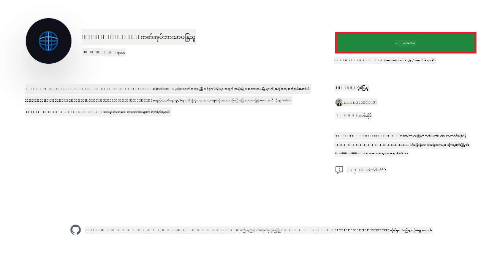
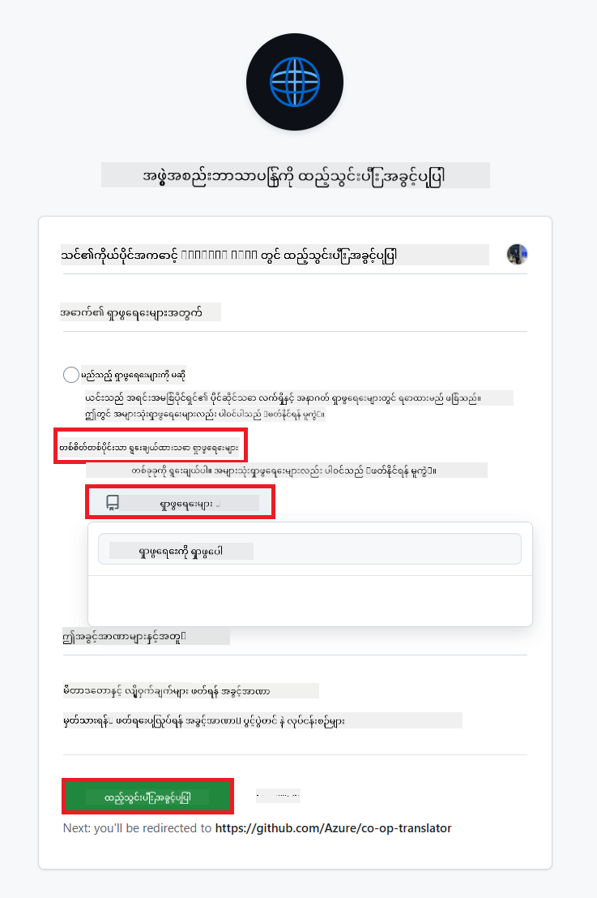
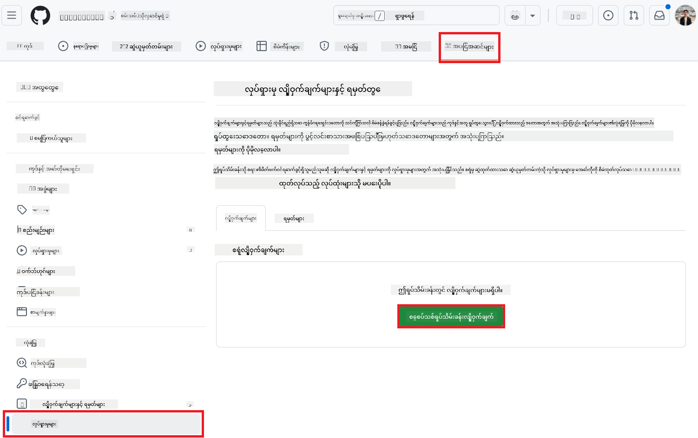
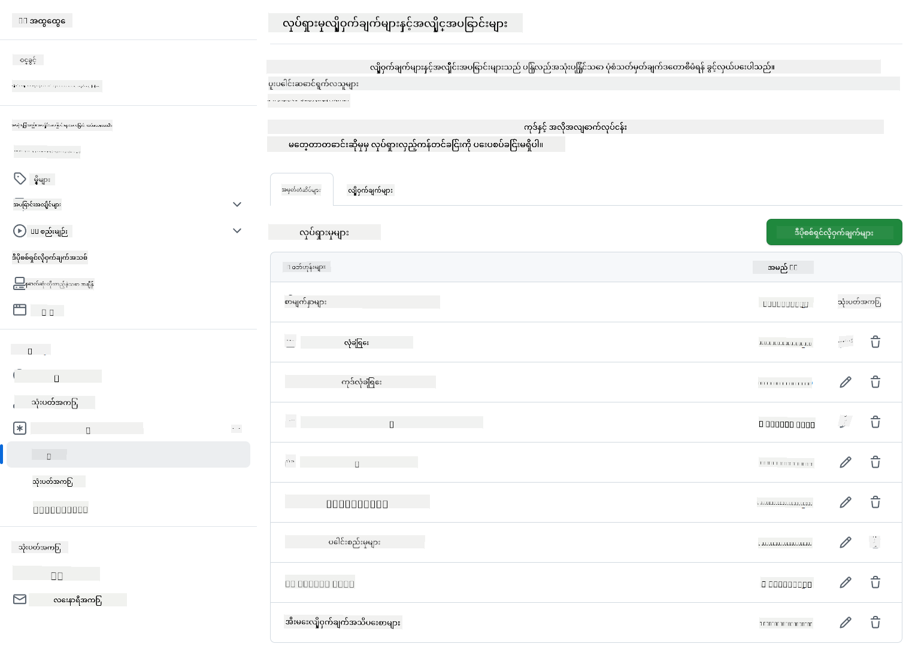

<!--
CO_OP_TRANSLATOR_METADATA:
{
  "original_hash": "c437820027c197f25fb2cbee95bae28c",
  "translation_date": "2025-06-12T19:19:30+00:00",
  "source_file": "getting_started/github-actions-guide/github-actions-guide-org.md",
  "language_code": "my"
}
-->
# Co-op Translator GitHub Action ကို အသုံးပြုခြင်း (အဖွဲ့အစည်းလမ်းညွှန်)

**ရည်ရွယ်ထားသော ပရိသတ်:** ဤလမ်းညွှန်သည် **Microsoft အတွင်းပိုင်းအသုံးပြုသူများ** သို့မဟုတ် **အဆောက်အအုံရှိ Co-op Translator GitHub App အတွက် လိုအပ်သော ခွင့်ပြုချက်များရှိသူ သို့မဟုတ် ကိုယ်ပိုင် GitHub App ကို ဖန်တီးနိုင်သူ အဖွဲ့များ** အတွက် ရည်ရွယ်ထားပါသည်။

သင့် repository ၏ စာရွက်စာတမ်းများကို Co-op Translator GitHub Action ဖြင့် အလိုအလျောက် ဘာသာပြန်လုပ်ဆောင်နိုင်ပါသည်။ ဤလမ်းညွှန်သည် သင့်ရဲ့ source Markdown ဖိုင်များ သို့မဟုတ် ပုံများ ပြောင်းလဲသည့်အခါ အလိုအလျောက် ဘာသာပြန်ချက်အသစ်များပါသော Pull Request များ ဖန်တီးပေးရန် action ကို ပြင်ဆင်ခြင်းကို လမ်းညွှန်ပါသည်။

> [!IMPORTANT]
> 
> **မှန်ကန်သော လမ်းညွှန်ကို ရွေးချယ်ခြင်း:**
>
> ဤလမ်းညွှန်တွင် **GitHub App ID နှင့် Private Key** ကို အသုံးပြု၍ ပြင်ဆင်နည်းကို ဖော်ပြထားသည်။ သင်၏ အဖွဲ့အစည်း သို့မဟုတ် repository ဆက်တင်များက `GITHUB_TOKEN` ၏ မူရင်း ခွင့်ပြုချက်များကို ကန့်သတ်ထားပါက ဤ "အဖွဲ့အစည်း လမ်းညွှန်" ကို သုံးရန် လိုအပ်နိုင်သည်။ အထူးသဖြင့် `GITHUB_TOKEN` သည် လိုအပ်သော `write` ခွင့်ပြုချက်များ (ဥပမာ `contents: write` သို့မဟုတ် `pull-requests: write`) မရရှိနိုင်ပါက [Public Setup Guide](./github-actions-guide-public.md) တွင် ဖော်ပြထားသည့် workflow သည် ခွင့်ပြုချက် မလုံလောက်မှုကြောင့် မအောင်မြင်ပါ။ အထူးခွင့်ပြုချက်ရှိသော GitHub App ကို အသုံးပြုခြင်းဖြင့် ဤကန့်သတ်ချက်ကို ကျော်လွှားနိုင်ပါသည်။
>
> **အထက်ပါ အခြေအနေ မဖြစ်ပေါ်ပါက:**
>
> သင်၏ repository တွင် `GITHUB_TOKEN` သည် လုံလောက်သော ခွင့်ပြုချက်များ ရှိပါက (ဥပမာ၊ အဖွဲ့အစည်းက ကန့်သတ်မှု မရှိပါက) **[Public Setup Guide using GITHUB_TOKEN](./github-actions-guide-public.md)** ကို အသုံးပြုပါ။ အဆိုပါ လမ်းညွှန်သည် App ID သို့မဟုတ် Private Key မလိုအပ်ဘဲ `GITHUB_TOKEN` နှင့် repository ခွင့်ပြုချက်များကိုသာ အသုံးပြုပါသည်။

## မတိုင်မီလိုအပ်ချက်များ

GitHub Action ကို ပြင်ဆင်ခြင်းမပြုမီ သင့်တွင် လိုအပ်သော AI ဝန်ဆောင်မှု ခွင့်ပြုချက်များ ရှိကြောင်း သေချာစေပါ။

**1. လိုအပ်သည် - AI ဘာသာစကား မော်ဒယ် ခွင့်ပြုချက်များ**  
နည်းနည်းတစ်ခုအနည်းဆုံး အောက်ပါ Language Model များအတွက် ခွင့်ပြုချက်များ လိုအပ်ပါသည်။

- **Azure OpenAI**: Endpoint, API Key, Model/Deployment နာမည်များ၊ API Version လိုအပ်ပါသည်။
- **OpenAI**: API Key လိုအပ်ပြီး (ရွေးချယ်စရာ - Org ID, Base URL, Model ID) ပါဝင်နိုင်သည်။
- အသေးစိတ်အတွက် [Supported Models and Services](../../../../README.md) ကို ကြည့်ပါ။
- ပြင်ဆင်နည်းလမ်းညွှန် - [Set up Azure OpenAI](../set-up-resources/set-up-azure-openai.md) ကို ကြည့်ပါ။

**2. ရွေးချယ်စရာ - Computer Vision ခွင့်ပြုချက်များ (ပုံဘာသာပြန်ရန်)**

- ပုံအတွင်း စာသားဘာသာပြန်လိုပါကသာ လိုအပ်ပါသည်။
- **Azure Computer Vision**: Endpoint နှင့် Subscription Key လိုအပ်ပါသည်။
- မထည့်သွင်းပါက action သည် [Markdown-only mode](../markdown-only-mode.md) ဖြင့် လည်ပတ်ပါလိမ့်မည်။
- ပြင်ဆင်နည်းလမ်းညွှန် - [Set up Azure Computer Vision](../set-up-resources/set-up-azure-computer-vision.md) ကို ကြည့်ပါ။

## ပြင်ဆင်ခြင်းနှင့် သတ်မှတ်ခြင်း

သင့် repository တွင် Co-op Translator GitHub Action ကို ပြင်ဆင်ရန် အောက်ပါအဆင့်များကို လိုက်နာပါ။

### အဆင့် ၁: GitHub App Authentication ကို တပ်ဆင်ပြီး ပြင်ဆင်ခြင်း

Workflow သည် သင့် repository နှင့် လုံခြုံစိတ်ချစွာ ဆက်သွယ်ရန် GitHub App Authentication ကို အသုံးပြုပါသည် (ဥပမာ၊ Pull Request များ ဖန်တီးရန်)။ အောက်ပါရွေးချယ်စရာများထဲမှ တစ်ခုကို ရွေးချယ်ပါ။

#### **ရွေးချယ်စရာ A: Microsoft အတွင်းပိုင်းအသုံးပြုမှုအတွက် ကြိုတင်တပ်ဆင်ထားသော Co-op Translator GitHub App ကို တပ်ဆင်ခြင်း**

1. [Co-op Translator GitHub App](https://github.com/apps/co-op-translator) စာမျက်နှာသို့ သွားပါ။

1. **Install** ကိုနှိပ်ပြီး သင့် ရည်ရွယ်ထားသော repository သို့မဟုတ် အဖွဲ့အစည်းကို ရွေးချယ်ပါ။

    

1. **Only select repositories** ကို ရွေးပြီး သင့် ရည်ရွယ်ထားသော repository (ဥပမာ `PhiCookBook`) ကို ရွေးချယ်ပါ။ **Install** ကို နှိပ်ပါ။ အတည်ပြုရန် အခွင့်ပြုချက်တောင်းခံမှု ရနိုင်ပါသည်။

    

1. **App Credentials ရယူခြင်း (အတွင်းပိုင်း လုပ်ငန်းစဉ် လိုအပ်သည်):** Workflow သည် app အဖြစ် အတည်ပြုရန် Co-op Translator အဖွဲ့မှ ပေးသော အချက်အလက် နှစ်ခု လိုအပ်ပါသည်။
  - **App ID:** Co-op Translator app ၏ ထူးခြားသော ID ဖြစ်သည်။ App ID သည်: `1164076` ဖြစ်သည်။
  - **Private Key:** `.pem` private key ဖိုင်၏ **အပြည့်အစုံ** ကို မိမိထိန်းသိမ်းသူထံမှ ရယူရမည်။ ဤ key ကို စကားဝှက်ကဲ့သို့ ထိန်းသိမ်းထားပါ။

1. အဆင့် ၂ သို့ ဆက်လက်ဆောင်ရွက်ပါ။

#### **ရွေးချယ်စရာ B: ကိုယ်ပိုင် Custom GitHub App ကို အသုံးပြုခြင်း**

- ကိုယ်တိုင် GitHub App ဖန်တီး၍ Contents နှင့် Pull requests အတွက် ဖတ်/ရေး ခွင့်ပြုချက်ရှိစေရန် ပြင်ဆင်နိုင်သည်။ App ID နှင့် Private Key ကို လိုအပ်ပါမည်။

### အဆင့် ၂: Repository Secrets ကို ပြင်ဆင်ခြင်း

GitHub App နှင့် AI ဝန်ဆောင်မှု ခွင့်ပြုချက်များကို သင့် repository ၏ encrypted secrets အဖြစ် ထည့်သွင်းရမည်။

1. သင့် ရည်ရွယ်ထားသော GitHub repository (ဥပမာ `PhiCookBook`) သို့ သွားပါ။

1. **Settings** > **Secrets and variables** > **Actions** သို့ သွားပါ။

1. **Repository secrets** အောက်တွင် **New repository secret** ကို နှိပ်ပြီး အောက်ပါ secrets များကို တစ်ခုချင်းစီ ထည့်သွင်းပါ။

   

**လိုအပ်သော Secrets (GitHub App Authentication အတွက်):**

| Secret Name          | ဖော်ပြချက်                                      | တန်ဖိုးရရှိရာ                                  |
| :------------------- | :----------------------------------------------- | :----------------------------------------------- |
| `GH_APP_ID`          | GitHub App ၏ App ID (အဆင့် ၁ မှရရှိသည်)      | GitHub App Settings                              |
| `GH_APP_PRIVATE_KEY` | ဒေါင်းလုတ်လုပ်ထားသော `.pem` ဖိုင်၏ **အပြည့်အစုံ** | `.pem` ဖိုင် (အဆင့် ၁ မှရရှိသည်)                      |

**AI ဝန်ဆောင်မှု Secrets (မတိုင်မီလိုအပ်ချက်အရ အားလုံး ထည့်သွင်းရန်):**

| Secret Name                         | ဖော်ပြချက်                               | တန်ဖိုးရရှိရာ                     |
| :---------------------------------- | :---------------------------------------- | :------------------------------- |
| `AZURE_SUBSCRIPTION_KEY`            | Azure AI ဝန်ဆောင်မှုအတွက် Key (Computer Vision)  | Azure AI Foundry                    |
| `AZURE_AI_SERVICE_ENDPOINT`         | Azure AI ဝန်ဆောင်မှုအတွက် Endpoint (Computer Vision) | Azure AI Foundry                     |
| `AZURE_OPENAI_API_KEY`              | Azure OpenAI ဝန်ဆောင်မှုအတွက် Key              | Azure AI Foundry                     |
| `AZURE_OPENAI_ENDPOINT`             | Azure OpenAI ဝန်ဆောင်မှုအတွက် Endpoint         | Azure AI Foundry                     |
| `AZURE_OPENAI_MODEL_NAME`           | သင့် Azure OpenAI Model နာမည်              | Azure AI Foundry                     |
| `AZURE_OPENAI_CHAT_DEPLOYMENT_NAME` | သင့် Azure OpenAI Deployment နာမည်         | Azure AI Foundry                     |
| `AZURE_OPENAI_API_VERSION`          | Azure OpenAI အတွက် API Version              | Azure AI Foundry                     |
| `OPENAI_API_KEY`                    | OpenAI အတွက် API Key                        | OpenAI Platform                  |
| `OPENAI_ORG_ID`                     | OpenAI အဖွဲ့အစည်း ID                    | OpenAI Platform                  |
| `OPENAI_CHAT_MODEL_ID`              | အထူး OpenAI model ID                  | OpenAI Platform                    |
| `OPENAI_BASE_URL`                   | Custom OpenAI API Base URL                | OpenAI Platform                    |



### အဆင့် ၃: Workflow ဖိုင် ဖန်တီးခြင်း

နောက်ဆုံးတွင် အလိုအလျောက်လုပ်ဆောင်မှုကို သတ်မှတ်သည့် YAML ဖိုင်ကို ဖန်တီးပါ။

1. သင့် repository ၏ root directory တွင် `.github/workflows/` ဖိုလ်ဒါ မရှိပါက ဖန်တီးပါ။

1. `.github/workflows/` အတွင်း `co-op-translator.yml` ဟု အမည်ပေးထားသော ဖိုင်ကို ဖန်တီးပါ။

1. co-op-translator.yml ထဲသို့ အောက်ပါ အကြောင်းအရာကို ကူးထည့်ပါ။

```
name: Co-op Translator

on:
  push:
    branches:
      - main

jobs:
  co-op-translator:
    runs-on: ubuntu-latest

    permissions:
      contents: write
      pull-requests: write

    steps:
      - name: Checkout repository
        uses: actions/checkout@v4
        with:
          fetch-depth: 0

      - name: Set up Python
        uses: actions/setup-python@v4
        with:
          python-version: '3.10'

      - name: Install Co-op Translator
        run: |
          python -m pip install --upgrade pip
          pip install co-op-translator

      - name: Run Co-op Translator
        env:
          PYTHONIOENCODING: utf-8
          # Azure AI Service Credentials
          AZURE_SUBSCRIPTION_KEY: ${{ secrets.AZURE_SUBSCRIPTION_KEY }}
          AZURE_AI_SERVICE_ENDPOINT: ${{ secrets.AZURE_AI_SERVICE_ENDPOINT }}

          # Azure OpenAI Credentials
          AZURE_OPENAI_API_KEY: ${{ secrets.AZURE_OPENAI_API_KEY }}
          AZURE_OPENAI_ENDPOINT: ${{ secrets.AZURE_OPENAI_ENDPOINT }}
          AZURE_OPENAI_MODEL_NAME: ${{ secrets.AZURE_OPENAI_MODEL_NAME }}
          AZURE_OPENAI_CHAT_DEPLOYMENT_NAME: ${{ secrets.AZURE_OPENAI_CHAT_DEPLOYMENT_NAME }}
          AZURE_OPENAI_API_VERSION: ${{ secrets.AZURE_OPENAI_API_VERSION }}

          # OpenAI Credentials
          OPENAI_API_KEY: ${{ secrets.OPENAI_API_KEY }}
          OPENAI_ORG_ID: ${{ secrets.OPENAI_ORG_ID }}
          OPENAI_CHAT_MODEL_ID: ${{ secrets.OPENAI_CHAT_MODEL_ID }}
          OPENAI_BASE_URL: ${{ secrets.OPENAI_BASE_URL }}
        run: |
          # =====================================================================
          # IMPORTANT: Set your target languages here (REQUIRED CONFIGURATION)
          # =====================================================================
          # Example: Translate to Spanish, French, German. Add -y to auto-confirm.
          translate -l "es fr de" -y  # <--- MODIFY THIS LINE with your desired languages

      - name: Authenticate GitHub App
        id: generate_token
        uses: tibdex/github-app-token@v1
        with:
          app_id: ${{ secrets.GH_APP_ID }}
          private_key: ${{ secrets.GH_APP_PRIVATE_KEY }}

      - name: Create Pull Request with translations
        uses: peter-evans/create-pull-request@v5
        with:
          token: ${{ steps.generate_token.outputs.token }}
          commit-message: "🌐 Update translations via Co-op Translator"
          title: "🌐 Update translations via Co-op Translator"
          body: |
            This PR updates translations for recent changes to the main branch.

            ### 📋 Changes included
            - Translated contents are available in the `translations/` directory
            - Translated images are available in the `translated_images/` directory

            ---
            🌐 Automatically generated by the [Co-op Translator](https://github.com/Azure/co-op-translator) GitHub Action.
          branch: update-translations
          base: main
          labels: translation, automated-pr
          delete-branch: true
          add-paths: |
            translations/
            translated_images/

```

4.  **Workflow ကို ကိုယ်ပိုင်ပြင်ဆင်ခြင်း:**
  - **[!IMPORTANT] ရည်ရွယ်သော ဘာသာစကားများ:** `Run Co-op Translator` step, you **MUST review and modify the list of language codes** within the `translate -l "..." -y` command to match your project's requirements. The example list (`ar de es...`) needs to be replaced or adjusted.
  - **Trigger (`on:`):** The current trigger runs on every push to `main`. For large repositories, consider adding a `paths:` filter (see commented example in the YAML) to run the workflow only when relevant files (e.g., source documentation) change, saving runner minutes.
  - **PR Details:** Customize the `commit-message`, `title`, `body`, `branch` name, and `labels` in the `Create Pull Request` step if needed.

## Credential Management and Renewal

- **Security:** Always store sensitive credentials (API keys, private keys) as GitHub Actions secrets. Never expose them in your workflow file or repository code.
- **[!IMPORTANT] Key Renewal (Internal Microsoft Users):** Be aware that Azure OpenAI key used within Microsoft might have a mandatory renewal policy (e.g., every 5 months). Ensure you update the corresponding GitHub secrets (`AZURE_OPENAI_...` စသည်ဖြင့် ထည့်သွင်းထားသော အချက်များကို **သက်တမ်းကုန်ဆုံးခင်** ပြင်ဆင်ထားရန်။ မဟုတ်ပါက workflow မအောင်မြင်နိုင်ပါ။

## Workflow ကို လည်ပတ်ခြင်း

`co-op-translator.yml` ဖိုင်ကို သင့် main branch (သို့မဟုတ် `on:` trigger), the workflow will automatically run whenever changes are pushed to that branch (and match the `paths` filter တွင် သတ်မှတ်ထားသော branch) တွင် ပေါင်းစပ်ပြီးနောက်၊

ဘာသာပြန်ချက်များ ဖန်တီး/ပြင်ဆင်ခြင်း ဖြစ်ပါက၊ action သည် အလိုအလျောက် ပြင်ဆင်ချက်များ ပါဝင်သည့် Pull Request ကို ဖန်တီးပေးမည်ဖြစ်ပြီး သင်၏ စစ်ဆေးမှုနှင့် ပေါင်းစပ်မှုအတွက် အသင့်ရှိပါသည်။

**အတည်ပြုချက်**  
ဤစာတမ်းကို AI ဘာသာပြန်ဝန်ဆောင်မှု [Co-op Translator](https://github.com/Azure/co-op-translator) ဖြင့် ဘာသာပြန်ထားပါသည်။ တိကျမှန်ကန်မှုအတွက် ကြိုးစားထားသော်လည်း၊ အလိုအလျောက် ဘာသာပြန်မှုများတွင် အမှားများ သို့မဟုတ် မှားယွင်းချက်များ ပါရှိနိုင်ကြောင်း ကျေးဇူးပြု၍ သိရှိထားပါရန်။ မူရင်းစာတမ်းကို မိခင်ဘာသာဖြင့်သာ ယုံကြည်စိတ်ချရသော အရင်းအမြစ်အဖြစ် သတ်မှတ်ရန် လိုအပ်ပါသည်။ အရေးကြီးသော အချက်အလက်များအတွက် လူ့ဘာသာပြန်အတတ်ပညာရှင်မှ ဘာသာပြန်ခြင်းကို အကြံပြုပါသည်။ ဤဘာသာပြန်မှု အသုံးပြုမှုကြောင့် ဖြစ်ပေါ်နိုင်သည့် နားလည်မှုမှားယွင်းမှုများအတွက် ကျွန်ုပ်တို့ တာဝန်မယူပါ။