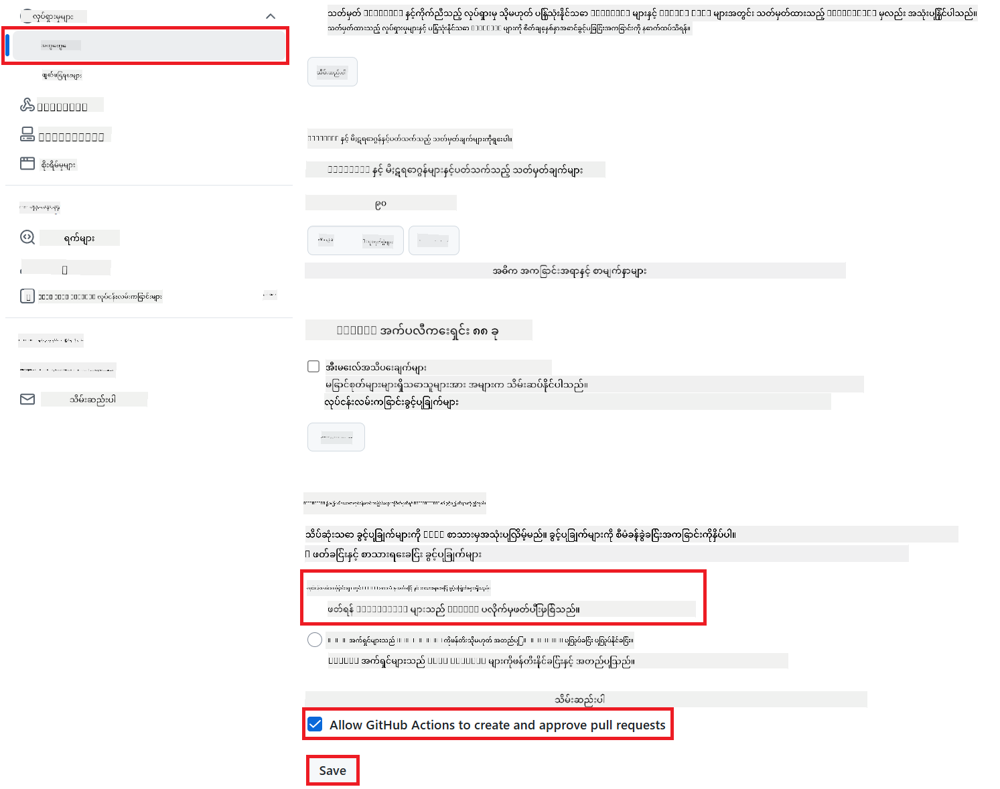

<!--
CO_OP_TRANSLATOR_METADATA:
{
  "original_hash": "a52587a512e667f70d92db853d3c61d5",
  "translation_date": "2025-06-12T19:36:32+00:00",
  "source_file": "getting_started/github-actions-guide/github-actions-guide-public.md",
  "language_code": "my"
}
-->
# Co-op Translator GitHub Action ကို အသုံးပြုခြင်း (အများပြည်သူ စနစ်တကျ)

**ပစ်မှတ် အသုံးပြုသူများ:** ဒီလမ်းညွှန်ကို ပုံမှန် GitHub Actions ခွင့်ပြုချက်များလုံလောက်သည့် အများပြည်သူ သို့မဟုတ် ကိုယ်ပိုင် repository များအတွက် ရည်ရွယ်ထားပါသည်။ ၎င်းသည် စံပြ `GITHUB_TOKEN` ကို အသုံးပြုပါသည်။

သင့် repository ၏ စာတမ်းများကို Co-op Translator GitHub Action ဖြင့် အလိုအလျောက် ဘာသာပြန်ပေးနိုင်သည်။ သင်၏ မူရင်း Markdown ဖိုင်များ သို့မဟုတ် ပုံများ ပြောင်းလဲသည့်အခါ အလိုအလျောက် ဘာသာပြန်ထားသော pull request များကို ဖန်တီးရန် ဒီလမ်းညွှန်က အဆင့်ဆင့် ပြသပေးပါသည်။

> [!IMPORTANT]
>
> **မှန်ကန်သော လမ်းညွှန်ကို ရွေးချယ်ခြင်း:**
>
> ဒီလမ်းညွှန်တွင် **စံပြ `GITHUB_TOKEN` ကို အသုံးပြု၍ ပိုမိုလွယ်ကူသော စနစ်တကျ ထားရှိမှု** ကို ဖော်ပြထားသည်။ အများစု အသုံးပြုသူများအတွက် GitHub App Private Key မလိုအပ်ဘဲ အသုံးပြုနိုင်သော နည်းလမ်း ဖြစ်သည်။
>

## မတိုင်မီ ပြင်ဆင်ရန်

GitHub Action ကို ပြင်ဆင်မတိုင်မီ သင့်မှာ လိုအပ်သော AI ဝန်ဆောင်မှု အချက်အလက်များရှိနေကြောင်း သေချာပါစေ။

**1. လိုအပ်ချက်: AI ဘာသာစကား မော်ဒယ် အချက်အလက်များ**  
သင့်မှာ တစ်ခုခု သို့မဟုတ် ထောက်ပံ့ထားသော ဘာသာစကား မော်ဒယ်အတွက် အချက်အလက်ရှိရပါမည် -

- **Azure OpenAI**: Endpoint, API Key, Model/Deployment နာမည်များ၊ API Version လိုအပ်သည်။
- **OpenAI**: API Key, (ရွေးချယ်စရာ: Org ID, Base URL, Model ID) လိုအပ်သည်။
- အသေးစိတ်အတွက် [Supported Models and Services](../../../../README.md) ကို ကြည့်ပါ။

**2. ရွေးချယ်စရာ: AI Vision အချက်အလက်များ (ပုံဘာသာပြန်ရန်)**

- ပုံများထဲရှိ စာသားများကို ဘာသာပြန်ရန်သာ လိုအပ်ပါကသာ ရှိရမည်။
- **Azure AI Vision**: Endpoint နှင့် Subscription Key လိုအပ်သည်။
- မထည့်ပါက ဒီ Action သည် [Markdown-only mode](../markdown-only-mode.md) ဖြင့် အလိုအလျောက် ဆောင်ရွက်မည် ဖြစ်သည်။

## စနစ်တကျ ပြင်ဆင်ခြင်း

စံပြ `GITHUB_TOKEN` ကို အသုံးပြုပြီး သင့် repository တွင် Co-op Translator GitHub Action ကို ပြင်ဆင်ရန် အောက်ပါအဆင့်များကို လိုက်နာပါ။

### အဆင့် ၁: အတည်ပြုခြင်း နားလည်ခြင်း (`GITHUB_TOKEN` အသုံးပြုခြင်း)

ဒီ workflow သည် GitHub Actions မှ ပေးထားသော စံပြ `GITHUB_TOKEN` ကို အသုံးပြုသည်။ ဒီ token က workflow ကို သင့် repository နှင့် ပတ်သက်သော လုပ်ဆောင်ခွင့်များကို **အဆင့် ၃** တွင် သတ်မှတ်ထားသည့် အတိုင်း အလိုအလျောက် ခွင့်ပြုပါသည်။

### အဆင့် ၂: Repository Secrets ကို ပြင်ဆင်ခြင်း

သင့် AI ဝန်ဆောင်မှု အချက်အလက်များကို သင့် repository ၏ အချက်အလက်လုံခြုံမှု စနစ် (encrypted secrets) အဖြစ် ထည့်သွင်းရမည် ဖြစ်သည်။

1. သင့် GitHub repository သို့ ဝင်ရောက်ပါ။
2. **Settings** > **Secrets and variables** > **Actions** သို့ သွားပါ။
3. **Repository secrets** အောက်တွင် လိုအပ်သည့် AI ဝန်ဆောင်မှု secret အသစ်တိုင်းအတွက် **New repository secret** ကို နှိပ်ပါ။

     *(ပုံရိပ်ကို ပြသထားသည်: Secret များ ထည့်သွင်းရာနေရာ)*

**လိုအပ်သော AI ဝန်ဆောင်မှု Secret များ (မတိုင်မီ ပြင်ဆင်ထားသည့်အတိုင်း အားလုံး ထည့်သွင်းပါ):**

| Secret Name                         | ဖော်ပြချက်                                   | တန်ဖိုး ရင်းမြစ်                |
| :---------------------------------- | :---------------------------------------- | :------------------------------- |
| `AZURE_SUBSCRIPTION_KEY`            | Azure AI ဝန်ဆောင်မှု (Computer Vision) အတွက် Key  | သင့် Azure AI Foundry             |
| `AZURE_AI_SERVICE_ENDPOINT`         | Azure AI ဝန်ဆောင်မှု (Computer Vision) အတွက် Endpoint | သင့် Azure AI Foundry             |
| `AZURE_OPENAI_API_KEY`              | Azure OpenAI ဝန်ဆောင်မှုအတွက် Key             | သင့် Azure AI Foundry             |
| `AZURE_OPENAI_ENDPOINT`             | Azure OpenAI ဝန်ဆောင်မှုအတွက် Endpoint        | သင့် Azure AI Foundry             |
| `AZURE_OPENAI_MODEL_NAME`           | သင့် Azure OpenAI Model နာမည်                  | သင့် Azure AI Foundry             |
| `AZURE_OPENAI_CHAT_DEPLOYMENT_NAME` | သင့် Azure OpenAI Deployment နာမည်              | သင့် Azure AI Foundry             |
| `AZURE_OPENAI_API_VERSION`          | Azure OpenAI အတွက် API Version                   | သင့် Azure AI Foundry             |
| `OPENAI_API_KEY`                    | OpenAI အတွက် API Key                           | သင့် OpenAI Platform              |
| `OPENAI_ORG_ID`                     | OpenAI အဖွဲ့အစည်း ID (ရွေးချယ်စရာ)              | သင့် OpenAI Platform              |
| `OPENAI_CHAT_MODEL_ID`              | အထူး OpenAI မော်ဒယ် ID (ရွေးချယ်စရာ)               | သင့် OpenAI Platform              |
| `OPENAI_BASE_URL`                   | စိတ်ကြိုက် OpenAI API Base URL (ရွေးချယ်စရာ)        | သင့် OpenAI Platform              |

### အဆင့် ၃: Workflow ခွင့်ပြုချက်များ ပြင်ဆင်ခြင်း

GitHub Action သည် ကုဒ်များ စစ်ဆေးခြင်းနှင့် pull request များ ဖန်တီးခြင်းအတွက် `GITHUB_TOKEN` မှ ခွင့်ပြုချက်များ လိုအပ်ပါသည်။

1. သင့် repository တွင် **Settings** > **Actions** > **General** သို့ သွားပါ။
2. **Workflow permissions** အပိုင်းသို့ အောက်သို့ ဆင်းပါ။
3. **Read and write permissions** ကို ရွေးပါ။ ၎င်းက `GITHUB_TOKEN` ကို လိုအပ်သော `contents: write` နှင့် `pull-requests: write` ခွင့်များ ပေးပါသည်။
4. **Allow GitHub Actions to create and approve pull requests** ကို မှတ်ပုံတင်ထားပါ။
5. **Save** ကို နှိပ်ပါ။



### အဆင့် ၄: Workflow ဖိုင် ဖန်တီးခြင်း

နောက်ဆုံးတွင် `GITHUB_TOKEN` ကို အသုံးပြု၍ အလိုအလျောက် ဆောင်ရွက်မည့် workflow ကို သတ်မှတ်ထားသည့် YAML ဖိုင်ကို ဖန်တီးပါ။

1. သင့် repository ၏ root ဖိုလ်ဒါတွင် `.github/workflows/` ဖိုလ်ဒါ မရှိသေးပါက ဖန်တီးပါ။
2. `.github/workflows/` ဖိုလ်ဒါအတွင်း `co-op-translator.yml` ဟု အမည်ပေးထားသော ဖိုင်ကို ဖန်တီးပါ။
3. အောက်ပါ အကြောင်းအရာကို `co-op-translator.yml` ထဲသို့ ကူးထည့်ပါ။

```yaml
name: Co-op Translator

on:
  push:
    branches:
      - main

jobs:
  co-op-translator:
    runs-on: ubuntu-latest

    permissions:
      contents: write
      pull-requests: write

    steps:
      - name: Checkout repository
        uses: actions/checkout@v4
        with:
          fetch-depth: 0

      - name: Set up Python
        uses: actions/setup-python@v4
        with:
          python-version: '3.10'

      - name: Install Co-op Translator
        run: |
          python -m pip install --upgrade pip
          pip install co-op-translator

      - name: Run Co-op Translator
        env:
          PYTHONIOENCODING: utf-8
          # === AI Service Credentials ===
          AZURE_SUBSCRIPTION_KEY: ${{ secrets.AZURE_SUBSCRIPTION_KEY }}
          AZURE_AI_SERVICE_ENDPOINT: ${{ secrets.AZURE_AI_SERVICE_ENDPOINT }}
          AZURE_OPENAI_API_KEY: ${{ secrets.AZURE_OPENAI_API_KEY }}
          AZURE_OPENAI_ENDPOINT: ${{ secrets.AZURE_OPENAI_ENDPOINT }}
          AZURE_OPENAI_MODEL_NAME: ${{ secrets.AZURE_OPENAI_MODEL_NAME }}
          AZURE_OPENAI_CHAT_DEPLOYMENT_NAME: ${{ secrets.AZURE_OPENAI_CHAT_DEPLOYMENT_NAME }}
          AZURE_OPENAI_API_VERSION: ${{ secrets.AZURE_OPENAI_API_VERSION }}
          OPENAI_API_KEY: ${{ secrets.OPENAI_API_KEY }}
          OPENAI_ORG_ID: ${{ secrets.OPENAI_ORG_ID }}
          OPENAI_CHAT_MODEL_ID: ${{ secrets.OPENAI_CHAT_MODEL_ID }}
          OPENAI_BASE_URL: ${{ secrets.OPENAI_BASE_URL }}
        run: |
          # =====================================================================
          # IMPORTANT: Set your target languages here (REQUIRED CONFIGURATION)
          # =====================================================================
          # Example: Translate to Spanish, French, German. Add -y to auto-confirm.
          translate -l "es fr de" -y  # <--- MODIFY THIS LINE with your desired languages

      - name: Create Pull Request with translations
        uses: peter-evans/create-pull-request@v5
        with:
          token: ${{ secrets.GITHUB_TOKEN }}
          commit-message: "🌐 Update translations via Co-op Translator"
          title: "🌐 Update translations via Co-op Translator"
          body: |
            This PR updates translations for recent changes to the main branch.

            ### 📋 Changes included
            - Translated contents are available in the `translations/` directory
            - Translated images are available in the `translated_images/` directory

            ---
            🌐 Automatically generated by the [Co-op Translator](https://github.com/Azure/co-op-translator) GitHub Action.
          branch: update-translations
          base: main
          labels: translation, automated-pr
          delete-branch: true
          add-paths: |
            translations/
            translated_images/
```  
4. **Workflow ကို ကိုယ်တိုင် ပြင်ဆင်ရန်:**  
  - **[!IMPORTANT] ပစ်မှတ် ဘာသာစကားများ:** `Run Co-op Translator` step, you **MUST review and modify the list of language codes** within the `translate -l "..." -y` command to match your project's requirements. The example list (`ar de es...`) needs to be replaced or adjusted.
  - **Trigger (`on:`):** The current trigger runs on every push to `main`. For large repositories, consider adding a `paths:` filter (see commented example in the YAML) to run the workflow only when relevant files (e.g., source documentation) change, saving runner minutes.
  - **PR Details:** Customize the `commit-message`, `title`, `body`, `branch` name, and `labels` in the `Create Pull Request` အဆင့်တွင် လိုအပ်သလို ပြင်ဆင်နိုင်ပါသည်။

**ပယ်ချခြင်း**  
ဤစာရွက်စာတမ်းကို AI ဘာသာပြန်ဝန်ဆောင်မှုဖြစ်သော [Co-op Translator](https://github.com/Azure/co-op-translator) ကို အသုံးပြု၍ ဘာသာပြန်ထားပါသည်။ ကျွန်ုပ်တို့သည် တိကျမှုအတွက် ကြိုးပမ်းသည်မှာမှန်သော်လည်း အလိုအလျောက်ဘာသာပြန်ခြင်းများတွင် အမှားများ သို့မဟုတ် မှားယွင်းမှုများ ပါဝင်နိုင်ကြောင်း သတိပြုပါရန် မေတ္တာရပ်ခံအပ်ပါသည်။ မူလစာရွက်စာတမ်းကို မူရင်းဘာသာဖြင့်သာ တရားဝင်အရင်းအမြစ်အဖြစ် ယူဆရမည် ဖြစ်သည်။ အရေးကြီးသော သတင်းအချက်အလက်များအတွက် ကောင်းမွန်သော လူ့ဘာသာပြန်ခြင်းကို အကြံပြုပါသည်။ ဤဘာသာပြန်မှုကို အသုံးပြုရာမှ ဖြစ်ပေါ်လာနိုင်သည့် နားလည်မှုအမှားများ သို့မဟုတ် မှားယွင်းဖတ်ရှုမှုများအတွက် ကျွန်ုပ်တို့ တာဝန်မယူပါ။