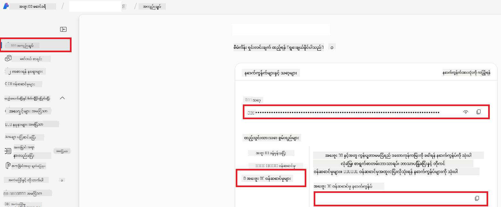

<!--
CO_OP_TRANSLATOR_METADATA:
{
  "original_hash": "b58d7c3cb4210697a073d20eb3064945",
  "translation_date": "2025-06-12T18:24:34+00:00",
  "source_file": "getting_started/set-up-azure-ai.md",
  "language_code": "my"
}
-->
# Azure AI ကို Co-op Translator (Azure OpenAI & Azure AI Vision) အတွက် ပြင်ဆင်ခြင်း

ဤလမ်းညွှန်မှာ Azure AI Foundry အတွင်း Azure OpenAI ကို ဘာသာပြန်မှုအတွက်နှင့် Azure Computer Vision ကို ပုံများအကြောင်းအရာခွဲခြမ်းစိတ်ဖြာမှုအတွက် (ထို့နောက် ပုံအခြေပြု ဘာသာပြန်မှုအတွက် အသုံးပြုနိုင်သည်) ပြင်ဆင်နည်းကို လမ်းညွှန်ပေးထားသည်။

**လိုအပ်ချက်များ:**
- အသုံးပြုနေသော subscription ပါရှိသည့် Azure အကောင့်တစ်ခု။
- Azure subscription တွင် အရင်းအမြစ်များနှင့် deployment များဖန်တီးခွင့်ရှိမှု။

## Azure AI Project တစ်ခု ဖန်တီးခြင်း

AI အရင်းအမြစ်များကို စီမံခန့်ခွဲရန် အဓိကနေရာအဖြစ် အသုံးပြုမည့် Azure AI Project တစ်ခုကို ဖန်တီးခြင်းဖြင့် စတင်ပါမည်။

1. [https://ai.azure.com](https://ai.azure.com) သို့သွား၍ သင့် Azure အကောင့်ဖြင့် လက်မှတ်ထိုးဝင်ပါ။

1. **+Create** ကိုရွေးပြီး ပရောဂျက်အသစ်တစ်ခု ဖန်တီးပါ။

1. အောက်ပါအချက်များကို ပြုလုပ်ပါ-
   - **Project name** ထည့်ပါ (ဥပမာ - `CoopTranslator-Project`)။
   - **AI hub** ကိုရွေးပါ (ဥပမာ - `CoopTranslator-Hub`) (လိုအပ်လျှင် အသစ်ဖန်တီးနိုင်သည်)။

1. "**Review and Create**" ကိုနှိပ်၍ ပရောဂျက်ကို ပြင်ဆင်ပါ။ ပြီးလျှင် ပရောဂျက်၏ အကျဉ်းချုပ်စာမျက်နှာသို့ သွားပါလိမ့်မည်။

## ဘာသာပြန်မှုအတွက် Azure OpenAI ကို ပြင်ဆင်ခြင်း

သင့်ပရောဂျက်အတွင်းတွင် စာသားဘာသာပြန်မှုအတွက် backend အဖြစ် အသုံးပြုမည့် Azure OpenAI မော်ဒယ်တစ်ခုကို တပ်ဆင်မည်ဖြစ်သည်။

### သင့်ပရောဂျက်သို့ သွားပါ

မရှိသေးလျှင် Azure AI Foundry တွင် သင့်ဖန်တီးထားသည့် ပရောဂျက် (ဥပမာ - `CoopTranslator-Project`) ကို ဖွင့်ပါ။

### OpenAI မော်ဒယ် တပ်ဆင်ခြင်း

1. ပရောဂျက်၏ ဘယ်ဘက် မီနူးမှ "My assets" အောက်ရှိ "**Models + endpoints**" ကို ရွေးပါ။

1. **+ Deploy model** ကို ရွေးချယ်ပါ။

1. **Deploy Base Model** ကို ရွေးပါ။

1. ရနိုင်သော မော်ဒယ်များစာရင်းတစ်ခုကို ပြသပါမည်။ သင့်လိုအပ်ချက်နှင့် ကိုက်ညီသော GPT မော်ဒယ်တစ်ခုကို ရှာဖွေ စစ်ထုတ်ပါ။ ကျွန်ုပ်တို့က `gpt-4o` ကို အကြံပြုပါသည်။

1. မော်ဒယ်ကို ရွေးပြီး **Confirm** ကိုနှိပ်ပါ။

1. **Deploy** ကိုနှိပ်ပါ။

### Azure OpenAI ဆက်တင်များ

တပ်ဆင်ပြီးပါက "**Models + endpoints**" စာမျက်နှာမှ တပ်ဆင်မှုကို ရွေးပြီး **REST endpoint URL**, **Key**, **Deployment name**, **Model name** နှင့် **API version** များကို ရှာနိုင်သည်။ ဤအချက်အလက်များကို သင့်လျှောက်လွှာတွင် ဘာသာပြန်မော်ဒယ်နှင့် ပေါင်းစည်းရန် လိုအပ်မည်ဖြစ်သည်။

> [!NOTE]
> သင့်လိုအပ်ချက်အရ [API version deprecation](https://learn.microsoft.com/azure/ai-services/openai/api-version-deprecation) စာမျက်နှာမှ API version များကို ရွေးချယ်နိုင်သည်။ **API version** သည် Azure AI Foundry ၏ "**Models + endpoints**" စာမျက်နှာတွင် ပြသထားသော **Model version** နှင့် ကွာခြားသည်ကို သတိပြုပါ။

## ပုံဘာသာပြန်မှုအတွက် Azure Computer Vision ကို ပြင်ဆင်ခြင်း

ပုံအတွင်း စာသားများ ဘာသာပြန်နိုင်ရန် Azure AI Service ၏ API Key နှင့် Endpoint ကို ရှာဖွေရမည်ဖြစ်သည်။

1. သင့် Azure AI Project (ဥပမာ - `CoopTranslator-Project`) သို့ သွားပါ။ ပရောဂျက်အကျဉ်းချုပ်စာမျက်နှာတွင် ရှိကြောင်း သေချာပါစေ။

### Azure AI Service ဆက်တင်များ

Azure AI Service မှ API Key နှင့် Endpoint ကို ရှာဖွေပါ။

1. သင့် Azure AI Project (ဥပမာ - `CoopTranslator-Project`) သို့ သွားပါ။ ပရောဂျက်အကျဉ်းချုပ်စာမျက်နှာတွင် ရှိကြောင်း သေချာပါစေ။

1. Azure AI Service tab မှ **API Key** နှင့် **Endpoint** ကို ရှာပါ။

    

ဤဆက်သွယ်မှုက Azure AI Services အရင်းအမြစ်များ (ပုံခွဲခြမ်းစိတ်ဖြာမှုအပါအဝင်) ၏ စွမ်းဆောင်ရည်များကို သင့် AI Foundry ပရောဂျက်တွင် အသုံးပြုနိုင်စေသည်။ ထို့နောက် ဤဆက်သွယ်မှုကို သင့် notebook များ သို့မဟုတ် လျှောက်လွှာများတွင် အသုံးပြု၍ ပုံများမှ စာသားများကို ရယူနိုင်ပြီး Azure OpenAI မော်ဒယ်သို့ ပို့ပေး၍ ဘာသာပြန်နိုင်ပါသည်။

## သင့်လက်မှတ်အချက်အလက်များ စုစည်းခြင်း

ယခုအချိန်တွင် အောက်ပါအချက်အလက်များကို စုဆောင်းပြီးဖြစ်ရမည်-

**Azure OpenAI (စာသားဘာသာပြန်မှု) အတွက်:**
- Azure OpenAI Endpoint
- Azure OpenAI API Key
- Azure OpenAI Model Name (ဥပမာ - `gpt-4o`)
- Azure OpenAI Deployment Name (ဥပမာ - `cooptranslator-gpt4o`)
- Azure OpenAI API Version

**Azure AI Services (Vision မှ စာသားထုတ်ယူခြင်း) အတွက်:**
- Azure AI Service Endpoint
- Azure AI Service API Key

### ဥပမာ- ပတ်ဝန်းကျင် အပြောင်းအလဲ ဆက်တင် (Preview)

နောက်ပိုင်းတွင် သင့်လျှောက်လွှာကို တည်ဆောက်ရာတွင် ဤစုဆောင်းထားသည့် လက်မှတ်အချက်အလက်များဖြင့် ပတ်ဝန်းကျင် အပြောင်းအလဲများအဖြစ် ပြင်ဆင်နိုင်ပါသည်။ ဥပမာ-

```bash
# Azure AI Service Credentials (Required for image translation)
AZURE_AI_SERVICE_API_KEY="your_azure_ai_service_api_key" # e.g., 21xasd...
AZURE_AI_SERVICE_ENDPOINT="https://your_azure_ai_service_endpoint.cognitiveservices.azure.com/"

# Azure OpenAI Credentials (Required for text translation)
AZURE_OPENAI_API_KEY="your_azure_openai_api_key" # e.g., 21xasd...
AZURE_OPENAI_ENDPOINT="https://your_azure_openai_endpoint.openai.azure.com/"
AZURE_OPENAI_MODEL_NAME="your_model_name" # e.g., gpt-4o
AZURE_OPENAI_CHAT_DEPLOYMENT_NAME="your_deployment_name" # e.g., cooptranslator-gpt4o
AZURE_OPENAI_API_VERSION="your_api_version" # e.g., 2024-12-01-preview
```

---

### နောက်ထပ် ဖတ်ရှုရန်

- [Azure AI Foundry တွင် ပရောဂျက် ဖန်တီးနည်း](https://learn.microsoft.com/azure/ai-foundry/how-to/create-projects?tabs=ai-studio)
- [Azure AI အရင်းအမြစ်များ ဖန်တီးနည်း](https://learn.microsoft.com/azure/ai-foundry/how-to/create-azure-ai-resource?tabs=portal)
- [Azure AI Foundry တွင် OpenAI မော်ဒယ်များ တပ်ဆင်နည်း](https://learn.microsoft.com/en-us/azure/ai-foundry/how-to/deploy-models-openai)

**အကြောင်းကြားချက်**  
ဤစာတမ်းကို AI ဘာသာပြန်စနစ်ဖြစ်သော [Co-op Translator](https://github.com/Azure/co-op-translator) ဖြင့် ဘာသာပြန်ထားပါသည်။ ကျွန်ုပ်တို့သည် တိကျမှန်ကန်မှုအတွက် ကြိုးစားသည်ဖြစ်သော်လည်း၊ အလိုအလျောက် ဘာသာပြန်ခြင်းများတွင် အမှားများ သို့မဟုတ် မှန်ကန်မှုမရှိမှုများ ဖြစ်ပေါ်နိုင်ကြောင်း သတိပြုပါရန် အသိပေးအပ်ပါသည်။ မူရင်းစာတမ်းကို မူလဘာသာဖြင့်သာ ယုံကြည်စိတ်ချရသော အချက်အလက်အဖြစ် သတ်မှတ်ရမည် ဖြစ်ပါသည်။ အရေးကြီးသော အချက်အလက်များအတွက် လူ့ဘာသာပြန်ပညာရှင်မှ ဘာသာပြန်ခြင်းကို အကြံပြုပါသည်။ ဤဘာသာပြန်ချက်ကို အသုံးပြုခြင်းမှ ဖြစ်ပေါ်နိုင်သည့် နားလည်မှုမှားယွင်းမှုများအတွက် ကျွန်ုပ်တို့ တာဝန်မယူပါ။