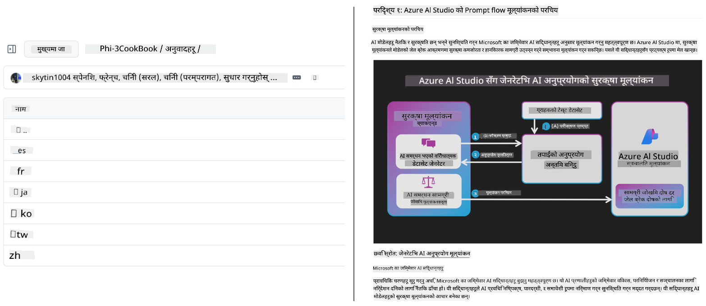
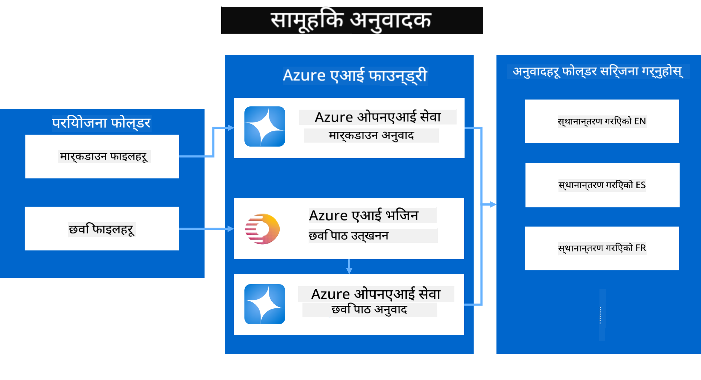

<!--
CO_OP_TRANSLATOR_METADATA:
{
  "original_hash": "044724537b57868117aadae8e7728c7c",
  "translation_date": "2025-06-12T10:14:18+00:00",
  "source_file": "README.md",
  "language_code": "ne"
}
-->


# Co-op Translator: शैक्षिक दस्तावेज़हरूको अनुवाद सजिलै स्वचालित बनाउनुहोस्

_तपाईंको दस्तावेज़हरूलाई धेरै भाषाहरूमा सजिलै अनुवाद गरेर विश्वव्यापी दर्शकसम्म पुग्नुहोस्।_

[](https://pypi.org/project/co-op-translator/)
[](https://github.com/azure/co-op-translator/blob/main/LICENSE)
[](https://pepy.tech/project/co-op-translator)
[](https://pepy.tech/project/co-op-translator)
[](https://github.com/psf/black)

[](https://GitHub.com/azure/co-op-translator/graphs/contributors/)
[](https://GitHub.com/azure/co-op-translator/issues/)
[](https://GitHub.com/azure/co-op-translator/pulls/)
[](http://makeapullrequest.com)

### भाषा समर्थन Co-op Translator द्वारा सञ्चालित

> [!NOTE]
> यी यस रिपोजिटरीको सामग्रीका हालका अनुवादहरू हुन्। Co-op Translator द्वारा समर्थित भाषाहरूको पूर्ण सूचीको लागि, कृपया [Language Support](../..) खण्ड हेर्नुहोस्।

[](https://GitHub.com/azure/co-op-translator/watchers/)
[](https://GitHub.com/azure/co-op-translator/network/)
[](https://GitHub.com/azure/co-op-translator/stargazers/)

[](https://discord.com/invite/ByRwuEEgH4)

[](https://codespaces.new/azure/co-op-translator)
[](https://vscode.dev/redirect?url=vscode://ms-vscode-remote.remote-containers/cloneInVolume?url=https://github.com/azure/co-op-translator)

## अवलोकन: तपाईंको शैक्षिक सामग्रीको अनुवादलाई सहज बनाउनुहोस्

भाषागत अवरोधहरूले विश्वभरिका सिक्नेहरू र विकासकर्ताहरूका लागि मूल्यवान शैक्षिक स्रोतहरू र प्राविधिक ज्ञानमा पहुँचलाई निकै सीमित पार्छ। यसले सहभागितामा बाधा पुर्याउँछ र विश्वव्यापी नवप्रवर्तन र सिकाइको गतिलाई ढिलो बनाउँछ।

**Co-op Translator** माइक्रोसफ्टका आफ्नै ठूलो स्तरका शैक्षिक श्रृंखलाहरू (जस्तै "For Beginners" मार्गदर्शनहरू) को गैरकुशल म्यानुअल अनुवाद प्रक्रियालाई समाधान गर्ने आवश्यकताबाट जन्मिएको हो। यो सबैका लागि बाधाहरू हटाउन डिजाइन गरिएको सजिलो र शक्तिशाली उपकरणमा विकसित भएको छ। CLI र GitHub Actions मार्फत उच्च गुणस्तरको स्वचालित अनुवाद प्रदान गरेर, Co-op Translator ले शिक्षक, विद्यार्थी, अनुसन्धानकर्ता, र विकासकर्ताहरूलाई भाषा सीमाहरू बिना ज्ञान साझा गर्न र पहुँच गर्न सक्षम बनाउँछ।

Co-op Translator कसरी अनुवादित शैक्षिक सामग्री व्यवस्थापन गर्छ हेर्नुहोस्:



Markdown फाइलहरू र छवि पाठहरू स्वचालित रूपमा अनुवादित हुन्छन् र भाषा-विशिष्ट फोल्डरहरूमा राम्रोसँग व्यवस्थित गरिन्छ।

**आजै Co-op Translator सँग आफ्नो शैक्षिक सामग्रीलाई विश्वव्यापी पहुँच प्रदान गर्नुहोस्!**

## माइक्रोसफ्टका सिकाइ स्रोतहरूको लागि विश्वव्यापी पहुँच समर्थन

Co-op Translator ले विश्वव्यापी विकासकर्ता समुदायका लागि सेवा गर्ने माइक्रोसफ्टका प्रमुख शैक्षिक पहलहरूको भाषागत खाडल पूर्ति गर्न मद्दत गर्दछ, र रिपोजिटरीहरूको अनुवाद प्रक्रिया स्वचालित बनाउँछ। हाल Co-op Translator प्रयोग गरिरहेका उदाहरणहरूमा समावेश छन्:

[](https://github.com/microsoft/Generative-AI-for-beginners)
[](https://github.com/microsoft/ML-For-Beginners)
[](https://github.com/microsoft/AI-For-Beginners)
[](https://github.com/microsoft/ai-agents-for-beginners)
[](https://github.com/microsoft/PhiCookBook)
[](https://github.com/microsoft/Generative-AI-for-beginners-dotnet)

## मुख्य विशेषताहरू

- **स्वचालित अनुवादहरू**: सजिलै विभिन्न भाषाहरूमा पाठ अनुवाद गर्नुहोस्।
- **GitHub Actions एकीकरण**: तपाईंको CI/CD पाइपलाइनको भागको रूपमा अनुवादहरू स्वचालित गर्नुहोस्।
- **Markdown संरक्षित गर्ने**: अनुवाद गर्दा Markdown को सही सिन्ट्याक्स कायम राख्नुहोस्।
- **छवि पाठ अनुवाद**: छविहरू भित्रको पाठ निकालेर अनुवाद गर्नुहोस्।
- **उन्नत LLM प्रविधि**: उच्च गुणस्तरका अनुवादका लागि अत्याधुनिक भाषा मोडेलहरू प्रयोग गर्नुहोस्।
- **सजिलो एकीकरण**: तपाईंको अवस्थित प्रोजेक्ट सेटअपसँग सहजै एकीकृत गर्नुहोस्।
- **स्थानीयकरणलाई सरल बनाउनुहोस्**: अन्तर्राष्ट्रिय बजारका लागि प्रोजेक्ट स्थानीयकरण प्रक्रिया सहज बनाउनुहोस्।

## कसरी काम गर्छ



Co-op Translator ले तपाईंको प्रोजेक्ट फोल्डरबाट Markdown फाइलहरू र छविहरू लिएर यसरी प्रक्रिया गर्छ:

1. **पाठ निकाल्ने**: Markdown फाइलहरूबाट र, यदि कन्फिगर गरिएको छ भने (जस्तै Azure AI Vision सँग), छविहरू भित्रको पाठ निकाल्छ।
1. **AI अनुवाद**: निकालिएको पाठलाई कन्फिगर गरिएको LLM (Azure OpenAI, OpenAI आदि) मा अनुवादका लागि पठाउँछ।
1. **परिणाम सुरक्षित गर्ने**: अनुवादित Markdown फाइलहरू र छविहरू (अनुवादित पाठ सहित) भाषा-विशिष्ट फोल्डरहरूमा सुरक्षित गर्दछ, मूल ढाँचा कायम राख्दै।

## सुरु गर्ने तरिका

CLI मार्फत छिटो सुरु गर्नुहोस् वा GitHub Actions सँग पूर्ण स्वचालन सेटअप गर्नुहोस्। तपाईंको कार्यप्रवाह अनुसार उपयुक्त विधि रोज्नुहोस्:

1. **कमाण्ड लाइन (CLI)** - एक पटकको अनुवाद वा म्यानुअल नियन्त्रणका लागि
2. **GitHub Actions** - प्रत्येक push मा स्वचालित अनुवादका लागि

> [!NOTE]
> यो ट्यूटोरियल Azure स्रोतहरूमा केन्द्रित भए पनि, तपाईंले कुनै पनि समर्थित भाषा मोडेल प्रयोग गर्न सक्नुहुन्छ।

### भाषा समर्थन

Co-op Translator ले विश्वव्यापी दर्शकसम्म पुग्नका लागि विभिन्न भाषाहरू समर्थन गर्छ। तपाईंलाई जान्नुपर्ने कुरा यस प्रकार छ:

#### छिटो सन्दर्भ

| भाषा | कोड | भाषा | कोड | भाषा | कोड |
|----------|------|----------|------|----------|------|
| Arabic | ar | Bengali | bn | Bulgarian | bg |
| Burmese (Myanmar) | my | Chinese (Simplified) | zh | Chinese (Traditional, HK) | hk |
| Chinese (Traditional, Macau) | mo | Chinese (Traditional, TW) | tw | Croatian | hr |
| Czech | cs | Danish | da | Dutch | nl |
| Finnish | fi | French | fr | German | de |
| Greek | el | Hebrew | he | Hindi | hi |
| Hungarian | hu | Indonesian | id | Italian | it |
| Japanese | ja | Korean | ko | Malay | ms |
| Marathi | mr | Nepali | ne | Norwegian | no |
| Persian (Farsi) | fa | Polish | pl | Portuguese (Brazil) | br |
| Portuguese (Portugal) | pt | Punjabi (Gurmukhi) | pa | Romanian | ro |
| Russian | ru | Serbian (Cyrillic) | sr | Slovak | sk |
| Slovenian | sl | Spanish | es | Swahili | sw |
| Swedish | sv | Tagalog (Filipino) | tl | Thai | th |
| Turkish | tr | Ukrainian | uk | Urdu | ur |
| Vietnamese | vi | — | — | — | — |

#### भाषा कोडहरूको प्रयोग

Co-op Translator प्रयोग गर्दा, तपाईंले भाषाहरूलाई तिनीहरूको कोडमार्फत निर्दिष्ट गर्नुपर्ने हुन्छ। उदाहरणका लागि:

```bash
# Translate to French, Spanish, and German
translate -l "fr es de"

# Translate to Chinese (Simplified) and Japanese
translate -l "zh ja"
```

> [!NOTE]
> भाषा समर्थनका विस्तृत प्राविधिक जानकारीका लागि, जस्तै:
>
> - प्रत्येक भाषाका फन्ट विशिष्टताहरू
> - ज्ञात समस्याहरू
> - नयाँ भाषाहरू कसरी थप्ने
>
> हाम्रो [Supported Languages Documentation](./getting_started/supported-languages.md) हेर्नुहोस्।

### समर्थित मोडेल र सेवा

| प्रकार                  | नाम                           |
|-----------------------|--------------------------------|
| Language Model        |   |
| AI Vision       |  |

> [!NOTE]
> यदि AI vision सेवा उपलब्ध छैन भने, co-op translator ले [Markdown-only mode](./getting_started/markdown-only-mode.md) मा स्विच गर्नेछ।

### प्रारम्भिक सेटअप

सुरु गर्नु अघि, निम्न स्रोतहरू सेटअप गर्नु आवश्यक छ:

1. भाषा मोडेल स्रोत (आवश्यक):
   - Azure OpenAI (सिफारिस गरिएको) - उद्यम स्तरको विश्वसनीयतासहित उच्च गुणस्तरको अनुवाद प्रदान गर्दछ
   - OpenAI - Azure पहुँच नभएमा वैकल्पिक विकल्प
   - समर्थित मोडेलहरूको विस्तृत जानकारीका लागि [Supported Models and Services](../..) हेर्नुहोस्

1. AI Vision स्रोत (वैकल्पिक):
   - Azure AI Vision - छविहरू भित्रको पाठ अनुवाद सक्षम पार्दछ
   - कन्फिगर नगरेमा, translator ले स्वतः [Markdown-only mode](./getting_started/markdown-only-mode.md) प्रयोग गर्नेछ
   - पाठ भएका छविहरू भएका प्रोजेक्टहरूका लागि सिफारिस गरिएको

1. कन्फिगरेसन चरणहरू:
   - विस्तृत निर्देशनका लागि हाम्रो [Azure AI setup guide](./getting_started/set-up-azure-ai.md) पालना गर्नुहोस्
   - तपाईंका API कुञ्जीहरू र endpoints सहित `.env` फाइल बनाउनुहोस् (हेर्नुहोस् [Quick Start](../..) खण्ड)
   - छनोट गरिएका सेवाहरूका लागि आवश्यक अनुमति र कोटा सुनिश्चित गर्नुहोस्

### अनुवाद अघि प्रोजेक्ट सेटअप

अनुवाद प्रक्रिया सुरु गर्नु अघि, तपाईंको प्रोजेक्ट तयार पार्न यी कदमहरू पालना गर्नुहोस्:

1. तपाईंको README तयार गर्नुहोस्:
   - README.md मा अनुवादित संस्करणहरू लिंक गर्न अनुवाद तालिका थप्नुहोस्
   - उदाहरण स्वरूप:

     ```markdown

     ### 🌐 Multi-Language Support
     
     [French](../fr/README.md) | [Spanish](../es/README.md) | [German](../de/README.md) | [Russian](../ru/README.md) | [Arabic](../ar/README.md) | [Persian (Farsi)](../fa/README.md) | [Urdu](../ur/README.md) | [Chinese (Simplified)](../zh/README.md) | [Chinese (Traditional, Macau)](../mo/README.md) | [Chinese (Traditional, Hong Kong)](../hk/README.md) | [Chinese (Traditional, Taiwan)](../tw/README.md) | [Japanese](../ja/README.md) | [Korean](../ko/README.md) | [Hindi](../hi/README.md) | [Bengali](../bn/README.md) | [Marathi](../mr/README.md) | [Nepali](./README.md) | [Punjabi (Gurmukhi)](../pa/README.md) | [Portuguese (Portugal)](../pt/README.md) | [Portuguese (Brazil)](../br/README.md) | [Italian](../it/README.md) | [Polish](../pl/README.md) | [Turkish](../tr/README.md) | [Greek](../el/README.md) | [Thai](../th/README.md) | [Swedish](../sv/README.md) | [Danish](../da/README.md) | [Norwegian](../no/README.md) | [Finnish](../fi/README.md) | [Dutch](../nl/README.md) | [Hebrew](../he/README.md) | [Vietnamese](../vi/README.md) | [Indonesian](../id/README.md) | [Malay](../ms/README.md) | [Tagalog (Filipino)](../tl/README.md) | [Swahili](../sw/README.md) | [Hungarian](../hu/README.md) | [Czech](../cs/README.md) | [Slovak](../sk/README.md) | [Romanian](../ro/README.md) | [Bulgarian](../bg/README.md) | [Serbian (Cyrillic)](../sr/README.md) | [Croatian](../hr/README.md) | [Slovenian](../sl/README.md) | [Ukrainian](../uk/README.md) | [Burmese (Myanmar)](../my/README.md) 
    
     ```

1. पुराना अनुवादहरू सफा गर्नुहोस् (आवश्यक भएमा):
   - कुनै पनि पुराना अनुवाद फोल्डरहरू (जस्तै `translations/`) हटाउनुहोस्
   - कुनै पनि पुराना अनुवाद फाइलहरू मेट्नुहोस् ताकि नयाँ अनुवाद प्रक्रियासँग टकराव नहोस्

### छिटो सुरु: कमाण्ड लाइन

कमाण्ड लाइनबाट छिटो सुरु गर्न:

1. भर्चुअल वातावरण बनाउनुहोस्:

    ```bash
    python -m venv .venv
    ```

1. भर्चुअल वातावरण सक्रिय गर्नुहोस्:

    - Windows मा:

    ```bash
    .venv\scripts\activate
    ```

    - Linux/macOS मा:

    ```bash
    source .venv/bin/activate
    ```

1. प्याकेज इन्स्टल गर्नुहोस्:

    ```bash
    pip install co-op-translator
    ```

1. प्रमाणपत्रहरू कन्फिगर गर्नुहोस्:

    - `.env` file in your project's root directory.
    - Copy the contents from the [.env.template](../../.env.template) file into your new `.env` file.
    - Fill in the required API keys and endpoint information in your `.env` file.

1. Run Translation:
    - Navigate to your project's root directory in your terminal.
    - Execute the translate command, specifying target languages with the `-l` झण्डा सहित बनाउनुहोस्:

    ```bash
    translate -l "ko ja fr"
    ```

_(`"ko ja fr"` with your desired space-separated language codes)_

### Detailed Usage Guides

Choose the approach that best fits your workflow:

#### 1. Using the Command Line (CLI)

- Best for: One-time translations, manual control, or integration into custom scripts.
- Requires: Local installation of Python and the `co-op-translator` package.
- Guide: [Command Line Guide](./getting_started/command-line-guide/command-line-guide.md)

#### 2. Using GitHub Actions (Automation)

- Best for: Automatically translating content whenever changes are pushed to your repository. Keeps translations consistently up-to-date.
- Requires: Setting up a workflow file (`.github/workflows`) मा प्रतिस्थापन गर्नुहोस्। स्थानीय इन्स्टलेशन आवश्यक छैन।_

- मार्गदर्शनहरू:
  - [GitHub Actions Guide (Public Repositories & Standard Secrets)](./getting_started/github-actions-guide/github-actions-guide-public.md) - अधिकांश सार्वजनिक वा व्यक्तिगत रिपोजिटरीहरूका लागि जसले मानक रिपोजिटरी सीक्रेटहरूमा भर पर्छ।
  - [GitHub Actions Guide (Microsoft Organization Repos & Org-Level Setups)](./getting_started/github-actions-guide/github-actions-guide-org.md) - यदि तपाईं Microsoft GitHub संगठन भित्र काम गर्दै हुनुहुन्छ वा संगठन स्तरका सीक्रेटहरू वा रनरहरू प्रयोग गर्नुपर्नेछ भने यो गाइड प्रयोग गर्नुहोस्।

### समस्या समाधान र सुझावहरू

- [Troubleshooting Guide](./getting_started/troubleshooting.md)

### थप स्रोतहरू

- [Command Reference](./getting_started/command-reference.md): उपलब्ध सबै कमाण्डहरू र विकल्पहरूको विस्तृत गाइड।
- [Supported Languages](./getting_started/supported-languages.md): समर्थित भाषाहरूको सूची र नयाँ भाषा थप्ने निर्देशनहरू।
- [Markdown-Only Mode](./getting_started/markdown-only-mode.md): केवल पाठ अनुवाद गर्ने तरिका, छवि अनुवाद बिना।

## भिडियो प्रस्तुतीकरणहरू

Co-op Translator सम्बन्धमा थप जान्न हाम्रो प्रस्तुतीकरणहरू हेर्नुहोस् _(तलको छवि क्लिक गरेर YouTube मा हेर्न सक्नुहुन्छ)_:

- **Open at Microsoft**: Co-op Translator को छोटो १८ मिनेटको परिचय र छिटो गाइड।
[](https://www.youtube.com/watch?v=jX_swfH_KNU)

## हामीलाई समर्थन गर्नुहोस् र विश्वव्यापी सिकाइलाई प्रवर्द्धन गर्नुहोस्

शैक्षिक सामग्रीलाई विश्वभरि साझा गर्ने तरिका क्रान्तिकारी बनाउन हामीसँग सहभागी हुनुहोस्! GitHub मा [Co-op Translator](https://github.com/azure/co-op-translator) लाई ⭐ दिनुहोस् र सिकाइ र प्रविधिमा भाषा बाधाहरू हटाउने हाम्रो मिशनलाई समर्थन गर्नुहोस्। तपाईंको रुचि र योगदानहरूले ठूलो प्रभाव पार्छ! कोड योगदान र फिचर सुझावहरू सधैं स्वागत छ।

## योगदान गर्ने तरिका

यो परियोजनाले योगदान र सुझावहरूलाई स्वागत गर्दछ। Azure Co-op Translator मा योगदान गर्न इच्छुक हुनुहुन्छ? कृपया हाम्रो [CONTRIBUTING.md](./CONTRIBUTING.md) हेर्नुहोस् र Co-op Translator लाई अझ पहुँचयोग्य बनाउन तपाईं कसरी मद्दत गर्न सक्नुहुन्छ जान्नुहोस्।

## योगदानकर्ताहरू

[](https://github.com/Azure/co-op-translator/graphs/contributors)

## आचार संहिता

यस परियोजनाले [Microsoft Open Source Code of Conduct](https://opensource.microsoft.com/codeofconduct/) अपनाएको छ। थप जानकारीको लागि [Code of Conduct FAQ](https://opensource.microsoft.com/codeofconduct/faq/) हेर्नुहोस् वा कुनै थप प्रश्न वा टिप्पणीका लागि [opencode@microsoft.com](mailto:opencode@microsoft.com) मा सम्पर्क गर्नुहोस्।

## जिम्मेवार AI

Microsoft ले हाम्रा ग्राहकहरूलाई AI उत्पादनहरू जिम्मेवार तरिकाले प्रयोग गर्न मद्दत गर्ने, हाम्रा सिकाइहरू साझा गर्ने, र Transparency Notes र Impact Assessments जस्ता उपकरणहरूमार्फत विश्वासमा आधारित साझेदारीहरू निर्माण गर्ने प्रतिबद्धता जनाएको छ। यी स्रोतहरूको धेरैजसो [https://aka.ms/RAI](https://aka.ms/RAI) मा फेला पार्न सकिन्छ।  
Microsoft को जिम्मेवार AI दृष्टिकोण हाम्रो AI सिद्धान्तहरूमा आधारित छ जसमा निष्पक्षता, विश्वसनीयता र सुरक्षा, गोपनीयता र सुरक्षा, समावेशिता, पारदर्शिता, र जवाफदेहिताको समावेश छ।

ठूलो स्तरका प्राकृतिक भाषा, छवि, र भाषण मोडेलहरू - यस नमूनामा प्रयोग गरिएका जस्तै - कहिलेकाहीं अन्यायपूर्ण, अविश्वसनीय, वा अपमानजनक व्यवहार गर्न सक्छन् जसले हानि पुर्‍याउन सक्छ। कृपया जोखिम र सीमाहरूको बारेमा जानकारी लिन [Azure OpenAI service Transparency note](https://learn.microsoft.com/legal/cognitive-services/openai/transparency-note?tabs=text) हेर्नुहोस्।

यी जोखिमहरू कम गर्ने सिफारिस गरिएको तरिका भनेको तपाईंको आर्किटेक्चरमा यस्तो सुरक्षा प्रणाली समावेश गर्नु हो जसले हानिकारक व्यवहार पत्ता लगाएर रोक्न सक्छ। [Azure AI Content Safety](https://learn.microsoft.com/azure/ai-services/content-safety/overview) ले स्वतन्त्र सुरक्षा तह प्रदान गर्दछ, जसले अनुप्रयोगहरू र सेवाहरूमा हानिकारक प्रयोगकर्ता र AI द्वारा सिर्जित सामग्री पत्ता लगाउन सक्छ। Azure AI Content Safety मा पाठ र छवि API हरू समावेश छन् जसले हानिकारक सामग्री पत्ता लगाउन सहयोग गर्छन्। हामीसँग Content Safety Studio पनि छ जसले तपाईंलाई विभिन्न माध्यमहरूमा हानिकारक सामग्री पत्ता लगाउन नमूना कोडहरू हेर्न, अन्वेषण गर्न र प्रयास गर्न अनुमति दिन्छ। तलको [quickstart documentation](https://learn.microsoft.com/azure/ai-services/content-safety/quickstart-text?tabs=visual-studio%2Clinux&pivots=programming-language-rest) ले तपाईंलाई सेवा प्रयोग गर्ने तरिका देखाउँछ।

अर्को महत्वपूर्ण पक्ष भनेको समग्र अनुप्रयोग प्रदर्शन हो। बहुमाध्यम र बहुमोडेल अनुप्रयोगहरूमा, प्रदर्शन भन्नाले प्रणालीले तपाईं र तपाईंका प्रयोगकर्ताहरूले अपेक्षा गरेजस्तै काम गर्नु हो, जसमा हानिकारक आउटपुट नबनाउनु पनि समावेश छ। तपाईंले आफ्नो समग्र अनुप्रयोगको प्रदर्शन [generation quality र risk and safety metrics](https://learn.microsoft.com/azure/ai-studio/concepts/evaluation-metrics-built-in) प्रयोग गरेर मूल्यांकन गर्नु महत्वपूर्ण छ।

तपाईं आफ्नो विकास वातावरणमा [prompt flow SDK](https://microsoft.github.io/promptflow/index.html) प्रयोग गरी AI अनुप्रयोग मूल्यांकन गर्न सक्नुहुन्छ। परीक्षण डाटासेट वा लक्ष्य दिइएपछि, तपाईंको जनरेटिभ AI अनुप्रयोगका उत्पादनहरू built-in वा तपाईंले रोजेको custom evaluator द्वारा मात्रात्मक रूपमा मापन गरिन्छ। prompt flow sdk प्रयोग गरेर आफ्नो प्रणाली मूल्यांकन गर्न सुरु गर्न [quickstart guide](https://learn.microsoft.com/azure/ai-studio/how-to/develop/flow-evaluate-sdk) हेर्न सक्नुहुन्छ। मूल्यांकन चलाएपछि, तपाईं [Azure AI Studio मा नतिजा देख्न](https://learn.microsoft.com/azure/ai-studio/how-to/evaluate-flow-results) सक्नुहुन्छ।

## ट्रेडमार्कहरू

यस परियोजनामा परियोजना, उत्पादन वा सेवाहरूका ट्रेडमार्क वा लोगोहरू हुन सक्छन्। Microsoft ट्रेडमार्क वा लोगोहरूको अधिकृत प्रयोग [Microsoft's Trademark & Brand Guidelines](https://www.microsoft.com/en-us/legal/intellectualproperty/trademarks/usage/general) अनुसार हुनुपर्छ।  
यस परियोजनाको संशोधित संस्करणहरूमा Microsoft ट्रेडमार्क वा लोगोको प्रयोगले भ्रम उत्पन्न गर्न वा Microsoft को प्रायोजन रहेको देखाउन हुँदैन।  
तेस्रो पक्षका ट्रेडमार्क वा लोगोहरूको प्रयोग तिनीहरूको नीतिहरू अनुसार हुनेछ।

**अस्वीकरण**:  
यो दस्तावेज AI अनुवाद सेवा [Co-op Translator](https://github.com/Azure/co-op-translator) प्रयोग गरी अनुवाद गरिएको हो। हामी शुद्धताका लागि प्रयासरत छौं, तर कृपया ध्यान दिनुहोस् कि स्वचालित अनुवादमा त्रुटिहरू वा अशुद्धता हुनसक्छ। मूल दस्तावेजलाई यसको मूल भाषामा आधिकारिक स्रोतको रूपमा मानिनु पर्छ। महत्वपूर्ण जानकारीका लागि व्यावसायिक मानव अनुवाद सिफारिस गरिन्छ। यस अनुवादको प्रयोगबाट उत्पन्न कुनै पनि गलतफहमी वा गलत व्याख्याहरूका लागि हामी जिम्मेवार छैनौं।