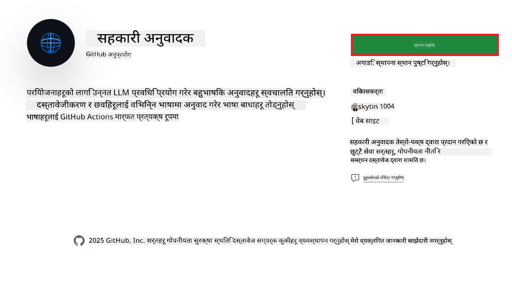
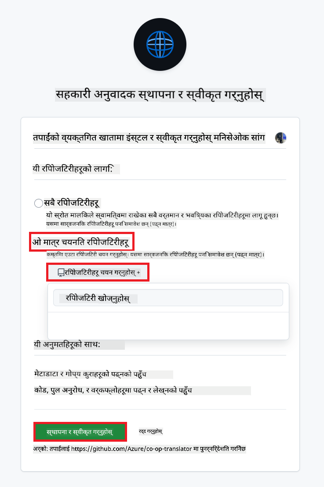
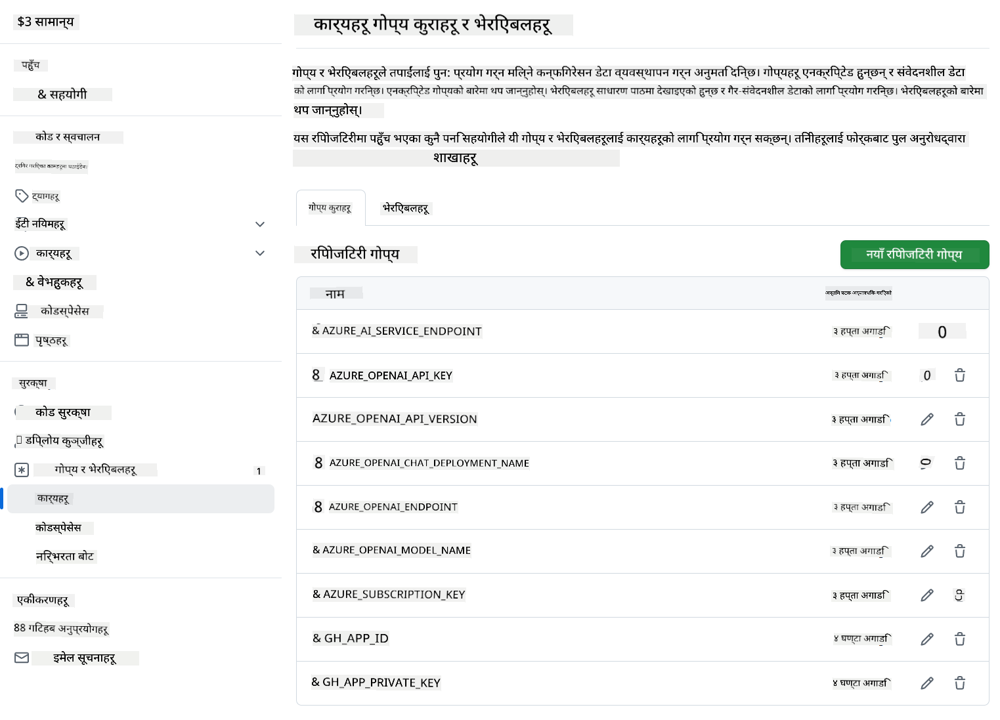

<!--
CO_OP_TRANSLATOR_METADATA:
{
  "original_hash": "c437820027c197f25fb2cbee95bae28c",
  "translation_date": "2025-06-12T19:06:51+00:00",
  "source_file": "getting_started/github-actions-guide/github-actions-guide-org.md",
  "language_code": "ne"
}
-->
# Co-op Translator GitHub Action प्रयोग गर्ने तरिका (संस्था मार्गदर्शन)

**लक्षित दर्शक:** यो मार्गदर्शन **Microsoft का आन्तरिक प्रयोगकर्ता** वा **पूर्वनिर्मित Co-op Translator GitHub App को आवश्यक प्रमाणपत्रहरू पहुँच भएको टोलीहरू** वा आफ्नै कस्टम GitHub App बनाउन सक्ने टोलीहरूका लागि हो।

तपाईंको रिपोजिटोरीको दस्तावेजीकरणको अनुवाद सजिलै स्वचालित गर्न Co-op Translator GitHub Action प्रयोग गर्नुहोस्। यो मार्गदर्शनले तपाईंलाई सोर्स Markdown फाइलहरू वा तस्बिरहरू परिवर्तन हुँदा स्वतः अनुवाद अपडेट गरी Pull Request सिर्जना गर्ने तरिका देखाउँछ।

> [!IMPORTANT]
> 
> **सही मार्गदर्शन छान्नुहोस्:**
>
> यो मार्गदर्शन **GitHub App ID र Private Key** प्रयोग गरेर सेटअप गर्ने प्रक्रिया वर्णन गर्दछ। तपाईंलाई यो "संस्था मार्गदर्शन" विधि चाहिन्छ यदि: **`GITHUB_TOKEN` अनुमतिहरू सीमित छन्:** तपाईंको संस्था वा रिपोजिटोरी सेटिङहरूले डिफल्ट `GITHUB_TOKEN` लाई दिइने अनुमतिहरूमा प्रतिबन्ध लगाएको छ। विशेषगरी, यदि `GITHUB_TOKEN` लाई आवश्यक `write` अनुमतिहरू (जस्तै `contents: write` वा `pull-requests: write`) अनुमति छैन भने, [Public Setup Guide](./github-actions-guide-public.md) मा रहेको workflow अनुमति अभावका कारण असफल हुन्छ। स्पष्ट रूपमा अनुमति दिइएको GitHub App प्रयोग गर्दा यो समस्या समाधान हुन्छ।
>
> **यदि माथिको अवस्था तपाईंमा लागू हुँदैन भने:**
>
> तपाईंको रिपोजिटोरीमा मानक `GITHUB_TOKEN` लाई पर्याप्त अनुमति छ भने (अर्थात् तपाईं संस्था प्रतिबन्धले अवरुद्ध हुनुहुन्न भने), कृपया **[Public Setup Guide using GITHUB_TOKEN](./github-actions-guide-public.md)** प्रयोग गर्नुहोस्। सार्वजनिक मार्गदर्शनमा App ID वा Private Key व्यवस्थापन आवश्यक पर्दैन र केवल मानक `GITHUB_TOKEN` र रिपोजिटोरी अनुमति प्रयोग हुन्छ।

## आवश्यकताहरू

GitHub Action कन्फिगर गर्नु अघि, आवश्यक AI सेवा प्रमाणपत्रहरू तयार राख्नुहोस्।

**1. आवश्यक: AI भाषा मोडेल प्रमाणपत्रहरू**  
तपाईंलाई कम्तीमा एक समर्थित भाषा मोडेलको प्रमाणपत्र आवश्यक छ:

- **Azure OpenAI**: Endpoint, API Key, Model/Deployment नामहरू, API संस्करण आवश्यक छ।  
- **OpenAI**: API Key आवश्यक छ, (वैकल्पिक: Org ID, Base URL, Model ID)।  
- थप विवरणका लागि [Supported Models and Services](../../../../README.md) हेर्नुहोस्।  
- सेटअप मार्गदर्शन: [Azure OpenAI सेटअप](../set-up-resources/set-up-azure-openai.md)।

**2. वैकल्पिक: कम्प्युटर भिजन प्रमाणपत्रहरू (तस्बिर अनुवादका लागि)**

- तपाईंलाई तस्बिरभित्रको पाठ अनुवाद गर्न आवश्यक भए मात्र।  
- **Azure Computer Vision**: Endpoint र Subscription Key आवश्यक।  
- नदिएमा, यो Action [Markdown-only मोड](../markdown-only-mode.md) मा चल्नेछ।  
- सेटअप मार्गदर्शन: [Azure Computer Vision सेटअप](../set-up-resources/set-up-azure-computer-vision.md)।

## सेटअप र कन्फिगरेसन

तपाईंको रिपोजिटोरीमा Co-op Translator GitHub Action कन्फिगर गर्न यी चरणहरू पालना गर्नुहोस्:

### चरण 1: GitHub App Authentication इन्स्टल र कन्फिगर गर्नुहोस्

यो workflow ले GitHub App authentication प्रयोग गरी तपाईंको रिपोजिटोरीसँग सुरक्षित रूपमा अन्तरक्रिया गर्छ (जस्तै Pull Request सिर्जना)। एउटा विकल्प छान्नुहोस्:

#### **विकल्प A: पूर्वनिर्मित Co-op Translator GitHub App इन्स्टल गर्नुहोस् (Microsoft आन्तरिक प्रयोगका लागि)**

1. [Co-op Translator GitHub App](https://github.com/apps/co-op-translator) पृष्ठमा जानुहोस्।

1. **Install** चयन गरी तपाईंको लक्षित रिपोजिटोरी रहेको खाता वा संगठन छान्नुहोस्।

    

1. **Only select repositories** छान्नुहोस् र तपाईंको लक्षित रिपोजिटोरी (जस्तै `PhiCookBook`) चयन गरी **Install** थिच्नुहोस्। तपाईंलाई प्रमाणीकरण गर्न भनिन सक्छ।

    

1. **App प्रमाणपत्र प्राप्त गर्नुहोस् (आन्तरिक प्रक्रिया आवश्यक):** workflow लाई App को रूपमा प्रमाणित गर्न, Co-op Translator टोलीबाट दुई जानकारीहरू आवश्यक छन्:  
  - **App ID:** Co-op Translator App को अनन्य पहिचानकर्ता। App ID: `1164076`।  
  - **Private Key:** `.pem` नामक निजी कुञ्जी फाइलको **पूर्ण सामग्री** प्राप्त गर्नुहोस्। यो कुञ्जीलाई पासवर्डझैं सुरक्षित राख्नुहोस्।

1. चरण 2 मा जानुहोस्।

#### **विकल्प B: आफ्नै कस्टम GitHub App प्रयोग गर्नुहोस्**

- तपाईंले चाहनु भएमा आफ्नै GitHub App सिर्जना र कन्फिगर गर्न सक्नुहुन्छ। यसले Contents र Pull requests मा Read & write पहुँच हुनुपर्छ। App ID र Private Key आवश्यक हुनेछ।

### चरण 2: रिपोजिटोरी सिक्रेटहरू कन्फिगर गर्नुहोस्

GitHub App प्रमाणपत्र र AI सेवा प्रमाणपत्रहरूलाई तपाईंको रिपोजिटोरी सेटिङमा इन्क्रिप्टेड सिक्रेटको रूपमा थप्नुहोस्।

1. तपाईंको लक्षित GitHub रिपोजिटोरी (जस्तै `PhiCookBook`) मा जानुहोस्।

1. **Settings** > **Secrets and variables** > **Actions** मा जानुहोस्।

1. **Repository secrets** अन्तर्गत, तल उल्लेखित प्रत्येक सिक्रेटका लागि **New repository secret** थिच्नुहोस्।

   

**आवश्यक सिक्रेटहरू (GitHub App Authentication का लागि):**

| सिक्रेट नाम           | विवरण                                    | मान स्रोत                                  |
| :------------------- | :--------------------------------------- | :----------------------------------------- |
| `GH_APP_ID`         | GitHub App को App ID (चरण 1 बाट)          | GitHub App सेटिङ्स                         |
| `GH_APP_PRIVATE_KEY` | डाउनलोड गरिएको `.pem` फाइलको **पूर्ण सामग्री** | `.pem` फाइल (चरण 1 बाट)         |

**AI सेवा सिक्रेटहरू (आवश्यकता अनुसार सबै थप्नुहोस्):**

| सिक्रेट नाम                      | विवरण                                 | मान स्रोत                           |
| :------------------------------ | :------------------------------------ | :---------------------------------- |
| `AZURE_SUBSCRIPTION_KEY`           | Azure AI सेवा (Computer Vision) को कुञ्जी | Azure AI Foundry                    |
| `AZURE_AI_SERVICE_ENDPOINT`           | Azure AI सेवा (Computer Vision) को Endpoint | Azure AI Foundry                    |
| `AZURE_OPENAI_API_KEY`           | Azure OpenAI सेवा को कुञ्जी              | Azure AI Foundry                    |
| `AZURE_OPENAI_ENDPOINT`           | Azure OpenAI सेवा को Endpoint           | Azure AI Foundry                    |
| `AZURE_OPENAI_MODEL_NAME`           | तपाईंको Azure OpenAI मोडेल नाम          | Azure AI Foundry                    |
| `AZURE_OPENAI_CHAT_DEPLOYMENT_NAME`           | तपाईंको Azure OpenAI Deployment नाम     | Azure AI Foundry                    |
| `AZURE_OPENAI_API_VERSION`           | Azure OpenAI को API संस्करण             | Azure AI Foundry                    |
| `OPENAI_API_KEY`           | OpenAI को API Key                       | OpenAI Platform                    |
| `OPENAI_ORG_ID`           | OpenAI संस्था ID                        | OpenAI Platform                    |
| `OPENAI_CHAT_MODEL_ID`           | विशिष्ट OpenAI मोडेल ID                 | OpenAI Platform                    |
| `OPENAI_BASE_URL`           | कस्टम OpenAI API Base URL               | OpenAI Platform                    |



### चरण 3: Workflow फाइल सिर्जना गर्नुहोस्

अन्तमा, स्वचालित workflow परिभाषित गर्ने YAML फाइल सिर्जना गर्नुहोस्।

1. तपाईंको रिपोजिटोरीको रुट डाइरेक्टरीमा, यदि छैन भने `.github/workflows/` डाइरेक्टरी बनाउनुहोस्।

1. `.github/workflows/` भित्र `co-op-translator.yml` नामक फाइल बनाउनुहोस्।

1. तलको सामग्री co-op-translator.yml मा टाँस्नुहोस्।

```
name: Co-op Translator

on:
  push:
    branches:
      - main

jobs:
  co-op-translator:
    runs-on: ubuntu-latest

    permissions:
      contents: write
      pull-requests: write

    steps:
      - name: Checkout repository
        uses: actions/checkout@v4
        with:
          fetch-depth: 0

      - name: Set up Python
        uses: actions/setup-python@v4
        with:
          python-version: '3.10'

      - name: Install Co-op Translator
        run: |
          python -m pip install --upgrade pip
          pip install co-op-translator

      - name: Run Co-op Translator
        env:
          PYTHONIOENCODING: utf-8
          # Azure AI Service Credentials
          AZURE_SUBSCRIPTION_KEY: ${{ secrets.AZURE_SUBSCRIPTION_KEY }}
          AZURE_AI_SERVICE_ENDPOINT: ${{ secrets.AZURE_AI_SERVICE_ENDPOINT }}

          # Azure OpenAI Credentials
          AZURE_OPENAI_API_KEY: ${{ secrets.AZURE_OPENAI_API_KEY }}
          AZURE_OPENAI_ENDPOINT: ${{ secrets.AZURE_OPENAI_ENDPOINT }}
          AZURE_OPENAI_MODEL_NAME: ${{ secrets.AZURE_OPENAI_MODEL_NAME }}
          AZURE_OPENAI_CHAT_DEPLOYMENT_NAME: ${{ secrets.AZURE_OPENAI_CHAT_DEPLOYMENT_NAME }}
          AZURE_OPENAI_API_VERSION: ${{ secrets.AZURE_OPENAI_API_VERSION }}

          # OpenAI Credentials
          OPENAI_API_KEY: ${{ secrets.OPENAI_API_KEY }}
          OPENAI_ORG_ID: ${{ secrets.OPENAI_ORG_ID }}
          OPENAI_CHAT_MODEL_ID: ${{ secrets.OPENAI_CHAT_MODEL_ID }}
          OPENAI_BASE_URL: ${{ secrets.OPENAI_BASE_URL }}
        run: |
          # =====================================================================
          # IMPORTANT: Set your target languages here (REQUIRED CONFIGURATION)
          # =====================================================================
          # Example: Translate to Spanish, French, German. Add -y to auto-confirm.
          translate -l "es fr de" -y  # <--- MODIFY THIS LINE with your desired languages

      - name: Authenticate GitHub App
        id: generate_token
        uses: tibdex/github-app-token@v1
        with:
          app_id: ${{ secrets.GH_APP_ID }}
          private_key: ${{ secrets.GH_APP_PRIVATE_KEY }}

      - name: Create Pull Request with translations
        uses: peter-evans/create-pull-request@v5
        with:
          token: ${{ steps.generate_token.outputs.token }}
          commit-message: "🌐 Update translations via Co-op Translator"
          title: "🌐 Update translations via Co-op Translator"
          body: |
            This PR updates translations for recent changes to the main branch.

            ### 📋 Changes included
            - Translated contents are available in the `translations/` directory
            - Translated images are available in the `translated_images/` directory

            ---
            🌐 Automatically generated by the [Co-op Translator](https://github.com/Azure/co-op-translator) GitHub Action.
          branch: update-translations
          base: main
          labels: translation, automated-pr
          delete-branch: true
          add-paths: |
            translations/
            translated_images/

```

4. **Workflow अनुकूलन गर्नुहोस्:**  
  - **[!IMPORTANT] लक्षित भाषाहरू:** `Run Co-op Translator` step, you **MUST review and modify the list of language codes** within the `translate -l "..." -y` command to match your project's requirements. The example list (`ar de es...`) needs to be replaced or adjusted.
  - **Trigger (`on:`):** The current trigger runs on every push to `main`. For large repositories, consider adding a `paths:` filter (see commented example in the YAML) to run the workflow only when relevant files (e.g., source documentation) change, saving runner minutes.
  - **PR Details:** Customize the `commit-message`, `title`, `body`, `branch` name, and `labels` in the `Create Pull Request` step if needed.

## Credential Management and Renewal

- **Security:** Always store sensitive credentials (API keys, private keys) as GitHub Actions secrets. Never expose them in your workflow file or repository code.
- **[!IMPORTANT] Key Renewal (Internal Microsoft Users):** Be aware that Azure OpenAI key used within Microsoft might have a mandatory renewal policy (e.g., every 5 months). Ensure you update the corresponding GitHub secrets (`AZURE_OPENAI_...` कुञ्जीहरूमा **समयावधि समाप्त हुनु अघि** आवश्यक भाषाहरू थप्नुहोस्, ताकि workflow असफल नहोस्।

## Workflow चलाउने तरिका

जब `co-op-translator.yml` फाइल तपाईंको मुख्य शाखामा (वा `on:` trigger), the workflow will automatically run whenever changes are pushed to that branch (and match the `paths` फिल्टरमा निर्दिष्ट शाखामा) मर्ज हुन्छ,

यदि अनुवादहरू सिर्जना वा अपडेट भए, Action ले स्वतः परिवर्तनहरू सहित Pull Request बनाउनेछ, जुन तपाईंले समीक्षा गरी मर्ज गर्न सक्नुहुन्छ।

**अस्वीकरण**:  
यो दस्तावेज़ AI अनुवाद सेवा [Co-op Translator](https://github.com/Azure/co-op-translator) प्रयोग गरी अनुवाद गरिएको हो। हामी शुद्धताको प्रयास गर्छौं, तर कृपया जानकार रहनुहोस् कि स्वचालित अनुवादमा त्रुटिहरू वा अशुद्धता हुन सक्छ। मूल दस्तावेज़ यसको स्वदेशी भाषामा आधिकारिक स्रोत मानिनु पर्छ। महत्वपूर्ण जानकारीका लागि व्यावसायिक मानव अनुवाद सिफारिस गरिन्छ। यस अनुवादको प्रयोगबाट उत्पन्न कुनै पनि गलतफहमी वा गलत व्याख्याका लागि हामी जिम्मेवार छैनौं।