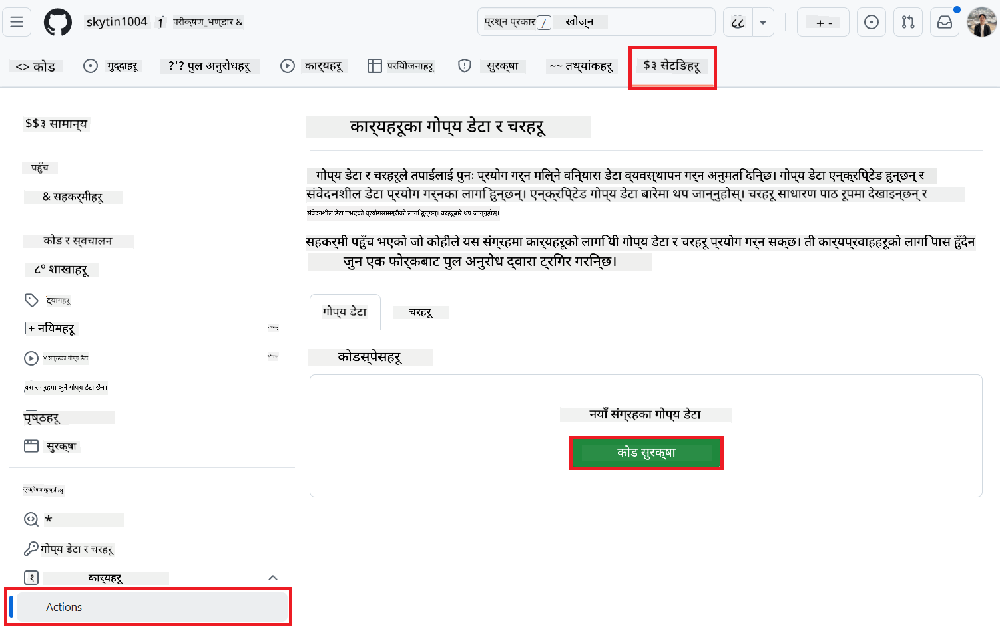

<!--
CO_OP_TRANSLATOR_METADATA:
{
  "original_hash": "a52587a512e667f70d92db853d3c61d5",
  "translation_date": "2025-06-12T19:26:14+00:00",
  "source_file": "getting_started/github-actions-guide/github-actions-guide-public.md",
  "language_code": "ne"
}
-->
# Co-op Translator GitHub Action प्रयोग गर्ने तरिका (सार्वजनिक सेटअप)

**लक्षित दर्शक:** यो मार्गदर्शन अधिकांश सार्वजनिक वा निजी रिपोजिटोरीहरूका प्रयोगकर्ताहरूका लागि हो जहाँ सामान्य GitHub Actions अनुमति पर्याप्त हुन्छ। यसले बिल्ट-इन `GITHUB_TOKEN` प्रयोग गर्छ।

आफ्नो रिपोजिटोरीको दस्तावेजीकरणको अनुवाद स्वचालित रूपमा गर्न Co-op Translator GitHub Action प्रयोग गर्नुहोस्। यो मार्गदर्शनले तपाईँलाई सोर्स Markdown फाइलहरू वा तस्बिरहरू परिवर्तन हुँदा स्वतः अपडेट गरिएको अनुवादसहित पुल अनुरोधहरू कसरी बनाउने भनेर देखाउँछ।

> [!IMPORTANT]
>
> **सही मार्गदर्शन छनोट गर्ने तरिका:**
>
> यो मार्गदर्शनले **सामान्य `GITHUB_TOKEN` प्रयोग गरी सजिलो सेटअप** को विवरण दिन्छ। अधिकांश प्रयोगकर्ताका लागि यो सिफारिस गरिएको तरिका हो किनभने यसले संवेदनशील GitHub App Private Keys व्यवस्थापन गर्न आवश्यक पर्दैन।
>

## पूर्वापेक्षाहरू

GitHub Action कन्फिगर गर्नु अघि, आवश्यक AI सेवा प्रमाणपत्रहरू तयार राख्नुहोस्।

**1. आवश्यक: AI भाषा मोडेल प्रमाणपत्रहरू**  
तपाईँलाई कम्तीमा एक समर्थित भाषा मोडेलका लागि प्रमाणपत्र चाहिन्छ:

- **Azure OpenAI**: Endpoint, API Key, Model/Deployment Names, API Version आवश्यक।
- **OpenAI**: API Key आवश्यक, (वैकल्पिक: Org ID, Base URL, Model ID)।
- विस्तृत जानकारीका लागि [Supported Models and Services](../../../../README.md) हेर्नुहोस्।

**2. वैकल्पिक: AI Vision प्रमाणपत्रहरू (तस्बिर अनुवादका लागि)**

- तस्बिर भित्रको पाठ अनुवाद गर्न आवश्यक परे मात्र।
- **Azure AI Vision**: Endpoint र Subscription Key आवश्यक।
- नदिएमा, यो Action [Markdown-only mode](../markdown-only-mode.md) मा चल्नेछ।

## सेटअप र कन्फिगरेसन

तपाईँको रिपोजिटोरीमा सामान्य `GITHUB_TOKEN` प्रयोग गरी Co-op Translator GitHub Action कन्फिगर गर्न तलका चरणहरू पालना गर्नुहोस्।

### चरण १: प्रमाणीकरण बुझ्नुहोस् (`GITHUB_TOKEN` प्रयोग गरी)

यो वर्कफ्लो GitHub Actions द्वारा प्रदान गरिएको बिल्ट-इन `GITHUB_TOKEN` प्रयोग गर्छ। यो टोकनले तपाईँको रिपोजिटोरीसँग सम्बन्धित कार्यहरू गर्न अनुमति दिन्छ जुन तपाईँले **चरण ३** मा सेट गरेको सेटिङ्स अनुसार हुन्छ।

### चरण २: रिपोजिटोरी सीक्रेटहरू कन्फिगर गर्नुहोस्

तपाईँले आफ्नो **AI सेवा प्रमाणपत्रहरू** लाई रिपोजिटोरी सेटिङ्समा इन्क्रिप्टेड सीक्रेटको रूपमा मात्र थप्नुपर्नेछ।

1. तपाईँको लक्षित GitHub रिपोजिटोरीमा जानुहोस्।  
2. **Settings** > **Secrets and variables** > **Actions** मा जानुहोस्।  
3. **Repository secrets** अन्तर्गत, प्रत्येक आवश्यक AI सेवा सीक्रेटका लागि **New repository secret** क्लिक गर्नुहोस्।

     *(छवि सन्दर्भ: सीक्रेटहरू कहाँ थप्ने देखाउँछ)*

**आवश्यक AI सेवा सीक्रेटहरू (आफ्ना पूर्वापेक्षाहरू अनुसार सबै लागू हुने थप्नुहोस्):**

| सीक्रेट नाम                         | विवरण                                   | मान स्रोत                         |
| :---------------------------------- | :---------------------------------------- | :------------------------------- |
| `AZURE_SUBSCRIPTION_KEY`            | Azure AI सेवा (Computer Vision) को लागि कुञ्जी  | तपाईंको Azure AI Foundry           |
| `AZURE_AI_SERVICE_ENDPOINT`         | Azure AI सेवा (Computer Vision) को Endpoint | तपाईंको Azure AI Foundry           |
| `AZURE_OPENAI_API_KEY`              | Azure OpenAI सेवा को लागि कुञ्जी              | तपाईंको Azure AI Foundry           |
| `AZURE_OPENAI_ENDPOINT`             | Azure OpenAI सेवा को Endpoint                | तपाईंको Azure AI Foundry           |
| `AZURE_OPENAI_MODEL_NAME`           | तपाईंको Azure OpenAI मोडेल नाम              | तपाईंको Azure AI Foundry           |
| `AZURE_OPENAI_CHAT_DEPLOYMENT_NAME` | तपाईंको Azure OpenAI Deployment नाम         | तपाईंको Azure AI Foundry           |
| `AZURE_OPENAI_API_VERSION`          | Azure OpenAI को API संस्करण                  | तपाईंको Azure AI Foundry           |
| `OPENAI_API_KEY`                    | OpenAI को API कुञ्जी                          | तपाईंको OpenAI Platform            |
| `OPENAI_ORG_ID`                     | OpenAI संगठन ID (वैकल्पिक)                   | तपाईंको OpenAI Platform            |
| `OPENAI_CHAT_MODEL_ID`              | OpenAI मोडेल ID (वैकल्पिक)                   | तपाईंको OpenAI Platform            |
| `OPENAI_BASE_URL`                   | कस्टम OpenAI API Base URL (वैकल्पिक)         | तपाईंको OpenAI Platform            |

### चरण ३: वर्कफ्लो अनुमति कन्फिगर गर्नुहोस्

GitHub Action लाई कोड चेकआउट र पुल अनुरोधहरू बनाउन अनुमति दिन `GITHUB_TOKEN` मार्फत अनुमति दिनुपर्छ।

1. तपाईँको रिपोजिटोरीमा जानुहोस्, **Settings** > **Actions** > **General**।  
2. तल स्क्रोल गरी **Workflow permissions** सेक्सनमा जानुहोस्।  
3. **Read and write permissions** चयन गर्नुहोस्। यसले यो वर्कफ्लोका लागि `GITHUB_TOKEN` लाई आवश्यक `contents: write` र `pull-requests: write` अनुमति दिन्छ।  
4. **Allow GitHub Actions to create and approve pull requests** को चेकबक्स अन गर्नुहोस्।  
5. **Save** थिच्नुहोस्।


### चरण ४: वर्कफ्लो फाइल बनाउनुहोस्

अन्तमा, बिल्ट-इन `GITHUB_TOKEN` प्रयोग गरेर स्वचालित वर्कफ्लो परिभाषित गर्ने YAML फाइल बनाउनुहोस्।

1. तपाईँको रिपोजिटोरीको रुट डाइरेक्टरीमा, `.github/workflows/` डाइरेक्टरी छैन भने बनाउनुहोस्।  
2. `.github/workflows/` भित्र, `co-op-translator.yml` नामक फाइल बनाउनुहोस्।  
3. तलको सामग्री `co-op-translator.yml` मा पेस्ट गर्नुहोस्।

```yaml
name: Co-op Translator

on:
  push:
    branches:
      - main

jobs:
  co-op-translator:
    runs-on: ubuntu-latest

    permissions:
      contents: write
      pull-requests: write

    steps:
      - name: Checkout repository
        uses: actions/checkout@v4
        with:
          fetch-depth: 0

      - name: Set up Python
        uses: actions/setup-python@v4
        with:
          python-version: '3.10'

      - name: Install Co-op Translator
        run: |
          python -m pip install --upgrade pip
          pip install co-op-translator

      - name: Run Co-op Translator
        env:
          PYTHONIOENCODING: utf-8
          # === AI Service Credentials ===
          AZURE_SUBSCRIPTION_KEY: ${{ secrets.AZURE_SUBSCRIPTION_KEY }}
          AZURE_AI_SERVICE_ENDPOINT: ${{ secrets.AZURE_AI_SERVICE_ENDPOINT }}
          AZURE_OPENAI_API_KEY: ${{ secrets.AZURE_OPENAI_API_KEY }}
          AZURE_OPENAI_ENDPOINT: ${{ secrets.AZURE_OPENAI_ENDPOINT }}
          AZURE_OPENAI_MODEL_NAME: ${{ secrets.AZURE_OPENAI_MODEL_NAME }}
          AZURE_OPENAI_CHAT_DEPLOYMENT_NAME: ${{ secrets.AZURE_OPENAI_CHAT_DEPLOYMENT_NAME }}
          AZURE_OPENAI_API_VERSION: ${{ secrets.AZURE_OPENAI_API_VERSION }}
          OPENAI_API_KEY: ${{ secrets.OPENAI_API_KEY }}
          OPENAI_ORG_ID: ${{ secrets.OPENAI_ORG_ID }}
          OPENAI_CHAT_MODEL_ID: ${{ secrets.OPENAI_CHAT_MODEL_ID }}
          OPENAI_BASE_URL: ${{ secrets.OPENAI_BASE_URL }}
        run: |
          # =====================================================================
          # IMPORTANT: Set your target languages here (REQUIRED CONFIGURATION)
          # =====================================================================
          # Example: Translate to Spanish, French, German. Add -y to auto-confirm.
          translate -l "es fr de" -y  # <--- MODIFY THIS LINE with your desired languages

      - name: Create Pull Request with translations
        uses: peter-evans/create-pull-request@v5
        with:
          token: ${{ secrets.GITHUB_TOKEN }}
          commit-message: "🌐 Update translations via Co-op Translator"
          title: "🌐 Update translations via Co-op Translator"
          body: |
            This PR updates translations for recent changes to the main branch.

            ### 📋 Changes included
            - Translated contents are available in the `translations/` directory
            - Translated images are available in the `translated_images/` directory

            ---
            🌐 Automatically generated by the [Co-op Translator](https://github.com/Azure/co-op-translator) GitHub Action.
          branch: update-translations
          base: main
          labels: translation, automated-pr
          delete-branch: true
          add-paths: |
            translations/
            translated_images/
```  
4. **वर्कफ्लो अनुकूलन गर्नुहोस्:**  
  - **[!IMPORTANT] लक्षित भाषा:** `Run Co-op Translator` step, you **MUST review and modify the list of language codes** within the `translate -l "..." -y` command to match your project's requirements. The example list (`ar de es...`) needs to be replaced or adjusted.
  - **Trigger (`on:`):** The current trigger runs on every push to `main`. For large repositories, consider adding a `paths:` filter (see commented example in the YAML) to run the workflow only when relevant files (e.g., source documentation) change, saving runner minutes.
  - **PR Details:** Customize the `commit-message`, `title`, `body`, `branch` name, and `labels` in the `Create Pull Request` चरणमा आवश्यक परे परिवर्तन गर्नुहोस्।

**अस्वीकरण**:  
यस दस्तावेजलाई AI अनुवाद सेवा [Co-op Translator](https://github.com/Azure/co-op-translator) प्रयोग गरी अनुवाद गरिएको हो। हामी शुद्धताको प्रयास गर्छौं भने पनि, कृपया ध्यान दिनुहोस् कि स्वचालित अनुवादमा त्रुटि वा अशुद्धता हुन सक्दछ। मूल दस्तावेज यसको स्वदेशी भाषामा नै अधिकारिक स्रोत मानिनेछ। महत्वपूर्ण जानकारीको लागि व्यावसायिक मानव अनुवाद सिफारिस गरिन्छ। यस अनुवादको प्रयोगबाट उत्पन्न कुनै पनि गलतफहमी वा गलत व्याख्याका लागि हामी जिम्मेवार हुने छैनौं।