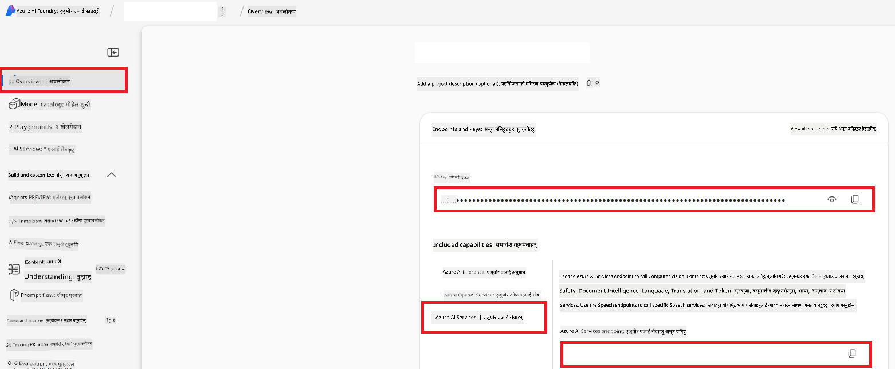

<!--
CO_OP_TRANSLATOR_METADATA:
{
  "original_hash": "b58d7c3cb4210697a073d20eb3064945",
  "translation_date": "2025-06-12T11:50:21+00:00",
  "source_file": "getting_started/set-up-azure-ai.md",
  "language_code": "ne"
}
-->
# Azure AI को-अप अनुवादक (Azure OpenAI & Azure AI Vision) सेट अप गर्ने तरिका

यो गाइडले तपाईंलाई Azure AI Foundry भित्र भाषा अनुवादका लागि Azure OpenAI र छवि आधारित अनुवादका लागि Azure Computer Vision सेट अप गर्ने प्रक्रिया देखाउँछ।

**पूर्व आवश्यकताहरू:**
- सक्रिय सदस्यता भएको Azure खाता।
- Azure सदस्यतामा स्रोत र डिप्लोयमेन्टहरू सिर्जना गर्ने पर्याप्त अनुमति।

## Azure AI प्रोजेक्ट बनाउने

तपाईं Azure AI प्रोजेक्ट सिर्जना गरेर सुरु गर्नुहुनेछ, जुन तपाईंका AI स्रोतहरू व्यवस्थापन गर्ने केन्द्र हो।

1. [https://ai.azure.com](https://ai.azure.com) मा जानुहोस् र आफ्नो Azure खाताबाट साइन इन गर्नुहोस्।

1. नयाँ प्रोजेक्ट बनाउन **+Create** छान्नुहोस्।

1. तलका कामहरू गर्नुहोस्:
   - **Project name** प्रविष्ट गर्नुहोस् (जस्तै, `CoopTranslator-Project`)।
   - **AI hub** छान्नुहोस् (जस्तै, `CoopTranslator-Hub`) (आवश्यक परे नयाँ बनाउनुहोस्)।

1. "**Review and Create**" क्लिक गरेर प्रोजेक्ट सेट अप गर्नुहोस्। तपाईंलाई प्रोजेक्टको अवलोकन पृष्ठमा लगिनेछ।

## भाषा अनुवादका लागि Azure OpenAI सेट अप गर्ने

तपाईंको प्रोजेक्ट भित्र, तपाईंले टेक्स्ट अनुवादको ब्याकएन्डको रूपमा Azure OpenAI मोडेल डिप्लोय गर्नुहुनेछ।

### आफ्नो प्रोजेक्टमा जानुहोस्

यदि पहिले नै छैन भने, Azure AI Foundry मा आफ्नो नयाँ प्रोजेक्ट (जस्तै, `CoopTranslator-Project`) खोल्नुहोस्।

### OpenAI मोडेल डिप्लोय गर्ने

1. प्रोजेक्टको बाँया मेनुमा "My assets" अन्तर्गत "**Models + endpoints**" छान्नुहोस्।

1. **+ Deploy model** छान्नुहोस्।

1. **Deploy Base Model** छान्नुहोस्।

1. उपलब्ध मोडेलहरूको सूची देखिनेछ। उपयुक्त GPT मोडेल खोज्नुहोस् वा फिल्टर गर्नुहोस्। हामीले सिफारिस गर्ने मोडेल `gpt-4o` हो।

1. मनपरेको मोडेल छान्नुहोस् र **Confirm** क्लिक गर्नुहोस्।

1. **Deploy** छान्नुहोस्।

### Azure OpenAI कन्फिगरेसन

डिप्लोय भएपछि, तपाईं "**Models + endpoints**" पृष्ठबाट डिप्लोयमेन्ट छान्न सक्नुहुन्छ जहाँ यसको **REST endpoint URL**, **Key**, **Deployment name**, **Model name** र **API version** प्राप्त गर्न सकिन्छ। यी तपाईँको अनुप्रयोगमा अनुवाद मोडेल एकीकरण गर्न आवश्यक हुन्छ।

> [!NOTE]
> तपाईं आफ्नो आवश्यकताअनुसार [API version deprecation](https://learn.microsoft.com/azure/ai-services/openai/api-version-deprecation) पृष्ठबाट API संस्करण छान्न सक्नुहुन्छ। ध्यान दिनुहोस् कि **API version** Azure AI Foundry को **Models + endpoints** पृष्ठमा देखिने **Model version** भन्दा फरक हुन्छ।

## छवि अनुवादका लागि Azure Computer Vision सेट अप गर्ने

तस्विर भित्रको पाठ अनुवाद सक्षम बनाउन, तपाईंले Azure AI Service को API Key र Endpoint पत्ता लगाउन आवश्यक छ।

1. आफ्नो Azure AI प्रोजेक्ट (जस्तै, `CoopTranslator-Project`) मा जानुहोस्। प्रोजेक्टको अवलोकन पृष्ठमा हुनुहोस्।

### Azure AI Service कन्फिगरेसन

Azure AI Service बाट API Key र Endpoint पत्ता लगाउनुहोस्।

1. आफ्नो Azure AI प्रोजेक्ट (जस्तै, `CoopTranslator-Project`) मा जानुहोस्। प्रोजेक्टको अवलोकन पृष्ठमा हुनुहोस्।

1. Azure AI Service ट्याबबाट **API Key** र **Endpoint** खोज्नुहोस्।

    

यो कनेक्शनले लिंक गरिएको Azure AI Services स्रोतको क्षमता (जसमा छवि विश्लेषण पनि समावेश छ) तपाईंको AI Foundry प्रोजेक्टमा उपलब्ध गराउँछ। तपाईं यस कनेक्शनलाई नोटबुक वा अनुप्रयोगहरूमा प्रयोग गरेर छविबाट पाठ निकाल्न सक्नुहुन्छ, जुन पछि Azure OpenAI मोडेलमा अनुवादका लागि पठाउन सकिन्छ।

## तपाईंका प्रमाणपत्रहरू समेट्ने

अहिलेसम्म तपाईंले तलका जानकारीहरू संकलन गरिसक्नुभएको हुनुपर्छ:

**Azure OpenAI (टेक्स्ट अनुवाद) का लागि:**
- Azure OpenAI Endpoint
- Azure OpenAI API Key
- Azure OpenAI Model Name (जस्तै, `gpt-4o`)
- Azure OpenAI Deployment Name (जस्तै, `cooptranslator-gpt4o`)
- Azure OpenAI API Version

**Azure AI Services (दृश्य मार्फत छवि पाठ निकाल्ने) का लागि:**
- Azure AI Service Endpoint
- Azure AI Service API Key

### उदाहरण: वातावरण चर कन्फिगरेसन (प्रिभ्यु)

पछाडि, जब तपाईं आफ्नो अनुप्रयोग निर्माण गर्नुहुन्छ, तपाईंले यी प्रमाणपत्रहरू वातावरण चरहरूका रूपमा सेट गर्न सक्नुहुन्छ, जस्तै:

```bash
# Azure AI Service Credentials (Required for image translation)
AZURE_AI_SERVICE_API_KEY="your_azure_ai_service_api_key" # e.g., 21xasd...
AZURE_AI_SERVICE_ENDPOINT="https://your_azure_ai_service_endpoint.cognitiveservices.azure.com/"

# Azure OpenAI Credentials (Required for text translation)
AZURE_OPENAI_API_KEY="your_azure_openai_api_key" # e.g., 21xasd...
AZURE_OPENAI_ENDPOINT="https://your_azure_openai_endpoint.openai.azure.com/"
AZURE_OPENAI_MODEL_NAME="your_model_name" # e.g., gpt-4o
AZURE_OPENAI_CHAT_DEPLOYMENT_NAME="your_deployment_name" # e.g., cooptranslator-gpt4o
AZURE_OPENAI_API_VERSION="your_api_version" # e.g., 2024-12-01-preview
```

---

### थप पढ्नका लागि

- [Azure AI Foundry मा प्रोजेक्ट कसरी बनाउने](https://learn.microsoft.com/azure/ai-foundry/how-to/create-projects?tabs=ai-studio)
- [Azure AI स्रोतहरू कसरी बनाउने](https://learn.microsoft.com/azure/ai-foundry/how-to/create-azure-ai-resource?tabs=portal)
- [Azure AI Foundry मा OpenAI मोडेलहरू कसरी डिप्लोय गर्ने](https://learn.microsoft.com/en-us/azure/ai-foundry/how-to/deploy-models-openai)

**अस्वीकरण**:  
यो दस्तावेज AI अनुवाद सेवा [Co-op Translator](https://github.com/Azure/co-op-translator) प्रयोग गरी अनुवाद गरिएको हो। हामी शुद्धताका लागि प्रयासरत छौं, तर कृपया जान्नुहोस् कि स्वचालित अनुवादमा त्रुटि वा अशुद्धता हुन सक्छ। मूल दस्तावेज यसको मूल भाषामा नै आधिकारिक स्रोत मान्नुपर्छ। महत्वपूर्ण जानकारीको लागि पेशेवर मानव अनुवाद सिफारिस गरिन्छ। यस अनुवादको प्रयोगबाट उत्पन्न कुनै पनि गलतफहमी वा गलत व्याख्याको लागि हामी जिम्मेवार छैनौं।