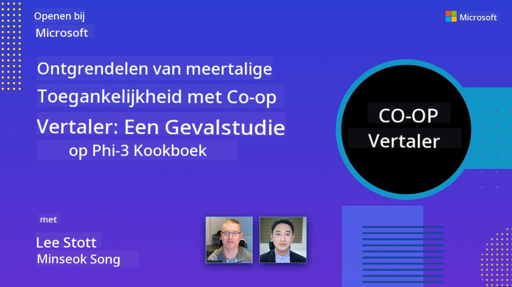

<!--
CO_OP_TRANSLATOR_METADATA:
{
  "original_hash": "044724537b57868117aadae8e7728c7c",
  "translation_date": "2025-06-12T10:37:01+00:00",
  "source_file": "README.md",
  "language_code": "nl"
}
-->


# Co-op Translator: Automatiseer moeiteloos het vertalen van educatieve documentatie

_Vertaal je documentatie eenvoudig automatisch naar meerdere talen om een wereldwijd publiek te bereiken._

[](https://pypi.org/project/co-op-translator/)
[](https://github.com/azure/co-op-translator/blob/main/LICENSE)
[](https://pepy.tech/project/co-op-translator)
[](https://pepy.tech/project/co-op-translator)
[](https://github.com/psf/black)

[](https://GitHub.com/azure/co-op-translator/graphs/contributors/)
[](https://GitHub.com/azure/co-op-translator/issues/)
[](https://GitHub.com/azure/co-op-translator/pulls/)
[](http://makeapullrequest.com)

### Taalondersteuning mogelijk gemaakt door Co-op Translator

> [!NOTE]
> Dit zijn de huidige vertalingen van de inhoud van deze repository. Voor een volledige lijst van talen die door Co-op Translator worden ondersteund, zie de sectie [Language Support](../..).

[](https://GitHub.com/azure/co-op-translator/watchers/)
[](https://GitHub.com/azure/co-op-translator/network/)
[](https://GitHub.com/azure/co-op-translator/stargazers/)

[](https://discord.com/invite/ByRwuEEgH4)

[](https://codespaces.new/azure/co-op-translator)
[](https://vscode.dev/redirect?url=vscode://ms-vscode-remote.remote-containers/cloneInVolume?url=https://github.com/azure/co-op-translator)

## Overzicht: Versnel het vertalen van je educatieve content

Taalbarrières belemmeren wereldwijd de toegang tot waardevolle educatieve bronnen en technische kennis voor studenten en ontwikkelaars. Dit beperkt de deelname en vertraagt het tempo van wereldwijde innovatie en leren.

**Co-op Translator** is ontstaan vanuit de behoefte om het inefficiënte handmatige vertaalproces van Microsofts eigen grootschalige educatieve series (zoals de "For Beginners" gidsen) te verbeteren. Het is uitgegroeid tot een gebruiksvriendelijke, krachtige tool die deze barrières voor iedereen helpt te doorbreken. Door hoogwaardige automatische vertalingen te bieden via CLI en GitHub Actions, stelt Co-op Translator docenten, studenten, onderzoekers en ontwikkelaars wereldwijd in staat kennis te delen en te benutten zonder taalbeperkingen.

Bekijk hoe Co-op Translator vertaalde educatieve content organiseert:


Markdown-bestanden en tekst in afbeeldingen worden automatisch vertaald en netjes georganiseerd in taal-specifieke mappen.

**Maak je educatieve content vandaag nog wereldwijd toegankelijk met Co-op Translator!**

## Wereldwijde toegang ondersteunen voor Microsofts leerbronnen

Co-op Translator helpt de taalbarrière te overbruggen voor belangrijke Microsoft educatieve initiatieven door het vertaalproces te automatiseren voor repositories die een wereldwijde ontwikkelaarscommunity bedienen. Voorbeelden die momenteel Co-op Translator gebruiken zijn:

[](https://github.com/microsoft/Generative-AI-for-beginners)
[](https://github.com/microsoft/ML-For-Beginners)
[](https://github.com/microsoft/AI-For-Beginners)
[](https://github.com/microsoft/ai-agents-for-beginners)
[](https://github.com/microsoft/PhiCookBook)
[](https://github.com/microsoft/Generative-AI-for-beginners-dotnet)

## Belangrijkste functies

- **Automatische vertalingen**: Vertaal tekst moeiteloos naar meerdere talen.
- **Integratie met GitHub Actions**: Automatiseer vertalingen als onderdeel van je CI/CD-pijplijn.
- **Markdown behoud**: Houd de juiste Markdown-syntaxis tijdens het vertalen intact.
- **Vertaling van tekst in afbeeldingen**: Haal tekst uit afbeeldingen en vertaal deze.
- **Geavanceerde LLM-technologie**: Gebruik de nieuwste taalmodellen voor hoogwaardige vertalingen.
- **Eenvoudige integratie**: Naadloos integreren met je bestaande projectopzet.
- **Vereenvoudig lokalisatie**: Maak het proces van lokaliseren voor internationale markten eenvoudiger.

## Hoe het werkt


Co-op Translator haalt Markdown-bestanden en afbeeldingen uit je projectmap en verwerkt deze als volgt:

1. **Tekstextractie**: Haalt tekst uit Markdown-bestanden en, indien geconfigureerd (bijvoorbeeld met Azure AI Vision), ook tekst die in afbeeldingen is ingebed.
1. **AI Vertaling**: Stuurt de geëxtraheerde tekst naar het geconfigureerde LLM (Azure OpenAI, OpenAI, etc.) voor vertaling.
1. **Resultaat opslaan**: Slaat de vertaalde Markdown-bestanden en afbeeldingen (met vertaalde tekst) op in taal-specifieke mappen, waarbij de originele opmaak behouden blijft.

## Aan de slag

Begin snel met de CLI of stel volledige automatisering in met GitHub Actions. Kies de aanpak die het beste bij je workflow past:

1. **Command Line (CLI)** - Voor eenmalige vertalingen of handmatige controle
2. **GitHub Actions** - Voor automatische vertalingen bij elke push

> [!NOTE]
> Hoewel deze handleiding zich richt op Azure-resources, kun je elk ondersteund taalmodel gebruiken.

### Taalondersteuning

Co-op Translator ondersteunt een breed scala aan talen om je te helpen een wereldwijd publiek te bereiken. Dit is wat je moet weten:

#### Snelle referentie

| Taal | Code | Taal | Code | Taal | Code |
|----------|------|----------|------|----------|------|
| Arabisch | ar | Bengaals | bn | Bulgaars | bg |
| Birmees (Myanmar) | my | Chinees (vereenvoudigd) | zh | Chinees (traditioneel, HK) | hk |
| Chinees (traditioneel, Macau) | mo | Chinees (traditioneel, TW) | tw | Kroatisch | hr |
| Tsjechisch | cs | Deens | da | Nederlands | nl |
| Fins | fi | Frans | fr | Duits | de |
| Grieks | el | Hebreeuws | he | Hindi | hi |
| Hongaars | hu | Indonesisch | id | Italiaans | it |
| Japans | ja | Koreaans | ko | Maleis | ms |
| Marathi | mr | Nepalees | ne | Noors | no |
| Perzisch (Farsi) | fa | Pools | pl | Portugees (Brazilië) | br |
| Portugees (Portugal) | pt | Punjabi (Gurmukhi) | pa | Roemeens | ro |
| Russisch | ru | Servisch (Cyrillisch) | sr | Slowaaks | sk |
| Sloveens | sl | Spaans | es | Swahili | sw |
| Zweeds | sv | Tagalog (Filipijns) | tl | Thais | th |
| Turks | tr | Oekraïens | uk | Urdu | ur |
| Vietnamees | vi | — | — | — | — |

#### Gebruik van taalcodes

Bij het gebruik van Co-op Translator moet je talen specificeren met hun codes. Bijvoorbeeld:

```bash
# Translate to French, Spanish, and German
translate -l "fr es de"

# Translate to Chinese (Simplified) and Japanese
translate -l "zh ja"
```

> [!NOTE]
> Voor gedetailleerde technische informatie over taalondersteuning, inclusief:
>
> - Fontspecificaties per taal
> - Bekende problemen
> - Hoe nieuwe talen toe te voegen
>
> Zie onze [Supported Languages Documentation](./getting_started/supported-languages.md).

### Ondersteunde modellen en diensten

| Type                  | Naam                           |
|-----------------------|--------------------------------|
| Language Model        |   |
| AI Vision       |  |

> [!NOTE]
> Als een AI vision-service niet beschikbaar is, schakelt co-op translator automatisch over naar de [Markdown-only mode](./getting_started/markdown-only-mode.md).

### Eerste installatie

Voordat je begint, moet je de volgende resources instellen:

1. Language Model Resource (Vereist):
   - Azure OpenAI (aanbevolen) - Biedt hoogwaardige vertalingen met betrouwbaarheid op ondernemingsniveau
   - OpenAI - Alternatief als je geen toegang hebt tot Azure
   - Voor meer informatie over ondersteunde modellen, zie [Supported Models and Services](../..)

1. AI Vision Resource (Optioneel):
   - Azure AI Vision - Maakt vertaling van tekst binnen afbeeldingen mogelijk
   - Als dit niet is geconfigureerd, gebruikt de translator automatisch de [Markdown-only mode](./getting_started/markdown-only-mode.md)
   - Aanbevolen voor projecten met afbeeldingen die tekst bevatten die vertaald moet worden

1. Configuratiestappen:
   - Volg onze [Azure AI setup guide](./getting_started/set-up-azure-ai.md) voor gedetailleerde instructies
   - Maak een `.env`-bestand aan met je API-sleutels en endpoints (zie de sectie [Quick Start](../..))
   - Zorg dat je de benodigde rechten en quota hebt voor de gekozen diensten

### Projectvoorbereiding voor vertaling

Bereid je project voor op het vertaalproces met de volgende stappen:

1. Bereid je README voor:
   - Voeg een vertalingentabel toe aan je README.md om te linken naar vertaalde versies
   - Voorbeeldformaat:

     ```markdown

     ### 🌐 Multi-Language Support
     
     [French](../fr/README.md) | [Spanish](../es/README.md) | [German](../de/README.md) | [Russian](../ru/README.md) | [Arabic](../ar/README.md) | [Persian (Farsi)](../fa/README.md) | [Urdu](../ur/README.md) | [Chinese (Simplified)](../zh/README.md) | [Chinese (Traditional, Macau)](../mo/README.md) | [Chinese (Traditional, Hong Kong)](../hk/README.md) | [Chinese (Traditional, Taiwan)](../tw/README.md) | [Japanese](../ja/README.md) | [Korean](../ko/README.md) | [Hindi](../hi/README.md) | [Bengali](../bn/README.md) | [Marathi](../mr/README.md) | [Nepali](../ne/README.md) | [Punjabi (Gurmukhi)](../pa/README.md) | [Portuguese (Portugal)](../pt/README.md) | [Portuguese (Brazil)](../br/README.md) | [Italian](../it/README.md) | [Polish](../pl/README.md) | [Turkish](../tr/README.md) | [Greek](../el/README.md) | [Thai](../th/README.md) | [Swedish](../sv/README.md) | [Danish](../da/README.md) | [Norwegian](../no/README.md) | [Finnish](../fi/README.md) | [Dutch](./README.md) | [Hebrew](../he/README.md) | [Vietnamese](../vi/README.md) | [Indonesian](../id/README.md) | [Malay](../ms/README.md) | [Tagalog (Filipino)](../tl/README.md) | [Swahili](../sw/README.md) | [Hungarian](../hu/README.md) | [Czech](../cs/README.md) | [Slovak](../sk/README.md) | [Romanian](../ro/README.md) | [Bulgarian](../bg/README.md) | [Serbian (Cyrillic)](../sr/README.md) | [Croatian](../hr/README.md) | [Slovenian](../sl/README.md) | [Ukrainian](../uk/README.md) | [Burmese (Myanmar)](../my/README.md) 
    
     ```

1. Ruim bestaande vertalingen op (indien nodig):
   - Verwijder eventuele bestaande vertaalmappen (bijv. `translations/`)
   - Verwijder oude vertaalbestanden om met een schone lei te beginnen
   - Dit voorkomt conflicten met het nieuwe vertaalproces

### Snelle start: Command Line

Voor een snelle start via de command line:

1. Maak een virtuele omgeving aan:

    ```bash
    python -m venv .venv
    ```

1. Activeer de virtuele omgeving:

    - Op Windows:

    ```bash
    .venv\scripts\activate
    ```

    - Op Linux/macOS:

    ```bash
    source .venv/bin/activate
    ```

1. Installeer het pakket:

    ```bash
    pip install co-op-translator
    ```

1. Configureer je inloggegevens:

    - Maak een `.env` file in your project's root directory.
    - Copy the contents from the [.env.template](../../.env.template) file into your new `.env` file.
    - Fill in the required API keys and endpoint information in your `.env` file.

1. Run Translation:
    - Navigate to your project's root directory in your terminal.
    - Execute the translate command, specifying target languages with the `-l` vlag aan:

    ```bash
    translate -l "ko ja fr"
    ```

    _(Vervang `"ko ja fr"` with your desired space-separated language codes)_

### Detailed Usage Guides

Choose the approach that best fits your workflow:

#### 1. Using the Command Line (CLI)

- Best for: One-time translations, manual control, or integration into custom scripts.
- Requires: Local installation of Python and the `co-op-translator` package.
- Guide: [Command Line Guide](./getting_started/command-line-guide/command-line-guide.md)

#### 2. Using GitHub Actions (Automation)

- Best for: Automatically translating content whenever changes are pushed to your repository. Keeps translations consistently up-to-date.
- Requires: Setting up a workflow file (`.github/workflows`) in je repository. Lokale installatie is niet nodig.
- Handleidingen:
  - [GitHub Actions Guide (Publieke repositories & standaard secrets)](./getting_started/github-actions-guide/github-actions-guide-public.md) - Gebruik dit voor de meeste publieke of persoonlijke repositories die standaard repository secrets gebruiken.
  - [GitHub Actions Guide (Microsoft organisatie repos & organisatiebrede instellingen)](./getting_started/github-actions-guide/github-actions-guide-org.md) - Gebruik deze gids als je binnen de Microsoft GitHub-organisatie werkt of organisatiebrede secrets of runners wilt gebruiken.

### Problemen oplossen en tips

- [Probleemoplossingshandleiding](./getting_started/troubleshooting.md)

### Extra bronnen

- [Command Reference](./getting_started/command-reference.md): Gedetailleerde gids voor alle beschikbare commando’s en opties.
- [Supported Languages](./getting_started/supported-languages.md): Bekijk de lijst met ondersteunde talen en instructies om nieuwe toe te voegen.
- [Markdown-Only Mode](./getting_started/markdown-only-mode.md): Hoe alleen tekst te vertalen, zonder vertaling van afbeeldingen.

## Video Presentaties

Leer meer over Co-op Translator via onze presentaties _(klik op de afbeelding hieronder om op YouTube te bekijken)_:

- **Open at Microsoft**: Een korte introductie van 18 minuten en een snelle gids over het gebruik van Co-op Translator.
[](https://www.youtube.com/watch?v=jX_swfH_KNU)

## Steun ons en bevorder wereldwijd leren

Doe mee aan het revolutioneren van de manier waarop educatieve content wereldwijd wordt gedeeld! Geef [Co-op Translator](https://github.com/azure/co-op-translator) een ⭐ op GitHub en steun onze missie om taalbarrières in leren en technologie te doorbreken. Jouw interesse en bijdragen maken een groot verschil! Codebijdragen en suggesties voor nieuwe functies zijn altijd welkom.

## Bijdragen

Dit project verwelkomt bijdragen en suggesties. Geïnteresseerd om bij te dragen aan Azure Co-op Translator? Bekijk dan onze [CONTRIBUTING.md](./CONTRIBUTING.md) voor richtlijnen over hoe jij kunt helpen om Co-op Translator toegankelijker te maken.

## Bijdragers

[](https://github.com/Azure/co-op-translator/graphs/contributors)

## Gedragscode

Dit project heeft de [Microsoft Open Source Code of Conduct](https://opensource.microsoft.com/codeofconduct/) aangenomen.
Voor meer informatie zie de [Code of Conduct FAQ](https://opensource.microsoft.com/codeofconduct/faq/) of
neem contact op via [opencode@microsoft.com](mailto:opencode@microsoft.com) bij aanvullende vragen of opmerkingen.

## Verantwoordelijke AI

Microsoft zet zich in om onze klanten te helpen onze AI-producten op een verantwoorde manier te gebruiken, onze inzichten te delen en vertrouwen op te bouwen via partnerschappen met tools zoals Transparency Notes en Impact Assessments. Veel van deze bronnen zijn te vinden op [https://aka.ms/RAI](https://aka.ms/RAI).
De aanpak van Microsoft voor verantwoordelijke AI is gebaseerd op onze AI-principes: eerlijkheid, betrouwbaarheid en veiligheid, privacy en beveiliging, inclusiviteit, transparantie en verantwoordelijkheid.

Grote natuurlijke taal-, beeld- en spraakmodellen – zoals die in dit voorbeeld gebruikt worden – kunnen zich soms op een oneerlijke, onbetrouwbare of aanstootgevende manier gedragen, wat schade kan veroorzaken. Raadpleeg daarom de [Azure OpenAI service Transparency note](https://learn.microsoft.com/legal/cognitive-services/openai/transparency-note?tabs=text) om op de hoogte te zijn van risico’s en beperkingen.

De aanbevolen aanpak om deze risico’s te beperken is het opnemen van een veiligheidssysteem in je architectuur dat schadelijk gedrag kan detecteren en voorkomen. [Azure AI Content Safety](https://learn.microsoft.com/azure/ai-services/content-safety/overview) biedt een onafhankelijke beschermingslaag die schadelijke door gebruikers of AI gegenereerde content in applicaties en diensten kan detecteren. Azure AI Content Safety bevat tekst- en beeld-API’s waarmee je schadelijk materiaal kunt opsporen. We hebben ook een interactieve Content Safety Studio waarmee je voorbeeldcode kunt bekijken, verkennen en uitproberen voor het detecteren van schadelijke content in verschillende modaliteiten. De volgende [quickstart documentatie](https://learn.microsoft.com/azure/ai-services/content-safety/quickstart-text?tabs=visual-studio%2Clinux&pivots=programming-language-rest) begeleidt je bij het maken van verzoeken aan de service.

Een ander aspect om rekening mee te houden is de algehele prestatie van de applicatie. Bij multimodale en multimodelapplicaties verstaan we onder prestatie dat het systeem presteert zoals jij en je gebruikers verwachten, inclusief het niet genereren van schadelijke outputs. Het is belangrijk om de prestaties van je gehele applicatie te beoordelen met behulp van [generatiekwaliteit en risico- en veiligheidsmetriek](https://learn.microsoft.com/azure/ai-studio/concepts/evaluation-metrics-built-in).

Je kunt je AI-applicatie evalueren in je ontwikkelomgeving met de [prompt flow SDK](https://microsoft.github.io/promptflow/index.html). Met een testdataset of een doelstelling worden de generaties van je generatieve AI-applicatie kwantitatief gemeten met ingebouwde evaluators of eigen evaluators naar keuze. Om te starten met de prompt flow sdk voor het evalueren van je systeem, kun je de [quickstart gids](https://learn.microsoft.com/azure/ai-studio/how-to/develop/flow-evaluate-sdk) volgen. Nadat je een evaluatieronde hebt uitgevoerd, kun je de resultaten [visualiseren in Azure AI Studio](https://learn.microsoft.com/azure/ai-studio/how-to/evaluate-flow-results).

## Handelsmerken

Dit project kan handelsmerken of logo’s bevatten van projecten, producten of diensten. Het geautoriseerd gebruik van Microsoft handelsmerken of logo’s is onderhevig aan en moet voldoen aan de
[Microsoft's Trademark & Brand Guidelines](https://www.microsoft.com/en-us/legal/intellectualproperty/trademarks/usage/general).
Gebruik van Microsoft handelsmerken of logo’s in gewijzigde versies van dit project mag geen verwarring veroorzaken of Microsoft-sponsoring impliceren.
Elk gebruik van handelsmerken of logo’s van derden valt onder de richtlijnen van die derden.

**Disclaimer**:  
Dit document is vertaald met behulp van de AI-vertalingsdienst [Co-op Translator](https://github.com/Azure/co-op-translator). Hoewel we streven naar nauwkeurigheid, dient u er rekening mee te houden dat geautomatiseerde vertalingen fouten of onjuistheden kunnen bevatten. Het originele document in de oorspronkelijke taal geldt als de gezaghebbende bron. Voor belangrijke informatie wordt professionele menselijke vertaling aanbevolen. Wij zijn niet aansprakelijk voor eventuele misverstanden of verkeerde interpretaties die voortvloeien uit het gebruik van deze vertaling.