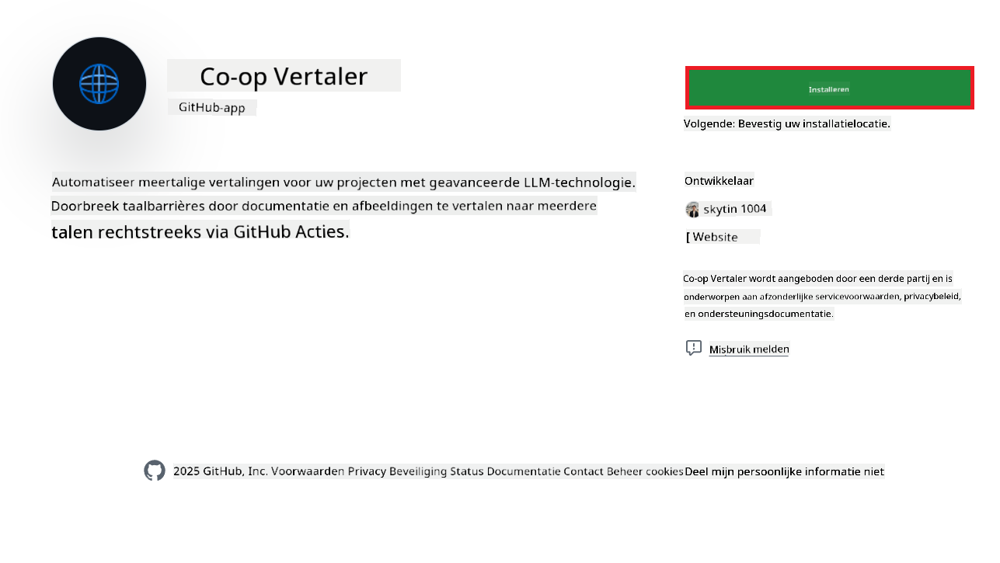
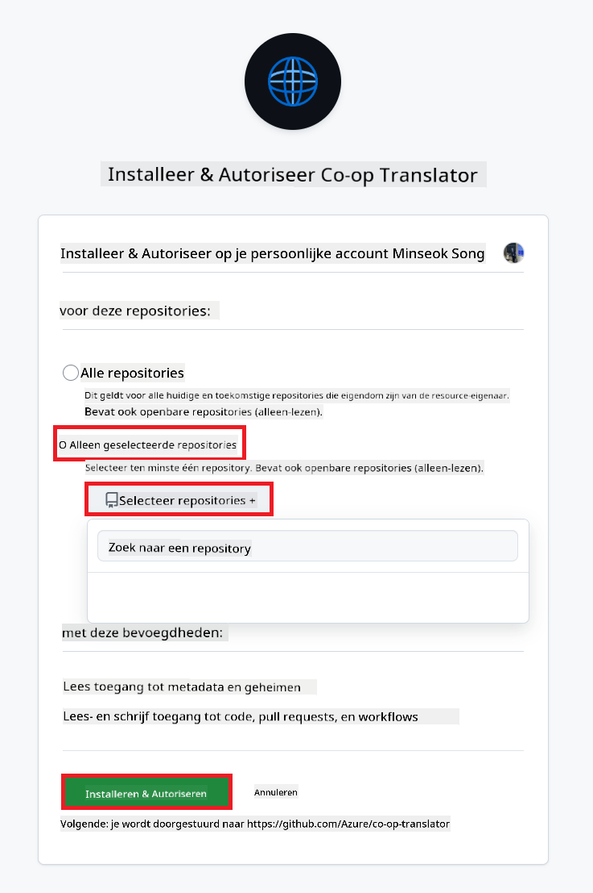
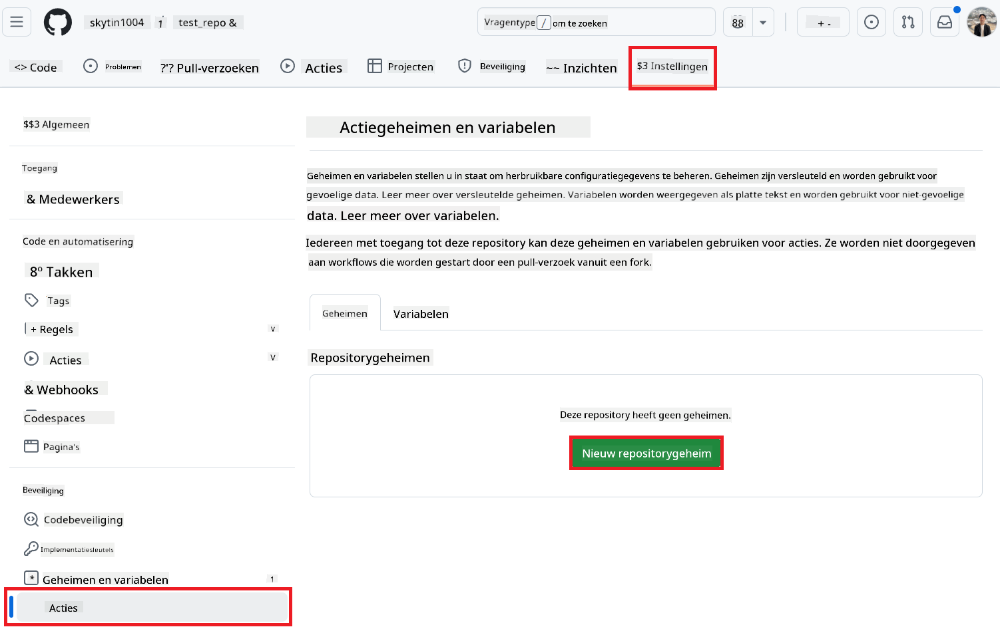
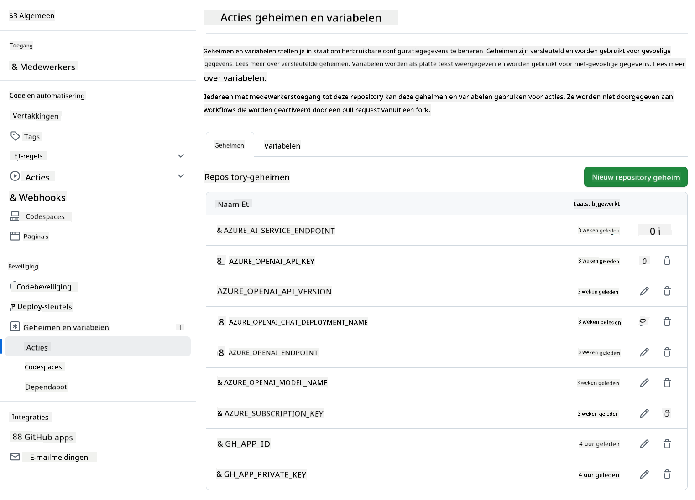

<!--
CO_OP_TRANSLATOR_METADATA:
{
  "original_hash": "c437820027c197f25fb2cbee95bae28c",
  "translation_date": "2025-06-12T19:12:47+00:00",
  "source_file": "getting_started/github-actions-guide/github-actions-guide-org.md",
  "language_code": "nl"
}
-->
# Het gebruik van de Co-op Translator GitHub Action (Organisatiehandleiding)

**Doelgroep:** Deze handleiding is bedoeld voor **Microsoft interne gebruikers** of **teams die toegang hebben tot de benodigde gegevens voor de vooraf gebouwde Co-op Translator GitHub App** of die hun eigen aangepaste GitHub App kunnen aanmaken.

Automatiseer moeiteloos de vertaling van de documentatie in je repository met de Co-op Translator GitHub Action. Deze handleiding leidt je door het instellen van de actie om automatisch pull requests aan te maken met bijgewerkte vertalingen zodra je bron-Markdownbestanden of afbeeldingen wijzigen.

> [!IMPORTANT]
> 
> **De juiste handleiding kiezen:**
>
> Deze handleiding beschrijft de setup met een **GitHub App ID en een Private Key**. Je hebt deze "Organisatiehandleiding" meestal nodig als: **`GITHUB_TOKEN` machtigingen beperkt zijn:** De instellingen van je organisatie of repository beperken de standaardmachtigingen die aan de standaard `GITHUB_TOKEN` worden toegekend. Met name als de `GITHUB_TOKEN` niet de benodigde `write` machtigingen krijgt (zoals `contents: write` of `pull-requests: write`), zal de workflow in de [Publieke Setup Handleiding](./github-actions-guide-public.md) falen vanwege onvoldoende rechten. Door een toegewijde GitHub App met expliciet verleende rechten te gebruiken, omzeil je deze beperking.
>
> **Als het bovenstaande niet op jou van toepassing is:**
>
> Als de standaard `GITHUB_TOKEN` voldoende rechten heeft in je repository (dus als je niet wordt geblokkeerd door organisatiebeperkingen), gebruik dan de **[Publieke Setup Handleiding met GITHUB_TOKEN](./github-actions-guide-public.md)**. De publieke handleiding vereist geen App ID's of Private Keys en werkt alleen met de standaard `GITHUB_TOKEN` en repositoryrechten.

## Vereisten

Voordat je de GitHub Action configureert, zorg dat je de benodigde AI-servicegegevens bij de hand hebt.

**1. Vereist: AI-taalmodelgegevens**  
Je hebt gegevens nodig voor ten minste één ondersteund taalmodel:

- **Azure OpenAI**: Vereist Endpoint, API-sleutel, Model-/Deploymentnamen, API-versie.  
- **OpenAI**: Vereist API-sleutel, (optioneel: Org ID, Base URL, Model ID).  
- Zie [Ondersteunde modellen en services](../../../../README.md) voor details.  
- Setuphandleiding: [Azure OpenAI instellen](../set-up-resources/set-up-azure-openai.md).

**2. Optioneel: Computer Vision-gegevens (voor afbeeldingvertaling)**

- Alleen nodig als je tekst in afbeeldingen wilt vertalen.  
- **Azure Computer Vision**: Vereist Endpoint en Subscription Key.  
- Als deze niet worden opgegeven, valt de actie terug op de [Markdown-only modus](../markdown-only-mode.md).  
- Setuphandleiding: [Azure Computer Vision instellen](../set-up-resources/set-up-azure-computer-vision.md).

## Setup en configuratie

Volg deze stappen om de Co-op Translator GitHub Action in je repository te configureren:

### Stap 1: Installeer en configureer GitHub App-authenticatie

De workflow gebruikt GitHub App-authenticatie om veilig namens jou met je repository te communiceren (bijvoorbeeld om pull requests aan te maken). Kies één van de opties:

#### **Optie A: Installeer de vooraf gebouwde Co-op Translator GitHub App (voor intern Microsoft gebruik)**

1. Ga naar de [Co-op Translator GitHub App](https://github.com/apps/co-op-translator) pagina.

1. Kies **Installeren** en selecteer het account of de organisatie waar je doelrepository zich bevindt.

    

1. Kies **Alleen geselecteerde repositories** en selecteer je doelrepository (bijvoorbeeld `PhiCookBook`). Klik op **Installeren**. Je wordt mogelijk gevraagd om te authenticeren.

    

1. **Verkrijg App-gegevens (intern proces vereist):** Om de workflow namens de app te laten authenticeren, heb je twee gegevens nodig die door het Co-op Translator-team worden verstrekt:  
  - **App ID:** De unieke identificatie van de Co-op Translator app. De App ID is: `1164076`.  
  - **Private Key:** Je moet de **volledige inhoud** van het `.pem` private key-bestand verkrijgen van de beheerder. **Behandel deze sleutel als een wachtwoord en bewaar deze veilig.**

1. Ga verder naar Stap 2.

#### **Optie B: Gebruik je eigen aangepaste GitHub App**

- Je kunt ook je eigen GitHub App aanmaken en configureren. Zorg dat deze lees- en schrijfrechten heeft op Contents en Pull requests. Je hebt de App ID en een gegenereerde Private Key nodig.

### Stap 2: Configureer repository secrets

Je moet de GitHub App-gegevens en je AI-servicegegevens toevoegen als versleutelde secrets in de instellingen van je repository.

1. Ga naar je doel-GitHub repository (bijvoorbeeld `PhiCookBook`).

1. Ga naar **Settings** > **Secrets and variables** > **Actions**.

1. Klik onder **Repository secrets** op **New repository secret** voor elk van onderstaande secrets.

   

**Vereiste secrets (voor GitHub App-authenticatie):**

| Naam van secret          | Beschrijving                                      | Bron van waarde                               |
| :----------------------- | :------------------------------------------------ | :--------------------------------------------- |
| `GH_APP_ID`       | De App ID van de GitHub App (van Stap 1).          | GitHub App instellingen                        |
| `GH_APP_PRIVATE_KEY`       | De **volledige inhoud** van het gedownloade `.pem` bestand. | `.pem` bestand (van Stap 1)       |

**AI-service secrets (voeg ALLE relevante toe op basis van je vereisten):**

| Naam van secret           | Beschrijving                               | Bron van waarde                   |
| :------------------------ | :---------------------------------------- | :------------------------------- |
| `AZURE_SUBSCRIPTION_KEY`        | Sleutel voor Azure AI Service (Computer Vision)  | Azure AI Foundry                  |
| `AZURE_AI_SERVICE_ENDPOINT`        | Endpoint voor Azure AI Service (Computer Vision) | Azure AI Foundry                  |
| `AZURE_OPENAI_API_KEY`        | Sleutel voor Azure OpenAI service         | Azure AI Foundry                  |
| `AZURE_OPENAI_ENDPOINT`        | Endpoint voor Azure OpenAI service        | Azure AI Foundry                  |
| `AZURE_OPENAI_MODEL_NAME`        | Jouw Azure OpenAI Modelnaam                | Azure AI Foundry                  |
| `AZURE_OPENAI_CHAT_DEPLOYMENT_NAME`        | Jouw Azure OpenAI Deploymentnaam           | Azure AI Foundry                  |
| `AZURE_OPENAI_API_VERSION`        | API-versie voor Azure OpenAI               | Azure AI Foundry                  |
| `OPENAI_API_KEY`        | API-sleutel voor OpenAI                     | OpenAI Platform                  |
| `OPENAI_ORG_ID`        | OpenAI Organisatie ID                       | OpenAI Platform                  |
| `OPENAI_CHAT_MODEL_ID`        | Specifieke OpenAI model-ID                   | OpenAI Platform                  |
| `OPENAI_BASE_URL`        | Aangepaste OpenAI API Base URL               | OpenAI Platform                  |



### Stap 3: Maak het workflowbestand aan

Maak tenslotte het YAML-bestand aan dat de geautomatiseerde workflow definieert.

1. Maak in de hoofdmap van je repository de `.github/workflows/` map aan als die nog niet bestaat.

1. Maak in `.github/workflows/` een bestand aan met de naam `co-op-translator.yml`.

1. Plak de volgende inhoud in co-op-translator.yml.

```
name: Co-op Translator

on:
  push:
    branches:
      - main

jobs:
  co-op-translator:
    runs-on: ubuntu-latest

    permissions:
      contents: write
      pull-requests: write

    steps:
      - name: Checkout repository
        uses: actions/checkout@v4
        with:
          fetch-depth: 0

      - name: Set up Python
        uses: actions/setup-python@v4
        with:
          python-version: '3.10'

      - name: Install Co-op Translator
        run: |
          python -m pip install --upgrade pip
          pip install co-op-translator

      - name: Run Co-op Translator
        env:
          PYTHONIOENCODING: utf-8
          # Azure AI Service Credentials
          AZURE_SUBSCRIPTION_KEY: ${{ secrets.AZURE_SUBSCRIPTION_KEY }}
          AZURE_AI_SERVICE_ENDPOINT: ${{ secrets.AZURE_AI_SERVICE_ENDPOINT }}

          # Azure OpenAI Credentials
          AZURE_OPENAI_API_KEY: ${{ secrets.AZURE_OPENAI_API_KEY }}
          AZURE_OPENAI_ENDPOINT: ${{ secrets.AZURE_OPENAI_ENDPOINT }}
          AZURE_OPENAI_MODEL_NAME: ${{ secrets.AZURE_OPENAI_MODEL_NAME }}
          AZURE_OPENAI_CHAT_DEPLOYMENT_NAME: ${{ secrets.AZURE_OPENAI_CHAT_DEPLOYMENT_NAME }}
          AZURE_OPENAI_API_VERSION: ${{ secrets.AZURE_OPENAI_API_VERSION }}

          # OpenAI Credentials
          OPENAI_API_KEY: ${{ secrets.OPENAI_API_KEY }}
          OPENAI_ORG_ID: ${{ secrets.OPENAI_ORG_ID }}
          OPENAI_CHAT_MODEL_ID: ${{ secrets.OPENAI_CHAT_MODEL_ID }}
          OPENAI_BASE_URL: ${{ secrets.OPENAI_BASE_URL }}
        run: |
          # =====================================================================
          # IMPORTANT: Set your target languages here (REQUIRED CONFIGURATION)
          # =====================================================================
          # Example: Translate to Spanish, French, German. Add -y to auto-confirm.
          translate -l "es fr de" -y  # <--- MODIFY THIS LINE with your desired languages

      - name: Authenticate GitHub App
        id: generate_token
        uses: tibdex/github-app-token@v1
        with:
          app_id: ${{ secrets.GH_APP_ID }}
          private_key: ${{ secrets.GH_APP_PRIVATE_KEY }}

      - name: Create Pull Request with translations
        uses: peter-evans/create-pull-request@v5
        with:
          token: ${{ steps.generate_token.outputs.token }}
          commit-message: "🌐 Update translations via Co-op Translator"
          title: "🌐 Update translations via Co-op Translator"
          body: |
            This PR updates translations for recent changes to the main branch.

            ### 📋 Changes included
            - Translated contents are available in the `translations/` directory
            - Translated images are available in the `translated_images/` directory

            ---
            🌐 Automatically generated by the [Co-op Translator](https://github.com/Azure/co-op-translator) GitHub Action.
          branch: update-translations
          base: main
          labels: translation, automated-pr
          delete-branch: true
          add-paths: |
            translations/
            translated_images/

```

4.  **Pas de workflow aan:**  
  - **[!IMPORTANT] Doeltalen:** Pas in de `Run Co-op Translator` step, you **MUST review and modify the list of language codes** within the `translate -l "..." -y` command to match your project's requirements. The example list (`ar de es...`) needs to be replaced or adjusted.
  - **Trigger (`on:`):** The current trigger runs on every push to `main`. For large repositories, consider adding a `paths:` filter (see commented example in the YAML) to run the workflow only when relevant files (e.g., source documentation) change, saving runner minutes.
  - **PR Details:** Customize the `commit-message`, `title`, `body`, `branch` name, and `labels` in the `Create Pull Request` step if needed.

## Credential Management and Renewal

- **Security:** Always store sensitive credentials (API keys, private keys) as GitHub Actions secrets. Never expose them in your workflow file or repository code.
- **[!IMPORTANT] Key Renewal (Internal Microsoft Users):** Be aware that Azure OpenAI key used within Microsoft might have a mandatory renewal policy (e.g., every 5 months). Ensure you update the corresponding GitHub secrets (`AZURE_OPENAI_...` sleutels aan **voordat ze verlopen** om te voorkomen dat de workflow faalt.

## De workflow uitvoeren

Zodra het `co-op-translator.yml` bestand is samengevoegd in je main-branch (of de branch die is opgegeven in het `on:` trigger), the workflow will automatically run whenever changes are pushed to that branch (and match the `paths` filter, indien geconfigureerd).

Als er vertalingen worden aangemaakt of bijgewerkt, maakt de actie automatisch een Pull Request aan met de wijzigingen, klaar voor jouw beoordeling en samenvoeging.

**Disclaimer**:  
Dit document is vertaald met behulp van de AI-vertalingsservice [Co-op Translator](https://github.com/Azure/co-op-translator). Hoewel we streven naar nauwkeurigheid, dient u er rekening mee te houden dat geautomatiseerde vertalingen fouten of onjuistheden kunnen bevatten. Het oorspronkelijke document in de oorspronkelijke taal moet als de gezaghebbende bron worden beschouwd. Voor belangrijke informatie wordt professionele menselijke vertaling aanbevolen. Wij zijn niet aansprakelijk voor misverstanden of verkeerde interpretaties die voortvloeien uit het gebruik van deze vertaling.