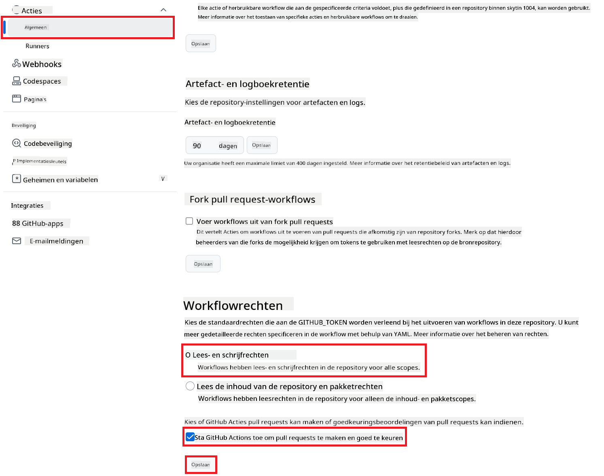

<!--
CO_OP_TRANSLATOR_METADATA:
{
  "original_hash": "a52587a512e667f70d92db853d3c61d5",
  "translation_date": "2025-06-12T19:31:01+00:00",
  "source_file": "getting_started/github-actions-guide/github-actions-guide-public.md",
  "language_code": "nl"
}
-->
# Gebruik van de Co-op Translator GitHub Action (Publieke Setup)

**Doelgroep:** Deze handleiding is bedoeld voor gebruikers in de meeste publieke of private repositories waar standaard GitHub Actions-machtigingen voldoende zijn. Het maakt gebruik van de ingebouwde `GITHUB_TOKEN`.

Automatiseer moeiteloos de vertaling van de documentatie van je repository met de Co-op Translator GitHub Action. Deze gids begeleidt je bij het instellen van de actie om automatisch pull requests aan te maken met bijgewerkte vertalingen telkens wanneer je bron Markdown-bestanden of afbeeldingen wijzigen.

> [!IMPORTANT]
>
> **De juiste gids kiezen:**
>
> Deze gids beschrijft de **eenvoudigere setup met de standaard `GITHUB_TOKEN`**. Dit is de aanbevolen methode voor de meeste gebruikers, omdat het geen beheer van gevoelige GitHub App Private Keys vereist.
>

## Vereisten

Zorg ervoor dat je voordat je de GitHub Action configureert de benodigde AI-service referenties klaar hebt staan.

**1. Verplicht: AI-taalmodelreferenties**  
Je hebt referenties nodig voor ten minste één ondersteund taalmodel:

- **Azure OpenAI**: Vereist Endpoint, API-sleutel, Model-/Deploymentnamen, API-versie.  
- **OpenAI**: Vereist API-sleutel, (optioneel: Org ID, Basis-URL, Model ID).  
- Zie [Supported Models and Services](../../../../README.md) voor details.

**2. Optioneel: AI Vision-referenties (voor afbeeldingvertaling)**

- Alleen nodig als je tekst binnen afbeeldingen wilt vertalen.  
- **Azure AI Vision**: Vereist Endpoint en Subscription Key.  
- Als deze niet worden opgegeven, gebruikt de actie de [Markdown-only modus](../markdown-only-mode.md).

## Setup en Configuratie

Volg deze stappen om de Co-op Translator GitHub Action in je repository te configureren met de standaard `GITHUB_TOKEN`.

### Stap 1: Begrijp authenticatie (met `GITHUB_TOKEN`)

Deze workflow maakt gebruik van de ingebouwde `GITHUB_TOKEN` die door GitHub Actions wordt geleverd. Deze token verleent automatisch de benodigde rechten aan de workflow om met je repository te werken, gebaseerd op de instellingen die je configureert in **Stap 3**.

### Stap 2: Configureer Repository Secrets

Je hoeft alleen je **AI-service referenties** als versleutelde secrets toe te voegen in de instellingen van je repository.

1.  Ga naar je doel-GitHub repository.  
2.  Ga naar **Settings** > **Secrets and variables** > **Actions**.  
3.  Klik onder **Repository secrets** op **New repository secret** voor elke vereiste AI-service secret die hieronder staat.

     *(Afbeeldingsreferentie: Laat zien waar je secrets toevoegt)*

**Vereiste AI-service secrets (Voeg ALLE relevante toe op basis van je vereisten):**

| Naam secret                         | Beschrijving                              | Waardebron                      |
| :--------------------------------- | :--------------------------------------- | :------------------------------ |
| `AZURE_SUBSCRIPTION_KEY`            | Sleutel voor Azure AI Service (Computer Vision) | Jouw Azure AI Foundry            |
| `AZURE_AI_SERVICE_ENDPOINT`         | Endpoint voor Azure AI Service (Computer Vision) | Jouw Azure AI Foundry            |
| `AZURE_OPENAI_API_KEY`              | Sleutel voor Azure OpenAI service             | Jouw Azure AI Foundry            |
| `AZURE_OPENAI_ENDPOINT`             | Endpoint voor Azure OpenAI service            | Jouw Azure AI Foundry            |
| `AZURE_OPENAI_MODEL_NAME`           | Jouw Azure OpenAI Modelnaam                   | Jouw Azure AI Foundry            |
| `AZURE_OPENAI_CHAT_DEPLOYMENT_NAME` | Jouw Azure OpenAI Deploymentnaam              | Jouw Azure AI Foundry            |
| `AZURE_OPENAI_API_VERSION`          | API-versie voor Azure OpenAI                   | Jouw Azure AI Foundry            |
| `OPENAI_API_KEY`                    | API-sleutel voor OpenAI                       | Jouw OpenAI Platform             |
| `OPENAI_ORG_ID`                     | OpenAI Organisatie-ID (optioneel)             | Jouw OpenAI Platform             |
| `OPENAI_CHAT_MODEL_ID`              | Specifieke OpenAI model-ID (optioneel)         | Jouw OpenAI Platform             |
| `OPENAI_BASE_URL`                   | Aangepaste OpenAI API Basis-URL (optioneel)   | Jouw OpenAI Platform             |

### Stap 3: Configureer Workflow-machtigingen

De GitHub Action heeft machtigingen nodig die via de `GITHUB_TOKEN` worden verleend om code te kunnen uitchecken en pull requests aan te maken.

1.  Ga in je repository naar **Settings** > **Actions** > **General**.  
2.  Scroll naar beneden naar het gedeelte **Workflow permissions**.  
3.  Selecteer **Read and write permissions**. Dit geeft de `GITHUB_TOKEN` de benodigde `contents: write` en `pull-requests: write` machtigingen voor deze workflow.  
4.  Zorg dat het vinkje bij **Allow GitHub Actions to create and approve pull requests** aangevinkt is.  
5.  Klik op **Save**.



### Stap 4: Maak het Workflow-bestand aan

Maak tot slot het YAML-bestand aan dat de geautomatiseerde workflow definieert met behulp van `GITHUB_TOKEN`.

1.  Maak in de hoofdmap van je repository de `.github/workflows/` map aan als deze nog niet bestaat.  
2.  Maak binnen `.github/workflows/` een bestand aan met de naam `co-op-translator.yml`.  
3.  Plak de volgende inhoud in `co-op-translator.yml`.

```yaml
name: Co-op Translator

on:
  push:
    branches:
      - main

jobs:
  co-op-translator:
    runs-on: ubuntu-latest

    permissions:
      contents: write
      pull-requests: write

    steps:
      - name: Checkout repository
        uses: actions/checkout@v4
        with:
          fetch-depth: 0

      - name: Set up Python
        uses: actions/setup-python@v4
        with:
          python-version: '3.10'

      - name: Install Co-op Translator
        run: |
          python -m pip install --upgrade pip
          pip install co-op-translator

      - name: Run Co-op Translator
        env:
          PYTHONIOENCODING: utf-8
          # === AI Service Credentials ===
          AZURE_SUBSCRIPTION_KEY: ${{ secrets.AZURE_SUBSCRIPTION_KEY }}
          AZURE_AI_SERVICE_ENDPOINT: ${{ secrets.AZURE_AI_SERVICE_ENDPOINT }}
          AZURE_OPENAI_API_KEY: ${{ secrets.AZURE_OPENAI_API_KEY }}
          AZURE_OPENAI_ENDPOINT: ${{ secrets.AZURE_OPENAI_ENDPOINT }}
          AZURE_OPENAI_MODEL_NAME: ${{ secrets.AZURE_OPENAI_MODEL_NAME }}
          AZURE_OPENAI_CHAT_DEPLOYMENT_NAME: ${{ secrets.AZURE_OPENAI_CHAT_DEPLOYMENT_NAME }}
          AZURE_OPENAI_API_VERSION: ${{ secrets.AZURE_OPENAI_API_VERSION }}
          OPENAI_API_KEY: ${{ secrets.OPENAI_API_KEY }}
          OPENAI_ORG_ID: ${{ secrets.OPENAI_ORG_ID }}
          OPENAI_CHAT_MODEL_ID: ${{ secrets.OPENAI_CHAT_MODEL_ID }}
          OPENAI_BASE_URL: ${{ secrets.OPENAI_BASE_URL }}
        run: |
          # =====================================================================
          # IMPORTANT: Set your target languages here (REQUIRED CONFIGURATION)
          # =====================================================================
          # Example: Translate to Spanish, French, German. Add -y to auto-confirm.
          translate -l "es fr de" -y  # <--- MODIFY THIS LINE with your desired languages

      - name: Create Pull Request with translations
        uses: peter-evans/create-pull-request@v5
        with:
          token: ${{ secrets.GITHUB_TOKEN }}
          commit-message: "🌐 Update translations via Co-op Translator"
          title: "🌐 Update translations via Co-op Translator"
          body: |
            This PR updates translations for recent changes to the main branch.

            ### 📋 Changes included
            - Translated contents are available in the `translations/` directory
            - Translated images are available in the `translated_images/` directory

            ---
            🌐 Automatically generated by the [Co-op Translator](https://github.com/Azure/co-op-translator) GitHub Action.
          branch: update-translations
          base: main
          labels: translation, automated-pr
          delete-branch: true
          add-paths: |
            translations/
            translated_images/
```  
4.  **Pas de workflow aan:**  
  - **[!IMPORTANT] Doelgroepen talen:** In de stap `Run Co-op Translator` step, you **MUST review and modify the list of language codes** within the `translate -l "..." -y` command to match your project's requirements. The example list (`ar de es...`) needs to be replaced or adjusted.
  - **Trigger (`on:`):** The current trigger runs on every push to `main`. For large repositories, consider adding a `paths:` filter (see commented example in the YAML) to run the workflow only when relevant files (e.g., source documentation) change, saving runner minutes.
  - **PR Details:** Customize the `commit-message`, `title`, `body`, `branch` name, and `labels` in the `Create Pull Request` indien nodig.

**Disclaimer**:  
Dit document is vertaald met behulp van de AI-vertalingsdienst [Co-op Translator](https://github.com/Azure/co-op-translator). Hoewel wij streven naar nauwkeurigheid, dient u er rekening mee te houden dat geautomatiseerde vertalingen fouten of onnauwkeurigheden kunnen bevatten. Het originele document in de oorspronkelijke taal moet als de gezaghebbende bron worden beschouwd. Voor belangrijke informatie wordt professionele menselijke vertaling aanbevolen. Wij zijn niet aansprakelijk voor eventuele misverstanden of verkeerde interpretaties die voortvloeien uit het gebruik van deze vertaling.