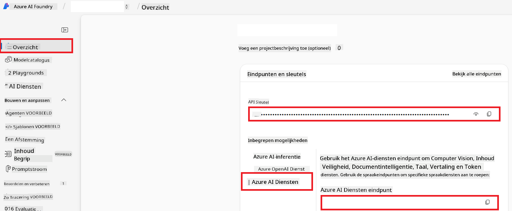

<!--
CO_OP_TRANSLATOR_METADATA:
{
  "original_hash": "b58d7c3cb4210697a073d20eb3064945",
  "translation_date": "2025-06-12T11:55:04+00:00",
  "source_file": "getting_started/set-up-azure-ai.md",
  "language_code": "nl"
}
-->
# Azure AI instellen voor Co-op Translator (Azure OpenAI & Azure AI Vision)

Deze handleiding begeleidt je bij het instellen van Azure OpenAI voor taalvertaling en Azure Computer Vision voor beeldinhoudsanalyse (wat vervolgens gebruikt kan worden voor beeldgebaseerde vertaling) binnen Azure AI Foundry.

**Vereisten:**
- Een Azure-account met een actieve abonnement.
- Voldoende rechten om resources en implementaties te maken binnen je Azure-abonnement.

## Maak een Azure AI-project aan

Je begint met het aanmaken van een Azure AI-project, dat fungeert als een centrale plek voor het beheren van je AI-resources.

1. Ga naar [https://ai.azure.com](https://ai.azure.com) en meld je aan met je Azure-account.

1. Selecteer **+Create** om een nieuw project aan te maken.

1. Voer de volgende taken uit:
   - Voer een **Projectnaam** in (bijv. `CoopTranslator-Project`).
   - Selecteer de **AI hub** (bijv. `CoopTranslator-Hub`) (Maak er een nieuwe aan indien nodig).

1. Klik op "**Review and Create**" om je project op te zetten. Je wordt naar de overzichtspagina van je project gebracht.

## Azure OpenAI instellen voor taalvertaling

Binnen je project ga je een Azure OpenAI-model implementeren dat dienstdoet als backend voor tekstvertaling.

### Navigeer naar je project

Als je er nog niet bent, open dan je nieuw aangemaakte project (bijv. `CoopTranslator-Project`) in Azure AI Foundry.

### Implementeer een OpenAI-model

1. Kies in het linkermenu van je project onder "My assets" voor "**Models + endpoints**".

1. Selecteer **+ Deploy model**.

1. Kies **Deploy Base Model**.

1. Je krijgt een lijst met beschikbare modellen te zien. Filter of zoek naar een geschikt GPT-model. We raden `gpt-4o` aan.

1. Selecteer het gewenste model en klik op **Confirm**.

1. Klik op **Deploy**.

### Azure OpenAI-configuratie

Na implementatie kun je de implementatie selecteren op de pagina "**Models + endpoints**" om de **REST endpoint URL**, **Key**, **Deployment name**, **Model name** en **API version** te vinden. Deze gegevens heb je nodig om het vertaalmodel in je applicatie te integreren.

> [!NOTE]
> Je kunt API-versies kiezen op basis van je behoeften via de pagina [API version deprecation](https://learn.microsoft.com/azure/ai-services/openai/api-version-deprecation). Let op dat de **API version** verschilt van de **Model version** die wordt getoond op de pagina **Models + endpoints** in Azure AI Foundry.

## Azure Computer Vision instellen voor beeldvertaling

Om vertaling van tekst binnen afbeeldingen mogelijk te maken, moet je de Azure AI Service API Key en Endpoint vinden.

1. Ga naar je Azure AI-project (bijv. `CoopTranslator-Project`). Zorg dat je op de overzichtspagina van het project bent.

### Azure AI Service-configuratie

Vind de API Key en Endpoint van de Azure AI Service.

1. Ga naar je Azure AI-project (bijv. `CoopTranslator-Project`). Zorg dat je op de overzichtspagina bent.

1. Zoek de **API Key** en **Endpoint** onder het tabblad Azure AI Service.

    

Deze koppeling maakt de mogelijkheden van de gekoppelde Azure AI Services-resource (inclusief beeldanalyse) beschikbaar voor je AI Foundry-project. Je kunt deze verbinding vervolgens gebruiken in je notebooks of applicaties om tekst uit afbeeldingen te halen, die daarna naar het Azure OpenAI-model gestuurd kan worden voor vertaling.

## Je inloggegevens verzamelen

Je hebt nu de volgende gegevens verzameld:

**Voor Azure OpenAI (tekstvertaling):**
- Azure OpenAI Endpoint
- Azure OpenAI API Key
- Azure OpenAI Model Name (bijv. `gpt-4o`)
- Azure OpenAI Deployment Name (bijv. `cooptranslator-gpt4o`)
- Azure OpenAI API Version

**Voor Azure AI Services (tekstextractie uit afbeeldingen via Vision):**
- Azure AI Service Endpoint
- Azure AI Service API Key

### Voorbeeld: Configuratie van omgevingsvariabelen (Preview)

Later, bij het bouwen van je applicatie, configureer je deze waarschijnlijk met de verzamelde inloggegevens. Bijvoorbeeld door ze als omgevingsvariabelen in te stellen zoals hieronder:

```bash
# Azure AI Service Credentials (Required for image translation)
AZURE_AI_SERVICE_API_KEY="your_azure_ai_service_api_key" # e.g., 21xasd...
AZURE_AI_SERVICE_ENDPOINT="https://your_azure_ai_service_endpoint.cognitiveservices.azure.com/"

# Azure OpenAI Credentials (Required for text translation)
AZURE_OPENAI_API_KEY="your_azure_openai_api_key" # e.g., 21xasd...
AZURE_OPENAI_ENDPOINT="https://your_azure_openai_endpoint.openai.azure.com/"
AZURE_OPENAI_MODEL_NAME="your_model_name" # e.g., gpt-4o
AZURE_OPENAI_CHAT_DEPLOYMENT_NAME="your_deployment_name" # e.g., cooptranslator-gpt4o
AZURE_OPENAI_API_VERSION="your_api_version" # e.g., 2024-12-01-preview
```

---

### Verder lezen

- [Hoe maak je een project aan in Azure AI Foundry](https://learn.microsoft.com/azure/ai-foundry/how-to/create-projects?tabs=ai-studio)
- [Hoe maak je Azure AI-resources aan](https://learn.microsoft.com/azure/ai-foundry/how-to/create-azure-ai-resource?tabs=portal)
- [Hoe implementeer je OpenAI-modellen in Azure AI Foundry](https://learn.microsoft.com/en-us/azure/ai-foundry/how-to/deploy-models-openai)

**Disclaimer**:  
Dit document is vertaald met behulp van de AI-vertalingsdienst [Co-op Translator](https://github.com/Azure/co-op-translator). Hoewel we streven naar nauwkeurigheid, dient u er rekening mee te houden dat geautomatiseerde vertalingen fouten of onjuistheden kunnen bevatten. Het originele document in de oorspronkelijke taal geldt als de gezaghebbende bron. Voor belangrijke informatie wordt professionele menselijke vertaling aanbevolen. Wij zijn niet aansprakelijk voor eventuele misverstanden of verkeerde interpretaties die voortvloeien uit het gebruik van deze vertaling.