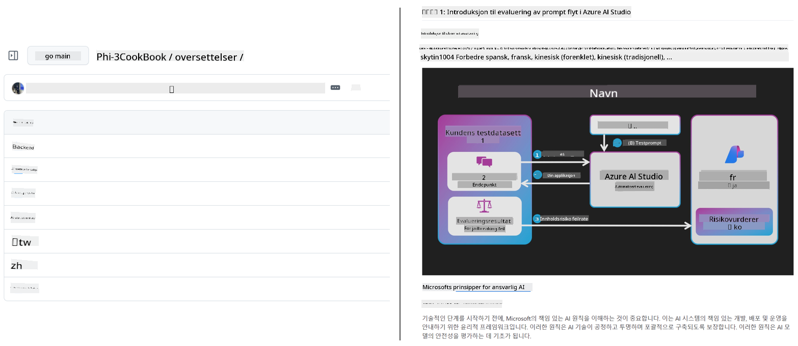
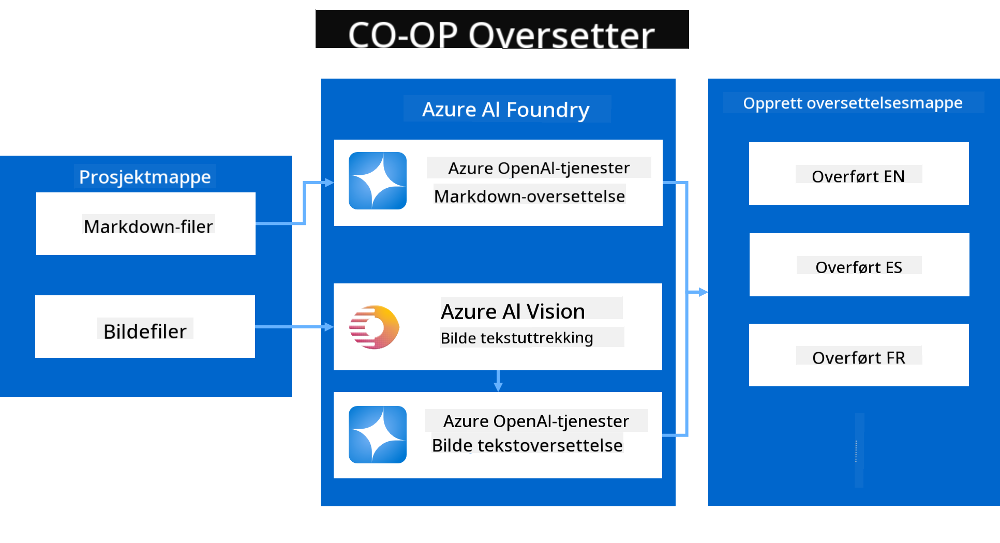
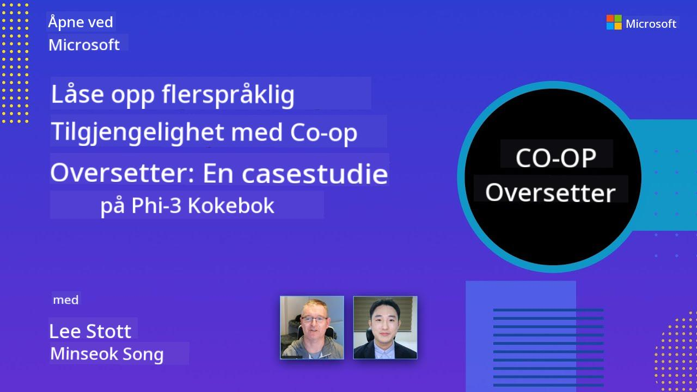

<!--
CO_OP_TRANSLATOR_METADATA:
{
  "original_hash": "044724537b57868117aadae8e7728c7c",
  "translation_date": "2025-06-12T10:34:18+00:00",
  "source_file": "README.md",
  "language_code": "no"
}
-->


# Co-op Translator: Automatiser oversettelsen av utdanningsdokumentasjon uten problemer

_Lett automatiser oversettelsen av dokumentasjonen din til flere språk for å nå et globalt publikum._

[](https://pypi.org/project/co-op-translator/)
[](https://github.com/azure/co-op-translator/blob/main/LICENSE)
[](https://pepy.tech/project/co-op-translator)
[](https://pepy.tech/project/co-op-translator)
[](https://github.com/psf/black)

[](https://GitHub.com/azure/co-op-translator/graphs/contributors/)
[](https://GitHub.com/azure/co-op-translator/issues/)
[](https://GitHub.com/azure/co-op-translator/pulls/)
[](http://makeapullrequest.com)

### Språkstøtte drevet av Co-op Translator

> [!NOTE]
> Dette er de nåværende oversettelsene av innholdet i dette depotet. For en komplett liste over språk som støttes av Co-op Translator, se delen [Language Support](../..).

[](https://GitHub.com/azure/co-op-translator/watchers/)
[](https://GitHub.com/azure/co-op-translator/network/)
[](https://GitHub.com/azure/co-op-translator/stargazers/)

[](https://discord.com/invite/ByRwuEEgH4)

[](https://codespaces.new/azure/co-op-translator)
[](https://vscode.dev/redirect?url=vscode://ms-vscode-remote.remote-containers/cloneInVolume?url=https://github.com/azure/co-op-translator)

## Oversikt: Effektiviser oversettelsen av ditt undervisningsinnhold

Språkbarrierer hindrer i stor grad tilgang til verdifulle undervisningsressurser og teknisk kunnskap for elever og utviklere over hele verden. Dette begrenser deltakelse og bremser tempoet for global innovasjon og læring.

**Co-op Translator** ble utviklet for å løse det ineffektive manuelle oversettelsesarbeidet for Microsofts egne store undervisningsserier (som "For Beginners"-guidene). Verktøyet har utviklet seg til å bli et brukervennlig og kraftfullt hjelpemiddel som bryter ned disse barrierene for alle. Ved å tilby automatiserte oversettelser av høy kvalitet via CLI og GitHub Actions, gir Co-op Translator lærere, studenter, forskere og utviklere verden over muligheten til å dele og få tilgang til kunnskap uten språkbegrensninger.

Se hvordan Co-op Translator organiserer oversatt undervisningsinnhold:



Markdown-filer og tekst i bilder oversettes automatisk og organiseres ryddig i språkspesifikke mapper.

**Åpne for global tilgang til ditt undervisningsinnhold med Co-op Translator i dag!**

## Støtte for global tilgang til Microsofts læringsressurser

Co-op Translator bidrar til å bygge bro over språkbarrierer for viktige Microsoft-undervisningsinitiativ, og automatiserer oversettelsesprosessen for depot som betjener et globalt utviklermiljø. Eksempler som bruker Co-op Translator i dag inkluderer:

[](https://github.com/microsoft/Generative-AI-for-beginners)
[](https://github.com/microsoft/ML-For-Beginners)
[](https://github.com/microsoft/AI-For-Beginners)
[](https://github.com/microsoft/ai-agents-for-beginners)
[](https://github.com/microsoft/PhiCookBook)
[](https://github.com/microsoft/Generative-AI-for-beginners-dotnet)

## Nøkkelfunksjoner

- **Automatiserte oversettelser**: Oversett tekst til flere språk uten anstrengelse.
- **GitHub Actions-integrasjon**: Automatiser oversettelser som en del av CI/CD-pipelinen din.
- **Bevaring av Markdown**: Behold korrekt Markdown-syntaks under oversettelsen.
- **Oversettelse av tekst i bilder**: Ekstraher og oversett tekst i bilder.
- **Avansert LLM-teknologi**: Bruk moderne språkmodeller for oversettelser av høy kvalitet.
- **Enkel integrasjon**: Integrer sømløst med ditt eksisterende prosjektoppsett.
- **Forenkle lokalisering**: Effektiviser prosessen med å lokalisere prosjektet ditt for internasjonale markeder.

## Slik fungerer det



Co-op Translator tar Markdown-filer og bilder fra prosjektmappen din og behandler dem slik:

1. **Tekstekstraksjon**: Henter tekst fra Markdown-filer og, hvis konfigurert (f.eks. med Azure AI Vision), tekst innebygd i bilder.
1. **AI-oversettelse**: Sender den hentede teksten til den konfigurerte LLM-en (Azure OpenAI, OpenAI, osv.) for oversettelse.
1. **Lagring av resultat**: Lagrer de oversatte Markdown-filene og bildene (med oversatt tekst) i språkspesifikke mapper, samtidig som original formatering bevares.

## Kom i gang

Kom raskt i gang med CLI eller sett opp full automatisering med GitHub Actions. Velg metoden som passer best for din arbeidsflyt:

1. **Kommandolinje (CLI)** – For engangsoversettelser eller manuell kontroll
2. **GitHub Actions** – For automatiske oversettelser ved hver push

> [!NOTE]
> Selv om denne veiledningen fokuserer på Azure-ressurser, kan du bruke hvilken som helst støttet språkmodell.

### Språkstøtte

Co-op Translator støtter et bredt utvalg språk for å hjelpe deg med å nå et globalt publikum. Her er det du trenger å vite:

#### Rask oversikt

| Språk | Kode | Språk | Kode | Språk | Kode |
|-------|-------|-------|-------|-------|-------|
| Arabisk | ar | Bengali | bn | Bulgarsk | bg |
| Burmesisk (Myanmar) | my | Kinesisk (forenklet) | zh | Kinesisk (tradisjonell, HK) | hk |
| Kinesisk (tradisjonell, Macau) | mo | Kinesisk (tradisjonell, TW) | tw | Kroatisk | hr |
| Tsjekkisk | cs | Dansk | da | Nederlandsk | nl |
| Finsk | fi | Fransk | fr | Tysk | de |
| Gresk | el | Hebraisk | he | Hindi | hi |
| Ungarsk | hu | Indonesisk | id | Italiensk | it |
| Japansk | ja | Koreansk | ko | Malayisk | ms |
| Marathi | mr | Nepali | ne | Norsk | no |
| Persisk (Farsi) | fa | Polsk | pl | Portugisisk (Brasil) | br |
| Portugisisk (Portugal) | pt | Punjabi (Gurmukhi) | pa | Rumensk | ro |
| Russisk | ru | Serbisk (kyrillisk) | sr | Slovakisk | sk |
| Slovensk | sl | Spansk | es | Swahili | sw |
| Svensk | sv | Tagalog (filippinsk) | tl | Thai | th |
| Tyrkisk | tr | Ukrainsk | uk | Urdu | ur |
| Vietnamesisk | vi | — | — | — | — |

#### Bruke språk-koder

Når du bruker Co-op Translator må du spesifisere språk med deres koder. For eksempel:

```bash
# Translate to French, Spanish, and German
translate -l "fr es de"

# Translate to Chinese (Simplified) and Japanese
translate -l "zh ja"
```

> [!NOTE]
> For detaljert teknisk informasjon om språkstøtte, inkludert:
>
> - Fontspesifikasjoner for hvert språk
> - Kjente problemer
> - Hvordan legge til nye språk
>
> Se vår [Supported Languages Documentation](./getting_started/supported-languages.md).

### Støttede modeller og tjenester

| Type                  | Navn                           |
|-----------------------|--------------------------------|
| Språkmodell           |   |
| AI Vision             |  |

> [!NOTE]
> Hvis en AI vision-tjeneste ikke er tilgjengelig, vil co-op translator automatisk gå over i [Markdown-only mode](./getting_started/markdown-only-mode.md).

### Første oppsett

Før du begynner, må du sette opp følgende ressurser:

1. Språkmodell-ressurs (påkrevd):
   - Azure OpenAI (anbefalt) – Gir oversettelser av høy kvalitet med pålitelighet på bedriftsnivå
   - OpenAI – Alternativ hvis du ikke har tilgang til Azure
   - For detaljer om støttede modeller, se [Supported Models and Services](../..)

1. AI Vision-ressurs (valgfritt):
   - Azure AI Vision – Gjør det mulig å oversette tekst i bilder
   - Hvis ikke konfigurert, vil oversetteren automatisk bruke [Markdown-only mode](./getting_started/markdown-only-mode.md)
   - Anbefales for prosjekter med bilder som inneholder tekst som må oversettes

1. Konfigurasjonstrinn:
   - Følg vår [Azure AI oppsettsveiledning](./getting_started/set-up-azure-ai.md) for detaljerte instruksjoner
   - Lag en `.env`-fil med API-nøkler og endepunkter (se delen [Quick Start](../..))
   - Sørg for at du har nødvendige tillatelser og kvoter for de valgte tjenestene

### Prosjektoppsett før oversettelse

Før du starter oversettelsesprosessen, følg disse stegene for å forberede prosjektet ditt:

1. Forbered README-filen din:
   - Legg til en oversettelsestabell i README.md for å lenke til oversatte versjoner
   - Eksempel på format:

     ```markdown

     ### 🌐 Multi-Language Support
     
     [French](../fr/README.md) | [Spanish](../es/README.md) | [German](../de/README.md) | [Russian](../ru/README.md) | [Arabic](../ar/README.md) | [Persian (Farsi)](../fa/README.md) | [Urdu](../ur/README.md) | [Chinese (Simplified)](../zh/README.md) | [Chinese (Traditional, Macau)](../mo/README.md) | [Chinese (Traditional, Hong Kong)](../hk/README.md) | [Chinese (Traditional, Taiwan)](../tw/README.md) | [Japanese](../ja/README.md) | [Korean](../ko/README.md) | [Hindi](../hi/README.md) | [Bengali](../bn/README.md) | [Marathi](../mr/README.md) | [Nepali](../ne/README.md) | [Punjabi (Gurmukhi)](../pa/README.md) | [Portuguese (Portugal)](../pt/README.md) | [Portuguese (Brazil)](../br/README.md) | [Italian](../it/README.md) | [Polish](../pl/README.md) | [Turkish](../tr/README.md) | [Greek](../el/README.md) | [Thai](../th/README.md) | [Swedish](../sv/README.md) | [Danish](../da/README.md) | [Norwegian](./README.md) | [Finnish](../fi/README.md) | [Dutch](../nl/README.md) | [Hebrew](../he/README.md) | [Vietnamese](../vi/README.md) | [Indonesian](../id/README.md) | [Malay](../ms/README.md) | [Tagalog (Filipino)](../tl/README.md) | [Swahili](../sw/README.md) | [Hungarian](../hu/README.md) | [Czech](../cs/README.md) | [Slovak](../sk/README.md) | [Romanian](../ro/README.md) | [Bulgarian](../bg/README.md) | [Serbian (Cyrillic)](../sr/README.md) | [Croatian](../hr/README.md) | [Slovenian](../sl/README.md) | [Ukrainian](../uk/README.md) | [Burmese (Myanmar)](../my/README.md) 
    
     ```

1. Rydd opp i eksisterende oversettelser (om nødvendig):
   - Fjern eventuelle eksisterende oversettelsesmappene (f.eks. `translations/`)
   - Slett gamle oversettelsesfiler for å starte på nytt
   - Dette sikrer at det ikke oppstår konflikter med den nye oversettelsesprosessen

### Rask start: Kommandolinje

For en rask start via kommandolinjen:

1. Lag et virtuelt miljø:

    ```bash
    python -m venv .venv
    ```

1. Aktiver det virtuelle miljøet:

    - På Windows:

    ```bash
    .venv\scripts\activate
    ```

    - På Linux/macOS:

    ```bash
    source .venv/bin/activate
    ```

1. Installer pakken:

    ```bash
    pip install co-op-translator
    ```

1. Konfigurer legitimasjon:

    - Lag en `.env` file in your project's root directory.
    - Copy the contents from the [.env.template](../../.env.template) file into your new `.env` file.
    - Fill in the required API keys and endpoint information in your `.env` file.

1. Run Translation:
    - Navigate to your project's root directory in your terminal.
    - Execute the translate command, specifying target languages with the `-l` flagg:

    ```bash
    translate -l "ko ja fr"
    ```

_(Resten av teksten inneholder fortsatt kodeblokker og linker som ikke skal oversettes.)_

- Guider:
  - [GitHub Actions Guide (Public Repositories & Standard Secrets)](./getting_started/github-actions-guide/github-actions-guide-public.md) – Bruk denne for de fleste offentlige eller personlige depot som bruker standard repository secrets.
  - [GitHub Actions Guide (Microsoft Organization Repos & Org-Level Setups)](./getting_started/github-actions-guide/github-actions-guide-org.md) – Bruk denne hvis du jobber innen Microsofts GitHub-organisasjon eller trenger å bruke organisasjonsnivå-secrets eller runners.

### Feilsøking og tips

- [Feilsøkingsguide](./getting_started/troubleshooting.md)

### Ekstra ressurser

- [Kommandooversikt](./getting_started/command-reference.md): Detaljert guide til alle tilgjengelige kommandoer og alternativer.
- [Støttede språk](./getting_started/supported-languages.md): Sjekk listen over støttede språk og instruksjoner for å legge til nye.
- [Markdown-only mode](./getting_started/markdown-only-mode.md): Hvordan oversette kun tekst, uten oversettelse av bilder.

## Videopresentasjoner

Lær mer om Co-op Translator gjennom våre presentasjoner _(klikk på bildet under for å se på YouTube)_:

- **Open at Microsoft**: En kort 18-minutters introduksjon og rask guide til hvordan du bruker Co-op Translator.
[](https://www.youtube.com/watch?v=jX_swfH_KNU)

## Støtt oss og frem global læring

Bli med oss i å revolusjonere hvordan utdanningsinnhold deles globalt! Gi [Co-op Translator](https://github.com/azure/co-op-translator) en ⭐ på GitHub og støtt vår misjon om å bryte ned språkbarrierer innen læring og teknologi. Din interesse og bidrag gjør en stor forskjell! Kodebidrag og forslag til funksjoner er alltid velkomne.

## Bidra

Dette prosjektet ønsker bidrag og forslag velkommen. Interessert i å bidra til Azure Co-op Translator? Se vår [CONTRIBUTING.md](./CONTRIBUTING.md) for retningslinjer om hvordan du kan hjelpe med å gjøre Co-op Translator mer tilgjengelig.

## Bidragsytere

[](https://github.com/Azure/co-op-translator/graphs/contributors)

## Adferdskodeks

Dette prosjektet har tatt i bruk [Microsoft Open Source Code of Conduct](https://opensource.microsoft.com/codeofconduct/).
For mer informasjon, se [Code of Conduct FAQ](https://opensource.microsoft.com/codeofconduct/faq/) eller
kontakt [opencode@microsoft.com](mailto:opencode@microsoft.com) ved spørsmål eller kommentarer.

## Ansvarlig AI

Microsoft er forpliktet til å hjelpe kundene våre med å bruke AI-produktene våre på en ansvarlig måte, dele våre erfaringer og bygge tillitsbaserte partnerskap gjennom verktøy som Transparency Notes og Impact Assessments. Mange av disse ressursene finnes på [https://aka.ms/RAI](https://aka.ms/RAI).
Microsofts tilnærming til ansvarlig AI er basert på våre prinsipper for AI som rettferdighet, pålitelighet og sikkerhet, personvern og sikkerhet, inkludering, åpenhet og ansvarlighet.

Storskala modeller for naturlig språk, bilder og tale – som de som brukes i dette eksempelet – kan potensielt oppføre seg på måter som er urettferdige, upålitelige eller støtende, og dermed forårsake skade. Vennligst les [Azure OpenAI service Transparency note](https://learn.microsoft.com/legal/cognitive-services/openai/transparency-note?tabs=text) for å bli informert om risikoer og begrensninger.

Den anbefalte måten å redusere disse risikoene på er å inkludere et sikkerhetssystem i arkitekturen din som kan oppdage og forhindre skadelig atferd. [Azure AI Content Safety](https://learn.microsoft.com/azure/ai-services/content-safety/overview) tilbyr et uavhengig beskyttelseslag som kan oppdage skadelig bruker- og AI-generert innhold i applikasjoner og tjenester. Azure AI Content Safety inkluderer tekst- og bilde-APIer som lar deg oppdage skadelig materiale. Vi har også et interaktivt Content Safety Studio som lar deg se, utforske og prøve ut eksempel-kode for å oppdage skadelig innhold på tvers av ulike modaliteter. Følgende [quickstart-dokumentasjon](https://learn.microsoft.com/azure/ai-services/content-safety/quickstart-text?tabs=visual-studio%2Clinux&pivots=programming-language-rest) veileder deg i hvordan du sender forespørsler til tjenesten.

En annen faktor å ta hensyn til er den totale ytelsen til applikasjonen. Med multimodale og multimodell-applikasjoner mener vi at systemet fungerer som du og brukerne dine forventer, inkludert at det ikke genererer skadelig innhold. Det er viktig å vurdere ytelsen til hele applikasjonen ved hjelp av [genereringskvalitet og risikoundersøkelse og sikkerhetsmetrikker](https://learn.microsoft.com/azure/ai-studio/concepts/evaluation-metrics-built-in).

Du kan evaluere AI-applikasjonen din i utviklingsmiljøet ved hjelp av [prompt flow SDK](https://microsoft.github.io/promptflow/index.html). Enten du har et testdatasett eller et mål, måles genereringene fra din generative AI-applikasjon kvantitativt med innebygde evaluatorer eller egendefinerte evaluatorer du velger. For å komme i gang med prompt flow SDK for å evaluere systemet ditt, kan du følge [quickstart-guiden](https://learn.microsoft.com/azure/ai-studio/how-to/develop/flow-evaluate-sdk). Når du har kjørt en evaluering, kan du [visualisere resultatene i Azure AI Studio](https://learn.microsoft.com/azure/ai-studio/how-to/evaluate-flow-results).

## Varemerker

Dette prosjektet kan inneholde varemerker eller logoer for prosjekter, produkter eller tjenester. Autorisert bruk av Microsofts varemerker eller logoer må følge
[Microsoft's Trademark & Brand Guidelines](https://www.microsoft.com/en-us/legal/intellectualproperty/trademarks/usage/general).
Bruk av Microsofts varemerker eller logoer i modifiserte versjoner av dette prosjektet må ikke skape forvirring eller antyde at Microsoft sponser prosjektet.
Enhver bruk av tredjeparts varemerker eller logoer er underlagt de respektive tredjeparts retningslinjer.

**Ansvarsfraskrivelse**:  
Dette dokumentet er oversatt ved hjelp av AI-oversettelsestjenesten [Co-op Translator](https://github.com/Azure/co-op-translator). Selv om vi streber etter nøyaktighet, vennligst vær oppmerksom på at automatiske oversettelser kan inneholde feil eller unøyaktigheter. Det opprinnelige dokumentet på originalspråket bør betraktes som den autoritative kilden. For kritisk informasjon anbefales profesjonell menneskelig oversettelse. Vi er ikke ansvarlige for eventuelle misforståelser eller feiltolkninger som oppstår ved bruk av denne oversettelsen.