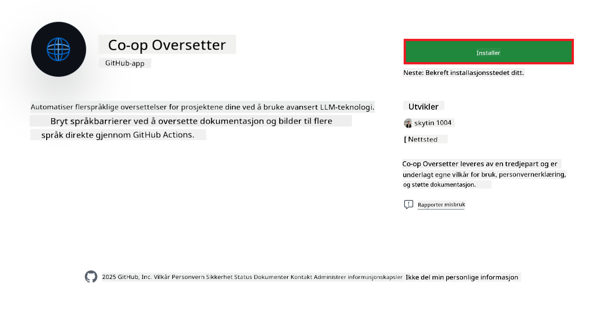
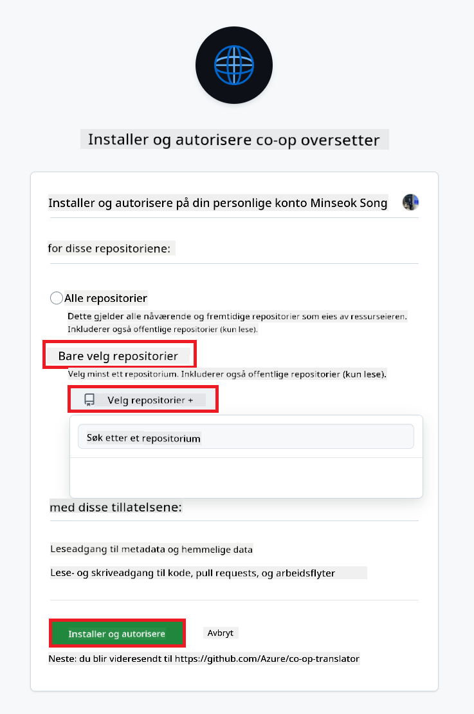
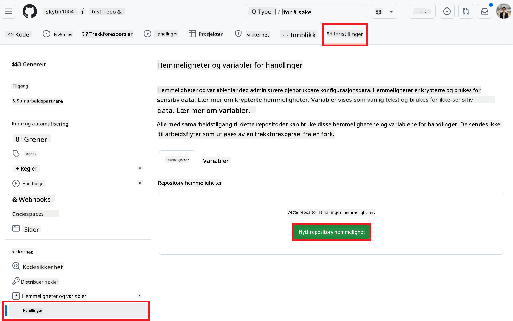
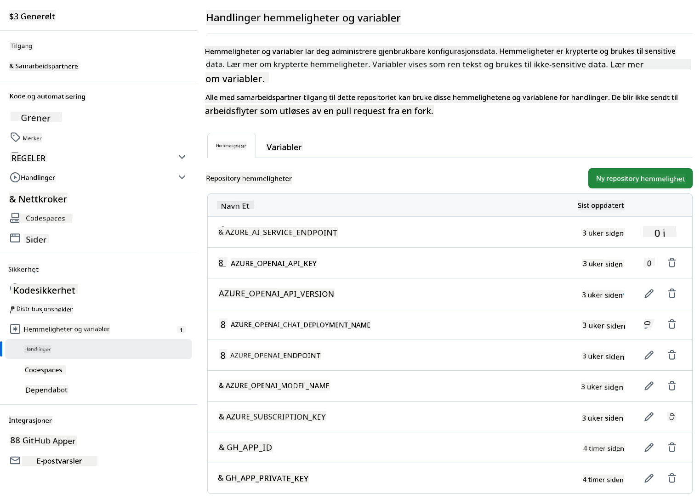

<!--
CO_OP_TRANSLATOR_METADATA:
{
  "original_hash": "c437820027c197f25fb2cbee95bae28c",
  "translation_date": "2025-06-12T19:11:55+00:00",
  "source_file": "getting_started/github-actions-guide/github-actions-guide-org.md",
  "language_code": "no"
}
-->
# Bruke Co-op Translator GitHub Action (Organisasjonsveiledning)

**Målgruppe:** Denne veiledningen er ment for **Microsoft interne brukere** eller **team som har tilgang til nødvendige legitimasjoner for den forhåndsbygde Co-op Translator GitHub Appen** eller som kan lage sin egen tilpassede GitHub App.

Automatiser oversettelsen av dokumentasjonen i ditt repository enkelt ved å bruke Co-op Translator GitHub Action. Denne veiledningen viser deg hvordan du setter opp actionen til automatisk å opprette pull requests med oppdaterte oversettelser når dine kilde-Markdown-filer eller bilder endres.

> [!IMPORTANT]
> 
> **Velge riktig veiledning:**
>
> Denne veiledningen beskriver oppsett ved bruk av **GitHub App ID og en privat nøkkel**. Du trenger vanligvis denne "Organisasjonsveiledning"-metoden hvis: **`GITHUB_TOKEN` Tillatelser er begrenset:** Organisasjonen eller repository-innstillingene dine begrenser standard tillatelser gitt til standard `GITHUB_TOKEN`. Spesielt hvis `GITHUB_TOKEN` ikke har nødvendige `write`-tillatelser (som `contents: write` eller `pull-requests: write`), vil arbeidsflyten i [Offentlig oppsett-veiledning](./github-actions-guide-public.md) mislykkes på grunn av manglende tillatelser. Bruk av en dedikert GitHub App med eksplisitt tildelte tillatelser omgår denne begrensningen.
>
> **Hvis dette ikke gjelder for deg:**
>
> Hvis standard `GITHUB_TOKEN` har tilstrekkelige tillatelser i ditt repository (dvs. du ikke er blokkert av organisasjonsbegrensninger), vennligst bruk **[Offentlig oppsett-veiledning med GITHUB_TOKEN](./github-actions-guide-public.md)**. Den offentlige veiledningen krever ikke at du skaffer eller administrerer App ID-er eller private nøkler, og baserer seg kun på standard `GITHUB_TOKEN` og repository-tillatelser.

## Forutsetninger

Før du konfigurerer GitHub Action, sørg for at du har nødvendige AI-tjeneste-legitimasjoner klare.

**1. Nødvendig: Legitimasjoner for AI-språkmodell**  
Du trenger legitimasjoner for minst én støttet språkmodell:

- **Azure OpenAI**: Krever Endpoint, API-nøkkel, Modell-/Distribusjonsnavn, API-versjon.  
- **OpenAI**: Krever API-nøkkel, (valgfritt: Org ID, Base URL, Modell-ID).  
- Se [Supported Models and Services](../../../../README.md) for detaljer.  
- Oppsettveiledning: [Set up Azure OpenAI](../set-up-resources/set-up-azure-openai.md).

**2. Valgfritt: Legitimasjoner for Computer Vision (for bildeoversettelse)**

- Kun nødvendig hvis du trenger å oversette tekst i bilder.  
- **Azure Computer Vision**: Krever Endpoint og abonnementnøkkel.  
- Hvis ikke oppgitt, går actionen i [Markdown-only mode](../markdown-only-mode.md).  
- Oppsettveiledning: [Set up Azure Computer Vision](../set-up-resources/set-up-azure-computer-vision.md).

## Oppsett og konfigurasjon

Følg disse trinnene for å konfigurere Co-op Translator GitHub Action i ditt repository:

### Trinn 1: Installer og konfigurer GitHub App-autentisering

Arbeidsflyten bruker GitHub App-autentisering for sikkert å interagere med ditt repository (f.eks. opprette pull requests) på dine vegne. Velg ett alternativ:

#### **Alternativ A: Installer den forhåndsbygde Co-op Translator GitHub Appen (for Microsoft intern bruk)**

1. Gå til [Co-op Translator GitHub App](https://github.com/apps/co-op-translator)-siden.

1. Velg **Install** og velg kontoen eller organisasjonen der ditt mål-repository ligger.

    

1. Velg **Only select repositories** og velg ditt mål-repository (f.eks. `PhiCookBook`). Klikk **Install**. Du kan bli bedt om å autentisere.

    

1. **Skaff App-legitimasjoner (intern prosess kreves):** For at arbeidsflyten skal kunne autentisere som appen, trenger du to opplysninger som Co-op Translator-teamet gir:  
  - **App ID:** Den unike identifikatoren for Co-op Translator-appen. App ID er: `1164076`.  
  - **Privat nøkkel:** Du må skaffe **hele innholdet** av `.pem`-filen for privat nøkkel fra vedlikeholderkontakten. **Behandle denne nøkkelen som et passord og oppbevar den sikkert.**

1. Fortsett til Trinn 2.

#### **Alternativ B: Bruk din egen tilpassede GitHub App**

- Hvis du ønsker, kan du opprette og konfigurere din egen GitHub App. Sørg for at den har les- og skrivetilgang til Contents og Pull requests. Du trenger App ID og en generert privat nøkkel.

### Trinn 2: Konfigurer repository secrets

Du må legge til GitHub App-legitimasjoner og AI-tjenestene dine som krypterte secrets i repository-innstillingene.

1. Gå til ditt mål-GitHub-repository (f.eks. `PhiCookBook`).

1. Gå til **Settings** > **Secrets and variables** > **Actions**.

1. Under **Repository secrets**, klikk **New repository secret** for hver av de følgende secrets.

   

**Nødvendige secrets (for GitHub App-autentisering):**

| Secret-navn          | Beskrivelse                                      | Kilde for verdi                                 |
| :------------------- | :----------------------------------------------- | :---------------------------------------------- |
| `GH_APP_ID`          | App ID for GitHub Appen (fra Trinn 1).            | GitHub App-innstillinger                        |
| `GH_APP_PRIVATE_KEY` | **Hele innholdet** av den nedlastede `.pem`-filen. | `.pem`-filen (fra Trinn 1)          |

**AI-tjeneste-secrets (Legg til ALLE som gjelder basert på dine forutsetninger):**

| Secret-navn                         | Beskrivelse                               | Kilde for verdi                     |
| :---------------------------------- | :---------------------------------------- | :------------------------------- |
| `AZURE_SUBSCRIPTION_KEY`            | Nøkkel for Azure AI-tjeneste (Computer Vision)  | Azure AI Foundry                    |
| `AZURE_AI_SERVICE_ENDPOINT`         | Endpoint for Azure AI-tjeneste (Computer Vision) | Azure AI Foundry                     |
| `AZURE_OPENAI_API_KEY`              | Nøkkel for Azure OpenAI-tjeneste              | Azure AI Foundry                     |
| `AZURE_OPENAI_ENDPOINT`             | Endpoint for Azure OpenAI-tjeneste         | Azure AI Foundry                     |
| `AZURE_OPENAI_MODEL_NAME`           | Ditt Azure OpenAI-modellnavn              | Azure AI Foundry                     |
| `AZURE_OPENAI_CHAT_DEPLOYMENT_NAME` | Ditt Azure OpenAI distribusjonsnavn         | Azure AI Foundry                     |
| `AZURE_OPENAI_API_VERSION`          | API-versjon for Azure OpenAI              | Azure AI Foundry                     |
| `OPENAI_API_KEY`                    | API-nøkkel for OpenAI                        | OpenAI Platform                  |
| `OPENAI_ORG_ID`                     | OpenAI organisasjons-ID                    | OpenAI Platform                  |
| `OPENAI_CHAT_MODEL_ID`              | Spesifikk OpenAI modell-ID                  | OpenAI Platform                    |
| `OPENAI_BASE_URL`                   | Tilpasset OpenAI API Base URL                | OpenAI Platform                    |



### Trinn 3: Opprett arbeidsflytfilen

Til slutt, opprett YAML-filen som definerer den automatiserte arbeidsflyten.

1. I rotkatalogen til ditt repository, opprett `.github/workflows/`-mappen hvis den ikke finnes.

1. Inne i `.github/workflows/`, opprett en fil som heter `co-op-translator.yml`.

1. Lim inn følgende innhold i co-op-translator.yml.

```
name: Co-op Translator

on:
  push:
    branches:
      - main

jobs:
  co-op-translator:
    runs-on: ubuntu-latest

    permissions:
      contents: write
      pull-requests: write

    steps:
      - name: Checkout repository
        uses: actions/checkout@v4
        with:
          fetch-depth: 0

      - name: Set up Python
        uses: actions/setup-python@v4
        with:
          python-version: '3.10'

      - name: Install Co-op Translator
        run: |
          python -m pip install --upgrade pip
          pip install co-op-translator

      - name: Run Co-op Translator
        env:
          PYTHONIOENCODING: utf-8
          # Azure AI Service Credentials
          AZURE_SUBSCRIPTION_KEY: ${{ secrets.AZURE_SUBSCRIPTION_KEY }}
          AZURE_AI_SERVICE_ENDPOINT: ${{ secrets.AZURE_AI_SERVICE_ENDPOINT }}

          # Azure OpenAI Credentials
          AZURE_OPENAI_API_KEY: ${{ secrets.AZURE_OPENAI_API_KEY }}
          AZURE_OPENAI_ENDPOINT: ${{ secrets.AZURE_OPENAI_ENDPOINT }}
          AZURE_OPENAI_MODEL_NAME: ${{ secrets.AZURE_OPENAI_MODEL_NAME }}
          AZURE_OPENAI_CHAT_DEPLOYMENT_NAME: ${{ secrets.AZURE_OPENAI_CHAT_DEPLOYMENT_NAME }}
          AZURE_OPENAI_API_VERSION: ${{ secrets.AZURE_OPENAI_API_VERSION }}

          # OpenAI Credentials
          OPENAI_API_KEY: ${{ secrets.OPENAI_API_KEY }}
          OPENAI_ORG_ID: ${{ secrets.OPENAI_ORG_ID }}
          OPENAI_CHAT_MODEL_ID: ${{ secrets.OPENAI_CHAT_MODEL_ID }}
          OPENAI_BASE_URL: ${{ secrets.OPENAI_BASE_URL }}
        run: |
          # =====================================================================
          # IMPORTANT: Set your target languages here (REQUIRED CONFIGURATION)
          # =====================================================================
          # Example: Translate to Spanish, French, German. Add -y to auto-confirm.
          translate -l "es fr de" -y  # <--- MODIFY THIS LINE with your desired languages

      - name: Authenticate GitHub App
        id: generate_token
        uses: tibdex/github-app-token@v1
        with:
          app_id: ${{ secrets.GH_APP_ID }}
          private_key: ${{ secrets.GH_APP_PRIVATE_KEY }}

      - name: Create Pull Request with translations
        uses: peter-evans/create-pull-request@v5
        with:
          token: ${{ steps.generate_token.outputs.token }}
          commit-message: "🌐 Update translations via Co-op Translator"
          title: "🌐 Update translations via Co-op Translator"
          body: |
            This PR updates translations for recent changes to the main branch.

            ### 📋 Changes included
            - Translated contents are available in the `translations/` directory
            - Translated images are available in the `translated_images/` directory

            ---
            🌐 Automatically generated by the [Co-op Translator](https://github.com/Azure/co-op-translator) GitHub Action.
          branch: update-translations
          base: main
          labels: translation, automated-pr
          delete-branch: true
          add-paths: |
            translations/
            translated_images/

```

4.  **Tilpass arbeidsflyten:**  
  - **[!IMPORTANT] Mål-språk:** I `Run Co-op Translator` step, you **MUST review and modify the list of language codes** within the `translate -l "..." -y` command to match your project's requirements. The example list (`ar de es...`) needs to be replaced or adjusted.
  - **Trigger (`on:`):** The current trigger runs on every push to `main`. For large repositories, consider adding a `paths:` filter (see commented example in the YAML) to run the workflow only when relevant files (e.g., source documentation) change, saving runner minutes.
  - **PR Details:** Customize the `commit-message`, `title`, `body`, `branch` name, and `labels` in the `Create Pull Request` step if needed.

## Credential Management and Renewal

- **Security:** Always store sensitive credentials (API keys, private keys) as GitHub Actions secrets. Never expose them in your workflow file or repository code.
- **[!IMPORTANT] Key Renewal (Internal Microsoft Users):** Be aware that Azure OpenAI key used within Microsoft might have a mandatory renewal policy (e.g., every 5 months). Ensure you update the corresponding GitHub secrets (`AZURE_OPENAI_...`-nøklene) **før de utløper** for å unngå at arbeidsflyten feiler.

## Kjøre arbeidsflyten

Når `co-op-translator.yml`-filen er slått sammen i din main branch (eller den grenen som er spesifisert i `on:` trigger), the workflow will automatically run whenever changes are pushed to that branch (and match the `paths`-filteret, hvis konfigurert).

Hvis oversettelser genereres eller oppdateres, vil actionen automatisk opprette en Pull Request med endringene, klar for din gjennomgang og sammenslåing.

**Ansvarsfraskrivelse**:  
Dette dokumentet er oversatt ved hjelp av AI-oversettelsestjenesten [Co-op Translator](https://github.com/Azure/co-op-translator). Selv om vi streber etter nøyaktighet, vennligst vær oppmerksom på at automatiserte oversettelser kan inneholde feil eller unøyaktigheter. Det originale dokumentet på det opprinnelige språket skal anses som den autoritative kilden. For kritisk informasjon anbefales profesjonell menneskelig oversettelse. Vi er ikke ansvarlige for eventuelle misforståelser eller feiltolkninger som oppstår ved bruk av denne oversettelsen.